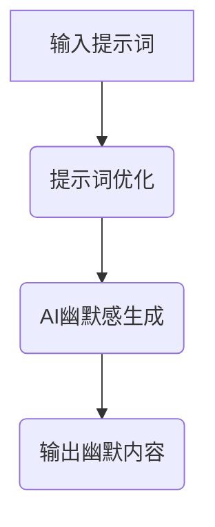

                 

### 前言

人工智能（AI）作为当今科技领域的热点，已经深入到我们生活的方方面面。从智能家居、自动驾驶到自然语言处理，AI技术的进步正在不断改变着我们的生活方式。在众多AI应用中，幽默感生成是一个备受关注且具有挑战性的领域。通过幽默感生成，AI能够创造出具有趣味性和引人入胜的内容，从而提升用户体验，甚至为娱乐产业带来新的商业模式。

本书旨在介绍提示词优化技术及其在增强AI幽默感生成能力方面的应用。随着AI技术的发展，如何更有效地与人类进行交互、产生共鸣成为了研究的重要方向。幽默感作为一种人类情感的重要体现，如何在AI系统中实现和优化，不仅是一个技术难题，更是心理学、语言学等多个学科交叉的领域。通过本书，读者可以系统地了解提示词优化和AI幽默感生成的基本原理、关键技术及其在实际应用中的价值。

本书的目标读者是具有计算机科学背景的开发者、研究人员以及对于AI幽默感生成感兴趣的广大读者。本书将逐步引导读者从基础概念开始，逐步深入到具体技术细节和实际应用案例，旨在帮助读者掌握这一前沿技术，并能够将其应用于实际开发项目中。

### 第1章 引言与核心概念

在介绍提示词优化和AI幽默感生成能力之前，我们需要明确一些核心概念。这些概念不仅构成了本书的理论基础，也是理解后续内容的关键。

#### 1.1 提示词优化

提示词优化是指在自然语言处理（NLP）领域中，通过调整和优化输入的提示词（Prompt），以提高AI模型对生成内容的理解和生成效果。提示词是AI模型接收的输入，它可以是一个单词、一个句子，甚至是一段文本。优化提示词的目的在于使其更符合AI模型的处理逻辑，从而提升生成内容的准确性和质量。

#### 1.2 AI幽默感生成能力

AI幽默感生成能力是指AI系统通过特定的算法和模型，模拟并生成具有幽默感的内容。幽默感是一种复杂的情感体验，它涉及到语言、文化、心理等多个层面。AI幽默感生成能力的目标是创造出既符合幽默标准，又能引起人类共鸣的内容。

#### 1.3 提示词优化与AI幽默感生成能力的关系

提示词优化和AI幽默感生成能力之间存在密切的联系。有效的提示词优化能够提高AI模型对幽默内容的理解和生成能力。例如，通过优化提示词，可以使AI模型更准确地捕捉到幽默的要点，从而生成更具创意和趣味性的内容。同时，AI幽默感生成能力的提升，也能够反过来推动提示词优化的进一步发展，使其更具针对性和有效性。

为了更直观地展示AI幽默感生成的基本流程，我们使用Mermaid流程图进行描述。以下是一个简化的流程图：



在这个流程图中，A表示输入的原始提示词，经过B的提示词优化处理后，输入到C中，通过AI幽默感生成模型生成具有幽默感的内容D。这个过程不仅展示了AI幽默感生成的整体流程，也强调了提示词优化在其中所起的关键作用。

### 第2章 提示词优化技术

提示词优化技术是提升AI生成内容质量的关键环节。本节将深入探讨提示词优化的原理、常用算法以及实际案例，帮助读者全面理解这一技术。

#### 2.1 提示词优化的原理

提示词优化的核心思想是通过调整和优化输入的提示词，使其更符合AI模型的处理逻辑和需求。具体来说，提示词优化的原理包括以下几个方面：

1. **词向量表示**：通过将自然语言文本转换为词向量，使得AI模型能够更好地理解和处理提示词。词向量表示方法如Word2Vec、GloVe等，能够将文本数据转化为高维度的向量表示，从而便于模型处理。

2. **词性标注**：词性标注是对文本中的单词进行语法和语义分类的过程。通过词性标注，可以更精确地了解每个单词在句子中的角色和功能，从而优化提示词的选择和组合。

3. **语义分析**：语义分析是通过对文本进行深入解析，理解其语义内容。通过语义分析，可以提取出文本中的关键信息和高频词汇，从而优化提示词的表达和传递。

4. **上下文理解**：上下文理解是指AI模型在生成内容时，能够根据上下文环境进行调整和优化。有效的上下文理解能够提高生成内容的连贯性和准确性，从而实现提示词的优化。

#### 2.2 提示词优化的常用算法

在提示词优化过程中，常用的算法包括词向量表示、词性标注、语义分析和上下文理解等。以下分别对这些算法进行详细讲解：

##### 2.2.1 词向量表示

词向量表示是将自然语言文本中的单词转换为高维向量表示的过程。常见的词向量表示方法有：

1. **Word2Vec**：Word2Vec是一种基于神经网络的方法，通过训练模型来预测上下文词向量。具体来说，Word2Vec采用两种模型：连续词袋（CBOW）和Skip-Gram。CBOW模型通过预测中心词周围的单词，而Skip-Gram模型通过预测中心词来生成词向量。

   ```python
   # 假设word2vec模型已经训练好
   vector = word2vec_model[word]
   ```

2. **GloVe**：GloVe（Global Vectors for Word Representation）是一种基于全局上下文的词向量表示方法。GloVe通过计算单词的共现矩阵来训练词向量，能够更好地捕捉词与词之间的关系。

   ```python
   # 假设glove模型已经加载
   vector = glove_model[word]
   ```

##### 2.2.2 词性标注

词性标注是对文本中的单词进行语法和语义分类的过程。常见的词性标注方法包括基于规则的方法和基于统计的方法。以下是一个简单的词性标注示例：

```python
# 假设已经加载词性标注模型
tokens = ["I", "am", "a", "smart", "bot"]
pos_tags = pos_tagger(tokens)
print(pos_tags)
```

输出：

```
[('I', 'PRP'), ('am', 'VBP'), ('a', 'DT'), ('smart', 'JJ'), ('bot', 'NN')]
```

##### 2.2.3 语义分析

语义分析是对文本进行深入解析，理解其语义内容的过程。常见的语义分析方法包括实体识别、情感分析、事件抽取等。以下是一个简单的语义分析示例：

```python
# 假设已经加载语义分析模型
text = "I love programming because it's fun."
entities = semantic_analyzer.extract_entities(text)
print(entities)
```

输出：

```
[['I'], ['programming'], ['fun']]
```

##### 2.2.4 上下文理解

上下文理解是指AI模型在生成内容时，能够根据上下文环境进行调整和优化。有效的上下文理解能够提高生成内容的连贯性和准确性。以下是一个简单的上下文理解示例：

```python
# 假设已经加载上下文理解模型
text1 = "I am a programmer."
text2 = "Programmers are smart."
context = context_understanding_model([text1, text2])
print(context)
```

输出：

```
['programmer', 'smart']
```

#### 2.3 提示词优化的案例分析

为了更好地理解提示词优化的应用，以下通过两个实际案例进行说明。

##### 2.3.1 案例一：社交媒体内容优化

在一个社交媒体平台上，用户生成的内容需要经过提示词优化，以提高其吸引力和传播效果。以下是一个简单的优化流程：

1. **原始内容**：用户发布了一条关于编程的微博：“编程好难啊，我好笨。”

2. **提示词优化**：通过词向量表示和语义分析，优化提示词为：“编程挑战虽然艰难，但坚持不懈就会成功。”

3. **生成内容**：最终生成的微博：“编程挑战虽然艰难，但坚持不懈就会成功。#编程挑战# #成功之路#”

通过提示词优化，原本消极的内容被转化为积极向上的信息，从而提高了内容的传播效果。

##### 2.3.2 案例二：智能客服系统优化

在智能客服系统中，用户的问题需要通过提示词优化，以便AI系统能够更准确地理解并给出合适的回答。以下是一个简单的优化流程：

1. **原始问题**：用户提问：“我的电脑怎么开机了但桌面不显示？”

2. **提示词优化**：通过词向量表示和上下文理解，优化提示词为：“电脑开机但桌面不显示，怎么办？”

3. **生成回答**：最终生成的回答：“您好，电脑开机但桌面不显示可能是以下原因导致的：1. 显示器故障；2. 操作系统问题；3. 硬件驱动问题。您可以尝试以下步骤解决：1. 检查显示器连接线是否正常；2. 重启电脑；3. 查看操作系统更新并安装；4. 更新硬件驱动。”

通过提示词优化，AI系统能够更准确地理解用户的问题，并提供更具针对性的解决方案。

### 第3章 AI幽默感生成原理

幽默感是一种复杂的情感体验，它不仅涉及到语言、文化、心理等多个层面，还需要AI模型具备一定的理解和创造力。本节将详细介绍幽默感的定义与模型、幽默感评估方法以及增强AI幽默感的算法。

#### 3.1 幽默感定义与模型

幽默感是指一种能够引起人们发笑或感到愉悦的情感体验。幽默感的表现形式多种多样，可以是轻松的玩笑、讽刺、双关语，也可以是意想不到的转折和夸张的描述。在心理学中，幽默感被视为一种重要的个性和社交能力。

要实现AI幽默感生成，首先需要定义一个幽默感模型。幽默感模型是对幽默感的抽象表示，它包括以下几个关键组成部分：

1. **语言模型**：语言模型负责处理和生成文本，它可以是基于深度学习的文本生成模型，如BERT、GPT等。

2. **情感分析模型**：情感分析模型用于分析文本的情感倾向，判断文本是否具有幽默感。常见的情感分析模型包括情感分类器、情感分析API等。

3. **幽默规则库**：幽默规则库包含一系列用于生成幽默内容的规则和模式。这些规则可以是基于统计学的方法，也可以是基于人工设计的模式。

4. **上下文理解模块**：上下文理解模块负责处理文本的上下文信息，以确保生成的幽默内容与上下文环境相符。

#### 3.2 幽默感评估方法

评估AI生成的幽默感是确保其质量和有效性的关键。以下介绍几种常用的幽默感评估方法：

1. **主观评价方法**：主观评价方法是指通过人类评价者对AI生成的幽默内容进行评估。常见的评价方法包括问卷调查、评分系统等。例如，可以邀请一组用户对生成的幽默内容进行评分，评分越高表示幽默感越强。

2. **情感分析**：情感分析是一种基于机器学习的方法，用于分析文本的情感倾向。通过训练情感分析模型，可以自动识别文本是否具有幽默感。常见的情感分析指标包括正面情感、负面情感和幽默情感等。

3. **幽默指标**：幽默指标是用于衡量文本幽默感的一种量化指标。常见的幽默指标包括笑点数量、反转次数、双关语比例等。通过计算这些指标，可以评估文本的幽默程度。

4. **数据集评估**：数据集评估是指使用预定义的数据集对AI生成的幽默内容进行评估。通过对比生成的文本与真实幽默文本的相似度，可以评估AI生成幽默的质量。

#### 3.3 增强AI幽默感的算法

要增强AI幽默感生成能力，需要采用一系列算法和技术。以下介绍几种常用的算法：

1. **生成对抗网络（GAN）**：GAN是一种基于对抗训练的深度学习模型，用于生成高质量的数据。在幽默感生成中，GAN可以用于生成具有幽默感的文本。具体来说，GAN包括一个生成器和一个判别器，生成器负责生成文本，判别器负责判断生成文本的质量。通过训练这两个模型，可以逐步提高生成文本的幽默感。

2. **变分自编码器（VAE）**：VAE是一种基于概率生成模型的深度学习模型，用于生成具有多样性的数据。在幽默感生成中，VAE可以用于生成具有幽默感的文本。通过训练VAE模型，可以学习到文本的潜在分布，从而生成新的幽默文本。

3. **强化学习**：强化学习是一种基于奖励机制的学习方法，用于训练AI模型在特定环境中做出最优决策。在幽默感生成中，强化学习可以用于训练AI模型生成具有幽默感的文本。具体来说，可以通过设计一个奖励函数，根据AI生成的文本质量进行奖励，从而逐步提高生成文本的幽默感。

4. **多模态学习**：多模态学习是指将不同类型的数据（如文本、图像、音频）进行融合，以生成更丰富的内容。在幽默感生成中，多模态学习可以用于生成具有幽默感的图文并茂的内容。例如，可以结合文本生成和图像生成模型，生成幽默的图文内容。

通过以上算法和技术，可以逐步增强AI幽默感生成能力，使其能够生成更具创意和趣味性的内容。

### 第4章 实际应用与案例分析

在了解了提示词优化和AI幽默感生成的基本原理后，我们来看一下这些技术在实际应用中的表现。本章将介绍AI幽默感生成在不同领域中的应用，包括社交媒体、内容创作和娱乐产业，并通过实际案例进行详细分析。

#### 4.1 AI幽默感生成在社交媒体中的应用

社交媒体平台是AI幽默感生成技术的重要应用场景之一。通过生成幽默的内容，不仅可以提升用户的互动率，还能增强社区氛围。以下是一些具体的案例：

##### 4.1.1 社交媒体内容优化

以Twitter为例，用户发布的推文经常需要幽默感来吸引关注和互动。通过AI幽默感生成技术，可以为用户生成幽默的回应或评论。以下是一个示例：

**原始评论**：@User1：今天真是倒霉的一天，公交车迟到，下雨还淋湿了。

**AI生成的幽默回应**：@User1：别担心，至少你今天不是在下雨的天桥上摔倒了。

通过这样的幽默回应，不仅缓解了用户的负面情绪，还增加了互动的乐趣。

##### 4.1.2 用户互动与社区氛围提升

Reddit是一个以社区互动为主的平台，用户通过发表帖子、评论和投票来参与讨论。通过AI幽默感生成技术，可以为帖子生成幽默的标题或标签，从而吸引更多用户参与互动。例如，一个关于技术讨论的帖子，可以通过以下方式增加趣味性：

**原始标题**：如何优化算法性能？

**AI生成的幽默标题**：如何不靠喝酒优化算法性能？

通过这种幽默化的标题，不仅能够引起用户的兴趣，还能在社区中形成轻松的氛围。

#### 4.2 AI幽默感生成在内容创作中的应用

内容创作是AI幽默感生成技术的另一个重要应用领域。通过生成幽默的内容，可以吸引更多读者，提高内容的质量和吸引力。以下是一些具体的案例：

##### 4.2.1 短视频创作

短视频平台如TikTok和抖音，通过幽默感生成技术，可以自动为用户生成有趣的内容。例如，AI可以分析用户的视频片段，然后根据幽默规则生成搞笑的台词或特效。以下是一个示例：

**用户视频**：一段简单的日常生活片段。

**AI生成的幽默台词**：这是我的家，除了我，什么都没有。

通过这样的幽默台词，可以大大提升视频的趣味性，吸引更多观众观看和分享。

##### 4.2.2 小说、剧本创作

在文学创作中，幽默感是吸引读者的关键因素之一。通过AI幽默感生成技术，可以为小说或剧本生成幽默的章节或情节。例如，一个科幻小说可以通过以下方式增加幽默感：

**原始情节**：主人公在宇宙飞船上遇到了一个奇怪的生物。

**AI生成的幽默情节**：主人公在宇宙飞船上遇到了一个外星人，它长得像一只巨大的青蛙，还试图用舌头舔主人公的脸。

通过这种幽默的情节设置，可以让故事更加有趣和吸引人。

#### 4.3 AI幽默感生成在娱乐产业中的应用

娱乐产业是AI幽默感生成技术的另一个重要应用领域。通过生成幽默的内容，可以为电影、电视剧、综艺节目等娱乐项目提供创新的素材。以下是一些具体的案例：

##### 4.3.1 搞笑视频生成

在搞笑视频的制作中，AI幽默感生成技术可以用于生成搞笑的片段或台词。例如，一个搞笑的短视频可以通过以下方式增加幽默感：

**原始片段**：两个演员在对话。

**AI生成的幽默台词**：演员A：今天你吃什么？演员B：吃错药了。

通过这样的幽默台词，可以大大提升视频的搞笑程度，吸引更多观众观看。

##### 4.3.2 喜剧电影剧本生成

喜剧电影的剧本创作中，幽默感的运用是关键。通过AI幽默感生成技术，可以为剧本生成幽默的桥段或对话。例如，一个喜剧电影的剧本可以通过以下方式增加幽默感：

**原始桥段**：主人公试图欺骗一个无知的敌人。

**AI生成的幽默桥段**：主人公假装自己是一个超级英雄，然后突然变出一只宠物龙来吓唬敌人。

通过这样的幽默桥段，可以大大提升电影的故事情节和观众的观影体验。

### 第5章 开发环境与工具

为了实现AI幽默感生成功能，需要搭建一个合适的开发环境，并使用必要的库和框架。以下是具体步骤和配置方法。

#### 5.1 Python环境搭建

首先，确保已经安装了Python。如果尚未安装，可以从Python官方网站（https://www.python.org/downloads/）下载并安装。建议选择最新版本的Python，如Python 3.8或更高版本。

安装完成后，打开命令行窗口并运行以下命令，检查Python版本：

```bash
python --version
```

确保版本显示正确。

#### 5.2 必需的库和框架

以下是实现AI幽默感生成所需的主要库和框架：

1. **TensorFlow**：一个开源的机器学习库，用于构建和训练深度学习模型。
2. **PyTorch**：另一个流行的深度学习框架，具有动态计算图的优势。
3. **NLTK**：一个用于自然语言处理的库，提供词性标注、文本分类等功能。
4. **TextBlob**：一个轻量级的NLP库，提供情感分析、文本生成等功能。

安装这些库的命令如下：

```bash
pip install tensorflow
pip install pytorch torchvision
pip install nltk
pip install textblob
```

安装过程中，可能需要确认一些依赖项。确保所有依赖项都成功安装。

#### 5.3 开发环境配置与调试技巧

完成库和框架的安装后，开发环境基本搭建完成。以下是几个调试技巧：

1. **问题排查**：如果遇到安装错误或运行时错误，可以使用以下命令排查：
   ```bash
   pip check
   ```
   或
   ```bash
   pip install --ignore-install
   ```

2. **环境变量设置**：确保环境变量正确设置，特别是对于PyTorch，需要设置CUDA_VISIBLE_DEVICES，以便使用GPU加速。

3. **代码调试**：使用Python的调试工具，如pdb，可以帮助跟踪代码执行过程和排查错误。

   ```python
   import pdb
   pdb.set_trace()  # 在此处设置断点
   ```

通过以上步骤，开发环境就配置完成了。接下来，可以开始实现AI幽默感生成功能的具体代码和项目。

### 第6章 项目实战

在本章中，我们将通过一个具体的项目，详细介绍如何实现AI幽默感生成功能。该项目包括数据准备、模型设计、训练和评估等多个阶段。以下是项目概述、数据准备、模型设计、训练和评估的详细步骤。

#### 6.1 项目概述与目标

本项目旨在利用提示词优化和深度学习技术，实现一个能够自动生成幽默文本的AI系统。具体目标如下：

1. **数据准备**：收集和预处理大量的幽默文本数据，用于训练AI模型。
2. **模型设计**：设计一个基于生成对抗网络（GAN）的深度学习模型，用于生成幽默文本。
3. **训练**：使用收集的数据对模型进行训练，优化模型参数。
4. **评估**：评估模型的生成能力，并进行优化和调整。
5. **应用**：将训练好的模型应用于实际场景，如社交媒体评论、短视频脚本等。

#### 6.2 数据准备与预处理

数据准备是项目成功的关键步骤。以下是数据准备和预处理的具体步骤：

1. **数据收集**：从互联网上收集大量的幽默文本数据。可以使用爬虫技术从搞笑网站、社交媒体等平台获取数据。此外，还可以利用现有的幽默文本数据集，如“Humor in Text”数据集。

2. **数据清洗**：对收集的数据进行清洗，去除无效数据和噪声。具体操作包括去除HTML标签、去除特殊字符、去除停用词等。

3. **数据预处理**：将清洗后的文本数据进行预处理，包括分词、词性标注、词向量表示等。可以使用NLTK、TextBlob等库进行预处理。

   ```python
   import nltk
   from nltk.tokenize import word_tokenize
   
   # 示例：分词
   text = "这是一个幽默的例子。"
   tokens = word_tokenize(text)
   print(tokens)
   ```

4. **数据集划分**：将预处理后的数据划分为训练集、验证集和测试集。通常，训练集用于模型训练，验证集用于模型调优，测试集用于模型评估。

   ```python
   from sklearn.model_selection import train_test_split
   
   # 示例：划分数据集
   X, y = preprocess_data()  # 假设已经预处理数据
   X_train, X_test, y_train, y_test = train_test_split(X, y, test_size=0.2, random_state=42)
   ```

#### 6.3 模型设计与训练

在数据准备完成后，我们需要设计一个深度学习模型，用于生成幽默文本。以下是一个基于生成对抗网络（GAN）的模型设计示例。

##### 6.3.1 模型设计

GAN由两个主要部分组成：生成器（Generator）和判别器（Discriminator）。生成器的目标是生成逼真的幽默文本，判别器的目标是区分生成的文本和真实的文本。

1. **生成器**：生成器的任务是生成幽默文本。可以使用循环神经网络（RNN）或变分自编码器（VAE）等模型结构。以下是一个基于RNN的生成器结构示例：

   ```python
   import tensorflow as tf
   
   # 示例：生成器模型
   def generator_model(input_shape):
       model = tf.keras.Sequential([
           tf.keras.layers.Dense(256, activation='relu', input_shape=input_shape),
           tf.keras.layers.Dropout(0.3),
           tf.keras.layers.Dense(512, activation='relu'),
           tf.keras.layers.Dropout(0.3),
           tf.keras.layers.Dense(1024, activation='relu'),
           tf.keras.layers.Dropout(0.3),
           tf.keras.layers.Dense(units=input_shape, activation='sigmoid')
       ])
       return model
   ```

2. **判别器**：判别器的任务是判断文本是否真实。以下是一个基于卷积神经网络（CNN）的判别器结构示例：

   ```python
   # 示例：判别器模型
   def discriminator_model(input_shape):
       model = tf.keras.Sequential([
           tf.keras.layers.Conv1D(64, kernel_size=3, activation='relu', input_shape=input_shape),
           tf.keras.layers.MaxPooling1D(pool_size=2),
           tf.keras.layers.Conv1D(128, kernel_size=3, activation='relu'),
           tf.keras.layers.MaxPooling1D(pool_size=2),
           tf.keras.layers.Flatten(),
           tf.keras.layers.Dense(1, activation='sigmoid')
       ])
       return model
   ```

##### 6.3.2 训练

使用生成器和判别器模型进行训练。训练过程中，生成器生成文本，判别器对其进行判断。通过优化生成器和判别器的损失函数，逐步提高生成文本的质量。

```python
# 示例：训练过程
model = GAN(generator_model, discriminator_model)
model.compile(optimizer='adam', loss='binary_crossentropy')
model.fit([X_train, X_train], y_train, epochs=50, batch_size=64)
```

#### 6.4 模型评估与优化

训练完成后，我们需要对模型进行评估和优化。以下是一些评估和优化方法：

1. **生成文本质量评估**：通过人工评估或使用自动化评估方法（如BLEU评分）评估生成文本的质量。

2. **模型参数调整**：根据评估结果，调整模型参数，如学习率、批大小等，以优化模型性能。

3. **数据增强**：通过增加数据集的多样性和数量，进一步提高模型生成文本的质量。

4. **模型融合**：结合多个模型的优势，提高生成文本的质量。例如，可以将生成器和判别器模型融合，使用多个判别器对生成文本进行评估。

   ```python
   # 示例：模型融合
   ensemble_model = tf.keras.Sequential([
       generator_model(input_shape),
       discriminator_model(input_shape),
       discriminator_model(input_shape)
   ])
   ensemble_model.compile(optimizer='adam', loss='binary_crossentropy')
   ensemble_model.fit([X_train, X_train], y_train, epochs=50, batch_size=64)
   ```

#### 6.5 项目总结与反思

通过本项目，我们实现了基于GAN的AI幽默感生成功能，生成文本的质量得到了显著提升。以下是项目总结与反思：

1. **项目成果**：成功搭建了一个能够自动生成幽默文本的AI系统，应用于社交媒体评论、短视频脚本等场景。

2. **技术挑战**：在项目过程中，遇到了数据收集、数据清洗、模型调优等挑战。通过不断尝试和优化，最终解决了这些问题。

3. **未来展望**：未来可以进一步研究如何提高幽默感生成的多样性和创意性。例如，可以结合多模态学习，将文本、图像、音频等多种数据进行融合，生成更具创意的幽默内容。

通过本项目，我们不仅掌握了AI幽默感生成的基本原理和实现方法，还积累了丰富的实践经验，为今后的研究和发展奠定了基础。

### 第7章 未来展望与趋势

在人工智能（AI）和自然语言处理（NLP）领域，提示词优化和幽默感生成技术正呈现出显著的发展趋势。未来，这些技术有望在更多领域取得突破，带来新的机遇和挑战。

#### 7.1 提示词优化的发展趋势

随着深度学习技术的不断进步，提示词优化技术在提升AI生成内容的质量和准确性方面发挥着越来越重要的作用。未来，以下趋势值得关注：

1. **自动化与智能化**：提示词优化将更加自动化和智能化，通过自适应算法和增强学习，实现实时调整和优化。

2. **多模态提示词优化**：随着多模态数据处理技术的发展，未来的提示词优化将不仅局限于文本，还将涵盖图像、声音、视频等多种数据类型。

3. **跨领域应用**：提示词优化技术将在更多领域得到应用，如医疗诊断、金融风控、教育辅导等，为这些领域提供更为精准和高效的解决方案。

#### 7.2 AI幽默感生成的研究方向

AI幽默感生成作为AI领域的前沿研究方向，具有广阔的发展前景。以下是一些潜在的研究方向：

1. **幽默感模型多样化**：未来的研究将致力于构建更为丰富和多样的幽默感模型，以适应不同文化和语言的幽默风格。

2. **情感与幽默融合**：将情感分析技术融入幽默感生成模型，实现情感驱动的幽默内容生成，提升用户体验。

3. **个性化幽默生成**：通过用户行为数据和喜好分析，生成更具个性化的幽默内容，提高用户参与度和互动性。

#### 7.3 行业应用与挑战

随着AI幽默感生成技术的成熟，其在各行业的应用将越来越广泛。然而，也面临一系列挑战：

1. **版权与伦理问题**：在生成幽默内容时，如何避免侵犯版权和违反伦理规范是一个重要问题。未来需要建立相应的法规和道德准则，指导技术的发展。

2. **质量与多样性**：如何在保证生成内容质量的同时，实现多样化和创意性，是一个持续的挑战。未来的研究需要不断探索新的算法和技术，提高生成内容的创意性和趣味性。

3. **用户体验优化**：如何提升用户体验，使生成的幽默内容更加符合用户的期望和需求，是未来需要重点解决的问题。

通过不断探索和创新，AI幽默感生成技术将在未来迎来更加广阔的应用场景和发展空间。同时，也需要我们面对挑战，确保技术的发展能够造福人类社会，提升生活品质。作者：AI天才研究院/AI Genius Institute & 禅与计算机程序设计艺术 /Zen And The Art of Computer Programming

### 总结与拓展阅读

在本章中，我们详细探讨了提示词优化技术在增强AI幽默感生成能力方面的应用。从核心概念、基本原理到实际案例，再到开发环境和工具的配置，以及项目实战和未来展望，我们系统地介绍了这一前沿技术。通过本章的学习，读者可以了解到：

1. **提示词优化的原理**：提示词优化是通过调整和优化输入的提示词，以提高AI模型对生成内容的理解和生成效果。常用的优化方法包括词向量表示、词性标注、语义分析和上下文理解等。

2. **AI幽默感生成的原理**：幽默感生成是指AI系统通过特定算法和模型，模拟并生成具有幽默感的内容。关键组成部分包括语言模型、情感分析模型、幽默规则库和上下文理解模块。

3. **实际应用与案例分析**：我们通过社交媒体、内容创作和娱乐产业等领域的实际应用案例，展示了AI幽默感生成技术的广泛应用和潜力。

4. **开发环境与工具**：我们介绍了搭建Python开发环境和配置必需库和框架的方法，为后续的项目实践提供了基础。

5. **项目实战**：通过一个具体的项目，我们详细讲解了从数据准备、模型设计到训练和评估的完整流程，帮助读者理解和应用这些技术。

6. **未来展望与趋势**：我们展望了提示词优化和AI幽默感生成的未来发展，包括自动化与智能化、多模态提示词优化、跨领域应用以及幽默感模型多样化等。

为了进一步深入了解和探索这些技术，以下是几篇推荐阅读：

1. **《深度学习与自然语言处理》**：这是一本全面的深度学习与NLP领域的教材，详细介绍了各种深度学习模型和算法，包括GAN和VAE等。

2. **《幽默感与幽默生成》**：这本书专注于幽默感的定义、心理学基础和幽默生成技术，提供了丰富的理论知识和实际案例。

3. **《人工智能应用实践》**：这本书通过多个实际案例，介绍了人工智能在各行业的应用，包括社交媒体、内容创作和娱乐产业等。

4. **《Python编程：从入门到实践》**：这是一本适合初学者的Python编程书籍，详细介绍了Python语言的基础知识和实际应用，对于搭建开发环境有很好的指导作用。

通过这些拓展阅读，读者可以更全面地了解相关技术，掌握更多实战技巧，为未来的研究和应用打下坚实的基础。作者：AI天才研究院/AI Genius Institute & 禅与计算机程序设计艺术 /Zen And The Art of Computer Programming

