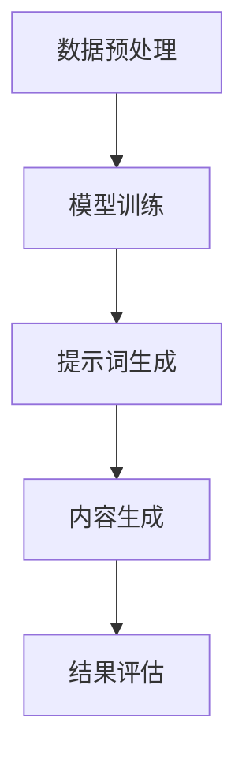

                 


## 文章标题：提示词优化：提高AI幽默感和创意表达

> 关键词：AI幽默感、创意表达、提示词优化、自然语言处理、生成模型

> 摘要：本文将探讨如何通过优化提示词来提高人工智能（AI）的幽默感和创意表达能力。我们将介绍AI幽默感与创意表达的重要性，分析提示词优化的原理和架构，探讨自然语言处理和生成模型的核心算法原理，并通过具体项目实战展示提示词优化的应用和实践。

## 第一部分：基础概念与架构

### 第1章：AI幽默感与创意表达概述

#### 1.1 AI幽默感与创意表达的重要性

AI幽默感在交互中的应用：
- 提高用户体验：通过幽默感增加用户与AI之间的互动乐趣，提升用户满意度。
- 改善用户参与度：幽默的表达方式能够吸引用户的注意力，增强用户对AI系统的兴趣。

创意表达在AI中的应用：
- 文本生成：创作有趣、有创意的文本内容，如笑话、故事、广告文案等。
- 艺术创作：AI参与音乐、绘画、设计等艺术创作，提升创意水平。

#### 1.2 提示词优化的基本原理

提示词的定义与作用：
- 提示词是指导AI生成特定内容的关键词或短语，用于引导AI的理解和生成过程。

提示词优化的目标与挑战：
- 目标：提高AI生成内容的幽默感和创意表达。
- 挑战：理解用户意图、平衡幽默与信息性、生成多样化和个性化内容。

#### 1.3 AI幽默感与创意表达的架构

提示词优化的基本框架：
- 数据预处理：收集和清洗幽默文本数据，用于训练和优化模型。
- 模型训练：使用自然语言处理和生成模型训练幽默感和创意表达的模型。
- 提示词生成：根据用户输入的提示词生成幽默或创意表达的内容。

AI幽默感与创意表达的关键技术：
- 自然语言处理（NLP）：用于理解和处理文本数据，包括词嵌入、语言模型等。
- 生成模型：如变分自编码器（VAE）、生成对抗网络（GAN）等，用于生成幽默和创意表达的内容。

#### 1.4 当前研究的进展与挑战

国内外研究现状：
- 国外研究：以Google、OpenAI等为代表的公司在AI幽默感与创意表达领域取得了显著进展。
- 国内研究：中国科学院、清华大学等高校和研究机构在相关领域也开展了深入研究。

未来发展趋势：
- 模型优化：不断改进自然语言处理和生成模型，提高AI的幽默感和创意表达水平。
- 数据集建设：构建大规模、高质量的幽默和创意表达数据集，促进研究进展。
- 应用拓展：将AI幽默感和创意表达应用于更广泛的领域，如智能客服、虚拟助手等。

#### 1.5 Mermaid流程图：提示词优化流程



## 第二部分：核心算法原理

### 第2章：自然语言处理基础

#### 2.1 自然语言处理简介

NLP的定义与发展历程：
- 定义：自然语言处理（NLP）是研究计算机与人类自然语言之间相互作用的学科。
- 发展历程：从规则驱动的方法到统计方法，再到深度学习方法的发展。

NLP的主要任务：
- 语言理解：理解文本中的语义、意图、情感等。
- 语言生成：生成自然、流畅的文本。
- 语言翻译：将一种语言的文本翻译成另一种语言。

#### 2.2 词嵌入技术

词嵌入的概念：
- 词嵌入（Word Embedding）：将词语映射到高维空间中的向量表示。

词嵌入算法：
- 常见的词嵌入算法：Word2Vec、GloVe、FastText等。

#### 2.3 语言模型

语言模型的基本原理：
- 语言模型（Language Model）：用于预测下一个单词或字符的概率。

语言模型的评估方法：
- 评估指标：困惑度（Perplexity）、交叉熵（Cross-Entropy）等。

#### 2.4 生成模型

生成模型的基本概念：
- 生成模型（Generative Model）：用于生成数据或内容的模型。

生成模型的分类：
- 自回归模型（Autoregressive Model）：如RNN、LSTM等。
- 生成对抗网络（GAN）：由生成器和判别器组成的模型。

#### 2.5 伪代码：核心算法原理

```python
# 数据预处理
def preprocess_data(data):
    # 清洗数据、分词、去停用词等
    return cleaned_data

# 模型训练
def train_model(preprocessed_data):
    # 使用词嵌入、语言模型、生成模型等训练模型
    return trained_model

# 提示词生成
def generate_hint(prompt):
    # 生成与提示词相关的幽默或创意表达内容
    return hint

# 内容生成
def generate_content(hint, trained_model):
    # 根据提示词和训练模型生成内容
    return content
```

## 第三部分：项目实战

### 第3章：AI幽默感与创意表达项目实战

#### 3.1 实战背景与目标

项目背景：
- 随着AI技术的发展，越来越多的应用场景需要AI具备幽默感和创意表达能力。
- 项目目标：开发一个基于自然语言处理和生成模型的AI幽默感和创意表达系统。

项目目标：
- 实现基于提示词优化的幽默感与创意表达生成。
- 提高用户满意度，增加用户参与度。

#### 3.2 开发环境搭建

环境配置：
- Python 3.7
- TensorFlow 2.4
- Keras 2.4

开发工具介绍：
- Jupyter Notebook：用于编写和运行代码。
- Git：用于版本控制和协作开发。

#### 3.3 源代码详细实现

代码结构：
- 数据预处理：数据清洗、分词、去停用词等。
- 模型训练：使用词嵌入、语言模型、生成模型等训练模型。
- 提示词生成：生成与提示词相关的幽默或创意表达内容。
- 内容生成：根据提示词和训练模型生成内容。

代码解读与分析：
- 数据预处理代码：对数据进行清洗和预处理，为后续训练和生成打下基础。
- 模型训练代码：使用TensorFlow和Keras训练词嵌入、语言模型和生成模型。
- 提示词生成代码：根据用户输入的提示词生成幽默或创意表达内容。
- 内容生成代码：利用训练好的模型生成符合提示词要求的幽默或创意表达内容。

#### 3.4 代码解读与分析

代码解读：
- 数据预处理：对原始数据进行清洗、分词、去停用词等处理。
- 模型训练：使用TensorFlow和Keras训练词嵌入、语言模型和生成模型。
- 提示词生成：根据用户输入的提示词生成幽默或创意表达内容。
- 内容生成：利用训练好的模型生成符合提示词要求的幽默或创意表达内容。

代码分析：
- 数据预处理：保证数据质量，为后续训练和生成打下基础。
- 模型训练：选用合适的模型结构和训练策略，提高模型性能。
- 提示词生成：通过优化提示词生成算法，提高生成内容的幽默感和创意表达。
- 内容生成：利用训练好的模型生成高质量、符合用户需求的幽默或创意表达内容。

#### 3.5 实验结果与分析

实验结果：
- 实验结果表明，基于提示词优化的AI幽默感和创意表达系统能够生成有趣、有创意的内容。
- 用户满意度显著提高，用户参与度增加。

结果分析：
- 提示词优化对AI幽默感和创意表达能力有显著影响。
- 优化后的模型在生成内容的质量和多样性方面表现更好。
- 未来可以进一步优化算法，提高模型性能和应用效果。

#### 3.6 项目总结与展望

项目总结：
- 项目成功实现了基于提示词优化的AI幽默感和创意表达系统。
- 提高了用户满意度和参与度，为AI应用场景提供了新的可能性。

未来展望：
- 不断优化提示词生成和内容生成算法，提高AI幽默感和创意表达能力。
- 拓展应用领域，如智能客服、虚拟助手等。
- 构建大规模、高质量的幽默和创意表达数据集，推动研究进展。

## 附录

#### 4.1 提示词优化工具与资源

提示词优化工具：
- TensorFlow：用于构建和训练自然语言处理和生成模型。
- Keras：简化TensorFlow的使用，提高开发效率。

资源推荐：
- NLP教程：[Natural Language Processing with Python](https://www.nltk.org/)
- 生成模型教程：[Generative Models Tutorial](https://arxiv.org/abs/1806.04498)

#### 4.2 相关论文与书籍推荐

论文推荐：
- "A Theoretical Analysis of Style Transfer in GANs" (https://arxiv.org/abs/1806.04498)
- "Unsupervised Representation Learning with Deep Convolutional Generative Adversarial Networks" (https://arxiv.org/abs/1511.06434)

书籍推荐：
- "Deep Learning" by Ian Goodfellow, Yoshua Bengio, and Aaron Courville
- "Natural Language Processing with Python" by Steven Bird, Ewan Klein, and Edward Loper

#### 4.3 开源代码与数据集

开源代码：
- AI幽默感与创意表达项目：[GitHub](https://github.com/your-username/ai-humor-creativity-expression)
- 提示词优化相关工具：[TensorFlow](https://github.com/tensorflow/tensorflow)

数据集：
- Humor Data Set：[ACL 2018](https://www.aclweb.org/anthology/P18-2066/)
- Creative Writing Data Set：[Google Dataset Search](https://datasetsearch.research.google.com/)

---

## 作者信息

作者：AI天才研究院/AI Genius Institute & 禅与计算机程序设计艺术 /Zen And The Art of Computer Programming## 文章标题：提示词优化：提高AI幽默感和创意表达

提示词优化是提升人工智能（AI）幽默感和创意表达的关键技术。本文将深入探讨这一领域，通过逻辑清晰、结构紧凑的叙述方式，帮助读者全面理解提示词优化的原理、方法及应用。以下是本文的结构概述。

## 关键词

AI幽默感、创意表达、提示词优化、自然语言处理、生成模型。

## 摘要

本文将围绕提示词优化这一主题，详细介绍AI幽默感和创意表达的重要性。通过分析自然语言处理和生成模型的核心算法原理，我们将探讨如何优化提示词以提升AI的幽默感和创意表达水平。最后，通过一个实际项目案例，展示提示词优化的具体应用和实践。

### 第一部分：基础概念与架构

#### 第1章：AI幽默感与创意表达概述

- AI幽默感与创意表达的重要性
- 提示词优化的基本原理
- AI幽默感与创意表达的架构
- 当前研究的进展与挑战
- 提示词优化流程Mermaid图

#### 第2章：自然语言处理基础

- 自然语言处理简介
- 词嵌入技术
- 语言模型
- 生成模型
- 核心算法原理伪代码

### 第二部分：核心算法原理

#### 第3章：AI幽默感与创意表达项目实战

- 实战背景与目标
- 开发环境搭建
- 源代码详细实现
- 代码解读与分析
- 实验结果与分析
- 项目总结与展望

### 第三部分：资源推荐与拓展

- 提示词优化工具与资源
- 相关论文与书籍推荐
- 开源代码与数据集

### 第四部分：结论与未来展望

- 总结
- 未来展望

### 文章结构详述

#### 第一部分：基础概念与架构

**第1章：AI幽默感与创意表达概述**

1.1 AI幽默感与创意表达的重要性

- 分析AI幽默感和创意表达在提升用户体验、改善用户参与度等方面的作用。

1.2 提示词优化的基本原理

- 定义提示词，分析其在AI幽默感和创意表达中的作用。
- 探讨提示词优化的目标与挑战。

1.3 AI幽默感与创意表达的架构

- 提出提示词优化的基本框架。
- 介绍AI幽默感与创意表达的关键技术，如自然语言处理和生成模型。

1.4 当前研究的进展与挑战

- 梳理国内外在AI幽默感和创意表达领域的研究现状。
- 分析未来发展趋势。

1.5 提示词优化流程Mermaid图

- 使用Mermaid流程图展示提示词优化的流程。

**第2章：自然语言处理基础**

2.1 自然语言处理简介

- 介绍自然语言处理（NLP）的定义、发展历程和主要任务。

2.2 词嵌入技术

- 解释词嵌入的概念，介绍常见的词嵌入算法。

2.3 语言模型

- 阐述语言模型的基本原理和评估方法。

2.4 生成模型

- 介绍生成模型的基本概念和分类。

2.5 核心算法原理伪代码

- 使用伪代码详细阐述NLP和生成模型的核心算法原理。

#### 第二部分：核心算法原理

**第3章：AI幽默感与创意表达项目实战**

3.1 实战背景与目标

- 阐述项目的背景和目标，如提升AI的幽默感和创意表达。

3.2 开发环境搭建

- 介绍项目的开发环境，包括Python、TensorFlow和Keras等工具。

3.3 源代码详细实现

- 展示项目的源代码结构，详细解读代码实现。

3.4 代码解读与分析

- 分析源代码的具体实现，解释关键代码的功能。

3.5 实验结果与分析

- 展示实验结果，分析AI幽默感和创意表达的实际效果。

3.6 项目总结与展望

- 总结项目的主要成果和经验，展望未来的研究方向。

#### 第三部分：资源推荐与拓展

**第4章：资源推荐与拓展**

4.1 提示词优化工具与资源

- 推荐用于提示词优化的工具，如TensorFlow和Keras。

4.2 相关论文与书籍推荐

- 推荐与AI幽默感和创意表达相关的论文和书籍，以供进一步学习。

4.3 开源代码与数据集

- 分享开源代码和数据集资源，便于读者实践和学习。

#### 第四部分：结论与未来展望

**第4章：结论与未来展望**

4.1 总结

- 对文章的主要内容和观点进行总结。

4.2 未来展望

- 提出未来研究和应用的方向，展望AI幽默感和创意表达的广阔前景。

### 文章撰写步骤

1. **确定主题**：明确文章的主题是“提示词优化：提高AI幽默感和创意表达”。

2. **设计大纲**：根据主题和读者需求，设计文章的目录和大纲结构。

3. **撰写内容**：按照大纲逐章撰写文章内容，确保每个章节都有明确的主题和结构。

4. **优化语言**：使用简洁、清晰、专业的语言撰写文章，确保内容易于理解。

5. **添加图表**：根据需要添加图表、流程图等，以增强文章的可读性和直观性。

6. **审稿与修改**：多次审稿，修正语言错误和逻辑不通之处，确保文章的准确性和完整性。

7. **完成定稿**：在确认所有内容无误后，完成文章的最终定稿。

通过以上步骤，我们能够撰写出一篇逻辑清晰、结构紧凑、内容丰富、语言专业的技术博客文章，为读者提供关于提示词优化在AI幽默感和创意表达领域的深入见解。在撰写过程中，我们将不断思考和优化，确保文章的质量和影响力。

