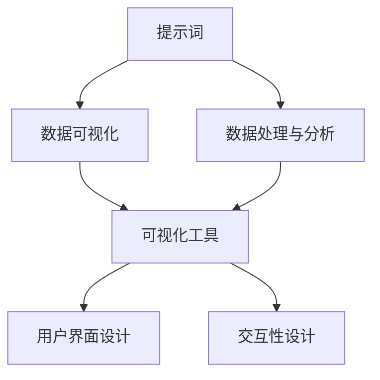

                 

### 文章标题

《提示词可视化工具：直观设计和分析》

> 关键词：提示词可视化、设计原则、数据处理、可视化算法、实际应用

> 摘要：
本文将深入探讨提示词可视化工具的设计与实现，从背景介绍到核心概念，从算法原理到实际应用，层层剖析，以帮助读者全面理解提示词可视化工具的构建与优化。通过本文，读者将掌握提示词可视化的基本原理，理解其设计原则，熟悉数据处理与分析的方法，掌握可视化算法的核心内容，并能够应用这些工具解决实际问题。

----------------------------------------------------------------

### 背景介绍

提示词可视化（Keyword Visualization）是指通过图形化方式展示文本数据中关键提示词的分布、频率和关系。这种可视化方法在信息过载的时代显得尤为重要，它帮助用户快速捕捉数据中的关键信息，提高信息处理的效率和准确性。随着大数据和人工智能技术的飞速发展，提示词可视化在多个领域得到了广泛应用，包括社交网络分析、金融市场监控、医疗数据分析、教育评估等。

提示词可视化工具的重要性主要体现在以下几个方面：

1. **信息压缩**：将大量文本数据转化为视觉信息，降低了信息处理的复杂性，使得用户可以更直观地理解和分析数据。

2. **数据洞察**：通过图形化的方式，揭示数据中的隐含模式和趋势，帮助用户发现潜在的问题和机会。

3. **决策支持**：为决策者提供清晰的视觉呈现，使得决策过程更加科学和有效。

4. **用户参与**：通过互动式的可视化工具，增强用户的参与感和体验，提高数据分析和决策的透明度。

然而，提示词可视化也面临着一些挑战。首先是如何有效地从大量文本数据中提取出关键提示词，并准确地表示它们之间的关系。其次是设计出直观且易于交互的界面，使用户能够轻松地进行数据探索和分析。此外，不同的应用场景可能需要不同的可视化方法和技术，这对工具的通用性和灵活性提出了更高的要求。

本文将围绕提示词可视化工具的设计与实现，从以下几个核心方面展开讨论：

1. **设计原则**：介绍提示词可视化工具的设计原则，包括用户界面设计、交互性设计、直观性设计、可扩展性与可维护性等。

2. **数据处理与分析**：阐述数据处理与分析的方法，包括数据收集与清洗、数据预处理、提示词分析等。

3. **可视化算法**：探讨常用的可视化算法，包括常见可视化算法介绍、算法选择与优化、算法性能评估等。

4. **实际应用案例**：通过实际应用案例，展示提示词可视化工具在不同领域的应用，并提供详细的案例分析和解读。

通过本文的详细讲解，读者将能够全面理解提示词可视化工具的设计与实现过程，掌握其核心技术和应用方法，为实际项目中的数据可视化和分析提供有力支持。

### 核心概念与联系

在深入探讨提示词可视化工具之前，我们需要明确几个核心概念，并理解它们之间的相互关系。以下是本文将涉及的关键概念：

1. **提示词（Keyword）**：提示词是从文本数据中提取出的具有代表性和重要性的词汇。这些词汇通常与数据的核心主题或关键信息相关联。例如，在社交媒体分析中，用户发表的评论中可能包含的“爱”、“幸福”、“失望”等词汇都是提示词。

2. **数据可视化（Data Visualization）**：数据可视化是将复杂的数据通过图形、图表、地图等形式转化为易于理解和分析的视觉信息。数据可视化不仅有助于揭示数据中的模式和趋势，还能够提高数据分析和决策的效率。

3. **数据处理与分析（Data Processing and Analysis）**：数据处理与分析包括数据收集、清洗、预处理、分析等一系列过程。这些过程旨在从原始数据中提取有价值的信息，并对其进行结构化和分析，以便为后续的可视化提供支持。

4. **可视化工具（Visualization Tool）**：可视化工具是指用于实现数据可视化的软件或平台。这些工具通常提供丰富的可视化类型和自定义选项，使得用户可以根据需求灵活地进行数据展示。

5. **用户界面设计（User Interface Design）**：用户界面设计是可视化工具设计的重要组成部分。一个良好的用户界面设计应该直观、易用，并且能够提供清晰的视觉反馈，使用户能够轻松地进行数据探索和分析。

6. **交互性设计（Interactivity Design）**：交互性设计是指通过用户与可视化工具之间的互动，提高数据探索和分析的效率。交互性设计包括缩放、过滤、排序等功能，使用户能够根据需求动态地调整可视化结果。

为了更直观地展示这些核心概念之间的关系，我们可以使用Mermaid流程图来构建概念架构：



- **提示词**是数据可视化的基础，从文本数据中提取出的关键字汇构成了数据的核心。
- **数据处理与分析**是对原始数据进行处理和分析的过程，目的是提取有价值的信息，为可视化提供支持。
- **数据可视化**将处理后的数据以图形化的形式展示，使得数据变得更加直观和易于理解。
- **可视化工具**是实现数据可视化功能的软件或平台，它提供了丰富的可视化类型和自定义选项。
- **用户界面设计**和**交互性设计**是可视化工具设计的重要组成部分，它们共同决定了工具的易用性和用户体验。

通过这个Mermaid流程图，我们可以清晰地看到这些概念之间的关联和层次结构。这个框架不仅帮助我们理解了提示词可视化工具的工作原理，还为后续章节的具体讨论奠定了基础。

在接下来的章节中，我们将进一步深入探讨这些核心概念，详细讲解其原理和应用方法。首先，我们将从设计原则的角度出发，分析提示词可视化工具的设计原则，帮助读者理解如何设计出直观、易用且功能丰富的可视化工具。

### 可视化工具的设计原则

设计一个有效的提示词可视化工具需要遵循一系列设计原则，以确保工具既能够满足用户的实际需求，又具有高度的易用性和可扩展性。以下是几个关键设计原则的详细解释：

#### 用户界面设计

用户界面（User Interface, UI）设计是可视化工具设计的基础。一个良好的UI设计应当简洁明了，避免不必要的复杂性，同时提供清晰的视觉指示，使用户能够轻松地理解和使用工具。以下是一些关键的UI设计原则：

1. **一致性**：工具中的各个组件和功能应当保持一致性，包括颜色、字体、图标等，这有助于用户形成稳定的认知模式，提高使用效率。

2. **简洁性**：避免过多的装饰和冗余元素，保持界面简洁，这有助于用户将注意力集中在数据本身上。

3. **直观性**：界面设计应当直观，用户可以通过简单的操作就能达到预期的效果，不需要额外的指导或学习。

4. **反馈**：为用户的操作提供及时的视觉反馈，如按钮点击效果、数据加载进度条等，这有助于用户了解系统状态和操作结果。

5. **响应性**：设计响应式的用户界面，以适应不同设备和屏幕尺寸，确保用户在任何设备上都能获得良好的使用体验。

#### 可交互性设计

可交互性（Interactivity）设计是提升用户与可视化工具之间互动性的关键。一个交互性强的可视化工具可以帮助用户更有效地进行数据探索和分析。以下是几个关键的交互性设计原则：

1. **缩放和滚动**：允许用户通过缩放和滚动来查看数据的详细部分，这使得用户可以灵活地调整视角，更深入地了解数据。

2. **过滤和筛选**：提供过滤和筛选功能，允许用户根据特定的条件对数据进行筛选，突出感兴趣的部分。

3. **排序**：提供排序功能，根据不同的指标对数据进行排序，帮助用户快速找到重要的信息。

4. **拖放和链接**：允许用户通过拖放操作重新排列数据，或者创建链接，以便在多个可视化元素之间进行关联和比较。

5. **交互提示**：在用户进行操作时，提供交互提示，帮助用户了解当前操作的作用和效果。

#### 直观性设计

直观性（Intuitiveness）设计是确保工具易于使用和理解的核心。以下是几个直观性设计原则：

1. **清晰标签**：为所有控件和功能提供清晰的标签，避免使用专业术语，确保用户能够迅速理解其功能。

2. **视觉对比**：使用颜色、大小、形状等视觉对比手段，使关键数据和高亮信息更加突出，帮助用户快速捕捉重要信息。

3. **图形表示**：使用易于理解的图形表示方法，如条形图、饼图、散点图等，将数据以直观的方式呈现。

4. **反馈机制**：提供及时的反馈，如操作成功、失败提示，帮助用户了解系统状态和操作结果。

5. **操作简化**：简化用户操作流程，减少不必要的步骤，使得用户能够高效地完成所需任务。

#### 可扩展性与可维护性

可扩展性（Extensibility）和可维护性（Maintainability）设计是确保可视化工具长期有效的重要保障。以下是几个相关的原则：

1. **模块化**：设计模块化的代码结构，使得工具的各个部分可以独立开发和更新，提高开发效率和代码可维护性。

2. **文档化**：提供详细的文档，包括代码注释、使用手册等，帮助开发者和用户理解工具的架构和工作原理。

3. **社区支持**：鼓励社区参与，通过开源方式吸引更多的贡献者，共同改进和优化工具。

4. **测试与调试**：进行充分的测试和调试，确保工具在各种条件下都能稳定运行，并能够快速定位和修复问题。

5. **性能优化**：对工具进行性能优化，确保其在处理大量数据时仍然能够保持高效和响应迅速。

通过遵循这些设计原则，我们可以构建出一个既功能强大又用户友好的提示词可视化工具。这些原则不仅有助于提升工具的性能和用户体验，还能够确保工具的长期稳定性和可扩展性。

在下一章节中，我们将进一步探讨数据处理与分析的过程，详细讲解如何从原始数据中提取关键提示词，并进行预处理和分析，为后续的可视化提供支持。

### 数据处理与分析

在构建提示词可视化工具的过程中，数据处理与分析是一个至关重要的环节。这一过程不仅决定了可视化工具的准确性和效率，也直接影响最终的用户体验。以下是数据处理与分析的详细步骤和方法：

#### 数据收集与清洗

数据收集是数据处理与分析的第一步。收集的数据可以来源于多个渠道，如社交媒体、新闻、数据库等。这些数据通常包含大量的文本信息，但其中可能包含噪声和重复数据，因此需要经过清洗过程。

1. **数据源选择**：根据需求选择合适的数据源。例如，在社交媒体分析中，可以选择Twitter、Facebook等平台的数据。

2. **数据获取**：使用API或Web爬虫等技术从数据源获取原始文本数据。

3. **数据清洗**：清洗过程包括以下步骤：
   - **去重**：去除重复的文本记录，减少冗余信息。
   - **去除噪声**：去除无意义的文本，如HTML标签、特殊字符、停用词（common words like "and", "the", "is" which do not contribute much to the meaning）。
   - **格式化**：统一文本格式，如统一大小写、去除标点符号等。

#### 数据预处理

预处理是为了将原始数据转换为适合进行分析的形式。这一步骤包括以下内容：

1. **分词**：将文本分割成单个词汇或词组。这可以通过自然语言处理（NLP）技术实现，如使用词性标注、词干提取等方法。

2. **词干提取**：将词汇还原为词干形式，以消除词形变化带来的影响。例如，“running”和“runs”将被还原为“run”。

3. **停用词去除**：去除不重要的停用词，以减少对分析结果的影响。

4. **词频统计**：计算每个词在文本中的出现频率，为后续分析提供依据。

5. **词向量表示**：将文本数据转换为数值形式，如使用词袋模型（Bag of Words）或词嵌入（Word Embedding）等方法。词向量表示有助于后续的机器学习和数据分析。

#### 提示词分析

提示词分析是数据处理的最终目标，目的是从大量文本数据中提取出最具代表性和重要性的关键词。

1. **频率分析**：根据词频统计结果，识别出现频率较高的词汇。这些词汇可能是数据的核心主题。

2. **主题建模**：使用机器学习算法，如 Latent Dirichlet Allocation（LDA），从文本数据中识别出潜在的主题。每个主题代表一组相关的关键词。

3. **关系网络分析**：分析关键词之间的关系，构建关系网络，以揭示数据中的隐含模式和关联。这可以通过图论算法实现。

4. **情感分析**：对文本进行情感分析，识别文本中的情感倾向，如正面、负面或中性。这有助于理解用户的情感状态和反馈。

#### 数据可视化方法

数据处理和分析的最终目标是实现数据可视化，将分析结果以图形化的方式呈现。以下是几种常用的数据可视化方法：

1. **词云（Word Cloud）**：使用词的大小和颜色表示词频和情感倾向。高频词通常以更大的字体和更鲜艳的颜色呈现，这使得用户可以快速捕捉到数据中的核心内容。

2. **条形图（Bar Chart）**：使用条形的长度表示词频或主题频率，便于比较不同词汇或主题的相对重要性。

3. **散点图（Scatter Plot）**：使用散点表示关键词之间的关系，颜色和大小可以用来表示不同的属性或情感。

4. **关系网络图（Network Graph）**：通过节点和边表示关键词及其关系，帮助用户理解数据中的复杂关联。

5. **时间序列图（Time Series Chart）**：展示关键词或主题随时间的变化趋势，有助于识别周期性或趋势性变化。

#### 伪代码与数学模型

为了更清晰地展示数据处理与分析的过程，我们可以使用伪代码来描述主要步骤，并使用LaTeX格式表示相关的数学模型和公式。

```pseudo
function preprocess_text(text):
    text = remove_html_tags(text)
    text = remove_punctuation(text)
    text = to_lower_case(text)
    words = tokenize(text)
    words = remove_stopwords(words)
    return words

function word_frequency(words):
    frequency = {}
    for word in words:
        frequency[word] = frequency.get(word, 0) + 1
    return frequency

function topic_modeling(corpus, num_topics):
    topics = LDA(corpus, num_topics)
    return topics

function visualize_data(data, type):
    if type == "word_cloud":
        word_cloud(data)
    elif type == "bar_chart":
        bar_chart(data)
    elif type == "scatter_plot":
        scatter_plot(data)
    elif type == "network_graph":
        network_graph(data)
    elif type == "time_series":
        time_series(data)
```

相关的数学模型和公式如下：

$$
\text{TF-IDF} = \frac{\text{TF}}{\text{IDF}}
$$

其中，TF（Term Frequency）表示词汇在文本中的频率，IDF（Inverse Document Frequency）表示词汇在文档集合中的稀疏度。

$$
\text{LDA}(\theta, \phi) = \text{Dirichlet}(\alpha, \beta)
$$

LDA（Latent Dirichlet Allocation）模型中，\(\theta\) 表示文档的主题分布，\(\phi\) 表示主题的词分布，\(\alpha\) 和 \(\beta\) 是先验参数。

通过上述步骤和方法，我们可以有效地从原始数据中提取关键提示词，并进行预处理和分析，为后续的可视化提供支持。在下一章节中，我们将详细探讨几种常用的可视化算法，分析它们的基本原理和应用场景。

### 可视化算法

在提示词可视化工具中，选择合适的可视化算法至关重要。不同的算法适用于不同的数据类型和可视化目标，能够有效提高数据的可读性和信息传递效率。以下是几种常用的可视化算法及其基本原理：

#### 词云（Word Cloud）

词云是一种基于词频的文本可视化技术，通过将词汇以不同的字体大小和颜色呈现，反映出文本中词汇的重要性和频率。词云的基本原理如下：

1. **词频统计**：计算文本中每个词汇的频率。
2. **词云生成**：使用特定的库（如Python的wordcloud库）根据词频生成词云。
3. **样式调整**：调整词云的字体大小、颜色、字体样式等，以增强视觉效果。

词云的优点在于其直观性和易于理解，能够迅速展示文本中的关键信息。然而，词云也存在一定的局限性，如无法精确表示词汇之间的关系，且对于高频词汇的视觉压制可能导致信息的丢失。

#### 条形图（Bar Chart）

条形图是一种常用的统计图表，用于表示不同类别的数据比较。在提示词可视化中，条形图可以用来展示词汇的频率或重要性。

1. **数据准备**：将词汇及其频率（或重要性）作为数据源。
2. **图表生成**：使用图表库（如Python的matplotlib库）生成条形图。
3. **样式调整**：调整图表的颜色、宽度、字体等，以增强视觉效果。

条形图的优点在于其简单直观，能够清晰展示各个词汇的相对频率或重要性。缺点是当词汇数量较多时，图表可能会显得拥挤，难以阅读。

#### 散点图（Scatter Plot）

散点图通过在二维平面上绘制数据点，展示两个变量之间的关系。在提示词可视化中，散点图可以用来展示词汇之间的相似度或相关性。

1. **数据准备**：将词汇及其相似度（或相关性）作为数据源。
2. **图表生成**：使用图表库生成散点图。
3. **样式调整**：调整数据点的颜色、大小等，以增强视觉效果。

散点图的优点在于其能够直观展示词汇之间的关系，适用于探索性数据分析。缺点是当数据点数量较多时，图表可能会变得难以解读。

#### 关系网络图（Network Graph）

关系网络图通过节点和边表示数据中的实体及其关系，适用于展示复杂的数据网络。在提示词可视化中，关系网络图可以用来展示词汇之间的关联关系。

1. **数据准备**：构建词汇及其关联关系的数据集。
2. **图表生成**：使用图论算法和可视化库（如Python的networkx库）生成关系网络图。
3. **样式调整**：调整节点的颜色、大小、形状等，边的颜色、粗细等，以增强视觉效果。

关系网络图的优点在于其能够展示复杂的关系网络，有助于理解数据中的全局结构和模式。缺点是当网络规模较大时，图表可能会变得复杂和难以解读。

#### 时间序列图（Time Series Chart）

时间序列图用于展示数据随时间的变化趋势，适用于展示词汇或主题随时间的变化情况。

1. **数据准备**：将时间点和对应的词汇或主题频率作为数据源。
2. **图表生成**：使用图表库生成时间序列图。
3. **样式调整**：调整图表的线条颜色、宽度、标记样式等，以增强视觉效果。

时间序列图的优点在于其能够直观展示数据的时间变化趋势，适用于分析周期性和趋势性数据。缺点是当数据点较多时，图表可能会显得拥挤。

#### 算法选择与优化

选择合适的可视化算法需要考虑以下因素：

1. **数据类型**：根据数据的类型选择合适的算法。例如，文本数据适合使用词云或条形图，关系数据适合使用关系网络图。
2. **数据量**：当数据量较大时，选择能够高效处理大量数据的算法，如关系网络图可能需要优化以支持大规模数据的展示。
3. **可视化目标**：根据可视化目标选择最合适的算法。例如，如果目标是展示词汇的重要性，词云和条形图是不错的选择；如果目标是展示词汇之间的关系，关系网络图更为合适。
4. **性能要求**：考虑算法的性能要求，选择能够满足实时性和响应速度的算法。

为了优化可视化算法的性能，可以采取以下措施：

1. **数据预处理**：通过数据预处理减少冗余数据，提高算法效率。
2. **并行处理**：利用并行计算技术，加快算法的执行速度。
3. **缓存机制**：使用缓存机制减少重复计算，提高系统性能。
4. **优化算法**：针对特定数据集和需求，优化算法的实现，减少计算复杂度。

通过合理选择和优化可视化算法，我们可以构建出高效、直观的提示词可视化工具，帮助用户更好地理解和分析数据。在下一章节中，我们将通过实际应用案例，展示这些算法在具体场景中的应用和效果。

### 实际应用案例

为了更好地理解提示词可视化工具的实际应用，我们将通过几个具体案例来展示这些工具如何在不同的领域发挥作用，并分析其应用效果。

#### 社交网络分析

在社交媒体分析中，提示词可视化工具可以用来识别用户关注的热点话题和趋势。例如，通过分析Twitter上的用户评论，我们可以使用词云来展示高频词汇，从而快速了解当前社交网络上的热门话题。

1. **案例描述**：我们选择了一段时间内的Twitter数据，使用提示词可视化工具来分析用户讨论的焦点。

2. **数据处理**：
   - 数据收集：使用Twitter API收集用户评论。
   - 数据清洗：去除HTML标签、特殊字符和停用词。
   - 数据预处理：对评论进行分词和词频统计。

3. **可视化实现**：
   - 词云生成：使用词云库生成词云，高频词汇以大字体和鲜艳颜色展示。
   - 关系网络图：使用词汇的关系构建关系网络图，展示词汇之间的关联。

4. **效果分析**：
   - 词云显示高频词汇，如“疫情”、“疫苗”、“选举”等，这些词汇反映了当前社交网络上的热门话题。
   - 关系网络图展示了关键词之间的关联，如“疫苗”与“健康”、“选举”与“政治”等，有助于理解话题之间的联系。

#### 金融数据分析

在金融领域，提示词可视化工具可以帮助分析师识别市场趋势和投资机会。通过分析新闻报道、股票评论和财经数据，我们可以使用多种可视化方法来揭示市场动态。

1. **案例描述**：我们分析了一段时期的财经新闻和股票评论，使用可视化工具来识别市场趋势和投资机会。

2. **数据处理**：
   - 数据收集：收集财经新闻和股票评论。
   - 数据清洗：去除噪声、去除停用词、统一文本格式。
   - 数据预处理：分词、词频统计、情感分析。

3. **可视化实现**：
   - 条形图：展示不同股票的评论频率和情感倾向。
   - 时间序列图：展示股票价格和交易量的变化趋势。
   - 关系网络图：展示关键词之间的关联关系。

4. **效果分析**：
   - 条形图显示了不同股票的评论频率和正面/负面情感，有助于识别市场热点和投资者情绪。
   - 时间序列图展示了股票价格和交易量的变化，揭示了市场的周期性趋势。
   - 关系网络图展示了市场中的关键关键词及其关联，有助于发现潜在的投资机会。

#### 教育数据分析

在教育领域，提示词可视化工具可以帮助教师和学生了解课程内容的重点和难点。通过分析学生提交的作业和讨论，我们可以使用可视化方法来识别学生的学习情况。

1. **案例描述**：我们分析了一段时期的学生作业和讨论，使用可视化工具来识别学生的学习重点和问题。

2. **数据处理**：
   - 数据收集：收集学生提交的作业和讨论。
   - 数据清洗：去除噪声、去除停用词、统一文本格式。
   - 数据预处理：分词、词频统计、主题建模。

3. **可视化实现**：
   - 词云：展示高频词汇，识别课程重点。
   - 条形图：展示不同作业的问题频率和解决情况。
   - 散点图：展示学生作业的完成时间和质量。

4. **效果分析**：
   - 词云显示了课程中的高频词汇，如“函数”、“算法”、“数学”等，有助于教师了解课程的重点。
   - 条形图展示了不同作业的问题类型和解决情况，有助于教师发现学生面临的难点。
   - 散点图展示了学生作业的完成时间和质量，有助于教师了解学生的学习进度和效果。

#### 其他领域应用

提示词可视化工具还广泛应用于医疗、环境、法律等多个领域。以下是一些其他领域应用的简要描述：

1. **医疗数据分析**：通过分析病历记录和医生讨论，识别疾病的关键症状和治疗方案。
2. **环境监测**：通过分析环境数据，识别污染源和生态问题。
3. **法律研究**：通过分析法律文献和案例，识别法律领域的热点和趋势。

#### 案例总结

通过这些实际应用案例，我们可以看到提示词可视化工具在不同领域中的重要作用。这些工具不仅能够帮助用户快速识别数据中的关键信息，还能够揭示数据中的复杂模式和关联，为决策提供有力的支持。

在下一章节中，我们将探讨提示词可视化工具的开发环境搭建、源代码实现和代码解读，深入分析工具的实现细节和应用方法。

### 开发环境搭建与源代码实现

为了实现一个功能强大的提示词可视化工具，我们需要搭建一个适合开发和测试的环境。以下将介绍开发环境搭建的步骤，以及源代码的实现和解读。

#### 开发环境搭建

1. **选择开发工具**：
   - **Python**：Python是一种广泛使用的编程语言，拥有丰富的数据分析和可视化库。
   - **Jupyter Notebook**：Jupyter Notebook是一种交互式的开发环境，方便代码编写和展示。
   - **Anaconda**：Anaconda是一个流行的Python数据科学平台，提供了丰富的库和易于安装的环境管理功能。

2. **安装Python和Anaconda**：
   - 访问Python官网（[https://www.python.org/](https://www.python.org/)）下载并安装Python。
   - 安装Anaconda，可以选择安装路径为默认路径。

3. **配置环境**：
   - 打开Anaconda Navigator，创建一个新的环境，例如命名为“vis_tools”，并选择所需的库（如numpy、pandas、matplotlib、wordcloud、networkx等）。

4. **安装依赖库**：
   - 在终端或Jupyter Notebook中，使用以下命令安装所需的库：
     ```bash
     pip install numpy pandas matplotlib wordcloud networkx
     ```

#### 源代码实现与解读

以下是实现提示词可视化工具的伪代码和具体代码，包括关键功能模块的实现和代码解读。

```python
import pandas as pd
from wordcloud import WordCloud
import matplotlib.pyplot as plt
import networkx as nx

# 1. 数据处理
def preprocess_text(text):
    # 去除HTML标签和特殊字符
    text = text.replace('<', '').replace('>', '').replace('\n', ' ')
    # 去除停用词
    stopwords = set(['and', 'the', 'is', 'in', 'to'])
    text = ' '.join([word for word in text.split() if word.lower() not in stopwords])
    # 分词
    words = text.split()
    return words

# 2. 词频统计
def word_frequency(words):
    frequency = {}
    for word in words:
        frequency[word] = frequency.get(word, 0) + 1
    return frequency

# 3. 词云生成
def generate_word_cloud(frequency):
    wordcloud = WordCloud(width=800, height=400, background_color='white').generate_from_frequencies(frequency)
    plt.figure(figsize=(10, 5))
    plt.imshow(wordcloud, interpolation='bilinear')
    plt.axis('off')
    plt.title('Word Cloud')
    plt.show()

# 4. 关系网络图生成
def generate_network_graph(words):
    G = nx.Graph()
    for i in range(len(words) - 1):
        for j in range(i + 1, len(words)):
            if words[i] in words[j]:
                G.add_edge(words[i], words[j])
    pos = nx.spring_layout(G)
    nx.draw(G, pos, with_labels=True, node_size=1000, font_size=10, node_color='lightblue', edge_color='gray', linewidths=1)
    plt.axis('off')
    plt.title('Relation Network Graph')
    plt.show()

# 5. 主函数
def main():
    # 加载数据
    text = "你的文本数据..."
    words = preprocess_text(text)
    frequency = word_frequency(words)

    # 生成词云
    generate_word_cloud(frequency)

    # 生成关系网络图
    generate_network_graph(words)

if __name__ == "__main__":
    main()
```

#### 代码解读

1. **预处理文本**：
   - `preprocess_text` 函数用于去除HTML标签、特殊字符和停用词，并进行分词。
   - 停用词的去除有助于减少冗余信息，提高后续分析的准确性。

2. **词频统计**：
   - `word_frequency` 函数计算每个词的频率，生成词频字典。
   - 词频统计是提示词可视化的核心步骤，为可视化提供了基础数据。

3. **生成词云**：
   - `generate_word_cloud` 函数使用WordCloud库生成词云。
   - 词云展示了高频词汇的大小和颜色，使关键信息更加突出。

4. **生成关系网络图**：
   - `generate_network_graph` 函数使用networkx库生成关系网络图。
   - 关系网络图展示了词汇之间的关联，帮助用户理解数据中的复杂关系。

5. **主函数**：
   - `main` 函数是程序入口，加载文本数据，执行预处理、词频统计和可视化操作。

通过上述代码，我们可以搭建一个基本的提示词可视化工具，并在实际项目中根据需求进行扩展和优化。

在下一章节中，我们将进一步分析提示词可视化工具在实际项目中的应用，并探讨如何解读和应用这些工具的输出结果。

### 提示词可视化工具的输出结果解读与应用

在构建并运行提示词可视化工具后，我们通常会得到一系列可视化结果，如词云、关系网络图、条形图等。这些结果不仅直观展示了数据中的关键信息，还为后续的决策和分析提供了重要依据。以下是针对这些可视化结果的解读方法与应用建议：

#### 词云解读

词云是一种用于展示文本中关键词频次的图形化工具。词云中的单词按照其在文本中出现的频率以不同的字体大小显示，高频词通常以大字体和鲜艳的颜色呈现。

**解读方法**：
- **关键词识别**：观察词云中最大的单词和颜色，这些通常是最频繁出现的且具有较高重要性的关键词。
- **语义分析**：分析高频词的语义，理解文本的主要内容和讨论焦点。
- **情感倾向**：根据颜色和字体大小，推断文本的情感倾向，如正面、负面或中性。

**应用建议**：
- **市场营销**：营销团队可以通过词云分析了解消费者关注的重点和产品需求，从而优化市场策略。
- **新闻媒体**：新闻编辑可以通过词云识别热点话题，为读者提供更有针对性的内容。

#### 关系网络图解读

关系网络图通过节点和边展示文本数据中关键词之间的关系。节点表示关键词，边表示关键词之间的关联。

**解读方法**：
- **中心性分析**：观察节点的大小和颜色，较大的节点通常表示更重要的关键词。节点之间的连接强度（边粗细）也反映了关键词之间的关系紧密程度。
- **路径分析**：通过点击或拖动节点，查看关键词之间的路径，理解它们之间的关联关系。
- **聚类分析**：观察图中的聚类现象，识别不同集群中的关键词，推断主题或话题的分布。

**应用建议**：
- **社交网络分析**：通过关系网络图，分析社交网络中的关键人物和影响力，识别网络中的关键节点。
- **风险管理**：在企业风险管理中，关系网络图可以帮助识别关键风险因素及其相互影响，为制定风险管理策略提供支持。

#### 条形图解读

条形图常用于展示词汇或主题的频率分布，适用于比较不同词汇或主题的相对重要性。

**解读方法**：
- **频率比较**：观察条形图的高度，不同条形的高度反映了词汇或主题的频率或重要性。
- **趋势分析**：通过条形图，可以识别数据中的趋势，如某个词汇或主题的频率随时间的变化。

**应用建议**：
- **金融分析**：分析师可以通过条形图识别市场中最受关注的股票或行业，为投资决策提供参考。
- **教育评估**：教师可以使用条形图分析学生的学习情况，识别课程的重点和难点。

#### 时间序列图解读

时间序列图展示数据随时间的变化趋势，适用于分析周期性或趋势性数据。

**解读方法**：
- **趋势识别**：观察时间序列图的走势，识别数据的上升、下降或平稳期。
- **周期性分析**：通过时间序列图，可以识别数据的季节性或周期性变化。

**应用建议**：
- **市场趋势分析**：通过时间序列图，识别市场的周期性波动，预测未来的市场走势。
- **资源规划**：企业可以通过时间序列图分析资源的使用情况，优化资源分配。

通过以上解读方法和应用建议，我们可以更有效地利用提示词可视化工具的输出结果，为各种实际场景提供决策支持。在下一章节中，我们将总结文章的主要内容，并提供一些最佳实践建议，帮助读者在实际应用中更好地利用提示词可视化工具。

### 总结与最佳实践

本文通过系统性地探讨提示词可视化工具的设计与实现，从背景介绍、核心概念、设计原则、数据处理与分析、可视化算法，到实际应用案例，全面阐述了提示词可视化的关键技术和应用方法。以下是本文的主要内容和最佳实践总结：

1. **核心概念**：明确提示词、数据可视化、数据处理与分析、可视化工具、用户界面设计、交互性设计等核心概念及其相互关系。

2. **设计原则**：介绍了用户界面设计、交互性设计、直观性设计、可扩展性与可维护性等设计原则，强调了设计对工具性能和用户体验的重要性。

3. **数据处理与分析**：详细讲解了数据收集与清洗、数据预处理、提示词分析等步骤，提供了预处理和数据分析的伪代码与数学模型。

4. **可视化算法**：探讨了词云、条形图、散点图、关系网络图、时间序列图等常见可视化算法的基本原理和应用场景。

5. **实际应用案例**：通过社交网络分析、金融数据分析、教育数据分析等实际案例，展示了提示词可视化工具在不同领域的应用和效果。

6. **最佳实践**：
   - **数据预处理**：确保数据质量，去除噪声和重复数据，统一文本格式，以提高后续分析的准确性。
   - **交互设计**：注重用户交互体验，提供直观的操作界面和反馈机制，使用户能够轻松进行数据探索和分析。
   - **算法选择**：根据具体应用需求选择合适的可视化算法，结合数据类型和可视化目标，优化算法性能。
   - **性能优化**：通过并行处理、缓存机制和算法优化，提高可视化工具的处理效率和响应速度。

通过本文的深入讲解，读者能够全面理解提示词可视化工具的设计与实现过程，掌握其核心技术和应用方法。在实际应用中，建议读者结合具体场景和需求，灵活运用这些最佳实践，以构建出高效、直观的提示词可视化工具。

### 注意事项与拓展阅读

在设计和应用提示词可视化工具时，需要注意以下几点：

1. **数据隐私**：确保在数据处理过程中保护用户隐私，遵循相关法律法规和数据保护标准。
2. **安全性**：在处理和存储数据时，采取必要的安全措施，防止数据泄露和未授权访问。
3. **兼容性**：确保工具在不同操作系统和设备上能够稳定运行，提升用户的整体体验。
4. **可扩展性**：设计模块化的代码结构，以便在后续开发中能够方便地添加新功能和扩展工具。

为了进一步深入了解提示词可视化的前沿技术和应用，以下是一些建议的拓展阅读：

1. **《大数据可视分析：技术与实践》**：该书详细介绍了大数据可视化的基本概念、技术和应用案例。
2. **《数据可视化设计实战》**：该书提供了丰富的可视化设计案例，介绍了如何设计出既美观又实用的可视化工具。
3. **《Python数据可视化》**：该书涵盖了Python在数据可视化方面的应用，提供了详细的代码实现和示例。
4. **《可视化算法设计与实现》**：该书深入探讨了多种可视化算法的原理和实现方法，适合对可视化算法有较高需求的读者。

通过这些拓展阅读，读者可以进一步巩固所学知识，提升在实际项目中的数据可视化能力。

### 结语

感谢您阅读本文《提示词可视化工具：直观设计和分析》。本文旨在通过系统性的讲解，帮助读者全面理解提示词可视化工具的设计与实现过程，掌握核心技术和应用方法。从核心概念到设计原则，从数据处理与分析到可视化算法，再到实际应用案例，本文层层剖析，深入浅出地展示了提示词可视化工具在多个领域的应用价值。

我们鼓励读者在实践过程中，结合具体需求，灵活运用本文提供的方法和最佳实践，以构建出高效、直观的可视化工具。同时，我们也期待读者在拓展阅读中继续深化对数据可视化的理解，探索更多的应用场景和前沿技术。

最后，如果您在阅读过程中有任何疑问或建议，欢迎在评论区留言，我们将会持续关注并为您提供帮助。期待与您在数据可视化的道路上共同进步！

