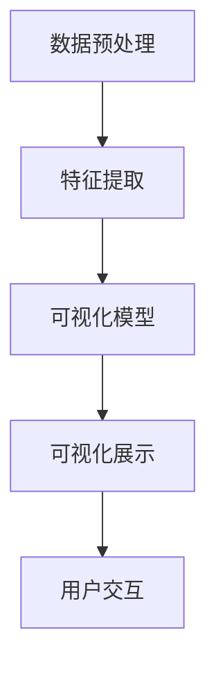

                 

### 文章标题：提示词可视化：直观理解提示结构

#### 关键词：提示词可视化、提示结构、数据可视化、机器学习、算法原理

#### 摘要：
本文深入探讨了提示词可视化技术，旨在通过直观的提示结构展示，帮助读者更好地理解其背后的原理和实现。文章首先介绍了提示词可视化的概念和重要性，随后详细阐述了相关的技术背景，包括数据可视化和机器学习。接着，文章通过核心概念解析和Mermaid流程图展示了提示词可视化架构，并使用伪代码和数学公式详细讲解了核心算法原理。最后，文章讨论了提示词可视化的应用场景，并通过实际项目案例提供了实战经验和分析。

---

### 引言与背景

#### 1.1 提示词可视化的概念

提示词可视化（Term Visualization）是一种将文本数据中的关键术语或短语通过图形化方式展现的技术。它的目的是帮助用户快速理解和分析大量文本数据，通过视觉方式揭示数据中的模式和趋势。

#### 1.2 提示词可视化的重要性

随着互联网和大数据的快速发展，文本数据的规模和复杂性不断增加。传统的文本分析方法已经难以满足日益增长的需求。提示词可视化作为一种新型的数据分析工具，具有以下几个重要优势：

- **提升数据理解能力**：通过视觉化的方式，用户可以更直观地发现数据中的模式和关联。
- **增强信息传递效率**：图形化展示能够以更高效的方式传递信息，减少沟通中的误解和歧义。
- **辅助决策制定**：提示词可视化可以辅助数据分析师和决策者快速识别关键信息，做出更为明智的决策。

#### 1.3 提示词可视化的发展历程

提示词可视化的概念最早可以追溯到20世纪90年代，随着数据可视化和机器学习技术的不断发展，提示词可视化也逐渐成熟。其主要发展历程如下：

- **早期研究**：1990年代，研究人员开始探索如何将文本数据通过图形方式展现，如关键词云（Keyword Cloud）和词频图（Term Frequency Plot）。
- **技术成熟**：2000年后，随着机器学习算法和数据可视化技术的进步，提示词可视化技术得到了快速发展，涌现出了一系列高效的算法和工具。
- **实际应用**：近年来，提示词可视化技术已经广泛应用于商业智能、文本分析、社交媒体分析等领域，成为数据科学和人工智能领域的重要工具。

### 相关技术概述

#### 2.1 数据可视化技术

数据可视化（Data Visualization）是将数据转化为图形或图表，以帮助人们直观地理解数据的技术。它包括以下几个方面：

- **图表类型**：常见的图表类型包括柱状图、折线图、饼图、散点图等。
- **交互性**：交互性数据可视化允许用户通过交互操作来探索数据，如缩放、筛选和过滤。
- **三维可视化**：三维可视化通过在三维空间中展示数据，提供了更丰富的信息。

#### 2.2 机器学习技术简介

机器学习（Machine Learning）是一种通过数据学习规律和模式，使计算机能够自动进行预测和决策的技术。在提示词可视化中，机器学习主要用于以下方面：

- **特征提取**：从文本数据中提取有代表性的特征，用于训练模型。
- **分类和聚类**：使用机器学习算法对文本数据进行分类和聚类，以揭示数据中的模式和关系。

#### 2.3 提示词可视化的挑战与机遇

提示词可视化虽然具有广泛的应用前景，但也面临着一些挑战：

- **数据复杂性**：文本数据通常包含大量的噪声和冗余信息，如何有效提取和展示关键信息是一个重要问题。
- **可解释性**：如何保证可视化结果的可解释性，让用户能够理解可视化背后的逻辑和算法。
- **实时性**：对于实时数据流，如何快速进行数据预处理和可视化。

然而，随着技术的不断进步，提示词可视化也面临着许多机遇：

- **新算法和工具**：随着机器学习和数据可视化技术的不断发展，新的算法和工具不断涌现，提高了提示词可视化的效率和效果。
- **跨领域应用**：提示词可视化技术在多个领域都有着广泛的应用前景，如商业智能、教育、医疗等。

### 核心概念与联系

#### 3.1 提示词定义

提示词（Term）是指文本数据中的关键术语或短语，它们能够代表数据的一部分信息。在提示词可视化中，提示词的选择和提取是关键步骤。

#### 3.2 提示结构解析

提示结构（Term Structure）是指提示词之间的相互关系和层次结构。理解提示结构对于揭示文本数据中的深层模式和关系至关重要。

#### 3.3 提示词可视化架构

提示词可视化架构（Term Visualization Architecture）包括以下几个主要组成部分：

1. **数据预处理**：对原始文本数据进行处理，包括文本清洗、分词、停用词过滤等。
2. **特征提取**：从预处理后的文本数据中提取有代表性的特征，用于构建可视化模型。
3. **可视化模型**：根据特征数据构建可视化模型，包括选择合适的图表类型和交互方式。
4. **可视化展示**：将可视化模型展示给用户，提供直观的数据分析和理解。

以下是一个使用Mermaid绘制的提示词可视化架构流程图：



### 核心算法原理讲解

#### 4.1 数据预处理算法

数据预处理算法主要包括以下步骤：

1. **文本清洗**：去除文本中的特殊字符、标点符号和空白字符，将文本转换为统一的格式。
2. **分词**：将文本划分为独立的词语或短语。
3. **停用词过滤**：去除常见的停用词，如“的”、“和”、“是”等，以提高特征提取的准确性。

以下是一个数据预处理算法的伪代码示例：

```python
def preprocess_text(text):
    # 清洗文本
    cleaned_text = remove_special_characters(text)
    # 分词
    tokens = tokenize(cleaned_text)
    # 停用词过滤
    filtered_tokens = remove_stopwords(tokens)
    return filtered_tokens
```

#### 4.2 特征提取算法

特征提取算法主要包括以下步骤：

1. **词频统计**：计算每个提示词在文本中的出现频率。
2. **TF-IDF计算**：使用TF-IDF（Term Frequency-Inverse Document Frequency）模型计算提示词的重要性。
3. **词向量化**：将提示词转换为向量化表示，用于后续的机器学习模型训练。

以下是一个特征提取算法的伪代码示例：

```python
def extract_features(tokens):
    # 计算词频
    word_counts = count_words(tokens)
    # 计算TF-IDF
    tf_idf_values = compute_tf_idf(word_counts, corpus)
    # 词向量化
    vectorized_features = vectorize_words(tf_idf_values)
    return vectorized_features
```

#### 4.3 可视化算法

可视化算法主要包括以下步骤：

1. **图表选择**：根据数据特点和用户需求选择合适的图表类型。
2. **颜色映射**：为不同的提示词分配颜色，以增强视觉效果。
3. **交互设计**：设计交互式可视化界面，提供用户与数据之间的互动。

以下是一个可视化算法的伪代码示例：

```python
def visualize_data(vectorized_features):
    # 选择图表类型
    chart_type = select_chart_type(vectorized_features)
    # 颜色映射
    colors = map_colors(vectorized_features)
    # 创建可视化图表
    visualization = create_chart(chart_type, vectorized_features, colors)
    # 显示可视化结果
    display(visualization)
```

### 数学模型与公式

#### 5.1 数据可视化中的数学模型

数据可视化中的数学模型主要包括以下几个方面：

1. **统计学模型**：用于描述数据的分布、相关性等特征。
2. **几何学模型**：用于描述图表的几何形状和空间关系。
3. **信息论模型**：用于描述数据和信息之间的关系。

#### 5.2 提示词特征提取的数学模型

提示词特征提取的数学模型主要包括以下方面：

1. **词频模型**：描述每个提示词在文本中的出现频率。
2. **TF-IDF模型**：描述每个提示词的重要性，计算公式为：
   $$ tf_idf = \frac{tf}{\sum tf} $$
   其中，$tf$表示词频，$\sum tf$表示总词频。

#### 5.3 可视化算法的数学公式

可视化算法的数学公式主要包括以下几个方面：

1. **颜色映射公式**：用于将数值映射到颜色空间，常见的颜色映射函数有线性映射、对数映射等。
2. **图表绘制公式**：用于计算图表的坐标、大小、颜色等属性。

以下是一个颜色映射公式的示例：

$$ color = map_color(value, min_value, max_value) $$

其中，$value$表示待映射的数值，$min_value$和$max_value$分别表示最小值和最大值。

### 应用场景

#### 6.1 教育领域

在教育领域，提示词可视化可以用于：

- **课程分析**：通过分析课程文本中的提示词，了解课程的核心内容和结构。
- **学生行为分析**：通过分析学生文本中的提示词，了解学生的学习兴趣和进度。

#### 6.2 商业智能

在商业智能领域，提示词可视化可以用于：

- **市场分析**：通过分析市场报告和新闻文本中的提示词，了解市场的趋势和热点。
- **客户分析**：通过分析客户评论和反馈文本中的提示词，了解客户的需求和满意度。

#### 6.3 社交网络分析

在社交网络分析领域，提示词可视化可以用于：

- **话题挖掘**：通过分析社交网络中的文本数据，挖掘出热门话题和趋势。
- **用户群体分析**：通过分析用户发表的文本数据，了解用户的特点和兴趣。

#### 6.4 其他应用领域

除了上述领域，提示词可视化还可以应用于：

- **法律文本分析**：通过分析法律文献中的提示词，帮助法律工作者快速了解法律条款和案例。
- **医学文本分析**：通过分析医学文献中的提示词，帮助医生和研究人员快速了解医学研究的进展。

### 实战案例

#### 7.1 实战案例介绍

本节将介绍一个具体的提示词可视化实战案例：使用Python和相关库实现一个基于TF-IDF模型的文本数据可视化工具。该工具将分析一组新闻文本，展示其中的关键提示词及其重要性。

#### 7.2 开发环境搭建

为了实现这个实战案例，我们需要搭建以下开发环境：

- Python 3.x
- Jupyter Notebook
- NumPy
- Pandas
- Matplotlib
- Scikit-learn

在Jupyter Notebook中，我们可以创建一个新的笔记本，然后安装所需的库：

```python
!pip install numpy pandas matplotlib scikit-learn
```

#### 7.3 案例实现细节

1. **数据准备**

   首先，我们需要准备一组新闻文本数据。这里，我们使用一个开源新闻数据集，包含多条新闻文本。数据集可以从以下链接下载：

   <https://github.com/datasets/news-headlines>

   我们将数据集导入到Pandas DataFrame中，进行初步处理：

   ```python
   import pandas as pd

   # 读取数据
   data = pd.read_csv('news_headlines.csv')
   # 预处理文本
   data['text'] = data['text'].apply(preprocess_text)
   ```

2. **特征提取**

   使用Scikit-learn库中的TF-IDF模型提取文本数据中的特征：

   ```python
   from sklearn.feature_extraction.text import TfidfVectorizer

   # 创建TF-IDF向量器
   vectorizer = TfidfVectorizer()
   # 提取特征
   features = vectorizer.fit_transform(data['text'])
   ```

3. **可视化**

   使用Matplotlib库创建一个词云图，展示新闻文本中的关键提示词：

   ```python
   import matplotlib.pyplot as plt

   # 创建词云图
   wordcloud = WordCloud(width=800, height=800, background_color='white').generate_from_frequencies(dict(zip(vectorizer.get_feature_names(), features.sum(axis=0).A1)))

   # 显示词云图
   plt.figure(figsize=(10, 10))
   plt.imshow(wordcloud, interpolation='bilinear')
   plt.axis('off')
   plt.show()
   ```

4. **交互式可视化**

   为了提供更丰富的交互体验，我们可以使用Plotly库创建一个交互式词云图：

   ```python
   import plotly.express as px

   # 创建交互式词云图
   fig = px.scatter_geo(wordcloud)
   fig.update_layout(title='News Headlines: Key Terms Visualization', geo=dict(showland=False))
   fig.show()
   ```

#### 7.4 案例分析

通过这个实战案例，我们可以看到提示词可视化技术在新闻文本分析中的应用。词云图和交互式词云图展示了新闻文本中的关键提示词及其重要性，帮助用户快速了解新闻的主题和趋势。在实际应用中，我们可以根据具体需求调整特征提取算法和可视化参数，以获得更准确和直观的分析结果。

#### 7.5 项目小结

本案例通过一个具体的新闻文本数据集，展示了提示词可视化技术的应用和实践。项目实现了文本预处理、特征提取和可视化功能，提供了丰富的交互体验。通过这个案例，我们深入了解了提示词可视化的核心概念和实现原理，为后续的项目开发和应用打下了基础。

### 最佳实践 Tips

- **数据预处理**：在进行提示词可视化之前，确保对文本数据进行充分的预处理，包括文本清洗、分词和停用词过滤等步骤。
- **选择合适的特征提取算法**：根据数据特点和需求，选择合适的特征提取算法，如TF-IDF、词嵌入等。
- **优化可视化参数**：调整可视化参数，如颜色映射、图表类型等，以获得更好的视觉效果和用户体验。
- **交互设计**：结合交互设计，提供用户与数据之间的互动，增强可视化效果和实用性。

### 小结

提示词可视化是一种重要的文本数据分析工具，通过将关键术语或短语以图形化方式展示，帮助用户快速理解和分析大量文本数据。本文详细介绍了提示词可视化的核心概念、算法原理、应用场景和实战案例，为读者提供了全面的技术指导。通过掌握提示词可视化技术，读者可以更好地挖掘文本数据中的价值，为数据科学和人工智能领域的应用提供有力支持。

### 注意事项

- **数据隐私**：在进行文本数据分析和可视化时，务必遵守数据隐私法规，确保用户数据的保护。
- **性能优化**：对于大规模文本数据，优化算法和数据处理流程，以提高性能和效率。
- **持续更新**：随着技术的不断发展，定期更新和优化可视化工具和算法，以适应新的需求和挑战。

### 拓展阅读

- **相关书籍**：
  - 《数据可视化：实用技巧与案例分析》
  - 《机器学习实战：基于Python的实现》
  - 《自然语言处理综合教程》

- **在线资源**：
  - [Scikit-learn官方文档](https://scikit-learn.org/stable/)
  - [Matplotlib官方文档](https://matplotlib.org/stable/)
  - [Plotly官方文档](https://plotly.com/python/)

- **开源项目**：
  - [WordCloud](https://github.com/amueller/word_cloud)
  - [NLTK](https://github.com/nltk/nltk)
  - [TextBlob](https://github.com/jobkn/TextBlob)

作者：AI天才研究院/AI Genius Institute & 禅与计算机程序设计艺术 /Zen And The Art of Computer Programming

