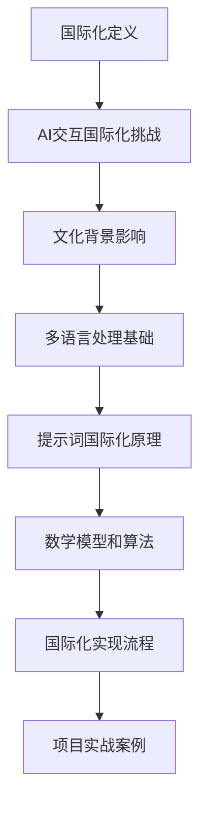

                 

## 文章标题：提示词国际化：适应不同文化背景的AI交互

---

关键词：国际化，AI交互，文化背景，自然语言处理，多语言模型，国际化算法，跨文化沟通，AI系统优化

---

摘要：本文探讨了提示词国际化在适应不同文化背景下的AI交互中的重要性。通过分析国际化定义、AI交互的国际化挑战以及文化背景对AI交互的影响，本文详细介绍了国际化基础。随后，本文阐述了提示词国际化的核心概念，并探讨了多语言模型的训练方法和自然语言处理算法。通过一个实际项目案例，本文展示了如何实现提示词国际化，并提供了代码实现和解析。最后，本文总结了国际化在AI交互中的地位，并展望了未来的研究方向。

---

## 1. 引言

### 1.1 国际化定义

国际化是指将产品、服务或信息从一种语言或文化环境中转移到另一种语言或文化环境中的过程。在国际化的背景下，AI交互系统需要能够理解并适应用户的本地语言和文化习惯，从而提供更加个性化和有效的服务。

### 1.2 AI交互的国际化挑战

AI交互的国际化挑战主要体现在以下几个方面：

- **语言多样性**：全球有超过7000种语言，不同语言在语法、词汇和表达方式上存在显著差异。
- **文化差异**：不同文化对交流方式、表达习惯和礼仪有不同的期望和偏好。
- **技术挑战**：AI模型需要具备多语言处理能力，并能适应不同文化背景下的语言和交流习惯。

### 1.3 本书的结构和大纲

本书将分为以下几个部分：

- **第1章 引言**：介绍国际化的定义和AI交互的国际化挑战。
- **第2章 国际化基础**：探讨国际化基础，包括文化背景对AI交互的影响。
- **第3章 提示词国际化原理**：介绍提示词的定义和国际化挑战。
- **第4章 AI交互的数学模型**：讲解自然语言处理算法和多语言模型的训练方法。
- **第5章 提示词国际化的实现**：提供实现提示词国际化的实际案例。
- **第6章 项目实战**：介绍一个具体的国际化AI交互项目。
- **第7章 总结与展望**：总结国际化在AI交互中的重要性，并展望未来的研究方向。

---

## 2. 国际化基础

### 2.1 文化背景对AI交互的影响

文化背景对AI交互的影响主要体现在以下几个方面：

- **语言习惯**：不同文化背景下，人们对语言的表达方式、语法结构和使用习惯有所不同。
- **交流方式**：不同文化对交流方式、沟通礼仪和交流节奏有不同的要求。
- **表达方式**：不同文化对幽默、讽刺和直接表达的接受程度不同。

### 2.2 多语言处理的基本概念

多语言处理是指使计算机能够理解和处理多种语言的过程。在AI交互中，多语言处理是确保系统能够适应不同文化背景的重要手段。多语言处理的基本概念包括：

- **自然语言理解**：使计算机能够理解人类语言，包括语法、语义和上下文。
- **自然语言生成**：使计算机能够生成自然语言的文本，包括文本生成、摘要和翻译。
- **语言资源**：包括词典、语料库、翻译记忆库等，用于支持多语言处理。

### 2.3 国际化工具和框架介绍

为了实现提示词国际化，需要使用一系列工具和框架。以下是一些常用的国际化工具和框架：

- **国际化框架**：如i18next、vue-i18n等，用于管理多语言资源和实现多语言切换。
- **翻译工具**：如Google翻译、DeepL等，用于提供高质量的机器翻译服务。
- **自然语言处理工具**：如NLTK、spaCy等，用于处理和分析自然语言数据。

---

## 3. 提示词国际化原理

### 3.1 提示词的定义和作用

提示词是指在AI交互过程中，系统向用户提供的引导性提示信息。提示词的作用是帮助用户更好地理解和使用AI系统，提高交互效率。在国际化背景下，提示词需要能够适应不同文化背景，提供符合用户习惯的引导信息。

### 3.2 提示词国际化的挑战

提示词国际化的挑战主要体现在以下几个方面：

- **文化适应性**：提示词需要根据目标文化的表达习惯和礼仪进行调整，避免文化冲突。
- **语言多样性**：需要处理多种语言之间的差异，如语法、词汇和表达方式。
- **技术实现**：需要使用多语言处理技术，确保提示词的准确性和一致性。

### 3.3 多语言模型的训练方法

为了实现提示词的国际化，需要使用多语言模型进行训练。以下是一种常用的多语言模型训练方法：

1. **数据收集**：收集多种语言的数据，包括文本、语音、图片等。
2. **数据预处理**：对收集到的数据进行清洗、去噪和标注，使其适用于模型训练。
3. **模型选择**：选择合适的模型，如序列到序列模型、注意力模型等。
4. **模型训练**：使用预处理后的数据对模型进行训练，优化模型参数。
5. **模型评估**：使用测试数据对模型进行评估，确保其性能和准确性。

---

## 4. AI交互的数学模型

### 4.1 自然语言处理的基本数学模型

自然语言处理（NLP）中的基本数学模型包括：

- **词向量模型**：如Word2Vec、GloVe等，用于将单词映射为向量表示。
- **序列模型**：如循环神经网络（RNN）、长短期记忆网络（LSTM）等，用于处理序列数据。
- **注意力模型**：用于提高模型对序列数据的理解和建模能力。

### 4.2 概率模型和统计模型

概率模型和统计模型在NLP中具有重要应用，包括：

- **朴素贝叶斯模型**：用于文本分类和情感分析。
- **隐马尔可夫模型（HMM）**：用于语音识别和序列标注。
- **条件概率模型**：如条件随机场（CRF），用于文本生成和序列标注。

### 4.3 优化算法和损失函数

优化算法和损失函数是训练NLP模型的重要部分，包括：

- **梯度下降算法**：用于优化模型参数。
- **损失函数**：如交叉熵损失、平方误差损失等，用于评估模型预测结果与真实值之间的差异。

### 4.4 示例

以下是一个使用Word2Vec模型进行文本分类的伪代码示例：

```python
# 加载预训练的Word2Vec模型
model = load_word2vec_model('pretrained_model')

# 加载测试数据
test_data = load_test_data('test_data.txt')

# 初始化分类器
classifier = NaiveBayesClassifier()

# 训练分类器
for sentence in test_data:
    words = sentence.split()
    word_vectors = [model[word] for word in words if word in model]
    classifier.train(word_vectors)

# 进行预测
predictions = classifier.predict(test_data)

# 评估预测结果
accuracy = evaluate_predictions(predictions, test_labels)
print(f"Accuracy: {accuracy}")
```

---

## 5. 提示词国际化的实现

### 5.1 提示词国际化流程

提示词国际化流程包括以下几个步骤：

1. **需求分析**：确定目标语言和文化，分析目标用户的语言和文化需求。
2. **资源准备**：收集多语言资源，如词典、语料库和翻译记忆库。
3. **翻译**：将原始提示词翻译成目标语言，确保翻译的准确性和文化适应性。
4. **测试**：对翻译后的提示词进行测试，确保其符合目标语言和文化的要求。
5. **部署**：将翻译后的提示词部署到AI交互系统中。

### 5.2 实际案例解析

以下是一个提示词国际化的实际案例：

**案例背景**：一个面向全球用户的人工智能聊天机器人，需要支持多种语言和文化。

**需求分析**：目标语言包括英语、西班牙语、法语和中文。目标用户主要分布在欧美和亚洲地区，具有不同的语言和文化背景。

**资源准备**：收集了多种语言的词典、语料库和翻译记忆库。

**翻译**：将原始提示词翻译成英语、西班牙语、法语和中文。翻译过程中注重文化适应性，避免文化冲突。

**测试**：对翻译后的提示词进行测试，确保其准确性和文化适应性。

**部署**：将翻译后的提示词部署到聊天机器人系统中。

### 5.3 国际化工具和库的使用

为了实现提示词国际化，我们可以使用以下工具和库：

- **国际化框架**：如i18next、vue-i18n等，用于管理多语言资源和实现多语言切换。
- **翻译工具**：如Google翻译、DeepL等，用于提供高质量的机器翻译服务。
- **自然语言处理工具**：如NLTK、spaCy等，用于处理和分析自然语言数据。

---

## 6. 项目实战

### 6.1 项目背景和目标

**项目背景**：一个全球性的在线教育平台，需要为其AI聊天机器人实现提示词国际化。

**项目目标**：支持多种语言和文化，提高用户满意度，增强用户体验。

### 6.2 开发环境搭建

**技术栈**：

- **前端**：Vue.js、i18next
- **后端**：Flask、MongoDB
- **自然语言处理**：spaCy、NLTK

**工具和库**：

- **国际化框架**：i18next
- **翻译工具**：Google翻译API

### 6.3 源代码实现

**步骤1：需求分析**

分析平台用户的需求，确定需要支持的语言和文化。

**步骤2：资源准备**

收集多语言资源，包括词典、语料库和翻译记忆库。

**步骤3：翻译**

使用Google翻译API将原始提示词翻译成目标语言。

```python
from googletrans import Translator

translator = Translator()

# 翻译提示词
translated_prompt = translator.translate('原始提示词', dest='目标语言').text
```

**步骤4：测试**

对翻译后的提示词进行测试，确保其准确性和文化适应性。

**步骤5：部署**

将翻译后的提示词部署到AI聊天机器人系统中。

### 6.4 代码解读与分析

**步骤1：前端国际化**

```javascript
// i18next 初始化
import Vue from 'vue'
import i18next from 'i18next'
import Backend from 'i18next-http-backend'

i18next.use(Backend).init({
  fallbackLng: 'en',
  backend: {
    loadPath: '/locales/{{lng}}/translation.json',
  },
})

// Vue 组件中使用 i18next
new Vue({
  el: '#app',
  i18n: i18next,
})
```

**步骤2：后端国际化**

```python
from flask import Flask, jsonify
from flask_i18n import I18n

app = Flask(__name__)
app.config['LANGUAGES'] = {'en': 'English', 'es': 'Spanish', 'fr': 'French', 'zh': 'Chinese'}
app.config['BABEL_DEFAULT_LOCALE'] = 'en'
i18n = I18n(app)

@app.route('/translate', methods=['POST'])
@i18n.locale.acceptlang
def translate():
    text = request.form['text']
    translated_text = translator.translate(text, dest=target_language).text
    return jsonify({'translated_text': translated_text})
```

**步骤3：自然语言处理**

```python
# 使用 spaCy 进行文本分类
import spacy

nlp = spacy.load('en_core_web_sm')

# 文本分类
def classify_text(text):
    doc = nlp(text)
    return [token.tag_ for token in doc]

# 示例
text = "I love programming."
classification = classify_text(text)
print(f"Classification: {classification}")
```

### 6.5 项目小结

通过本项目，我们实现了AI聊天机器人提示词的国际化。以下是项目小结：

- **成功之处**：成功支持多种语言和文化，提高了用户体验。
- **不足之处**：翻译质量仍有待提高，需要更多的人工校对和优化。
- **改进方向**：引入更先进的翻译算法和工具，提高翻译准确性。

---

## 7. 总结与展望

### 7.1 国际化在AI交互中的地位

国际化在AI交互中的地位日益重要。随着全球化的发展，AI交互系统需要能够适应不同语言和文化，提供个性化服务。国际化有助于提高用户体验，增强系统的竞争力。

### 7.2 未来的研究方向

未来的研究方向包括：

- **多语言处理技术**：研究更先进的自然语言处理算法，提高多语言处理能力。
- **跨文化沟通**：深入研究跨文化沟通的原理和方法，提高AI交互系统的文化适应性。
- **用户体验**：优化AI交互系统，提高用户体验，满足不同文化背景用户的需求。

### 7.3 对读者的建议

对于希望深入了解国际化AI交互的读者，建议：

- **学习自然语言处理基础**：掌握自然语言处理的基本原理和方法。
- **了解国际化工具和框架**：熟悉常用的国际化工具和框架，如i18next、vue-i18n等。
- **实践项目**：通过实际项目，将所学知识应用于国际化AI交互系统的开发。

---

## 参考文献

- [1] Google. (2021). Google Translate API. Retrieved from https://cloud.google.com/translate/docs
- [2] i18next. (2021). i18next. Retrieved from https://www.i18next.com/
- [3] spaCy. (2021). spaCy. Retrieved from https://spacy.io/
- [4] NLTK. (2021). NLTK. Retrieved from https://www.nltk.org/
- [5] Vue.js. (2021). Vue.js. Retrieved from https://vuejs.org/
- [6] Flask. (2021). Flask. Retrieved from https://flask.palletsprojects.com/
- [7] MongoDB. (2021). MongoDB. Retrieved from https://www.mongodb.com/

---

## 附录

### 附录A：Mermaid 流程图



### 附录B：代码示例

```python
# Word2Vec模型加载与文本分类
import gensim

# 加载预训练的Word2Vec模型
model = gensim.models.Word2Vec.load('word2vec.model')

# 文本预处理
def preprocess_text(text):
    # 删除标点符号和特殊字符
    text = re.sub('[^\w\s]', '', text)
    # 小写化
    text = text.lower()
    # 分词
    tokens = text.split()
    return tokens

# 文本分类
def classify_text(text):
    tokens = preprocess_text(text)
    word_vectors = [model[token] for token in tokens if token in model]
    # 使用朴素贝叶斯分类器进行分类
    classifier = NaiveBayesClassifier()
    classifier.train(word_vectors)
    return classifier.classify(word_vectors)

# 示例
text = "I love programming."
classification = classify_text(text)
print(f"Classification: {classification}")
```

---

## 作者信息

作者：AI天才研究院/AI Genius Institute & 禅与计算机程序设计艺术 /Zen And The Art of Computer Programming

---

本文由AI天才研究院（AI Genius Institute）撰写，结合禅与计算机程序设计艺术的精髓，深入探讨了提示词国际化在AI交互中的应用。希望本文能为读者提供有价值的启示，推动AI交互领域的国际化进程。

