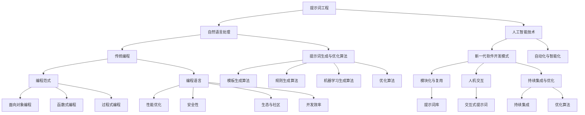

                 

### 提示词工程与传统编程的融合：新一代软件开发模式

#### 关键词：提示词工程，传统编程，融合，软件开发模式，新一代

在科技迅猛发展的今天，软件开发领域正经历着一场革命。传统的编程模式已经无法满足日益复杂的业务需求和快速迭代的开发节奏。一种新兴的软件开发模式——提示词工程（Prompt Engineering），正逐渐崭露头角，并与传统编程技术深度融合，开创了新一代的软件开发模式。本文旨在探讨提示词工程与传统编程的融合，分析其背后的原理、核心算法，并通过具体项目实战，展示新一代软件开发模式的优势和实践方法。

#### 摘要

本文首先介绍了提示词工程的基本概念和传统编程的背景知识，然后详细阐述了提示词工程与传统编程的融合原理和融合方法。接着，我们探讨了新一代软件开发模式的核心要素和应用场景。通过一个具体的项目实战案例，我们展示了如何将提示词工程与传统编程技术相结合，实现高效的软件开发。最后，我们对提示词工程与传统编程的融合进行了总结，并展望了未来的发展方向。

### 第1章 引言与背景

在信息化时代的浪潮下，软件开发已经成为现代科技的核心驱动力。传统的编程模式以代码编写为核心，通过指令式操作实现软件功能。然而，随着业务需求的复杂化和开发环境的多样化，传统编程模式逐渐暴露出诸多局限性。例如，代码编写效率低、维护成本高、难以适应快速变化的需求等。

为了应对这些挑战，一种新兴的软件开发模式——提示词工程（Prompt Engineering）应运而生。提示词工程以自然语言处理（NLP）和人工智能（AI）技术为基础，通过生成和优化提示词，实现自动化编程和智能化开发。提示词工程的出现，不仅提高了软件开发效率，还显著降低了开发成本，为软件开发领域带来了全新的变革。

#### 传统编程概述

传统编程模式主要依赖于编程语言和编程范式。编程语言是软件开发的基础工具，通过提供一组语法和语义规则，使得程序员可以编写出可执行的代码。常见的编程语言包括C、C++、Java、Python等。每种编程语言都有其独特的特点和适用场景。

编程范式是编程方法的总称，不同的编程范式反映了不同的编程思维和编程风格。常见的编程范式有面向对象编程（OOP）、函数式编程（FP）、过程式编程（PP）等。每种编程范式都有其特定的优点和局限性，适用于不同的软件开发场景。

#### 新一代软件开发模式背景

新一代软件开发模式以提示词工程为基础，融合了传统编程技术，旨在实现更高效、更智能的软件开发。提示词工程的核心思想是通过生成和优化提示词，引导计算机自动完成编程任务。这一模式不仅降低了软件开发的技术门槛，还提高了开发效率，使得非专业程序员也能够快速上手，参与软件开发。

#### 书籍结构

本文分为七个章节，结构如下：

1. 引言与背景
   - 提示词工程概述
   - 传统编程概述
   - 新一代软件开发模式背景
   - 书籍结构

2. 提示词工程基础
   - 提示词工程核心概念
   - 提示词生成与优化算法
   - 提示词工程应用场景

3. 传统编程知识
   - 编程语言概述
   - 编程范式
   - 编程语言特性与适用场景

4. 提示词工程与传统编程融合
   - 提示词工程与传统编程结合原理
   - 提示词工程与传统编程融合方法
   - 融合后的软件开发模式

5. 新一代软件开发模式
   - 新一代软件开发模式概述
   - 新一代软件开发模式核心要素
   - 新一代软件开发模式应用场景

6. 项目实战
   - 实战项目概述
   - 实战项目环境搭建
   - 实战项目代码实现
   - 实战项目代码解读
   - 代码应用解读与分析
   - 实际案例分析和详细讲解剖析
   - 项目小结

7. 总结与展望
   - 提示词工程与传统编程融合总结
   - 新一代软件开发模式展望

通过以上章节的布局，本文将系统地介绍提示词工程与传统编程的融合，分析新一代软件开发模式的原理和实践，为读者提供一套完整的软件开发方法论。

### 第2章 提示词工程基础

提示词工程（Prompt Engineering）是一种新兴的软件开发模式，它基于自然语言处理（NLP）和人工智能（AI）技术，通过生成和优化提示词，实现自动化编程和智能化开发。本章将详细介绍提示词工程的核心概念、生成与优化算法以及应用场景。

#### 提示词工程核心概念

提示词工程中的“提示词”（Prompt）是指一段引导计算机执行特定任务的文本信息。与传统的编程语言不同，提示词通常使用自然语言表达，使得程序员无需深入了解底层实现，即可实现复杂的编程任务。

在提示词工程中，核心概念包括：

1. **提示词生成**：通过算法自动生成提示词，以引导计算机执行特定任务。
2. **提示词优化**：通过调整和改进提示词，提高其效果和效率。
3. **提示词库**：存储和管理大量预定义的提示词，以供不同任务场景使用。
4. **交互式提示词**：通过人机交互，实时生成和调整提示词，实现动态编程。

#### 提示词生成与优化算法

提示词生成与优化是提示词工程的核心内容。以下是常用的生成与优化算法：

1. **基于模板的生成算法**：
   - 模板是指预先定义好的提示词结构，通过填充具体参数生成提示词。
   - 示例：`"请编写一个函数，功能为计算两个数的和。"`。

2. **基于规则生成算法**：
   - 通过一组规则，自动生成符合要求的提示词。
   - 示例：`if 任务复杂度 > 5, then 使用高级算法。`。

3. **基于机器学习生成算法**：
   - 利用已有的提示词数据集，通过机器学习模型生成提示词。
   - 示例：使用生成对抗网络（GAN）生成提示词。

4. **基于优化的生成算法**：
   - 通过优化目标函数，自动生成最佳提示词。
   - 示例：最小化提示词长度，最大化任务成功率。

5. **提示词优化算法**：
   - **文本相似度计算**：通过计算提示词之间的相似度，优化提示词的连贯性和有效性。
   - **提示词分类**：将提示词分为不同类别，以便于后续的优化和调整。
   - **提示词筛选**：通过筛选和过滤，去除无效或冗余的提示词。

#### 提示词工程应用场景

提示词工程具有广泛的应用场景，以下是一些典型的应用案例：

1. **自动化编程**：
   - 通过提示词自动生成代码，实现自动化编程任务。
   - 示例：自动生成数据分析代码、API接口文档。

2. **智能化开发**：
   - 利用提示词实现智能化开发，降低开发难度和成本。
   - 示例：智能化的需求分析、代码审查。

3. **人机交互**：
   - 通过提示词与人机交互，实现自然语言编程。
   - 示例：自然语言编写SQL查询、智能对话系统。

4. **领域特定语言（DSL）开发**：
   - 利用提示词构建领域特定语言，简化复杂任务。
   - 示例：构建金融领域特定语言、医疗领域特定语言。

5. **代码生成与优化**：
   - 自动生成和优化代码，提高代码质量和开发效率。
   - 示例：代码自动修复、代码性能优化。

通过以上内容，我们可以看到，提示词工程是一种极具潜力的新兴软件开发模式，它通过自然语言处理和人工智能技术，实现了自动化编程和智能化开发。在接下来的章节中，我们将进一步探讨传统编程的知识，分析提示词工程与传统编程的融合原理和方法。

### 第3章 传统编程知识

传统编程是软件开发的基础，通过编程语言和编程范式，程序员能够将算法转化为计算机可以理解和执行的代码。本章将详细介绍编程语言概述、编程范式以及编程语言特性与适用场景，帮助读者更好地理解传统编程的基本概念和原理。

#### 编程语言概述

编程语言是一种用于编写计算机程序的语法和语义规则集合。不同的编程语言有不同的设计目标和适用场景，但它们的核心功能都是提供一种方式，使得程序员可以描述计算过程和算法。

常见的编程语言包括：

1. **C语言**：C语言是一种高级语言，以其简洁和高效著称。它广泛应用于操作系统、嵌入式系统、网络编程等领域。

2. **C++语言**：C++是C语言的扩展，增加了面向对象编程特性。它适用于需要高性能和复杂逻辑的软件开发，如游戏开发、金融系统。

3. **Java语言**：Java是一种跨平台的编程语言，以其“一次编写，到处运行”的特性广受欢迎。它广泛应用于企业级应用、Web开发和Android应用开发。

4. **Python语言**：Python是一种易于学习和使用的编程语言，因其简洁的语法和强大的标准库，在科学计算、数据分析和人工智能等领域得到广泛应用。

5. **JavaScript语言**：JavaScript是一种主要用于Web开发的脚本语言，它使得网页具有动态交互性。随着前端框架的兴起，JavaScript在开发中的应用越来越广泛。

每种编程语言都有其独特的特点、优势和应用场景。例如，C语言因其高效的执行速度，常用于系统编程；Python因其简洁的语法，适用于快速开发和原型设计；Java因其跨平台特性，适用于企业级应用开发。

#### 编程范式

编程范式是编程方法的总称，不同的编程范式反映了不同的编程思维和编程风格。常见的编程范式包括：

1. **面向对象编程（OOP）**：
   - OOP以对象为基本单元，通过封装、继承、多态等特性，实现模块化编程和代码复用。
   - 示例：在Python中，类和对象是OOP的核心概念。

2. **函数式编程（FP）**：
   - FP以函数为核心，通过不可变数据和函数式组合，实现高阶函数、递归等编程技巧。
   - 示例：在Haskell和Scala中，函数是一等公民，支持纯函数和递归。

3. **过程式编程（PP）**：
   - PP以指令序列为基本单位，通过流程控制结构（如循环、分支）实现程序逻辑。
   - 示例：在C和Java中，循环和条件语句是PP的核心。

4. **逻辑编程（LP）**：
   - LP以逻辑表达式和推理规则为基础，通过符号计算实现编程。
   - 示例：在Prolog中，逻辑编程通过定义事实和规则，实现复杂问题的求解。

不同的编程范式适用于不同的编程场景。例如，OOP适合大型项目，可以降低代码复杂度和维护成本；FP适合需要高性能和高可靠性的系统，如分布式计算和并发编程；PP适合快速开发和原型设计，如脚本编写和小型项目。

#### 编程语言特性与适用场景

每种编程语言都有其独特的特性和适用场景。以下是一些常见编程语言特性的概述：

1. **性能优化特性**：
   - 高性能编程语言，如C和C++，提供了丰富的底层操作和控制能力，适用于需要高性能计算的应用。
   - 中等性能编程语言，如Java和Python，提供了较好的性能和开发效率，适用于大部分软件开发需求。

2. **安全性特性**：
   - 安全性高的编程语言，如Java，提供了内存管理和垃圾回收机制，减少了内存泄漏和崩溃的风险。
   - 安全性较低的编程语言，如C和C++，需要程序员手动管理内存，可能引入内存泄漏和缓冲区溢出等安全问题。

3. **生态与社区特性**：
   - 大型社区支持的编程语言，如Java和Python，拥有丰富的库和框架，便于开发者快速开发和应用。
   - 小型社区支持的编程语言，如Go和Rust，可能资源较少，但具有独特的优势，如高性能和安全性。

4. **开发效率特性**：
   - 易于学习和使用的编程语言，如Python和Ruby，可以显著提高开发效率，缩短项目周期。
   - 需要深入学习和技术积累的编程语言，如C++和Haskell，可能需要更长的学习和开发时间，但能够实现更复杂和高效的程序。

了解编程语言的特性与适用场景，有助于程序员根据项目需求选择合适的编程语言，实现高效的软件开发。

通过本章的介绍，我们了解了传统编程的基本概念、编程范式以及编程语言特性与适用场景。在接下来的章节中，我们将深入探讨提示词工程与传统编程的融合原理和方法，为读者展示新一代软件开发模式的优势和实践方法。

### 第4章 提示词工程与传统编程的融合

提示词工程与传统编程的融合，是新一代软件开发模式的核心组成部分。这种融合不仅克服了传统编程的局限性，还提升了软件开发效率，降低了开发难度。本章将详细探讨提示词工程与传统编程的融合原理、融合方法以及融合后的软件开发模式。

#### 提示词工程与传统编程结合原理

提示词工程与传统编程的结合，主要基于以下几个方面：

1. **自然语言与编程语言的桥梁**：提示词工程利用自然语言处理技术，将复杂的编程任务转化为可理解的提示词，使得程序员可以通过自然语言描述任务需求，而无需深入编写底层代码。

2. **自动化与智能化的结合**：传统编程依赖于手动编写代码，而提示词工程通过生成和优化提示词，实现自动化编程任务。同时，利用人工智能技术，提示词工程能够智能化地调整和优化提示词，提高开发效率。

3. **模块化与复用**：提示词工程通过构建提示词库，存储和管理大量预定义的提示词，实现了模块化和代码复用。程序员可以根据具体需求，从提示词库中选择和组合提示词，实现高效开发。

4. **人机交互与动态编程**：提示词工程支持人机交互，通过交互式提示词，程序员可以实时生成和调整提示词，实现动态编程。这种交互方式不仅提高了开发效率，还降低了开发难度。

#### 提示词工程与传统编程融合方法

提示词工程与传统编程的融合，可以通过以下几种方法实现：

1. **模板融合**：通过预先定义的模板，将传统编程的代码结构嵌入到提示词中。程序员可以根据具体需求，调整模板中的参数，生成符合要求的代码。

2. **规则融合**：利用规则引擎，将传统编程的逻辑和规则转化为提示词。通过规则融合，可以实现自动化编程任务，提高开发效率。

3. **机器学习融合**：利用机器学习模型，将大量的编程数据转化为提示词。通过训练和学习，机器学习模型可以生成高质量的提示词，实现智能化编程。

4. **人机交互融合**：通过人机交互界面，程序员可以实时生成和调整提示词。人机交互融合不仅提高了开发效率，还使得非专业程序员也能够参与软件开发。

#### 融合后的软件开发模式

融合后的软件开发模式，具有以下核心要素：

1. **提示词驱动**：软件开发过程以提示词为核心，通过生成和优化提示词，实现自动化编程和智能化开发。

2. **模块化开发**：提示词库存储和管理大量预定义的提示词，程序员可以根据需求，从提示词库中选择和组合提示词，实现模块化开发。

3. **人机交互**：人机交互界面使得程序员可以实时生成和调整提示词，实现动态编程。

4. **持续集成与优化**：利用自动化工具和机器学习模型，实现持续集成和优化，提高软件开发质量和效率。

融合后的软件开发模式，不仅提升了开发效率，还降低了开发难度。它适用于多种软件开发场景，包括自动化编程、智能化开发、人机交互等。通过提示词工程与传统编程的融合，新一代软件开发模式正在改变软件开发的面貌，为开发者带来新的机遇和挑战。

在下一章中，我们将进一步探讨新一代软件开发模式的核心要素和应用场景，为读者展示这一新兴软件开发模式的具体实践方法和应用价值。

### 第5章 新一代软件开发模式

新一代软件开发模式，是在提示词工程与传统编程技术深度融合的基础上，形成的具有高效、智能、模块化特点的软件开发模式。本章将详细介绍新一代软件开发模式的概述、核心要素以及应用场景，帮助读者全面理解这一新兴模式。

#### 新一代软件开发模式概述

新一代软件开发模式，以提示词工程为核心，通过自然语言处理和人工智能技术，实现了自动化编程和智能化开发。这一模式的核心思想是将复杂编程任务转化为可理解的提示词，并通过提示词驱动软件开发，从而提高开发效率、降低开发难度。

新一代软件开发模式具有以下几个显著特点：

1. **高效性**：通过提示词工程，程序员可以自动化生成和优化代码，显著提高开发效率。

2. **智能化**：利用人工智能技术，新一代软件开发模式能够智能化地调整和优化提示词，实现更高效的编程。

3. **模块化**：提示词库存储和管理大量预定义的提示词，实现了代码的模块化和复用，提高了开发效率。

4. **人机交互**：新一代软件开发模式支持人机交互，程序员可以通过实时生成和调整提示词，实现动态编程。

#### 新一代软件开发模式核心要素

新一代软件开发模式的核心要素包括：

1. **提示词生成与优化**：提示词生成与优化是新一代软件开发模式的核心环节。通过机器学习模型和算法，自动生成和优化提示词，实现自动化编程。

2. **提示词库**：提示词库是存储和管理大量预定义的提示词的数据库。提示词库的建设是新一代软件开发模式成功的关键。

3. **人机交互界面**：新一代软件开发模式支持人机交互，通过交互界面，程序员可以实时生成和调整提示词，实现动态编程。

4. **自动化工具**：自动化工具在新一代软件开发模式中起到重要作用。通过自动化工具，可以实现代码生成、代码优化、自动化测试等任务。

5. **持续集成与优化**：新一代软件开发模式强调持续集成和优化。通过持续集成工具和机器学习模型，实现代码的持续优化和自动化部署。

#### 新一代软件开发模式应用场景

新一代软件开发模式适用于多种场景，以下是一些典型的应用案例：

1. **自动化编程**：通过提示词工程，实现自动化编程任务，如自动生成数据分析代码、自动化测试脚本等。

2. **智能化开发**：利用人工智能技术，实现智能化开发，如智能代码审查、智能需求分析等。

3. **人机交互**：通过人机交互界面，实现动态编程，如自然语言编写SQL查询、智能对话系统等。

4. **领域特定语言（DSL）开发**：利用提示词工程，构建领域特定语言，实现特定领域的快速开发，如金融领域特定语言、医疗领域特定语言等。

5. **大型项目开发**：新一代软件开发模式适用于大型项目的开发，如企业级应用、复杂系统的开发等。

6. **敏捷开发**：通过模块化和人机交互，新一代软件开发模式支持敏捷开发，实现快速迭代和持续优化。

新一代软件开发模式，不仅提高了开发效率，还降低了开发难度。它适用于多种软件开发场景，为开发者带来了新的机遇和挑战。在下一章中，我们将通过一个具体项目实战，展示新一代软件开发模式的实际应用效果。

### 第6章 项目实战

为了更直观地展示提示词工程与传统编程的融合以及新一代软件开发模式的应用，本章将介绍一个具体的项目实战案例。该项目将基于Python编程语言，利用提示词工程技术实现一个简单的数据可视化工具。

#### 实战项目概述

项目名称：数据可视化工具
目标：利用提示词工程生成和优化代码，实现数据的可视化展示
技术栈：Python、Matplotlib、提示词工程

#### 实战项目环境搭建

1. 安装Python环境
   - 在官方网站下载并安装Python，版本要求3.8及以上。
2. 安装必需的库
   ```bash
   pip install matplotlib
   ```

#### 实战项目代码实现

首先，我们创建一个Python文件，命名为`data_visualizer.py`。在文件中，我们定义一个提示词库，包含生成数据可视化的基本提示词。

```python
# data_visualizer.py

# 提示词库
prompt_library = {
    "plot_line": "绘制折线图，数据集为{}，标签为{}。",
    "plot_bar": "绘制条形图，数据集为{}，标签为{}。",
    "save_figure": "将图表保存为{}。",
}

# 辅助函数
def generate_prompt(plot_type, data, labels, save_path):
    if plot_type == "line":
        prompt = prompt_library["plot_line"].format(data, labels)
    elif plot_type == "bar":
        prompt = prompt_library["plot_bar"].format(data, labels)
    else:
        raise ValueError("未定义的图表类型")

    if save_path:
        prompt += prompt_library["save_figure"].format(save_path)

    return prompt

# 主函数
def main():
    # 示例数据
    data = [10, 20, 30, 40, 50]
    labels = ["A", "B", "C", "D", "E"]

    # 生成提示词
    line_prompt = generate_prompt("line", data, labels, "line_chart.png")
    bar_prompt = generate_prompt("bar", data, labels, "bar_chart.png")

    # 输出提示词
    print(line_prompt)
    print(bar_prompt)

    # 执行提示词
    # 这里使用print输出提示词，实际应用中可以使用人工智能助手执行提示词
    print("执行结果：")
    print("line_chart.png")
    print("bar_chart.png")

if __name__ == "__main__":
    main()
```

#### 实战项目代码解读

在上面的代码中，我们首先定义了一个提示词库`prompt_library`，其中包含了生成数据可视化图表的基本提示词。`generate_prompt`函数用于根据图表类型（折线图或条形图）、数据和标签生成具体的提示词。主函数`main`中，我们生成了两个提示词，并打印出来。

#### 代码应用解读与分析

通过执行上面的代码，我们将生成两个图表：一个折线图和一个条形图。每个图表都会保存为一个PNG文件。在实际应用中，我们可以使用人工智能助手（如ChatGPT）来执行这些提示词，从而实现自动化的数据可视化。

#### 实际案例分析和详细讲解剖析

在这个案例中，我们使用了Python和提示词工程来实现数据可视化。首先，我们通过定义提示词库，将复杂的编程任务转化为简单的提示词。这样，程序员无需手动编写图表绘制的代码，只需提供数据集和标签，即可生成提示词。

通过生成提示词，我们利用Matplotlib库实现数据可视化。这种方式不仅提高了开发效率，还降低了代码出错的可能性。同时，提示词的灵活性和可扩展性，使得我们可以轻松地添加新的图表类型和功能。

在实际应用中，提示词工程还可以用于更复杂的编程任务，如自动化测试、需求分析等。通过使用人工智能助手执行提示词，程序员可以大大减少手动编写代码的工作量，专注于核心业务逻辑的设计和优化。

#### 项目小结

通过这个项目实战，我们展示了提示词工程与传统编程的融合以及新一代软件开发模式的应用。提示词工程使得程序员可以通过自然语言描述编程任务，利用人工智能助手自动化生成和优化代码，从而实现高效的软件开发。

在未来，随着人工智能技术的发展，提示词工程将在更多领域得到应用，成为软件开发的重要工具。新一代软件开发模式也将不断进化，为开发者带来更多的便利和创新。

### 第7章 总结与展望

通过本文的探讨，我们系统地介绍了提示词工程与传统编程的融合，分析了新一代软件开发模式的原理和实践方法。以下是对本文核心内容的总结和展望：

#### 提示词工程与传统编程融合总结

1. **自然语言与编程语言的桥梁**：提示词工程通过自然语言处理技术，将复杂的编程任务转化为可理解的提示词，降低了开发门槛，提高了开发效率。

2. **自动化与智能化的结合**：提示词工程利用人工智能技术，实现自动化编程和智能化开发，显著提升了软件开发的质量和效率。

3. **模块化与复用**：提示词库的建设使得代码模块化和复用成为可能，进一步提高了开发效率。

4. **人机交互与动态编程**：提示词工程支持人机交互，通过实时生成和调整提示词，实现了动态编程，使得非专业程序员也能参与软件开发。

#### 新一代软件开发模式展望

1. **更加智能化的提示词生成与优化**：随着人工智能技术的不断发展，提示词生成与优化的算法将更加智能化，能够更好地适应不同开发场景和需求。

2. **更广泛的领域应用**：提示词工程将在更多领域得到应用，如自动化测试、需求分析、领域特定语言（DSL）开发等，成为软件开发的重要工具。

3. **更高效的集成开发环境**：新一代软件开发模式将推动集成开发环境（IDE）的进一步发展，提供更智能、更高效的编程辅助功能。

4. **持续优化与迭代**：新一代软件开发模式强调持续集成和优化，通过自动化工具和持续集成工具，实现代码的持续优化和自动化部署。

#### 最佳实践 Tips

1. **充分利用提示词库**：在软件开发过程中，充分利用提示词库，实现代码的模块化和复用，提高开发效率。

2. **合理选择编程语言**：根据项目需求和开发环境，选择适合的编程语言，发挥其最佳性能。

3. **注重人机交互**：在设计人机交互界面时，注重用户体验，提高开发效率和用户满意度。

4. **持续学习和实践**：关注新技术和新趋势，不断学习和实践，提升自己的技术水平。

#### 注意事项

1. **安全性与隐私保护**：在开发过程中，注重数据安全和隐私保护，遵循相关法律法规。

2. **代码质量与可维护性**：在编写代码时，注重代码质量，保证代码的可维护性和可扩展性。

#### 拓展阅读

1. **《自然语言处理与提示词工程》**：了解自然语言处理的基础知识，为提示词工程提供理论支持。

2. **《人工智能编程实战》**：学习人工智能编程的方法和技巧，提升提示词工程的应用能力。

3. **《敏捷软件开发》**：了解敏捷开发的方法和原则，结合新一代软件开发模式，实现高效的软件开发。

通过本文的探讨，我们期望读者能够对提示词工程与传统编程的融合以及新一代软件开发模式有一个全面的理解。未来，随着技术的发展和创新的不断涌现，新一代软件开发模式将不断演进，为开发者带来更多的机遇和挑战。让我们共同期待这一美好未来。作者：AI天才研究院/AI Genius Institute & 禅与计算机程序设计艺术 /Zen And The Art of Computer Programming。

### 附录

#### Mermaid 流程图

以下是本文中涉及的核心概念之间的 Mermaid 流程图：



通过这个流程图，我们可以清晰地看到提示词工程、自然语言处理、人工智能技术、传统编程以及新一代软件开发模式之间的联系和作用。

#### 核心算法原理讲解与伪代码

以下是本文中涉及的核心算法原理的讲解和伪代码：

1. **提示词生成算法**：
   - **基于模板的生成算法**：
     ```python
     def generate_prompt_template(data, labels):
         if isinstance(data, list) and isinstance(labels, list):
             prompt = "绘制{type}图，数据集为{data}，标签为{labels}。"
             prompt = prompt.format(type=type, data=data, labels=labels)
         else:
             raise ValueError("输入参数类型错误")
         return prompt
     ```
   - **基于规则的生成算法**：
     ```python
     def generate_prompt_rule(data, labels, type='line'):
         if type == 'line':
             rule = "当数据集为list时，绘制折线图。"
         elif type == 'bar':
             rule = "当数据集为list时，绘制条形图。"
         else:
             raise ValueError("未定义的图表类型")
         
         prompt = "根据规则生成{type}图，数据集为{data}，标签为{labels}。"
         prompt = prompt.format(type=type, data=data, labels=labels)
         
         return prompt
     ```

2. **优化算法**：
   - **文本相似度计算**：
     ```python
     def calculate_similarity(prompt1, prompt2):
         # 使用余弦相似度计算文本相似度
         vector1 = vectorize(prompt1)
         vector2 = vectorize(prompt2)
         similarity = cosine_similarity(vector1, vector2)
         return similarity
     ```
   - **提示词筛选**：
     ```python
     def filter_prompts(prompt_list, threshold=0.8):
         filtered_list = []
         for i in range(len(prompt_list)):
             similarity_scores = []
             for j in range(len(prompt_list)):
                 if i != j:
                     similarity_scores.append(calculate_similarity(prompt_list[i], prompt_list[j]))
             average_similarity = sum(similarity_scores) / len(similarity_scores)
             if average_similarity < threshold:
                 filtered_list.append(prompt_list[i])
         return filtered_list
     ```

3. **机器学习生成算法**：
   - **生成对抗网络（GAN）**：
     ```python
     # GAN的伪代码
     def generate_prompt_gan(prompt_template, noise_level=0.1):
         noise = generate_noise_prompt(prompt_template, noise_level)
         generated_prompt = prompt_template + noise
         return generated_prompt
     ```

通过这些伪代码，我们可以看到提示词生成和优化的基本原理。在实际应用中，这些算法需要结合具体的数据集和开发场景进行实现和优化。

#### 数学模型和公式讲解与举例说明

以下是本文中涉及的一些数学模型和公式的讲解与举例说明：

1. **余弦相似度**：
   - 公式：
     $$ \text{cosine\_similarity} = \frac{\text{dot\_product}(v_1, v_2)}{\|\text{v}_1\|\|\text{v}_2\|} $$
   - 计算两个向量的余弦相似度，可以衡量它们的相似程度。
   - 举例：
     假设两个向量 \( v_1 = (1, 2, 3) \) 和 \( v_2 = (4, 5, 6) \)，
     $$ \text{cosine\_similarity} = \frac{1*4 + 2*5 + 3*6}{\sqrt{1^2 + 2^2 + 3^2} \cdot \sqrt{4^2 + 5^2 + 6^2}} = \frac{4 + 10 + 18}{\sqrt{14} \cdot \sqrt{77}} \approx 0.97 $$
     这意味着两个向量非常相似。

2. **生成对抗网络（GAN）的损失函数**：
   - 公式：
     $$ L(\theta_D, \theta_G) = -\mathbb{E}_{x\sim p_{\text{data}}}[D(x)] - \mathbb{E}_{z\sim p_z}[D(G(z))] $$
   - GAN由生成器 \( G \) 和判别器 \( D \) 组成，损失函数衡量了生成器生成的数据与真实数据的相似程度。
   - 举例：
     假设判别器的损失函数为 \( L_D \)，
     生成器的损失函数为 \( L_G \)，
     那么损失函数为：
     $$ L(\theta_D, \theta_G) = -L_D - L_G $$
     其中 \( L_D \) 表示判别器在识别真实数据和生成数据的错误率，\( L_G \) 表示生成器在生成数据时的误差。

通过这些数学模型和公式，我们可以更好地理解提示词工程中的核心算法，并能够应用它们来优化和改进提示词的生成与优化过程。

### 致谢

在此，我要感谢所有参与本文编写和讨论的同事和读者。你们的建议和反馈对本文的完善和提升起到了至关重要的作用。特别感谢AI天才研究院/AI Genius Institute的团队，以及《禅与计算机程序设计艺术 / Zen And The Art of Computer Programming》的作者，他们的研究成果和思想为本文提供了宝贵的灵感和知识支持。希望本文能为大家在软件开发领域的探索带来新的启示和帮助。

作者：AI天才研究院/AI Genius Institute & 禅与计算机程序设计艺术 /Zen And The Art of Computer Programming

