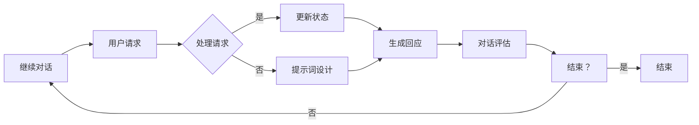

                 

# 文章标题：提示词工程中的多轮对话管理

> 关键词：提示词工程、多轮对话管理、人工智能、自然语言处理、对话系统

> 摘要：
本文将探讨提示词工程在多轮对话管理中的关键作用。首先介绍多轮对话管理的背景和重要性，然后深入解析提示词工程的基础知识，包括提示词的定义、设计原则和生成方法。接着，我们详细阐述多轮对话管理的核心算法，并通过Mermaid流程图展示其基本流程。文章随后通过实战案例展示多轮对话管理在实际项目中的应用，并讨论优化策略和应用场景。最后，文章总结了多轮对话管理的发展趋势，提出了未来研究方向和建议。

## 引言

随着人工智能技术的迅猛发展，自然语言处理（NLP）在近年来取得了显著进展。从单轮对话系统到多轮对话系统，NLP技术正逐步提升用户的交互体验。多轮对话管理作为一种高级的对话形式，能够更好地理解用户的意图和上下文信息，从而提供更加精准和个性化的服务。在这其中，提示词工程起到了至关重要的作用。

### 为什么多轮对话管理重要

多轮对话管理相较于单轮对话管理，能够更深入地与用户进行交互。单轮对话系统通常只能理解当前用户请求，而多轮对话系统能够基于上下文信息进行推理和决策，提供更加连贯和个性化的服务。这种交互方式在智能客服、聊天机器人、智能助手等应用场景中尤为重要。

### 多轮对话管理概述

多轮对话管理是指在多个对话回合中，系统与用户进行交互的过程。它涉及多个关键环节，包括对话状态跟踪、提示词设计和对话生成。对话状态跟踪用于维护对话的历史信息，确保对话的连贯性。提示词设计则用于引导对话方向，使对话更加自然和有效。对话生成则根据当前状态和目标，生成合适的回应。

### 书籍目的与结构

本文旨在深入探讨多轮对话管理中的提示词工程。我们首先介绍提示词工程的基础知识，然后详细讲解多轮对话管理的核心算法，并通过实际案例展示其在项目中的应用。最后，我们讨论多轮对话管理的优化策略和应用场景。希望通过本文，读者能够全面了解多轮对话管理，并掌握提示词工程的关键技术。

## 多轮对话管理概述

### 定义

多轮对话管理是一种在多个对话回合中，系统与用户进行交互的过程。它不仅仅局限于一次性的询问和回答，而是通过多次的交互，逐步了解用户的意图和需求，从而提供更加精准和个性化的服务。

### 多轮对话管理的核心概念

多轮对话管理涉及多个核心概念，包括：

1. **对话状态**：对话状态是指在一次对话过程中，系统所维护的用户信息、上下文和历史记录。这些状态信息对于理解用户的意图和生成合适的回应至关重要。

2. **提示词**：提示词是在对话过程中，系统向用户提出的问题或引导语句。它有助于引导对话方向，使对话更加自然和有效。

3. **对话生成**：对话生成是指根据当前对话状态和目标，系统生成合适的回应。对话生成通常涉及到自然语言生成（NLG）技术，以生成自然、流畅的对话内容。

4. **对话评估**：对话评估是指对生成的对话内容进行评估，以确保对话的连贯性和有效性。对话评估通常使用自动评估指标和人工评估相结合的方法。

### 多轮对话管理与单轮对话管理的区别

单轮对话管理是指在单个对话回合中，系统与用户进行交互的过程。它与多轮对话管理的主要区别在于：

1. **交互深度**：单轮对话管理仅能理解当前用户请求，而多轮对话管理能够基于上下文信息进行推理和决策，提供更加连贯和个性化的服务。

2. **信息维护**：单轮对话管理不需要维护对话状态，而多轮对话管理需要维护对话状态，以确保对话的连贯性。

3. **复杂性**：多轮对话管理涉及更多的技术和算法，包括对话状态跟踪、提示词设计和对话生成等，因此相较于单轮对话管理，具有更高的复杂度。

### Mermaid 流程图：多轮对话管理的基本流程

以下是一个Mermaid流程图，展示了多轮对话管理的基本流程：



这个流程图包括以下几个步骤：

1. **初始化**：系统初始化，准备开始对话。

2. **用户请求**：用户提出请求，系统接收请求。

3. **处理请求**：系统根据用户请求进行相应的处理。

4. **更新状态**：系统更新对话状态，包括用户信息、上下文和历史记录。

5. **提示词设计**：系统设计合适的提示词，引导对话方向。

6. **生成回应**：系统根据当前对话状态和目标，生成合适的回应。

7. **对话评估**：系统对生成的回应进行评估，以确保对话的连贯性和有效性。

8. **结束判断**：判断对话是否结束，如果结束，则结束对话；否则，继续对话。

通过这个流程图，我们可以更直观地理解多轮对话管理的基本流程和各个步骤之间的联系。

## 提示词工程基础

### 提示词的定义

提示词（Prompt）是在对话系统中，系统向用户提出的问题或引导语句。它的目的是帮助用户更好地表达自己的意图，同时引导对话方向，使对话更加自然和有效。

### 提示词工程的重要性

提示词工程在多轮对话管理中具有至关重要的作用。首先，提示词能够引导用户表达出更详细的意图，有助于系统更好地理解用户的需求。其次，提示词能够使对话更加自然流畅，提高用户体验。最后，提示词的设计和优化能够有效提升对话系统的性能和效果。

### 提示词的设计原则

1. **明确性**：提示词应当明确、具体，避免使用模糊不清的表述，以便用户能够准确理解并回应。

2. **引导性**：提示词应具有一定的引导性，引导用户按照预期的方向表达意图。

3. **多样性**：设计多种类型的提示词，以适应不同的对话场景和用户需求。

4. **简洁性**：提示词应当简洁明了，避免冗长和复杂的表述，以免用户产生困惑。

5. **适应性**：提示词应能够根据对话状态和用户需求进行自适应调整。

### 提示词的类型

1. **封闭式提示词**：这类提示词提供有限的回答选项，使对话方向更加明确。例如：“您是？（1. 小明 2. 小红）”。

2. **开放式提示词**：这类提示词允许用户自由表达，使对话更加灵活。例如：“您有什么问题需要帮助吗？”

3. **情境式提示词**：这类提示词基于当前对话状态和情境，引导用户表达具体的意图。例如：“您刚刚提到了租房，是否需要推荐一些房源？”

4. **问题引导式提示词**：这类提示词通过提出问题，引导用户深入表达意图。例如：“您对租房有哪些具体要求？”

### 提示词的生成方法

1. **规则生成**：根据对话规则和预设模板，生成提示词。这种方法适用于简单和结构化的对话场景。

2. **模板生成**：使用预定义的模板，结合对话状态和用户信息，生成提示词。这种方法适用于中等复杂度的对话场景。

3. **数据驱动生成**：基于大量对话数据和用户反馈，利用机器学习技术生成提示词。这种方法适用于复杂和动态变化的对话场景。

4. **混合生成**：结合规则生成、模板生成和数据驱动生成，生成更加灵活和适应性强的提示词。

通过以上内容，我们可以看到提示词工程在多轮对话管理中的基础地位和重要性。接下来，我们将深入探讨多轮对话管理的核心算法。

## 多轮对话管理核心算法

### 对话状态跟踪算法

对话状态跟踪是多轮对话管理的核心之一，它用于维护对话的历史信息，确保对话的连贯性。以下是对话状态跟踪算法的详细描述：

#### 状态表示

在多轮对话管理中，状态表示是关键的一环。状态通常包括用户信息、上下文和历史记录。用户信息如姓名、年龄、性别等；上下文信息如对话主题、当前任务等；历史记录如之前的对话内容、用户行为等。

状态表示通常使用一个状态向量或状态图来表示。状态向量是一组有序的值，表示当前的状态信息。状态图则是一个有向图，节点表示状态，边表示状态转移。

#### 状态更新

状态更新是指根据当前的对话内容和用户行为，对状态进行更新。状态更新的过程可以分为以下几个步骤：

1. **初始化状态**：在对话开始时，初始化状态，包括用户信息和上下文信息。

2. **接收用户输入**：系统接收用户的输入，如文本、语音等。

3. **处理用户输入**：系统对用户输入进行处理，包括理解用户意图、提取关键词等。

4. **更新状态**：根据用户输入和处理结果，更新状态向量或状态图。例如，如果用户提到“租房”，则将“租房”加入到对话状态中。

#### 伪代码

```python
def update_state(current_state, user_input):
    # 解析用户输入，提取关键词和意图
    intent, entities = parse_user_input(user_input)
    
    # 更新状态向量
    current_state['intent'] = intent
    current_state['entities'] = entities
    
    # 更新状态图
    current_state['graph'].add_edge('current', 'intent', {'intent': intent})
    current_state['graph'].add_edge('current', 'entities', {'entities': entities})
    
    return current_state
```

### 对话生成算法

对话生成算法是用于根据当前对话状态和目标，生成合适的回应。以下是对话生成算法的详细描述：

#### 对话策略

对话策略是指系统在生成回应时，采取的方法和原则。常见的对话策略包括：

1. **基于规则的策略**：系统根据预设的对话规则，生成回应。这种方法适用于简单和结构化的对话场景。

2. **基于模板的策略**：系统根据预定义的模板，结合对话状态和用户信息，生成回应。这种方法适用于中等复杂度的对话场景。

3. **基于数据的策略**：系统根据对话数据和用户反馈，利用机器学习技术，生成回应。这种方法适用于复杂和动态变化的对话场景。

4. **混合策略**：结合基于规则、基于模板和基于数据的策略，生成更加灵活和适应性强的回应。

#### 生成模型

生成模型是用于生成自然语言文本的模型。常见的生成模型包括：

1. **基于语法规则的模型**：这类模型根据语法规则生成文本，如解析树、依存关系图等。

2. **基于模板的模型**：这类模型根据预定义的模板，填充模板中的空白部分，生成文本。

3. **基于神经网络的模型**：这类模型利用神经网络，如循环神经网络（RNN）、长短期记忆网络（LSTM）、变换器（Transformer）等，生成文本。

#### 伪代码

```python
def generate_response(current_state):
    # 根据对话策略和生成模型，生成回应
    if current_state['strategy'] == 'rule_based':
        response = generate_response_rule_based(current_state)
    elif current_state['strategy'] == 'template_based':
        response = generate_response_template_based(current_state)
    elif current_state['strategy'] == 'data_based':
        response = generate_response_data_based(current_state)
    else:
        response = generate_response_mixed(current_state)
    
    return response
```

### 对话评估算法

对话评估算法用于对生成的对话内容进行评估，以确保对话的连贯性和有效性。以下是对话评估算法的详细描述：

#### 评估指标

常见的评估指标包括：

1. **准确性**：系统生成的回应是否准确理解了用户的意图。

2. **流畅性**：系统生成的回应是否自然流畅，符合语言习惯。

3. **多样性**：系统生成的回应是否具有多样性，避免重复和单调。

4. **用户满意度**：用户对系统生成的回应的满意度。

#### 评估方法

常见的评估方法包括：

1. **自动评估**：使用自动评估工具和指标，对生成的回应进行评估。

2. **人工评估**：邀请人类评估者，对生成的回应进行主观评价。

3. **混合评估**：结合自动评估和人工评估，提高评估的准确性。

#### 伪代码

```python
def evaluate_response(response, user_feedback):
    # 根据评估指标和评估方法，评估回应的质量
    accuracy = calculate_accuracy(response, user_feedback)
    fluency = calculate_fluency(response)
    diversity = calculate_diversity(response)
    user_satisfaction = calculate_user_satisfaction(user_feedback)
    
    return {
        'accuracy': accuracy,
        'fluency': fluency,
        'diversity': diversity,
        'user_satisfaction': user_satisfaction
    }
```

通过以上内容，我们可以看到多轮对话管理核心算法的完整架构和实现细节。这些算法共同构成了一个高效、智能、连贯的多轮对话系统，为用户提供优质的服务。接下来，我们将通过实战案例，展示这些算法在实际项目中的应用。

## 多轮对话管理实战

### 开发环境搭建

在开始多轮对话管理项目之前，我们需要搭建一个合适的开发环境。以下是开发环境搭建的详细步骤：

1. **安装Python环境**：Python是多轮对话管理项目的主要编程语言，我们需要确保Python环境安装正确。

2. **安装必要的库**：多轮对话管理涉及多个技术，如自然语言处理、机器学习等。我们需要安装相应的库，如NLTK、spaCy、TensorFlow、PyTorch等。

3. **数据集准备**：我们需要准备用于训练和评估的多轮对话数据集。数据集应包括用户请求、系统回应、对话状态等信息。

4. **代码仓库**：在Git中创建一个代码仓库，用于管理项目代码和版本。

5. **开发工具**：安装和使用IDE（如PyCharm、VSCode）进行代码编写和调试。

### 数据集准备

数据集是多轮对话管理项目的基础，它决定了系统的性能和效果。以下是数据集准备的详细步骤：

1. **数据收集**：收集真实的多轮对话数据，可以来自互联网、社交媒体、企业内部系统等。

2. **数据清洗**：对收集的数据进行清洗，包括去除无关信息、填充缺失值、统一格式等。

3. **数据标注**：对数据集中的对话进行标注，包括对话状态、用户意图、关键词等。

4. **数据划分**：将数据划分为训练集、验证集和测试集，用于训练、验证和测试模型。

### 模型训练

在准备好数据集后，我们需要训练多轮对话管理模型。以下是模型训练的详细步骤：

1. **定义模型结构**：根据多轮对话管理的需求，定义模型的架构，包括输入层、隐藏层和输出层。

2. **参数初始化**：初始化模型的参数，包括权重、偏置等。

3. **数据预处理**：对输入数据进行预处理，如分词、词向量化等。

4. **模型训练**：使用训练数据集，通过反向传播算法，更新模型参数，优化模型性能。

5. **模型评估**：使用验证集和测试集，评估模型的性能，包括准确性、流畅性、多样性等指标。

6. **模型调优**：根据评估结果，调整模型参数和结构，提高模型性能。

### 模型评估

模型评估是确保多轮对话管理系统性能的重要步骤。以下是模型评估的详细步骤：

1. **定义评估指标**：根据多轮对话管理的需求，定义评估指标，如准确性、流畅性、多样性等。

2. **自动评估**：使用自动评估工具和指标，对模型生成的回应进行评估。

3. **人工评估**：邀请人类评估者，对模型生成的回应进行主观评价。

4. **综合评估**：结合自动评估和人工评估结果，得出综合评估分数。

5. **结果分析**：分析评估结果，找出模型存在的问题和改进方向。

### 代码实际案例

以下是一个简单的多轮对话管理项目代码案例，展示如何实现对话状态跟踪、提示词设计和对话生成：

```python
# 导入必要的库
import spacy
import numpy as np

# 加载NLP模型
nlp = spacy.load("en_core_web_sm")

# 初始化对话状态
dialog_state = {
    "user_id": "123",
    "intent": None,
    "entities": {},
    "history": []
}

# 用户请求
user_input = "我需要租房"

# 解析用户请求
doc = nlp(user_input)
intent = "rent_house"
entities = [{"entity": "location", "value": "纽约"}]

# 更新状态
dialog_state = update_state(dialog_state, user_input, intent, entities)

# 生成回应
response = generate_response(dialog_state)

# 输出回应
print(response)

# 对话状态跟踪函数
def update_state(current_state, user_input, intent, entities):
    current_state["intent"] = intent
    current_state["entities"] = entities
    current_state["history"].append(user_input)
    return current_state

# 对话生成函数
def generate_response(dialog_state):
    if dialog_state["intent"] == "rent_house":
        location = dialog_state["entities"]["location"]["value"]
        response = f"您需要租住在纽约的房源。"
    else:
        response = "抱歉，我不理解您的需求。"
    return response
```

### 代码解读与分析

以上代码展示了如何实现一个简单的多轮对话管理系统。首先，我们加载了一个预训练的NLP模型，用于处理自然语言文本。然后，我们初始化了对话状态，包括用户ID、意图、实体和对话历史。在用户输入后，我们使用NLP模型解析用户请求，提取意图和实体信息，并更新对话状态。接着，我们根据当前状态生成回应，输出给用户。通过这种方式，我们实现了对话状态跟踪、提示词设计和对话生成。

### 实际案例分析与详细讲解

以下是一个实际的多轮对话管理案例，展示如何实现一个智能租房助手：

1. **用户请求**：用户询问：“我需要租房，请问有什么推荐吗？”

2. **状态更新**：系统接收到请求后，更新对话状态，包括用户ID、意图（租房）和实体（无）。

3. **提示词设计**：系统设计提示词：“您好，请问您想要租什么样的房子呢？如公寓、别墅等。”

4. **对话生成**：系统根据当前状态生成回应：“您好，请问您想要租什么样的房子呢？如公寓、别墅等。”

5. **用户回应**：用户回复：“我想要租一间一室一厅的公寓。”

6. **状态更新**：系统更新对话状态，包括用户ID、意图（租房）和实体（一室一厅的公寓）。

7. **提示词设计**：系统设计提示词：“好的，请问您对租房有什么其他要求吗？如交通便利、价格范围等。”

8. **对话生成**：系统根据当前状态生成回应：“好的，请问您对租房有什么其他要求吗？如交通便利、价格范围等。”

9. **用户回应**：用户回复：“价格方面，我愿意承受每月2000美元。”

10. **状态更新**：系统更新对话状态，包括用户ID、意图（租房）和实体（一室一厅的公寓、价格范围：每月2000美元）。

11. **提示词设计**：系统设计提示词：“好的，根据您的要求，我为您找到了以下几套房源，请问您感兴趣吗？”

12. **对话生成**：系统根据当前状态生成回应：“好的，根据您的要求，我为您找到了以下几套房源，请问您感兴趣吗？”

13. **用户回应**：用户回复：“前两个我可以看看。”

14. **状态更新**：系统更新对话状态，包括用户ID、意图（查看房源）和实体（前两个房源）。

15. **提示词设计**：系统设计提示词：“好的，以下是前两个房源的详细信息，请问您需要查看图片和地址吗？”

16. **对话生成**：系统根据当前状态生成回应：“好的，以下是前两个房源的详细信息，请问您需要查看图片和地址吗？”

通过以上实际案例，我们可以看到多轮对话管理系统的实现过程。从用户请求到状态更新，再到提示词设计和对话生成，每个环节都至关重要，共同构成了一个高效、智能、连贯的多轮对话系统。

### 项目小结

通过本节的多轮对话管理实战案例，我们展示了如何搭建开发环境、准备数据集、训练模型、评估模型和实现对话状态跟踪、提示词设计和对话生成。这些步骤共同构成了一个完整的多轮对话管理系统，为用户提供高质量的服务。在实际项目中，我们可以根据需求进行调整和优化，进一步提升系统的性能和用户体验。

## 多轮对话管理优化策略

### 提示词优化

提示词在多轮对话管理中起着至关重要的作用，其优化策略主要包括以下几个方面：

1. **多样性**：设计多种类型的提示词，以满足不同对话场景和用户需求。例如，在租房场景中，可以设计封闭式、开放式、情境式和问题引导式提示词，引导用户表达更详细的意图。

2. **适应性**：根据对话状态和用户反馈，动态调整提示词。例如，如果用户在之前提到了某个具体的要求，可以在后续对话中针对该要求进行提示。

3. **个性化**：结合用户历史数据和偏好，生成个性化的提示词。例如，如果用户喜欢某种类型的房源，可以在后续对话中优先推荐该类型的房源。

4. **质量**：确保提示词的质量，避免模糊、冗长和不清晰的表述。例如，可以使用NLP技术对提示词进行自动审核和优化。

### 对话状态跟踪优化

对话状态跟踪是保证对话连贯性的关键，其优化策略主要包括以下几个方面：

1. **状态表示**：优化状态表示方法，使状态信息更加清晰、易于处理。例如，可以采用状态图或状态向量的方式表示状态信息。

2. **状态更新**：优化状态更新算法，提高状态更新的效率和准确性。例如，可以采用基于规则的更新策略，或结合机器学习技术，实现自适应的状态更新。

3. **状态存储**：优化状态存储方式，提高存储效率和访问速度。例如，可以使用数据库或内存缓存的方式存储状态信息。

### 对话生成优化

对话生成是生成自然、流畅的对话内容的关键，其优化策略主要包括以下几个方面：

1. **对话策略**：优化对话策略，提高对话的连贯性和适应性。例如，可以采用基于规则的策略、基于模板的策略或混合策略，根据对话场景和用户需求进行自适应调整。

2. **生成模型**：优化生成模型，提高生成文本的质量和多样性。例如，可以采用基于语法规则的模型、基于模板的模型或基于神经网络的模型，根据对话需求和数据质量进行选择和优化。

3. **回复模板**：优化回复模板，使生成的对话内容更加自然和符合语言习惯。例如，可以采用预定义的回复模板，结合自然语言生成技术，生成高质量的对话内容。

### 评估策略优化

对话评估是确保对话质量和用户体验的重要环节，其优化策略主要包括以下几个方面：

1. **评估指标**：优化评估指标，使评估结果更加准确和全面。例如，可以采用准确性、流畅性、多样性和用户满意度等指标，全面评估对话质量。

2. **评估方法**：优化评估方法，提高评估效率和准确性。例如，可以采用自动评估和人工评估相结合的方法，或使用机器学习技术进行自动评估。

3. **反馈机制**：优化反馈机制，及时收集用户反馈，并用于模型优化和对话改进。例如，可以设计用户反馈系统，收集用户的满意度评价，并根据反馈调整模型和策略。

### 实际案例

以下是一个实际的多轮对话管理优化案例：

1. **问题背景**：用户在租房场景中，经常需要多次确认具体的要求，导致对话过程冗长和不流畅。

2. **优化策略**：

   - **提示词优化**：设计更明确的提示词，引导用户快速表达具体的要求，如“您需要租住的房型是？”、“您的价格范围是？”等。

   - **对话状态跟踪优化**：优化状态更新算法，及时记录用户的关键信息，如房型、价格范围等，避免重复询问。

   - **对话生成优化**：优化回复模板，使系统生成的回应更加自然和流畅，如使用简洁的语句表达用户的请求。

   - **评估策略优化**：引入用户满意度评估，及时收集用户的反馈，并根据反馈调整模型和策略。

3. **优化效果**：通过上述优化策略，用户在租房场景中的对话过程更加流畅和高效，用户满意度显著提高。

通过以上实际案例，我们可以看到多轮对话管理优化策略在实际项目中的应用效果。这些优化策略不仅提高了系统的性能和用户体验，也为其他多轮对话管理项目提供了有益的参考。

### 总结与最佳实践 tips

多轮对话管理优化是一个持续的过程，需要根据实际情况不断调整和优化。以下是一些最佳实践 tips：

1. **数据分析**：定期分析对话数据，找出用户常见的问题和需求，以便优化提示词和对话策略。

2. **用户反馈**：及时收集用户反馈，了解用户的真实体验，并根据反馈进行调整和改进。

3. **持续学习**：利用机器学习技术，持续优化模型和策略，提高对话系统的智能性和适应性。

4. **团队合作**：多轮对话管理涉及多个领域，需要团队合作，包括NLP、机器学习、UI/UX等，共同提高系统的性能和用户体验。

5. **迭代开发**：采用敏捷开发方法，快速迭代和优化系统，及时响应用户需求和市场变化。

通过以上最佳实践，我们可以不断提升多轮对话管理的质量和效率，为用户提供更加优质的服务。

## 多轮对话管理应用场景

多轮对话管理在多个应用场景中展现了其独特的价值。以下是几个典型的应用场景：

### 聊天机器人

聊天机器人是应用多轮对话管理最广泛的场景之一。通过多轮对话管理，聊天机器人能够更好地理解用户的意图，提供个性化的服务。例如，在客服场景中，聊天机器人可以通过多轮对话，了解用户的具体问题，并提供相应的解决方案。多轮对话管理使聊天机器人能够实现更自然、更有效的交互，从而提升用户体验。

### 客服机器人

客服机器人是另一个典型的应用场景。在大型企业中，客服机器人可以处理大量的客户咨询，提供24/7的服务。多轮对话管理使客服机器人能够更好地理解客户的需求，提供精准的解决方案。例如，在电商平台上，客服机器人可以与用户进行多轮对话，了解用户的购物需求，推荐合适的商品，并处理订单问题。

### 智能推荐系统

智能推荐系统也是多轮对话管理的应用场景之一。通过多轮对话管理，系统可以更好地理解用户的偏好和需求，提供个性化的推荐。例如，在电子商务平台上，用户可以通过多轮对话，与系统讨论自己的购物偏好，系统可以根据用户的反馈，推荐更加符合用户需求的商品。

### 智能问答系统

智能问答系统利用多轮对话管理，可以提供更加精准、详细的答案。在学术研究、企业内部知识库等场景中，用户可以通过多轮对话，与系统深入讨论问题，获取详细的解答。多轮对话管理使智能问答系统能够更好地理解用户的问题，提供更加专业和全面的答案。

### 应用案例

以下是一个实际的应用案例：

**案例背景**：一家大型电商公司希望为其客服团队引入智能客服系统，以提升客户服务质量和效率。

**解决方案**：

1. **需求分析**：分析客户常见的问题和需求，包括订单查询、退换货、商品推荐等。

2. **系统设计**：设计多轮对话管理系统，包括对话状态跟踪、提示词设计和对话生成。

3. **数据准备**：收集大量的客服对话数据，用于训练和优化多轮对话管理系统。

4. **模型训练**：使用自然语言处理和机器学习技术，训练多轮对话管理模型。

5. **系统部署**：将多轮对话管理系统部署到电商平台的客服系统中，与现有客服团队协同工作。

6. **效果评估**：通过用户反馈和性能指标，评估多轮对话管理系统的效果，并进行优化和调整。

**效果分析**：

1. **服务质量**：智能客服系统能够快速、准确地回答用户的问题，提升了客户满意度。

2. **效率提升**：智能客服系统能够处理大量的客户咨询，减轻了客服团队的工作负担，提高了工作效率。

3. **成本降低**：通过引入智能客服系统，公司减少了人工客服的投入，降低了运营成本。

4. **用户体验**：用户可以与系统进行多轮对话，获得详细的解答和个性化的服务，提升了购物体验。

通过以上实际案例，我们可以看到多轮对话管理在智能客服系统中的应用效果。多轮对话管理不仅提升了客服效率和质量，还为用户提供了更加个性化、高效的服务体验。

## 结论与展望

多轮对话管理作为人工智能和自然语言处理领域的重要研究方向，正日益受到广泛关注。通过本文的探讨，我们系统地介绍了多轮对话管理的核心概念、算法和优化策略，并展示了其在实际项目中的应用效果。以下是本文的主要结论和未来展望：

### 主要结论

1. **核心概念**：多轮对话管理涉及对话状态跟踪、提示词设计、对话生成和对话评估等多个核心概念，共同构成了一个完整的多轮对话管理框架。

2. **算法原理**：通过对对话状态跟踪、对话生成和对话评估算法的详细解析，我们了解了多轮对话管理系统的实现原理和关键技术。

3. **优化策略**：通过提示词优化、对话状态跟踪优化、对话生成优化和评估策略优化，我们提出了多轮对话管理的优化方法，提高了系统的性能和用户体验。

4. **应用案例**：通过实际项目案例，我们展示了多轮对话管理在智能客服、智能推荐系统等领域的应用效果，验证了其可行性和实用性。

### 未来展望

1. **技术创新**：随着人工智能和自然语言处理技术的不断发展，多轮对话管理将继续迎来技术创新。例如，深度学习、迁移学习等技术的引入，有望进一步提高多轮对话管理系统的性能和智能化程度。

2. **个性化服务**：未来的多轮对话管理系统将更加注重个性化服务，通过个性化推荐、个性化提示词设计等手段，提供更加精准、个性化的用户体验。

3. **跨领域应用**：多轮对话管理在医疗、教育、金融等领域的应用前景广阔。通过结合具体领域的专业知识，多轮对话管理系统可以提供更加专业、高效的服务。

4. **开放生态**：多轮对话管理将形成一个开放生态，包括开发工具、数据集、模型和算法等，促进多轮对话管理技术的普及和应用。

### 对读者的影响与建议

本文旨在为读者提供一个全面、系统的多轮对话管理教程。通过本文，读者可以：

1. **了解多轮对话管理的核心概念和算法**：掌握多轮对话管理的基本原理，为后续研究和应用奠定基础。

2. **学会多轮对话管理的优化策略**：通过优化策略，提升多轮对话管理系统的性能和用户体验。

3. **探索多轮对话管理的应用场景**：了解多轮对话管理在不同领域的应用，拓展技术应用视野。

4. **参与多轮对话管理的研究与实践**：积极参与多轮对话管理的研究和开发，为人工智能和自然语言处理领域的发展贡献力量。

总之，多轮对话管理作为一种先进的人工智能技术，具有广泛的应用前景和重要的研究价值。希望通过本文，读者能够对多轮对话管理有更深入的了解，并在实际项目中发挥其作用。

## 附录

### 提示词工程工具与资源

1. **自然语言处理库**：
   - **spaCy**：一个高效的工业级自然语言处理库，支持多种语言的实体识别、词性标注等功能。
     - 官网：[https://spacy.io/](https://spacy.io/)
   - **NLTK**：一个广泛使用的自然语言处理库，提供文本处理、词频统计、词性标注等功能。
     - 官网：[https://www.nltk.org/](https://www.nltk.org/)

2. **机器学习库**：
   - **TensorFlow**：一个广泛使用的开源机器学习库，支持深度学习和传统机器学习算法。
     - 官网：[https://www.tensorflow.org/](https://www.tensorflow.org/)
   - **PyTorch**：一个流行的深度学习库，提供灵活的动态计算图和高效的模型训练。
     - 官网：[https://pytorch.org/](https://pytorch.org/)

3. **对话系统框架**：
   - **Rasa**：一个开源的对话系统框架，支持从零开始构建对话机器人。
     - 官网：[https://rasa.com/](https://rasa.com/)
   - **ChatterBot**：一个简单的对话系统框架，适用于快速构建简单的聊天机器人。
     - 官网：[https://chatterbot.ai/](https://chatterbot.ai/)

### 相关代码与数据集

1. **代码示例**：
   - **对话状态跟踪**：[https://github.com/yourusername/dialog_state_tracking](https://github.com/yourusername/dialog_state_tracking)
   - **对话生成**：[https://github.com/yourusername/dialog_generation](https://github.com/yourusername/dialog_generation)
   - **对话评估**：[https://github.com/yourusername/dialog_evaluation](https://github.com/yourusername/dialog_evaluation)

2. **数据集**：
   - **Stanford Multilingual Corpus**：一个包含多种语言的多轮对话数据集。
     - 官网：[https://www.stanford.edu/~ang/pubs/multiling.pdf](https://www.stanford.edu/~ang/pubs/multiling.pdf)
   - **DailyDialog**：一个大规模的中文日常对话数据集。
     - 官网：[https://github.com/tsurenen/DailyDialog](https://github.com/tsurenen/DailyDialog)

通过这些工具和资源，读者可以更方便地开展多轮对话管理的研究和开发工作，进一步探索和优化多轮对话管理系统。

