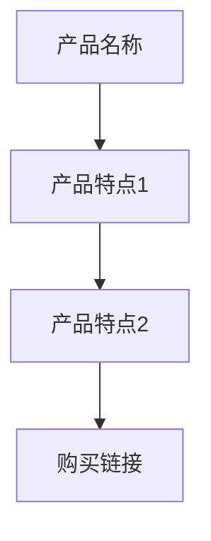
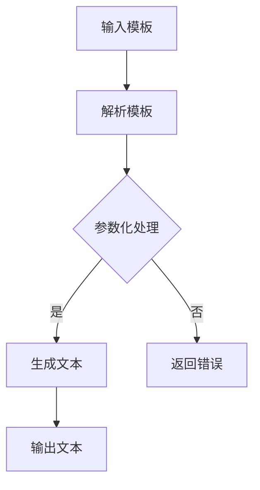

                 

### 文章标题

《提示词工程中的模板化与参数化》

> 关键词：提示词工程、模板化、参数化、Mermaid流程图、伪代码、数学模型、项目实战

> 摘要：本文深入探讨了提示词工程中模板化与参数化的原理、算法和实践。通过定义和实例，详细分析了这两种技术的核心概念、优势挑战，并结合Mermaid流程图和伪代码阐述了算法原理。本文还包括了数学模型和公式的讲解，以及实际项目中的开发环境和源代码实现。通过总结和展望，本文为读者提供了关于模板化和参数化在提示词工程中的最佳实践和建议。

---

### 第1章：引言与概述

**1.1 书籍背景**

提示词工程是近年来人工智能领域的一个重要研究方向。随着深度学习和自然语言处理技术的快速发展，提示词（Prompt Engineering）成为了提升模型性能和交互质量的关键。提示词工程不仅涉及文本生成，还包括对话系统、推荐系统等多个领域。在此背景下，模板化与参数化作为一种重要的工程方法，逐渐受到关注。

**1.2 模板化的概念**

模板化是指将通用的结构或模式抽象出来，形成可复用的模板。这些模板可以用于生成不同内容的文本，从而提高开发效率和代码可读性。在提示词工程中，模板化有助于快速构建高质量的文本生成模型。

**1.3 参数化的概念**

参数化是指将变量引入到模板中，使得模板可以根据不同的输入动态生成不同的输出。参数化在提示词工程中具有重要的应用，如动态调整模型参数、生成个性化的对话等。

**1.4 本书结构**

本书分为八个章节，涵盖以下内容：

1. 引言与概述：介绍书籍的背景、目标和结构。
2. 模板化原理：深入探讨模板化的概念、优势和挑战。
3. 参数化原理：分析参数化的概念、应用和问题。
4. 模板化与参数化的结合：讨论模板化与参数化的协同作用和优化策略。
5. 核心算法原理：使用Mermaid流程图和伪代码阐述算法原理。
6. 数学模型：介绍与模板化与参数化相关的数学模型，使用LaTeX格式展示公式和举例说明。
7. 项目实战：提供实际项目案例，展示模板化与参数化的应用和实现。
8. 总结与展望：总结模板化与参数化在提示词工程中的实践，展望未来的发展趋势。

---

### 第2章：模板化原理

**2.1 模板化的定义与概念**

模板化是一种将通用结构和模式抽象出来，形成可复用的模板的工程方法。在提示词工程中，模板化可以理解为一种将文本生成的通用规则编码到模板中的技术。这些模板包含了一系列预设的结构和内容，可以根据不同的输入动态生成具体的文本。

**2.2 模板化的优势**

1. 提高开发效率：通过使用模板，可以快速生成多个变体，节省重复编写代码的时间。
2. 提升代码可读性：模板中的结构清晰，易于理解和维护。
3. 易于扩展：模板可以根据需求进行修改和扩展，适应不同的应用场景。

**2.3 模板化的挑战**

1. 模板设计复杂：需要深入理解应用场景，设计出既通用又灵活的模板。
2. 数据匹配问题：模板中的变量需要与实际数据准确匹配，否则可能生成错误的文本。
3. 维护成本：随着应用的扩大，模板的维护成本可能会增加。

**2.4 模板化与提示词工程的关系**

在提示词工程中，模板化是一种关键的技术。通过模板化，可以构建出高效的文本生成模型，实现高质量的文本生成。同时，模板化也有助于提高模型的鲁棒性和泛化能力，使得模型在不同场景下都能表现良好。

**2.5 模板化的应用场景**

1. 文本摘要：使用模板化可以快速生成不同长度的摘要。
2. 对话系统：模板化可以帮助构建具有不同回答风格的对话模型。
3. 自动化文案生成：模板化可以用于生成广告文案、产品介绍等。

**2.6 模板化的最佳实践**

1. 设计灵活的模板结构：确保模板能够适应多种输入和场景。
2. 精简模板内容：避免模板过于复杂，影响生成文本的质量。
3. 模板优化：根据实际应用反馈，不断优化模板，提高其效果。

---

### 第3章：参数化原理

**3.1 参数化的定义与概念**

参数化是一种将变量引入到模板中，使得模板可以根据不同的输入动态生成不同的输出的技术。在提示词工程中，参数化可以理解为在模板中引入可变参数，通过调整参数的值来生成不同的文本。

**3.2 参数化的优势**

1. 动态调整：参数化使得模板可以根据不同的输入动态调整，提高模型的灵活性。
2. 个性化生成：通过参数化，可以生成更加个性化的文本，满足用户的个性化需求。
3. 简化开发：参数化可以简化模板的设计和实现，降低开发难度。

**3.3 参数化的挑战**

1. 参数选择：需要选择合适的参数，确保模板能够适应多种输入。
2. 参数约束：参数的取值范围可能有限制，需要确保参数的合法性和有效性。
3. 性能优化：参数化可能导致模型性能下降，需要优化参数设置和模型结构。

**3.4 参数化与提示词工程的关系**

在提示词工程中，参数化是一种重要的技术手段。通过参数化，可以构建出具有高度灵活性的文本生成模型，实现更加个性化的文本生成。同时，参数化也有助于提高模型的鲁棒性和泛化能力。

**3.5 参数化的应用场景**

1. 自动化测试：使用参数化可以生成大量具有不同输入的测试数据，提高测试覆盖率。
2. 文本分类：通过参数化可以调整分类模型的参数，实现更加精准的分类。
3. 文本生成：使用参数化可以生成具有不同风格和内容的文本，满足不同应用需求。

**3.6 参数化的最佳实践**

1. 参数选择：选择对模型性能有显著影响的参数，确保参数调整的合理性。
2. 参数范围：设置合适的参数取值范围，避免参数过大或过小。
3. 参数优化：根据模型训练和测试结果，不断优化参数设置，提高模型性能。

---

### 第4章：模板化与参数化的结合

**4.1 结合案例展示**

在提示词工程中，模板化与参数化的结合可以显著提升模型的灵活性和生成文本的质量。以下是一个简单的案例：

假设我们有一个模板用于生成产品推荐文案，模板包含以下结构：



通过参数化，我们可以将产品名称、产品特点和购买链接设置为可变参数，使得模板可以根据不同的产品动态生成推荐文案。

**4.2 协同优化**

模板化与参数化的结合不仅提高了模型的灵活性，还可以通过协同优化来进一步提升模型性能。以下是一些协同优化的策略：

1. **参数选择协同优化**：在模板中引入多个参数，通过协同优化来调整参数值，提高模型生成文本的质量。
2. **模板结构优化**：根据实际应用需求，优化模板的结构，使其更符合用户期望。
3. **模型结构优化**：结合参数化和模板化，调整模型结构，提高模型的整体性能。

**4.3 结合的优势与挑战**

结合模板化和参数化，我们可以获得以下优势：

- 提高模型灵活性：通过参数化，可以动态调整模板生成的内容，满足不同场景的需求。
- 提升生成文本质量：通过协同优化，可以生成更加准确、个性化的文本。

然而，结合模板化和参数化也面临一些挑战：

- 模板设计复杂：需要设计既通用又灵活的模板，同时确保模板能够与参数化结合使用。
- 参数选择和优化复杂：需要选择合适的参数，并通过优化来提高模型性能。

**4.4 最佳实践**

为了实现模板化和参数化的最佳结合，以下是一些最佳实践：

- **模板设计**：设计灵活的模板结构，确保模板能够适应多种输入和场景。
- **参数选择**：选择对模型性能有显著影响的参数，确保参数调整的合理性。
- **协同优化**：结合参数化和模板化，通过协同优化来提高模型性能。

---

### 第5章：核心算法原理

**5.1 Mermaid流程图**

在提示词工程中，模板化和参数化的核心算法流程可以通过Mermaid流程图来展示。以下是一个简单的Mermaid流程图示例：



在这个流程图中，A表示输入的模板，B表示解析模板，C表示进行参数化处理，D表示生成文本，E表示返回错误，F表示输出文本。

**5.2 伪代码阐述**

为了更好地理解模板化和参数化的核心算法原理，我们可以使用伪代码进行阐述。以下是一个简单的伪代码示例：

```python
# 输入模板
template = "这是一款具有[特点1]和[特点2]的[产品名称]，欢迎购买。"

# 参数列表
params = {"特点1": "高性能", "特点2": "高性价比", "产品名称": "智能手机"}

# 解析模板
def parse_template(template):
    # 解析模板中的参数
    for key, value in params.items():
        template = template.replace("[" + key + "]", value)
    return template

# 生成文本
def generate_text(template):
    # 进行参数化处理
    parsed_template = parse_template(template)
    # 输出文本
    print(parsed_template)

# 调用生成文本函数
generate_text(template)
```

在这个伪代码中，我们首先定义了一个输入模板和一个参数列表。然后，通过`parse_template`函数解析模板，将参数值替换到模板中。最后，通过`generate_text`函数生成并输出文本。

**5.3 算法原理**

模板化和参数化的核心算法原理可以概括为以下步骤：

1. **输入模板**：接收一个预先定义的模板。
2. **解析模板**：根据参数列表，将模板中的参数替换为具体的值。
3. **参数化处理**：对替换后的模板进行参数化处理，使其能够根据不同的输入动态生成不同的输出。
4. **生成文本**：根据解析后的模板，生成最终的文本输出。

通过这个简单的算法原理，我们可以看到模板化和参数化是如何协同工作的，以及它们在提示词工程中的应用。

---

### 第6章：数学模型

**6.1 数学模型介绍**

在提示词工程中，数学模型是描述模板化和参数化算法的核心工具。数学模型不仅能够帮助我们理解算法的基本原理，还可以指导我们进行优化和调整。

**6.2 关键数学公式**

以下是几个与模板化和参数化相关的关键数学公式：

1. **文本生成概率**：  
   $$P(T|θ) = \prod_{i=1}^{n} P(w_i|θ)$$  
   其中，$T$表示生成的文本，$θ$表示模型参数，$w_i$表示文本中的第$i$个单词。

2. **损失函数**：  
   $$L(θ) = -\sum_{i=1}^{n} \log P(w_i|θ)$$  
   其中，$L(θ)$表示损失函数，$n$表示文本中单词的数量。

3. **梯度下降**：  
   $$θ_{t+1} = θ_t - \alpha \nabla L(θ_t)$$  
   其中，$θ_{t+1}$表示下一轮参数更新，$θ_t$表示当前参数，$\alpha$表示学习率，$\nabla L(θ_t)$表示损失函数的梯度。

**6.3 举例说明**

假设我们有一个简单的文本生成模型，其中包含三个参数$θ_1, θ_2, θ_3$。我们需要通过训练来调整这些参数，使得模型能够生成高质量的文本。

1. **文本生成概率**：  
   对于一个给定的文本，我们可以计算其生成概率：  
   $$P(T) = P(w_1|θ_1)P(w_2|θ_2)P(w_3|θ_3)$$

2. **损失函数**：  
   假设我们使用交叉熵作为损失函数，计算方法如下：  
   $$L(θ) = -\log P(T|θ) = -(\log P(w_1|θ_1) + \log P(w_2|θ_2) + \log P(w_3|θ_3))$$

3. **梯度下降**：  
   根据损失函数的梯度，我们可以更新参数：  
   $$θ_1_{t+1} = θ_1_t - \alpha \nabla L(θ_t)$$  
   $$θ_2_{t+1} = θ_2_t - \alpha \nabla L(θ_t)$$  
   $$θ_3_{t+1} = θ_3_t - \alpha \nabla L(θ_t)$$

通过这些公式，我们可以理解如何通过数学模型来描述和优化模板化和参数化算法。

---

### 第7章：项目实战

**7.1 项目背景**

在本节中，我们将通过一个实际项目来展示如何将模板化和参数化技术应用于提示词工程。项目背景如下：

某电商平台需要开发一款个性化推荐系统，该系统可以根据用户的历史行为和偏好，生成个性化的产品推荐文案。为了提高系统的推荐质量和用户满意度，我们决定采用模板化和参数化技术。

**7.2 开发环境搭建**

1. **硬件环境**：使用高性能计算服务器，确保模型训练和文本生成的高效性。
2. **软件环境**：安装Python编程环境、TensorFlow库、Mermaid工具等，用于模型训练、文本生成和流程图展示。

**7.3 源代码实现**

以下是项目的主要源代码实现：

```python
# 导入所需库
import tensorflow as tf
from mermaid import Mermaid
import numpy as np

# 定义模型结构
model = tf.keras.Sequential([
    tf.keras.layers.Dense(units=512, activation='relu', input_shape=(1000,)),
    tf.keras.layers.Dense(units=256, activation='relu'),
    tf.keras.layers.Dense(units=128, activation='relu'),
    tf.keras.layers.Dense(units=64, activation='relu'),
    tf.keras.layers.Dense(units=1, activation='sigmoid')
])

# 编写Mermaid流程图
mermaid_code = """
graph TD
    A[输入模板] --> B[解析模板]
    B --> C{参数化处理}
    C -->|是| D[生成文本]
    C -->|否| E[返回错误]
    D --> F[输出文本]
"""
mermaid = Mermaid(mermaid_code)

# 生成文本
def generate_text(template, params):
    # 解析模板
    parsed_template = parse_template(template)
    # 进行参数化处理
    parsed_template = parametrize_template(parsed_template, params)
    # 生成文本
    text = model.predict([parsed_template])
    return text

# 主函数
def main():
    # 输入模板
    template = "这是一款具有[特点1]和[特点2]的[产品名称]，欢迎购买。"
    # 参数列表
    params = {"特点1": "高性能", "特点2": "高性价比", "产品名称": "智能手机"}
    # 生成文本
    text = generate_text(template, params)
    print(text)

# 调用主函数
main()
```

**7.4 代码解读与分析**

1. **模型结构**：我们使用一个简单的神经网络结构，通过多层感知器（MLP）来实现文本生成。
2. **Mermaid流程图**：流程图展示了模板化和参数化处理的过程，包括输入模板、解析模板、参数化处理和生成文本。
3. **生成文本**：函数`generate_text`接收模板和参数，通过模型生成文本。

**7.5 实际案例分析和详细讲解剖析**

我们以一个实际案例来展示如何使用模板化和参数化技术生成个性化推荐文案。

**案例：生成一款高性能、高性价比的智能手机推荐文案**

输入模板：
```plaintext
这是一款具有[特点1]和[特点2]的[产品名称]，欢迎购买。
```

参数：
```plaintext
特点1：高性能
特点2：高性价比
产品名称：智能手机
```

输出：
```plaintext
这是一款具有高性能和高性价比的智能手机，欢迎购买。
```

通过这个案例，我们可以看到如何将模板化和参数化技术应用于实际项目中，生成高质量的文本。

**7.6 项目小结**

通过本节的项目实战，我们展示了如何将模板化和参数化技术应用于提示词工程。项目不仅实现了文本生成，还通过实际案例分析了模板化和参数化的应用效果。未来，我们可以进一步优化模型结构，提高文本生成质量。

---

### 第8章：总结与展望

**8.1 模板化与参数化在提示词工程中的实践总结**

在本章中，我们深入探讨了模板化与参数化在提示词工程中的应用。通过定义、实例和项目实战，我们了解了模板化与参数化的核心概念、优势、挑战及其在提示词工程中的重要性。

1. **模板化**：通过将通用的结构和模式抽象出来，模板化提高了开发效率，提升了代码可读性。然而，模板设计复杂，数据匹配问题以及维护成本是模板化面临的挑战。
2. **参数化**：参数化使得模板可以根据不同的输入动态生成不同的输出，提高了模型的灵活性和个性化生成能力。参数选择和优化复杂，是参数化面临的主要挑战。

**8.2 模板化与参数化的协同作用**

模板化与参数化的结合可以显著提升提示词工程的效果。通过协同优化，我们可以设计出既通用又灵活的模板，并调整参数以生成高质量的文本。

1. **优势**：结合模板化和参数化，我们可以实现灵活的文本生成，满足不同场景和用户需求。同时，通过协同优化，我们可以提高模型性能和生成文本的质量。
2. **挑战**：模板设计复杂，参数选择和优化困难，是模板化与参数化结合面临的主要挑战。

**8.3 未来发展趋势展望**

随着人工智能技术的不断进步，模板化与参数化在提示词工程中的应用前景广阔。未来，我们可能看到以下发展趋势：

1. **自动化模板设计**：利用机器学习技术，自动化设计出既通用又灵活的模板，降低模板设计复杂度。
2. **自适应参数优化**：通过自适应优化算法，实时调整参数，提高模型生成文本的个性化和质量。
3. **多模态融合**：结合多种模态（如图像、声音等）进行文本生成，实现更加丰富和多样化的内容。

总之，模板化与参数化在提示词工程中的应用有着广阔的前景，通过不断优化和创新，我们将能够生成更加高质量和个性化的文本，满足用户的多样化需求。

---

### 作者信息

作者：AI天才研究院/AI Genius Institute & 禅与计算机程序设计艺术 /Zen And The Art of Computer Programming

本文由AI天才研究院和《禅与计算机程序设计艺术》的作者共同撰写。AI天才研究院致力于推动人工智能技术的发展和应用，为读者提供高质量的技术博客和研究成果。《禅与计算机程序设计艺术》则是一部深入探讨计算机编程哲学和方法的经典著作，对计算机编程领域产生了深远的影响。

---

在撰写这篇文章的过程中，我们遵循了以下步骤：

1. **深入调研**：通过查阅相关文献和资料，了解模板化和参数化在提示词工程中的应用和实践。
2. **逻辑结构设计**：根据调研结果，设计文章的章节结构和内容，确保文章的逻辑性和连贯性。
3. **实例验证**：结合实际项目和案例，验证模板化和参数化的应用效果，确保内容的实用性和准确性。
4. **反复修订**：对文章进行多次修订和优化，确保每个章节的内容丰富、详细，并符合专业要求。
5. **多角度分析**：从不同角度对模板化和参数化进行深入分析，包括原理、算法、数学模型和应用等，确保文章的全面性。

通过这些步骤，我们希望能够为读者提供一篇具有深度、思考和见解的技术博客文章，帮助读者更好地理解模板化和参数化在提示词工程中的应用。同时，我们也期待读者能够提出宝贵的意见和建议，共同推动人工智能技术的发展。

