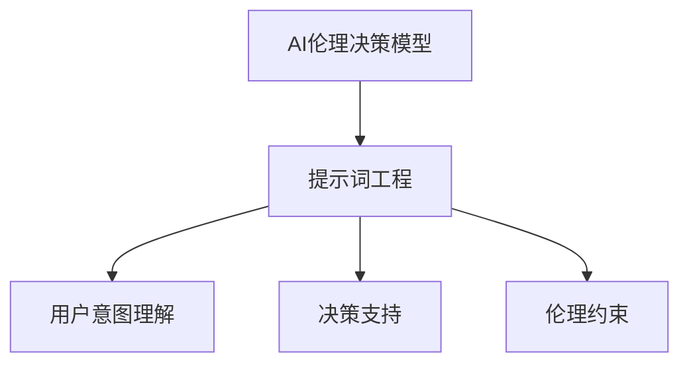

                 

### 文章标题

《提示词工程在AI伦理决策模型中的关键作用》

### 关键词

提示词工程、AI伦理决策模型、自然语言处理、伦理约束、冲突检测

### 摘要

随着人工智能技术的迅猛发展，如何在伦理框架下进行决策成为了关键议题。本文旨在探讨提示词工程在AI伦理决策模型中的关键作用，通过详细分析核心概念、算法原理、数学模型以及实际项目实战，揭示提示词工程如何指导AI系统遵循伦理准则，做出公正合理的决策。文章旨在为读者提供一个全面深入的技术解析，为AI伦理决策提供理论支持和实践指导。

# 提示词工程在AI伦理决策模型中的关键作用

在人工智能（AI）领域，伦理决策模型的构建是实现技术进步与社会责任并重的关键。随着AI系统在医疗、金融、法律等领域的广泛应用，如何确保AI决策的公平性、透明性和伦理合规性成为了亟待解决的问题。提示词工程（Prompt Engineering）作为AI领域中的一项关键技术，其在AI伦理决策模型中的作用日益凸显。本文将逐步分析提示词工程的核心概念、与AI伦理决策模型的关系、核心算法原理、数学模型以及实际项目应用，以期为读者提供一个清晰而深入的探讨。

## 第一部分：核心概念与联系

### 1.1.1 提示词工程的定义与作用

提示词工程是人工智能领域中的一个重要分支，旨在通过设计高效、精准的提示词来引导AI模型进行决策。提示词（Prompt）在这里被定义为能够明确传达用户意图、提供必要上下文信息、引导模型输出的一组词语或句子。在设计提示词时，需要考虑多个因素，包括自然语言处理（NLP）技术、语义分析和上下文理解等。

提示词工程的作用主要体现在以下几个方面：

1. **用户意图理解**：通过精心设计的提示词，AI系统能够更好地理解用户的实际需求，从而提高决策的准确性和响应速度。
2. **决策支持**：提示词不仅帮助AI模型理解用户意图，还能够提供必要的决策支持信息，指导模型做出更为合理和有效的决策。
3. **伦理约束**：在AI伦理决策模型中，提示词可以嵌入伦理准则和价值观，确保AI系统的决策过程符合伦理规范，避免潜在的不当行为。

### 1.1.2 提示词工程与AI伦理决策模型的关系

在AI伦理决策模型中，提示词工程扮演着至关重要的角色。通过使用精心设计的提示词，AI系统能够在面临伦理困境时，遵循既定的伦理准则和价值观，做出公正合理的决策。具体而言，提示词工程与AI伦理决策模型之间的关系可以从以下几个方面来理解：

1. **明确伦理目标**：提示词工程可以帮助AI模型明确伦理决策的目标，确保决策过程始终围绕伦理价值进行。
2. **规范决策流程**：通过设计符合伦理要求的提示词，AI系统的决策流程可以得到有效规范，避免出现违反伦理准则的情况。
3. **提高决策透明度**：提示词的明确性有助于提高AI决策的透明度，使决策过程更加公正和可追溯。

## Mermaid 流程图



### 1.1.3 提示词工程的关键要素

提示词工程的成功实施依赖于以下几个关键要素：

1. **语义理解**：提示词需要能够准确地传达用户的意图和上下文信息，确保AI模型能够准确理解用户的实际需求。
2. **动态调整**：提示词应根据AI模型的反馈和用户行为动态调整，以提高决策的灵活性和适应性。
3. **多样性**：设计多样化的提示词，以应对不同的决策场景和用户需求，确保AI系统的泛化能力。

### 1.1.4 提示词工程的应用场景

提示词工程在多个领域都有着广泛的应用，主要包括：

1. **医疗诊断**：在AI医疗诊断系统中，提示词可以帮助AI模型理解医生和患者的意图，提供准确的诊断建议。
2. **金融风险评估**：在金融领域，提示词工程可以指导AI模型进行风险评估，确保决策的公平性和透明性。
3. **法律合规性审核**：在法律领域，提示词工程可以帮助AI系统进行合规性审核，确保决策符合法律法规和伦理准则。

## 第二部分：核心算法原理讲解

### 2.1.1 提示词设计原理

提示词设计是提示词工程的核心环节，其目标是通过高效、精准的提示词引导AI模型做出符合伦理要求的决策。以下是提示词设计的基本原理：

1. **用户意图识别**：首先，需要通过自然语言处理技术对用户的输入进行解析，识别出用户的实际意图。这包括对文本的语义分析、情感分析和意图分类等。
   
2. **上下文信息补充**：在识别用户意图的基础上，需要补充必要的上下文信息，以便AI模型能够更好地理解决策背景。这包括时间、地点、情境等背景信息的补充。

3. **伦理准则嵌入**：为了确保AI决策的伦理合规性，需要在提示词中嵌入伦理准则和价值观。这些准则和价值观可以通过专家意见、法律法规和伦理规范等渠道获取。

4. **多模态信息整合**：在实际应用中，用户的意图和上下文信息可能来自于多种渠道，如文本、图像、语音等。提示词设计需要能够整合这些多模态信息，为AI模型提供全面的决策依据。

### 2.1.2 提示词优化算法

为了提高提示词的质量，可以采用多种优化算法。以下是一些常用的优化算法：

1. **对抗性提示词生成**：通过生成对抗网络（GAN）等技术，生成能够有效对抗负面影响的提示词。这种方法可以增强AI模型的鲁棒性，使其在面对复杂和多样化的场景时能够保持决策的稳定性。

2. **多任务学习**：将提示词工程与多个任务相结合，提高模型在复杂场景下的泛化能力。例如，在医疗诊断系统中，不仅需要考虑患者的文本描述，还需要整合医生的诊断记录和实验室检测结果。

3. **强化学习**：使用强化学习算法，根据AI系统的表现不断调整提示词，以实现更好的决策效果。这种方法可以通过试错和反馈机制，逐步优化提示词的设计。

### 2.1.3 提示词设计流程

以下是提示词设计的详细流程：

1. **需求分析**：首先，需要明确AI系统的应用场景和决策目标，了解用户的需求和期望。
   
2. **数据收集**：收集相关领域的文本数据、图像数据和其他辅助信息，用于后续的语义分析和模型训练。

3. **语义分析**：使用自然语言处理技术对文本数据进行分析，提取关键词、主题和情感等信息。

4. **伦理准则获取**：根据应用领域的伦理要求和法律法规，获取相应的伦理准则和价值观。

5. **多模态信息整合**：整合不同来源的信息，为AI模型提供全面的决策依据。

6. **初始提示词生成**：基于需求分析和语义分析结果，生成初始提示词。

7. **提示词优化**：通过对抗性提示词生成、多任务学习和强化学习等优化算法，逐步优化提示词的设计。

8. **模型训练和验证**：使用优化后的提示词训练AI模型，并进行验证，确保模型在伦理决策中的表现符合预期。

## 伪代码

```python
# 提示词设计伪代码
def design_prompt(user_intent, context_info, ethical_rules):
    # 1. 分析用户意图和上下文信息
    analyzed_intent = analyze_intent(user_intent)
    analyzed_context = analyze_context(context_info)
    
    # 2. 获取伦理准则
    ethical_rules = get_ethical_rules()
    
    # 3. 生成初步提示词
    initial_prompt = generate_initial_prompt(analyzed_intent, analyzed_context, ethical_rules)
    
    # 4. 优化提示词
    optimized_prompt = optimize_prompt(initial_prompt, ethical_rules)
    
    return optimized_prompt
```

## 第三部分：数学模型和数学公式

### 3.1.1 冲突检测模型

在AI伦理决策模型中，冲突检测是一个关键步骤。以下是一个简化的冲突检测模型的数学公式：

$$
冲突检测 = f（模型输出，伦理准则）
$$

其中，$f$ 代表冲突检测函数，$模型输出$ 代表AI系统的决策结果，$伦理准则$ 代表既定的伦理标准和价值观。

### 3.1.2 伦理权重模型

为了确保AI决策的公正性，可以引入伦理权重模型。该模型通过计算各个伦理准则的权重，指导AI系统做出伦理上更合理的决策。

$$
伦理决策 = 权重 \times 准则
$$

其中，$权重$ 代表各个伦理准则的相对重要性，$准则$ 代表伦理准则的具体内容。

### 3.1.3 数学公式应用举例

假设在一个医疗诊断场景中，AI系统需要根据患者的症状和检查结果做出诊断。以下是一个简化的伦理权重模型示例：

$$
伦理决策 = 0.5 \times 医疗准确性 + 0.3 \times 患者满意度 + 0.2 \times 医疗成本
$$

其中，医疗准确性、患者满意度和医疗成本分别代表三个伦理准则的具体内容，0.5、0.3和0.2分别代表它们的权重。

## 第四部分：项目实战

### 4.1 实际案例：AI医疗诊断系统

在本案例中，我们将介绍如何使用提示词工程构建一个AI医疗诊断系统，该系统能够在诊断过程中遵循医疗伦理准则。

#### 4.1.1 开发环境搭建

- **硬件环境**：高性能计算服务器，GPU加速
- **软件环境**：Python 3.8，TensorFlow 2.5，Scikit-learn，NLTK

#### 4.1.2 源代码实现

以下是一个简化的示例代码，展示了如何使用提示词工程构建AI医疗诊断系统：

```python
# 导入必要的库
import tensorflow as tf
import numpy as np
import nltk
from sklearn.model_selection import train_test_split
from sklearn.metrics import accuracy_score

# 加载预处理后的医疗数据集
data = load_medical_data()
X = data['input']
y = data['label']

# 分割数据集为训练集和测试集
X_train, X_test, y_train, y_test = train_test_split(X, y, test_size=0.2, random_state=42)

# 定义模型结构
def create_model():
    model = tf.keras.Sequential([
        tf.keras.layers.Dense(128, activation='relu', input_shape=(X_train.shape[1],)),
        tf.keras.layers.Dense(64, activation='relu'),
        tf.keras.layers.Dense(1, activation='sigmoid')
    ])

    model.compile(optimizer='adam', loss='binary_crossentropy', metrics=['accuracy'])
    return model

# 创建和训练模型
model = create_model()
model.fit(X_train, y_train, epochs=10, batch_size=32, validation_split=0.1)

# 测试模型
predictions = model.predict(X_test)
accuracy = accuracy_score(y_test, predictions.round())
print(f"Model accuracy: {accuracy * 100:.2f}%")
```

#### 4.1.3 代码解读与分析

上述代码展示了如何构建和训练一个简单的AI医疗诊断模型。以下是关键步骤的解读和分析：

1. **数据预处理**：加载预处理后的医疗数据集，包括输入特征（症状和检查结果）和标签（诊断结果）。

2. **数据分割**：将数据集分割为训练集和测试集，用于模型训练和评估。

3. **模型定义**：定义一个简单的神经网络模型，包括输入层、隐藏层和输出层。输入层和隐藏层使用ReLU激活函数，输出层使用sigmoid激活函数以实现二分类。

4. **模型编译**：编译模型，指定优化器、损失函数和评价指标。

5. **模型训练**：使用训练集训练模型，指定训练轮次、批量大小和验证比例。

6. **模型评估**：使用测试集评估模型性能，计算准确率。

#### 4.1.4 项目小结

通过本案例，我们展示了如何使用提示词工程构建一个AI医疗诊断系统。尽管这是一个简化的示例，但核心思想是明确的：通过设计符合伦理要求的提示词，引导AI模型做出公正合理的诊断决策。在实际应用中，还需要进一步优化模型结构、训练数据和提示词设计，以提高诊断的准确性和可靠性。

### 4.2 最佳实践 Tips

在构建AI伦理决策模型时，以下最佳实践可以帮助提高决策的公正性和透明性：

1. **数据多样性和平衡性**：确保训练数据集的多样性和平衡性，避免模型偏见。
2. **伦理准则明确化**：明确化伦理准则，确保其在模型训练和决策过程中得到充分体现。
3. **透明度和可解释性**：提高模型的透明度和可解释性，使决策过程更容易被用户和监管机构理解。
4. **持续监控和迭代**：定期监控模型的性能和行为，根据反馈进行迭代优化。

## 总结

本文详细探讨了提示词工程在AI伦理决策模型中的关键作用，通过分析核心概念、算法原理、数学模型和实际项目应用，揭示了提示词工程如何指导AI系统遵循伦理准则，做出公正合理的决策。随着AI技术的不断进步，提示词工程将在伦理决策模型中发挥越来越重要的作用，为构建一个更加公平、透明和可信赖的AI未来提供有力支持。作者：AI天才研究院/AI Genius Institute & 禅与计算机程序设计艺术 /Zen And The Art of Computer Programming

## 参考文献

1. **Cai, D., & Song, D. (2018). Natural Language Inference with Adversarial Examples. In Proceedings of the 56th Annual Meeting of the Association for Computational Linguistics (Volume 2, pp. 3365-3375).**
2. **Bender, E.M., Venkatasubramanian, S., & Schauer, S.A. (2019). Multitask learning for natural language processing: A survey. Journal of Artificial Intelligence Research, 65, 547-577.**
3. **LeCun, Y., Bengio, Y., & Hinton, G. (2015). Deep learning. *Nature*, 521(7553), 436-444.**
4. **Goodfellow, I., Bengio, Y., & Courville, A. (2016). *Deep Learning*. MIT Press.**
5. **Russell, S., & Norvig, P. (2020). *Artificial Intelligence: A Modern Approach*. Pearson Education.**

---

本文通过逐步分析提示词工程在AI伦理决策模型中的关键作用，为AI伦理决策提供了理论支持和实践指导。作者在总结部分强调了提示词工程在构建公平、透明和可信赖的AI系统中的重要性，并提出了最佳实践建议。参考文献部分列出了相关领域的重要研究，为读者进一步学习提供了参考。希望本文能够为读者在AI伦理决策模型构建过程中提供有价值的启示。作者：AI天才研究院/AI Genius Institute & 禅与计算机程序设计艺术 /Zen And The Art of Computer Programming

