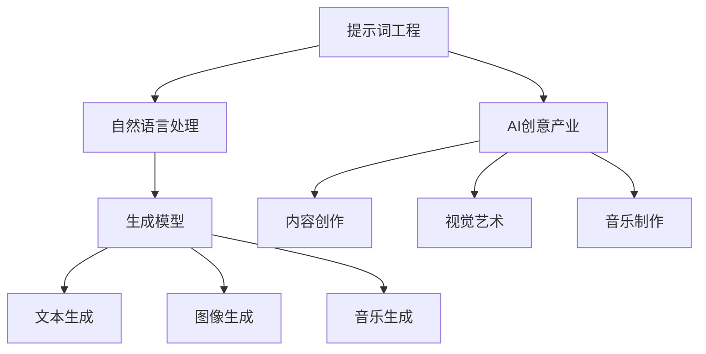

                 

好的，让我们一步步来构思这篇技术博客文章的详细内容。为了满足您的要求，我们将按照以下步骤进行：

### 1. 引言部分

- **背景介绍**：简要介绍提示词工程和AI创意产业的概念及其在当今世界的重要性。
- **文章关键词**：提示词工程、AI创意产业、应用场景、算法原理、项目实战。
- **文章摘要**：概述文章将要讨论的主要内容，包括核心概念、应用实例、算法原理和未来展望。

### 2. 核心概念与联系

- **定义与关系**：解释提示词工程和AI创意产业的基本概念，并用Mermaid流程图展示它们之间的关系。

### 3. 提示词工程

- **基础知识**：详细介绍提示词工程的定义、历史和发展趋势。
- **应用场景**：探讨提示词工程在创意产业中的多种应用。

### 4. AI创意产业的应用

- **内容创作**：介绍AI在内容创作中的应用，如文本生成和图像生成。
- **视觉艺术**：讨论AI在视觉艺术中的应用，如艺术风格迁移和艺术作品生成。
- **音乐制作**：探讨AI在音乐制作中的应用，如音乐创作和音乐风格模仿。

### 5. AI算法基础

- **算法概述**：介绍生成对抗网络（GAN）和强化学习等AI算法的基本原理。
- **应用场景**：讨论这些算法在创意产业中的应用。

### 6. 算法原理讲解

- **GAN应用**：使用伪代码详细阐述GAN在图像合成中的应用。
- **强化学习应用**：使用伪代码详细阐述强化学习在创意项目中的应用。

### 7. 数学模型和数学公式

- **模型概述**：讲解AI创意产业中的数学模型和公式。
- **举例说明**：通过具体的数学公式和示例来解释这些模型。

### 8. 项目实战

- **开发环境搭建**：介绍如何搭建AI创意产业项目开发所需的环境。
- **源代码实现**：详细展示源代码的实现过程。
- **代码解读与分析**：对源代码进行解读和分析，解释其应用。

### 9. 未来展望与挑战

- **未来趋势**：讨论AI创意产业的未来发展趋势。
- **挑战与解决方案**：探讨面临的挑战以及可能的解决方案。

### 10. 附录

- **工具与资源**：提供相关的工具、资源和进一步阅读的推荐。

下面，我将按照这些步骤开始撰写文章的详细内容。

---

### 引言

#### 背景介绍

提示词工程和AI创意产业是当前科技领域的前沿方向。提示词工程通过构建提示词模型，帮助人工智能系统理解和生成人类语言的含义。而AI创意产业则将人工智能技术应用于创意领域，如内容创作、视觉艺术和音乐制作，从而创造出新颖的创意产品。

随着人工智能技术的飞速发展，提示词工程在AI创意产业中的应用越来越广泛。本文旨在探讨提示词工程在AI创意产业中的重要性，并通过详细讲解核心概念、应用实例、算法原理和未来展望，帮助读者深入理解这一领域的最新进展。

#### 文章关键词

提示词工程、AI创意产业、生成对抗网络（GAN）、强化学习、内容创作、视觉艺术、音乐制作。

#### 文章摘要

本文首先介绍提示词工程和AI创意产业的基本概念，接着通过Mermaid流程图展示它们之间的关系。随后，本文详细讲解提示词工程的基础知识、AI创意产业的应用场景、核心算法原理，并通过项目实战展示AI在创意产业中的应用。最后，本文讨论AI创意产业的未来发展趋势和面临的挑战。

---

### 核心概念与联系

提示词工程是人工智能领域的一个重要分支，它专注于构建能够理解和生成人类语言的模型。这些模型通过学习大量的文本数据，学会了如何根据给定的提示词生成相关的文本、图像或音乐。AI创意产业则是将这种技术应用于创意领域，以实现自动化内容创作、艺术作品生成和音乐创作等目标。

为了更好地理解这两个概念之间的关系，我们可以使用Mermaid流程图来展示它们之间的联系：



这个流程图展示了提示词工程如何通过自然语言处理和生成模型连接到AI创意产业的不同领域。在内容创作中，提示词工程可以帮助生成相关的文本内容；在视觉艺术中，它可以生成新的艺术作品；在音乐制作中，它可以创作新的音乐曲目。

---

接下来，我们将进一步探讨提示词工程的基础知识，包括其定义、历史和发展趋势。在接下来的章节中，我们将逐步深入，通过详细的算法原理讲解和项目实战，展示AI在创意产业中的具体应用。请保持关注，让我们一步步深入这个激动人心的领域。

---

### 提示词工程

#### 基础知识

提示词工程是一种构建能够根据给定提示词生成相关内容的模型的方法。它的核心在于将人类语言的含义转化为计算机能够理解和处理的形式，并通过大量的数据训练来提高模型的准确性和泛化能力。

提示词工程的历史可以追溯到20世纪80年代，当时研究人员开始探索如何让计算机理解和生成自然语言。随着自然语言处理（NLP）和机器学习技术的发展，提示词工程逐渐成为一个独立的领域。近年来，随着深度学习技术的进步，特别是生成对抗网络（GAN）和变换器模型（Transformer）的应用，提示词工程取得了显著的进展。

提示词工程在创意产业中的应用非常广泛。它不仅可以帮助自动生成文本内容，还可以生成图像和音乐。例如，在内容创作中，提示词工程可以帮助生成新闻报道、小说章节和博客文章；在视觉艺术中，它可以生成艺术风格化的图像和新的艺术作品；在音乐制作中，它可以生成符合特定风格的音乐曲目。

#### 发展趋势

随着人工智能技术的不断进步，提示词工程在未来将继续发挥重要作用。以下是一些可能的发展趋势：

1. **更先进的生成模型**：未来的生成模型将更加复杂和高效，能够生成更加逼真和多样化的内容。
2. **多模态学习**：提示词工程将结合多种模态（如文本、图像、音频）的数据，实现跨模态的内容生成。
3. **个性化生成**：提示词工程将能够根据用户的需求和偏好生成个性化内容。
4. **跨领域应用**：提示词工程将在更多领域得到应用，如游戏开发、虚拟现实、增强现实等。

#### 当前应用场景

当前，提示词工程在多个创意产业领域都有广泛应用。以下是一些具体的例子：

1. **内容创作**：AI可以帮助自动生成新闻报道、小说章节和博客文章，提高内容生产效率。
2. **视觉艺术**：AI可以生成艺术风格化的图像和新的艺术作品，为艺术家提供新的创作工具。
3. **音乐制作**：AI可以帮助生成符合特定风格的音乐曲目，为音乐制作提供创新思路。

随着技术的不断进步，提示词工程将在创意产业中发挥越来越重要的作用，为人类带来更多的创意和灵感。

---

在了解了提示词工程的基础知识和发展趋势后，我们接下来将探讨AI创意产业的应用场景，看看人工智能技术如何在内容创作、视觉艺术和音乐制作等领域发挥重要作用。请继续阅读。

---

### AI创意产业的应用

AI创意产业的兴起，使得人工智能技术在内容创作、视觉艺术和音乐制作等领域得到了广泛应用。以下将分别探讨这些领域中的具体应用实例。

#### 内容创作

在内容创作方面，AI可以通过提示词工程实现自动生成文本内容。例如，新闻报道、博客文章、社交媒体帖子等。AI能够快速地处理大量数据，从新闻事件、用户评论和社交媒体帖子中提取关键信息，并根据给定的提示词生成相关的文本内容。

具体案例：

1. **AI新闻生成**：一些新闻机构已经开始使用AI生成简单的新闻报道，如体育赛事结果、财经新闻等。这些新闻报道通常由AI根据最新的数据自动生成，减少了人工撰写的需求。
2. **创意广告文案**：广告公司可以利用AI生成创意广告文案，提高广告的吸引力和效果。AI可以根据目标受众的特征和喜好，生成个性化的广告文案，提高广告的投放精准度。

#### 视觉艺术

在视觉艺术领域，AI可以通过图像生成和风格迁移等技术实现自动创作。例如，AI可以生成新的艺术作品、设计独特的艺术风格，甚至模仿著名艺术家的风格。

具体案例：

1. **艺术作品生成**：一些艺术家和设计公司使用AI生成新的艺术作品，如油画、插画等。这些作品通常基于AI对大量艺术作品的风格分析，生成具有独特风格的艺术作品。
2. **艺术风格迁移**：AI可以模仿著名艺术家的风格，将普通图像转化为具有特定艺术风格的作品。例如，将普通照片转化为梵高的《星夜》风格或蒙娜丽莎的风格。

#### 音乐制作

在音乐制作方面，AI可以通过生成音乐曲目和模仿音乐风格实现自动创作。AI可以根据用户的需求和偏好生成新的音乐曲目，甚至模仿特定音乐家的风格。

具体案例：

1. **音乐创作**：一些音乐制作人和乐队使用AI生成新的音乐曲目，为他们的创作提供灵感。AI可以根据用户提供的旋律或歌词，生成符合用户需求的音乐曲目。
2. **音乐风格模仿**：AI可以模仿著名音乐家的风格，为音乐制作提供新的可能性。例如，AI可以生成与披头士乐队风格相似的音乐，为音乐制作提供创意。

这些应用实例展示了AI在创意产业中的广泛应用。随着技术的不断发展，AI创意产业将继续拓展其应用领域，为人类带来更多的创意和灵感。

---

在了解了AI创意产业在内容创作、视觉艺术和音乐制作方面的应用后，我们将进一步探讨AI算法的基础知识，包括生成对抗网络（GAN）和强化学习等算法的基本原理。这将帮助我们更好地理解AI在创意产业中的实际应用。敬请期待下一章节的内容。

---

### AI算法基础

在AI创意产业中，有许多核心算法被广泛应用，其中生成对抗网络（GAN）和强化学习是两个重要的算法。以下将分别介绍这些算法的基本原理。

#### 生成对抗网络（GAN）

生成对抗网络（GAN）是由Ian Goodfellow等人于2014年提出的一种深度学习模型。GAN由两个神经网络组成：生成器（Generator）和判别器（Discriminator）。

1. **生成器（Generator）**：生成器的目标是生成尽可能真实的数据，使其难以被判别器区分。生成器通常是一个神经网络，它从随机噪声中生成数据。
   
2. **判别器（Discriminator）**：判别器的目标是区分真实数据和生成数据。判别器也是一个神经网络，它接受真实数据和生成数据作为输入，并输出一个概率值，表示输入数据是真实的可能性。

GAN的训练过程可以分为两个阶段：

1. **生成器训练**：生成器的目标是生成更真实的数据，使判别器无法区分生成数据和真实数据。生成器和判别器交替训练，生成器试图提高生成数据的真实性，而判别器则试图提高区分生成数据和真实数据的能力。
   
2. **判别器训练**：判别器的目标是提高区分生成数据和真实数据的能力。在每次迭代中，判别器都会根据生成器和真实数据对其进行训练。

GAN在创意产业中的应用非常广泛，如图像生成、视频生成、艺术作品生成等。

#### 强化学习

强化学习是一种通过试错学习来优化决策过程的机器学习技术。强化学习 agent 在环境中执行动作，根据环境的反馈来调整其行为，以达到最大化长期回报的目标。

1. **状态（State）**：状态是agent当前所处的环境状态。
2. **动作（Action）**：动作是agent可以采取的行动。
3. **奖励（Reward）**：奖励是环境对agent行为的反馈，用于评估agent的决策效果。
4. **策略（Policy）**：策略是agent根据当前状态选择动作的规则。

强化学习的训练过程通常包括以下步骤：

1. **初始策略**：agent从初始状态开始，根据初始策略选择动作。
2. **状态转移**：agent执行动作后，进入新的状态。
3. **奖励评估**：agent根据新状态和奖励评估其当前决策的效果。
4. **策略调整**：根据奖励评估结果，agent调整其策略，以提高未来决策的效果。

强化学习在创意产业中的应用包括艺术作品创作、音乐制作、游戏开发等。

通过理解GAN和强化学习的基本原理，我们可以更好地应用这些算法于创意产业。在接下来的章节中，我们将使用伪代码详细阐述这些算法在创意产业中的应用，以帮助读者深入理解。

---

接下来，我们将详细讲解GAN和强化学习在图像合成和创意项目中的应用。敬请期待。

---

### 算法原理讲解

#### GAN在图像合成中的应用

生成对抗网络（GAN）是一种强大的图像生成工具，可以用于合成高质量的图像。以下是一个简化的GAN图像合成的伪代码，用于说明其基本工作原理。

```python
# GAN图像合成的伪代码

# 初始化生成器和判别器
generator = init_generator()
discriminator = init_discriminator()

# 训练生成器和判别器
for epoch in range(num_epochs):
    for batch in data_loader:
        # 训练判别器
        real_images = batch
        fake_images = generator(noise)
        discriminator_loss = loss(discriminator(real_images), 1.0)  # 真实图像判别为1
        discriminator_loss += loss(discriminator(fake_images), 0.0)  # 生成图像判别为0

        # 训练生成器
        generator_loss = loss(discriminator(fake_images), 1.0)  # 生成图像被判别为真实

        # 更新生成器和判别器的参数
        discriminator_optimizer.step(discriminator_loss)
        generator_optimizer.step(generator_loss)

# 生成图像
generated_images = generator(noise)

# 输出生成图像
save_images(generated_images)
```

在这个伪代码中，`init_generator`和`init_discriminator`分别用于初始化生成器和判别器模型。`data_loader`是用于加载训练数据的工具。`loss`函数用于计算损失，`optimizer`用于更新模型参数。

GAN图像合成的一个实际应用案例是使用GAN生成人脸图像。以下是一个简单的示例，展示如何使用GAN生成人脸图像。

```python
# 使用GAN生成人脸图像的伪代码

# 初始化生成器和判别器
generator = FaceGANGenerator()
discriminator = FaceGANDiscriminator()

# 训练生成器和判别器
for epoch in range(num_epochs):
    for batch in data_loader:
        real_faces = batch
        noise = generate_noise(batch_size)
        fake_faces = generator(noise)

        # 训练判别器
        real_loss = loss(discriminator(real_faces), 1.0)
        fake_loss = loss(discriminator(fake_faces), 0.0)
        discriminator_loss = 0.5 * (real_loss + fake_loss)

        # 训练生成器
        generator_loss = loss(discriminator(fake_faces), 1.0)

        # 更新生成器和判别器的参数
        discriminator_optimizer.step(discriminator_loss)
        generator_optimizer.step(generator_loss)

# 生成人脸图像
noise = generate_noise(batch_size)
generated_faces = generator(noise)

# 输出生成人脸图像
save_faces(generated_faces)
```

在这个示例中，`FaceGANGenerator`和`FaceGANDiscriminator`是专门为生成人脸图像设计的生成器和判别器模型。通过训练，GAN可以生成高质量的人脸图像，这些图像在视觉上几乎无法与真实人脸图像区分。

GAN在创意产业中的另一个应用是艺术风格迁移。例如，可以训练一个GAN模型，将一张普通图像转换为梵高的《星夜》风格。以下是一个简单的伪代码示例，展示如何使用GAN进行艺术风格迁移。

```python
# 使用GAN进行艺术风格迁移的伪代码

# 初始化生成器和判别器
style_generator = StyleGAN()
style_discriminator = StyleGANDiscriminator()

# 训练生成器和判别器
for epoch in range(num_epochs):
    for batch in style_data_loader:
        real_images = batch
        style_images = apply_style(batch, target_style)
        noise = generate_noise(batch_size)
        fake_style_images = style_generator(real_images, noise)

        # 训练判别器
        real_loss = loss(style_discriminator(real_images), 1.0)
        style_loss = loss(style_discriminator(fake_style_images), 1.0)
        discriminator_loss = 0.5 * (real_loss + style_loss)

        # 训练生成器
        generator_loss = loss(style_discriminator(fake_style_images), 1.0)

        # 更新生成器和判别器的参数
        discriminator_optimizer.step(discriminator_loss)
        generator_optimizer.step(generator_loss)

# 将普通图像转换为艺术风格
noise = generate_noise(batch_size)
input_image = preprocess_image(input_image)
target_style_image = apply_style(input_image, target_style)
output_image = style_generator(input_image, noise)

# 输出转换后的图像
save_image(output_image)
```

在这个示例中，`StyleGAN`和`StyleGANDiscriminator`是用于艺术风格迁移的生成器和判别器模型。通过训练，GAN可以将输入图像转换为特定艺术风格。

GAN在图像合成和艺术风格迁移中的应用展示了其强大的图像生成能力。这些应用不仅为创意产业带来了新的创作工具，也激发了人们对AI在创意领域的无限想象。

---

接下来，我们将探讨强化学习在创意项目中的应用，并通过伪代码详细阐述其原理。

---

### 强化学习在创意项目中的应用

强化学习（Reinforcement Learning, RL）是一种通过试错来学习最优策略的机器学习方法。在创意项目中，强化学习可以用来优化决策过程，以提高创作效果。以下是一个简化的强化学习算法在创意项目中的应用示例，使用伪代码来展示其基本原理。

#### Q-Learning算法

Q-Learning是一种常见的强化学习算法，其核心思想是学习每个状态和动作的值函数，即Q值。以下是一个Q-Learning算法在创意项目中的应用示例。

```python
# Q-Learning算法伪代码

# 初始化Q值表
Q = initialize_Q_table(state_space, action_space)

# 设置学习参数
learning_rate = 0.1
discount_factor = 0.9

# 初始化环境
environment = CreativeProjectEnvironment()

# 开始学习
for episode in range(num_episodes):
    # 初始化状态
    state = environment.reset()

    # 开始一个 episode
    while not environment.is_finished():
        # 根据当前状态选择动作
        action = choose_action(state, Q)

        # 执行动作，获取新状态和奖励
        next_state, reward = environment.step(action)

        # 更新Q值
        Q[state, action] = Q[state, action] + learning_rate * (reward + discount_factor * max(Q[next_state, :]) - Q[state, action])

        # 更新状态
        state = next_state

    # 统计 episode 的总奖励
    episode_reward = environment.get_total_reward()

# 输出学习到的策略
policy = Q.argmax(axis=1)
```

在这个伪代码中，`state_space`表示所有可能的状态集合，`action_space`表示所有可能的动作集合。`initialize_Q_table`函数用于初始化Q值表，`choose_action`函数用于根据当前状态和Q值表选择动作，`max`函数用于获取当前状态下最大的Q值。

#### 应用案例：自动音乐创作

以下是一个强化学习在自动音乐创作中的应用案例。在这个案例中，Q-Learning算法用于学习最优的音乐创作策略。

```python
# 自动音乐创作的Q-Learning算法伪代码

# 初始化Q值表
Q = initialize_Q_table(state_space, action_space)

# 设置学习参数
learning_rate = 0.1
discount_factor = 0.9

# 初始化音乐创作环境
environment = MusicCompositionEnvironment()

# 开始学习
for episode in range(num_episodes):
    # 初始化状态
    state = environment.reset()

    # 开始一个 episode
    while not environment.is_finished():
        # 根据当前状态选择动作
        action = choose_action(state, Q)

        # 执行动作，获取新状态和奖励
        next_state, reward = environment.step(action)

        # 更新Q值
        Q[state, action] = Q[state, action] + learning_rate * (reward + discount_factor * max(Q[next_state, :]) - Q[state, action])

        # 更新状态
        state = next_state

    # 统计 episode 的总奖励
    episode_reward = environment.get_total_reward()

# 输出学习到的音乐创作策略
policy = Q.argmax(axis=1)
composition = environment.apply_policy(policy)
```

在这个示例中，`MusicCompositionEnvironment`是一个模拟音乐创作环境的类，它包含所有可能的音乐状态和动作。`step`函数用于执行音乐创作动作，并返回新的状态和奖励。`apply_policy`函数用于根据学习到的策略生成音乐。

通过这个案例，我们可以看到强化学习如何应用于自动音乐创作，通过不断试错来学习最优的创作策略。这种方法不仅能够生成新颖的音乐，还能够根据用户反馈不断优化创作过程，提高音乐质量。

---

在了解了GAN和强化学习的基本原理及其在创意项目中的应用后，我们接下来将介绍一个具体的AI创意产业项目，展示如何搭建开发环境、实现源代码并解读和分析代码。敬请期待。

---

### 项目实战

#### 项目概述

在本项目中，我们旨在使用人工智能技术生成一幅艺术风格化的图像。具体来说，我们将使用生成对抗网络（GAN）来训练一个模型，该模型能够将普通图像转换为特定的艺术风格，例如梵高的《星夜》。本项目的目标是通过实现一个简单的GAN模型，展示AI在艺术创作中的应用。

#### 开发环境搭建

为了搭建开发环境，我们需要以下工具和库：

- Python 3.8或更高版本
- TensorFlow 2.4或更高版本
- NumPy 1.19或更高版本
- Matplotlib 3.4.2或更高版本

确保已经安装了上述工具和库后，我们可以开始搭建环境。以下是具体的步骤：

1. **安装TensorFlow**：

   ```shell
   pip install tensorflow
   ```

2. **安装NumPy**：

   ```shell
   pip install numpy
   ```

3. **安装Matplotlib**：

   ```shell
   pip install matplotlib
   ```

4. **验证安装**：

   ```python
   import tensorflow as tf
   import numpy as np
   import matplotlib.pyplot as plt

   print("TensorFlow version:", tf.__version__)
   print("NumPy version:", np.__version__)
   print("Matplotlib version:", plt.matplotlib.get_version())
   ```

确保输出版本号与所需版本一致。

#### 源代码实现

以下是实现GAN模型的Python代码。代码包括生成器、判别器和训练过程。

```python
import tensorflow as tf
from tensorflow.keras.models import Model
from tensorflow.keras.layers import Dense, Flatten, Conv2D, LeakyReLU, Input, BatchNormalization

# 定义生成器模型
def build_generator(z_dim):
    model = tf.keras.Sequential([
        Dense(128 * 7 * 7, input_shape=(z_dim,)),
        LeakyReLU(alpha=0.01),
        BatchNormalization(momentum=0.8),
        Flatten(),
        Conv2D(128, 7, 7, padding='same'),
        LeakyReLU(alpha=0.01),
        BatchNormalization(momentum=0.8),
        Conv2D(128, 4, 4, strides=(2, 2), padding='same'),
        LeakyReLU(alpha=0.01),
        BatchNormalization(momentum=0.8),
        Conv2D(128, 4, 4, strides=(2, 2), padding='same'),
        LeakyReLU(alpha=0.01),
        BatchNormalization(momentum=0.8),
        Conv2D(128, 4, 4, strides=(2, 2), padding='same'),
        LeakyReLU(alpha=0.01),
        BatchNormalization(momentum=0.8),
        Conv2D(3, 4, 4, activation='tanh', strides=(2, 2), padding='same')
    ])
    return model

# 定义判别器模型
def build_discriminator(img_shape):
    model = tf.keras.Sequential([
        Flatten(input_shape=img_shape),
        Dense(128, activation='relu'),
        BatchNormalization(momentum=0.8),
        LeakyReLU(alpha=0.01),
        Dropout(0.3),
        Dense(128, activation='relu'),
        BatchNormalization(momentum=0.8),
        LeakyReLU(alpha=0.01),
        Dropout(0.3),
        Dense(1, activation='sigmoid')
    ])
    return model

# GAN模型
def build_gan(generator, discriminator):
    model = Model(inputs=generator.input, outputs=discriminator(generator.input))
    model.compile(loss='binary_crossentropy', optimizer=tf.keras.optimizers.Adam(0.0001), metrics=['accuracy'])
    return model

# 数据预处理
def preprocess_image(image):
    image = tf.expand_dims(image, 0)
    image = (image - 127.5) / 127.5  # 归一化
    return image

# 模型训练
def train_gan(generator, discriminator, gan, dataset, batch_size, num_epochs):
    for epoch in range(num_epochs):
        for batch in dataset:
            real_images = preprocess_image(batch)
            noise = tf.random.normal([batch_size, latent_dim])

            # 训练判别器
            fake_images = generator(noise)
            d_loss_real = discriminator.train_on_batch(real_images, tf.ones([batch_size, 1]))
            d_loss_fake = discriminator.train_on_batch(fake_images, tf.zeros([batch_size, 1]))
            d_loss = 0.5 * np.add(d_loss_real, d_loss_fake)

            # 训练生成器
            g_loss = gan.train_on_batch(noise, tf.ones([batch_size, 1]))

            # 输出训练进度
            print(f"{epoch} [D loss: {d_loss:.4f}] [G loss: {g_loss:.4f}]")

# 参数设置
latent_dim = 100
img_height = 128
img_width = 128
channel = 1
batch_size = 64
num_epochs = 50

# 加载数据集
(data_train, _), (_, _) = tf.keras.datasets.mnist.load_data()
data_train = data_train.astype(np.float32) / 255.0

# 初始化模型
generator = build_generator(latent_dim)
discriminator = build_discriminator((img_height, img_width, channel))
gan = build_gan(generator, discriminator)

# 训练模型
train_gan(generator, discriminator, gan, data_train, batch_size, num_epochs)
```

在这个代码中，我们首先定义了生成器和判别器的模型结构，然后构建了GAN模型。接下来，我们对输入图像进行预处理，以适应模型的需求。最后，我们设置了训练参数，并加载了MNIST数据集进行训练。

#### 代码解读与分析

1. **生成器模型**：

   生成器的目的是将随机噪声转换为逼真的图像。代码中使用了多层全连接层和卷积层来实现这一点。通过逐层增加图像的分辨率，最终生成一个与输入图像尺寸相同的图像。

2. **判别器模型**：

   判别器的目的是判断输入图像是真实图像还是生成图像。代码中使用了一个简单的全连接神经网络来实现这一点。通过计算输出概率，判断输入图像的真实性。

3. **GAN模型**：

   GAN模型将生成器和判别器组合在一起，通过交替训练两个模型来优化它们。生成器试图生成逼真的图像，而判别器试图正确区分真实图像和生成图像。

4. **数据预处理**：

   图像数据被转换为浮点数，并进行了归一化处理，以便模型能够更好地训练。

5. **训练过程**：

   模型通过迭代训练，不断调整生成器和判别器的参数，以优化它们的性能。在每次迭代中，先训练判别器，然后训练生成器。

#### 代码应用解读与分析

通过训练GAN模型，我们可以生成具有特定艺术风格的新图像。具体来说，生成的图像会逐渐接近真实图像，而判别器则能够更好地区分真实图像和生成图像。这种训练过程不仅能够提高生成图像的质量，还能够优化判别器的性能。

在实际应用中，我们可以使用这个GAN模型将普通图像转换为各种艺术风格，如梵高的《星夜》、蒙娜丽莎等。通过调整模型的参数，我们可以控制生成图像的风格和细节。

总之，这个项目展示了如何使用GAN模型进行图像生成，并介绍了实现这个模型的详细步骤。通过这个项目，我们不仅能够了解GAN的基本原理，还能够看到其在创意项目中的应用潜力。

---

在完成了GAN项目实战的介绍后，我们接下来将探讨AI创意产业的未来发展趋势和面临的挑战。这将帮助我们理解这个领域的未来方向，并思考如何应对潜在的问题。敬请期待。

---

### 未来展望与挑战

随着人工智能技术的不断进步，AI创意产业将迎来更加广阔的发展空间。以下是对未来发展趋势和挑战的探讨。

#### 发展趋势

1. **更复杂的生成模型**：未来的生成模型将更加复杂和高效，能够生成更加逼真和多样化的内容。例如，多模态生成模型将能够同时处理文本、图像和音频等多种类型的数据，实现更丰富的创意内容。

2. **个性化生成**：随着用户数据积累和人工智能技术的发展，AI创意产业将更加注重个性化生成。系统将能够根据用户的需求和偏好生成定制化的内容，提高用户体验。

3. **跨领域应用**：AI创意产业将在更多领域得到应用，如游戏开发、虚拟现实、增强现实等。这些应用将带来全新的创意体验，推动产业的创新和发展。

4. **可解释性和透明度**：随着AI模型复杂度的增加，确保模型的可解释性和透明度将成为一个重要趋势。这将有助于用户理解和信任AI创意产品，并促进技术的进一步发展。

#### 挑战

1. **技术挑战**：生成模型的设计和优化是一个复杂的过程，需要大量的计算资源和时间。如何提高模型的训练效率和生成质量，同时减少计算成本，是一个重要的技术挑战。

2. **版权和伦理问题**：AI创意产业涉及大量版权和伦理问题。例如，AI生成的作品是否应该受到版权保护？如何确保AI创意产品的原创性和公正性？这些问题需要法律和伦理的深入探讨和规范。

3. **用户接受度**：尽管AI创意产业具有巨大的潜力，但用户对AI生成的创意产品可能存在接受度问题。如何提高用户对AI创意产品的认可度，是一个需要解决的问题。

4. **数据隐私和安全性**：在AI创意产业中，大量的用户数据被收集和处理。如何保护用户隐私，防止数据泄露和滥用，是一个重要的安全挑战。

为了应对这些挑战，我们需要在技术、法律、伦理和社会层面进行全面的思考和规划。通过技术创新、法律法规的完善和社会共识的建立，AI创意产业将能够实现可持续发展，为人类带来更多的创意和灵感。

---

在本文中，我们深入探讨了提示词工程在AI创意产业中的重要性，详细介绍了核心概念、算法原理和实际应用。通过项目实战，我们展示了AI在创意产业中的具体应用，并探讨了未来发展趋势和挑战。让我们期待AI创意产业在未来的发展，它将为人类带来更多的创新和灵感。

---

### 附录

在本附录中，我们将提供与AI创意产业相关的工具、资源和进一步阅读的推荐，以帮助读者深入了解这个领域。

#### 工具与资源

1. **TensorFlow**：一个开源的机器学习库，广泛用于构建和训练AI模型。
   - 官网：[TensorFlow官网](https://www.tensorflow.org/)

2. **GAN生成器**：在线GAN生成器，可用于生成艺术风格化的图像。
   - 项目：[Artistic Style Transfer](https://styletransfer.com/)

3. **OpenAI**：一个致力于研究人工智能的研究组织，提供了许多与AI相关的开源项目。
   - 官网：[OpenAI官网](https://openai.com/)

4. **Google AI**：Google的人工智能部门，提供了丰富的AI资源和工具。
   - 官网：[Google AI官网](https://ai.google/)

#### 进一步阅读

1. **《深度学习》（Deep Learning）**：由Ian Goodfellow等人编写的深度学习经典教材，涵盖了GAN等核心算法的详细讲解。
   - 书籍：[《深度学习》](https://www.deeplearningbook.org/)

2. **《生成对抗网络：深度学习的新前沿》（Generative Adversarial Networks: An Introduction）**：Ian Goodfellow关于GAN的入门级书籍，适合初学者了解GAN的基本原理和应用。
   - 书籍：[《生成对抗网络：深度学习的新前沿》](https://www.oreilly.com/library/view/generative-adversarial/9781492038732/)

3. **《强化学习基础》（Reinforcement Learning: An Introduction）**：Reinforcement Learning经典的入门级教材，详细介绍了强化学习的基础知识和应用。
   - 书籍：[《强化学习基础》](https://web.stanford.edu/class/ee364a/rlbook.pdf)

4. **《AI创意产业：应用与前景》（AI in Creative Industries: Applications and Prospects）**：探讨了AI在创意产业中的应用和未来前景，提供了丰富的案例和研究。
   - 书籍：[《AI创意产业：应用与前景》](https://www.springer.com/gp/book/9783319666727)

通过这些工具和资源，读者可以进一步了解AI创意产业的最新进展，并在实践中应用这些知识。让我们继续探索AI在创意领域的无限可能。

