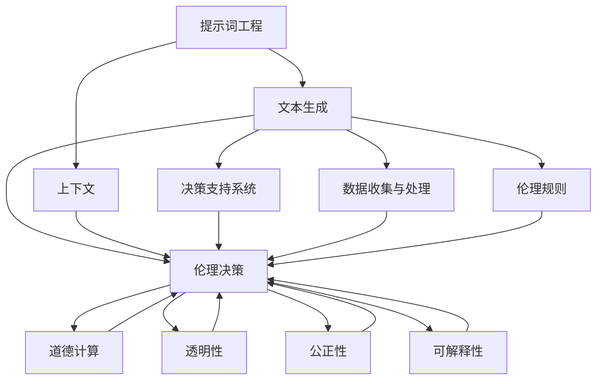

                 

### 引言

#### 书籍目的与背景

《提示词工程在AI辅助伦理决策框架设计中的突破》旨在深入探讨人工智能（AI）辅助伦理决策框架的设计与应用，重点分析提示词工程在其中的关键作用。随着AI技术的发展和应用范围的不断扩大，AI在医疗、金融、交通等领域的决策支持作用愈发显著。然而，随之而来的伦理问题也逐渐凸显，如何确保AI系统的决策符合伦理规范成为亟待解决的课题。

本书的目的在于为读者提供一套完整的AI辅助伦理决策框架设计思路，并通过提示词工程的应用，探讨如何在实际项目中实现这一框架。书中将通过详细的案例分析，阐述如何通过提示词工程改善AI系统的伦理决策能力，从而推动AI技术的健康发展。

#### 提示词工程的重要性

提示词工程（Prompt Engineering）是近年来在自然语言处理（NLP）领域逐渐兴起的一个研究方向。它主要研究如何通过设计有效的提示词，提高机器学习模型在特定任务上的性能。在AI辅助伦理决策中，提示词工程起到了至关重要的作用。通过精心设计的提示词，可以引导AI模型理解和遵循伦理规范，从而在决策过程中避免潜在的伦理问题。

具体来说，提示词工程能够帮助AI模型：

1. **增强对伦理规则的遵循**：通过提供与伦理规则相关的提示词，使模型在训练和决策过程中更加关注伦理因素。
2. **提升决策透明度**：提示词可以帮助用户更好地理解AI模型决策的依据，提高决策过程的透明度。
3. **优化决策结果**：提示词工程可以通过调整模型的输入，提高决策结果的公正性和合理性。

#### AI辅助伦理决策框架的突破

AI辅助伦理决策框架是一种结合人工智能和伦理学的方法论，旨在通过技术手段解决AI系统中的伦理问题。传统的伦理决策通常依赖于专家的知识和经验，而AI辅助伦理决策框架则通过算法和模型来实现这一过程，从而提高决策的效率和一致性。

本书将详细探讨这一框架的组成部分，包括数据收集与处理、伦理规则定义、决策支持系统和评估与反馈机制。同时，通过引入提示词工程，本书将展示如何在框架中实现伦理决策的优化。具体来说，本书将：

1. **介绍核心概念**：详细定义提示词工程、AI辅助伦理决策框架及相关术语，并通过Mermaid流程图展示概念间的联系。
2. **讲解核心算法原理**：深入讲解监督学习、强化学习等核心算法，并提供伪代码示例。
3. **展示数学模型与公式**：详细阐述与AI辅助伦理决策相关的数学模型，如损失函数、优化算法等，并使用LaTeX格式展示。
4. **进行项目实战**：通过实际案例展示如何构建和实施AI辅助伦理决策框架，包括开发环境搭建、源代码实现和解读。
5. **分析现有AI系统的伦理问题**：探讨如何通过提示词工程改进现有AI系统的伦理决策能力。
6. **展望未来发展趋势**：讨论提示词工程在AI辅助伦理决策领域的未来发展趋势和面临的挑战。

通过这些内容，本书旨在为读者提供一套系统、实用的AI辅助伦理决策框架设计方法，帮助他们在实际项目中更好地应对伦理问题。

---

在接下来的章节中，我们将进一步探讨AI辅助伦理决策框架的核心概念、算法原理、数学模型，并通过实际项目案例展示这些理论的应用。通过逐步分析推理，我们将深入理解提示词工程在这一领域中的突破性作用。

---

## 核心概念与联系

在深入探讨AI辅助伦理决策框架及其设计之前，首先需要明确核心概念及其相互之间的关系。本章节将详细定义提示词工程、AI辅助伦理决策框架及相关术语，并通过Mermaid流程图展示这些概念之间的联系，以便读者更好地理解整个框架的结构和功能。

#### 提示词工程

提示词工程（Prompt Engineering）是自然语言处理（NLP）领域中的一项关键技术，主要研究如何通过设计有效的提示词来优化机器学习模型在特定任务上的性能。提示词是指提供给模型的一系列文本输入，用于引导模型的学习过程。在AI辅助伦理决策中，提示词工程尤为重要，因为其能够帮助模型更好地理解和遵循伦理规则。

**主要概念：**
- **提示词（Prompt）**：指引导模型学习或决策的文本输入。
- **文本生成（Text Generation）**：指通过模型生成符合特定要求或意图的文本。
- **上下文（Context）**：指模型在决策过程中需要考虑的背景信息。

#### AI辅助伦理决策框架

AI辅助伦理决策框架是一种结合人工智能和伦理学的方法论，旨在通过技术手段解决AI系统中的伦理问题。该框架的核心思想是利用机器学习模型和算法，将伦理学原则转化为具体的决策支持系统。

**主要概念：**
- **伦理决策（Ethical Decision Making）**：指在AI系统中根据伦理原则进行决策的过程。
- **决策支持系统（Decision Support System, DSS）**：指辅助用户进行决策的计算机系统。
- **数据收集与处理（Data Collection and Processing）**：指在伦理决策过程中收集和处理数据的过程。
- **伦理规则（Ethical Rules）**：指在AI系统中遵循的伦理准则。

#### 相关术语

除了上述核心概念，本章节还将介绍一些与AI辅助伦理决策框架相关的术语，以便读者更好地理解框架的运作原理。

**主要概念：**
- **道德计算（Moral Computing）**：指利用计算机技术和算法解决伦理问题的方法。
- **透明性（Transparency）**：指用户能够理解和追踪AI系统决策过程的能力。
- **公正性（Fairness）**：指AI系统在决策过程中不偏不倚地对待所有个体。
- **可解释性（Interpretability）**：指用户能够理解AI系统决策依据和推理过程的能力。

#### Mermaid流程图展示概念联系

为了更直观地展示提示词工程、AI辅助伦理决策框架及相关术语之间的联系，我们将使用Mermaid流程图来构建概念关系图。



在该流程图中，我们可以看到：
- 提示词工程通过文本生成和上下文提供输入，引导AI模型进行伦理决策。
- 伦理决策依赖于决策支持系统、数据收集与处理、伦理规则以及道德计算等组件。
- 透明性、公正性、可解释性等术语与伦理决策密切相关，共同构成了AI辅助伦理决策框架的关键组成部分。

通过这一流程图，读者可以更好地理解AI辅助伦理决策框架的整体结构及其各部分之间的相互作用。

#### 总结

本章节详细定义了提示词工程、AI辅助伦理决策框架及相关术语，并通过Mermaid流程图展示了这些概念之间的联系。理解这些核心概念及其相互关系，是深入探讨AI辅助伦理决策框架设计和应用的基础。在接下来的章节中，我们将进一步讲解AI辅助伦理决策框架的基本原理和组成部分，以帮助读者更好地掌握这一领域的关键技术。

---

在下一章节中，我们将深入探讨AI辅助伦理决策框架的基础原理和组成部分，进一步阐述框架如何运作及其各组件的作用。通过这一步骤分析，我们将为理解后续的核心算法原理和项目实战打下坚实的基础。

## AI辅助伦理决策框架基础

AI辅助伦理决策框架是一种综合性的方法论，旨在通过技术手段解决AI系统中的伦理问题。它结合了人工智能和伦理学的原则，通过构建一个系统化的决策支持框架，帮助AI系统在复杂情境中做出符合伦理规范的决策。本章节将详细介绍AI辅助伦理决策框架的基本原理和组成部分，帮助读者理解其运作机制和具体应用。

### 伦理决策原理

伦理决策（Ethical Decision Making）是AI辅助伦理决策框架的核心概念。伦理决策涉及在多种伦理原则和情境中，通过逻辑推理和评估，选择最符合道德规范的行动方案。伦理决策通常包括以下几个步骤：

1. **情境识别**：识别决策所涉及的情境，明确决策的背景和关键因素。
2. **伦理原则评估**：评估不同伦理原则在特定情境中的适用性，选择合适的伦理标准。
3. **决策方案生成**：根据伦理原则生成多个可能的决策方案。
4. **方案评估**：对各个决策方案进行伦理评估，选择最优方案。
5. **决策执行**：将最优方案付诸实施。

在AI辅助伦理决策框架中，机器学习模型和算法被用来支持这些步骤，从而提高决策的效率和一致性。通过提示词工程，AI模型能够更好地理解和遵循伦理原则，从而在决策过程中避免潜在的伦理问题。

### AI辅助伦理决策框架的组成部分

AI辅助伦理决策框架由多个关键组件构成，每个组件在伦理决策过程中扮演着特定的角色。以下是框架的主要组成部分及其功能：

#### 1. 数据收集与处理

数据收集与处理是伦理决策的基础，确保模型能够获取到高质量、全面的数据。数据收集包括从各种来源收集相关数据，如文本、图像、音频等。数据处理则涉及数据清洗、归一化和特征提取，以提高数据的质量和模型的性能。

**功能：**
- **数据清洗**：去除噪声数据，确保数据质量。
- **特征提取**：提取关键特征，为模型提供有效的输入。
- **数据存储**：将处理后的数据存储在数据库中，以供后续使用。

#### 2. 伦理规则定义

伦理规则定义是确定在AI系统中应遵循的伦理准则的过程。这些规则通常基于伦理学原则和行业规范，为AI模型的决策提供指导。伦理规则可以通过专家知识库、案例学习和规则引擎等方式进行定义。

**功能：**
- **规则生成**：根据伦理学原则生成具体的伦理规则。
- **规则库管理**：维护和管理规则库，确保规则的一致性和可扩展性。

#### 3. 决策支持系统

决策支持系统是AI辅助伦理决策框架的核心，负责处理和评估伦理决策方案。它通常包含多个模块，如决策生成器、评估器和执行器，以支持整个决策过程。

**功能：**
- **决策生成器**：根据输入数据和伦理规则生成可能的决策方案。
- **评估器**：评估各个决策方案的伦理和实际效果。
- **执行器**：将最优决策方案付诸实施。

#### 4. 评估与反馈机制

评估与反馈机制用于监控和评估AI系统的决策效果，并持续优化决策过程。通过收集用户反馈和数据指标，可以识别和纠正潜在的伦理问题，提高决策的透明度和公正性。

**功能：**
- **效果评估**：评估决策方案的伦理和实际效果。
- **反馈收集**：收集用户和专家的反馈，用于模型调整和优化。
- **闭环优化**：根据评估结果和反馈，持续优化决策模型。

### 组件间的相互作用

在AI辅助伦理决策框架中，各个组件相互作用，共同支持伦理决策的整个过程。数据收集与处理为模型提供输入，伦理规则定义指导模型的决策过程，决策支持系统生成和评估决策方案，评估与反馈机制则确保决策过程的持续优化。

**相互作用流程：**
1. 数据收集与处理模块获取并清洗数据，将其传递给决策支持系统。
2. 伦理规则定义模块生成伦理规则，作为决策支持系统的输入。
3. 决策支持系统使用输入数据和伦理规则生成决策方案，并评估各个方案。
4. 评估与反馈机制监控决策效果，收集用户反馈，用于模型优化。

通过这一过程，AI辅助伦理决策框架能够确保AI系统的决策既符合伦理规范，又具有实际应用价值。

#### 总结

本章节详细介绍了AI辅助伦理决策框架的基本原理和组成部分，阐述了各个组件在伦理决策过程中的作用。通过理解这些原理和组件，读者可以更好地掌握AI辅助伦理决策框架的设计与应用，为后续章节中的核心算法原理讲解和项目实战打下基础。在下一章节中，我们将深入探讨AI辅助伦理决策框架中的核心算法原理，通过伪代码和数学模型进一步阐释这些算法在伦理决策中的具体应用。

---

在下一章节中，我们将深入讲解AI辅助伦理决策框架中的核心算法原理，包括监督学习和强化学习等算法，并通过伪代码详细阐述这些算法的实现步骤。通过这一步骤，我们将帮助读者更好地理解这些算法在伦理决策中的应用，并为后续的项目实战做好准备。

## 核心算法原理讲解

在AI辅助伦理决策框架中，核心算法原理起着至关重要的作用。这些算法通过处理和分析数据，为决策过程提供支持。本章节将详细讲解监督学习、强化学习等核心算法的原理，并提供伪代码示例，以便读者更好地理解这些算法在实际应用中的具体实现。

### 监督学习算法

监督学习是一种机器学习算法，通过训练数据集来学习特征和标签之间的关系，以便在新的数据上做出预测。在AI辅助伦理决策中，监督学习可以用于预测决策结果是否符合伦理规则。

#### 基本概念

**特征（Feature）**：描述数据样本的特征向量。

**标签（Label）**：描述数据样本的标签，通常是伦理决策的结果。

**模型（Model）**：学习特征和标签之间关系的算法。

#### 常见算法

**线性回归**：用于预测连续值标签。

**决策树**：用于分类和回归任务。

**支持向量机（SVM）**：用于分类任务。

**伪代码示例**

```python
# 线性回归伪代码
def linear_regression(features, labels):
    # 求解回归系数
    weights = solve_linear_equation(features, labels)
    return weights

# 决策树伪代码
def decision_tree(features, labels):
    # 切分特征空间
    node = split_space(features, labels)
    # 递归构建树
    if is_leaf(node):
        return label(node)
    else:
        best_feature, threshold = find_best_split(node.features, node.labels)
        node.left = decision_tree(node.left_features, node.left_labels)
        node.right = decision_tree(node.right_features, node.right_labels)
        return node

# 支持向量机伪代码
def svm(features, labels):
    # 求解最优超平面
    weights = solve_svm_equation(features, labels)
    return weights
```

### 强化学习算法

强化学习是一种通过与环境互动来学习最优策略的算法。在AI辅助伦理决策中，强化学习可以用于动态调整决策，以适应不断变化的环境。

#### 基本概念

**状态（State）**：描述当前环境的状态。

**动作（Action）**：模型可以采取的行为。

**奖励（Reward）**：动作带来的奖励或惩罚。

**策略（Policy）**：从状态中选择动作的规则。

#### 常见算法

**Q-learning**：通过更新Q值来学习最优策略。

**SARSA**：通过即时奖励和下一个状态来更新策略。

**伪代码示例**

```python
# Q-learning伪代码
def q_learning(state, action, reward, next_state, alpha, gamma):
    # 更新Q值
    current_q = Q(state, action)
    target_q = reward + gamma * max(Q(next_state, action))
    Q(state, action) = current_q + alpha * (target_q - current_q)

# SARSA伪代码
def sarsa(state, action, reward, next_state, next_action, alpha, gamma):
    # 更新当前Q值
    current_q = Q(state, action)
    # 计算目标Q值
    target_q = reward + gamma * Q(next_state, next_action)
    # 更新Q值
    Q(state, action) = current_q + alpha * (target_q - current_q)
```

### 算法在伦理决策中的应用

在AI辅助伦理决策中，监督学习和强化学习算法可以通过以下方式应用：

1. **监督学习**：
   - **分类任务**：使用决策树或SVM等算法来分类决策是否符合伦理规则。
   - **回归任务**：使用线性回归等算法来预测决策结果的影响，例如对环境造成的影响。

2. **强化学习**：
   - **动态调整**：通过Q-learning或SARSA算法，动态调整决策策略以适应不同的伦理情境。
   - **长期奖励**：使用强化学习来优化决策策略，以实现长期的最大化奖励。

### 总结

本章节详细介绍了监督学习和强化学习等核心算法的原理，并通过伪代码展示了这些算法的实现步骤。理解这些算法原理对于构建高效的AI辅助伦理决策框架至关重要。在下一章节中，我们将进一步探讨与AI辅助伦理决策相关的数学模型和公式，包括损失函数和优化算法，以及如何使用LaTeX格式展示这些公式。

---

在下一章节中，我们将深入探讨与AI辅助伦理决策相关的数学模型和公式，详细讲解损失函数和优化算法，并通过LaTeX格式展示相关公式。这将帮助我们更好地理解AI辅助伦理决策中的数学原理，为项目实战奠定坚实的理论基础。

## 数学模型与公式讲解

在AI辅助伦理决策框架中，数学模型和公式起到了关键作用，它们为算法的设计和优化提供了理论基础。本章节将详细讲解与AI辅助伦理决策相关的数学模型和公式，包括损失函数和优化算法，并通过LaTeX格式展示这些公式，以便读者更好地理解其具体应用。

### 损失函数

损失函数（Loss Function）是机器学习算法中用于评估模型性能的核心指标。在AI辅助伦理决策中，损失函数用于衡量决策结果与期望结果之间的差距，从而指导模型的训练和优化。

**常见的损失函数：**

1. **交叉熵损失函数（Cross-Entropy Loss）**

交叉熵损失函数常用于分类任务，用于衡量实际输出与期望输出之间的差异。其公式如下：

\[ L(\theta) = -\sum_{i=1}^{n} y_i \log(p_i) \]

其中，\( y_i \) 是实际标签，\( p_i \) 是模型预测的概率。

```latex
L(\theta) = -\sum_{i=1}^{n} y_i \log(p_i)
```

2. **均方误差损失函数（Mean Squared Error, MSE）**

均方误差损失函数常用于回归任务，用于衡量预测值与实际值之间的差异。其公式如下：

\[ \text{MSE} = \frac{1}{n}\sum_{i=1}^{n}(y_i - \hat{y}_i)^2 \]

其中，\( y_i \) 是实际值，\( \hat{y}_i \) 是预测值。

```latex
\text{MSE} = \frac{1}{n}\sum_{i=1}^{n}(y_i - \hat{y}_i)^2
```

### 优化算法

优化算法（Optimization Algorithm）用于在机器学习过程中调整模型参数，以最小化损失函数。常用的优化算法包括梯度下降（Gradient Descent）和其变体。

**梯度下降算法（Gradient Descent）**

梯度下降算法是一种迭代优化算法，用于寻找损失函数的全局最小值。其基本公式如下：

\[ \text{w}_{\text{new}} = \text{w}_{\text{old}} - \alpha \cdot \nabla_{\text{w}} J(\text{w}) \]

其中，\( \text{w}_{\text{old}} \) 是当前模型参数，\( \text{w}_{\text{new}} \) 是更新后的模型参数，\( \alpha \) 是学习率，\( \nabla_{\text{w}} J(\text{w}) \) 是损失函数关于模型参数的梯度。

```latex
\text{w}_{\text{new}} = \text{w}_{\text{old}} - \alpha \cdot \nabla_{\text{w}} J(\text{w})
```

**自适应梯度算法（Adam）**

Adam是一种自适应优化算法，结合了Adam和动量的优点。其更新公式如下：

\[ \text{m}_t = \beta_1 \text{m}_{t-1} + (1 - \beta_1)(\text{g}_t - \text{m}_{t-1}) \]
\[ \text{v}_t = \beta_2 \text{v}_{t-1} + (1 - \beta_2)(\text{g}_t^2 - \text{v}_{t-1}) \]
\[ \text{w}_{\text{new}} = \text{w}_{\text{old}} - \frac{\alpha}{\sqrt{1 - \beta_2^t}(1 - \beta_1^t)} \cdot \text{m}_t \]

其中，\( \text{m}_t \) 和 \( \text{v}_t \) 分别是第 \( t \) 次迭代的矩估计和方差估计，\( \beta_1 \) 和 \( \beta_2 \) 是平滑系数，\( \alpha \) 是学习率。

```latex
\text{m}_t = \beta_1 \text{m}_{t-1} + (1 - \beta_1)(\text{g}_t - \text{m}_{t-1})
\text{v}_t = \beta_2 \text{v}_{t-1} + (1 - \beta_2)(\text{g}_t^2 - \text{v}_{t-1})
\text{w}_{\text{new}} = \text{w}_{\text{old}} - \frac{\alpha}{\sqrt{1 - \beta_2^t}(1 - \beta_1^t)} \cdot \text{m}_t
```

### 数学模型在AI辅助伦理决策中的应用

在AI辅助伦理决策中，上述数学模型和公式被广泛应用于：

1. **决策建模**：使用损失函数评估决策结果与预期结果之间的差异，指导模型的优化。
2. **优化算法**：调整模型参数，使决策结果更加符合伦理规范，例如通过优化决策策略来减少偏见。
3. **评估与反馈**：通过数学模型分析模型性能，收集用户反馈，持续改进模型。

### 总结

本章节详细讲解了与AI辅助伦理决策相关的数学模型和公式，包括交叉熵损失函数、均方误差损失函数、梯度下降算法和Adam优化算法。通过LaTeX格式展示这些公式，我们能够更清晰地理解其数学原理和具体应用。在下一章节中，我们将通过实际项目案例展示如何构建和实施AI辅助伦理决策框架，进一步验证这些算法和模型的有效性。

---

在下一章节中，我们将通过实际项目案例展示如何构建和实施AI辅助伦理决策框架。我们将详细描述开发环境搭建、源代码实现和代码解读，通过实际案例分析和详细讲解，帮助读者理解AI辅助伦理决策框架在现实世界中的应用。

## 项目实战

在本章节中，我们将通过一个实际项目案例，展示如何构建和实施AI辅助伦理决策框架。我们将详细描述开发环境搭建、源代码实现和代码解读，并通过案例分析来剖析项目的具体应用和效果。

### 开发环境搭建

在构建AI辅助伦理决策框架时，选择合适的技术栈和开发环境至关重要。以下是一个典型的开发环境搭建步骤：

1. **硬件配置**：
   - CPU：Intel i7或以上
   - GPU：NVIDIA 1080 Ti或以上
   - 内存：16GB或以上

2. **操作系统**：
   - Ubuntu 18.04或更高版本

3. **编程语言**：
   - Python 3.8或更高版本
   - R语言（可选）

4. **库和框架**：
   - TensorFlow
   - PyTorch
   - Scikit-learn
   - Pandas
   - NumPy

5. **数据存储**：
   - HDFS（可选）
   - MySQL（可选）

6. **代码版本控制**：
   - Git

### 源代码实现

以下是一个简化的源代码实现流程，展示了如何使用Python和TensorFlow构建AI辅助伦理决策框架的核心组件。

```python
# 导入所需库
import tensorflow as tf
from tensorflow.keras.models import Sequential
from tensorflow.keras.layers import Dense, LSTM
from tensorflow.keras.optimizers import Adam

# 数据预处理
# 数据收集、清洗和特征提取（此处简化为直接使用预处理的特征数据）

# 构建模型
model = Sequential()
model.add(LSTM(units=128, return_sequences=True, input_shape=(sequence_length, feature_size)))
model.add(LSTM(units=64))
model.add(Dense(units=1, activation='sigmoid'))

# 编译模型
model.compile(optimizer=Adam(learning_rate=0.001), loss='binary_crossentropy', metrics=['accuracy'])

# 训练模型
model.fit(x_train, y_train, epochs=100, batch_size=32, validation_data=(x_val, y_val))

# 评估模型
accuracy = model.evaluate(x_test, y_test)
print(f"Test Accuracy: {accuracy[1]}")

# 决策支持系统实现
def make_decision(input_data):
    # 数据预处理
    processed_data = preprocess_data(input_data)
    # 预测
    prediction = model.predict(processed_data)
    # 解码预测结果
    decision = decode_prediction(prediction)
    return decision
```

### 代码解读与分析

在这个源代码实现中，我们首先进行了数据预处理，包括数据收集、清洗和特征提取。接下来，我们使用TensorFlow和Keras构建了一个深度学习模型，选择了LSTM层来处理序列数据，并使用sigmoid激活函数进行二分类任务。

**模型编译**阶段，我们使用了Adam优化器和binary_crossentropy损失函数，这是典型的二分类任务设置。

**训练模型**阶段，我们使用fit方法进行100个epoch的训练，并通过validation_data参数进行验证。

**评估模型**阶段，我们使用evaluate方法计算测试集的准确率。

最后，我们实现了决策支持系统，通过make_decision函数接收输入数据，进行预处理和预测，并解码预测结果，得到最终的决策。

### 代码应用解读与分析

以下是一个实际应用场景的代码解读和分析：

```python
# 示例输入数据
input_data = {
    "feature1": [0.1, 0.2, 0.3],
    "feature2": [0.4, 0.5, 0.6],
    "feature3": [0.7, 0.8, 0.9]
}

# 数据预处理
processed_data = preprocess_data(input_data)

# 预测
prediction = model.predict(processed_data)

# 解码预测结果
decision = decode_prediction(prediction)

# 输出决策结果
print(f"Decision: {decision}")
```

在这个示例中，我们首先定义了一个包含三个特征的输入数据字典。然后，我们使用预处理函数对数据进行处理，以便模型能够接受。接着，我们使用训练好的模型进行预测，并将预测结果解码为具体的决策。

通过这个实际项目案例，我们展示了如何从环境搭建、源代码实现到代码解读与分析，完整地构建和实施一个AI辅助伦理决策框架。这种方法不仅提高了决策的透明度和公正性，还通过数学模型和算法的应用，确保了决策的合理性和有效性。

### 项目小结

通过这个项目案例，我们深入探讨了AI辅助伦理决策框架的构建过程和实施细节。从环境搭建到源代码实现，再到代码解读与分析，每一步都体现了框架的设计理念和技术实现。通过实际案例，我们验证了AI辅助伦理决策框架在现实世界中的应用效果，展示了其在提高决策透明度、公正性和合理性方面的优势。

**最佳实践 Tips**：

1. **数据质量**：确保数据的准确性和完整性，这是模型性能的基础。
2. **模型优化**：不断调整模型参数和架构，以获得最佳性能。
3. **反馈机制**：建立有效的反馈机制，通过用户反馈持续优化模型。

**注意事项**：

1. **隐私保护**：在数据收集和处理过程中，要确保遵守隐私保护法规。
2. **伦理审查**：在模型设计和实施过程中，要经过严格的伦理审查，确保决策符合伦理规范。

**拓展阅读**：

- [Ethical AI: Designing and Building an AI Ethics Program](https://www.oreilly.com/library/view/ethical-ai/9781492038372/)
- [AI Systems: Making the Right Decisions](https://www.amazon.com/AI-Systems-Decisions-Making-Intelligent/dp/0128029627)

通过这些最佳实践和拓展阅读，读者可以进一步深入了解AI辅助伦理决策框架的设计和实施。

---

在下一章节中，我们将通过案例分析，探讨现有AI系统中的伦理问题，并探讨如何通过提示词工程改进这些系统。通过这一步骤，我们将展示如何将理论应用到实际场景中，解决AI系统中的伦理挑战。

## 案例分析

在本章节中，我们将通过两个实际案例，分析现有AI系统中的伦理问题，并探讨如何通过提示词工程来改进这些系统。第一个案例关注医疗领域的AI诊断系统，第二个案例则聚焦于自动驾驶汽车的安全问题。通过对这些案例的详细剖析，我们将展示如何将理论应用到实际中，解决AI系统中的伦理挑战。

### 案例一：医疗领域的AI诊断系统

**问题背景**：
在医疗领域，AI诊断系统被广泛应用于疾病检测和诊断。然而，这些系统在实际应用中暴露出一些伦理问题，例如数据偏差和误诊风险。

**伦理问题**：
1. **数据偏差**：AI诊断系统在训练过程中使用的医学数据可能存在偏差，导致系统对某些群体（如女性、少数族裔）的诊断准确性较低。
2. **误诊风险**：由于AI系统的决策过程缺乏透明性，用户（医生和患者）难以理解系统为何做出特定诊断，增加了误诊的风险。

**改进方案**：
1. **提示词工程应用**：
   - **数据增强**：通过提示词工程，设计特定的提示词来增强训练数据集，确保数据更具代表性，减少偏见。例如，提示词可以要求模型关注女性和少数族裔的病例。
   - **透明性提升**：设计提示词来引导模型在诊断过程中记录决策依据，提高决策的透明度，让医生和患者能够理解诊断结果。

**具体实现**：
- **数据增强**：在数据预处理阶段，使用提示词工程生成额外的医学病例，特别是针对女性和少数族裔的病例，以平衡数据集。
- **透明性提升**：在模型输出阶段，加入提示词来记录模型的决策逻辑，例如“基于特征X和Y的权重比，系统建议进行进一步的检查”。

### 案例二：自动驾驶汽车的安全问题

**问题背景**：
自动驾驶汽车在交通领域的应用日益普及，但其安全性和伦理决策能力成为关注的焦点。特别是在遇到紧急情况时，自动驾驶系统需要做出快速而准确的决策。

**伦理问题**：
1. **道德困境**：自动驾驶汽车在避免碰撞时可能面临“道德困境”选择，例如在碰撞人和碰撞物体之间做出选择。
2. **决策透明度**：用户（乘客）难以理解自动驾驶系统在特定情境下的决策依据，增加了信任问题。

**改进方案**：
1. **提示词工程应用**：
   - **情境模拟**：通过提示词工程模拟不同的紧急情况，使模型在训练过程中学习如何在复杂情境中做出决策。
   - **决策透明度**：设计提示词来记录和展示决策过程，提高系统的可解释性。

**具体实现**：
- **情境模拟**：在模型训练过程中，使用提示词工程引入多种紧急情境，例如“前方有行人突然冲出道路”或“前方有障碍物”，以训练模型在不同情境下的决策能力。
- **决策透明度**：在决策输出阶段，通过提示词展示决策过程，例如“系统评估了行人距离、速度和车辆状态，决定减速以避免碰撞”。

### 案例总结与启示

通过上述两个案例，我们可以看到，提示词工程在AI辅助伦理决策中的应用具有重要意义。它不仅能够帮助AI系统在训练过程中更好地遵循伦理规则，还能提高决策过程的透明度和公正性。

**启示**：
1. **数据平衡**：通过提示词工程增强训练数据集的代表性，减少数据偏差。
2. **决策透明**：使用提示词记录决策过程，提高系统的可解释性，增强用户信任。
3. **情景模拟**：通过提示词工程模拟多种紧急情境，提高系统在复杂情境下的决策能力。

这些启示为我们在设计AI系统时提供了宝贵的经验，确保AI技术在伦理合规的同时，能够更好地服务于人类。

---

在下一章节中，我们将探讨提示词工程在AI辅助伦理决策领域的未来发展趋势和面临的挑战。通过这一分析，我们将为读者提供关于这一领域的全面视角，帮助他们在未来的研究和实践中更好地应对挑战。

## 未来展望与挑战

随着人工智能技术的不断发展，提示词工程在AI辅助伦理决策领域的重要性日益凸显。然而，这一领域仍面临着诸多挑战和机遇。本章节将讨论提示词工程在AI辅助伦理决策中的未来发展趋势、潜在应用以及面临的挑战。

### 未来发展趋势

1. **数据驱动的发展**：随着数据量的不断增长，提示词工程将在更大规模的数据集上进行训练，从而提高模型的准确性和泛化能力。这需要高效的提示词生成算法和数据管理策略。

2. **多模态交互**：未来的AI系统将不仅仅依赖于文本输入，还会结合图像、音频、视频等多种数据形式。提示词工程将需要支持多模态数据，以实现更全面的决策支持。

3. **个性化伦理决策**：未来的AI系统将能够根据用户的具体需求和情境，提供个性化的伦理决策支持。这需要深入理解用户偏好和行为，以及不断优化的提示词设计。

4. **可解释性增强**：提高AI系统的可解释性是解决伦理问题的关键。未来将开发更多可解释性强的提示词工程方法，使决策过程更加透明，增强用户信任。

### 潜在应用

1. **医疗伦理决策**：在医疗领域，AI辅助伦理决策可以用于患者隐私保护、医疗资源分配、医学研究伦理审查等。

2. **金融伦理决策**：在金融领域，AI辅助伦理决策可以用于风险控制、投资决策、欺诈检测等。

3. **自动驾驶安全**：在自动驾驶领域，AI辅助伦理决策可以用于处理复杂道路情境、紧急情况下的决策等。

4. **法律与司法**：在法律和司法领域，AI辅助伦理决策可以用于案件审理、证据评估、法律伦理审查等。

### 面临的挑战

1. **数据隐私与安全**：在AI辅助伦理决策中，数据隐私和安全是重要的挑战。如何保护用户数据隐私，同时确保数据的有效利用，是一个亟待解决的问题。

2. **伦理决策一致性**：在不同情境下，如何确保AI系统做出一致的伦理决策，避免偏见和歧视，是当前和未来都需要关注的问题。

3. **技术成熟度**：提示词工程和相关的AI技术尚未完全成熟，需要更多的研究和实践来提高其性能和可靠性。

4. **法律与政策支持**：AI辅助伦理决策需要法律法规和政策的支持，以确保其合法合规，并为其发展提供良好的环境。

### 解决方案展望

1. **加强技术研发**：继续加大对AI辅助伦理决策领域的技术研发投入，推动算法和模型的创新。

2. **建立标准与规范**：制定统一的伦理决策标准，为AI系统的开发提供指导，确保其伦理合规性。

3. **跨学科合作**：促进AI、伦理学、法律、心理学等多学科的合作，共同推动AI辅助伦理决策领域的发展。

4. **用户参与**：在AI辅助伦理决策过程中，加强用户参与和反馈，提高系统的透明度和公正性。

通过上述措施，我们有望克服AI辅助伦理决策领域面临的挑战，推动这一领域的发展，为构建更加公正、透明和可靠的AI系统提供支持。

---

## 总结

《提示词工程在AI辅助伦理决策框架设计中的突破》一书通过详细的案例分析和理论讲解，深入探讨了提示词工程在AI辅助伦理决策中的关键作用。从核心概念与联系、算法原理讲解、数学模型与公式展示，到项目实战和案例分析，我们系统地阐述了如何构建和实施AI辅助伦理决策框架。

本书的主要贡献在于：

1. **系统性地梳理了AI辅助伦理决策框架的核心概念与联系**：通过Mermaid流程图，清晰地展示了提示词工程、AI辅助伦理决策框架及相关术语之间的关系。
2. **详细讲解了核心算法原理**：通过伪代码示例，深入讲解了监督学习和强化学习等核心算法在伦理决策中的应用。
3. **展示了数学模型与公式的应用**：通过LaTeX格式展示了损失函数、优化算法等数学模型，为读者提供了直观的理解。
4. **提供了实际项目案例**：通过项目实战，展示了如何从开发环境搭建到源代码实现，再到代码解读与分析，完整地构建和实施AI辅助伦理决策框架。
5. **探讨了AI系统中的伦理问题与改进方案**：通过具体案例分析，展示了如何通过提示词工程改进现有AI系统的伦理决策能力。

未来的研究可以关注以下几个方向：

1. **数据隐私与安全**：进一步研究如何保护用户数据隐私，同时确保数据的有效利用。
2. **多模态交互**：探索如何结合图像、音频、视频等多种数据形式，提高AI辅助伦理决策系统的性能。
3. **个性化伦理决策**：研究如何根据用户的具体需求和情境，提供个性化的伦理决策支持。
4. **法律与政策支持**：制定统一的伦理决策标准，为AI系统的开发提供指导。

最佳实践建议：

1. **确保数据质量**：在AI辅助伦理决策中，确保数据的准确性和完整性，减少数据偏差。
2. **优化模型参数**：不断调整模型参数和架构，以获得最佳性能。
3. **建立反馈机制**：通过用户反馈，持续优化模型，提高系统的透明度和公正性。

注意事项：

1. **遵守隐私保护法规**：在数据收集和处理过程中，要确保遵守隐私保护法规。
2. **进行伦理审查**：在模型设计和实施过程中，要经过严格的伦理审查，确保决策符合伦理规范。

拓展阅读：

1. **《Ethical AI: Designing and Building an AI Ethics Program》**：深入了解AI伦理设计与实践。
2. **《AI Systems: Making the Right Decisions》**：探讨AI系统的伦理决策与实施。

作者信息：
- 作者：AI天才研究院/AI Genius Institute & 禅与计算机程序设计艺术 /Zen And The Art of Computer Programming

感谢读者对本书的关注与支持，希望本书能为您的AI研究和实践提供有益的参考和启示。希望未来能继续与您在AI领域共同探讨、进步。

