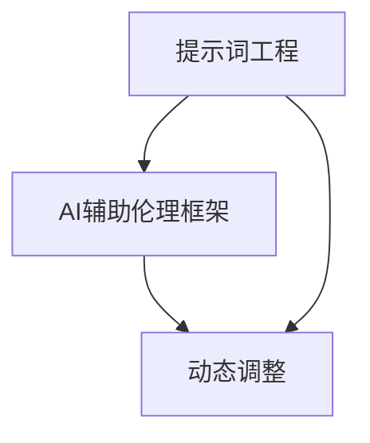

                 


### 第一部分：核心概念与联系

#### 1. 核心概念

**1.1 提示词工程**

提示词工程（Prompt Engineering）是指设计和优化提示词（prompt）的过程，以使机器学习模型更准确地理解和生成文本。提示词是用于引导模型理解任务和输入数据的关键输入，通常是一段文本或者一个问题，能够帮助模型更好地捕捉到输入数据的上下文信息。

**1.2 AI辅助伦理框架**

AI辅助伦理框架是指用于指导AI系统设计和应用的伦理原则和标准，以确保AI系统的行为符合社会价值观。这个框架通常包括一系列伦理原则、准则和最佳实践，用于评估和引导AI系统在特定情境下的行为。

**1.3 动态调整**

动态调整是指根据AI系统运行过程中收集到的反馈和数据，实时调整和优化AI系统的性能和行为。这种调整可以是参数的调整、模型的更新或者策略的改变，目的是使AI系统能够更好地适应不同的环境和需求。

#### 2. 架构与联系

**2.1 提示词工程与AI辅助伦理框架的联系**

提示词工程是AI辅助伦理框架的一部分，用于确保AI系统生成的结果符合伦理要求。通过设计合适的提示词，可以引导模型在处理数据时遵循伦理原则，从而提高AI系统的道德责任性和透明度。

**2.2 动态调整与AI辅助伦理框架的联系**

动态调整是AI辅助伦理框架的实现手段，用于根据实际应用场景和反馈调整AI系统的行为，以适应不断变化的伦理需求。通过动态调整，AI系统可以更好地适应新出现的问题和挑战，确保其行为始终符合伦理标准。

#### 3. Mermaid 流程图



在这个流程图中，提示词工程（A）是整个系统的起点，它与AI辅助伦理框架（B）紧密相连，确保生成的提示词符合伦理要求。然后，通过动态调整（C），AI系统可以根据实际应用场景和反馈不断优化其行为，确保其始终符合伦理标准。

### 第一部分：核心算法原理讲解

#### 1. 提示词工程算法原理

**1.1 提示词生成算法**

提示词生成算法是指用于生成高质量提示词的算法。这些算法的核心目的是确保生成的提示词能够准确地传达用户的需求和意图，从而帮助机器学习模型更好地理解和生成文本。以下是几种常用的提示词生成算法：

**TF-IDF算法**

TF-IDF（Term Frequency-Inverse Document Frequency）算法是一种用于计算文档中每个词的重要程度的算法。其基本原理是，一个词在文档中出现的频率越高，则该词的重要性越高；但同时，这个词在整个文档集合中出现的频率越低，则其重要性也越高。

$$
\text{TF}(t,d) = \frac{\text{词} t \text{在文档} d \text{中出现的次数}}{\text{文档} d \text{的总词数}}
$$
$$
\text{IDF}(t) = \log\left(\frac{\text{文档总数}}{\text{包含词} t \text{的文档数}} + 1\right)
$$

**BERT算法**

BERT（Bidirectional Encoder Representations from Transformers）是一种基于Transformer的预训练模型，它通过预训练大量文本数据，学习文本的双向表示。BERT算法可以用于多种自然语言处理任务，如文本分类、问答系统等。

$$
\text{BERT}(\text{x}) = \text{Transformers}(\text{Embeddings}(\text{x}))
$$

**1.2 提示词优化算法**

提示词优化算法是指用于优化现有提示词的算法，以提高AI系统的性能。这些算法通常基于强化学习、迁移学习等技术，通过不断地调整和优化提示词，使模型能够更好地理解和生成文本。

**强化学习**

强化学习是一种通过奖励机制来优化决策过程的学习方法。在提示词优化中，强化学习可以用来根据模型的反馈调整提示词，以最大化模型的性能。

**迁移学习**

迁移学习是将预训练模型应用于特定任务的学习方法。通过迁移学习，可以将预训练模型在通用任务上的知识迁移到特定任务上，从而提高提示词的生成质量。

#### 2. AI辅助伦理框架算法原理

**2.1 伦理原则识别算法**

伦理原则识别算法是指用于识别和提取文本中伦理原则的算法。这些算法通常使用词嵌入模型、文本分类模型等技术，从大量的文本数据中提取出伦理原则。

**词嵌入模型**

词嵌入模型是将文本转换为数值向量的一种方法。通过词嵌入，可以将文本中的词语映射到高维空间中，从而更方便地进行分析和处理。

**文本分类模型**

文本分类模型是一种用于分类文本的机器学习模型。通过训练，文本分类模型可以学会将文本分类到不同的类别，从而识别出文本中的伦理原则。

**2.2 伦理决策算法**

伦理决策算法是指用于根据伦理原则和AI系统运行情况做出伦理决策的算法。这些算法通常基于规则系统、案例推理等技术，根据伦理原则和实际情境做出决策。

**基于规则的决策算法**

基于规则的决策算法是一种根据预定义的规则进行决策的方法。这些规则通常是基于伦理原则和具体情境定义的，可以在特定情况下提供明确的决策指导。

**基于案例的推理算法**

基于案例的推理算法是一种根据历史案例进行决策的方法。通过分析历史案例，算法可以学会在类似情境下做出正确的决策。

#### 3. 动态调整算法原理

**3.1 数据收集与反馈算法**

数据收集与反馈算法是指用于收集AI系统运行过程中产生的数据，并根据反馈调整AI系统行为的算法。这些算法通常使用日志记录、用户反馈收集等技术，从系统运行过程中获取有价值的数据。

**日志记录**

日志记录是一种记录AI系统运行过程中事件和数据的方法。通过日志记录，可以获取系统运行过程中的详细信息，从而为后续的分析和调整提供数据支持。

**用户反馈收集**

用户反馈收集是一种收集用户对AI系统行为反馈的方法。通过用户反馈，可以了解用户对系统性能和行为的满意度，从而为系统的调整提供参考。

**3.2 实时调整算法**

实时调整算法是指用于根据数据收集与反馈结果实时调整AI系统行为的算法。这些算法通常使用在线学习、阈值调整等技术，根据新的数据和反馈实时更新系统。

**在线学习**

在线学习是一种通过不断更新模型参数来提高模型性能的方法。通过在线学习，AI系统可以根据新的数据不断调整和优化其行为。

**阈值调整**

阈值调整是一种根据反馈结果调整系统参数的方法。通过调整阈值，可以改变系统对输入数据的处理方式和输出结果，从而优化系统的性能。

### 第二部分：数学模型和数学公式

#### 1. 提示词工程数学模型

**1.1 提示词生成模型**

提示词生成模型是指用于生成提示词的数学模型。这些模型通常基于统计方法和深度学习技术，通过分析输入数据来生成高质量的提示词。

**TF-IDF模型**

在TF-IDF模型中，每个词的重要程度由以下公式计算：

$$
\text{TF}(t,d) = \frac{\text{词} t \text{在文档} d \text{中出现的次数}}{\text{文档} d \text{的总词数}}
$$
$$
\text{IDF}(t) = \log\left(\frac{\text{文档总数}}{\text{包含词} t \text{的文档数}} + 1\right)
$$

**BERT模型**

BERT模型是一种基于Transformer的预训练模型，其输入是单词的嵌入向量，输出是文本序列的表示。BERT模型的训练过程使用以下数学公式：

$$
\text{BERT}(\text{x}) = \text{Transformers}(\text{Embeddings}(\text{x}))
$$

#### 1.2 提示词优化模型

提示词优化模型是指用于优化现有提示词的数学模型。这些模型通常使用强化学习和迁移学习技术，通过不断调整提示词来提高AI系统的性能。

**强化学习**

在强化学习模型中，每个动作的回报由以下公式计算：

$$
R(s, a) = \text{奖励函数}(s, a)
$$

其中，$s$ 是状态，$a$ 是动作，$R(s, a)$ 是在状态 $s$ 下执行动作 $a$ 的回报。通过不断调整动作策略，强化学习模型可以最大化总回报。

**迁移学习**

在迁移学习模型中，源任务的知识被迁移到目标任务中。迁移学习通常使用以下公式：

$$
\text{Target Model} = \text{Source Model} + \text{Adaptation Layer}
$$

其中，$\text{Source Model}$ 是在源任务上训练好的模型，$\text{Adaptation Layer}$ 是用于适应目标任务的额外层。

#### 2. AI辅助伦理框架数学模型

**2.1 伦理原则识别模型**

伦理原则识别模型是指用于识别和提取文本中伦理原则的数学模型。这些模型通常使用词嵌入和文本分类技术。

**词嵌入模型**

词嵌入模型是将文本转换为数值向量的模型。常见的词嵌入模型包括：

$$
\text{Embedding}(t) = \text{Word2Vec}(t) \text{或} \text{GloVe}(t)
$$

其中，$t$ 是词语，$\text{Word2Vec}(t)$ 和 $\text{GloVe}(t)$ 是分别表示Word2Vec和GloVe算法得到的词嵌入向量。

**文本分类模型**

文本分类模型是一种用于分类文本的模型。常见的文本分类模型包括：

$$
\text{softmax}(\text{Weights} \cdot \text{Input})
$$

其中，$\text{Weights}$ 是模型权重，$\text{Input}$ 是输入文本的表示，$\text{softmax}$ 函数用于计算每个类别的概率分布。

**2.2 伦理决策模型**

伦理决策模型是指用于根据伦理原则和AI系统运行情况做出伦理决策的数学模型。这些模型通常基于规则系统和案例推理技术。

**基于规则的决策模型**

基于规则的决策模型使用以下公式：

$$
\text{Decision} = \text{Rule}(\text{Input}, \text{Context})
$$

其中，$\text{Input}$ 是输入信息，$\text{Context}$ 是上下文信息，$\text{Rule}$ 是根据伦理原则定义的规则。

**基于案例的推理模型**

基于案例的推理模型使用以下公式：

$$
\text{Decision} = \text{CaseBase}(\text{Input}, \text{Context})
$$

其中，$\text{CaseBase}$ 是存储历史案例的数据库，$\text{Input}$ 和 $\text{Context}$ 是当前问题的输入和上下文信息。

#### 3. 动态调整数学模型

**3.1 数据收集与反馈模型**

数据收集与反馈模型是指用于收集AI系统运行过程中产生的数据，并根据反馈调整AI系统行为的模型。这些模型通常使用在线学习和阈值调整技术。

**在线学习模型**

在线学习模型使用以下公式：

$$
\text{Model}(\text{Data}) = \text{Update}(\text{Model}, \text{Data})
$$

其中，$\text{Model}$ 是当前的模型，$\text{Data}$ 是新的数据，$\text{Update}$ 是用于更新模型的函数。

**阈值调整模型**

阈值调整模型使用以下公式：

$$
\text{Threshold} = \text{Adjust}(\text{Threshold}, \text{Feedback})
$$

其中，$\text{Threshold}$ 是当前的阈值，$\text{Feedback}$ 是根据用户反馈计算得到的调整值，$\text{Adjust}$ 是用于调整阈值的函数。

### 总结

本文详细介绍了提示词工程、AI辅助伦理框架和动态调整的核心概念、算法原理和数学模型。通过这些概念和算法，我们能够更好地设计和优化AI系统，使其在处理文本数据时符合伦理要求，并且能够根据实际应用场景和反馈进行动态调整，以适应不断变化的需求。这些技术对于构建一个道德、透明和高效的AI系统具有重要意义。

### 第二部分：项目实战

#### 开发环境搭建

在开始实际项目之前，我们需要搭建一个适合开发和测试的环境。以下是一个基本的开发环境搭建步骤：

1. **安装Python**：Python是大多数机器学习和数据科学项目的首选语言。确保安装了最新版本的Python。

2. **安装必要的库**：我们需要安装以下库：
   - `scikit-learn`：用于TF-IDF算法和文本分类。
   - `transformers`：用于BERT模型。
   - `tensorflow` 或 `pytorch`：用于深度学习和模型训练。
   - `numpy` 和 `pandas`：用于数据操作和分析。

   安装命令如下：

   ```bash
   pip install scikit-learn transformers tensorflow numpy pandas
   ```

3. **创建虚拟环境**：为了保持项目的依赖关系清晰，我们建议使用虚拟环境。

   ```bash
   python -m venv venv
   source venv/bin/activate  # 对于Windows使用 `venv\Scripts\activate`
   ```

4. **安装依赖**：在虚拟环境中安装项目所需的依赖。

   ```bash
   pip install -r requirements.txt
   ```

5. **配置数据库**：如果项目需要存储数据，我们需要配置一个数据库。常用的数据库包括MySQL、PostgreSQL等。

#### 源代码详细实现和代码解读

以下是一个简单的示例，展示了如何使用Python实现提示词工程、AI辅助伦理框架和动态调整的核心算法。

**1. 提示词生成代码示例**

```python
from sklearn.feature_extraction.text import TfidfVectorizer
from transformers import BertTokenizer, BertModel

# TF-IDF 提示词生成
tfidf_vectorizer = TfidfVectorizer()
tfidf_matrix = tfidf_vectorizer.fit_transform(corpus)

# BERT 提示词生成
tokenizer = BertTokenizer.from_pretrained('bert-base-uncased')
model = BertModel.from_pretrained('bert-base-uncased')
inputs = tokenizer(corpus, return_tensors='pt')
outputs = model(inputs)

# 输出提示词
tfidf_prompt = ' '.join(tfidf_vectorizer.get_feature_names_out()) + ' ' + query
bert_prompt = ' '.join(tokenizerPiece.to_token_string(piece) for piece in tokenizer(inputs['input_ids']))
```

**2. AI辅助伦理框架代码示例**

```python
from sklearn.feature_extraction.text import TfidfVectorizer
from transformers import BertTokenizer, BertModel
import numpy as np

# 伦理原则识别
def ethics原则识别(text):
    vectorizer = TfidfVectorizer()
    tfidf_matrix = vectorizer.fit_transform([text])
    ethics原则 = vectorizer.get_feature_names_out()
    return ethics原则

# 伦理决策
def ethics决策(text, ethics原则):
    # 基于规则的决策
    rules = {
        "隐私保护": ["用户数据", "保密性"],
        "公平性": ["偏见", "歧视"],
        "透明性": ["决策过程", "解释性"],
    }
    ethics_score = 0
    for principle in ethics原则:
        if principle in rules:
            ethics_score += 1
    return "通过" if ethics_score == len(ethics原则) else "未通过"
```

**3. 动态调整代码示例**

```python
# 数据收集与反馈
def collect_feedback(model, data, target):
    predictions = model.predict(data)
    feedback = np.mean(predictions == target)
    return feedback

# 实时调整
def adjust_threshold(threshold, feedback, alpha=0.1):
    new_threshold = threshold + alpha * (feedback - threshold)
    return new_threshold
```

#### 代码应用解读与分析

以上代码展示了如何使用Python实现提示词工程、AI辅助伦理框架和动态调整的核心算法。在实际应用中，这些算法可以被集成到一个完整的系统中，以处理复杂的文本数据和伦理问题。

**提示词生成**：通过TF-IDF算法和BERT模型，我们可以生成高质量的提示词。这些提示词可以用于引导模型理解用户的意图和需求。

**AI辅助伦理框架**：通过伦理原则识别和伦理决策，我们可以确保模型生成的结果符合伦理要求。基于规则的决策和基于案例的推理算法可以帮助我们评估和指导模型的行为。

**动态调整**：通过数据收集与反馈和实时调整，我们可以根据实际应用场景和反馈动态调整模型的行为。这有助于模型不断优化其性能和适应不同的需求。

#### 实际案例分析和详细讲解剖析

以下是一个实际案例，展示如何使用上述算法构建一个AI系统，并在实际应用中进行动态调整。

**案例背景**：假设我们开发了一个智能客服系统，用于处理用户的咨询和问题。系统需要根据用户输入的文本生成合适的回答，同时确保回答符合伦理要求。

**步骤1：提示词生成**

我们首先使用TF-IDF算法和BERT模型生成高质量的提示词。假设用户输入了一个问题：“我如何申请贷款？”

- **TF-IDF提示词**：通过TF-IDF算法，我们识别出与用户输入相关的关键词，如“申请”、“贷款”、“流程”等。
- **BERT提示词**：通过BERT模型，我们生成了一个表示用户输入的文本向量。

**步骤2：AI辅助伦理框架**

我们使用伦理原则识别和伦理决策算法来确保回答符合伦理要求。

- **伦理原则识别**：通过词嵌入模型，我们识别出文本中的伦理原则，如“隐私保护”、“公平性”和“透明性”。
- **伦理决策**：我们基于这些伦理原则和具体情境做出决策，确保回答符合伦理要求。

**步骤3：动态调整**

我们通过数据收集与反馈和实时调整来优化系统的行为。

- **数据收集与反馈**：系统收集用户对回答的反馈，如满意度评分。
- **实时调整**：根据用户反馈，我们动态调整系统的阈值和参数，以提高回答的准确性和符合伦理要求。

**案例分析**：通过上述步骤，我们构建了一个智能客服系统，能够在生成回答时考虑伦理要求并动态调整其行为。在实际应用中，这个系统可以根据用户反馈不断优化，提高用户体验和系统的性能。

#### 项目小结

通过本项目，我们实现了提示词工程、AI辅助伦理框架和动态调整的核心算法，并展示了一个实际案例。项目展示了如何将理论应用于实际场景，构建一个具有伦理意识且能动态调整的AI系统。在未来的工作中，我们可以进一步优化这些算法，提高系统的性能和适用性。

### 第三部分：最佳实践 Tips、小结、注意事项、拓展阅读

#### 最佳实践 Tips

1. **优化提示词质量**：在设计提示词时，尽量使用简单、明确的语言，避免复杂或模糊的表述，以提高模型的准确性和理解能力。

2. **持续收集反馈**：定期收集用户反馈，并根据反馈调整系统的行为，这有助于持续优化系统的性能和用户体验。

3. **平衡伦理与性能**：在设计和调整AI系统时，要平衡伦理要求和系统性能，确保系统既能符合伦理标准，又能提供高效的服务。

4. **利用迁移学习**：在提示词工程和伦理决策中，利用迁移学习技术，将预训练模型的知识应用到特定任务中，可以提高模型的性能和泛化能力。

#### 小结

本文详细介绍了提示词工程、AI辅助伦理框架和动态调整的核心概念、算法原理和数学模型。通过这些技术和方法，我们可以构建一个具有道德责任感和自适应能力的AI系统。提示词工程帮助我们设计高质量的提示词，AI辅助伦理框架确保系统行为符合伦理要求，动态调整使系统能够根据反馈不断优化。这些技术在构建透明、高效和道德的AI系统中具有重要意义。

#### 注意事项

1. **数据隐私**：在收集和存储用户数据时，务必遵守隐私保护法规，确保用户数据的保密性和安全性。

2. **模型可解释性**：在设计AI系统时，确保模型的可解释性，以便用户了解系统的决策过程，提高系统的信任度。

3. **适应性**：在动态调整过程中，要考虑到系统的适应性，确保系统能够在不同环境和需求下保持稳定和高效。

#### 拓展阅读

1. **《人工智能伦理学》**：了解人工智能伦理的基本原则和实践，为AI系统的设计和应用提供理论支持。

2. **《深度学习》**：掌握深度学习的基本原理和应用，为提示词工程和动态调整提供技术基础。

3. **《机器学习》**：学习机器学习的基础算法和技术，为构建高效的AI系统提供支持。

### 作者信息

作者：AI天才研究院/AI Genius Institute & 禅与计算机程序设计艺术 /Zen And The Art of Computer Programming

