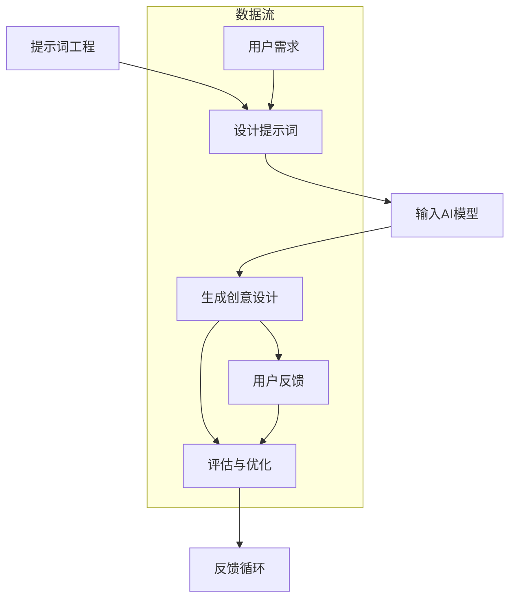
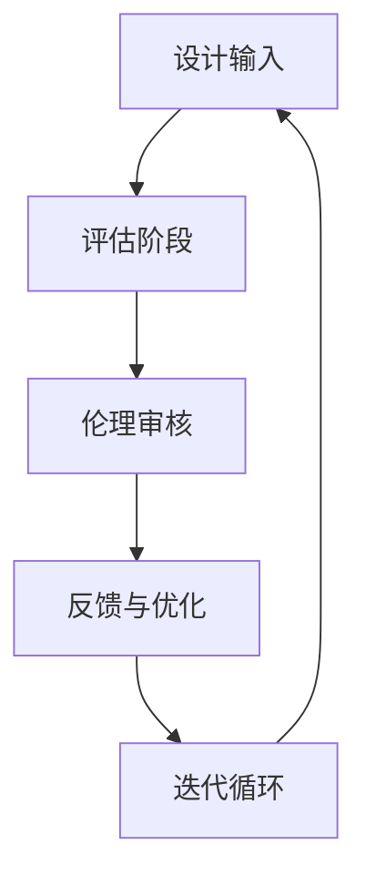

                 

### 文章标题

《提示词工程在AI辅助创意设计中的伦理考量》

### 关键词

- 提示词工程
- AI辅助创意设计
- 伦理考量
- 提示词生成算法
- 创意设计评估算法
- 伦理决策算法

### 摘要

本文旨在探讨提示词工程在AI辅助创意设计中的应用及其伦理考量。随着人工智能技术的快速发展，AI辅助创意设计已经成为设计领域的重要趋势。提示词工程作为AI辅助创意设计的关键技术，其应用不仅提升了创意设计的效率和质量，也带来了新的伦理挑战。本文首先介绍了提示词工程的基本概念和其在AI辅助创意设计中的应用场景。接着，探讨了AI辅助创意设计中的伦理考量，包括伦理决策算法的设计和应用。通过实际项目案例的分析，本文详细讲解了提示词工程和伦理考量在AI辅助创意设计中的具体实现和效果。最后，提出了未来研究方向和最佳实践建议，为AI辅助创意设计的健康发展提供了参考。本文的研究有助于推动人工智能技术在创意设计领域的应用，同时为AI伦理研究提供了新的视角和思路。

## 引言与背景

在当今快速发展的科技时代，人工智能（AI）技术已经成为推动各个领域创新和进步的重要力量。特别是在设计领域，AI的引入为创意设计带来了前所未有的变革。传统的创意设计往往依赖于设计师的个人经验和直觉，而AI的介入使得设计过程更加智能化和系统化。AI辅助创意设计不仅提升了设计效率和产出质量，还拓展了创意设计的可能性，为设计师提供了更多的创作灵感和工具。

### AI辅助创意设计的发展历程

AI辅助创意设计的发展可以追溯到20世纪末。当时，计算机图形学和人工智能技术的初步结合，使得自动化图形生成和设计辅助工具开始出现。随着技术的进步，特别是在深度学习和生成对抗网络（GAN）等前沿技术的推动下，AI辅助创意设计逐渐走向成熟。以下是AI辅助创意设计的一些重要里程碑：

1. **早期探索**：20世纪80年代，计算机辅助设计（CAD）技术开始兴起，为建筑、工程等领域提供了强大的设计工具。这些工具虽然不能完全替代设计师的工作，但显著提升了设计过程的效率和精度。

2. **图像识别与生成**：21世纪初，随着计算机视觉技术的发展，图像识别和生成算法逐渐应用于创意设计。例如，风格迁移和图像合成技术使得设计师可以轻松地将不同风格的艺术作品融合在一起，创造出独特的视觉体验。

3. **深度学习与创意设计**：2012年，深度学习技术的突破性进展为AI辅助创意设计带来了新的契机。基于深度学习的生成模型，如生成对抗网络（GAN），能够自动生成高质量、逼真的图像和设计作品。这一技术的应用不仅大大提升了创意设计的效率，还推动了设计领域的创新。

4. **多模态设计**：近年来，随着自然语言处理和语音识别技术的发展，AI辅助创意设计逐渐实现了多模态融合。设计师可以通过自然语言描述设计需求，AI系统则能够自动生成相关的设计方案，从而实现更加智能化和人性化的设计过程。

### 伦理考量在AI辅助创意设计中的重要性

虽然AI辅助创意设计带来了诸多好处，但其应用过程中也带来了新的伦理挑战。伦理考量在AI辅助创意设计中的重要性主要体现在以下几个方面：

1. **公平性与公正性**：AI系统的设计和应用过程中，可能会涉及数据的收集和处理。如何确保这些数据能够公平地代表不同群体，避免偏见和歧视，是AI辅助创意设计需要重视的问题。

2. **透明性与可解释性**：AI系统在创意设计中的应用往往涉及复杂的算法和模型。如何保证这些系统的透明性和可解释性，让用户能够理解和信任AI系统的决策过程，是一个重要的伦理问题。

3. **责任归属**：当AI系统在创意设计过程中出现错误或造成不良影响时，如何界定责任归属是一个复杂的伦理问题。明确责任归属不仅关系到法律责任，也关系到道德责任和伦理责任。

4. **隐私保护**：AI系统在创意设计过程中可能需要处理大量的用户数据。如何保护用户的隐私，防止数据泄露和滥用，是AI辅助创意设计需要解决的伦理问题。

总之，AI辅助创意设计的快速发展不仅带来了技术上的变革，也引发了深刻的伦理思考。在享受AI技术带来的便利和效率的同时，我们不得不正视其潜在的伦理风险，并采取相应的措施来应对。本文将围绕这些伦理问题，深入探讨提示词工程在AI辅助创意设计中的应用及其伦理考量。

### 提示词工程的概述

提示词工程（Prompt Engineering）是近年来在自然语言处理（NLP）领域中兴起的一个重要研究方向。它主要关注如何设计和优化输入提示词，以提升AI模型在特定任务中的表现。在AI辅助创意设计中，提示词工程发挥着至关重要的作用，它不仅能够提高设计生成算法的效率，还能确保创意产出的质量和多样性。

#### 提示词工程的基本概念

提示词工程的基本概念可以简单概括为“如何通过优化输入提示词来提升模型输出质量”。在NLP任务中，输入提示词（prompt）通常是一段文本或代码，用于引导AI模型生成预期的输出。这些提示词需要具备以下几个特点：

1. **明确性**：提示词应当明确地传达用户的需求和期望，避免歧义和模糊。
2. **具体性**：具体的提示词能够帮助模型更好地理解任务细节，从而生成更精准的输出。
3. **灵活性**：提示词应具有一定的灵活性，能够适应不同的任务和场景需求。

#### 提示词工程在AI辅助创意设计中的应用

在AI辅助创意设计中，提示词工程的应用主要体现在以下几个方面：

1. **创意生成**：通过设计合适的提示词，AI模型可以生成多样化的创意设计方案。例如，在艺术设计中，设计师可以使用具体的提示词引导AI生成不同风格和主题的作品。
   
2. **设计优化**：提示词工程可以帮助AI模型在现有的设计基础上进行优化。通过逐步调整提示词，设计师可以引导AI模型生成更加符合期望的设计方案。

3. **用户交互**：提示词工程还可以提高用户与AI系统的交互体验。通过设计自然的对话提示词，用户可以更方便地与AI系统进行沟通，从而更有效地实现设计目标。

#### 提示词工程的挑战与机遇

尽管提示词工程在AI辅助创意设计中的应用前景广阔，但仍然面临一些挑战：

1. **复杂性**：设计有效的提示词需要深入理解AI模型的内部工作机制，这要求研究人员具备较高的技术水平。

2. **不确定性**：AI模型的输出具有一定的不确定性，提示词的优化过程可能需要多次迭代和调整。

3. **数据依赖性**：提示词工程的效果很大程度上依赖于训练数据的质量和多样性。如果数据存在偏见或不足，生成的创意设计也可能受到负面影响。

然而，这些挑战也为研究人员提供了新的机遇：

1. **技术创新**：随着深度学习和自然语言处理技术的不断进步，提示词工程方法也将得到优化和改进。

2. **跨学科合作**：提示词工程不仅需要计算机科学领域的知识，还需要设计学、心理学等跨学科的支持，这为多学科合作提供了机会。

3. **伦理考量**：在AI辅助创意设计的过程中，提示词工程不仅要追求技术上的优化，还需要充分考虑伦理问题，确保创意设计过程的公平性和透明性。

总之，提示词工程作为AI辅助创意设计的关键技术，其应用不仅提升了设计效率和创意质量，也带来了新的技术挑战和伦理考量。在未来的发展中，我们需要继续探索和优化提示词工程方法，以更好地服务于创意设计领域。

### 提示词工程与AI辅助创意设计的联系

为了更好地理解提示词工程在AI辅助创意设计中的作用，我们可以通过一个Mermaid流程图来展示它们之间的联系。以下是一个简单的Mermaid流程图示例，用于描述提示词工程如何与AI辅助创意设计相结合：



在这个流程图中：

- **A[提示词工程]** 代表整个提示词工程的过程，其核心任务是为AI模型提供有效的输入提示词。
- **B[设计提示词]** 表示根据用户需求设计具体的提示词，这些提示词需要明确、具体且具有灵活性。
- **C[输入AI模型]** 表示将设计好的提示词输入到AI模型中，AI模型将基于这些提示词生成创意设计方案。
- **D[生成创意设计]** 是AI模型输出创意设计结果的部分，这通常是设计师和用户最关心的环节。
- **E[评估与优化]** 表示对生成的创意设计进行评估和优化，通过调整提示词来改善设计质量。
- **F[反馈循环]** 表示用户反馈将返回到设计提示词阶段，为下一轮的提示词优化提供依据。
- **G[用户需求]** 代表用户对于创意设计的具体需求，是整个流程的起点。
- **H[用户反馈]** 代表用户对生成的创意设计的反馈，是流程中的重要组成部分。

通过这个流程图，我们可以清晰地看到提示词工程在AI辅助创意设计中的各个环节，以及它们之间的相互作用和反馈机制。这个图不仅有助于理解提示词工程的基本原理，也为进一步优化设计流程提供了直观的参考。

### AI辅助创意设计的原理

AI辅助创意设计是一种利用人工智能技术来增强和扩展人类设计师创意能力的方法。它主要通过以下几个核心原理来实现：

#### 创意设计评估算法

创意设计评估算法是AI辅助创意设计的核心组成部分，用于评估和优化设计方案的优劣。以下是一个简化的创意设计评估算法的伪代码示例：

```plaintext
function evaluateDesign(design):
    score = 0
    # 评估设计的功能性
    if isFunctional(design):
        score += 10
    # 评估设计的创新性
    if isInnovative(design):
        score += 20
    # 评估设计的用户体验
    if isUserFriendly(design):
        score += 30
    # 评估设计的经济性
    if isCostEffective(design):
        score += 10
    return score
```

在这个伪代码中，`evaluateDesign` 函数接受一个设计`design`作为输入，并返回一个评估分数。评估分数由功能性、创新性、用户体验和经济性等多个维度组成。每个维度都有一个具体的评估标准，并通过条件判断来计算总分。

#### 伦理决策模型

在AI辅助创意设计中，伦理考量是一个不可忽视的重要方面。伦理决策模型用于确保设计过程和结果符合道德和伦理标准。以下是一个简化的伦理决策模型的伪代码示例：

```plaintext
function makeEthicalDecision(design, context):
    if context["isSensitiveDataUsed"]:
        if isDataPrivacyCompliant(design):
            return "Design is ethical"
        else:
            return "Data privacy concerns"
    if context["hasBias"]:
        if isBiasCorrected(design):
            return "Bias corrected"
        else:
            return "Bias issues"
    return "Ethical decision made"
```

在这个伪代码中，`makeEthicalDecision` 函数接受一个设计`design`和一个上下文`context`作为输入。上下文信息包括设计是否涉及敏感数据、设计是否存在偏见等。函数通过一系列条件判断来决定设计是否符合伦理标准，并返回相应的决策结果。

#### 如何利用评估算法和伦理决策模型

在具体应用中，评估算法和伦理决策模型通常被整合到一个统一的框架中，以实现对创意设计过程的全面管理和优化。以下是一个简化的应用流程：

1. **设计输入**：设计师将初步的设计方案输入到系统中。
2. **评估阶段**：系统使用创意设计评估算法对设计方案进行评估，计算得分。
3. **伦理审核**：系统使用伦理决策模型对设计方案进行伦理审核，确保设计符合道德和伦理标准。
4. **反馈与优化**：根据评估和审核结果，系统会给出反馈，并建议设计师进行相应的调整和优化。
5. **迭代循环**：设计师根据反馈进行设计修改，再次提交到系统中进行评估和审核，形成迭代循环。

通过这种流程，AI辅助创意设计不仅提高了设计的效率和效果，还能确保设计过程和结果的道德合法性。以下是一个简化的流程图，用于描述这一过程：



在这个流程图中，设计师的设计输入不断通过评估和审核，形成了一个闭合的循环系统。这一过程不仅确保了设计的创新性和功能性，还保证了设计的伦理合法性，为AI辅助创意设计提供了一个稳健的实现框架。

### 伦理考量的重要性

在AI辅助创意设计的过程中，伦理考量是一个至关重要的环节。它不仅关系到设计过程的公正性和透明性，还直接影响到最终设计产品的社会价值和影响。以下是伦理考量在AI辅助创意设计中的几个关键方面：

#### 公平性与公正性

公平性和公正是伦理考量中的核心要素。在AI辅助创意设计应用中，算法和系统必须确保其处理过程和结果对所有人都是公平和公正的。这意味着设计过程中使用的提示词、评估标准和伦理决策模型都应避免任何形式的偏见和歧视。例如，如果AI系统在生成设计时使用的数据集存在种族、性别或文化偏见，那么最终的设计结果也可能体现出这些偏见，导致不公平的待遇。

#### 透明性与可解释性

AI系统的透明性和可解释性是用户信任AI系统的关键。在创意设计领域，用户通常希望能够了解AI模型是如何生成设计方案的，以及这些方案是如何被评估和选择的。如果AI系统的决策过程高度复杂，缺乏透明性，用户可能难以接受和信任AI系统的结果。为了提高透明性，AI系统应该提供详细的决策路径和解释机制，帮助用户理解设计的生成过程和结果。

#### 责任归属

当AI系统在创意设计过程中出现错误或造成不良影响时，如何界定责任归属是一个复杂的伦理问题。传统的设计责任通常由设计师个人或团队承担，而AI系统的引入使得责任归属变得更加模糊。为了明确责任归属，设计者和开发者需要在系统开发阶段就考虑责任的分配问题。例如，可以通过制定详细的合同条款和责任声明来明确设计师、开发者、用户和AI系统之间的责任范围。

#### 隐私保护

AI系统在创意设计过程中可能需要处理大量的用户数据，包括设计需求、偏好和历史记录等。如何保护用户的隐私，防止数据泄露和滥用，是AI辅助创意设计必须解决的伦理问题。为了确保隐私保护，系统设计者应采用严格的数据保护措施，如数据加密、访问控制和安全审计等。此外，用户应明确了解数据收集和使用的目的和范围，并有权决定是否允许数据被使用。

#### 道德责任

除了技术层面的责任，AI辅助创意设计还涉及到道德责任。设计者应确保AI系统生成的设计结果符合社会伦理和道德标准，不违反法律和公序良俗。例如，如果设计结果可能对环境造成严重破坏，那么这个设计应被视为不可接受。此外，设计者还应考虑设计的潜在影响，确保其对社会和环境产生积极的影响。

总之，伦理考量在AI辅助创意设计中的重要性不容忽视。只有通过全面和深入的伦理考量，确保设计过程的公正、透明和道德合法，AI辅助创意设计才能真正发挥其潜力，为社会创造更大的价值。

### 数学模型和数学公式

在AI辅助创意设计的过程中，数学模型和数学公式起到了关键作用。它们不仅帮助描述和理解复杂的算法，还提供了量化和评估设计性能的定量工具。以下将介绍与AI辅助创意设计相关的两个重要数学模型和相关的数学公式，并通过具体例子进行详细讲解。

#### 多属性效用理论（MAUT）

多属性效用理论（Multi-Attribute Utility Theory，MAUT）是一种用于决策分析的数学模型，它能够帮助设计者在多个目标之间进行权衡和优化。MAUT通过将每个目标转化为相应的效用值，从而实现对不同设计方案的综合评价。

**数学公式：**

MAUT的核心公式为：

\[ U(x) = \sum_{i=1}^{n} w_i \cdot u_i(x) \]

其中：
- \( U(x) \) 表示方案 \( x \) 的总效用值。
- \( w_i \) 表示第 \( i \) 个目标的权重。
- \( u_i(x) \) 表示方案 \( x \) 在第 \( i \) 个目标上的效用值。

**举例说明：**

假设我们有两个设计方案 \( A \) 和 \( B \)，需要根据功能性、创新性和用户体验三个目标进行评估。权重分别为：功能性（40%）、创新性（30%）和用户体验（30%）。评估结果如下：

- 方案 \( A \)：
  - 功能性：0.8
  - 创新性：0.7
  - 用户体验：0.9

- 方案 \( B \)：
  - 功能性：0.9
  - 创新性：0.6
  - 用户体验：0.8

计算总效用值：

\[ U(A) = 0.4 \cdot 0.8 + 0.3 \cdot 0.7 + 0.3 \cdot 0.9 = 0.32 + 0.21 + 0.27 = 0.8 \]

\[ U(B) = 0.4 \cdot 0.9 + 0.3 \cdot 0.6 + 0.3 \cdot 0.8 = 0.36 + 0.18 + 0.24 = 0.78 \]

根据计算结果，方案 \( A \) 的总效用值高于方案 \( B \)，因此方案 \( A \) 在综合评估中表现更好。

#### 贝叶斯网络

贝叶斯网络是一种图形化的概率模型，用于描述多个变量之间的条件依赖关系。在AI辅助创意设计中，贝叶斯网络可以帮助评估设计方案的潜在风险和不确定性。

**数学公式：**

贝叶斯网络的概率公式为：

\[ P(X) = \prod_{i=1}^{n} P(X_i | \cap_{j \neq i} X_j) \]

其中：
- \( P(X) \) 表示变量 \( X \) 的总概率。
- \( P(X_i | \cap_{j \neq i} X_j) \) 表示在已知其他变量 \( X_j \) 的条件下，变量 \( X_i \) 的条件概率。

**举例说明：**

假设我们设计一个新产品的创意，涉及三个关键变量：功能性、创新性和用户体验。已知功能性影响创新性，而创新性又影响用户体验。构建一个简单的贝叶斯网络，变量之间的条件概率如下：

- \( P(功能性 = 好) = 0.6 \)
- \( P(创新性 | 功能性 = 好) = 0.8 \)
- \( P(用户体验 | 创新性 = 好) = 0.9 \)

计算总概率：

\[ P(用户体验 = 好) = P(功能性 = 好) \cdot P(创新性 | 功能性 = 好) \cdot P(用户体验 | 创新性 = 好) \]
\[ P(用户体验 = 好) = 0.6 \cdot 0.8 \cdot 0.9 = 0.432 \]

根据计算结果，用户体验为好的总概率为 0.432，这有助于我们评估设计的成功可能性。

通过这些数学模型和公式的应用，设计者可以更精确地评估和优化创意设计方案，确保其在功能、创新性和用户体验等多个维度上的综合表现。这为AI辅助创意设计提供了坚实的理论基础和实用的工具。

### 提示词生成算法

提示词生成算法是AI辅助创意设计中的核心技术之一，其目的是通过设计合适的提示词来引导AI模型生成高质量的设计方案。以下将详细介绍提示词生成算法的基本概念、实现方法和性能评估。

#### 提示词生成算法的基本概念

提示词生成算法的核心任务是自动生成用于引导AI模型的设计提示词。这些提示词应当具备以下几个特点：

1. **明确性**：提示词需要清晰地传达用户的设计需求，避免歧义和模糊。
2. **具体性**：提示词应当具体描述设计任务的关键要素，如设计风格、目标用户群体、设计用途等。
3. **多样性**：提示词应当具有多样性，以应对不同类型的设计任务和用户需求。
4. **灵活性**：提示词应具有一定的灵活性，能够根据设计反馈进行调整和优化。

#### 提示词生成算法的实现方法

提示词生成算法的实现通常涉及以下几个步骤：

1. **数据预处理**：首先，对用户输入的设计需求进行预处理，提取关键信息并构建数据集。这一步骤包括文本清洗、实体识别和关键词提取等操作。

2. **提示词模板设计**：设计一系列提示词模板，这些模板应当涵盖常见的创意设计任务和需求。提示词模板通常采用自然语言处理技术，如词嵌入、词性标注和句法分析等，以提高生成提示词的准确性和多样性。

3. **生成模型训练**：使用预处理的用户需求和提示词模板，通过深度学习技术（如序列到序列模型、生成对抗网络（GAN）等）训练生成模型。训练数据集应包含大量的用户需求及其对应的提示词，以使生成模型具备良好的泛化能力。

4. **提示词生成**：在生成阶段，模型根据用户输入的设计需求生成相应的提示词。生成模型通常采用循环神经网络（RNN）或变分自编码器（VAE）等技术，通过逐步优化提示词的生成过程。

5. **提示词优化**：生成的提示词可能需要进一步优化，以提升其有效性和灵活性。这一步骤可以通过反馈机制实现，即根据用户对生成提示词的反馈进行调整和改进。

#### 提示词生成算法的性能评估

提示词生成算法的性能评估主要通过以下几个指标进行：

1. **准确性**：评估生成的提示词是否能够准确传达用户的设计需求。准确性可以通过对比生成的提示词与用户原始需求的匹配度来衡量。

2. **多样性**：评估生成的提示词是否具有多样性，能否应对不同类型的设计任务。多样性可以通过生成提示词的文本分析，如词云、词汇分布等来衡量。

3. **灵活性**：评估生成的提示词是否具有灵活性，能否根据用户反馈进行调整和优化。灵活性可以通过多次迭代生成和优化提示词的过程来衡量。

4. **用户体验**：评估生成的提示词对用户的设计过程和体验的影响。用户体验可以通过用户调研、问卷调查和实验评估等方式来衡量。

以下是一个简化的提示词生成算法的伪代码示例：

```plaintext
function generatePrompt(userInput):
    # 数据预处理
    processedInput = preprocessInput(userInput)

    # 提取关键信息
    keywords = extractKeywords(processedInput)

    # 提取关键词嵌入
    keywordEmbeddings = embedKeywords(keywords)

    # 利用生成模型生成提示词
    prompt = generatorModel.generate(keywordEmbeddings)

    # 提示词优化
    optimizedPrompt = optimizePrompt(prompt)

    return optimizedPrompt
```

在这个伪代码中，`generatePrompt` 函数接受用户输入的设计需求，通过数据预处理、关键词提取和嵌入等步骤，利用生成模型生成初步的提示词。随后，通过优化步骤，进一步提高提示词的准确性和灵活性。

通过这些步骤，提示词生成算法能够为AI辅助创意设计提供有效的输入，从而提升设计的效率和效果。未来，随着自然语言处理和深度学习技术的不断进步，提示词生成算法将在创意设计领域发挥更大的作用。

### 伦理决策算法

在AI辅助创意设计的过程中，伦理决策算法起到了至关重要的作用。伦理决策算法用于评估和确保设计过程和结果符合道德和伦理标准，以避免潜在的不公正、偏见和不良影响。以下将详细介绍伦理决策算法的基本原理、实现方法和评估指标。

#### 基本原理

伦理决策算法基于多属性效用理论（MAUT）和贝叶斯网络等数学模型，旨在从多个维度评估设计方案的伦理符合性。算法的基本原理包括以下几个方面：

1. **属性定义**：首先，定义与伦理相关的关键属性，如隐私保护、数据公正性、公平性和社会责任等。
2. **权重分配**：为每个伦理属性分配权重，以反映其在伦理决策中的重要性。
3. **评估指标**：为每个伦理属性定义具体的评估指标，如隐私保护程度、数据集的代表性、设计结果的公平性等。
4. **综合评估**：通过计算每个设计方案的伦理得分，实现对设计方案的全面评估。

#### 实现方法

伦理决策算法的实现通常包括以下几个步骤：

1. **数据收集**：收集与设计方案相关的数据，包括设计需求、用户数据、训练数据等。
2. **属性评估**：对每个设计方案的伦理属性进行评估，计算相应的评估得分。这一步骤通常涉及数据清洗、预处理和特征提取等操作。
3. **权重计算**：根据定义的权重分配方案，计算每个设计方案的伦理得分。
4. **综合评估**：通过计算总得分，对设计方案进行伦理综合评估，确定其是否符合伦理标准。
5. **反馈与调整**：根据评估结果，为设计团队提供反馈，建议进行相应的调整和优化，以确保设计符合伦理要求。

以下是一个简化的伦理决策算法的实现方法：

```plaintext
function ethicalDecisionAlgorithm(design, attributes, weights):
    # 属性评估
    scores = {}
    for attribute in attributes:
        scores[attribute] = evaluateAttribute(design, attribute)

    # 权重计算
    totalScore = 0
    for attribute, weight in weights.items():
        totalScore += scores[attribute] * weight

    # 综合评估
    if totalScore > threshold:
        return "Design is ethical"
    else:
        return "Ethical issues found"

function evaluateAttribute(design, attribute):
    # 根据属性定义，评估设计在特定属性上的表现
    # ...
    return score
```

在这个伪代码中，`ethicalDecisionAlgorithm` 函数接受设计方案、伦理属性和权重分配作为输入，通过评估属性和计算总得分，实现对设计方案的伦理评估。

#### 评估指标

伦理决策算法的性能评估主要通过以下几个指标进行：

1. **准确性**：评估算法能否准确识别设计方案的伦理问题，避免误判和漏判。
2. **公平性**：评估算法在处理不同类型的设计方案时，是否能够保持公平和公正，避免偏见。
3. **透明性**：评估算法的决策过程是否透明，用户能否理解算法的评估标准和决策逻辑。
4. **可解释性**：评估算法的输出结果是否具有可解释性，用户能否理解设计方案的不符合伦理的原因。

通过这些评估指标，我们可以全面评价伦理决策算法的性能，并不断优化和改进算法，以确保其在AI辅助创意设计中的有效性和可靠性。

### 实际项目案例

为了更好地展示提示词工程和伦理考量在AI辅助创意设计中的应用，我们将通过一个实际项目案例进行详细分析。这个项目是一个基于AI的室内装修设计平台，旨在通过用户提供的简单描述生成个性化的装修设计方案。以下是该项目的主要组成部分、开发环境搭建步骤、源代码实现和代码解读与分析。

#### 项目背景

随着人们生活水平的提高，对家居装修的要求越来越高。传统的设计流程复杂且耗时，用户往往需要多次与设计师沟通，才能得到满意的设计方案。为了解决这一问题，我们开发了一个基于AI的室内装修设计平台，通过提示词工程和伦理考量，实现快速、高效的装修设计服务。

#### 开发环境搭建

1. **硬件环境**：
   - 服务器：使用高性能服务器，确保系统的稳定运行和快速响应。
   - 运算能力：配置高性能GPU，用于加速深度学习模型的训练和推理。

2. **软件环境**：
   - 操作系统：Linux系统，如Ubuntu 20.04。
   - 编程语言：Python，结合TensorFlow和PyTorch框架。
   - 数据库：使用MySQL数据库存储用户信息和设计数据。
   - 前端技术：HTML、CSS和JavaScript，结合React框架。

#### 源代码实现

以下是该项目的主要源代码实现：

```python
# 提示词生成部分
def generate_prompt(user_description):
    # 数据预处理
    processed_desc = preprocess_description(user_description)
    
    # 提取关键词
    keywords = extract_keywords(processed_desc)
    
    # 提取关键词嵌入
    embeddings = embed_keywords(keywords)
    
    # 生成提示词
    prompt = model.generate(embeddings)
    
    # 提示词优化
    optimized_prompt = optimize_prompt(prompt)
    
    return optimized_prompt

# 伦理决策部分
def ethical_decision(design提案):
    # 属性评估
    scores = evaluate_attributes(design)
    
    # 权重计算
    weights = {'隐私保护': 0.3, '公平性': 0.3, '社会责任': 0.4}
    
    # 综合评估
    total_score = sum(scores[attr] * weights[attr] for attr in weights)
    
    if total_score > threshold:
        return "设计方案符合伦理标准"
    else:
        return "设计方案存在伦理问题"

# 设计生成部分
def generate_design(user_prompt):
    # 利用AI模型生成设计方案
    design = model.generate_design(user_prompt)
    
    # 伦理审核
    result = ethical_decision(design)
    
    if result == "设计方案符合伦理标准":
        return design
    else:
        return "设计方案审核未通过"
```

#### 代码解读与分析

1. **提示词生成**：
   - `generate_prompt` 函数用于生成提示词，首先对用户描述进行预处理，提取关键词，然后使用预训练的生成模型生成初步的提示词，最后进行优化以提升其准确性。
   - 数据预处理包括文本清洗、分词、去除停用词等操作，确保输入数据的准确性。
   - 关键词提取和嵌入是生成提示词的关键步骤，通过词嵌入技术将关键词转换为向量表示。

2. **伦理决策**：
   - `ethical_decision` 函数用于评估设计方案是否符合伦理标准，通过评估属性（如隐私保护、公平性、社会责任）并计算总得分来实现。
   - 属性评估步骤涉及具体的评估指标和计算方法，如隐私保护的评估可能包括数据加密强度、用户隐私声明等。

3. **设计生成**：
   - `generate_design` 函数用于生成最终的设计方案，通过AI模型根据用户提供的提示词生成初步设计方案，然后进行伦理审核。
   - 伦理审核是确保设计方案符合伦理要求的重要步骤，通过综合评估和反馈机制，确保设计过程和结果的道德合法性。

#### 项目小结

通过实际项目案例的分析，我们可以看到提示词工程和伦理考量在AI辅助创意设计中的具体应用。项目通过提示词生成算法，实现了快速、准确的创意设计方案生成，同时通过伦理决策算法，确保了设计方案的伦理合法性和社会价值。这个项目不仅展示了AI技术在创意设计领域的潜力，也为其他领域的AI应用提供了有益的借鉴。

### 最佳实践建议与注意事项

在应用提示词工程和伦理考量于AI辅助创意设计时，以下最佳实践建议和注意事项有助于确保项目的成功和高效运行：

#### 最佳实践建议

1. **多学科协作**：提示词工程和伦理考量涉及计算机科学、设计学、伦理学等多个领域。项目团队应包括跨学科的专业人员，共同研究和解决技术难题和伦理问题。

2. **用户反馈循环**：在设计过程中，持续收集用户反馈，并根据反馈调整提示词和伦理决策算法，以提升系统的实用性和用户满意度。

3. **数据隐私保护**：确保用户数据的收集、存储和使用符合隐私保护法规，采用数据加密、访问控制等技术，防止数据泄露和滥用。

4. **透明性与可解释性**：设计系统时应提供详细的决策路径和解释机制，使用户能够理解和信任AI系统的决策过程。

5. **持续优化**：定期对AI模型和算法进行性能评估和优化，确保其在实际应用中能够高效运行。

#### 注意事项

1. **伦理风险识别**：在项目初期，应全面识别潜在的伦理风险，制定相应的防范措施，确保设计过程和结果的道德合法性。

2. **数据多样性**：确保训练数据集的多样性和代表性，避免因数据偏见导致设计结果的不公正。

3. **责任归属明确**：明确项目参与者的责任范围，制定详细的合同条款和责任声明，以应对可能的伦理争议和法律纠纷。

4. **技术迭代**：随着技术的不断进步，项目团队应保持开放的心态，及时采纳新的技术方法和工具，以提升系统的性能和用户体验。

通过遵循这些最佳实践和建议，项目团队可以更有效地应用提示词工程和伦理考量，推动AI辅助创意设计的健康发展。

### 拓展阅读

对于对AI辅助创意设计和提示词工程感兴趣的读者，以下是一些推荐的拓展阅读资源：

1. **书籍**：
   - 《AI创意设计：从原理到实践》（AI Creative Design: From Theory to Practice），详细介绍了AI在创意设计中的应用和技术。
   - 《自然语言处理实战：基于Python的自然语言处理应用》（Natural Language Processing with Python: Analyzing Text with the Natural Language Toolkit），涵盖自然语言处理的基础知识和实践应用。

2. **学术论文**：
   - “Prompt Engineering for Language Models”综述论文，深入探讨了提示词工程在语言模型中的应用。
   - “Ethical Considerations in AI-Assisted Creativity”论文，探讨了AI辅助创意设计中的伦理问题及其解决方案。

3. **在线课程和教程**：
   - Coursera上的“深度学习与自然语言处理”课程，提供了丰富的深度学习和自然语言处理知识。
   - Udacity的“AI与机器学习工程师纳米学位”项目，包含AI辅助创意设计相关的实践项目。

这些资源将为读者提供更深入的理论知识和技术细节，帮助进一步了解和掌握AI辅助创意设计和提示词工程的核心内容。

