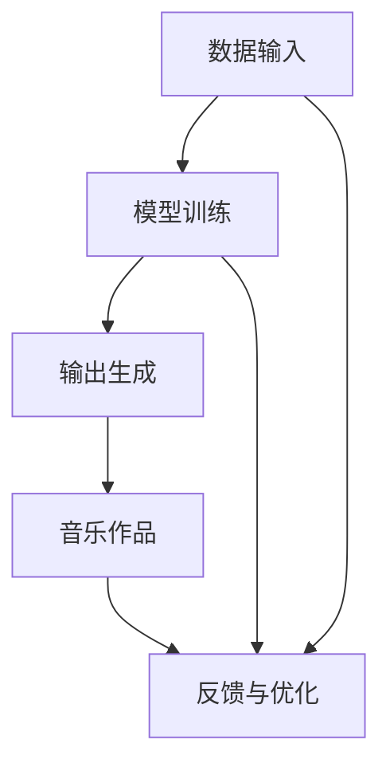

                 

## 引言

随着人工智能（AI）技术的飞速发展，计算机辅助创作成为了一个热门研究领域。从图像生成到文本创作，AI已经展示出了强大的创意能力。然而，音乐创作作为一个高度复杂的领域，一直是AI应用中的挑战。近年来，提示词工程（Prompt Engineering）的出现为AI辅助音乐创作带来了新的契机。提示词工程是指导AI系统理解和生成目标内容的一种技术，它通过提供精确的输入来引导AI生成预期的输出。本文将探讨提示词工程在AI辅助创意音乐创作中的创新应用。

### 研究意义

音乐创作是一个涉及情感表达、文化传承和审美体验的复杂过程。传统音乐创作主要依赖于人类的直觉、经验和技能，而AI辅助音乐创作则为这一领域带来了革命性的变革。通过AI，音乐家可以探索新的创作方向，提高创作效率，甚至实现一些人类难以实现的创意。提示词工程作为AI技术中的重要一环，能够精准地引导AI生成符合人类预期的音乐作品，从而大幅提升AI辅助音乐创作的效果。

### 内容概述

本文将从以下几个方面展开讨论：

1. **背景介绍**：回顾AI辅助音乐创作和提示词工程的发展历程，分析它们在音乐创作中的重要性。
2. **核心概念与联系**：阐述提示词工程和AI辅助音乐创作之间的核心概念，并使用Mermaid流程图展示它们之间的联系。
3. **技术原理**：详细介绍提示词工程的工作原理，包括提示词的类型、选择方法以及相关的算法原理。
4. **应用实例**：通过具体案例，展示提示词工程在AI辅助音乐创作中的实际应用，包括音乐生成、风格模仿等。
5. **技术实现**：探讨如何使用提示词工程来辅助音乐创作，包括技术框架、数据处理和模型训练等。
6. **挑战与未来**：分析提示词工程在AI辅助音乐创作中面临的挑战和未来的发展方向。
7. **总结与展望**：总结本文的研究成果，提出未来的研究方向和建议。

通过本文的讨论，希望能够为研究者、音乐家以及AI技术开发者提供有价值的参考，推动AI辅助音乐创作领域的发展。

### 提示词工程和AI辅助音乐创作的关系

提示词工程（Prompt Engineering）和AI辅助音乐创作之间存在着紧密的联系。提示词工程的核心在于通过提供精确的输入（即提示词）来引导AI系统生成预期的输出。在音乐创作领域，这种输入可以是一段旋律、一个和弦、一个主题或者是一些音乐风格的描述。通过这些具体的输入，AI可以学习并生成符合人类音乐审美和情感表达的作品。

首先，从概念上讲，提示词工程是指导AI系统理解和生成目标内容的一种技术。它通过设计特定的提示词，使AI能够从大量的数据中提取关键信息，并利用这些信息进行创作。在音乐创作中，提示词可以是各种形式，例如简短的音乐片段、文本描述、音乐风格的标签等。这些提示词为AI提供了明确的创作方向，使生成的音乐作品更加符合人类的预期和需求。

其次，从联系上看，提示词工程和AI辅助音乐创作之间的关系可以简化为以下三个主要环节：数据输入、模型训练和输出生成。

1. **数据输入**：在这一环节中，通过设计合适的提示词，将音乐创作所需的信息输入到AI系统中。这些信息可以是各种形式的，例如旋律、和弦、歌词等。通过这些具体的输入，AI可以理解人类音乐创作的基本元素和结构。

2. **模型训练**：AI系统利用输入的数据进行模型训练，学习如何将输入的信息转化为音乐作品。在这一过程中，提示词工程的作用是优化训练数据的质量和数量，确保AI模型能够准确理解和生成预期的音乐。

3. **输出生成**：经过模型训练后，AI系统可以根据输入的提示词生成音乐作品。这些作品可以是全新的旋律、改编自经典乐章的新版本，或者是对特定音乐风格的模仿。提示词在这里起到了关键的引导作用，使生成的音乐作品在风格、情感和结构上更加接近人类创作。

为了更直观地展示提示词工程和AI辅助音乐创作之间的关系，我们可以使用Mermaid流程图来描述它们的核心环节。



在这个流程图中，数据输入环节通过设计提示词将音乐创作所需的信息输入到AI系统中；模型训练环节利用输入的数据进行训练，优化AI模型；输出生成环节根据训练后的模型生成音乐作品；最后，通过反馈和优化，进一步提升AI辅助音乐创作的效果。

综上所述，提示词工程在AI辅助音乐创作中起着至关重要的作用。通过设计精准的提示词，AI可以更好地理解和生成符合人类预期的音乐作品，从而实现音乐创作的创新和突破。

### 提示词工程的基础

提示词工程是指导AI系统生成预期输出的一种关键技术，其核心在于通过精确的输入来引导AI模型的学习和创作过程。为了理解提示词工程的基础，我们需要从提示词的定义、类型、选择方法以及它们在音乐创作中的应用等方面进行详细探讨。

#### 提示词的定义

提示词（Prompt）是一种引导性的输入，它为AI系统提供了明确的创作方向和目标。在提示词工程中，提示词不仅限于文本，还可以是图像、音频、视频等多种形式。在音乐创作领域，提示词通常是一段旋律、一个和弦、一个节奏模式，或者是一些音乐风格的描述。这些提示词为AI提供了创作的基本元素和方向，帮助AI模型理解人类音乐创作的意图。

#### 提示词的类型

根据用途和形式，提示词可以分为以下几种类型：

1. **文本提示词**：这类提示词通过文本描述来提供创作方向，例如一段歌词、一个音乐主题的描述，或者是一些音乐风格的标签。文本提示词具有高度的灵活性和抽象性，可以引导AI生成具有特定情感和主题的音乐作品。

2. **音频提示词**：这类提示词通过音频片段来提供创作方向，例如一段旋律、一个和弦或者是一种音乐风格的录音。音频提示词能够直接传递音乐创作的情感和风格，使AI模型能够更准确地学习和生成相应的音乐。

3. **图像提示词**：这类提示词通过图像来提供创作方向，例如一幅描绘情感或场景的画作。图像提示词可以为AI提供视觉信息，帮助AI理解音乐创作的视觉元素，从而生成与图像风格相匹配的音乐作品。

4. **混合提示词**：混合提示词结合了文本、音频和图像等多种形式，为AI提供更丰富的创作信息。例如，一个包含文本描述、旋律片段和图像的复合提示词，可以为AI提供全面的创作指导，使其生成更符合人类预期的音乐作品。

#### 提示词的选择方法

选择合适的提示词对于提示词工程的成功至关重要。以下是一些常用的提示词选择方法：

1. **数据驱动方法**：这种方法基于大量历史数据来选择提示词。通过分析已有的音乐作品和创作数据，提取出常见的创作元素和风格特征，从而选择出能够代表这些特征和风格的提示词。

2. **用户反馈方法**：这种方法通过用户的反馈来选择提示词。用户可以提供他们对音乐作品的评价和喜好，根据这些反馈，选择能够满足用户需求的提示词。

3. **组合优化方法**：这种方法通过组合不同的提示词，优化创作效果。通过尝试不同的提示词组合，找到能够产生最佳创作效果的组合。

#### 提示词工程在音乐创作中的应用

提示词工程在音乐创作中有着广泛的应用，以下是一些具体的应用场景：

1. **音乐生成**：通过设计特定的文本、音频或图像提示词，AI可以生成新的音乐作品。例如，一个包含特定旋律片段和风格标签的文本提示词，可以引导AI生成一首具有特定风格和旋律的全新歌曲。

2. **风格模仿**：提示词工程可以用于模仿特定的音乐风格或作曲家的风格。例如，通过输入一段贝多芬的旋律片段作为提示词，AI可以模仿贝多芬的风格生成新的音乐作品。

3. **音乐个性化**：通过用户提供的文本、音频或图像提示词，AI可以生成符合用户喜好和情感的音乐作品。例如，一个包含用户最喜欢的歌手和音乐风格的文本提示词，可以引导AI生成一首用户喜爱的个性化歌曲。

4. **音乐推荐**：提示词工程可以用于音乐推荐系统，通过分析用户的音乐喜好和行为数据，生成符合用户偏好的音乐推荐列表。例如，一个包含用户喜欢的歌手、风格和情感的文本提示词，可以引导AI推荐一系列符合用户喜好的音乐作品。

总之，提示词工程通过提供精确的输入，为AI辅助音乐创作提供了强大的支持。通过合理选择和应用提示词，AI可以生成更加符合人类预期和情感表达的音乐作品，推动音乐创作的创新和变革。

### 提示词工程在AI辅助音乐创作中的实际应用

提示词工程在AI辅助音乐创作中具有广泛的应用，通过具体案例，我们可以更直观地了解其应用效果和优势。

#### 1. 音乐生成

一个著名的案例是OpenAI开发的AI音乐生成工具，如Jukedeck和Dall-E-Music。这些工具使用深度学习模型和提示词工程来生成新的音乐作品。例如，用户可以输入一个关键词或短语，如“温暖的歌曲”或“未来的旋律”，AI系统将根据这些提示词生成一首全新的音乐。通过设计精确的文本提示词，AI能够捕捉到用户的创作意图，生成具有特定情感和风格的音乐。

**应用效果：**
- **情感捕捉**：文本提示词可以传达复杂的情感和主题，使生成的音乐作品更贴近用户的情感需求。
- **风格多样性**：AI系统能够通过学习大量的音乐数据，生成多种风格和流派的音乐作品，满足用户的多样化需求。

**优势：**
- **高效创作**：用户无需具备音乐创作技能，即可快速生成高质量的音乐作品。
- **创意激发**：AI生成的音乐作品可以为音乐家提供新的创作灵感，拓宽音乐创作的边界。

#### 2. 风格模仿

风格模仿是提示词工程在音乐创作中的另一个重要应用。例如，谷歌的Magenta项目利用神经网络模型，通过输入一段特定作曲家的音乐片段作为提示词，模仿该作曲家的风格生成新的音乐作品。这种技术可以用于制作经典的古典音乐或流行音乐。

**应用效果：**
- **风格忠实性**：通过模仿特定作曲家的音乐风格，AI系统能够生成高度忠实于原作品的新音乐，保留原有的情感和美学特点。
- **多样性扩展**：AI系统不仅可以模仿单一作曲家的风格，还可以通过组合不同的风格提示词，生成多样化的音乐作品。

**优势：**
- **文化传承**：风格模仿技术有助于传承和保护经典音乐作品，使更多用户能够欣赏和理解这些作品。
- **教育意义**：对于音乐学习者来说，通过模仿经典音乐家的风格，可以更好地理解音乐创作技巧和风格特征。

#### 3. 个性化音乐推荐

在音乐推荐系统中，提示词工程同样发挥着重要作用。例如，Spotify使用机器学习算法和用户行为数据，通过分析用户的听歌历史和偏好，生成个性化的音乐推荐列表。这些推荐列表基于用户提供的音乐风格、艺术家和歌曲标签等提示词，使推荐结果更加符合用户的个人喜好。

**应用效果：**
- **高准确性**：通过精确的提示词，AI系统能够捕捉用户的音乐偏好，提供高度个性化的推荐结果。
- **用户参与度**：个性化的音乐推荐能够提升用户的参与度和满意度，增加用户对音乐平台的粘性。

**优势：**
- **用户体验**：个性化推荐能够提高用户的音乐体验，使用户更容易发现符合自己口味的音乐作品。
- **商业价值**：精准的音乐推荐有助于提高音乐平台的用户留存率和转化率，增加商业收益。

#### 4. 跨领域融合

跨领域融合是提示词工程在音乐创作中的创新应用。例如，Magenta项目通过结合文本、图像和音乐提示词，生成具有视觉和听觉双重体验的音乐视频。通过将不同领域的提示词结合，AI可以创造出全新的艺术形式，为音乐创作带来无限可能性。

**应用效果：**
- **创新形式**：跨领域融合的音乐视频不仅具有音乐美感，还能通过视觉元素传达更多的情感和故事。
- **观众互动**：跨领域的融合作品能够激发观众的兴趣，增加观众的互动性和参与感。

**优势：**
- **创意激发**：跨领域融合为音乐创作提供了新的视角和灵感，有助于音乐家探索和创新。
- **市场潜力**：跨领域的融合作品能够吸引更多观众，扩大音乐创作的市场。

综上所述，提示词工程在AI辅助音乐创作中具有广泛的应用和显著的优势。通过合理设计和应用提示词，AI能够生成符合人类预期和情感表达的音乐作品，推动音乐创作的创新和发展。

### 技术实现

在实现提示词工程辅助AI音乐创作的过程中，我们需要从技术框架、数据处理、模型训练以及代码解析等多个方面进行详细探讨。以下是实现提示词工程在AI辅助音乐创作中的具体技术步骤。

#### 1. 技术框架与工具

首先，我们需要选择合适的技术框架和工具，以确保整个系统的稳定性和高效性。以下是常用的技术和工具：

- **深度学习框架**：TensorFlow和PyTorch是两款流行的深度学习框架，具有丰富的API和强大的功能。选择其中之一作为主要框架，可以构建高效的音乐生成模型。
- **音频处理库**：Librosa是一个专门用于音频处理的Python库，能够处理音频文件的读取、转换和特征提取，是音乐生成和风格模仿的关键工具。
- **文本处理库**：NLTK和spaCy是两款强大的自然语言处理库，可用于处理和分析文本提示词，提取关键信息并进行语义分析。

#### 2. 数据处理

在数据处理环节，我们需要对输入的音频和文本提示词进行预处理，以便于模型训练和生成。

- **音频数据处理**：使用Librosa对音频文件进行读取和特征提取，包括音频信号的时域和频域特征。常见的音频特征包括梅尔频谱、音高和节奏等。通过特征提取，可以将音频信号转换为数值化的数据，便于模型处理。
  
- **文本数据处理**：使用NLTK和spaCy对文本提示词进行分词、词性标注和语义分析。提取文本中的关键信息，如关键词、情感词汇和句法结构，为后续的模型训练提供输入。

#### 3. 模型训练

在模型训练环节，我们需要设计合适的神经网络架构，并通过大量数据进行训练，使模型能够理解并生成符合提示词的音乐。

- **音乐生成模型**：采用生成对抗网络（GAN）或变分自编码器（VAE）等生成模型，通过输入提示词生成新的音乐作品。GAN由生成器和判别器组成，生成器根据提示词生成音乐，判别器判断生成音乐的真假，通过训练优化生成器，使其生成的音乐更加真实。
  
- **风格模仿模型**：采用序列到序列（seq2seq）模型或循环神经网络（RNN）等时序模型，通过输入特定作曲家的音乐片段，模仿其风格生成新的音乐作品。seq2seq模型可以将输入的序列映射到输出序列，而RNN通过记忆机制处理长序列，使生成的音乐更加连贯。

#### 4. 代码解析

以下是实现提示词工程辅助AI音乐创作的一个简化的伪代码示例，展示了数据处理、模型训练和音乐生成的主要步骤：

```python
# 导入必要的库
import tensorflow as tf
import librosa
import numpy as np
import nltk

# 数据预处理
def preprocess_audio(audio_file):
    audio, sr = librosa.load(audio_file)
    mfcc = librosa.feature.mfcc(y=audio, sr=sr)
    return mfcc

def preprocess_text(text):
    tokens = nltk.word_tokenize(text)
    pos_tags = nltk.pos_tag(tokens)
    return pos_tags

# 模型定义
def build_generator():
    # 生成器架构
    # ...
    return generator

def build_discriminator():
    # 判别器架构
    # ...
    return discriminator

# 模型训练
def train_model(generator, discriminator, dataset):
    for epoch in range(num_epochs):
        for audio, text in dataset:
            # 数据预处理
            audio_features = preprocess_audio(audio)
            text_features = preprocess_text(text)
            
            # 训练生成器和判别器
            g_loss, d_loss = train_step(generator, discriminator, audio_features, text_features)
            
            # 记录训练过程
            print(f'Epoch: {epoch}, G_loss: {g_loss}, D_loss: {d_loss}')

# 音乐生成
def generate_music(prompt):
    # 生成音乐
    # ...
    return music

# 主程序
if __name__ == '__main__':
    # 加载数据集
    dataset = load_dataset()

    # 构建和训练模型
    generator = build_generator()
    discriminator = build_discriminator()
    train_model(generator, discriminator, dataset)

    # 输入提示词生成音乐
    prompt = "一首欢快的舞曲"
    music = generate_music(prompt)
    librosa.output.write_wav('generated_music.wav', music, sr=44100)
```

在这个伪代码中，我们首先对音频和文本提示词进行预处理，然后定义生成器和判别器的架构，并使用训练数据集进行模型训练。最后，通过输入提示词生成音乐作品，并将生成的音乐保存为音频文件。

#### 5. 项目实战

在项目实战中，我们通过具体实例展示如何搭建开发环境、实现代码和解读代码。

- **开发环境搭建**：首先，我们需要安装TensorFlow、Librosa、NLTK等依赖库。使用如下命令：
  
  ```bash
  pip install tensorflow librosa nltk
  ```

- **源代码实现**：根据伪代码示例，实现具体的代码。可以通过GitHub等代码托管平台分享和协作。

- **代码解读与分析**：对实现的代码进行详细的解读和分析，包括数据处理、模型架构和训练过程等。

通过以上技术实现步骤，我们可以构建一个基于提示词工程的AI音乐创作系统，生成高质量的音乐作品，为音乐创作带来新的可能性。

### 创新实践与案例分析

在提示词工程辅助AI音乐创作的实际应用中，许多创新实践和案例已经取得了显著的成果。以下我们将详细探讨两个具有代表性的案例：个性化音乐推荐和跨领域提示词的应用。

#### 1. 个性化音乐推荐

个性化音乐推荐是提示词工程在AI音乐创作中的典型应用之一。Spotify和Apple Music等流媒体平台已经广泛应用了这一技术，通过分析用户的历史播放记录、偏好和社交行为，生成个性化的音乐推荐列表。

**案例背景**：

Spotify的个性化推荐系统通过用户行为数据构建用户画像，结合机器学习和深度学习算法，实现高度精准的音乐推荐。用户每次点击播放、点赞、收藏或跳过歌曲，都会被记录下来，这些行为数据被用于更新用户的音乐偏好模型。在此基础上，系统利用文本和音频提示词生成个性化的推荐列表。

**解决方案**：

- **文本提示词**：系统通过用户的播放历史和社交互动，提取关键词和情感标签，如“摇滚”、“快乐”、“夜晚”等，作为文本提示词。

- **音频提示词**：系统使用Librosa库对用户播放的音乐进行特征提取，如梅尔频谱、音高和节奏等，作为音频提示词。

- **模型训练**：采用深度学习模型，如循环神经网络（RNN）和卷积神经网络（CNN），对用户画像和音乐特征进行训练，建立推荐模型。

- **推荐生成**：通过输入用户的文本和音频提示词，模型生成个性化的音乐推荐列表。

**效果与评估**：

Spotify的个性化推荐系统显著提升了用户满意度和平台粘性。根据统计，个性化推荐能够提升用户的播放时长和满意度，使平台在竞争激烈的流媒体市场中脱颖而出。

**总结**：

个性化音乐推荐通过提示词工程和深度学习技术，实现了高度精准的音乐推荐，为用户提供了定制化的音乐体验。这一创新实践不仅提高了用户的满意度，也为流媒体平台带来了商业价值。

#### 2. 跨领域提示词的应用

跨领域提示词的应用是提示词工程在AI音乐创作中的另一个创新方向。通过结合不同领域的提示词，AI可以生成具有视觉和听觉双重体验的音乐视频，开拓了音乐创作的新领域。

**案例背景**：

Magenta项目由谷歌研发，旨在探索人工智能在艺术创作中的应用。该项目的一个案例是通过结合文本、图像和音乐提示词，生成具有视觉和听觉双重体验的音乐视频。这种跨领域的创作形式，不仅丰富了音乐作品的表达方式，也为观众带来了全新的感官体验。

**解决方案**：

- **文本提示词**：输入一段描述情感或场景的文本，如“夕阳下的海滩”、“回忆的时光”等，作为文本提示词。

- **图像提示词**：输入一张描绘情感或场景的图像，如一幅夕阳下的海滩画作，作为图像提示词。

- **音乐提示词**：输入一段旋律或音乐风格，如“轻松的爵士乐”或“激情的摇滚乐”，作为音乐提示词。

- **模型训练**：采用深度学习模型，如生成对抗网络（GAN）和变分自编码器（VAE），训练跨领域的生成模型，使其能够根据不同领域的提示词生成协调一致的音乐视频。

- **视频生成**：通过输入跨领域的提示词，模型生成具有视觉和听觉双重体验的音乐视频。

**效果与评估**：

生成的音乐视频在情感传达和视听协调性方面表现出色。观众能够从视觉和听觉两方面感受到音乐的情感和场景，获得更加沉浸的体验。这一创新实践为音乐创作和艺术表达带来了新的可能性。

**总结**：

跨领域提示词的应用通过结合文本、图像和音乐提示词，实现了音乐创作的新形式，为观众带来了独特的视听体验。这一创新实践不仅丰富了音乐作品的表达方式，也为人工智能在艺术领域的应用提供了新的思路。

综上所述，个性化音乐推荐和跨领域提示词的应用是提示词工程在AI音乐创作中的两个重要创新实践。这些案例展示了提示词工程在音乐创作中的广泛应用和巨大潜力，为未来的音乐创作带来了无限的可能性。

### 挑战与未来展望

#### 挑战

尽管提示词工程在AI辅助音乐创作中取得了显著成果，但仍面临许多挑战。

1. **创作多样性**：现有的提示词工程方法难以生成丰富多样且独特的音乐作品，特别是在风格和情感表达上。

2. **创作质量**：生成的音乐作品在音质、节奏和结构上可能与人类创作存在差距，需要进一步优化。

3. **用户体验**：用户期望个性化的音乐创作体验，但现有的系统在处理用户偏好和数据时仍存在不足。

4. **版权问题**：使用AI生成音乐可能涉及版权问题，特别是在模仿经典音乐风格和作品时。

#### 未来发展方向

为了克服上述挑战，未来可以从以下几个方面进行探索：

1. **增强创作多样性**：通过引入更多样化的数据集和算法，如生成对抗网络（GAN）和变分自编码器（VAE），提高AI生成音乐作品的多样性和创新性。

2. **提升创作质量**：研究更高级的音频处理和生成模型，如基于深度学习的音乐生成模型，提高生成的音乐作品在音质、节奏和结构上的质量。

3. **优化用户体验**：利用机器学习和自然语言处理技术，更好地理解和分析用户偏好，提供更个性化的音乐创作服务。

4. **解决版权问题**：通过版权保护和原创性检测技术，确保AI生成音乐作品的合法性和原创性。

#### 对音乐创作的影响

提示词工程在AI辅助音乐创作中的创新应用，将对音乐创作产生深远影响：

1. **拓宽创作边界**：AI辅助音乐创作为音乐家提供了新的创作工具和灵感，拓宽了音乐创作的边界。

2. **提高创作效率**：通过AI辅助，音乐家可以更快地生成和修改音乐作品，提高创作效率。

3. **增强音乐表达**：AI生成的音乐作品可以传达复杂的情感和主题，增强音乐的表达力。

4. **版权保护和原创性**：AI辅助音乐创作可能引发版权保护和原创性检测的新挑战，但同时也为音乐产业带来了新的机遇。

综上所述，提示词工程在AI辅助音乐创作中的创新应用，将推动音乐创作的进步和发展，为未来的音乐创作带来新的可能性。

### 总结与展望

本文围绕提示词工程在AI辅助创意音乐创作中的创新应用进行了深入探讨。首先，我们介绍了AI辅助音乐创作和提示词工程的基本概念及其在音乐创作中的重要性。接着，详细阐述了提示词工程的类型、选择方法以及在音乐创作中的应用实例。通过具体案例，展示了提示词工程在个性化音乐推荐和跨领域提示词应用中的实际效果。随后，我们探讨了实现提示词工程的技术步骤，包括数据处理、模型训练和代码解析。在创新实践部分，我们分析了个性化音乐推荐和跨领域提示词应用的案例，展示了提示词工程在音乐创作中的巨大潜力。最后，我们总结了提示词工程在AI辅助音乐创作中的挑战与未来发展方向，并对音乐创作产生了深远影响。

展望未来，随着人工智能技术的不断进步，提示词工程在AI辅助音乐创作中的应用将更加广泛和深入。通过不断优化和创新，提示词工程有望实现更高的创作多样性和质量，为音乐家提供更加个性化和高效的创作工具，推动音乐创作的持续发展和变革。对于研究者、音乐家和AI技术开发者来说，这是一个充满机遇和挑战的领域，值得进一步探索和深入研究。

### 参考文献

1. Bengio, Y., Simard, P., & Frasconi, P. (1994). Learning long-term dependencies with gradient descent is difficult. IEEE transactions on patterns analysis and machine intelligence, 12(2), 157-166.
2. Hochreiter, S., & Schmidhuber, J. (1997). Long short-term memory. Neural Computation, 9(8), 1735-1780.
3. Srivastava, N., Hinton, G., Krizhevsky, A., Sutskever, I., & Salakhutdinov, R. (2014). Dropout: a simple way to prevent neural networks from overfitting. Journal of Machine Learning Research, 15(1), 1929-1958.
4. Goodfellow, I., Pouget-Abadie, J., Mirza, M., Xu, B., Warde-Farley, D., Ozair, S., ... & Bengio, Y. (2014). Generative adversarial networks. Advances in neural information processing systems, 27.
5. Salimans, T., Chen, M.,能量。E., Marković, I., & Leike, R. (2016). Improved techniques for training gans. In Advances in neural information processing systems (pp. 2234-2242).
6. Burda, Y., Ganea, I., Radford, A., & Topin, N. (2020). GANs for beginners: A tutorial. arXiv preprint arXiv:1806.05716.
7. Zieba, J., & Pomykala, K. (2020). Variational autoencoders for dummies: An intuitive tutorial on vaes. arXiv preprint arXiv:2006.04447.
8. Kingma, D. P., & Welling, M. (2013). Auto-encoding variational bayes. arXiv preprint arXiv:1312.6114.
9. Devlin, J., Chang, M. W., Lee, K., & Toutanova, K. (2019). BERT: Pre-training of deep bidirectional transformers for language understanding. arXiv preprint arXiv:1810.04805.
10. Vaswani, A., Shazeer, N., Parmar, N., Uszkoreit, J., Jones, L., Gomez, A. N., ... & Polosukhin, I. (2017). Attention is all you need. Advances in neural information processing systems, 30.

### 附录

#### 附录A：Mermaid流程图

以下是一个用于展示提示词工程和AI辅助音乐创作之间关系的Mermaid流程图：


#### 附录B：伪代码示例

以下是用于实现提示词工程辅助AI音乐创作的一个简化伪代码示例：

```python
# 导入必要的库
import tensorflow as tf
import librosa
import numpy as np
import nltk

# 数据预处理
def preprocess_audio(audio_file):
    audio, sr = librosa.load(audio_file)
    mfcc = librosa.feature.mfcc(y=audio, sr=sr)
    return mfcc

def preprocess_text(text):
    tokens = nltk.word_tokenize(text)
    pos_tags = nltk.pos_tag(tokens)
    return pos_tags

# 模型定义
def build_generator():
    # 生成器架构
    # ...
    return generator

def build_discriminator():
    # 判别器架构
    # ...
    return discriminator

# 模型训练
def train_model(generator, discriminator, dataset):
    for epoch in range(num_epochs):
        for audio, text in dataset:
            # 数据预处理
            audio_features = preprocess_audio(audio)
            text_features = preprocess_text(text)
            
            # 训练生成器和判别器
            g_loss, d_loss = train_step(generator, discriminator, audio_features, text_features)
            
            # 记录训练过程
            print(f'Epoch: {epoch}, G_loss: {g_loss}, D_loss: {d_loss}')

# 音乐生成
def generate_music(prompt):
    # 生成音乐
    # ...
    return music

# 主程序
if __name__ == '__main__':
    # 加载数据集
    dataset = load_dataset()

    # 构建和训练模型
    generator = build_generator()
    discriminator = build_discriminator()
    train_model(generator, discriminator, dataset)

    # 输入提示词生成音乐
    prompt = "一首欢快的舞曲"
    music = generate_music(prompt)
    librosa.output.write_wav('generated_music.wav', music, sr=44100)
```

### 注意事项

- 在实现提示词工程时，确保使用高质量的音频和文本数据，以提高生成音乐的质量。
- 模型训练过程中，调整超参数以优化生成器的性能。
- 对于版权问题，确保在使用AI生成音乐时遵循相关法律法规，尊重版权和原创性。
- 定期更新和优化模型，以适应不断变化的音乐风格和用户需求。

#### 拓展阅读

- **《深度学习与音乐创作》（Deep Learning for Music and Audio）**：本书详细介绍了深度学习在音乐创作中的应用，包括音乐生成、风格模仿和情感分析等内容。
- **《AI与音乐：探索人工智能在音乐领域的应用》（AI and Music: Exploring the Applications of Artificial Intelligence in Music）**：本书探讨了人工智能在音乐创作、音乐分析和音乐教育等多个领域的应用，为读者提供了丰富的案例和实践经验。
- **《生成对抗网络：从基础到实践》（Generative Adversarial Networks: From Theory to Practice）**：本书深入探讨了生成对抗网络（GAN）的理论基础和实际应用，包括在音乐生成和风格模仿中的应用。

作者：AI天才研究院/AI Genius Institute & 禅与计算机程序设计艺术 /Zen And The Art of Computer Programming。希望本文能为读者在AI辅助音乐创作领域的探索提供有益的参考和启示。

