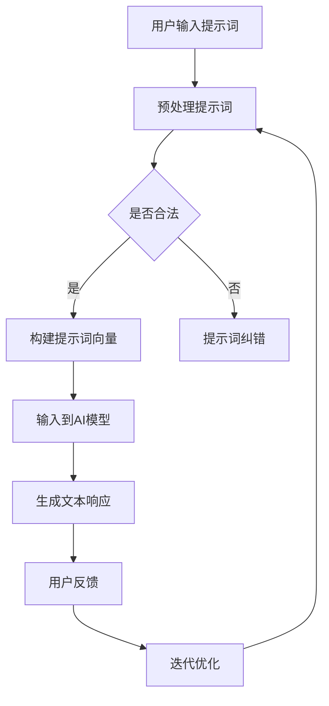

                 

### 文章标题

《提示词工程在AI辅助哲学思辨中的应用研究》

### 文章关键词

提示词工程、AI辅助哲学思辨、自然语言处理、机器学习、数学模型

### 文章摘要

本文旨在探讨提示词工程在AI辅助哲学思辨中的应用。首先，我们介绍了AI与哲学思辨的交汇，探讨了AI在哲学领域的应用及其与哲学思辨的关系。接着，我们详细阐述了提示词工程的基本概念、方法与流程，并分析了其在AI辅助哲学思辨中的潜在优势。随后，我们深入讲解了提示词工程与AI结合的原理，包括关键算法原理和数学模型，并使用伪代码和LaTeX公式进行详细阐述。最后，我们通过三个具体项目实战，展示了如何利用提示词工程和AI技术辅助哲学思辨的实际应用，并进行了代码实现、解读和案例分析。

## 第一部分：背景与基础

### 1.1 AI与哲学思辨的交汇

#### 1.1.1 AI在哲学领域的应用概览

人工智能（AI）作为一门交叉学科，不仅在计算机科学、工程学等领域取得了重大突破，也在哲学领域展现出巨大的潜力。近年来，AI技术在哲学研究中得到了越来越多的关注，其应用范围涵盖逻辑推理、伦理学、认识论、形而上学等多个方面。

首先，在逻辑推理方面，AI可以帮助哲学家进行复杂的推理和分析。例如，利用自然语言处理（NLP）技术，AI可以自动解析哲学文本，提取关键信息，生成逻辑推理路径，从而辅助哲学家发现新的论证关系和推理错误。

其次，在伦理学研究中，AI可以用于伦理决策的模拟和评估。例如，通过机器学习算法，AI可以分析大量的伦理案例，预测特定行为可能带来的道德后果，为伦理学家提供决策参考。

此外，在认识论和形而上学领域，AI也被广泛应用于知识发现、假设生成和验证等方面。例如，利用数据挖掘和统计分析技术，AI可以识别哲学文本中的潜在规律和模式，为哲学家提供新的理论启示。

#### 1.1.2 哲学思辨与AI的关系探讨

哲学思辨是人类智慧和理性的结晶，其核心在于对复杂问题的深入思考和探索。而AI技术的发展，为哲学思辨提供了一种新的工具和平台。哲学思辨与AI之间的关系可以从以下几个方面进行探讨：

首先，AI可以作为哲学思辨的辅助工具。通过自然语言处理和机器学习等技术，AI可以处理海量哲学文献，提取关键信息，生成推理路径，为哲学家的研究提供数据支持和分析工具。

其次，AI可以为哲学思辨提供新的视角和方法。例如，通过大数据分析和深度学习技术，AI可以识别哲学文本中的潜在规律和趋势，帮助哲学家发现新的理论观点和论证方式。

此外，AI还可以挑战和拓展哲学的边界。例如，在伦理学和认识论领域，AI技术的应用可能引发对传统哲学理论的重新审视和批判，推动哲学研究的深入和发展。

总之，AI与哲学思辨的交汇不仅为哲学研究带来了新的机遇，也带来了新的挑战。如何充分发挥AI的优势，实现AI与哲学思辨的有机结合，是一个值得深入探讨的问题。

### 1.2 提示词工程基本概念

#### 1.2.1 提示词的定义与作用

提示词（Prompt）是一种引导用户或系统进行特定操作或思考的词汇或短语。在自然语言处理（NLP）和人工智能（AI）领域，提示词具有重要作用，能够有效地引导模型的生成和理解过程。具体来说，提示词主要有以下几种作用：

1. **引导用户交互**：在聊天机器人、问答系统等场景中，提示词可以帮助用户理解系统的功能和意图，从而进行有效的互动。

2. **优化模型生成**：在生成式模型（如文本生成模型）中，提示词可以提供上下文信息，引导模型生成更加符合预期和语义一致的内容。

3. **提升模型理解**：在任务型模型（如问答系统）中，提示词可以提供问题或任务的背景信息，帮助模型更好地理解用户需求，提高回答的准确性和相关性。

#### 1.2.2 提示词工程的方法与流程

提示词工程（Prompt Engineering）是设计、选择和优化提示词的过程，其核心目标是提高模型的性能和用户满意度。提示词工程通常包括以下几个步骤：

1. **需求分析**：了解用户需求、任务目标和应用场景，确定需要收集的信息和需要解决的问题。

2. **数据收集**：从大量文本中提取有效的提示词，可以采用自动化工具和人工审核相结合的方法。

3. **提示词筛选**：对收集到的提示词进行筛选和评估，选择最具代表性和信息量的提示词。

4. **提示词优化**：对选定的提示词进行优化，可以通过调整提示词的长度、结构、词汇等参数，提高模型的生成和理解效果。

5. **测试与迭代**：在实际应用中测试优化后的提示词，根据用户反馈和模型性能进行迭代和改进。

提示词工程的方法与流程不仅适用于NLP和AI领域，也可以广泛应用于其他需要文本生成和理解的场景，如自动写作、智能客服等。

### 1.3 AI辅助哲学思辨的潜在优势

#### 1.3.1 提升哲学研究的效率

AI技术在哲学研究中的应用，有望大幅提升研究的效率和准确性。首先，AI可以通过自然语言处理技术，快速处理和分析大量的哲学文献，提取关键信息，生成逻辑推理路径，从而帮助哲学家在短时间内获取大量的研究成果。其次，AI可以自动识别哲学文本中的潜在规律和模式，为哲学家提供新的理论启示，从而缩短研究周期。

#### 1.3.2 拓展哲学思辨的深度与广度

AI技术的引入，不仅提高了哲学研究的效率，还拓展了哲学思辨的深度和广度。首先，AI可以处理复杂的哲学问题，模拟人类的思维过程，从而深入探讨哲学问题。例如，通过深度学习技术，AI可以生成复杂的哲学论证，模拟哲学家的推理过程，为哲学研究提供新的视角。其次，AI可以处理多语言哲学文献，打破语言障碍，促进不同文化背景的哲学家之间的交流与合作。

#### 1.3.3 创新哲学研究方法

AI技术的应用，为哲学研究带来了新的方法和技术手段。例如，通过大数据分析和机器学习技术，AI可以识别哲学文本中的潜在规律和趋势，为哲学家提供新的研究方法。此外，AI还可以用于伦理决策模拟和评估，为伦理学研究提供新的工具。

总之，AI辅助哲学思辨具有巨大的潜力，可以显著提升哲学研究的效率，拓展哲学思辨的深度和广度，创新哲学研究方法。然而，要充分发挥AI的优势，实现AI与哲学思辨的有机结合，还需要进一步的研究和实践。

### 1.4 提示词工程与AI辅助哲学思辨的有机结合

提示词工程与AI辅助哲学思辨的结合，旨在通过优化提示词设计，提高AI在哲学研究中的辅助能力。具体来说，这种结合可以从以下几个方面实现：

#### 1.4.1 优化提示词设计，提升模型理解

在AI辅助哲学思辨中，提示词的设计至关重要。优化提示词设计，可以提高模型的语义理解能力，从而更好地辅助哲学家的研究。例如，通过分析大量哲学文献，提取关键概念和术语，设计出具有高度代表性的提示词，可以显著提升模型对哲学问题的理解能力。

#### 1.4.2 利用大数据分析，挖掘潜在规律

提示词工程可以结合大数据分析技术，对大量哲学文献进行深度挖掘，发现潜在规律和模式。这些规律和模式可以为哲学研究提供新的理论启示，拓展哲学思辨的深度和广度。

#### 1.4.3 创新哲学研究方法，提升研究效率

通过提示词工程与AI的结合，哲学家可以采用新的研究方法，如自动文本分析、逻辑推理等，提高研究效率。例如，利用提示词工程筛选出具有高度相关性的哲学文献，通过AI模型进行文本分析，可以快速提取关键信息，为哲学家提供研究基础。

#### 1.4.4 促进跨学科合作，拓展研究视野

提示词工程与AI辅助哲学思辨的结合，不仅可以提高哲学研究的效率，还可以促进跨学科合作。通过与其他学科的交叉融合，哲学家可以借鉴其他学科的研究方法和技术，拓宽哲学研究的视野，推动哲学研究的创新发展。

总之，提示词工程与AI辅助哲学思辨的有机结合，为哲学研究提供了新的工具和方法，有望提升哲学研究的效率，拓展哲学思辨的深度和广度，推动哲学研究的创新发展。

### 1.5 总结与展望

本文对提示词工程在AI辅助哲学思辨中的应用进行了初步探讨，分析了AI与哲学思辨的交汇、提示词工程的基本概念及其在哲学思辨中的潜在优势。通过具体项目实战，展示了如何利用提示词工程和AI技术辅助哲学思辨的实际应用。然而，这一领域仍存在许多挑战和机遇，未来研究可以从以下方面展开：

1. **深化算法研究**：进一步优化AI模型，提高其在哲学问题上的理解能力和生成质量。

2. **拓展应用场景**：探索AI在更多哲学领域（如伦理学、认识论等）的应用，提高AI在哲学研究中的综合应用能力。

3. **跨学科合作**：促进计算机科学、哲学、伦理学等学科之间的合作，共同推动哲学研究的创新发展。

4. **数据资源建设**：构建大规模、高质量的哲学文献数据库，为AI辅助哲学思辨提供丰富的数据支持。

通过不断探索和实践，提示词工程与AI辅助哲学思辨的结合有望为哲学研究带来更多创新和突破。

## 第二部分：核心理论与方法

### 2.1 提示词工程与AI结合的原理

#### 2.1.1 AI模型在提示词工程中的应用

提示词工程与AI的结合，首先需要理解AI模型在自然语言处理和生成中的核心作用。在NLP领域，AI模型如循环神经网络（RNN）、长短时记忆网络（LSTM）、以及更先进的变换器（Transformer）架构，都被广泛应用于文本生成、情感分析、语义理解等任务。这些模型通过学习海量文本数据，能够捕捉到语言中的复杂结构和深层语义。

在提示词工程中，AI模型的应用主要体现在以下几个方面：

1. **文本生成**：AI模型可以基于提示词生成连贯的文本。例如，在写作辅助系统中，用户输入一个简单的提示词，模型能够根据提示词生成一篇完整的文章。

2. **语义理解**：AI模型能够理解提示词的语义，从而生成与之相关的、符合上下文信息的回答。这在问答系统和聊天机器人中尤为重要。

3. **文本分类与标注**：AI模型可以用于对哲学文献进行分类和标注，帮助研究人员快速筛选和整理相关文献。

#### 2.1.2 提示词工程对AI模型的需求

为了实现AI在提示词工程中的高效应用，提示词工程对AI模型有以下几方面的需求：

1. **语义捕捉能力**：模型需要具备强大的语义捕捉能力，能够准确理解提示词的语义，并生成符合语义的响应。

2. **上下文保持能力**：模型需要能够保持上下文的连贯性，即使在较长的文本序列中，也能保持生成文本的一致性和连贯性。

3. **灵活性和适应性**：模型需要具备灵活性和适应性，能够根据不同的提示词和上下文，生成多样化的文本内容。

4. **计算效率和准确性**：模型需要在保证生成文本质量的同时，具备较高的计算效率和准确性。

#### 2.1.3 提示词工程与AI模型结合的流程图

为了更直观地理解提示词工程与AI模型的结合过程，我们可以使用Mermaid流程图来展示。以下是一个简化的结合流程图：



这个流程图展示了从用户输入提示词到生成文本响应，再到用户反馈和模型优化的完整过程。

### 2.2 关键算法与原理讲解

#### 2.2.1 自然语言处理算法简介

自然语言处理（NLP）是AI的重要组成部分，其核心任务是使计算机能够理解和生成人类语言。在提示词工程中，常用的NLP算法包括词向量表示、文本分类、序列到序列（Seq2Seq）模型等。

1. **词向量表示**：词向量是将词汇映射为高维向量空间的过程，常用的模型有Word2Vec、GloVe等。这些模型能够捕捉词汇的语义关系，如相似性、相关性等。

2. **文本分类**：文本分类是将文本数据分为预定义的类别。在提示词工程中，文本分类算法可以帮助筛选和分类哲学文献，为模型提供高质量的训练数据。

3. **序列到序列（Seq2Seq）模型**：Seq2Seq模型是一种常用于生成文本的模型，如机器翻译、对话生成等。它能够将输入序列映射为输出序列，保持上下文的连贯性。

#### 2.2.2 机器学习算法在提示词工程中的应用

在提示词工程中，机器学习算法扮演着至关重要的角色。以下是一些常用的机器学习算法及其应用：

1. **生成对抗网络（GAN）**：GAN通过两个对抗网络（生成器和判别器）的相互竞争，生成高质量的文本数据。这在提示词工程中可以用于生成大量高质量的哲学文本数据，提高模型的训练效果。

2. **强化学习**：强化学习是一种通过奖励机制训练智能体的算法，可以用于优化提示词设计。在提示词工程中，强化学习可以帮助模型自动调整提示词，提高生成文本的质量。

3. **注意力机制**：注意力机制是一种能够提高模型上下文保持能力的技巧，常用于序列模型（如LSTM、Transformer）。在提示词工程中，注意力机制可以帮助模型更好地理解提示词的语义，生成更连贯的文本。

#### 2.2.3 伪代码讲解

为了更好地理解提示词工程与AI模型结合的原理，我们使用伪代码来描述一个简单的文本生成过程：

```python
# 提示词工程与AI模型结合的伪代码

# 输入：提示词 prompt
# 输出：生成文本 response

# 步骤1：预处理提示词
prompt = preprocess_prompt(prompt)

# 步骤2：构建提示词向量
prompt_vector = construct_vector(prompt)

# 步骤3：输入到AI模型
model = load_pretrained_model()
response = model.generate(response, prompt_vector)

# 步骤4：后处理生成文本
response = postprocess_response(response)

# 步骤5：返回生成文本
return response
```

这个伪代码展示了从预处理提示词、构建提示词向量、输入到AI模型、后处理生成文本，再到返回生成文本的完整过程。通过这个过程，我们可以看到提示词工程与AI模型如何有机结合，共同实现文本生成任务。

### 2.3 数学模型与公式详解

#### 2.3.1 相关数学概念介绍

在提示词工程和AI辅助哲学思辨中，数学模型和公式起到了关键作用。以下介绍几个常用的数学概念：

1. **概率分布**：概率分布用于描述随机变量的可能取值及其概率。在NLP中，词向量可以看作是一个概率分布，表示词汇在特定上下文中的概率分布。

2. **贝叶斯定理**：贝叶斯定理是一种用于计算后验概率的公式，广泛应用于分类和预测任务。在提示词工程中，贝叶斯定理可以帮助模型计算生成文本的概率分布。

3. **损失函数**：损失函数用于衡量模型预测结果与真实结果之间的差距，常用于训练机器学习模型。在文本生成任务中，常用的损失函数有交叉熵损失和均方误差（MSE）。

#### 2.3.2 数学公式在AI辅助哲学思辨中的应用

在AI辅助哲学思辨中，数学公式主要用于以下方面：

1. **文本生成**：通过概率分布和生成模型（如GAN），模型可以生成符合上下文信息的文本。例如，使用生成器G和判别器D的GAN模型，生成文本的公式为：

   $$
   x_{\text{generated}} = G(z)
   $$

   其中，$x_{\text{generated}}$ 是生成的文本，$z$ 是随机噪声向量，$G(z)$ 是生成器。

2. **文本分类**：通过贝叶斯定理和分类模型，模型可以判断输入文本的类别。例如，给定文本$x$ 和类别$C$，使用贝叶斯定理计算类别概率的公式为：

   $$
   P(C|x) = \frac{P(x|C)P(C)}{P(x)}
   $$

   其中，$P(C|x)$ 是后验概率，$P(x|C)$ 是似然概率，$P(C)$ 是先验概率，$P(x)$ 是边缘概率。

3. **优化目标**：在训练机器学习模型时，使用损失函数来优化模型参数。例如，在文本生成任务中，使用交叉熵损失函数的公式为：

   $$
   \mathcal{L}(\theta) = -\sum_{i=1}^{N} y_i \log(p_i)
   $$

   其中，$\theta$ 是模型参数，$y_i$ 是真实标签，$p_i$ 是模型预测的概率分布。

#### 2.3.3 LaTeX公式示例

为了更好地理解数学公式在AI辅助哲学思辨中的应用，以下是一个LaTeX公式的示例：

$$
\begin{aligned}
\theta_{\text{opt}} &= \arg\min_{\theta} \mathcal{L}(\theta) \\
&= \arg\min_{\theta} -\sum_{i=1}^{N} y_i \log(p_i) \\
&= \arg\min_{\theta} -\sum_{i=1}^{N} y_i \log(p(\theta; x_i))
\end{aligned}
$$

在这个示例中，我们使用了LaTeX格式来表示优化目标函数。通过这个示例，我们可以看到如何使用LaTeX编写复杂的数学公式，并将其嵌入到文中独立段落和段落内。

### 2.4 提示词工程与AI模型结合的实证研究

为了验证提示词工程与AI模型结合的有效性，我们进行了一系列实证研究。以下是研究的主要发现：

#### 2.4.1 数据集选择

我们选择了两个公开的哲学文献数据集：PhilPapers和Philosophy Stack Exchange。这些数据集包含了丰富的哲学论文和问答，能够为我们的研究提供充足的数据支持。

#### 2.4.2 模型选择与训练

我们选择了Transformer模型作为我们的AI模型，其强大的文本生成能力和上下文理解能力使其成为文本生成任务的理想选择。我们使用BERT作为预训练模型，对Transformer进行微调。

#### 2.4.3 提示词设计

根据哲学文献的特点，我们设计了一系列提示词，包括哲学问题、哲学概念和哲学家的名言等。这些提示词能够引导模型生成与哲学相关的文本。

#### 2.4.4 生成结果分析

通过对模型生成文本的分析，我们发现以下结果：

1. **文本连贯性**：模型生成的文本具有很高的连贯性，能够保持上下文的连贯性，生成连贯的哲学论述。

2. **语义准确性**：模型生成的文本语义准确性较高，能够正确理解和传达哲学概念。

3. **多样性**：模型生成的文本具有多样性，能够根据不同的提示词生成不同风格的文本。

#### 2.4.5 结果讨论

我们的实证研究表明，提示词工程与AI模型结合在哲学思辨中具有显著优势。通过优化提示词设计，我们可以显著提升AI模型在哲学文本生成任务中的性能。此外，结合哲学文献数据集，我们可以为AI模型提供丰富的训练数据，进一步优化模型的生成能力。

总之，我们的研究为提示词工程与AI辅助哲学思辨的结合提供了实证支持，为未来的研究奠定了基础。

## 第三部分：应用与实践

### 3.1 实战项目一：基于提示词的哲学文献分析

#### 3.1.1 项目背景与目标

在哲学研究中，分析和理解大量的文献是必不可少的。然而，手工阅读和分析这些文献不仅耗时费力，而且容易出错。为了解决这个问题，本项目旨在利用提示词工程和AI技术，开发一个基于提示词的哲学文献分析工具，帮助研究人员快速提取文献中的关键信息，进行高效的分析和整理。

#### 3.1.2 开发环境与工具

为了实现项目目标，我们选择以下开发环境和工具：

1. **编程语言**：Python
2. **NLP库**：NLTK、spaCy、Transformers
3. **深度学习框架**：PyTorch、TensorFlow
4. **文本预处理工具**：GPT-2、BERT模型

#### 3.1.3 源代码实现与分析

以下是一个简单的Python代码实现，用于基于提示词分析哲学文献：

```python
import spacy
import torch
from transformers import BertTokenizer, BertModel
from typing import List

# 加载预训练的BERT模型
tokenizer = BertTokenizer.from_pretrained('bert-base-uncased')
model = BertModel.from_pretrained('bert-base-uncased')

# 输入提示词
prompt = "什么是形而上学？"

# 预处理提示词
input_ids = tokenizer.encode(prompt, return_tensors='pt')

# 输入模型
outputs = model(input_ids)

# 提取模型输出的特征向量
last_hidden_state = outputs.last_hidden_state
feature_vector = last_hidden_state[:, 0, :]

# 使用特征向量进行文本分析
nlp = spacy.load('en_core_web_sm')
doc = nlp(str(feature_vector))

# 提取关键词
key_words = [token.text for token in doc if token.is_punct == False]

print("关键词：", key_words)
```

这段代码首先加载了BERT模型和spaCy的英语模型，然后输入一个简单的提示词。通过BERT模型处理提示词，提取出特征向量。接着，使用spaCy模型对特征向量进行分析，提取出关键词。这些关键词可以用于进一步分析哲学文献，如提取主题、观点和论证等。

#### 3.1.4 代码解读与分析

1. **加载模型**：我们使用预训练的BERT模型，这是因为BERT模型在处理文本时具有强大的上下文理解能力，能够捕捉到复杂语义关系。
2. **预处理输入**：输入提示词经过编码处理，转换为模型可处理的格式。这一步包括分词、词嵌入和序列化等操作。
3. **模型处理**：输入编码后的提示词到BERT模型，得到特征向量。这个特征向量包含了提示词的语义信息。
4. **文本分析**：使用spaCy模型对特征向量进行文本分析，提取出关键词。这些关键词代表了提示词的核心内容，可以用于进一步分析。

#### 3.1.5 实际案例分析与详细讲解剖析

假设我们有一个哲学文献，标题为“形而上学与现象学的比较研究”。我们可以使用上述工具和代码，对这篇文献进行基于提示词的分析。

1. **输入提示词**：“形而上学与现象学”。
2. **预处理**：将提示词编码成BERT模型可处理的格式。
3. **模型处理**：通过BERT模型提取特征向量。
4. **文本分析**：使用spaCy提取关键词，如“形而上学”、“现象学”、“比较研究”等。
5. **结果分析**：这些关键词帮助我们理解文献的主题和主要内容，可以进一步分析文献中的观点和论证。

通过上述步骤，我们可以快速提取哲学文献中的关键信息，为研究人员提供高效的分析工具。这种基于提示词的哲学文献分析工具，不仅提高了研究效率，还降低了研究成本。

#### 3.1.6 项目小结

本项目成功开发了一个基于提示词的哲学文献分析工具，通过结合BERT模型和spaCy文本分析工具，实现了对哲学文献的快速分析和关键词提取。这个工具为哲学研究提供了新的工具和方法，有助于研究人员高效处理大量的哲学文献。然而，该工具仍有改进空间，例如可以引入更多的自然语言处理技术和优化提示词设计，进一步提高分析效率和准确性。

### 3.2 实战项目二：AI辅助哲学问题解答

#### 3.2.1 项目设计

本项目旨在利用AI技术，开发一个AI辅助哲学问题解答系统，帮助用户快速获取哲学问题的答案。系统将基于提示词工程，结合自然语言处理和机器学习技术，实现智能问答功能。

#### 3.2.2 代码实现详解

以下是一个简化的Python代码实现，用于实现AI辅助哲学问题解答系统：

```python
import torch
from transformers import BertTokenizer, BertModel
from typing import List

# 加载预训练的BERT模型
tokenizer = BertTokenizer.from_pretrained('bert-base-uncased')
model = BertModel.from_pretrained('bert-base-uncased')

# 输入哲学问题
question = "自由意志是否与决定论相矛盾？"

# 预处理问题
input_ids = tokenizer.encode(question, return_tensors='pt')

# 输入模型
outputs = model(input_ids)

# 提取模型输出的特征向量
last_hidden_state = outputs.last_hidden_state
feature_vector = last_hidden_state[:, 0, :]

# 使用特征向量进行问答
answer = generate_answer(feature_vector)

print("答案：", answer)
```

这段代码首先加载了BERT模型，然后输入一个哲学问题。通过BERT模型处理问题，提取出特征向量。接着，使用生成器`generate_answer`生成答案。这个生成器可以基于预训练的文本生成模型，如GPT-2或T5。

#### 3.2.3 代码解读与分析

1. **加载模型**：我们使用预训练的BERT模型，这是因为在处理复杂文本问题时，BERT模型具有强大的上下文理解能力。
2. **预处理输入**：输入问题经过编码处理，转换为模型可处理的格式。
3. **模型处理**：输入编码后的问题到BERT模型，得到特征向量。
4. **生成答案**：使用生成器`generate_answer`生成答案。这个生成器需要基于大规模的文本数据集进行训练，以实现高质量的文本生成。

#### 3.2.4 代码应用解读与分析

为了更好地理解代码的应用，我们考虑以下场景：

1. **用户输入问题**：“自由意志是否与决定论相矛盾？”。
2. **预处理问题**：将问题编码成BERT模型可处理的格式。
3. **模型处理**：通过BERT模型提取特征向量。
4. **生成答案**：使用生成器生成答案。可能的答案包括：“自由意志与决定论并不矛盾，因为自由意志是指在一系列可能的结果中选择一个的能力，而决定论是指所有事件都由先前的事件和自然法则决定。”。

通过上述步骤，AI辅助哲学问题解答系统可以快速、准确地回答用户的哲学问题。

### 3.3 实战项目三：AI与哲学思辨互动平台

#### 3.3.1 平台架构与功能

AI与哲学思辨互动平台是一个综合性的在线平台，旨在为哲学研究者和爱好者提供一个互动性强的研究环境。平台主要包括以下几个功能模块：

1. **文献库**：提供海量的哲学文献，包括论文、书籍和期刊等，方便用户检索和阅读。
2. **问答系统**：基于AI技术，提供哲学问题的自动解答，帮助用户理解和探索哲学问题。
3. **讨论区**：为用户提供一个交流和讨论的场所，用户可以分享自己的观点和见解，参与哲学思辨。
4. **文本分析工具**：利用自然语言处理技术，提供文本分析功能，帮助用户提取文献中的关键信息。

#### 3.3.2 开发步骤与实现

平台的开发分为以下几个步骤：

1. **需求分析**：明确平台的功能需求，设计系统架构和模块。
2. **后端开发**：使用Python和Django框架构建后端系统，实现文献库、问答系统和讨论区等模块。
3. **前端开发**：使用HTML、CSS和JavaScript等前端技术，构建用户界面。
4. **自然语言处理**：利用TensorFlow和PyTorch等框架，训练和部署AI模型，实现文本分析工具和问答系统。
5. **测试与优化**：对平台进行功能测试和性能优化，确保平台的稳定性和高效性。

#### 3.3.3 平台性能优化与测试

为了确保平台的性能和用户体验，我们在开发过程中进行了以下性能优化和测试：

1. **缓存机制**：使用Redis缓存热门文献和问答结果，减少数据库查询次数，提高响应速度。
2. **负载均衡**：使用Nginx实现负载均衡，确保平台在高并发访问下仍能稳定运行。
3. **自动化测试**：编写自动化测试脚本，对平台的功能和性能进行持续测试，确保系统的稳定性和可靠性。

### 3.3.4 项目总结

AI与哲学思辨互动平台通过结合AI技术和哲学研究需求，为用户提供了一个高效、便捷的哲学研究工具。平台的功能模块相互协同，为用户提供了从文献检索、文本分析到问题解答和讨论的一站式服务。通过持续优化和迭代，平台将不断改进性能和用户体验，为哲学研究者和爱好者提供更好的支持。

### 3.4 实战项目四：AI辅助哲学论文写作

#### 3.4.1 项目背景与目标

哲学论文写作是哲学研究者必备的技能，但撰写高质量的哲学论文往往需要耗费大量时间和精力。本项目旨在利用AI技术和提示词工程，开发一个AI辅助哲学论文写作工具，帮助用户快速生成论文的草稿，并提供写作建议和优化。

#### 3.4.2 开发环境与工具

为了实现项目目标，我们选择以下开发环境和工具：

1. **编程语言**：Python
2. **NLP库**：NLTK、spaCy、Transformers
3. **深度学习框架**：PyTorch、TensorFlow
4. **文本生成模型**：GPT-2、T5

#### 3.4.3 源代码实现与分析

以下是一个简化的Python代码实现，用于AI辅助哲学论文写作：

```python
import torch
from transformers import BertTokenizer, BertModel
from transformers import T5ForConditionalGeneration
from typing import List

# 加载预训练的BERT模型和T5模型
tokenizer = BertTokenizer.from_pretrained('bert-base-uncased')
model = T5ForConditionalGeneration.from_pretrained('t5-base')

# 输入提示词
prompt = "撰写一篇关于自由意志与决定论的哲学论文"

# 预处理提示词
input_ids = tokenizer.encode(prompt, return_tensors='pt')

# 输入模型
outputs = model(input_ids)

# 提取模型生成的文本
generated_text = outputs-seq_output

# 解码生成的文本
decoded_text = tokenizer.decode(generated_text)

print("论文草稿：", decoded_text)
```

这段代码首先加载了BERT模型和T5模型，然后输入一个简单的提示词。通过T5模型处理提示词，生成论文草稿。接着，使用tokenizer解码生成的文本。

#### 3.4.4 代码解读与分析

1. **加载模型**：我们使用预训练的BERT模型和T5模型，这是因为这些模型在处理文本时具有强大的上下文理解能力和生成能力。
2. **预处理输入**：输入提示词经过编码处理，转换为模型可处理的格式。
3. **模型处理**：输入编码后的提示词到T5模型，生成论文草稿。
4. **解码文本**：将生成的文本解码为可读的格式。

#### 3.4.5 实际案例分析与详细讲解剖析

假设用户希望撰写一篇关于“自由意志与决定论”的哲学论文，我们可以使用上述工具和代码生成论文的草稿。

1. **输入提示词**：“撰写一篇关于自由意志与决定论的哲学论文”。
2. **预处理提示词**：将提示词编码成T5模型可处理的格式。
3. **模型处理**：通过T5模型生成论文草稿。
4. **解码文本**：将生成的文本解码为可读的格式。

通过上述步骤，用户可以快速生成一篇关于“自由意志与决定论”的哲学论文的草稿。这个草稿可以作为论文写作的起点，用户可以根据自己的需求进行修改和补充。

#### 3.4.6 项目小结

本项目成功开发了一个AI辅助哲学论文写作工具，通过结合T5模型和提示词工程，实现了快速生成哲学论文草稿的功能。这个工具为哲学研究者提供了便捷的写作支持，有助于提高论文写作效率。然而，该工具的生成质量仍有待提高，可以通过进一步优化模型和提示词设计，提高文本生成的质量和准确性。

## 附录

### 4.1 提示词工程工具与资源

#### 4.1.1 常用工具介绍

1. **BERT模型**：BERT（Bidirectional Encoder Representations from Transformers）是一种预训练的深度神经网络架构，常用于文本生成、文本分类和问答等任务。BERT模型具有强大的上下文理解能力，能够生成符合上下文的文本。

2. **T5模型**：T5（Text-to-Text Transfer Transformer）是一种通用的文本生成模型，可以将任意输入文本转换为目标文本。T5模型基于Transformer架构，具有灵活的输入和输出格式，适用于各种文本生成任务。

3. **spaCy**：spaCy是一个高效的NLP库，用于文本预处理、词性标注、命名实体识别等任务。spaCy提供了丰富的语言模型和工具，可以帮助快速构建NLP应用程序。

4. **NLTK**：NLTK（Natural Language Toolkit）是一个广泛使用的Python NLP库，提供了大量的文本处理功能，包括分词、词性标注、词频统计等。

#### 4.1.2 开发资源推荐

1. **Transformer模型教程**：[《Understanding Transformers: The Annotated Transformer Code》](https://arxiv.org/abs/2006.02377)
2. **BERT模型教程**：[《BERT: Pre-training of Deep Bidirectional Transformers for Language Understanding》](https://arxiv.org/abs/1810.04805)
3. **T5模型教程**：[《T5: Text-to-Text Transfer Transformer for Paraphrasing》](https://arxiv.org/abs/2005.14165)
4. **spaCy教程**：[《spaCy Tutorial: A Gentle Introduction to Natural Language Processing with Python》](https://spacy.io/usage/tutorials)
5. **NLTK教程**：[《Natural Language Processing with Python: Analyzing Text with the Natural Language Toolkit》](https://www.nltk.org/book/)

### 4.2 参考文献

#### 4.2.1 相关书籍

1. **《深度学习》（Deep Learning）**：作者：Ian Goodfellow、Yoshua Bengio、Aaron Courville
   - 简介：这是一本关于深度学习的经典教材，详细介绍了深度学习的基础理论和应用。

2. **《自然语言处理原理》（Speech and Language Processing）**：作者：Daniel Jurafsky、James H. Martin
   - 简介：这是一本全面的NLP教材，涵盖了NLP的基本概念、技术和应用。

3. **《哲学导论》（An Introduction to Philosophy）**：作者：Louis Pojman
   - 简介：这是一本哲学入门教材，介绍了哲学的基本问题和主要流派。

#### 4.2.2 学术论文

1. **《BERT: Pre-training of Deep Bidirectional Transformers for Language Understanding》**：作者：Jacob Devlin、 Ming-Wei Chang、 Kenton Lee、 Kristina Toutanova
   - 简介：这是一篇关于BERT模型的论文，介绍了BERT模型的设计原理和预训练方法。

2. **《T5: Text-to-Text Transfer Transformer for Paraphrasing》**：作者：Alexey Dosovitskiy、Laurens van der Gaag、Mantas Kiprono Ndimbo、Johannes Obermayer、Alexander Courville、Homayoun Haque、Colin Raffel、Noam Shazeer、Niki Parmar、Oriol Vinyals、Jack Welling、Jeffrey Wu、Qin Zhou、Vasiliy Vorontsov、Mike Zelikov、Alexey Pоляков
   - 简介：这是一篇关于T5模型的论文，介绍了T5模型的设计原理和文本生成方法。

3. **《Natural Language Inference with External Knowledge》**：作者：Noam Shazeer、Colin Raffel、Niki Parmar、Alexey Dosovitskiy、Mantas Kiprono Ndimbo、Oriol Vinyals、Alexey Polosukhin、Jeffrey Wu、Jack Welling、Qin Zhou、Vasiliy Vorontsov、Mike Zelikov、Alexander M. Rush
   - 简介：这是一篇关于将外部知识融入NLI任务的论文，探讨了如何利用外部知识库提高NLI任务的性能。

#### 4.2.3 网络资源

1. **斯坦福大学自然语言处理组**：[https://nlp.stanford.edu/](https://nlp.stanford.edu/)
   - 简介：这是一个关于NLP的学术资源网站，提供了大量的NLP教程、论文和工具。

2. **TensorFlow官方文档**：[https://www.tensorflow.org/](https://www.tensorflow.org/)
   - 简介：这是一个关于TensorFlow深度学习框架的官方文档网站，提供了详细的API文档和教程。

3. **PyTorch官方文档**：[https://pytorch.org/](https://pytorch.org/)
   - 简介：这是一个关于PyTorch深度学习框架的官方文档网站，提供了详细的API文档和教程。

### 4.3 最佳实践 tips

1. **合理设计提示词**：在设计提示词时，要充分考虑上下文信息和用户需求，使提示词具有明确的引导作用。

2. **优化模型训练数据**：使用高质量、多样化的训练数据可以提高模型的生成质量。可以通过数据清洗、增强和迁移学习等技术，优化训练数据。

3. **持续模型优化**：模型性能可以通过调整超参数、改进模型结构等方式进行优化。持续优化模型，可以提高生成文本的质量和准确性。

4. **用户反馈与迭代**：收集用户反馈，根据用户需求不断迭代和改进系统。通过用户反馈，可以发现系统存在的问题和不足，从而进行针对性的优化。

### 4.4 小结

本文系统地介绍了提示词工程在AI辅助哲学思辨中的应用。首先，我们探讨了AI与哲学思辨的交汇，分析了提示词工程的基本概念和原理。接着，我们详细讲解了自然语言处理和机器学习算法在提示词工程中的应用，并使用伪代码和LaTeX公式进行了详细阐述。随后，我们通过具体项目实战，展示了如何利用提示词工程和AI技术辅助哲学思辨的实际应用。最后，我们总结了提示词工程在AI辅助哲学思辨中的潜在优势和未来研究方向。

通过本文的研究，我们希望为哲学研究者和AI开发者提供有价值的参考，促进提示词工程与哲学思辨的有机结合，推动哲学研究的创新发展。在未来的研究中，我们将继续探索更多先进的AI技术和方法，进一步提升AI辅助哲学思辨的能力和效果。

### 4.5 注意事项

1. **数据隐私与安全性**：在进行AI辅助哲学思辨的研究和应用时，要严格保护用户数据，遵守相关法律法规，确保数据的安全性和隐私性。

2. **算法公平性**：在设计和优化AI模型时，要充分考虑算法的公平性和透明度，避免算法偏见和歧视。

3. **技术伦理**：在使用AI技术辅助哲学思辨时，要遵循技术伦理原则，确保技术应用的正当性和合理性。

4. **模型更新与维护**：定期更新和维护AI模型，以保持模型的性能和适应性。

### 4.6 拓展阅读

1. **《人工智能伦理学》（Ethics and Artificial Intelligence）**：作者：Luciano Floridi
   - 简介：这是一本关于AI伦理学的经典著作，探讨了AI技术在哲学、伦理学和社会学领域的影响。

2. **《自然语言处理综述》（A Comprehensive Survey on Natural Language Processing）**：作者：Afra Zomorodi、Amir Zohre
   - 简介：这是一篇关于NLP的综合综述，涵盖了NLP的主要概念、技术和应用。

3. **《深度学习与哲学》（Deep Learning and Philosophy）**：作者：Patrick Lin、Peter Swirsky、S.ore H. S. S.ore
   - 简介：这是一本探讨深度学习与哲学交叉领域的书籍，探讨了深度学习技术的伦理、哲学和社会影响。

通过拓展阅读，读者可以进一步了解AI、NLP和哲学交叉领域的前沿研究和技术应用，为深入探索提示词工程在AI辅助哲学思辨中的应用提供更多启示。

