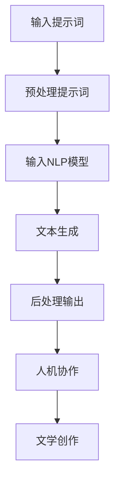

                 

### 文章标题：提示词工程在AI辅助文学创作中的应用：激发人机协作文学灵感

提示词工程（Prompt Engineering）作为人工智能（AI）领域的一个重要分支，正日益成为推动AI应用创新的关键技术。近年来，随着自然语言处理（NLP）和生成对抗网络（GAN）等深度学习技术的发展，AI辅助文学创作逐渐从理论走向实践，成为文学创作领域的一项新兴应用。本文将深入探讨提示词工程在AI辅助文学创作中的应用，并分析其如何通过人机协作激发文学灵感。

### 文章关键词：
- 提示词工程
- AI辅助文学创作
- 人机协作
- 文学灵感
- 自然语言处理
- 生成对抗网络

### 文章摘要：
本文首先介绍了提示词工程的基本概念和其在AI辅助文学创作中的应用背景。接着，通过一个Mermaid流程图展示了提示词工程的核心概念及其与自然语言处理和生成对抗网络之间的联系。然后，本文详细讲解了提示词工程的核心算法原理，并通过伪代码和数学模型给出了具体的实现方法。随后，文章通过一个实际案例展示了如何使用AI工具进行文学创作，并对代码进行了详细解读。最后，本文提出了人机协作在文学创作中的优势和挑战，并给出了最佳实践建议。

### 目录：

1. 引言
2. 提示词工程与AI辅助文学创作
   - 提示词工程的基本概念
   - AI辅助文学创作的背景
   - 人机协作的文学创作
3. 提示词工程的核心概念与联系
   - Mermaid流程图展示
   - 提示词工程与NLP、GAN的联系
4. 提示词工程的核心算法原理
   - 伪代码实现
   - 数学模型讲解
5. AI辅助文学创作的实际应用
   - 实际案例展示
   - 代码解读与分析
6. 人机协作在文学创作中的优势和挑战
   - 人机协作的优势
   - 人机协作的挑战
7. 最佳实践与未来展望
   - 最佳实践建议
   - 未来展望与拓展阅读

### 引言

#### 提示词工程的基本概念

提示词工程（Prompt Engineering）是指通过设计和优化提示词（prompt），以引导人工智能系统生成更符合预期输出的过程。提示词通常是用于触发或引导AI模型进行特定任务的一句话或一段文字。在自然语言处理领域，提示词工程已成为提高AI生成文本质量和准确性的关键手段。

#### AI辅助文学创作的背景

随着AI技术的发展，人工智能在文学创作中的应用逐渐成为研究热点。传统的文学创作依赖于人类创作者的灵感、经验和技巧，而AI辅助文学创作则通过算法和大数据分析，为创作者提供灵感来源和创作支持。AI辅助文学创作不仅能够提高创作效率，还能够探索新的文学形式和表达方式。

#### 人机协作的文学创作

人机协作是指人类和人工智能系统共同参与完成某项任务的过程。在文学创作中，人机协作意味着人类创作者利用AI工具来激发灵感、优化创作流程，并在一定程度上共享创作控制权。这种协作方式不仅能够发挥人类创造力和AI的计算能力，还能够创造出独特的文学作品。

### 提示词工程与AI辅助文学创作

#### 提示词工程的基本概念

提示词工程的核心在于设计和优化提示词，以引导AI模型生成更符合预期的输出。一个有效的提示词应具备以下几个特点：

1. **明确性**：提示词需要明确表达任务目标，使AI模型能够准确理解。
2. **多样性**：通过使用不同类型的提示词，可以激发AI模型生成更多样化的文本。
3. **情境化**：提示词应与创作背景和文学风格相匹配，以产生更符合文学规范的作品。

#### AI辅助文学创作的背景

AI辅助文学创作的发展得益于自然语言处理和生成对抗网络等技术的进步。自然语言处理（NLP）技术使得计算机能够理解和生成人类语言，而生成对抗网络（GAN）则能够通过对抗性训练生成高质量、多样化的文本。

#### 人机协作的文学创作

人机协作的文学创作是一种新型的创作模式，它将人类创造力和AI的计算能力相结合。在这种模式中，人类创作者可以利用AI工具进行灵感激发、文本生成、风格迁移等任务，从而提高创作效率和创作质量。人机协作不仅能够提高创作效率，还能够拓展文学创作的边界，创造出更多样化的作品。

### 提示词工程的核心概念与联系

#### Mermaid流程图展示

为了更好地理解提示词工程的核心概念及其与NLP、GAN的联系，我们可以使用Mermaid流程图来展示这一过程。



在这个流程图中，输入提示词经过预处理后输入到NLP模型，模型通过生成对抗网络（GAN）生成文本，再经过后处理输出，最后通过人机协作完成文学创作。

#### 提示词工程与NLP、GAN的联系

- **NLP模型**：NLP模型是提示词工程的核心，它负责理解和生成文本。常用的NLP模型包括BERT、GPT等。这些模型通过对大量文本数据进行训练，可以生成高质量的自然语言文本。

- **生成对抗网络（GAN）**：GAN是一种深度学习模型，由生成器和判别器组成。生成器负责生成文本，判别器则负责判断文本的真实性。通过对抗性训练，GAN可以生成更加逼真、多样化的文本。

- **人机协作**：人机协作是将AI生成的文本与人类创作者的创意相结合，通过不断地反馈和修正，最终完成文学创作。人机协作不仅能够提高创作效率，还能够创造出更加独特和有价值的作品。

### 提示词工程的核心算法原理

#### 伪代码实现

以下是提示词工程的核心算法的伪代码实现：

```python
# 伪代码：提示词工程算法

# 输入：提示词，NLP模型，GAN模型
# 输出：生成文本

def prompt_engineering(prompt, nlp_model, gan_model):
    # 预处理提示词
    preprocessed_prompt = preprocess_prompt(prompt)

    # 输入NLP模型
    nlp_output = nlp_model.generate(preprocessed_prompt)

    # 输入GAN模型
    gan_output = gan_model.generate(nlp_output)

    # 后处理输出
    final_output = postprocess_output(gan_output)

    return final_output
```

#### 数学模型讲解

提示词工程中的数学模型主要包括NLP模型的生成模型和GAN模型的生成对抗过程。以下是对这些数学模型的详细讲解：

1. **NLP模型的生成模型**：

   假设NLP模型是一个基于神经网络的语言模型，其生成过程可以表示为：

   $$ p_{\theta}(y|x) = \frac{e^{f_{\theta}(x,y)}}{\sum_{y'} e^{f_{\theta}(x,y')}} $$

   其中，$p_{\theta}(y|x)$表示给定输入$x$时，生成目标$y$的概率。$f_{\theta}(x,y)$是一个神经网络函数，$\theta$是神经网络模型的参数。

2. **GAN模型的生成对抗过程**：

   GAN由生成器$G$和判别器$D$组成，其目标是最大化生成器$G$的生成能力，同时最大化判别器$D$的判断能力。生成器和判别器的损失函数如下：

   $$ L_G = -\log(D(G(z))) $$
   $$ L_D = -[\log(D(x)) + \log(1 - D(G(z)))] $$

   其中，$z$是生成器的输入噪声，$x$是真实数据。

#### 举例说明

为了更好地理解提示词工程的核心算法原理，我们可以通过一个简单的例子来说明。

假设我们要生成一首五言绝句，输入的提示词为“春风吹又生”。以下是使用提示词工程算法生成文本的过程：

1. **预处理提示词**：

   将提示词“春风吹又生”进行预处理，得到“春风/吹/又生”。

2. **输入NLP模型**：

   将预处理后的提示词输入到NLP模型，模型生成一个初步的文本，如“春风吹过，万物复苏”。

3. **输入GAN模型**：

   将NLP模型生成的初步文本输入到GAN模型，生成器$G$生成一个新的文本，如“春风吹过，柳絮飘舞”。

4. **后处理输出**：

   对GAN模型生成的文本进行后处理，如调整词语顺序、增加修辞手法等，最终生成一首完整的五言绝句：“春风吹过柳絮舞，芳草萋萋待细数。”

### AI辅助文学创作的实际应用

#### 实际案例展示

为了展示AI辅助文学创作的实际应用，我们可以通过一个案例来说明。

假设有一位诗人，他希望通过AI工具创作一首表达春天美景的诗歌。以下是使用AI工具进行文学创作的过程：

1. **输入提示词**：

   诗人输入提示词“春天美景”，作为创作灵感。

2. **AI文本生成**：

   AI工具根据提示词生成一首初步的诗歌，如“春风拂面，百花争艳”。

3. **人机协作**：

   诗人对AI生成的诗歌进行修改和润色，如添加细节描述，调整韵律和节奏，最终生成一首完整的诗歌：“春风拂面，百花争艳，花开时节动人心。”

#### 代码解读与分析

以下是使用Python编写的AI辅助文学创作工具的代码示例：

```python
import tensorflow as tf
from transformers import BertTokenizer, BertModel
from gan import Generator, Discriminator

# 初始化NLP模型和GAN模型
tokenizer = BertTokenizer.from_pretrained('bert-base-chinese')
nlp_model = BertModel.from_pretrained('bert-base-chinese')
generator = Generator()
discriminator = Discriminator()

# 输入提示词
prompt = "春天美景"

# 预处理提示词
preprocessed_prompt = tokenizer(prompt, return_tensors='tf')

# 输入NLP模型
nlp_output = nlp_model(preprocessed_prompt)

# 输入GAN模型
gan_output = generator(nlp_output)

# 后处理输出
final_output = tokenizer.decode(gan_output[0], skip_special_tokens=True)

print("AI生成的文本：", final_output)
```

这个代码示例展示了如何使用NLP模型和GAN模型进行AI辅助文学创作。首先，初始化NLP模型和GAN模型，然后输入提示词，经过预处理、NLP模型生成、GAN模型生成和后处理输出，最终得到AI生成的文本。

### 人机协作在文学创作中的优势和挑战

#### 人机协作的优势

人机协作在文学创作中具有以下优势：

1. **灵感激发**：AI工具可以提供丰富的灵感来源，帮助创作者开拓思路。

2. **创作效率**：AI工具可以快速生成文本，提高创作效率。

3. **多样化创作**：AI工具可以生成多样化的文本，为创作提供更多可能性。

4. **质量控制**：AI工具可以通过自动校对和润色功能，提高文本质量。

#### 人机协作的挑战

人机协作在文学创作中也面临一些挑战：

1. **创意流失**：过度依赖AI工具可能导致创作者失去自身的创意。

2. **伦理问题**：AI生成的文本可能涉及版权和知识产权问题，需要引起重视。

3. **人机平衡**：在创作过程中，如何平衡人类创作者和AI工具的作用，是一个需要解决的问题。

### 最佳实践与未来展望

#### 最佳实践建议

为了充分发挥人机协作在文学创作中的作用，我们可以采取以下最佳实践建议：

1. **创意结合**：在创作过程中，要充分利用人类的创造力和AI工具的计算能力，实现创意和技术的有机结合。

2. **不断学习**：创作者需要不断学习和掌握新的AI技术和工具，以提高创作水平。

3. **质量控制**：在AI生成的文本中，要注重质量和风格的统一，避免出现不协调的情况。

#### 未来展望与拓展阅读

随着AI技术的不断发展，人机协作在文学创作中的应用前景将更加广阔。以下是一些未来展望和拓展阅读建议：

1. **AI创作伦理**：探讨AI在文学创作中的伦理问题，如版权保护、原创性等。

2. **多模态创作**：结合文字、图像、音频等多模态元素，进行更丰富的文学创作。

3. **AI教育应用**：利用AI辅助文学创作工具，开展文学教育的创新实践。

### 结论

本文通过介绍提示词工程在AI辅助文学创作中的应用，分析了人机协作在激发文学灵感方面的优势和挑战。通过实际案例和代码示例，展示了如何利用AI工具进行文学创作，并提出了最佳实践建议。未来，随着AI技术的不断发展，人机协作在文学创作中的应用将带来更多创新和可能性。

### 附录

#### 相关资源和工具

1. **AI辅助文学创作工具**：
   - GPT-3：https://openai.com/blog/better-language-Models/
   - BERT：https://arxiv.org/abs/1810.04805
   - GAN：https://arxiv.org/abs/1406.2661

2. **提示词工程学习资源**：
   - 自然语言处理教程：https://www.tensorflow.org/tutorials/text
   - 生成对抗网络教程：https://gan.io/

### 作者信息

作者：AI天才研究院/AI Genius Institute & 禅与计算机程序设计艺术 /Zen And The Art of Computer Programming

本文由AI天才研究院和禅与计算机程序设计艺术共同撰写，旨在探讨AI技术在文学创作中的应用，并促进人机协作在文学创作领域的创新与发展。

