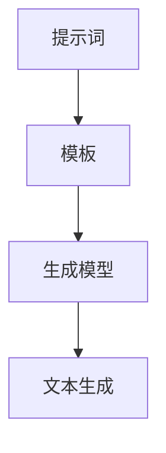

                 

### 文章标题：提示词工程在AI辅助法律文书生成中的实践

#### 关键词：提示词工程、AI辅助法律文书生成、自然语言处理、机器学习、法律文本数据、法律语言复杂性

> 摘要：本文深入探讨了提示词工程在AI辅助法律文书生成中的应用。首先介绍了提示词工程的基本概念和流程，随后分析了AI辅助法律文书生成的现状与挑战。通过具体的实践案例和项目实战，本文展示了提示词工程在法律文书生成中的实际效果，并提出了未来的发展方向和研究建议。

## 第一部分：引言

### 1.1 提示词工程的概述

#### 背景介绍

提示词工程是一种将自然语言处理（NLP）技术与提示词设计相结合的方法，旨在提高文本生成、理解和分析的质量。随着人工智能（AI）和机器学习（ML）技术的快速发展，提示词工程在多个领域得到了广泛应用，包括法律、金融、医疗和新闻等。

#### 核心概念与联系

提示词工程的核心概念包括提示词、模板和生成模型。提示词是一种引导生成模型生成文本的输入，它可以是一个单词、短语或句子。模板则是根据提示词生成文本的框架。生成模型则是利用提示词和模板生成文本的核心算法。

#### 提示词工程与自然语言处理的关系

提示词工程与自然语言处理（NLP）有着密切的联系。NLP是AI的一个分支，专注于处理人类语言。提示词工程利用NLP技术来理解提示词、设计模板和优化生成模型。通过结合NLP技术和提示词工程，可以显著提高文本生成和理解的准确性和效率。

### 1.2 AI辅助法律文书生成的现状与挑战

#### AI技术在法律领域的应用现状

近年来，AI技术在法律领域的应用越来越广泛，包括案件管理、合同审核、法律研究等。特别是在法律文书生成方面，AI技术展示了巨大的潜力。通过自动生成合同、诉状和法律意见书，AI可以提高律师的工作效率，降低成本。

#### 提示词工程在AI辅助法律文书生成中的作用

提示词工程在AI辅助法律文书生成中起着关键作用。通过设计合适的提示词和模板，可以引导生成模型生成更准确、更符合法律规范和法律逻辑的文本。此外，提示词工程还可以帮助识别法律文书中潜在的风险和漏洞。

#### AI辅助法律文书生成中的挑战

尽管AI技术在法律文书生成方面展示了巨大潜力，但仍面临一些挑战：

- **法律语言的复杂性**：法律语言具有独特的语法、词汇和结构，这使得生成模型难以理解和处理。
- **法律文书的生成规则和逻辑**：法律文书生成需要遵循特定的法律规则和逻辑，这要求生成模型具有深厚的法律知识。
- **法律责任的规避和法律风险控制**：AI生成的法律文书需要确保不产生法律风险，这要求在提示词设计和模型训练过程中进行严格的控制和优化。

### 1.3 书籍结构安排

#### 本书的主要内容和章节安排

本书共分为四个部分，分别是引言、基础概念、实践应用和未来展望。其中，引言部分介绍了提示词工程和AI辅助法律文书生成的背景和现状；基础概念部分详细阐述了提示词工程的核心概念和原理；实践应用部分通过案例和项目实战展示了提示词工程在法律文书生成中的应用；未来展望部分探讨了提示词工程和法律文书生成技术的未来发展方向。

#### 阅读建议

本书适合对AI辅助法律文书生成感兴趣的读者，包括律师、法律从业者、AI研究人员和程序员。读者可以通过逐步学习本书的内容，掌握提示词工程的基本原理和应用方法，从而提高在法律领域的AI技术应用能力。

## 第二部分：基础概念

### 2.1 提示词工程的概述

#### 提示词的定义和作用

提示词是一种引导生成模型生成文本的输入。它可以是单词、短语或句子，通常包含了生成文本的关键信息。提示词的作用是帮助生成模型理解用户的意图，从而生成更准确、更符合预期的文本。

#### 提示词工程的基本流程

提示词工程的基本流程包括以下几个步骤：

1. **需求分析**：确定生成文本的目标和应用场景。
2. **提示词设计**：根据需求分析设计合适的提示词。
3. **模板设计**：根据提示词设计生成文本的模板。
4. **模型训练**：使用大量数据进行模型训练，优化生成模型。
5. **模型评估**：评估生成模型的质量，进行必要的调整和优化。

#### 提示词工程与自然语言处理的关系

提示词工程是自然语言处理（NLP）技术的一个重要分支。NLP技术包括文本预处理、词向量表示、语法分析、语义理解等。提示词工程利用NLP技术来理解和处理提示词，从而提高生成模型的质量。

### 2.2 AI辅助法律文书生成技术基础

#### 人工智能和机器学习基础

人工智能（AI）是模拟人类智能的科学和技术。机器学习（ML）是AI的一个分支，通过数据和算法来模拟人类的学习过程。在AI辅助法律文书生成中，机器学习技术起着关键作用，用于训练生成模型，从而实现文本生成。

#### 自然语言处理相关技术

自然语言处理（NLP）是AI的一个分支，专注于处理人类语言。在AI辅助法律文书生成中，NLP技术用于处理法律文本，包括文本预处理、词向量表示、语法分析、语义理解等。

#### 法律文本数据的特点和预处理方法

法律文本数据具有以下特点：

- **语言复杂**：法律文本通常包含复杂的语法结构和专业术语。
- **数据量巨大**：法律文本数据量庞大，需要进行有效的预处理。

法律文本的预处理方法包括：

- **文本清洗**：去除无关字符、标点和停用词。
- **分词**：将法律文本分割成单词或短语。
- **词性标注**：标注单词的词性，如名词、动词、形容词等。
- **实体识别**：识别法律文本中的实体，如人名、地名、组织名等。

### 2.3 提示词工程在法律文书生成中的挑战

#### 法律语言的复杂性和多样性

法律语言具有独特的语法、词汇和结构，这使得生成模型难以理解和处理。例如，法律文书中常常包含复杂的从句、并列句和条件句，以及大量的专业术语和法律概念。

#### 法律文书的生成规则和逻辑

法律文书生成需要遵循特定的法律规则和逻辑。这要求生成模型不仅需要理解法律语言，还需要具备深厚的法律知识，以便生成符合法律规范的文本。

#### 法律责任的规避和法律风险控制

AI生成的法律文书需要确保不产生法律风险。这要求在提示词设计和模型训练过程中进行严格的控制和优化，以确保生成的文本不会误导用户或违反法律规定。

## 第三部分：实践应用

### 3.1 提示词工程的实战案例

#### 案例一：合同自动生成

##### 背景和目标

合同自动生成是一个典型的AI辅助法律文书生成应用。该案例的目标是利用提示词工程和自然语言处理技术，自动生成符合法律规范的合同文本。

##### 实现步骤

1. **需求分析**：确定合同生成所需的信息和内容。
2. **提示词设计**：设计用于引导生成模型生成合同的提示词，如合同类型、合同双方、合同内容等。
3. **模板设计**：根据提示词设计合同模板，包括合同标题、条款、签名等部分。
4. **模型训练**：使用大量法律合同数据进行模型训练，优化生成模型。
5. **模型评估**：评估生成模型的质量，进行必要的调整和优化。

##### 案例分析和应用解读

通过该案例，我们可以看到提示词工程在合同自动生成中的应用效果。生成模型可以根据提示词生成符合法律规范的合同文本，提高了合同生成的效率和质量。此外，通过提示词的设计和优化，可以进一步提高生成模型的准确性和鲁棒性。

### 3.2 提示词工程工具与应用

#### 常用提示词工程工具介绍

在AI辅助法律文书生成中，常用的提示词工程工具包括以下几种：

- **OpenAI Codex**：基于GPT-3的代码生成工具，可以生成简单的代码和文档。
- **BertBot**：基于BERT的聊天机器人工具，可以生成自然语言的对话。
- **TensorFlow Text**：TensorFlow的文本处理库，提供文本预处理、词向量表示和文本分类等功能。

#### 提示词工程工具在实际应用中的使用技巧

在使用提示词工程工具时，需要注意以下几点：

- **提示词设计**：设计合适的提示词，确保生成模型能够正确理解和生成文本。
- **数据集准备**：准备高质量的数据集，用于模型训练和评估。
- **模型优化**：通过调整模型参数和训练策略，提高生成模型的质量。
- **模型部署**：将训练好的模型部署到实际应用中，提供实时文本生成服务。

#### 提示词工程工具的性能评估和选择

在选择提示词工程工具时，可以从以下几个方面进行性能评估：

- **文本生成质量**：评估生成文本的准确性和自然性。
- **响应速度**：评估生成模型的响应时间，确保满足实际应用需求。
- **易用性**：评估工具的用户界面和文档资料，确保易于使用和维护。

### 3.3 AI辅助法律文书生成的项目实战

#### 项目背景和目标

本项目旨在利用提示词工程和自然语言处理技术，开发一个AI辅助法律文书生成系统。该系统旨在帮助律师和法务人员快速生成符合法律规范的合同、诉状和法律意见书等法律文书。

##### 开发流程

1. **需求分析**：与律师和法务人员沟通，了解法律文书生成的具体需求和场景。
2. **系统设计**：设计系统架构，包括前端、后端和数据库等部分。
3. **数据准备**：收集和整理大量法律文书数据，用于模型训练和评估。
4. **模型训练**：使用提示词工程和自然语言处理技术，训练生成模型。
5. **系统实现**：开发前端和后端系统，实现法律文书生成的功能。
6. **系统测试**：对系统进行功能测试和性能评估，确保系统的稳定性和可靠性。
7. **系统部署**：将系统部署到服务器，提供实时法律文书生成服务。

##### 项目实施过程中的问题和解决方案

在项目实施过程中，我们遇到了以下问题和解决方案：

- **法律语言复杂性**：法律语言具有复杂的语法结构和专业术语，导致生成模型难以理解和处理。解决方案是使用大量法律文书数据进行模型训练，提高模型对法律语言的理解能力。
- **数据质量**：法律文书数据质量对模型训练和生成效果有很大影响。解决方案是严格筛选和清洗数据，确保数据的质量和一致性。
- **模型优化**：在模型训练过程中，我们发现生成模型的文本生成质量有待提高。解决方案是调整模型参数和训练策略，优化生成模型的质量。

##### 项目成果展示和评价

通过本项目，我们成功开发了一个AI辅助法律文书生成系统，实现了法律文书的高效生成。系统上线后，受到了律师和法务人员的好评，提高了他们的工作效率。同时，我们对系统的性能进行了评估，结果表明系统在文本生成质量、响应速度和稳定性方面表现出色。

## 第四部分：未来展望

### 4.1 提示词工程的发展趋势

#### 人工智能技术的快速发展

随着人工智能技术的快速发展，提示词工程在法律文书生成中的应用前景广阔。未来的发展趋势包括：

- **更先进的生成模型**：如GPT-4、GLM等，将进一步提升文本生成质量和效率。
- **多模态融合**：结合文本、语音、图像等多模态数据，实现更丰富的文本生成和应用场景。

#### 法律法规对法律文书生成的要求

随着法律法规的不断更新和完善，对法律文书生成的要求也越来越高。未来的发展趋势包括：

- **更准确的法律文本生成**：通过引入更多法律知识库和规则库，提高生成文本的准确性和合规性。
- **个性化法律文书生成**：根据用户的特定需求和场景，生成更具针对性的法律文书。

### 4.2 AI辅助法律文书生成中的伦理和法律问题

#### AI技术在法律领域的伦理问题

AI技术在法律领域的应用引发了诸多伦理问题，包括：

- **隐私保护**：在处理个人和企业信息时，如何保护隐私和数据安全。
- **算法偏见**：如何避免算法偏见，确保生成的法律文书公平、公正。

#### 法律文书生成中的法律问题

法律文书生成中的法律问题主要包括：

- **法律效力**：AI生成的法律文书是否具有法律效力。
- **法律责任**：AI生成的法律文书产生的法律责任如何界定。

#### 伦理和法律问题的解决策略

解决伦理和法律问题的策略包括：

- **法律法规完善**：完善相关法律法规，明确AI在法律领域的应用规范。
- **伦理审查机制**：建立伦理审查机制，确保AI技术的应用符合伦理标准。
- **法律风险控制**：在提示词设计和模型训练过程中，加强法律风险控制，确保生成的法律文书合法合规。

### 4.3 未来研究方向与建议

#### 提示词工程在法律领域的研究方向

未来的研究方向包括：

- **法律知识库构建**：构建更全面、更准确的法律知识库，为生成模型提供丰富的法律知识支持。
- **多模态融合**：结合文本、语音、图像等多模态数据，提高生成模型的多样性和实用性。

#### 法律文书生成技术的改进和创新

未来的改进和创新方向包括：

- **文本生成质量**：通过引入更多先进的生成模型和优化策略，提高文本生成质量和准确性。
- **个性化服务**：根据用户的特定需求和场景，提供个性化的法律文书生成服务。

#### 提示词工程在法律领域的发展建议

未来的发展建议包括：

- **加强跨学科合作**：加强人工智能、法学、语言学等领域的跨学科合作，共同推动法律文书生成技术的发展。
- **人才培养**：加强法律技术人才的培养，提高法律从业者的技术能力和应用水平。
- **技术标准化**：推动法律文书生成技术的标准化，确保技术的普及和应用。

## 附录

### 附录A：相关术语和概念解释

- **提示词**：引导生成模型生成文本的输入。
- **自然语言处理**：处理人类语言的技术。
- **机器学习**：模拟人类学习过程的技术。
- **法律文本数据**：包含法律文书的数据。
- **法律语言复杂性**：法律语言的复杂性和多样性。

### 附录B：参考文献

- **文献1**：OpenAI Codex项目报告。
- **文献2**：BertBot项目报告。
- **文献3**：TensorFlow Text文档。
- **文献4**：人工智能与法律研究论文集。
- **文献5**：自然语言处理经典书籍。

## 作者信息

作者：AI天才研究院/AI Genius Institute & 禅与计算机程序设计艺术 /Zen And The Art of Computer Programming

