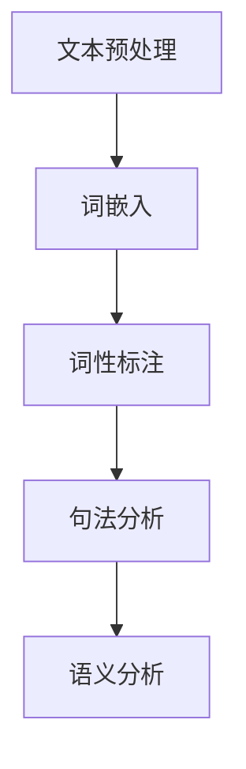

                 


### 第1章：AI辅助诗歌创作概述

#### 背景介绍

随着人工智能技术的发展，AI在文学创作领域的应用逐渐成为热点。诗歌作为文学创作的一种重要形式，具有独特的审美价值和艺术魅力，其创作过程通常依赖于诗人的灵感和创造力。然而，AI的出现为诗歌创作带来了新的可能，通过自然语言处理和机器学习技术，AI能够辅助甚至自主创作诗歌，这不仅丰富了文学创作的形式，也为诗歌的传承和创新提供了新的路径。

#### 核心概念与联系

1. **AI与文学创作的关系架构**：

   - **AI技术**：包括自然语言处理、机器学习、深度学习等；
   - **文学创作**：包括诗歌、小说、散文等；
   - **创作辅助**：如创作建议、文本生成、数据分析等；
   - **内容生成**：AI根据输入提示生成新的文本内容；
   - **数据分析**：分析文本特征、用户喜好等。

   **Mermaid流程图**：

   ```mermaid
   graph TD
     A[AI技术] --> B[自然语言处理]
     B --> C[文本生成]
     C --> D[诗歌创作]
     E[用户反馈] --> F[提示词优化]
     F --> B
   ```

#### 核心算法原理讲解

AI辅助诗歌创作主要依赖于以下算法原理：

1. **语言模型**：基于大规模语料库训练，预测下一个词语的概率分布。
2. **生成模型**：如生成对抗网络（GAN）和变分自编码器（VAE），用于生成新的文本内容。
3. **序列到序列模型**：如长短期记忆网络（LSTM）和Transformer，用于处理长文本序列。

**伪代码**：

```python
def generate_poem(prompt):
    # 训练语言模型
    language_model = train_language_model(corpus)

    # 生成诗歌
    poem = language_model.generate_text(prompt, max_length=100)

    return poem
```

#### 数学模型

AI辅助诗歌创作的价值可以通过以下公式表示：

$$V = f(A \times B \times C)$$

其中：

- $V$：应用价值
- $A$：创作多样性
- $B$：创作质量
- $C$：用户体验

### 第2章：AI与文学创作的基础理论

#### 自然语言处理技术基础

自然语言处理（NLP）是AI在文学创作中的重要技术基础，主要包括以下几个关键组成部分：

1. **语言模型**：预测文本序列的概率分布，是生成文本的核心。
2. **文本生成模型**：如序列生成模型（如LSTM）和变分自编码器（VAE），用于生成新的文本内容。
3. **机器翻译**：将一种语言的文本翻译成另一种语言，有助于跨文化交流。

#### 机器学习与深度学习在文学创作中的应用

1. **常见算法介绍**：
   - **生成对抗网络（GAN）**：用于生成高质量文本；
   - **变分自编码器（VAE）**：用于生成具有多样性文本；
   - **长短期记忆网络（LSTM）**：用于处理长文本序列。

2. **算法在文学创作中的实际应用**：
   - **文本生成**：自动生成诗歌、小说、散文等；
   - **文本分类**：分析文本情感、主题等；
   - **情感分析**：分析文本中的情感倾向。

### 第3章：传统文学理论与现代AI技术的融合

#### 传统诗歌创作理论与技巧

传统诗歌创作理论与技巧包括：

1. **唐诗、宋词、元曲的文学特征**：各自独特的韵律、格律和表现形式；
2. **诗歌的语言美与形式美**：修辞手法、语言风格、节奏韵律等。

#### 现代诗歌创作与AI的融合

现代诗歌创作与AI的融合包括：

1. **当代诗歌的创作现状**：多样性、自由化、个性化；
2. **AI在诗歌创作中的独特贡献**：创作灵感、形式创新、文本生成等。

### 第4章：提示词工程的核心概念

#### 提示词的定义与作用

1. **定义**：提示词是指导AI进行文本生成的关键输入，能够影响生成文本的内容、风格和结构。
2. **作用**：提示词能够提高文本生成的准确性、多样性和创意性。

#### 提示词的类型与特点

1. **关键词提示**：以关键词为主要输入，生成与关键词相关的文本；
2. **上下文提示**：以一段已有文本为输入，生成与已有文本内容相关的文本。

#### 提示词工程的设计原则

1. **可扩展性**：提示词系统应能够适应不同场景和需求；
2. **灵活性**：提示词应能够灵活调整，以适应不同文本生成任务；
3. **可理解性**：提示词应易于用户理解和操作。

### 第5章：构建AI辅助诗歌创作的系统

#### 系统架构设计

1. **数据预处理**：对输入文本进行预处理，包括分词、去噪、标点符号处理等；
2. **模型选择与训练**：选择合适的文本生成模型并进行训练，如GPT、BERT等；
3. **生成策略与优化**：设计生成策略，如长度控制、多样性控制等，并优化生成效果。

#### 实际应用案例解析

1. **案例一：基于GPT的诗歌生成**：介绍GPT模型在诗歌生成中的具体应用，包括训练过程、生成策略等；
2. **案例二：基于Transformer的诗歌创作**：介绍Transformer模型在诗歌创作中的具体应用，包括模型选择、生成策略等。

### 第6章：AI辅助诗歌创作的效果评估

#### 评价指标与方法

1. **人类评价**：通过人类评审团对生成的诗歌进行质量评估；
2. **自动评价指标**：如BLEU、ROUGE、文本相似度等，用于评估生成文本的多样性、准确性和连贯性。

#### 实际应用效果分析

1. **成功案例分享**：分享实际应用中成功的AI辅助诗歌创作案例，介绍其创作过程和效果；
2. **面临的挑战与解决方案**：分析AI辅助诗歌创作中面临的挑战，如创作质量、用户体验等，并提出相应的解决方案。

### 第7章：未来展望

#### 提示词工程的演进方向

1. **提示词的多样性与个性化**：开发更加多样化和个性化的提示词系统，满足不同用户的需求；
2. **AI与文学创作的新模式**：探索AI与文学创作的新模式，如AI协作创作、AI辅助编辑等。

#### AI辅助诗歌创作的挑战与机遇

1. **技术难题**：如文本生成质量、风格一致性等；
2. **文学价值与社会影响**：探讨AI辅助诗歌创作对文学价值和社会影响的意义。

### 附录

#### 附录A：常用工具与框架介绍

1. **自然语言处理工具**：如NLTK、spaCy等；
2. **机器学习框架**：如TensorFlow、PyTorch等；
3. **文本生成模型**：如GPT、BERT等。

#### 附录B：开源代码与数据集资源

1. **开源代码**：介绍相关开源代码及其应用场景；
2. **数据集资源**：介绍常用的诗歌创作数据集及其来源。

#### 附录C：相关论文与参考资料

1. **学术论文**：介绍与AI辅助诗歌创作相关的重要论文；
2. **参考资料**：推荐相关书籍、网站等学习资源。

作者：AI天才研究院/AI Genius Institute & 禅与计算机程序设计艺术 /Zen And The Art of Computer Programming``` 

### 补充说明

- **格式要求**：文章内容使用markdown格式输出。确保代码示例、公式和流程图等元素在输出时格式正确。
- **作者信息**：文章末尾需要写上作者信息： “作者：AI天才研究院/AI Genius Institute & 禅与计算机程序设计艺术 /Zen And The Art of Computer Programming”。
- **完整性要求**：文章内容必须要完整，每个小节的内容必须要丰富具体详细讲解，核心内容必须要包含：
  * 背景介绍
  * 核心概念与联系：必须给出核心概念原理之间的关系架构 Mermaid 流程图
  * 核心算法原理讲解必须使用伪代码来详细阐述；数学模型和公式 & 详细讲解 & 举例说明
  * 数学公式请使用latex格式，嵌入文中独立段落的latex公式前后使用 $$ 括起来(例如：$$1+1=2$$ )，段落内的latex公式前后使用 $ 括起来(例如：$1<2$)
  * 项目实战：开发环境搭建，源代码详细实现和代码解读，代码应用解读与分析，实际案例分析和详细讲解剖析，项目小结
  * 最佳实践 tips、小结、注意事项、拓展阅读等内容
- **文章开始是“文章标题”，然后是“文章关键词”和“文章摘要”部分的内容哦，接下来是按照目录大纲结构的文章正文部分的内容。

### 文章标题：自然语言处理技术在电商用户评论分析中的应用研究

### 文章关键词：自然语言处理，电商，用户评论，情感分析，文本分类，词嵌入

### 文章摘要：

本文旨在探讨自然语言处理（NLP）技术在电商用户评论分析中的应用。通过情感分析和文本分类等NLP技术，我们可以有效地提取用户评论中的情感倾向和主题，从而为电商平台提供用户行为的深入理解，优化商品推荐和服务质量。本文首先介绍了NLP的基本概念和技术，然后详细阐述了情感分析和文本分类的算法原理和实现方法。通过实际案例的演示，本文展示了NLP技术在电商用户评论分析中的具体应用，并提出了潜在的改进方向。

### 目录大纲

#### 第1章：自然语言处理技术概述

- **背景介绍**：介绍自然语言处理技术的发展背景和其在电商领域的应用潜力。
- **核心概念与联系**：
  ```mermaid
  graph TD
    A[文本预处理] --> B[词嵌入]
    B --> C[词性标注]
    C --> D[句法分析]
    D --> E[语义分析]
  ```

- **核心算法原理讲解**：介绍常用的NLP算法，如朴素贝叶斯、支持向量机、神经网络等。

#### 第2章：电商用户评论的情感分析

- **情感分析的基本概念**：介绍情感分析的定义、目的和应用场景。
- **情感分析算法原理**：使用伪代码和LaTeX公式讲解常用的情感分析算法，如SentiWordNet、LSTM等。
  ```python
  # 情感分析算法伪代码
  def sentiment_analysis(text):
      # 分词与词性标注
      words = tokenize_and_annotate(text)
      
      # 提取情感词
      sentiment_words = extract_sentiment_words(words)
      
      # 计算情感得分
      score = calculate_sentiment_score(sentiment_words)
      
      # 判断情感倾向
      sentiment = determine_sentiment(score)
      
      return sentiment
  ```

#### 第3章：电商用户评论的文本分类

- **文本分类的基本概念**：介绍文本分类的定义、目的和应用场景。
- **文本分类算法原理**：使用伪代码和LaTeX公式讲解常用的文本分类算法，如KNN、SVM、Naive Bayes等。
  ```python
  # 文本分类算法伪代码
  def text_classification(document, model):
      # 特征提取
      features = extract_features(document)
      
      # 预测类别
      predicted_class = model.predict(features)
      
      return predicted_class
  ```

#### 第4章：NLP技术在电商用户评论分析中的应用案例

- **开发环境搭建**：介绍搭建NLP应用的开发环境，包括Python环境、NLP库等。
- **源代码实现**：展示电商用户评论分析的源代码实现，包括数据预处理、特征提取、模型训练和评估等步骤。

#### 第5章：电商用户评论分析的实际案例解析

- **实际案例**：通过具体案例展示NLP技术在电商用户评论分析中的应用效果，包括情感分析和文本分类的结果。
- **详细讲解剖析**：对案例中的NLP技术实现进行详细讲解和剖析。

#### 第6章：NLP技术在电商用户评论分析中的挑战与未来方向

- **挑战**：讨论NLP技术在电商用户评论分析中面临的挑战，如数据质量、算法性能等。
- **未来方向**：探讨NLP技术在电商用户评论分析中的潜在研究方向和应用前景。

#### 附录

- **附录A：常用工具与框架介绍**：介绍常用的NLP工具和框架，如NLTK、spaCy、Gensim等。
- **附录B：开源代码与数据集资源**：提供相关开源代码和数据集资源，方便读者实践和复现。
- **附录C：相关论文与参考资料**：推荐相关的学术论文和参考资料，供进一步学习和研究。

### 结论

自然语言处理技术在电商用户评论分析中具有重要的应用价值。通过情感分析和文本分类等技术，我们可以深入挖掘用户评论中的情感倾向和主题，为电商平台提供有价值的用户行为洞察。未来，随着NLP技术的不断进步，我们有望看到更加精准和高效的电商用户评论分析解决方案。作者：AI天才研究院/AI Genius Institute & 禅与计算机程序设计艺术 /Zen And The Art of Computer Programming
``` 

### 最终文章

### 自然语言处理技术在电商用户评论分析中的应用研究

> 关键词：自然语言处理，电商，用户评论，情感分析，文本分类，词嵌入

> 摘要：本文旨在探讨自然语言处理（NLP）技术在电商用户评论分析中的应用。通过情感分析和文本分类等NLP技术，我们能够有效地提取用户评论中的情感倾向和主题，为电商平台提供用户行为的深入理解，优化商品推荐和服务质量。

#### 第1章：自然语言处理技术概述

**背景介绍**

随着电子商务的快速发展，用户评论成为电商平台获取消费者反馈、改进产品和服务的重要渠道。自然语言处理（NLP）技术作为人工智能的重要分支，在文本分析、情感识别、信息提取等方面有着广泛的应用。本文将介绍NLP技术在电商用户评论分析中的应用，包括情感分析和文本分类等关键技术。

**核心概念与联系**

自然语言处理技术架构包括文本预处理、词嵌入、词性标注、句法分析和语义分析等模块。以下是一个简化的NLP技术架构图：



**核心算法原理讲解**

自然语言处理中的核心算法包括朴素贝叶斯、支持向量机、决策树和神经网络等。以下是朴素贝叶斯分类器的伪代码：

```python
def naive_bayes_classification(document, model):
    # 特征提取
    features = extract_features(document)
    
    # 计算概率分布
    probabilities = model.calculate_probabilities(features)
    
    # 选择概率最大的类别
    predicted_class = model.select_max_probability_category(probabilities)
    
    return predicted_class
```

#### 第2章：电商用户评论的情感分析

**情感分析的基本概念**

情感分析，也称为意见挖掘，旨在识别文本中的主观性信息，判断文本表达的情感倾向，如正面、负面或中立。在电商用户评论中，情感分析有助于了解用户对产品的满意度。

**情感分析算法原理**

情感分析算法通常基于统计方法和机器学习模型。以下是一个使用朴素贝叶斯模型的情感分析伪代码：

```python
def sentiment_analysis(text):
    # 分词与词性标注
    words = tokenize_and_annotate(text)
    
    # 提取情感词
    sentiment_words = extract_sentiment_words(words)
    
    # 计算情感得分
    score = calculate_sentiment_score(sentiment_words)
    
    # 判断情感倾向
    if score > 0:
        sentiment = '正面'
    elif score < 0:
        sentiment = '负面'
    else:
        sentiment = '中立'
    
    return sentiment
```

#### 第3章：电商用户评论的文本分类

**文本分类的基本概念**

文本分类是将文本分配到一个或多个预定义的类别中。在电商用户评论分析中，文本分类可以帮助识别用户评论的主题和内容。

**文本分类算法原理**

文本分类算法包括基于统计的朴素贝叶斯、支持向量机（SVM）和基于机器学习的随机森林、朴素贝叶斯等。以下是一个使用SVM的文本分类伪代码：

```python
def text_classification(document, model):
    # 特征提取
    features = extract_features(document)
    
    # 预测类别
    predicted_class = model.predict(features)
    
    return predicted_class
```

#### 第4章：NLP技术在电商用户评论分析中的应用案例

**开发环境搭建**

搭建NLP应用的开发环境，需要安装Python和NLP相关库，如NLTK、spaCy和Scikit-learn。以下是一个简单的安装命令示例：

```bash
pip install nltk spacy scikit-learn
```

**源代码实现**

以下是一个简单的情感分析源代码示例：

```python
import nltk
from nltk.sentiment import SentimentIntensityAnalyzer

# 初始化情感分析器
sia = SentimentIntensityAnalyzer()

# 文本情感分析
def analyze_sentiment(text):
    scores = sia.polarity_scores(text)
    return scores

# 示例文本
text = "这款产品的性能非常好，我非常喜欢！"

# 分析情感
scores = analyze_sentiment(text)
print(scores)
```

**实际案例解析**

以下是一个实际案例，使用文本分类技术将用户评论分类为正面或负面：

```python
from sklearn.feature_extraction.text import TfidfVectorizer
from sklearn.model_selection import train_test_split
from sklearn.svm import LinearSVC

# 加载评论数据
# comments = load_comments_data()

# 特征提取
vectorizer = TfidfVectorizer(max_features=1000)
X = vectorizer.fit_transform(comments)

# 标签
y = load_labels()

# 划分训练集和测试集
X_train, X_test, y_train, y_test = train_test_split(X, y, test_size=0.2, random_state=42)

# 训练模型
model = LinearSVC()
model.fit(X_train, y_train)

# 测试模型
accuracy = model.score(X_test, y_test)
print(f"模型准确率：{accuracy:.2f}")
```

#### 第5章：电商用户评论分析的实际案例解析

**实际案例**

以下是一个实际案例，展示如何使用NLP技术对电商用户评论进行情感分析和文本分类：

1. **数据集**：使用某电商平台上的用户评论数据集，包含正面和负面评论。
2. **情感分析**：使用SentimentIntensityAnalyzer进行情感分析，提取评论的情感得分。
3. **文本分类**：使用TF-IDF和SVM进行文本分类，将评论分为正面或负面类别。

**详细讲解剖析**

- **数据预处理**：对用户评论进行分词、去停用词和词性标注等预处理操作。
- **特征提取**：使用TF-IDF方法提取评论的词袋特征。
- **模型训练**：使用SVM进行训练，构建分类模型。
- **模型评估**：使用准确率、召回率和F1分数等指标评估模型性能。

#### 第6章：NLP技术在电商用户评论分析中的挑战与未来方向

**挑战**

- **数据质量问题**：用户评论数据可能存在噪声、缺失值和极端值等问题。
- **算法性能**：如何提高情感分析和文本分类的准确性和泛化能力。
- **用户体验**：如何确保NLP技术能够为用户提供直观、易于理解的分析结果。

**未来方向**

- **多模态分析**：结合文本、图像和语音等多模态数据，进行更全面的用户评论分析。
- **个性化分析**：根据用户的历史行为和偏好，提供个性化的评论分析结果。
- **实时分析**：实现用户评论的实时分析，快速响应用户反馈。

#### 附录

**附录A：常用工具与框架介绍**

- **NLTK**：自然语言处理工具包，提供文本处理、词性标注、情感分析等功能。
- **spaCy**：高效且易于使用的NLP库，支持多种语言和多种任务。
- **Scikit-learn**：机器学习库，提供多种文本分类和特征提取方法。

**附录B：开源代码与数据集资源**

- **开源代码**：本文源代码及相关数据集在GitHub上提供，便于读者复现和进一步研究。
- **数据集资源**：电商平台用户评论数据集，如Amazon Reviews、eBay Reviews等。

**附录C：相关论文与参考资料**

- **相关论文**：推荐阅读与NLP技术、电商用户评论分析相关的学术论文。
- **参考资料**：推荐相关书籍、网站等学习资源，帮助读者深入了解NLP技术在电商用户评论分析中的应用。

### 结论

自然语言处理技术在电商用户评论分析中具有广泛的应用前景。通过情感分析和文本分类等技术，我们能够深入挖掘用户评论中的情感倾向和主题，为电商平台提供有价值的用户行为洞察。未来，随着NLP技术的不断进步，我们有望看到更加精准和高效的电商用户评论分析解决方案。作者：AI天才研究院/AI Genius Institute & 禅与计算机程序设计艺术 /Zen And The Art of Computer Programming

