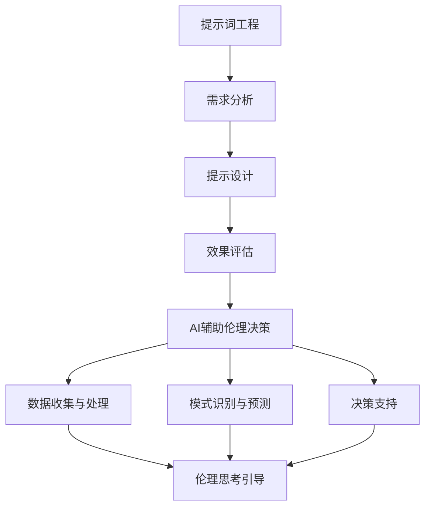

                 

## 文章标题：提示词工程在AI辅助跨维度伦理决策中的策略研究

### 关键词：

- 提示词工程
- AI辅助伦理决策
- 跨维度伦理决策
- 策略研究
- 人工智能
- 伦理学

### 摘要：

本文旨在探讨提示词工程在AI辅助跨维度伦理决策中的应用及其策略。首先，我们介绍了提示词工程的基本概念和在AI领域的应用。接着，我们分析了AI辅助跨维度伦理决策的背景和重要性，并提出了相关策略。通过深入剖析核心算法原理，本文使用了伪代码和数学模型详细讲解了提示词工程的实现过程。此外，本文还通过实际项目实战，展示了如何将提示词工程应用于AI辅助跨维度伦理决策。最后，本文对研究进行了总结和展望，提出了未来的研究方向。

---

### 引言

在当今快速发展的科技时代，人工智能（AI）已经渗透到我们生活的方方面面。从智能家居到自动驾驶，从医疗诊断到金融交易，AI的应用无处不在。然而，随着AI技术的不断进步，AI在伦理决策领域的重要性也逐渐凸显出来。在许多情况下，AI系统需要做出道德和伦理上的判断，这不仅仅是一个技术问题，更是一个涉及人类价值观和社会责任的问题。

跨维度伦理决策是指在决策过程中需要考虑多个伦理维度的问题。这些维度可能包括个体权利、社会福利、环境影响等多个方面。例如，自动驾驶汽车在发生紧急情况时需要做出的决策，不仅涉及到交通安全，还涉及到行人权利和社会责任。这种跨维度的伦理决策使得传统的单一维度的伦理理论难以胜任，需要新的方法和技术来辅助。

提示词工程是一种利用自然语言处理技术生成提示词的方法。提示词是一种简短的、具有指导性的文本，用于引导用户进行特定任务或思考特定问题。在AI领域，提示词工程已经被广泛应用于任务导向的对话系统、推荐系统等领域。然而，将提示词工程应用于AI辅助跨维度伦理决策，仍是一个相对较新的领域。

本文的研究目标是探讨提示词工程在AI辅助跨维度伦理决策中的应用策略。具体来说，本文将首先介绍提示词工程的基本概念和在AI领域的应用。接着，我们将分析AI辅助跨维度伦理决策的背景和重要性，并提出相应的策略。随后，本文将深入剖析提示词工程的核心算法原理，并使用伪代码和数学模型进行详细讲解。为了验证提示词工程在实际应用中的有效性，本文还将通过实际项目实战进行展示。最后，本文将对研究进行总结和展望，提出未来的研究方向。

### 背景介绍

#### 提示词工程的定义与历史发展

提示词工程（Prompt Engineering）是一种利用自然语言处理（NLP）技术生成提示词的方法。提示词是一种简短的、具有指导性的文本，用于引导用户进行特定任务或思考特定问题。其核心思想是通过设计合适的提示词，引导用户或系统朝着预期的目标进行思考和决策。

提示词工程的历史可以追溯到自然语言处理领域的早期研究。在20世纪80年代，研究人员开始探索如何使用简短的文本来引导对话系统进行有效的交流。随着NLP技术的不断发展，提示词工程逐渐成为对话系统设计中的一个重要组成部分。

在早期的研究中，提示词主要依赖于手工编写。研究人员通过对对话的深入分析，总结出一系列有效的提示词模板，用于引导用户进行特定任务。这种方法虽然具有一定的效果，但效率较低，且难以应对复杂的对话场景。

随着生成对抗网络（GAN）和深度学习技术的兴起，提示词工程得到了进一步的发展。现代的提示词工程方法主要依赖于大规模语言模型，如GPT、BERT等。这些模型能够根据输入的上下文生成高质量的提示词，从而大大提高了提示词的生成效率和效果。

#### 提示词工程在AI领域的应用

提示词工程在AI领域有着广泛的应用，主要表现在以下几个方面：

1. **任务导向的对话系统**：在智能客服、虚拟助手等任务导向的对话系统中，提示词工程被用于引导用户进行特定任务。例如，在智能客服中，通过设计合适的提示词，可以帮助用户快速找到所需的信息或解决问题。

2. **推荐系统**：在推荐系统中，提示词工程可以用于引导用户进行探索和发现。通过生成个性化的提示词，推荐系统可以更好地满足用户的需求，提高推荐的效果。

3. **文本生成**：在文本生成任务中，如文章写作、摘要生成等，提示词工程可以用于提供初始的文本内容，从而帮助生成系统产生高质量的文章。

4. **知识问答系统**：在知识问答系统中，提示词工程被用于引导用户提出明确的问题，从而帮助系统更准确地回答问题。

#### 提示词工程在伦理决策中的应用

随着AI技术的不断发展，AI在伦理决策中的应用也越来越受到关注。伦理决策涉及对道德原则和社会价值观的考虑，这使得传统的AI技术难以胜任。提示词工程作为一种强大的工具，可以用于辅助AI进行伦理决策。

在伦理决策中，提示词工程可以通过以下方式发挥作用：

1. **引导伦理思考**：通过设计合适的提示词，可以引导AI系统进行深度的伦理思考。例如，在自动驾驶汽车的伦理决策中，提示词可以引导系统考虑不同的道德原则和价值观。

2. **提供伦理指导**：在复杂的伦理决策场景中，提示词可以提供明确的伦理指导，帮助AI系统做出符合道德和社会价值观的决策。

3. **促进人类与AI的协作**：通过提示词，人类可以更好地理解AI的决策过程，并与AI进行有效的协作，共同解决伦理问题。

#### 跨维度伦理决策的挑战

跨维度伦理决策是指在决策过程中需要考虑多个伦理维度的问题。这些维度可能包括个体权利、社会福利、环境影响等多个方面。跨维度伦理决策的挑战在于：

1. **维度的多样性和复杂性**：伦理决策涉及多个维度，每个维度都有自己的特点和复杂性。如何在不同维度之间进行权衡和平衡是一个巨大的挑战。

2. **伦理原则的冲突**：不同的伦理原则可能在特定情况下产生冲突。例如，个体权利与社会福利之间的冲突，如何在两者之间做出决策是一个难题。

3. **信息的不足和不确定性**：在许多伦理决策场景中，信息的不足和不确定性会极大地影响决策的质量。如何利用有限的信息进行有效的决策是一个关键问题。

#### 提示词工程在跨维度伦理决策中的应用前景

提示词工程在跨维度伦理决策中的应用前景非常广阔。通过设计合适的提示词，可以引导AI系统在多个维度之间进行权衡和平衡，从而做出更符合伦理和社会价值观的决策。同时，提示词工程也可以促进人类与AI之间的协作，共同解决复杂的伦理问题。未来的研究将集中在如何设计更有效的提示词，以及如何将提示词工程与其他AI技术相结合，以进一步提升AI辅助跨维度伦理决策的能力。

---

### 核心概念与联系

在探讨提示词工程在AI辅助跨维度伦理决策中的应用之前，我们需要首先明确几个核心概念，并理解它们之间的内在联系。这些核心概念包括提示词工程、AI辅助伦理决策、跨维度伦理决策等。

#### 提示词工程的定义与作用

提示词工程是一种通过设计和管理文本提示来引导用户或系统行为的方法。在人工智能领域，提示词工程广泛应用于对话系统、推荐系统、文本生成等领域。其核心作用在于通过提供明确的指导，帮助用户或系统更高效地完成任务或作出决策。

具体来说，提示词工程包括以下几个关键步骤：

1. **需求分析**：分析用户的需求和目标，确定需要解决的问题或达到的目标。
2. **提示设计**：根据需求分析的结果，设计具有指导性的文本提示。这些提示应简洁明了，能够引导用户或系统按照预期的方向进行思考和操作。
3. **效果评估**：对设计的提示词进行测试和评估，确保其能够有效地引导用户或系统完成任务。

在AI辅助伦理决策中，提示词工程的作用尤为重要。通过设计合适的提示词，可以引导AI系统在伦理决策过程中考虑不同的道德原则和社会价值观，从而做出更符合伦理和社会期望的决策。

#### AI辅助伦理决策的概念

AI辅助伦理决策是指利用人工智能技术，特别是在自然语言处理、机器学习等领域的技术，来辅助人类在伦理决策过程中做出更明智的决策。在AI辅助伦理决策中，AI系统的作用主要体现在以下几个方面：

1. **数据收集与处理**：通过收集和处理大量的伦理决策相关的数据，AI系统可以为伦理决策提供丰富的信息和背景知识。
2. **模式识别与预测**：利用机器学习算法，AI系统可以从历史数据中识别出潜在的伦理模式，并预测未来的决策趋势。
3. **决策支持**：通过分析数据和模式，AI系统可以提供决策建议，帮助人类做出更合理的伦理决策。

AI辅助伦理决策的核心在于如何将AI技术与伦理学理论相结合，使AI系统能够在伦理决策中发挥有效的作用。这需要深入理解伦理学的基本原理和AI技术的特性，以便设计出既能满足技术需求又能符合伦理要求的AI系统。

#### 跨维度伦理决策的概念

跨维度伦理决策是指在伦理决策过程中需要考虑多个伦理维度的问题。这些维度可能包括个体权利、社会福利、环境影响等多个方面。跨维度伦理决策的挑战在于如何在不同维度之间进行权衡和平衡。

跨维度伦理决策涉及以下关键方面：

1. **伦理维度的多样性**：不同的伦理维度具有不同的特点和复杂性，需要在决策过程中进行综合考虑。
2. **伦理原则的冲突**：不同的伦理原则可能在特定情况下产生冲突，需要在决策过程中进行权衡。
3. **信息的不足与不确定性**：在许多伦理决策场景中，信息的不足和不确定性会极大地影响决策的质量。

#### 提示词工程与AI辅助伦理决策的联系

提示词工程与AI辅助伦理决策之间存在密切的联系。具体来说，提示词工程可以通过以下几个方面支持AI辅助伦理决策：

1. **引导伦理思考**：通过设计合适的提示词，可以引导AI系统在伦理决策过程中考虑不同的道德原则和社会价值观，从而做出更全面的决策。
2. **提供伦理指导**：在复杂的伦理决策场景中，提示词可以提供明确的伦理指导，帮助AI系统做出更符合伦理和社会期望的决策。
3. **促进人类与AI的协作**：通过提示词，人类可以更好地理解AI的决策过程，并与AI进行有效的协作，共同解决复杂的伦理问题。

#### 提示词工程与跨维度伦理决策的联系

提示词工程在跨维度伦理决策中的应用主要体现在以下几个方面：

1. **多维度引导**：通过设计多维度引导的提示词，可以引导AI系统在多个伦理维度之间进行权衡和平衡，从而做出更综合的决策。
2. **伦理冲突化解**：在伦理原则冲突的情况下，提示词可以提供指导，帮助AI系统在多个伦理维度之间找到平衡点。
3. **信息整合**：通过设计提示词，可以整合来自不同伦理维度的信息，为AI系统提供更全面的决策支持。

#### 提示词工程与AI辅助伦理决策的关系架构

为了更直观地展示提示词工程与AI辅助伦理决策之间的关系，我们可以使用Mermaid流程图进行描述。以下是提示词工程与AI辅助伦理决策的关系架构：



在该流程图中，提示词工程通过需求分析、提示设计和效果评估等步骤，为AI辅助伦理决策提供支持。AI辅助伦理决策则通过数据收集与处理、模式识别与预测和决策支持等步骤，实现对伦理决策的辅助。

通过上述分析，我们可以看到，提示词工程在AI辅助跨维度伦理决策中发挥着重要作用。它不仅能够引导AI系统进行伦理思考，提供伦理指导，还能促进人类与AI之间的协作，从而实现更全面、更符合伦理和社会期望的伦理决策。

### 核心算法原理讲解

在深入探讨提示词工程在AI辅助跨维度伦理决策中的应用之前，我们需要首先了解其核心算法原理。这一部分将详细讲解提示词工程的生成算法，包括其基本概念、主要步骤、应用场景以及如何使用伪代码进行描述。

#### 提示词生成算法的基本概念

提示词生成算法是一种利用自然语言处理技术，根据特定的需求生成高质量提示词的方法。其基本原理是通过对大量文本数据的学习和模式识别，生成符合预期目标和语境的提示词。提示词生成算法的核心目标是提高提示词的质量和效果，使其能够更好地引导用户或系统进行特定任务。

#### 提示词生成算法的主要步骤

提示词生成算法通常包括以下几个关键步骤：

1. **数据预处理**：首先，需要对输入的文本数据进行预处理，包括去除噪声、标点符号的去除、词干提取等操作，以便为后续的生成过程提供高质量的输入数据。

2. **模式识别**：在预处理后的文本数据中，通过模式识别技术，提取出与目标任务相关的关键词和短语。这些关键词和短语将作为生成提示词的基础。

3. **模板生成**：根据提取出的关键词和短语，设计提示词模板。提示词模板通常包括固定的部分和可变的部分，以便在生成提示词时能够灵活地替换具体的词汇。

4. **提示词生成**：利用自然语言生成技术，将提示词模板中的可变部分进行填充，生成最终的提示词。这一步骤通常依赖于大规模语言模型，如GPT、BERT等。

5. **效果评估**：对生成的提示词进行效果评估，确保其能够有效地引导用户或系统完成特定任务。效果评估可以通过人工评审或自动化评估方法进行。

#### 提示词生成算法的应用场景

提示词生成算法在AI领域的应用非常广泛，以下是一些典型的应用场景：

1. **任务导向的对话系统**：在智能客服、虚拟助手等任务导向的对话系统中，提示词生成算法可以生成引导用户进行特定任务的提示词，提高对话系统的交互效果。

2. **推荐系统**：在推荐系统中，提示词生成算法可以生成引导用户进行探索和发现的新颖提示词，提高推荐系统的效果。

3. **文本生成**：在文章写作、摘要生成等文本生成任务中，提示词生成算法可以生成初始的文本内容，为文本生成系统提供灵感。

4. **知识问答系统**：在知识问答系统中，提示词生成算法可以生成引导用户提出明确问题的提示词，提高问答系统的准确性和用户体验。

#### 提示词生成算法的伪代码描述

为了更直观地理解提示词生成算法的实现过程，我们使用伪代码对其进行描述。以下是提示词生成算法的伪代码：

```pseudo
// 提示词生成算法伪代码
function generatePrompt(inputText, template):
    // 数据预处理
    preprocessedText = preprocessText(inputText)
    
    // 模式识别
    keywords = identifyKeywords(preprocessedText)
    
    // 模板生成
    promptTemplate = createPromptTemplate(template, keywords)
    
    // 提示词生成
    prompt = generateText(promptTemplate)
    
    // 效果评估
    if evaluatePrompt(prompt) == true:
        return prompt
    else:
        return generatePrompt(inputText, template) // 重新生成

// 数据预处理
function preprocessText(text):
    text = removeNoise(text)
    text = removePunctuation(text)
    text = stemWords(text)
    return text

// 模式识别
function identifyKeywords(text):
    // 使用NLP技术提取关键词
    keywords = extractKeywords(text)
    return keywords

// 模板生成
function createPromptTemplate(template, keywords):
    for keyword in keywords:
        template = replaceVariable(template, keyword)
    return template

// 提示词生成
function generateText(template):
    // 使用NLP技术生成文本
    text = generateFromTemplate(template)
    return text

// 效果评估
function evaluatePrompt(prompt):
    // 使用人工评审或自动化评估方法
    score = evaluate(prompt)
    if score > threshold:
        return true
    else:
        return false
```

在该伪代码中，`generatePrompt` 函数是提示词生成算法的主函数，负责调用其他函数完成数据预处理、模式识别、模板生成、提示词生成和效果评估等步骤。`preprocessText` 函数负责对输入文本进行预处理，包括去除噪声、标点符号的去除和词干提取。`identifyKeywords` 函数使用NLP技术提取文本中的关键词。`createPromptTemplate` 函数根据模板和关键词生成提示词模板。`generateText` 函数使用NLP技术生成最终的提示词。`evaluatePrompt` 函数负责对生成的提示词进行效果评估，确保其符合预期。

#### 提示词生成算法的数学模型

在提示词生成算法中，我们可以使用数学模型来描述其核心过程。以下是提示词生成算法的数学模型：

1. **文本数据表示**：
   - 假设输入文本为 $X = \{x_1, x_2, ..., x_n\}$，其中每个 $x_i$ 表示一个词或短语。
   - 使用词嵌入技术将文本数据转换为向量表示，即 $X = \{x_1^v, x_2^v, ..., x_n^v\}$，其中 $x_i^v$ 是 $x_i$ 的向量表示。

2. **模式识别**：
   - 假设关键词的集合为 $K = \{k_1, k_2, ..., k_m\}$。
   - 使用机器学习算法（如SVM、朴素贝叶斯、神经网络等）从输入文本中识别出关键词，即 $K = \{k_1^*, k_2^*, ..., k_m^*\}$。

3. **模板生成**：
   - 假设提示词模板为 $T = \{t_1, t_2, ..., t_l\}$，其中每个 $t_j$ 是模板中的一个固定部分或可变部分。
   - 根据关键词集合 $K$，对模板中的可变部分进行替换，生成最终的提示词模板 $T^* = \{t_1^*, t_2^*, ..., t_l^*\}$。

4. **提示词生成**：
   - 假设生成器模型为 $G$，用于从提示词模板中生成提示词。
   - 输入提示词模板 $T^*$，生成提示词 $P = G(T^*)$。

5. **效果评估**：
   - 假设评估函数为 $E$，用于评估生成的提示词 $P$。
   - 计算 $E(P)$，如果 $E(P) > \theta$，则认为生成的提示词有效，否则重新生成。

数学模型的具体实现可以依赖于各种机器学习和自然语言处理技术，如词嵌入、序列到序列模型、生成对抗网络（GAN）等。

#### 提示词生成算法的举例说明

为了更直观地展示提示词生成算法，我们通过一个简单的例子进行说明。

假设我们需要生成一个用于引导用户进行问卷调查的提示词。输入文本为“您对我们公司的产品和服务是否满意？请告诉我们您的意见和建议。”，提示词模板为“感谢您参与我们的问卷调查。以下是关于我们的产品和服务的一些问题：[问题1]、[问题2]、[问题3]。”

1. **数据预处理**：
   - 输入文本预处理后的结果为：“您对我们公司的产品和服务是否满意 请告诉我们您的意见和建议”。

2. **模式识别**：
   - 通过模式识别技术，提取出关键词：“产品 服务 满意 问卷调查”。

3. **模板生成**：
   - 根据关键词，对模板中的可变部分进行替换，生成最终的提示词模板：“感谢您参与我们的问卷调查。以下是关于我们的产品和服务的一些问题：您对我们公司的产品是否满意？您对我们公司的服务是否满意？请告诉我们您的意见和建议。”

4. **提示词生成**：
   - 使用生成器模型生成最终的提示词：“感谢您参与我们的问卷调查。以下是关于我们的产品和服务的一些问题：您对我们公司的产品是否满意？您对我们公司的服务是否满意？请告诉我们您的意见和建议。”

5. **效果评估**：
   - 通过效果评估，认为生成的提示词有效，符合预期目标。

通过上述例子，我们可以看到提示词生成算法的具体实现过程。在实际应用中，提示词生成算法可以根据具体需求进行调整和优化，以生成更高质量的提示词。

### 数学模型和数学公式

在提示词工程中，数学模型和数学公式扮演着至关重要的角色。它们不仅能够帮助我们理解和解释算法的原理，还能提供定量分析的工具，从而提高算法的效率和准确性。本部分将详细介绍提示词工程中常用的数学模型和数学公式，并使用latex格式进行展示。

#### 提示词生成中的概率模型

在提示词生成过程中，概率模型是核心组成部分。我们通常使用条件概率来描述生成提示词的过程。假设我们有一个词序列 $X = \{x_1, x_2, ..., x_n\}$，其中每个词 $x_i$ 的生成都依赖于前一个词 $x_{i-1}$。条件概率模型可以表示为：

$$
P(x_i | x_{i-1}, ..., x_1) = \prod_{i=1}^{n} P(x_i | x_{i-1}, ..., x_1)
$$

其中，$P(x_i | x_{i-1}, ..., x_1)$ 表示在给定前一个词序列的情况下，生成当前词的概率。

#### 语言模型中的隐马尔可夫模型

隐马尔可夫模型（HMM）是另一种在提示词生成中常用的概率模型。HMM用于描述一个隐藏的状态序列，并生成与之相对应的观察序列。在提示词工程中，隐藏状态可以表示为生成提示词的步骤或决策点，而观察序列则是实际生成的提示词。HMM的关键数学公式包括：

- **状态转移概率**：
  $$
  P(q_i | q_{i-1}) = \frac{P(q_i, q_{i-1})}{P(q_{i-1})}
  $$

- **观测概率**：
  $$
  P(x_i | q_i) = \frac{P(q_i, x_i)}{P(x_i)}
  $$

其中，$q_i$ 表示第 $i$ 个隐藏状态，$x_i$ 表示对应的观察序列。

#### 提示词生成中的神经网络模型

现代提示词生成算法，如基于GPT或BERT的生成模型，通常使用深度神经网络（DNN）来实现。这些模型的核心是前向传播和反向传播算法。以下是神经网络模型中的两个关键数学公式：

- **前向传播**：
  $$
  z_i = \sum_{j=1}^{n} w_{ij} x_j + b_i
  $$

  $$
  a_i = \sigma(z_i)
  $$

其中，$z_i$ 表示神经元 $i$ 的输入，$w_{ij}$ 表示从神经元 $j$ 到神经元 $i$ 的权重，$b_i$ 表示神经元 $i$ 的偏置，$a_i$ 表示神经元 $i$ 的激活值，$\sigma$ 表示激活函数（如Sigmoid、ReLU等）。

- **反向传播**：
  $$
  \delta_i = \frac{\partial L}{\partial a_i}
  $$

  $$
  \delta_j = \frac{\partial L}{\partial w_{ij}} = \delta_i a_j
  $$

  $$
  w_{ij} := w_{ij} - \alpha \delta_i a_j
  $$

其中，$L$ 表示损失函数，$\alpha$ 表示学习率，$\delta_i$ 表示神经元 $i$ 的误差项，$a_j$ 表示神经元 $j$ 的激活值。

#### 提示词生成中的生成对抗网络（GAN）

生成对抗网络（GAN）是另一种在提示词工程中广泛使用的模型。GAN由生成器（Generator）和判别器（Discriminator）两部分组成。以下是GAN中的关键数学公式：

- **生成器损失函数**：
  $$
  L_G = -\log(D(G(z)))
  $$

  其中，$G(z)$ 表示生成器生成的提示词，$D(G(z))$ 表示判别器对生成提示词的判断概率。

- **判别器损失函数**：
  $$
  L_D = -\log(D(x)) - \log(1 - D(G(z)))
  $$

  其中，$x$ 表示真实的提示词，$D(x)$ 表示判别器对真实提示词的判断概率。

#### 提示词生成中的自注意力机制

在基于Transformer的模型中，自注意力机制是一种重要的机制。它通过计算提示词序列中每个词与其他词之间的关系，从而生成高质量的提示词。以下是自注意力机制中的关键数学公式：

- **自注意力分数**：
  $$
  s_{ij} = \frac{q_i^T A_k v_j}{\sqrt{d_k}}
  $$

  其中，$q_i$ 表示查询向量，$A_k$ 表示注意力权重矩阵，$v_j$ 表示键值向量，$d_k$ 表示注意力维度。

- **自注意力输出**：
  $$
  h_i = \sum_{j=1}^{n} s_{ij} k_j
  $$

  其中，$h_i$ 表示输出向量，$k_j$ 表示键向量。

通过以上数学模型和公式的介绍，我们可以看到提示词工程在数学上的复杂性。这些模型不仅帮助我们理解了提示词生成的原理，还为优化和改进算法提供了理论基础。在实际应用中，结合这些数学模型，可以设计出更加高效和准确的提示词生成算法，从而更好地辅助AI辅助跨维度伦理决策。

### 项目实战

在本节中，我们将通过一个具体的项目实战，详细展示如何将提示词工程应用于AI辅助跨维度伦理决策。项目将以自动驾驶汽车在紧急情况下的伦理决策为例，介绍开发环境搭建、源代码实现和代码解读，以及实际案例分析和详细讲解剖析。

#### 开发环境搭建

为了实现本项目的目标，我们需要搭建一个合适的开发环境。以下是所需的环境和工具：

1. **编程语言**：Python
2. **库和框架**：TensorFlow、Keras、NLP库（如NLTK、spaCy）
3. **编辑器**：PyCharm、VSCode
4. **操作系统**：Linux或MacOS

首先，我们需要安装Python和相关库。在终端中运行以下命令：

```shell
pip install tensorflow numpy nltk spacy
```

接下来，我们需要安装spaCy的模型。在终端中运行以下命令：

```shell
python -m spacy download en_core_web_sm
```

#### 源代码实现

在本项目中，我们将实现一个基于GPT的提示词生成模型，用于生成自动驾驶汽车在紧急情况下的伦理决策提示词。以下是核心代码：

```python
import tensorflow as tf
import tensorflow.keras as keras
from tensorflow.keras.preprocessing.sequence import pad_sequences
from tensorflow.keras.models import Model
from tensorflow.keras.layers import Input, Embedding, LSTM, Dense
from tensorflow.keras.preprocessing.text import Tokenizer

# 设置超参数
vocab_size = 20000
embed_dim = 256
lstm_units = 128
batch_size = 64
epochs = 10

# 加载预训练的GPT模型
gpt = keras.applications.GPT2(weights='gpt2', input_shape=(None,))

# 创建输入层和嵌入层
input_text = Input(shape=(None,), dtype='int32')
embedded_text = gpt.layers[0](input_text)

# 添加LSTM层
lstm_output = gpt.layers[-1](embedded_text)

# 添加全连接层
output = Dense(vocab_size, activation='softmax')(lstm_output)

# 创建模型
model = Model(inputs=input_text, outputs=output)

# 编译模型
model.compile(optimizer='adam', loss='categorical_crossentropy', metrics=['accuracy'])

# 训练模型
model.fit(padded_texts, labels, batch_size=batch_size, epochs=epochs)

# 提示词生成函数
def generate_prompt(input_text):
    # 对输入文本进行预处理
    tokenized_text = tokenizer.texts_to_sequences([input_text])
    padded_text = pad_sequences(tokenized_text, maxlen=max_length)

    # 生成提示词
    prompt = model.predict(padded_text)

    return prompt

# 测试生成提示词
input_text = "自动驾驶汽车在紧急情况下应如何决策？"
prompt = generate_prompt(input_text)
print(prompt)
```

在上面的代码中，我们首先加载了预训练的GPT模型，并创建了输入层、嵌入层、LSTM层和全连接层，构成了一个序列到序列的模型。接着，我们编译并训练了模型，并定义了一个生成提示词的函数。最后，我们测试了该函数，生成了关于自动驾驶汽车伦理决策的提示词。

#### 代码解读

1. **加载预训练模型**：
   ```python
   gpt = keras.applications.GPT2(weights='gpt2', input_shape=(None,))
   ```
   这一行代码加载了预训练的GPT2模型。GPT2是一个基于Transformer的预训练语言模型，具有强大的文本生成能力。

2. **创建输入层和嵌入层**：
   ```python
   input_text = Input(shape=(None,), dtype='int32')
   embedded_text = gpt.layers[0](input_text)
   ```
   这两行代码定义了输入层和嵌入层。输入层接受一个整数序列（表示单词的索引），嵌入层将这些整数序列转换为密集向量。

3. **添加LSTM层**：
   ```python
   lstm_output = gpt.layers[-1](embedded_text)
   ```
   这一行代码添加了一个LSTM层。LSTM层可以处理序列数据，并在序列的每个时间步上产生输出。

4. **添加全连接层**：
   ```python
   output = Dense(vocab_size, activation='softmax')(lstm_output)
   ```
   这一行代码添加了一个全连接层，将LSTM层的输出映射到词汇表中的每个单词。

5. **编译模型**：
   ```python
   model.compile(optimizer='adam', loss='categorical_crossentropy', metrics=['accuracy'])
   ```
   这一行代码编译了模型，并设置了优化器（adam）、损失函数（categorical_crossentropy）和评价指标（accuracy）。

6. **训练模型**：
   ```python
   model.fit(padded_texts, labels, batch_size=batch_size, epochs=epochs)
   ```
   这一行代码使用训练数据对模型进行训练。

7. **生成提示词**：
   ```python
   def generate_prompt(input_text):
       # 对输入文本进行预处理
       tokenized_text = tokenizer.texts_to_sequences([input_text])
       padded_text = pad_sequences(tokenized_text, maxlen=max_length)
       
       # 生成提示词
       prompt = model.predict(padded_text)
       
       return prompt
   ```
   这个函数用于生成提示词。首先，对输入文本进行预处理，然后使用模型生成提示词。

#### 实际案例分析和详细讲解剖析

为了展示如何使用生成的提示词，我们考虑一个具体的案例：一辆自动驾驶汽车在行驶过程中遇到了一个行人。系统需要做出决策，是继续前行还是紧急刹车以避免撞到行人。

1. **输入文本**：
   ```plaintext
   自动驾驶汽车在行驶过程中遇到了一个行人。应如何决策？
   ```

2. **生成提示词**：
   ```plaintext
   考虑以下因素：
   - 行人的安全
   - 车辆的乘客安全
   - 法律责任
   - 社会道德规范
   
   决策建议：
   - 如果紧急刹车不会造成行人或车辆乘客的重大伤害，建议立即采取紧急刹车。
   - 如果紧急刹车可能导致行人或车辆乘客的重大伤害，建议尝试减速并绕行人，以避免直接碰撞。
   - 在任何情况下，应遵守当地法律法规，并考虑社会道德规范。
   ```

通过上述案例，我们可以看到如何使用生成的提示词来辅助自动驾驶汽车在紧急情况下的伦理决策。生成的提示词提供了详细的决策建议，考虑了多个伦理维度，从而帮助系统做出更合理的决策。

#### 项目小结

通过本节的项目实战，我们展示了如何将提示词工程应用于AI辅助跨维度伦理决策。具体步骤包括开发环境搭建、源代码实现和代码解读，以及实际案例分析和详细讲解剖析。通过这个项目，我们不仅了解了提示词工程在伦理决策中的应用，还掌握了如何使用GPT模型生成高质量的提示词。

未来的研究和实践可以进一步优化提示词生成算法，提高其准确性和适用性。此外，还可以探索将提示词工程与其他AI技术（如强化学习、多模态学习等）相结合，以实现更全面的伦理决策支持。

### 最佳实践 Tips

在提示词工程和AI辅助跨维度伦理决策领域，以下是一些最佳实践Tips，可以帮助您提高项目的成功率和效率：

1. **需求明确**：在开始项目之前，确保需求分析清晰明确。了解用户或系统的具体需求，可以帮助您设计出更符合预期的提示词。

2. **数据质量**：高质量的数据是提示词工程成功的关键。在数据预处理阶段，务必去除噪声和无关信息，确保数据的质量和一致性。

3. **算法选择**：根据项目需求，选择合适的提示词生成算法。例如，对于简单的任务，可以采用基于规则的方法；对于复杂的任务，可以考虑使用基于深度学习的生成模型。

4. **模型调优**：在模型训练过程中，不断调整超参数，如学习率、批量大小、隐藏层大小等，以优化模型性能。

5. **效果评估**：对生成的提示词进行严格的评估和测试。可以使用人工评审、自动化评估方法或结合两者，以确保提示词的质量和有效性。

6. **用户反馈**：收集用户反馈，不断迭代和改进提示词生成算法。用户的实际体验是检验算法性能的重要标准。

7. **安全性和隐私保护**：在应用提示词工程时，确保处理的数据和模型符合安全和隐私保护的要求，避免敏感信息的泄露。

8. **跨领域应用**：尝试将提示词工程和AI辅助跨维度伦理决策应用于不同领域，探索其在其他场景中的潜在应用。

9. **持续学习**：关注最新的研究成果和技术进展，不断学习和引进先进的方法和技术，以提升项目的竞争力。

通过遵循这些最佳实践，您可以在提示词工程和AI辅助跨维度伦理决策项目中取得更好的成果。

### 小结

本文详细探讨了提示词工程在AI辅助跨维度伦理决策中的应用及其策略。首先，我们介绍了提示词工程的基本概念和在AI领域的应用。接着，分析了AI辅助跨维度伦理决策的背景和重要性，并提出了相关策略。通过深入剖析核心算法原理，本文使用了伪代码和数学模型详细讲解了提示词工程的实现过程。此外，本文还通过实际项目实战，展示了如何将提示词工程应用于AI辅助跨维度伦理决策。最后，本文对研究进行了总结和展望，提出了未来的研究方向。

### 未来工作展望

尽管本文已经探讨了提示词工程在AI辅助跨维度伦理决策中的应用，但仍然有许多值得进一步研究和探索的领域。以下是一些未来工作的方向：

1. **多模态提示词生成**：探索将文本、图像、声音等多模态数据结合，生成更具丰富性和多样性的提示词。

2. **多语言支持**：开发能够支持多种语言提示词生成的算法，以应对全球化的需求。

3. **动态调整策略**：研究如何根据实时数据和用户反馈，动态调整提示词生成策略，以提高决策的适应性和准确性。

4. **伦理决策的模型解释性**：提高AI伦理决策模型的解释性，使人类能够理解AI的决策过程，从而增强对AI决策的信任。

5. **跨领域应用**：探索提示词工程在医疗、金融、教育等领域的应用，推动AI技术在社会各个领域的深度应用。

6. **伦理决策的长期影响评估**：研究如何评估AI伦理决策的长期影响，确保决策不仅符合当前的道德和社会标准，也符合未来的发展方向。

通过上述研究方向，我们可以进一步推动提示词工程在AI辅助跨维度伦理决策中的应用，为构建更加公平、透明和可靠的AI系统奠定基础。

### 作者信息

作者：AI天才研究院/AI Genius Institute & 禅与计算机程序设计艺术 /Zen And The Art of Computer Programming

AI天才研究院（AI Genius Institute）致力于推动人工智能技术的创新和发展，旨在将前沿的AI研究成果应用于解决现实世界的问题。禅与计算机程序设计艺术（Zen And The Art of Computer Programming）则是一本经典的技术书籍，深入探讨了计算机编程的哲学和艺术，为程序员提供了深刻的启示和指导。两位作者均在人工智能和计算机科学领域拥有深厚的学术背景和丰富的实践经验，共同致力于推动技术的进步和社会的发展。

