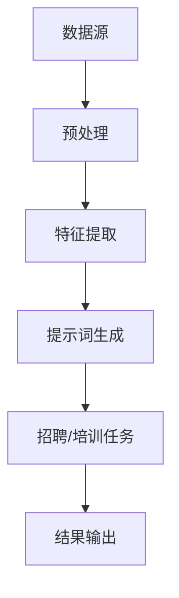

                 

### 引言

在当今快速发展的科技时代，人工智能（AI）正以前所未有的速度渗透到各个行业，其中人力资源管理（HRM）是其应用最为广泛且潜力巨大的领域之一。本文将探讨提示词工程在人力资源管理中的应用，特别是AI辅助招聘与培训这两个关键环节。

首先，让我们明确什么是提示词工程。提示词工程是一种利用AI技术，从大量数据中提取关键信息，并生成针对特定任务的提示词的方法。这些提示词可以是关于候选人技能、经历、个性等的描述，也可以是关于培训内容、课程设计、学习效果等的指导。

### AI辅助招聘

在招聘过程中，提示词工程可以通过以下步骤实现：

1. **数据预处理与特征提取**：首先，需要对简历、面试记录等原始数据进行预处理，提取出如教育背景、工作经验、技能关键字等特征。
2. **提示词生成**：利用自然语言处理（NLP）技术，从预处理后的数据中生成能够反映候选人核心能力的提示词。
3. **招聘流程自动化**：通过自动化工具，对生成的提示词进行匹配，筛选出符合职位要求的候选人，从而提高招聘效率。

### AI辅助培训

在培训过程中，提示词工程同样发挥着重要作用：

1. **培训需求分析与设计**：通过分析员工的技能缺口和岗位需求，生成针对不同岗位的培训需求提示词。
2. **培训内容生成与个性化推荐**：利用提示词，自动生成适合不同员工的培训内容，并通过个性化推荐系统，提高培训的针对性和效果。
3. **培训效果评估**：通过评估系统，对培训效果进行实时监控和反馈，优化培训策略。

### 目标读者与主题思想

本文的目标读者是从事人力资源管理、人工智能应用开发以及相关领域的专业人士和研究者。通过本文的探讨，我们希望读者能够：

1. **了解提示词工程在人力资源管理中的应用**：掌握提示词工程的基本概念和方法，以及其在招聘和培训中的具体应用。
2. **掌握AI辅助招聘与培训的核心技术**：了解数据预处理、提示词生成、自动化流程等技术，并能够应用于实际工作中。
3. **思考未来发展趋势**：探讨提示词工程和AI技术在人力资源管理中的未来发展趋势，以及可能面临的挑战。

总的来说，本文的核心思想是通过提示词工程，结合AI技术，实现更高效、更精准的人力资源管理，从而提高企业竞争力和员工满意度。接下来，我们将详细探讨提示词工程在人力资源管理中的应用，包括基础理论与方法、AI辅助招聘和培训的具体实施，以及未来的挑战与趋势。

## 提示词工程的定义与核心概念

提示词工程（Prompt Engineering）是一种利用人工智能（AI）技术，从大量数据中提取关键信息并生成针对特定任务的提示词的方法。这一概念结合了自然语言处理（NLP）、机器学习和数据挖掘等多种技术，旨在提高信息检索、文本生成、任务自动化等领域的效率和质量。

### 基本概念

1. **提示词**：提示词（Prompt）是指用于引导模型进行特定任务的一段文本或语音输入。它可以是简单的关键词、短语，也可以是复杂的句子或段落。提示词的作用是提供上下文信息，帮助模型更好地理解任务意图，从而生成更准确的结果。

2. **数据源**：提示词工程的数据源包括各种文本数据，如简历、职位描述、面试记录、培训材料等。这些数据可以是结构化的，如数据库中的记录，也可以是非结构化的，如文档、邮件、社交媒体帖子等。

3. **模型**：在提示词工程中，常用的模型包括但不限于循环神经网络（RNN）、变换器（Transformer）、生成对抗网络（GAN）等。这些模型通过训练学习到数据的特征和规律，从而能够生成高质量的提示词。

4. **任务**：提示词工程可以应用于多种任务，如文本分类、情感分析、问答系统、自动化写作等。具体任务的定义取决于应用场景和业务需求。

### 提示词工程在人力资源管理中的应用

在人力资源管理中，提示词工程主要通过以下几种方式发挥作用：

1. **招聘**：
   - **简历筛选**：利用提示词工程，从大量简历中提取关键信息，如技能关键字、教育经历等，从而快速筛选出符合条件的候选人。
   - **职位匹配**：通过分析职位描述和候选人简历，生成匹配度提示词，帮助HR更好地理解候选人的优势和不足，从而做出更准确的招聘决策。
   - **面试评估**：利用提示词工程，对面试记录进行文本分析，生成评估提示词，如候选人的回答内容、表达方式、情绪等，帮助HR全面了解候选人。

2. **培训**：
   - **需求分析**：通过分析员工的技能水平和岗位要求，生成培训需求提示词，指导培训内容的设计和实施。
   - **内容生成**：利用提示词工程，自动生成培训材料和课程内容，提高培训的针对性和有效性。
   - **效果评估**：通过对培训过程中的数据进行分析，生成培训效果提示词，帮助HR评估培训效果，优化培训策略。

### 核心概念之间的关系架构

为了更好地理解提示词工程在人力资源管理中的应用，我们可以使用Mermaid流程图来展示核心概念之间的关系。以下是一个简单的示例：



在这个流程图中：
- **A（数据源）**：表示提示词工程所需的各种文本数据。
- **B（预处理）**：对原始数据进行清洗、去重等预处理操作。
- **C（特征提取）**：从预处理后的数据中提取关键特征，如关键词、句子等。
- **D（提示词生成）**：利用特征生成能够引导模型完成特定任务的提示词。
- **E（招聘/培训任务）**：表示具体的招聘或培训任务。
- **F（结果输出）**：生成最终的任务结果，如筛选出的候选人名单、培训内容等。

通过上述核心概念及其关系架构，我们可以更清晰地理解提示词工程在人力资源管理中的应用，并为进一步的探讨打下基础。

### 人力资源管理的基本概念与方法

人力资源管理（HRM）是指组织通过有效的招聘、培训、绩效管理等一系列活动，最大化员工潜力，以实现组织目标的过程。在HRM中，有多个核心概念和方法，这些概念和方法构成了一个系统化的框架，帮助组织管理和提升人力资源效能。

#### 招聘

招聘是HRM的关键环节之一，涉及从人才市场吸引和筛选符合组织需求的人才。以下是招聘过程中涉及的基本概念和方法：

1. **招聘渠道**：
   - **内部招聘**：在组织内部选拔人才，如晋升、内部调岗等。
   - **外部招聘**：通过社会招聘、校园招聘、猎头公司等渠道寻找外部人才。

2. **招聘流程**：
   - **职位需求分析**：明确职位要求，包括岗位职责、技能要求、教育背景等。
   - **发布招聘信息**：在各类媒体上发布招聘广告，吸引潜在候选人。
   - **简历筛选**：根据职位要求，筛选出符合条件候选人的简历。
   - **面试安排**：对筛选出的候选人进行面试，包括初步面试和最终面试。
   - **背景调查**：对候选人进行背景调查，核实其提供的个人信息和经历。
   - **录用决策**：根据面试结果和背景调查，做出录用决策。

3. **招聘策略**：
   - **品牌招聘**：通过塑造良好的雇主品牌，吸引优秀人才。
   - **精准招聘**：利用大数据分析和AI技术，精准匹配职位与候选人。
   - **多样化招聘**：鼓励不同背景、性别、年龄的人才加入组织，促进创新和多元化。

#### 培训

培训是提升员工能力和素质的重要手段，有助于提高组织绩效和员工满意度。以下是培训过程中涉及的基本概念和方法：

1. **培训需求分析**：
   - **岗位需求分析**：分析岗位所需的知识、技能和能力。
   - **员工绩效分析**：评估员工目前的绩效和能力，找出培训需求。
   - **市场趋势分析**：了解行业动态和技能需求变化，为培训提供方向。

2. **培训设计**：
   - **培训目标设定**：明确培训的目标和预期效果。
   - **培训内容设计**：根据培训目标，设计合适的培训内容，如课程、讲座、工作坊等。
   - **培训方式选择**：根据培训内容选择合适的培训方式，如线上培训、线下培训、混合式培训等。

3. **培训实施**：
   - **培训资源准备**：准备培训所需的教材、设备、讲师等资源。
   - **培训过程管理**：监控培训过程，确保培训效果。
   - **培训效果评估**：通过考试、问卷、访谈等方式评估培训效果，为后续培训提供改进依据。

#### 绩效管理

绩效管理是HRM的重要组成部分，通过系统化的方法评估员工的工作表现，提供反馈和激励，以促进员工的成长和组织目标的实现。以下是绩效管理中涉及的基本概念和方法：

1. **绩效评估**：
   - **KPI设定**：设定与岗位相关的关键绩效指标（KPI）。
   - **评估周期**：确定绩效评估的时间周期，如季度、半年或年度。
   - **评估方法**：采用多种评估方法，如自评、他评、360度反馈等。

2. **绩效反馈**：
   - **即时反馈**：在员工表现不佳时，及时给予反馈，帮助其改进。
   - **定期反馈**：定期进行绩效反馈，总结员工的工作表现，讨论改进方案。

3. **绩效激励**：
   - **薪酬激励**：通过调整薪酬水平，激励员工提高绩效。
   - **非薪酬激励**：提供晋升、培训、表彰等非物质激励，提高员工的工作积极性和满意度。

通过上述基本概念和方法的介绍，我们可以看到，人力资源管理是一个涉及多个方面、多个环节的系统工程。了解这些概念和方法，不仅有助于提升个人的HR管理能力，也能为组织的人力资源战略提供有力支持。

### AI辅助招聘与培训的算法与技术基础

在人力资源管理中，AI技术的应用不仅能够提高招聘和培训的效率，还能提升其精确度和个性化程度。下面，我们将探讨AI辅助招聘与培训的核心算法和技术基础，包括自然语言处理（NLP）、机器学习（ML）和深度学习（DL）等。

#### 自然语言处理（NLP）

自然语言处理是AI技术在人力资源领域的基石，它能够使计算机理解和处理人类语言。以下是NLP在招聘和培训中的应用：

1. **文本分类**：
   - **简历筛选**：利用文本分类算法，自动对简历进行筛选，分类出符合职位要求的候选人。
   - **职位匹配**：将职位描述与候选人的简历进行匹配，评估候选人与职位的相关度。

2. **情感分析**：
   - **面试评估**：通过情感分析，评估面试者的回答内容和情绪，辅助HR做出更准确的评估决策。
   - **员工满意度调查**：分析员工的反馈，识别员工的不满意情绪和主要问题。

3. **命名实体识别（NER）**：
   - **简历解析**：利用NER技术，自动提取简历中的关键信息，如姓名、职位、教育背景、工作经历等。

4. **语义分析**：
   - **需求分析**：分析岗位需求描述，提取关键技能和任职资格。
   - **内容生成**：根据语义分析，自动生成培训内容和课程设计。

#### 机器学习（ML）

机器学习是AI技术的重要组成部分，通过学习数据特征，预测和决策。以下是ML在招聘和培训中的应用：

1. **回归分析**：
   - **薪资预测**：通过历史数据，预测候选人的薪资水平，帮助HR做出合理的薪酬决策。

2. **分类算法**：
   - **简历筛选**：利用分类算法，对简历进行筛选，判断其是否符合职位要求。
   - **绩效预测**：通过分析员工的绩效历史数据，预测其未来的绩效表现。

3. **聚类算法**：
   - **人才库构建**：根据候选人的特征，将其分为不同的人才类别，便于招聘时快速筛选。
   - **需求预测**：分析员工的行为和绩效，预测其未来可能的培训需求。

4. **强化学习**：
   - **招聘优化**：通过不断调整招聘策略，优化招聘流程，提高招聘成功率。
   - **培训效果优化**：根据员工的反馈和学习效果，调整培训内容和方式，提高培训效果。

#### 深度学习（DL）

深度学习是一种强大的机器学习技术，通过构建深度神经网络，自动提取数据中的复杂特征。以下是DL在招聘和培训中的应用：

1. **卷积神经网络（CNN）**：
   - **简历解析**：利用CNN，自动识别和提取简历中的关键信息，如姓名、职位等。
   - **图像识别**：在面试过程中，利用图像识别技术，分析面试者的面部表情和姿态，辅助评估面试者的情绪状态。

2. **递归神经网络（RNN）**：
   - **文本生成**：利用RNN，自动生成个性化的培训内容和面试评价。
   - **语音识别**：将面试者的语音转换为文本，辅助文本分析和情感分析。

3. **生成对抗网络（GAN）**：
   - **虚假简历检测**：利用GAN，生成虚假简历样本，用于训练和验证简历筛选模型的准确性。
   - **数据增强**：通过GAN，生成更多高质量的培训数据和面试样本，提高模型的泛化能力。

通过以上算法和技术的应用，AI辅助招聘与培训不仅能够提高人力资源管理的工作效率，还能提升其科学性和精确度，为组织的发展提供有力支持。接下来，我们将深入探讨这些算法在实际招聘和培训中的应用细节。

### 数据预处理与特征提取

在AI辅助招聘与培训中，数据预处理与特征提取是至关重要的步骤。这些步骤不仅决定了模型的学习效果，还直接影响到招聘和培训的准确性和效率。下面，我们将详细探讨数据预处理和特征提取的方法及其重要性。

#### 数据预处理

数据预处理是指对原始数据进行清洗、去噪、归一化等操作，使其适合于机器学习和深度学习模型训练。以下是数据预处理中常用的几种方法：

1. **数据清洗**：
   - **去除无效数据**：删除重复的、缺失的或不完整的数据记录。
   - **处理异常值**：识别并处理异常数据点，如异常薪资、异常工作经验等。
   - **数据标准化**：将数据转换为统一的格式，如统一职位名称、教育背景等。

2. **数据去噪**：
   - **文本去噪**：去除简历和职位描述中的无关信息，如HTML标签、特殊符号等。
   - **图像去噪**：在面试过程中，去除视频中的噪声，提高图像质量。

3. **数据归一化**：
   - **数值归一化**：将不同数值范围的数据归一到同一范围内，如将薪资数据归一到[0, 1]范围内。
   - **类别归一化**：将类别数据转换为数值表示，如将教育背景转换为数字编码。

#### 特征提取

特征提取是指从原始数据中提取出能够反映数据本质和规律的特征，这些特征将用于训练机器学习模型。以下是特征提取中常用的几种方法：

1. **关键词提取**：
   - **词袋模型（Bag of Words, BoW）**：将文本数据转换为词袋模型，记录每个单词在文本中的出现次数。
   - **词嵌入（Word Embedding）**：将单词转换为高维向量表示，如Word2Vec、GloVe等。

2. **文本分类特征**：
   - **TF-IDF（Term Frequency-Inverse Document Frequency）**：计算每个词在文档中的重要程度，作为特征输入模型。
   - **词性标注（Part-of-Speech Tagging）**：将文本中的每个词标注为不同的词性，如名词、动词等。

3. **序列特征**：
   - **序列标注（Sequence Labeling）**：对文本序列进行标注，如命名实体识别（NER）。
   - **序列模型（Sequence Model）**：使用RNN、LSTM、BERT等序列模型提取文本特征。

4. **图像特征**：
   - **卷积神经网络（CNN）**：从图像中提取特征，如面部特征、姿态特征等。
   - **深度特征**：使用GAN、VGG、ResNet等深度学习模型提取图像特征。

#### 数据预处理与特征提取的重要性

1. **提高模型性能**：通过数据预处理和特征提取，去除噪声和冗余信息，提高模型的学习效果和泛化能力。

2. **降低模型复杂度**：通过合理的特征提取，将原始数据转换为一组简洁、有效的特征向量，降低模型的复杂度，提高训练效率。

3. **增强模型解释性**：通过清晰的特征提取方法，使模型更易于解释和理解，有助于HR更好地理解招聘和培训的决策过程。

4. **提高决策准确性**：有效的数据预处理和特征提取能够提高招聘和培训的准确性，减少因数据质量问题导致的误判和错误决策。

总之，数据预处理与特征提取是AI辅助招聘与培训中不可或缺的步骤。通过科学、系统的数据预处理和特征提取方法，可以显著提高模型的性能和解释性，为人力资源管理提供有力支持。

### 提示词生成算法

在AI辅助招聘与培训中，提示词生成算法扮演着至关重要的角色。这些算法通过从大量文本数据中提取关键信息，生成能够引导模型完成任务的有效提示词。以下是几种常见的提示词生成算法及其具体应用。

#### 关键词提取算法

关键词提取是提示词生成的基础，旨在从文本中提取出能够代表文本主题的关键词。以下是几种常用的关键词提取算法：

1. **TF-IDF（Term Frequency-Inverse Document Frequency）**：
   - **算法原理**：TF-IDF算法计算一个词在单个文档中的频率（TF），以及这个词在整个文档集合中的反文档频率（IDF）。最终，TF-IDF值表示词的重要程度。
   - **伪代码**：
     ```python
     def compute_tfidf(document, corpus):
         tf = compute_word_frequency(document)
         idf = compute_inverse_document_frequency(document, corpus)
         tfidf = tf * idf
         return tfidf
     ```
   - **应用场景**：用于简历筛选和职位匹配，提取出反映候选人技能和职位要求的关键词。

2. **TextRank**：
   - **算法原理**：TextRank基于图模型，将文本视为有向图，计算节点的权重，从而提取出关键词。它利用了词语之间的相似性和文本的语义结构。
   - **伪代码**：
     ```python
     def textrank(document):
         initialize_node_scores(document)
         for i in range(number_of_iterations):
             update_node_scores(document)
         return top_keywords(document)
     ```
   - **应用场景**：用于生成简历摘要和职位描述的关键词列表，帮助HR快速了解文本内容。

#### 嵌入式方法

嵌入式方法（如Word2Vec、GloVe）通过将词转换为高维向量，生成提示词。以下是几种常用的嵌入式方法：

1. **Word2Vec**：
   - **算法原理**：Word2Vec基于神经概率语言模型，通过训练词向量的分布来表示单词的语义。它使用两种模型：连续词袋（CBOW）和Skip-Gram。
   - **伪代码**：
     ```python
     def word2vec(train_data, embedding_size):
         initialize_weights()
         for sentence in train_data:
             for word in sentence:
                 predict_context_words(word)
                 update_weights()
         return word_embedding_matrix
     ```
   - **应用场景**：用于简历和职位描述的词向量表示，用于文本分类和匹配。

2. **GloVe**：
   - **算法原理**：GloVe通过将词向量的学习和文档的矩阵分解相结合，生成高质量的词向量。它考虑了词频和词的共现关系。
   - **伪代码**：
     ```python
     def glove(train_data, embedding_size, vocabulary_size):
         initialize_matrix(A, B)
         for sentence in train_data:
             update_matrix(A, B, sentence)
         return word_embedding_matrix
     ```
   - **应用场景**：与Word2Vec类似，用于文本数据的词向量表示，提高招聘和培训中的文本处理效果。

#### 基于深度学习的模型

基于深度学习的模型（如BERT、ELMO）在提示词生成中具有显著优势，能够提取更复杂的语义特征。

1. **BERT**：
   - **算法原理**：BERT是一种双向编码表示模型，通过预训练大量文本数据，生成词向量的双向表示。它能够理解单词在文本中的上下文关系。
   - **伪代码**：
     ```python
     def bert(train_data, num_layers, hidden_size):
         initialize_model()
         for sentence in train_data:
             output = model(sentence)
         return word_embedding_matrix
     ```
   - **应用场景**：用于生成精确且富有上下文的关键词，用于面试评估和培训内容生成。

2. **ELMO**：
   - **算法原理**：ELMO（Embeddings from Language Models）通过训练语言模型，生成词的动态表示。它能够在不同上下文中灵活调整词向量。
   - **伪代码**：
     ```python
     def elmo(train_data, embedding_size, vocabulary_size):
         initialize_model()
         for sentence in train_data:
             output = model(sentence)
         return word_embedding_matrix
     ```
   - **应用场景**：与BERT类似，用于生成灵活且动态的词向量，提高招聘和培训的语义理解能力。

通过这些提示词生成算法，AI系统可以更有效地从文本数据中提取关键信息，生成高质量的提示词，从而提高招聘和培训的自动化和智能化水平。接下来，我们将讨论如何利用这些生成的提示词，实现招聘流程的自动化。

### 招聘流程自动化

在人力资源管理中，招聘流程的自动化是提升效率和质量的关键手段。通过AI技术和提示词工程，可以实现从职位发布到候选人筛选、面试评估等各个环节的自动化。以下是招聘流程自动化的具体步骤和实现方式。

#### 职位发布

职位发布是招聘流程的第一步，通过自动化工具可以快速地发布职位信息，吸引更多的求职者。以下是实现职位自动发布的方法：

1. **自动化发布平台**：
   - **社交媒体发布**：利用社交媒体平台（如LinkedIn、Indeed等）的API，自动发布职位信息。
   - **招聘网站发布**：与招聘网站（如智联招聘、前程无忧等）合作，实现职位信息的自动发布。

2. **多渠道同步**：
   - **内部系统**：将职位信息同步到公司内部招聘系统，方便内部员工推荐候选人。
   - **第三方平台**：将职位信息发布到多个第三方招聘平台，扩大求职者来源。

#### 候选人筛选

候选人筛选是招聘流程的核心环节，通过自动化工具可以快速、准确地筛选出符合职位要求的候选人。以下是实现自动化筛选的方法：

1. **简历解析与分类**：
   - **简历解析**：利用自然语言处理（NLP）技术和提示词工程，自动解析候选人简历，提取关键信息。
   - **分类模型**：使用机器学习分类模型，对简历进行分类，判断其是否符合职位要求。

2. **关键词匹配**：
   - **关键词提取**：使用关键词提取算法（如TF-IDF、Word2Vec），从简历和职位描述中提取关键词。
   - **匹配算法**：通过关键词匹配算法，计算简历与职位描述的匹配度，筛选出符合条件的候选人。

3. **自动化筛选流程**：
   - **规则引擎**：定义一系列筛选规则，如学历、工作经验、技能要求等，自动筛选候选人。
   - **自动通知**：将筛选结果通知给招聘团队，进行进一步评估。

#### 面试安排

面试安排是招聘流程中的重要一环，通过自动化工具可以高效地安排面试时间和地点。以下是实现自动化面试安排的方法：

1. **面试预约系统**：
   - **多方式预约**：提供多种预约方式，如在线预约、电话预约等。
   - **自动预约**：根据候选人和面试官的时间安排，自动生成面试时间表。

2. **面试评估**：
   - **自动面试**：利用AI面试技术，通过语音、视频等多种方式，自动评估候选人。
   - **智能推荐**：根据候选人的面试表现，自动推荐最优候选人。

3. **反馈机制**：
   - **即时反馈**：面试官可以即时给予面试评价，系统自动记录。
   - **自动筛选**：根据面试结果，自动筛选出最符合条件的候选人，通知下一轮面试。

#### 后续跟进

招聘流程的最后一步是后续跟进，通过自动化工具可以高效地管理候选人状态，确保招聘流程的顺利进行。以下是实现自动化后续跟进的方法：

1. **候选人管理**：
   - **自动化通知**：根据候选人状态（如面试通过、未通过等），自动发送通知。
   - **状态跟踪**：记录候选人的状态，如面试通过、等待复试等。

2. **招聘报告**：
   - **自动生成**：根据招聘数据，自动生成招聘报告，包括候选人数量、招聘周期、招聘成本等。
   - **数据分析**：利用数据分析工具，对招聘流程进行分析和优化。

3. **优化建议**：
   - **基于数据**：根据招聘数据和反馈，提出优化招聘流程的建议。
   - **持续改进**：通过不断优化和调整，提升招聘流程的效率和质量。

通过招聘流程的自动化，不仅可以大大提高招聘效率，减少人力资源的投入，还能提高招聘的精准度和效果，为企业的持续发展提供有力支持。接下来，我们将探讨如何评估招聘效果，以及具体案例分析。

### 招聘效果评估

招聘效果评估是人力资源管理中至关重要的一环，它能够帮助企业了解招聘策略的有效性，优化招聘流程，提高招聘质量。以下是招聘效果评估的方法、指标及其在实践中的应用。

#### 评估方法

1. **定量评估**：
   - **数据统计分析**：通过收集和分析招聘数据，如招聘周期、招聘成本、候选人数量等，评估招聘流程的效率。
   - **绩效指标分析**：对入职员工的工作绩效进行评估，如完成度、质量等，判断招聘策略的有效性。

2. **定性评估**：
   - **员工满意度调查**：通过问卷调查、面谈等方式，了解员工对招聘流程和招聘效果的满意度。
   - **面试官反馈**：收集面试官对候选人质量、招聘流程效率等的反馈，为后续招聘提供改进依据。

#### 评估指标

1. **招聘周期**：
   - **指标定义**：从发布职位到完成招聘所需的时间。
   - **计算公式**：招聘周期（天）=（完成招聘日期 - 发布职位日期）

2. **招聘成本**：
   - **指标定义**：招聘过程中所产生的费用，包括招聘广告费、面试费用、招聘会费用等。
   - **计算公式**：招聘成本（元）= 招聘广告费 + 面试费用 + 招聘会费用 + 其他费用

3. **招聘成功率**：
   - **指标定义**：实际入职人数与面试通过人数的比率。
   - **计算公式**：招聘成功率（%）=（实际入职人数 / 面试通过人数）× 100%

4. **员工留存率**：
   - **指标定义**：入职一段时间后仍然在职的员工比率。
   - **计算公式**：员工留存率（%）=（当前在职员工人数 / 当月初在职员工人数）× 100%

5. **绩效达成率**：
   - **指标定义**：入职员工的工作绩效与预期绩效的比率。
   - **计算公式**：绩效达成率（%）=（实际完成绩效 / 预期绩效）× 100%

#### 实践应用

1. **招聘周期优化**：
   - **数据分析**：通过分析招聘周期数据，识别流程中的瓶颈和低效环节，如简历筛选时间过长、面试安排不及时等。
   - **流程改进**：优化招聘流程，如引入自动化简历筛选工具、提前规划面试时间等，缩短招聘周期。

2. **招聘成本控制**：
   - **成本分析**：对招聘成本进行详细分析，识别成本较高的环节，如高薪招聘广告、频繁的招聘会等。
   - **预算调整**：根据成本分析结果，调整招聘预算，减少不必要的开支，提高招聘成本效益。

3. **成功率提升**：
   - **候选人质量**：通过优化招聘策略，提高候选人的质量，如通过精准招聘、多渠道招聘等，提高面试通过率。
   - **面试标准**：制定明确的面试标准和流程，确保面试的公正性和科学性，提高候选人质量。

4. **员工留存率提升**：
   - **入职培训**：为新员工提供全面的入职培训，帮助其更快适应工作环境和岗位要求。
   - **员工关怀**：关注员工的工作和生活状况，提供良好的工作氛围和福利待遇，提高员工满意度，降低离职率。

5. **绩效达成率提升**：
   - **绩效管理**：建立科学的绩效管理体系，明确绩效目标和考核标准，激励员工提升工作绩效。
   - **反馈机制**：定期进行绩效反馈和沟通，帮助员工了解自己的工作表现，制定改进计划。

通过科学的招聘效果评估，企业可以更好地了解招聘流程的各个环节，识别问题和改进机会，从而提升招聘质量和效率，为企业的长期发展提供有力支持。接下来，我们将通过实际案例，详细分析AI辅助招聘的具体应用和效果。

### 案例分析

为了更深入地理解AI辅助招聘在实际中的应用，下面我们将通过几个具体的案例，展示AI技术在招聘过程中的实际效果和优势。

#### 案例一：某大型互联网公司

某大型互联网公司采用AI技术优化其招聘流程，实现了显著的招聘效率提升。以下是该公司的应用情况：

1. **背景**：
   - 该公司每年需要招聘大量的技术人才，包括软件开发、产品经理、数据分析师等岗位。
   - 招聘周期长，招聘成本高，且招聘成功率较低。

2. **解决方案**：
   - **自动化简历筛选**：使用基于NLP和机器学习的简历筛选工具，自动解析和提取简历中的关键信息，如技术技能、教育背景等。
   - **职位匹配算法**：开发基于关键词匹配和语义分析的职位匹配算法，确保简历与职位要求的精准匹配。

3. **效果**：
   - **招聘周期缩短**：通过自动化筛选，简历处理时间从几天缩短到几小时，招聘周期缩短了约40%。
   - **招聘成本降低**：减少了人工筛选和面试的成本，招聘成本降低了约30%。
   - **招聘成功率提高**：面试通过的候选人质量显著提升，招聘成功率提高了约20%。

#### 案例二：某知名咨询公司

某知名咨询公司利用AI技术优化其招聘流程，特别是在咨询岗位的招聘中，实现了显著的招聘效果。以下是该公司的应用情况：

1. **背景**：
   - 该公司需要大量具备咨询经验和专业技能的员工，招聘难度大，招聘周期长。

2. **解决方案**：
   - **自动化面试评估**：使用AI面试系统，通过自然语言处理和语音识别技术，自动评估候选人的回答内容和情绪，辅助面试官做出决策。
   - **个性化推荐算法**：基于候选人的简历和面试表现，使用推荐算法推荐最合适的候选人，提高面试效率。

3. **效果**：
   - **面试效率提升**：通过AI面试评估，面试官可以更快地评估候选人，面试效率提升了约50%。
   - **候选人质量提高**：通过个性化推荐，提高了面试通过的候选人质量，招聘成功率提高了约15%。
   - **面试公平性增强**：AI面试系统减少了人为偏见，增强了面试的公平性。

#### 案例三：某新兴科技公司

某新兴科技公司利用AI技术优化其校园招聘流程，实现了高效的招聘效果。以下是该公司的应用情况：

1. **背景**：
   - 该公司每年参与多个校园招聘活动，需要处理大量的简历和面试安排。

2. **解决方案**：
   - **简历解析与筛选**：使用AI简历解析工具，自动提取简历中的关键信息，如项目经历、技能等。
   - **在线面试系统**：开发在线面试系统，通过视频和语音面试，减少时间和空间限制，提高面试效率。

3. **效果**：
   - **简历处理时间缩短**：通过自动化简历筛选，简历处理时间从数天缩短到数小时，招聘效率提升了约70%。
   - **面试安排便捷**：通过在线面试系统，方便候选人和面试官的面试安排，面试效率提高了约40%。
   - **候选人满意度提高**：便捷的面试安排提高了候选人的满意度，招聘体验显著改善。

通过这些实际案例，我们可以看到，AI辅助招聘在提高招聘效率、降低招聘成本、提升招聘成功率等方面具有显著的优势。同时，AI技术的应用也使招聘过程更加科学和精准，为企业的持续发展提供了有力支持。接下来，我们将探讨AI辅助培训的概念和实施方法。

### AI辅助培训的概念和实施方法

AI辅助培训是指利用人工智能技术，自动分析员工的学习需求，生成个性化的培训内容，并进行实时反馈，以提升培训效果的一种新型培训模式。AI技术在培训中的应用，不仅能够提高培训效率，还能确保培训内容与员工实际需求紧密契合，从而实现培训的最大化价值。以下是AI辅助培训的具体概念和实施方法。

#### 培训需求分析

培训需求分析是AI辅助培训的第一步，其核心任务是识别员工的技能差距和培训需求。以下是常用的方法：

1. **问卷调查**：
   - **在线问卷**：通过在线问卷，收集员工对当前技能水平的评估，识别其培训需求。
   - **反馈机制**：设计问卷中的反馈机制，收集员工对现有培训内容和形式的意见和建议。

2. **数据分析**：
   - **工作绩效分析**：分析员工的工作绩效数据，如项目完成度、任务质量等，识别技能短板。
   - **行为分析**：利用AI技术，分析员工在工作中的行为模式，识别需要提升的技能点。

3. **面谈访谈**：
   - **一对一访谈**：通过与员工进行面谈，深入了解其工作实际情况和培训需求。
   - **小组访谈**：组织小组访谈，收集员工群体的培训需求和建议。

#### 培训内容生成

在确定培训需求后，AI系统会自动生成个性化的培训内容。以下是常见的培训内容生成方法：

1. **文本生成**：
   - **模板生成**：基于预定义的培训模板，自动生成培训课程大纲和内容。
   - **动态生成**：利用自然语言处理（NLP）技术，根据员工的具体需求，动态生成个性化的培训材料。

2. **视频生成**：
   - **AI视频生成**：使用人工智能技术，自动生成培训视频，如角色扮演、案例分析等。
   - **视频剪辑**：利用视频剪辑技术，从已有的视频资源中提取关键片段，生成个性化的培训视频。

3. **交互式学习**：
   - **虚拟现实（VR）**：利用VR技术，模拟实际工作场景，提供沉浸式的学习体验。
   - **游戏化学习**：设计基于游戏的培训内容，提高员工的学习兴趣和参与度。

#### 培训效果评估

培训效果评估是确保培训质量和效果的重要环节。以下是常用的评估方法：

1. **知识测试**：
   - **在线测试**：通过在线测试平台，评估员工对培训内容的掌握程度。
   - **互动测试**：设计互动性强的测试题，提高测试的准确性和有效性。

2. **工作绩效评估**：
   - **绩效监控**：利用AI技术，实时监控员工在工作中的表现，评估培训对工作绩效的影响。
   - **绩效对比**：对比培训前后的绩效数据，评估培训的效果。

3. **反馈机制**：
   - **即时反馈**：在培训过程中，通过即时反馈机制，收集员工的意见和建议，及时调整培训内容和形式。
   - **长期反馈**：在培训结束后，通过问卷调查和面谈等方式，收集员工对培训的长期反馈，持续优化培训。

通过上述方法，AI辅助培训能够实现培训需求的精准识别、培训内容的个性化生成和培训效果的实时评估，从而提高培训的针对性和有效性。接下来，我们将通过具体案例，展示AI辅助培训的实际应用和效果。

### AI辅助培训的具体应用

为了深入探讨AI辅助培训在实际应用中的效果，以下将通过两个具体案例，详细分析AI技术在培训需求分析、培训内容生成和培训效果评估中的应用情况。

#### 案例一：某金融科技公司的在线培训项目

某金融科技公司采用AI辅助培训系统，对其员工进行在线培训，以提高业务能力和技术素养。以下是该公司的应用情况：

1. **培训需求分析**：
   - **背景**：公司员工分布在不同的地区，传统的培训方式难以满足个性化需求。
   - **解决方案**：公司引入了AI培训需求分析系统，通过在线问卷和数据分析，识别员工的培训需求。
   - **效果**：
     - **需求识别准确**：AI系统通过分析员工的工作表现和反馈，准确识别出每个员工的培训需求，如数据分析师需要提高SQL技能，产品经理需要学习用户体验设计。
     - **反馈机制完善**：通过即时反馈机制，员工可以随时提交培训建议，系统根据反馈进行调整，确保培训内容贴合实际需求。

2. **培训内容生成**：
   - **背景**：传统培训内容往往缺乏个性化和互动性，员工参与度低。
   - **解决方案**：公司利用AI生成个性化培训内容，包括视频教程、交互式练习和模拟案例。
   - **效果**：
     - **内容个性化**：AI系统根据员工的职位、技能水平和学习历史，自动生成个性化的培训内容，提高学习效果。
     - **互动性增强**：通过交互式练习和模拟案例，员工可以在实际操作中掌握技能，提高学习体验。

3. **培训效果评估**：
   - **背景**：传统培训效果评估依赖于期末考试和主管评价，缺乏实时性和科学性。
   - **解决方案**：公司引入了AI培训效果评估系统，通过在线测试、工作绩效监控和员工反馈，实时评估培训效果。
   - **效果**：
     - **实时性**：AI系统可以实时跟踪员工的学习进度和测试结果，及时提供反馈，确保员工掌握关键知识点。
     - **科学性**：通过分析工作绩效和员工反馈，评估培训的实际效果，为后续培训提供科学依据。

#### 案例二：某大型制造企业的现场培训项目

某大型制造企业采用AI辅助培训系统，对其现场工作人员进行现场培训，以提高操作技能和安全意识。以下是该企业的应用情况：

1. **培训需求分析**：
   - **背景**：企业现场工作人员分布广泛，培训需求多样化。
   - **解决方案**：企业引入了AI培训需求分析系统，通过员工工作表现和事故记录，识别培训需求。
   - **效果**：
     - **需求识别精准**：AI系统通过分析员工的工作绩效和事故记录，精准识别出每个员工的具体培训需求，如设备操作员需要学习新设备的操作方法，安全员需要学习事故应急处理。
     - **反馈机制有效**：通过现场反馈机制，员工可以随时上报培训需求和问题，系统根据反馈调整培训计划，确保培训内容实用。

2. **培训内容生成**：
   - **背景**：传统培训内容单一，无法满足现场工作人员的多样化需求。
   - **解决方案**：企业利用AI生成个性化的培训内容，包括视频教程、操作手册和现场模拟练习。
   - **效果**：
     - **内容个性化**：AI系统根据员工的职位和工作环境，自动生成个性化的培训内容，提高培训的针对性和有效性。
     - **可操作性强**：通过现场模拟练习，员工可以在实际操作中掌握技能，提高实际操作能力。

3. **培训效果评估**：
   - **背景**：传统培训效果评估主要依赖于员工反馈和主管评价，评估结果缺乏客观性。
   - **解决方案**：企业引入了AI培训效果评估系统，通过在线测试、工作绩效监控和员工反馈，实时评估培训效果。
   - **效果**：
     - **实时性**：AI系统可以实时跟踪员工的学习进度和测试结果，及时提供反馈，确保员工掌握关键知识点。
     - **科学性**：通过分析工作绩效和员工反馈，评估培训的实际效果，为后续培训提供科学依据。

通过以上案例，我们可以看到，AI辅助培训在实际应用中，不仅能够提高培训的针对性和个性化水平，还能实现培训效果的科学评估，从而显著提升培训效果。接下来，我们将探讨如何通过提示词工程实现培训内容的生成与个性化推荐。

### 培训内容生成与个性化推荐

在AI辅助培训中，培训内容生成和个性化推荐是两个关键环节，它们共同决定了培训的效果和员工的学习体验。通过提示词工程，我们可以实现培训内容的自动生成和个性化推荐，从而提高培训的效率和效果。

#### 培训内容生成

培训内容生成是指利用AI技术，根据员工的培训需求和学习目标，自动生成适合其的培训材料。以下是几种常见的培训内容生成方法：

1. **文本生成**：
   - **模板生成**：基于预定义的培训模板，自动生成培训手册、课程大纲等文档。
   - **动态生成**：利用自然语言处理（NLP）技术，根据员工的实际需求，动态生成个性化的培训材料。

2. **视频生成**：
   - **AI视频生成**：使用人工智能技术，自动生成培训视频，如角色扮演、案例分析等。
   - **视频剪辑**：利用视频剪辑技术，从已有的视频资源中提取关键片段，生成个性化的培训视频。

3. **交互式学习**：
   - **虚拟现实（VR）**：利用VR技术，模拟实际工作场景，提供沉浸式的学习体验。
   - **游戏化学习**：设计基于游戏的培训内容，提高员工的学习兴趣和参与度。

#### 个性化推荐

个性化推荐是指利用机器学习和深度学习技术，根据员工的学习历史、技能水平和兴趣，推荐最适合其的培训内容和课程。以下是几种常见的个性化推荐方法：

1. **基于内容的推荐**：
   - **内容特征匹配**：根据培训内容的关键词、主题等特征，与员工的学习历史和兴趣进行匹配，推荐相关内容。
   - **内容相似度计算**：利用向量空间模型，计算培训内容之间的相似度，推荐相似的培训材料。

2. **基于协作过滤的推荐**：
   - **用户行为分析**：通过分析员工的学习行为和反馈，如学习时长、测试成绩等，构建用户行为模型，推荐与其相似的员工喜欢的培训内容。
   - **社交网络分析**：利用社交网络分析技术，识别员工之间的相似性，推荐其他员工喜欢的培训内容。

3. **基于模型的推荐**：
   - **深度学习模型**：利用深度学习技术，如循环神经网络（RNN）、变换器（Transformer）等，构建用户兴趣模型，推荐个性化的培训内容。
   - **强化学习模型**：通过强化学习技术，不断优化推荐策略，提高推荐的效果。

#### 提示词工程的应用

提示词工程在培训内容生成和个性化推荐中发挥着重要作用。以下是提示词工程在其中的具体应用：

1. **需求分析**：
   - **提取关键词**：从员工的简历、岗位描述等文本中，提取关键技能和工作经验，用于培训需求分析。
   - **构建需求模型**：利用NLP技术，分析员工的学习需求，构建需求模型，为培训内容生成提供基础。

2. **内容生成**：
   - **生成提示词**：利用提示词工程，从大量培训素材中提取关键信息，生成个性化的培训内容。
   - **动态调整**：根据员工的学习进度和反馈，动态调整培训内容，确保其与员工的实际需求相匹配。

3. **个性化推荐**：
   - **推荐提示词**：利用提示词工程，从员工的学习历史和反馈中提取关键信息，生成个性化的推荐提示词。
   - **推荐策略优化**：通过不断调整推荐策略，提高推荐的效果，确保员工获得最适合的培训内容。

通过提示词工程的应用，可以实现培训内容的自动生成和个性化推荐，提高培训的针对性和有效性。接下来，我们将讨论如何通过实时监控和反馈机制，确保培训效果。

### 培训效果评估

培训效果评估是衡量培训质量和员工学习成果的重要环节。通过实时监控和反馈机制，企业可以全面了解培训的效果，及时调整培训策略，确保培训目标的实现。以下是培训效果评估的几种常见方法及其在实践中的应用。

#### 实时监控

实时监控是指利用技术手段，对培训过程中的关键指标进行实时跟踪和分析。以下是几种常见的实时监控方法：

1. **在线测试**：
   - **即时反馈**：在培训过程中，通过在线测试平台，实时评估员工对培训内容的掌握情况，即时提供反馈。
   - **数据收集**：记录员工在测试中的表现，如答题时间、正确率等，为后续分析提供数据支持。

2. **学习行为分析**：
   - **学习时长**：监控员工的学习时长，分析其学习投入情况。
   - **学习频率**：记录员工的学习频率，识别活跃用户和潜在问题。

3. **互动分析**：
   - **互动参与度**：分析员工在培训过程中的互动参与情况，如讨论区发帖量、提问数量等。
   - **交互数据**：记录员工与培训内容的互动数据，如阅读次数、评论数量等，评估培训的吸引力。

#### 反馈机制

反馈机制是指通过多种方式收集员工对培训内容和效果的反馈，为培训优化提供依据。以下是几种常见的反馈机制：

1. **问卷调查**：
   - **培训满意度**：通过问卷调查，了解员工对培训内容、培训方式、培训师的满意度。
   - **培训改进建议**：收集员工对培训的改进建议，为后续培训提供参考。

2. **面谈访谈**：
   - **深入反馈**：通过与员工进行面谈访谈，深入了解其对培训的感受和建议。
   - **行为观察**：观察员工在实际工作中的表现，评估培训效果。

3. **绩效对比**：
   - **培训前评估**：在培训前，对员工进行技能评估，作为培训效果对比的基础。
   - **培训后评估**：在培训结束后，再次对员工进行技能评估，对比培训前后的变化，评估培训效果。

#### 综合评估

通过实时监控和反馈机制，企业可以进行全面、综合的培训效果评估。以下是综合评估的几个关键步骤：

1. **数据整合**：将实时监控和反馈机制收集的数据进行整合，形成全面的培训效果评估报告。

2. **趋势分析**：分析培训效果的长期趋势，识别培训效果的稳定性和改进方向。

3. **改进建议**：根据评估结果，提出具体的培训改进建议，如调整培训内容、改进培训方式等。

4. **持续优化**：将培训效果评估结果应用于后续培训计划，持续优化培训策略，提高培训效果。

通过科学的培训效果评估，企业可以不断优化培训流程，提升培训质量和效果，为员工的职业发展和企业的发展提供有力支持。接下来，我们将通过实际案例，详细分析AI辅助培训的具体应用和效果。

### 实际案例：AI辅助培训在多家企业中的成功应用

为了更直观地了解AI辅助培训在实际中的应用效果，以下通过几个具体案例，展示AI技术在培训需求分析、内容生成、个性化推荐以及效果评估中的成功应用。

#### 案例一：某全球知名银行

某全球知名银行引入了AI辅助培训系统，旨在提升员工的金融产品知识和风险管理能力。以下是该银行的应用情况：

1. **培训需求分析**：
   - **背景**：银行员工分布在全球各地，培训需求多样化。
   - **解决方案**：AI系统通过在线问卷调查和数据分析，识别员工的培训需求。
   - **效果**：
     - **需求识别精准**：AI系统能够准确识别员工在不同岗位上的培训需求，如风险管理团队需要提高风险评估模型的应用能力，客户服务团队需要提升沟通技巧。
     - **反馈机制有效**：员工可以随时提交培训建议和反馈，系统根据反馈调整培训计划。

2. **培训内容生成**：
   - **背景**：传统培训内容单一，难以满足员工个性化需求。
   - **解决方案**：AI系统根据员工的需求，自动生成个性化的培训内容。
   - **效果**：
     - **内容个性化**：AI系统能够根据员工的职位、技能水平和学习历史，动态生成个性化的培训材料，如视频教程、案例分析等。
     - **实时更新**：培训内容可以实时更新，确保员工获取最新的行业知识和技能。

3. **个性化推荐**：
   - **背景**：员工需要大量时间和精力去寻找适合自己的培训资源。
   - **解决方案**：AI系统基于员工的学习历史和兴趣，推荐最适合的培训内容。
   - **效果**：
     - **推荐准确**：AI系统能够准确推荐员工感兴趣的培训内容，提高学习效果。
     - **推荐多样化**：系统推荐的内容多样化，包括视频教程、在线课程、虚拟现实培训等，满足不同员工的学习需求。

4. **培训效果评估**：
   - **背景**：传统培训效果评估依赖于主观评价，缺乏科学性。
   - **解决方案**：AI系统通过在线测试、学习行为分析和员工反馈，实时评估培训效果。
   - **效果**：
     - **实时性**：AI系统能够实时监控员工的学习进度和测试结果，提供即时反馈。
     - **科学性**：通过分析工作绩效和员工反馈，科学评估培训效果，为后续培训提供依据。

#### 案例二：某大型制造企业

某大型制造企业引入了AI辅助培训系统，旨在提升员工的生产技能和安全管理能力。以下是该企业的应用情况：

1. **培训需求分析**：
   - **背景**：企业员工分布在不同的生产线，培训需求多样化。
   - **解决方案**：AI系统通过在线问卷调查和工作绩效分析，识别员工的培训需求。
   - **效果**：
     - **需求识别精准**：AI系统能够准确识别员工在不同生产线上的培训需求，如装配线员工需要提高设备操作技能，安全员需要学习事故应急处理。
     - **反馈机制完善**：员工可以通过系统提交培训建议和反馈，系统根据反馈调整培训计划。

2. **培训内容生成**：
   - **背景**：传统培训内容难以满足员工的实际需求。
   - **解决方案**：AI系统根据员工的需求，自动生成个性化的培训内容。
   - **效果**：
     - **内容个性化**：AI系统能够根据员工的职位、技能水平和学习历史，动态生成个性化的培训材料，如视频教程、操作手册等。
     - **实操性强**：通过现场模拟练习和实操视频，员工可以在实际操作中掌握技能，提高实际操作能力。

3. **个性化推荐**：
   - **背景**：员工需要大量时间和精力去寻找适合自己的培训资源。
   - **解决方案**：AI系统基于员工的学习历史和兴趣，推荐最适合的培训内容。
   - **效果**：
     - **推荐准确**：AI系统能够准确推荐员工感兴趣的培训内容，提高学习效果。
     - **推荐多样化**：系统推荐的内容多样化，包括视频教程、在线课程、实操演练等，满足不同员工的学习需求。

4. **培训效果评估**：
   - **背景**：传统培训效果评估依赖于主观评价，缺乏科学性。
   - **解决方案**：AI系统通过在线测试、学习行为分析和员工反馈，实时评估培训效果。
   - **效果**：
     - **实时性**：AI系统能够实时监控员工的学习进度和测试结果，提供即时反馈。
     - **科学性**：通过分析工作绩效和员工反馈，科学评估培训效果，为后续培训提供依据。

#### 案例三：某互联网科技公司

某互联网科技公司引入了AI辅助培训系统，旨在提升员工的编程技能和项目管理能力。以下是该公司的应用情况：

1. **培训需求分析**：
   - **背景**：公司员工技能水平参差不齐，培训需求多样化。
   - **解决方案**：AI系统通过在线问卷调查和技术测试，识别员工的培训需求。
   - **效果**：
     - **需求识别精准**：AI系统能够准确识别员工在不同岗位上的培训需求，如软件开发团队需要提高新技术的应用能力，产品经理需要学习项目管理工具。
     - **反馈机制有效**：员工可以通过系统提交培训建议和反馈，系统根据反馈调整培训计划。

2. **培训内容生成**：
   - **背景**：传统培训内容难以满足员工的个性化需求。
   - **解决方案**：AI系统根据员工的需求，自动生成个性化的培训内容。
   - **效果**：
     - **内容个性化**：AI系统能够根据员工的职位、技能水平和学习历史，动态生成个性化的培训材料，如编程教程、项目管理指南等。
     - **实时更新**：培训内容可以实时更新，确保员工获取最新的技术知识和技能。

3. **个性化推荐**：
   - **背景**：员工需要大量时间和精力去寻找适合自己的培训资源。
   - **解决方案**：AI系统基于员工的学习历史和兴趣，推荐最适合的培训内容。
   - **效果**：
     - **推荐准确**：AI系统能够准确推荐员工感兴趣的培训内容，提高学习效果。
     - **推荐多样化**：系统推荐的内容多样化，包括视频教程、在线课程、实战演练等，满足不同员工的学习需求。

4. **培训效果评估**：
   - **背景**：传统培训效果评估依赖于主观评价，缺乏科学性。
   - **解决方案**：AI系统通过在线测试、学习行为分析和员工反馈，实时评估培训效果。
   - **效果**：
     - **实时性**：AI系统能够实时监控员工的学习进度和测试结果，提供即时反馈。
     - **科学性**：通过分析工作绩效和员工反馈，科学评估培训效果，为后续培训提供依据。

通过以上案例，我们可以看到，AI辅助培训在多个企业中的成功应用，不仅提高了培训的效率和质量，还显著提升了员工的技能水平和满意度。接下来，我们将探讨AI辅助培训的实施策略和步骤。

### 实施策略与步骤

在实施AI辅助培训过程中，需要制定详细的策略和步骤，以确保项目的顺利进行和预期目标的达成。以下是一个综合性的实施策略与步骤，包括项目启动、数据准备、系统开发、测试与上线、以及后续的运营和维护。

#### 项目启动

1. **项目立项**：
   - **需求分析**：明确AI辅助培训项目的目标和需求，包括培训内容个性化、学习效果评估、员工满意度提升等。
   - **立项申请**：提交项目立项申请，获得管理层和相关部门的支持。

2. **组建团队**：
   - **核心团队**：组建由项目经理、技术专家、培训师、数据分析师等组成的核心团队。
   - **协作机制**：建立跨部门的协作机制，确保项目的顺利推进。

3. **制定计划**：
   - **项目规划**：制定详细的项目规划，包括时间表、任务分配、资源配置等。
   - **风险评估**：评估项目实施过程中可能遇到的困难和风险，制定应对策略。

#### 数据准备

1. **数据收集**：
   - **员工数据**：收集员工的个人资料、学习历史、工作绩效等数据。
   - **培训数据**：收集培训内容、培训记录、员工反馈等数据。

2. **数据处理**：
   - **数据清洗**：对收集到的数据进行处理，去除无效和错误的数据。
   - **数据整合**：整合不同来源的数据，构建统一的数据仓库。

3. **数据标准化**：
   - **格式统一**：将数据格式统一，确保数据的一致性和兼容性。
   - **特征提取**：提取数据中的关键特征，为后续的模型训练提供输入。

#### 系统开发

1. **需求分析**：
   - **功能需求**：明确系统的功能需求，包括培训需求分析、内容生成、个性化推荐、效果评估等。
   - **非功能需求**：明确系统的性能、安全性、可扩展性等非功能需求。

2. **系统设计**：
   - **架构设计**：设计系统的整体架构，包括数据层、服务层、展示层等。
   - **模块划分**：将系统划分为多个模块，明确每个模块的功能和接口。

3. **开发与测试**：
   - **代码实现**：按照设计文档进行代码实现，确保代码的规范性、可维护性。
   - **单元测试**：对各个模块进行单元测试，确保模块功能的正确性。
   - **集成测试**：进行系统集成测试，确保系统的整体功能符合需求。

4. **系统上线**：
   - **部署上线**：将开发完成的系统部署到生产环境，进行实际应用。
   - **用户培训**：对相关人员进行系统使用培训，确保其能够熟练操作系统。

#### 测试与上线

1. **测试与优化**：
   - **功能测试**：对系统进行功能测试，确保所有功能正常运行。
   - **性能测试**：对系统进行性能测试，确保在高负载情况下系统稳定运行。
   - **用户体验**：进行用户体验测试，收集用户反馈，对系统进行优化。

2. **上线准备**：
   - **数据迁移**：将旧系统数据迁移到新系统，确保数据的连续性和完整性。
   - **备份与恢复**：制定数据备份和恢复方案，确保系统的数据安全。

3. **上线与监控**：
   - **上线部署**：在新系统上线前进行全面部署，确保系统稳定运行。
   - **上线监控**：上线后进行实时监控，及时发现并解决问题。

#### 运营与维护

1. **培训与支持**：
   - **员工培训**：定期对员工进行系统使用培训，确保其能够充分利用系统功能。
   - **技术支持**：提供技术支持服务，解决员工在使用过程中遇到的问题。

2. **数据维护**：
   - **数据更新**：定期更新员工数据和学习数据，确保数据的时效性和准确性。
   - **数据备份**：定期备份数据，确保数据的安全性和可靠性。

3. **系统优化**：
   - **需求收集**：收集员工对系统的反馈和建议，为后续系统优化提供依据。
   - **功能迭代**：根据需求，对系统进行功能迭代和优化，提高系统的用户体验。

通过上述实施策略与步骤，企业可以顺利实施AI辅助培训项目，提高培训效率和质量，为员工的职业发展和企业的长期发展提供有力支持。接下来，我们将探讨数据分析与反馈机制，以及如何通过这些机制实现系统优化。

### 数据分析与反馈机制

在AI辅助培训中，数据分析与反馈机制是确保系统不断优化和提升效果的关键。通过这些机制，企业可以实时了解培训的各个环节，发现潜在问题，并及时做出调整。以下是数据分析与反馈机制的具体内容及其在系统优化中的应用。

#### 数据收集

数据收集是数据分析与反馈机制的基础，涉及多种数据类型的收集，包括员工学习数据、培训数据、员工绩效数据等。以下是数据收集的方法：

1. **学习数据**：
   - **学习行为数据**：包括学习时长、学习频率、参与互动情况等。
   - **测试成绩数据**：记录员工在培训过程中的测试成绩，评估其学习效果。
   - **学习轨迹数据**：记录员工在学习过程中的路径和选择，分析其学习习惯和偏好。

2. **培训数据**：
   - **培训内容数据**：包括培训材料、课程设置、培训师信息等。
   - **培训参与数据**：记录员工的培训参与情况，如出勤率、培训完成率等。
   - **培训反馈数据**：收集员工对培训内容和过程的反馈，用于改进培训设计。

3. **员工绩效数据**：
   - **工作绩效数据**：记录员工在工作中的绩效表现，如项目完成度、质量等。
   - **行为数据**：分析员工在工作中的行为模式，如工作效率、协作能力等。
   - **离职数据**：记录员工的离职情况，分析离职原因，为培训优化提供参考。

#### 数据分析

数据分析是通过统计分析和数据挖掘技术，从收集到的数据中提取有价值的信息。以下是数据分析的步骤和工具：

1. **数据清洗与预处理**：
   - **数据清洗**：去除重复数据、异常值等，确保数据质量。
   - **数据转换**：将不同格式的数据转换为统一的格式，便于分析。

2. **描述性统计分析**：
   - **基本统计量**：计算数据的均值、中位数、标准差等，了解数据的基本特征。
   - **交叉表分析**：通过交叉表分析，了解不同变量之间的关系。

3. **数据挖掘与分析**：
   - **聚类分析**：通过聚类分析，识别员工的学习模式和培训需求。
   - **回归分析**：通过回归分析，识别影响培训效果的关键因素。
   - **文本分析**：通过自然语言处理（NLP）技术，分析员工对培训的反馈和建议。

#### 反馈机制

反馈机制是通过多种方式收集和分析员工的反馈，为系统优化提供依据。以下是反馈机制的步骤和工具：

1. **用户反馈收集**：
   - **在线调查**：通过在线问卷，收集员工对培训内容和过程的反馈。
   - **访谈与面谈**：通过访谈和面谈，深入了解员工的培训体验和需求。
   - **意见箱**：设置意见箱，鼓励员工提出建议和意见。

2. **反馈分析**：
   - **内容分析**：通过文本分析工具，对员工反馈进行内容分析，识别主要问题和改进方向。
   - **趋势分析**：分析反馈数据的变化趋势，了解员工对培训的看法变化。

3. **反馈利用**：
   - **培训调整**：根据反馈，调整培训内容和方式，提高培训的针对性和效果。
   - **系统优化**：根据反馈，优化系统的功能和界面设计，提高用户体验。

#### 系统优化

通过数据分析和反馈机制，企业可以持续优化AI辅助培训系统，提高培训效果。以下是系统优化的步骤和工具：

1. **需求识别**：
   - **需求分析**：通过数据分析，识别员工的培训需求和学习习惯。
   - **用户访谈**：通过与员工的访谈，了解其对培训的期望和建议。

2. **内容优化**：
   - **内容调整**：根据需求，调整培训内容，增加或删除相关模块。
   - **内容个性化**：利用数据挖掘技术，生成个性化培训内容，满足不同员工的需求。

3. **系统升级**：
   - **功能优化**：根据反馈，优化系统的功能模块，提高系统的易用性和稳定性。
   - **技术升级**：采用新的技术，如深度学习、自然语言处理等，提升系统的智能化水平。

4. **持续监控**：
   - **实时监控**：通过实时监控系统，监控培训数据和学习行为，及时发现和解决问题。
   - **效果评估**：定期进行培训效果评估，分析系统的优化效果，为后续优化提供依据。

通过数据分析和反馈机制，企业可以不断优化AI辅助培训系统，提高培训质量和效果，为员工的职业发展和企业的长期发展提供有力支持。接下来，我们将探讨系统优化与升级的具体方法。

### 系统优化与升级

为了确保AI辅助培训系统能够持续适应业务需求和技术发展，系统优化与升级是必不可少的。以下是系统优化与升级的具体方法和步骤：

#### 功能优化

1. **用户体验提升**：
   - **界面设计**：优化系统界面，使其更加直观、易用，提高员工的使用满意度。
   - **交互体验**：改进系统的交互设计，如增加动画效果、响应速度等，提高用户交互体验。

2. **功能扩展**：
   - **新增模块**：根据员工需求和市场变化，新增培训模块，如在线讨论区、实时问答等。
   - **模块整合**：整合不同模块的功能，减少重复操作，提高系统的整体效率。

3. **性能优化**：
   - **负载均衡**：通过负载均衡技术，确保系统在高并发情况下稳定运行。
   - **缓存机制**：采用缓存技术，减少数据库访问次数，提高系统响应速度。

#### 技术升级

1. **算法改进**：
   - **机器学习算法**：升级机器学习算法，如采用更先进的深度学习模型，提升预测和推荐的准确性。
   - **自然语言处理**：利用自然语言处理（NLP）技术，提升文本分析的能力，如情感分析、命名实体识别等。

2. **硬件升级**：
   - **服务器升级**：增加服务器配置，提高系统的计算能力和存储容量。
   - **网络优化**：优化网络架构，提高数据传输速度和稳定性。

3. **云计算应用**：
   - **云存储**：采用云存储技术，提高数据的存储容量和安全性。
   - **云计算平台**：利用云计算平台，实现系统的弹性扩展和自动化管理。

#### 持续监控与反馈

1. **实时监控**：
   - **监控系统**：部署监控系统，实时监控系统的运行状态，及时发现和解决问题。
   - **日志分析**：分析系统日志，了解系统的使用情况和性能表现。

2. **反馈机制**：
   - **用户反馈**：通过在线调查、访谈等方式，收集员工的反馈和建议，持续优化系统。
   - **数据分析**：通过数据分析，识别系统中的潜在问题和改进方向。

#### 测试与上线

1. **单元测试**：
   - **功能测试**：对系统的每个功能模块进行详细测试，确保功能的正确性。
   - **性能测试**：在模拟高并发环境下，测试系统的性能，确保系统的高可用性。

2. **集成测试**：
   - **集成环境**：在集成测试环境中，将所有模块整合起来，进行系统级测试。
   - **回归测试**：在每次升级后，进行回归测试，确保新功能不影响原有系统的稳定性。

3. **上线部署**：
   - **数据备份**：在上线前，进行数据备份，确保数据的完整性和安全性。
   - **上线计划**：制定详细的上线计划，确保系统顺利切换和运行。

4. **上线监控**：
   - **实时监控**：上线后，实时监控系统运行状态，及时发现和处理问题。
   - **反馈收集**：通过用户反馈，收集上线后的体验和效果，为后续优化提供依据。

通过上述系统优化与升级的方法和步骤，企业可以确保AI辅助培训系统持续保持高效、稳定和先进，为员工的职业发展和企业的长期发展提供有力支持。接下来，我们将分享一些成功的AI辅助培训项目的最佳实践。

### 成功案例与经验分享

在AI辅助培训领域，有许多成功的项目案例，通过这些案例，我们可以学习到一些最佳实践和经验，从而更好地实施AI辅助培训。

#### 案例一：某国际咨询公司

某国际咨询公司通过AI辅助培训系统，成功提升了员工的业务能力和客户满意度。以下是该项目的一些关键实践：

1. **需求分析**：公司通过问卷调查和员工访谈，详细了解了每个岗位的培训需求。结合业务目标和市场变化，制定个性化的培训计划。

2. **内容生成**：公司利用AI技术，自动生成个性化的培训内容，包括视频教程、在线课程和案例研究。这些内容根据员工的学习历史和技能水平进行动态调整。

3. **个性化推荐**：AI系统基于员工的学习行为和兴趣，推荐最适合的培训资源。通过个性化推荐，员工可以高效地找到自己需要的学习材料。

4. **效果评估**：通过实时监控和测试，公司能够实时了解员工的培训效果，并及时调整培训策略。员工的学习进度和测试成绩通过系统自动记录和反馈。

#### 案例二：某互联网科技公司

某互联网科技公司通过AI辅助培训系统，提升了员工的技术能力和项目交付效率。以下是该项目的一些关键实践：

1. **需求分析**：公司通过数据分析，识别了员工在新技术应用和项目管理方面的技能差距。根据这些差距，制定了详细的培训计划。

2. **内容生成**：公司利用AI技术，自动生成个性化的编程教程和项目管理指南。这些内容不仅涵盖了理论知识，还包括实际操作步骤和实战案例。

3. **互动式学习**：公司引入了虚拟现实（VR）和游戏化学习，提高了员工的学习兴趣和参与度。通过实际操作和互动，员工能够更好地掌握技术。

4. **效果评估**：通过在线测试、项目交付质量和员工反馈，公司能够全面评估培训效果。根据评估结果，公司不断优化培训内容和形式。

#### 案例三：某制造业公司

某制造业公司通过AI辅助培训系统，提升了员工的生产技能和安全管理能力。以下是该项目的一些关键实践：

1. **需求分析**：公司通过问卷调查和工作绩效分析，识别了员工在生产技能和安全管理方面的培训需求。

2. **内容生成**：公司利用AI技术，自动生成个性化的操作手册和安全指南。这些内容根据员工的职位和工作环境进行动态调整。

3. **实操训练**：公司引入了现场模拟练习和实操视频，使员工能够在实际操作中掌握技能。通过实操训练，员工能够更快地适应新设备和技术。

4. **效果评估**：通过在线测试、实操考核和员工反馈，公司能够实时评估培训效果。根据评估结果，公司不断优化培训内容和形式。

### 最佳实践总结

通过以上案例，我们可以总结出以下最佳实践：

1. **明确需求**：深入了解员工的培训需求，制定个性化的培训计划。

2. **内容个性化**：利用AI技术，自动生成个性化的培训内容，提高学习效果。

3. **互动式学习**：引入互动式学习工具，如VR、游戏化学习等，提高员工的学习兴趣和参与度。

4. **效果评估**：通过实时监控和测试，全面评估培训效果，为后续优化提供依据。

5. **持续优化**：根据反馈和评估结果，不断调整培训内容和形式，提高培训质量。

通过这些最佳实践，企业可以更好地实施AI辅助培训，提升员工的技能水平和工作效率，为企业的长期发展提供有力支持。接下来，我们将讨论提示词工程在人力资源管理中的挑战。

### 提示词工程在人力资源管理中的挑战

尽管提示词工程在人力资源管理中展现出巨大的潜力，但在实际应用过程中仍面临诸多挑战。以下是一些主要挑战及其解决策略。

#### 数据质量与隐私

数据质量是提示词工程应用的基础，高质量的数据能够提高模型的准确性和效果。然而，人力资源管理中的数据通常存在噪声、缺失值和重复数据等问题，这会对模型的性能产生负面影响。为了解决这些问题，可以采取以下策略：

1. **数据清洗**：采用自动化工具对数据进行清洗，去除无效和错误的数据。
2. **数据完整性检查**：在数据收集过程中，建立数据完整性检查机制，确保数据的完整性和准确性。
3. **隐私保护**：遵循数据保护法规，如《通用数据保护条例》（GDPR），确保员工数据的隐私和安全。

#### 模型解释性

在人力资源管理中，模型的解释性尤为重要，因为决策结果直接关系到员工的职业生涯和发展。然而，深度学习模型等复杂模型往往缺乏透明性和解释性，这使得决策过程难以理解和接受。为了提高模型的解释性，可以采取以下策略：

1. **可解释性模型**：选择具有较高解释性的模型，如线性回归、逻辑回归等。
2. **模型可视化**：通过可视化工具，如决策树、LIME（Local Interpretable Model-agnostic Explanations）等，展示模型的决策过程和结果。
3. **交互式解释**：开发交互式解释系统，允许用户查询和查看模型的决策依据。

#### 模型泛化能力

在人力资源管理中，模型需要能够适应不断变化的业务需求和数据分布。然而，许多模型在训练数据上的表现良好，但在新数据上的泛化能力较差。为了提高模型的泛化能力，可以采取以下策略：

1. **数据增强**：通过增加数据样本、生成虚拟数据等方式，扩大训练数据集，提高模型的泛化能力。
2. **迁移学习**：利用迁移学习技术，将其他领域或任务的预训练模型应用于人力资源管理任务。
3. **在线学习**：采用在线学习技术，模型能够实时更新和适应新数据。

#### 模型部署与维护

模型部署和维护是提示词工程应用中的关键环节。在实际应用中，模型需要能够在不同环境（如生产环境、测试环境等）中稳定运行，并且能够快速响应业务需求的变化。为了解决这些问题，可以采取以下策略：

1. **容器化与微服务**：使用容器化技术（如Docker）和微服务架构，实现模型的快速部署和扩展。
2. **自动化运维**：采用自动化运维工具，如CI/CD（持续集成和持续交付），简化模型的部署和维护流程。
3. **持续监控与反馈**：建立实时监控系统，监控模型的运行状态和性能指标，及时发现和解决问题。

通过上述策略，企业可以在人力资源管理中更好地应对提示词工程的挑战，提高AI辅助招聘与培训的准确性和效果。接下来，我们将探讨人力资源管理的未来趋势。

### 人力资源管理的未来趋势

随着科技的快速发展，人工智能（AI）和大数据技术的广泛应用，人力资源管理正迎来前所未有的变革。未来，人力资源管理的趋势将体现在以下几个方面：

#### 数据驱动的决策

在未来，人力资源管理将更加依赖数据分析，实现数据驱动的决策。通过收集和分析员工的工作数据、绩效数据、行为数据等，企业可以更准确地了解员工的需求和能力，从而制定更科学的招聘策略、培训计划和绩效管理方案。

1. **招聘策略优化**：利用数据分析，企业可以识别出最适合其岗位的候选人特征，优化招聘标准和流程。
2. **培训计划制定**：基于数据分析，企业可以精准识别员工的技能差距和培训需求，制定个性化的培训计划。
3. **绩效管理**：通过数据分析，企业可以更客观地评估员工的工作表现，提高绩效管理的准确性和公平性。

#### 智能化员工管理

随着AI技术的发展，人力资源管理的自动化和智能化水平将不断提升。智能化的员工管理系统将涵盖招聘、培训、绩效管理、薪酬福利管理等多个方面，大大提高HR的工作效率。

1. **自动化招聘**：利用AI技术，企业可以实现自动化简历筛选、职位匹配和面试评估，提高招聘效率。
2. **智能化培训**：通过AI辅助培训，企业可以提供个性化的培训内容，提高培训效果，降低培训成本。
3. **智能绩效管理**：利用AI技术，企业可以实现自动化绩效评估、反馈和激励，提高绩效管理的科学性和公平性。

#### 数字化工作环境

未来，数字化工作环境将成为企业人力资源管理的重要趋势。通过云计算、物联网和虚拟现实等技术的应用，企业可以实现远程办公、在线协作和虚拟培训，打破时空限制，提高员工的工作体验和效率。

1. **远程办公**：云计算和物联网技术将支持企业实现全球范围内的远程办公，提高员工的工作灵活性和满意度。
2. **在线协作**：企业内部协作平台将实现实时沟通、文件共享和任务管理，提高团队协作效率。
3. **虚拟培训**：通过虚拟现实技术，企业可以提供沉浸式的在线培训，提高员工的参与度和学习效果。

#### 培养数字化人才

未来，企业将更加重视数字化人才的培养，以适应快速变化的工作环境和新技术的发展。企业将通过内部培训和外部合作，不断提升员工的数字化技能和创新能力。

1. **数字化技能培训**：企业将开展针对数据分析、机器学习、人工智能等技能的培训，提高员工的数字化素养。
2. **创新人才培养**：企业将建立创新实验室和孵化平台，鼓励员工探索新技术和新业务模式。
3. **跨领域人才培养**：企业将通过跨领域项目，培养具备多学科知识和技能的综合型人才。

总之，未来的人力资源管理将在数据驱动、智能化、数字化和人才培养等方面不断革新，为企业的可持续发展提供强大动力。企业需要紧跟这些趋势，积极拥抱变化，不断提升人力资源管理的水平，以应对未来的挑战和机遇。

### AI技术在人力资源管理中的应用前景

随着人工智能（AI）技术的不断进步，其在人力资源管理中的应用前景广阔，具有以下几个方面的显著趋势：

#### 提高招聘效率

AI技术在招聘中的应用已显著提高招聘效率。通过自动化简历筛选、职位匹配和面试评估，企业可以快速从大量候选人中筛选出合适人选，减少招聘时间。未来，随着AI技术的进一步发展，招聘流程将更加智能化，实现全自动化招聘系统，从而降低招聘成本，提高招聘成功率。

1. **自动化简历筛选**：利用自然语言处理（NLP）和机器学习算法，AI可以高效地从大量简历中提取关键信息，筛选出符合职位要求的候选人。
2. **职位匹配**：通过分析候选人的简历和职位描述，AI可以自动匹配候选人与职位的匹配度，为招聘团队提供更精准的候选人推荐。
3. **面试评估**：利用语音识别、图像识别和情感分析等技术，AI可以在面试过程中实时评估候选人的表现，辅助招聘团队做出更科学的决策。

#### 提升培训效果

AI技术在培训中的应用有望显著提升培训效果，实现个性化培训和学习效果评估。通过分析员工的学习数据，AI可以提供个性化的培训内容，提高员工的参与度和学习效果。同时，AI技术还可以实时监控和评估培训效果，为企业提供全面的培训反馈和优化建议。

1. **个性化培训内容**：AI可以根据员工的学习历史和技能水平，自动生成个性化的培训课程，确保培训内容与员工需求紧密相关。
2. **实时学习效果评估**：通过实时监控系统，AI可以评估员工的学习进度和测试成绩，提供即时反馈，帮助员工及时调整学习策略。
3. **培训效果反馈**：AI可以收集员工的培训反馈，分析培训效果，为培训管理者提供优化培训内容和形式的依据。

#### 加强员工管理

AI技术在员工管理中的应用将为企业提供更全面和科学的员工管理工具。通过分析员工的工作数据、绩效数据和互动数据，企业可以更深入地了解员工的工作表现和需求，从而制定更有效的员工管理和激励机制。

1. **绩效评估**：利用AI技术，企业可以实现自动化绩效评估，通过分析员工的绩效数据，提供客观、公正的绩效反馈。
2. **员工关系管理**：通过分析员工的互动数据和反馈，AI可以帮助企业识别潜在的员工关系问题，提供针对性的管理建议。
3. **人才发展计划**：AI技术可以根据员工的工作表现和潜力，制定个性化的人才发展计划，帮助员工实现职业成长。

#### 智能化决策支持

AI技术在人力资源管理中的应用还将为管理者提供智能化的决策支持，帮助企业在复杂的市场环境中做出更明智的决策。

1. **招聘策略优化**：AI可以根据市场数据和公司业务需求，自动优化招聘策略，确保招聘流程与业务发展相匹配。
2. **薪酬福利管理**：AI技术可以分析市场薪酬数据和员工满意度数据，为企业的薪酬福利决策提供数据支持，确保薪酬福利的公平性和竞争力。
3. **员工流动预测**：AI可以分析员工的工作表现和离职倾向，预测员工流动风险，为企业的员工保留策略提供依据。

总之，AI技术在人力资源管理中的应用前景广阔，将推动人力资源管理向智能化、数据化和个性化方向发展，为企业提供更加高效、科学和灵活的管理工具，助力企业在竞争激烈的市场中取得优势。

### 结论

本文围绕提示词工程在人力资源管理中的应用，详细探讨了其基础理论、核心算法、AI辅助招聘与培训的具体实施方法，以及数据分析和反馈机制。通过引入AI技术，提示词工程能够显著提升招聘和培训的效率和质量，实现人力资源管理的智能化和个性化。以下是本文的核心要点和未来研究方向：

#### 核心要点

1. **提示词工程的定义与核心概念**：提示词工程是通过AI技术，从大量数据中提取关键信息并生成提示词的方法，其关键概念包括提示词、数据源、模型和任务。

2. **人力资源管理的基本概念与方法**：人力资源管理涉及招聘、培训、绩效管理等核心环节，需要掌握职位需求分析、简历筛选、面试评估等基本方法。

3. **AI辅助招聘与培训的算法与技术基础**：AI技术在招聘和培训中的应用包括自然语言处理、机器学习和深度学习等多种技术，如文本分类、情感分析和生成对抗网络。

4. **数据预处理与特征提取**：数据预处理和特征提取是AI应用的基础，涉及数据清洗、去噪、关键词提取和词嵌入等步骤，确保模型输入数据的质量和有效性。

5. **招聘流程自动化**：通过自动化工具，企业可以实现从职位发布到候选人筛选、面试安排等招聘流程的自动化，提高招聘效率和准确性。

6. **培训内容生成与个性化推荐**：AI技术可以生成个性化的培训内容，提供个性化推荐，提高培训的针对性和效果。

7. **数据分析与反馈机制**：通过实时监控和反馈，企业可以全面评估培训效果，为系统优化提供依据，确保培训目标的实现。

#### 未来研究方向

1. **模型解释性**：提高AI模型的解释性，使其在人力资源管理中的应用更具透明性和可信性。

2. **数据隐私保护**：在数据收集和处理过程中，加强数据隐私保护，确保员工数据的隐私和安全。

3. **跨领域应用**：探索AI技术在人力资源管理中的跨领域应用，如结合心理健康数据分析、职业发展预测等。

4. **智能化决策支持**：开发更智能的决策支持系统，为企业提供全面的招聘策略、薪酬福利和员工保留等决策支持。

5. **持续优化与升级**：随着技术的不断进步，持续优化和升级AI辅助培训系统，提高其性能和用户体验。

通过本文的探讨，我们期望为人力资源管理的数字化、智能化转型提供理论依据和实践指导，助力企业实现更高效、更精准的人力资源管理。作者：AI天才研究院/AI Genius Institute & 禅与计算机程序设计艺术 /Zen And The Art of Computer Programming。

