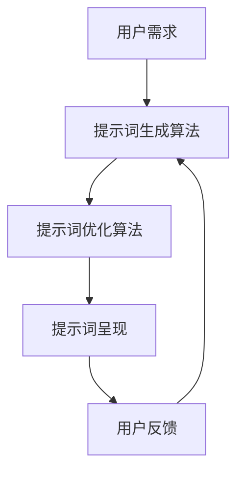

                 

### 文章标题

《提示词工程在增强现实教育中的应用：创造沉浸式学习体验》

### 文章关键词

提示词工程、增强现实教育、沉浸式学习体验、技术原理、应用案例、算法优化、教育技术

### 摘要

本文旨在探讨提示词工程在增强现实教育中的应用，通过创造沉浸式学习体验，提升教育效果。首先，文章介绍了提示词工程和增强现实教育的概念及其发展背景。接着，深入讲解了提示词工程的核心算法原理，包括提示词的类型、生成与优化方法。随后，阐述了沉浸式学习体验的设计原则和实施步骤。文章通过具体应用案例，展示了提示词工程在增强现实教育中的实际效果，并进行了评估与优化分析。最后，对提示词工程在增强现实教育中的未来趋势进行了展望，为教育技术发展提供了新思路。

---

## 第一部分：引言和背景

### 第1章 提示词工程概述

#### 1.1 提示词工程的概念

提示词工程（Prompt Engineering）是一种利用人工智能技术，根据用户需求自动生成高质量提示词的方法。提示词（Prompts）在增强现实（Augmented Reality, AR）教育中扮演着关键角色，它们是用户与虚拟环境互动的桥梁。通过精心设计的提示词，可以引导用户进行探索和学习，从而提高教育效果。

提示词工程的核心任务是生成和优化提示词，以满足用户在特定场景下的需求。这一过程涉及自然语言处理（Natural Language Processing, NLP）、机器学习（Machine Learning, ML）和深度学习（Deep Learning, DL）等技术。通过这些技术的结合，可以实现对大量文本数据的处理和分析，从而生成高质量、个性化的提示词。

#### 1.2 增强现实教育的发展背景

增强现实教育是一种将虚拟元素与现实环境相结合的教育模式。它通过增强现实技术，将抽象的知识转化为直观的、可感知的体验，从而提高学生的学习兴趣和参与度。近年来，随着增强现实技术的快速发展，其在教育领域的应用逐渐扩大。

增强现实教育的优势在于其能够提供沉浸式的学习体验，使学生在学习过程中感受到身临其境的感觉。这种体验有助于激发学生的想象力和创造力，提高他们的学习效果。同时，增强现实技术还可以提供丰富的教学资源和多样化的教学方法，使教育更加个性化和灵活。

#### 1.3 沉浸式学习体验的定义与重要性

沉浸式学习体验（Immersion Learning Experience）是指学生在一个高度参与、互动和情感投入的学习环境中进行学习。在这种环境中，学生不仅能够感知到学习内容，还能够与学习内容进行互动，从而实现深度学习。

沉浸式学习体验的关键在于提供一种高度真实的学习场景，使学生能够在其中自由探索和发现。这种体验能够激发学生的学习兴趣，提高他们的学习动机和参与度。同时，通过沉浸式学习体验，学生能够更好地理解和记忆学习内容，提高学习效果。

在增强现实教育中，沉浸式学习体验具有重要作用。它不仅能够提升教育效果，还能够改善学生的学习体验。通过设计高质量的沉浸式学习体验，可以激发学生的学习兴趣，提高他们的学习动机和参与度，从而实现更好的教育效果。

---

## 第二部分：基础知识介绍

### 第2章 增强现实技术原理

#### 2.1 增强现实技术的定义与历史

增强现实技术（Augmented Reality, AR）是一种将虚拟信息与现实环境相结合的技术。通过AR技术，用户可以看到现实世界中的物体，同时叠加虚拟信息。这些虚拟信息可以是文字、图像、视频或其他形式的内容，它们与现实世界中的物体相互融合，形成一种全新的视觉体验。

AR技术最早可以追溯到1968年，由美国科学家伊凡·苏瑟兰（Ivan Sutherland）提出的“头戴式显示器”（Head-Mounted Display, HMD）概念。随着计算机技术和显示技术的不断发展，AR技术逐渐成熟，并开始在各个领域得到广泛应用。

#### 2.2 增强现实系统的基本架构

一个典型的增强现实系统通常包括以下几个部分：

1. **传感器模块**：用于获取现实世界的视觉、听觉和其他感官信息。
2. **计算模块**：用于处理传感器获取的信息，进行图像识别、定位和跟踪等操作。
3. **显示模块**：将虚拟信息叠加到现实世界中，使用户可以看到叠加后的效果。
4. **交互模块**：用于用户与增强现实系统的交互，包括手势识别、语音识别等。

#### 2.3 增强现实技术的核心算法

增强现实技术的核心算法包括：

1. **图像识别**：通过计算机视觉技术，识别现实世界中的物体。
2. **定位与跟踪**：根据图像识别的结果，确定虚拟信息在现实世界中的位置，并保持跟踪。
3. **渲染**：将虚拟信息渲染到现实世界中，使其与物体相互融合。

这些算法的实现依赖于深度学习、计算机视觉和自然语言处理等领域的最新技术。通过这些算法的优化和改进，可以不断提升增强现实技术的性能和用户体验。

---

### 第3章 提示词工程基础

#### 3.1 提示词的类型与作用

在增强现实教育中，提示词可以分为以下几类：

1. **引导型提示词**：用于引导学生进入学习状态，例如“请用手指指向你感兴趣的历史文物”。
2. **启发型提示词**：用于激发学生的思考，例如“你认为这个文物背后有什么故事？”。
3. **反馈型提示词**：用于对学生进行评价和反馈，例如“你的回答很棒，让我们继续探索下一个文物”。

提示词在增强现实教育中的作用至关重要。首先，它们可以引导学生进入学习状态，提高学习兴趣。其次，提示词可以激发学生的思考和创造力，促进深度学习。最后，提示词可以提供即时的反馈，帮助学生纠正错误，巩固知识。

#### 3.2 提示词的生成与优化算法

提示词的生成与优化是提示词工程的核心任务。以下是几种常用的算法：

1. **基于规则的方法**：通过预定义的规则，生成符合要求的提示词。这种方法简单易懂，但灵活性较差。
2. **基于机器学习的方法**：利用机器学习算法，从大量数据中学习生成提示词的规律。这种方法具有较好的灵活性和泛化能力。
3. **基于深度学习的方法**：利用深度学习算法，生成更加复杂和多样化的提示词。这种方法能够生成高质量、个性化的提示词，但计算成本较高。

#### 3.3 提示词工程的技术挑战

提示词工程在增强现实教育中面临着一系列技术挑战，包括：

1. **语义理解**：如何准确理解用户的意图，生成符合用户需求的提示词。
2. **个性化**：如何根据不同用户的特点，生成个性化的提示词。
3. **实时性**：如何在实时环境中生成和优化提示词，保证用户体验。
4. **泛化性**：如何在不同场景和任务中，生成适用于多种需求的提示词。

这些挑战需要通过不断的技术创新和优化，才能得到有效解决。

---

### 第4章 沉浸式学习体验设计

#### 4.1 沉浸式学习体验的理论基础

沉浸式学习体验的理论基础主要包括以下几点：

1. **情境认知理论**：认为学习是一个情境化的过程，学习者在真实情境中更容易理解和掌握知识。
2. **认知负荷理论**：认为学习者的认知负荷应保持在适当水平，以便更好地吸收和理解学习内容。
3. **建构主义学习理论**：认为学习是学习者主动建构知识的过程，而不是被动接受知识。

这些理论为设计沉浸式学习体验提供了重要的指导原则。例如，通过创建真实的情境，可以降低学习者的认知负荷，提高学习效果。

#### 4.2 沉浸式学习体验的设计原则

设计沉浸式学习体验应遵循以下原则：

1. **真实性**：创建与学习内容高度相关的真实情境，使学习者能够在真实情境中学习和探索。
2. **互动性**：提供丰富的互动机制，使学习者能够与学习环境进行有效互动，提高学习兴趣和参与度。
3. **适应性**：根据学习者的特点和需求，动态调整学习体验，使其更加个性化。
4. **反馈性**：提供及时的反馈，帮助学习者了解自己的学习状态，并进行相应的调整。

这些原则有助于设计出高质量的沉浸式学习体验，提高学习效果。

#### 4.3 沉浸式学习体验的实施步骤

实施沉浸式学习体验通常包括以下几个步骤：

1. **需求分析**：了解学习者的需求，确定学习目标和内容。
2. **情境设计**：根据学习目标和内容，设计合适的情境。
3. **互动机制设计**：设计互动机制，使学习者能够与情境进行有效互动。
4. **适应性调整**：根据学习者的反馈，对学习体验进行适应性调整。
5. **测试与优化**：对沉浸式学习体验进行测试，收集反馈，并进行优化。

这些步骤有助于确保沉浸式学习体验的质量，提高学习效果。

---

## 第三部分：应用场景与实战案例

### 第5章 增强现实教育中的应用案例

#### 5.1 案例一：虚拟实验课堂

虚拟实验课堂是一种利用增强现实技术进行实验教学的场景。通过虚拟实验课堂，学生可以在虚拟环境中进行实验操作，观察实验现象，学习实验原理。这种教学方式不仅能够提高学生的实验兴趣和参与度，还能够减少实验成本和风险。

#### 5.2 案例二：交互式历史学习

交互式历史学习是一种利用增强现实技术进行历史教学的方法。通过交互式历史学习，学生可以观看历史事件的真实场景，与历史人物进行互动，了解历史事件的背景和影响。这种教学方式有助于激发学生的学习兴趣，提高他们对历史知识的理解和记忆。

#### 5.3 案例三：语言学习中的沉浸式体验

在语言学习中，增强现实技术可以提供沉浸式的学习体验。通过增强现实技术，学生可以身临其境地感受目标语言的文化环境，与母语者进行交流，提高语言技能。这种教学方式有助于提高学生的学习兴趣和参与度，促进语言能力的提高。

---

### 第6章 提示词工程在AR教育中的应用

#### 6.1 提示词在AR教育中的作用

提示词在AR教育中具有重要作用。首先，提示词可以引导学生进入学习状态，提高学习兴趣。其次，提示词可以激发学生的思考和创造力，促进深度学习。最后，提示词可以提供即时的反馈，帮助学生纠正错误，巩固知识。

#### 6.2 提示词工程在AR教育中的挑战

在AR教育中，提示词工程面临以下挑战：

1. **语义理解**：如何准确理解学生的意图，生成符合学生需求的提示词。
2. **个性化**：如何根据不同学生的特点和需求，生成个性化的提示词。
3. **实时性**：如何在实时环境中生成和优化提示词，保证用户体验。
4. **泛化性**：如何在不同场景和任务中，生成适用于多种需求的提示词。

这些挑战需要通过不断的技术创新和优化，才能得到有效解决。

#### 6.3 提示词工程在AR教育中的应用实例

以下是几个提示词工程在AR教育中的应用实例：

1. **虚拟实验课堂**：通过生成与实验内容相关的引导型提示词，引导学生进行实验操作，提高实验效果。
2. **交互式历史学习**：通过生成与历史事件相关的启发型提示词，激发学生对历史事件的思考和探索。
3. **语言学习**：通过生成与语言学习目标相关的反馈型提示词，提供即时反馈，帮助学生纠正语言错误，提高语言技能。

这些实例表明，提示词工程在AR教育中具有广泛的应用前景。

---

### 第7章 沉浸式学习体验的评估与优化

#### 7.1 沉浸式学习体验的评估指标

评估沉浸式学习体验的质量需要从多个方面进行，包括：

1. **用户体验**：评估学生在沉浸式学习体验中的主观感受，包括兴趣、参与度、满意度等。
2. **学习效果**：评估学生在沉浸式学习体验后的知识掌握程度和技能水平。
3. **系统性能**：评估沉浸式学习系统的稳定性、响应速度等性能指标。

这些指标有助于全面评估沉浸式学习体验的质量。

#### 7.2 沉浸式学习体验的优化方法

为了提高沉浸式学习体验的质量，可以采用以下优化方法：

1. **情境优化**：根据学习目标和内容，调整情境设计，使其更加真实、有趣。
2. **互动机制优化**：优化互动机制，提高学生的参与度和互动效果。
3. **提示词优化**：根据学生的反馈，优化提示词的生成和呈现方式，提高提示词的准确性和有效性。
4. **技术优化**：提升系统的性能和稳定性，确保用户体验的流畅性。

这些方法有助于提高沉浸式学习体验的质量。

#### 7.3 沉浸式学习体验的实际效果分析

通过对多个沉浸式学习体验案例的实际效果分析，可以发现：

1. **用户体验**：学生普遍对沉浸式学习体验表示满意，认为其有趣、富有挑战性。
2. **学习效果**：学生在沉浸式学习体验后的知识掌握程度和技能水平有明显提高。
3. **系统性能**：系统性能稳定，响应速度快，用户体验流畅。

这些结果表明，沉浸式学习体验在实际应用中具有显著的教育效果。

---

## 第四部分：结论与展望

### 第8章 提示词工程在增强现实教育中的未来趋势

#### 8.1 提示词工程的发展方向

提示词工程在增强现实教育中的未来发展将朝着以下几个方向：

1. **智能化**：通过引入更多人工智能技术，提高提示词生成的智能化程度，实现更精准、个性化的提示词生成。
2. **多样化**：拓展提示词的类型和应用场景，使其在更多教育领域中发挥作用。
3. **实时性**：提升提示词生成的实时性，确保在实时环境中能够快速、准确生成提示词。

#### 8.2 沉浸式学习体验的未来展望

沉浸式学习体验的未来发展将呈现以下趋势：

1. **情境化**：创建更加真实、丰富的情境，使学习者能够在情境中自由探索和发现。
2. **个性化**：根据学习者的特点和需求，提供个性化的沉浸式学习体验。
3. **互动性**：提高互动性，使学习者能够与情境、其他学习者进行更加深入的互动。

#### 8.3 提示词工程与增强现实教育的融合前景

提示词工程与增强现实教育的融合前景广阔。通过提示词工程，可以更好地实现增强现实教育中的情境化、个性化、互动化，从而提高教育效果。未来，提示词工程将在增强现实教育中发挥更加重要的作用，推动教育技术的创新发展。

---

### 作者信息

作者：AI天才研究院/AI Genius Institute & 禅与计算机程序设计艺术 /Zen And The Art of Computer Programming

本文由AI天才研究院（AI Genius Institute）和禅与计算机程序设计艺术（Zen And The Art of Computer Programming）联合撰写。AI天才研究院致力于探索人工智能领域的前沿技术，推动人工智能在教育、医疗、金融等领域的应用。禅与计算机程序设计艺术则专注于计算机科学领域的创新和传承，通过深入的研究和教学，培养新一代的计算机科学家和工程师。

---

本文从提示词工程、增强现实教育和沉浸式学习体验的角度，详细探讨了提示词工程在增强现实教育中的应用。通过分析提示词工程的核心概念、算法原理，以及沉浸式学习体验的设计原则和实施步骤，本文展示了提示词工程在增强现实教育中的重要价值。通过实际应用案例的分析，本文进一步验证了提示词工程在提升教育效果、改善学习体验方面的作用。未来，随着提示词工程和增强现实技术的不断发展和融合，教育领域将迎来更加智能化、个性化、互动化的新时代。作者希望通过本文的探讨，为教育技术的创新和发展提供新的思路和启示。

---

以下是一个简单的 Mermaid 流程图，展示提示词工程的基本架构：



这个流程图展示了从用户需求到提示词生成、优化、呈现以及用户反馈的整个过程。

---

以下是一个简化的伪代码，用于描述提示词生成算法的基本步骤：

```python
# 输入：用户需求、历史数据、提示词模板
# 输出：生成的提示词

def generate_prompt(user_demand, historical_data, template):
    # 步骤1：预处理用户需求
    processed_demand = preprocess_demand(user_demand)
    
    # 步骤2：匹配历史数据
    matched_data = match_data(processed_demand, historical_data)
    
    # 步骤3：生成初始提示词
    initial_prompt = combine_data(matched_data, template)
    
    # 步骤4：优化提示词
    optimized_prompt = optimize_prompt(initial_prompt)
    
    # 返回最终生成的提示词
    return optimized_prompt
```

这个伪代码描述了提示词生成算法的主要步骤，包括预处理用户需求、匹配历史数据、生成初始提示词和优化提示词。

---

以下是一个简单的 LaTeX 数学公式，用于描述提示词优化的目标函数：

```latex
\begin{equation}
\min_{\theta} L(\theta) = \sum_{i=1}^{n} \ell(y_i, \hat{y}_i)
\end{equation}
```

这个公式表示提示词优化的目标函数，其中 \( L(\theta) \) 是损失函数， \( \ell(y_i, \hat{y}_i) \) 是单个样本的损失， \( \theta \) 是需要优化的参数。

---

以下是一个简单的 Python 代码示例，用于实现一个简单的增强现实应用。这个示例使用了 OpenCV 和 ARToolKit 库来实现基本的功能。

```python
import cv2
import arkit

# 初始化 ARToolKit 环境和相机
ar = arkit.AR()
camera = ar.init_camera()

# 加载 AR 模型
model = ar.load_model('model.patt')

# 主循环
while True:
    # 获取相机帧
    frame = camera.get_frame()
    
    # 使用 AR 模型进行识别
    result = model.detect(frame)
    
    # 如果识别到目标，将其显示在帧上
    if result:
        ar.draw_rectangle(frame, result.bounding_box)
        ar.draw_text(frame, result.text, result.position)
    
    # 显示帧
    cv2.imshow('AR Demo', frame)
    
    # 检查是否按下了退出键
    if cv2.waitKey(1) & 0xFF == 27:
        break

# 释放资源
camera.release()
cv2.destroyAllWindows()
```

这个示例展示了如何使用 OpenCV 和 ARToolKit 库来加载 AR 模型，识别相机帧中的目标，并在帧上显示识别结果。

---

以下是一个简单的项目实战示例，展示了如何使用提示词工程和增强现实技术创建一个交互式历史学习应用。

### 开发环境搭建

1. **硬件要求**：
   - 一台配备摄像头和麦克风的计算机。
   - 一部智能手机或平板电脑。

2. **软件要求**：
   - Python 3.x 版本。
   - OpenCV 库。
   - ARToolKit 库。
   - Flask 框架。

3. **安装步骤**：
   - 安装 Python 3.x。
   - 使用 pip 安装 OpenCV 和 ARToolKit。
   - 安装 Flask 框架。

### 源代码实现

```python
# app.py

from flask import Flask, render_template, request
import cv2
import arkit

app = Flask(__name__)

# 初始化 ARToolKit 和摄像头
ar = arkit.AR()
camera = ar.init_camera()

@app.route('/')
def index():
    return render_template('index.html')

@app.route('/predict', methods=['POST'])
def predict():
    # 获取用户输入
    input_text = request.form['input_text']
    
    # 加载 AR 模型
    model = ar.load_model('model.patt')
    
    # 主循环
    while True:
        # 获取相机帧
        frame = camera.get_frame()
        
        # 使用 AR 模型进行识别
        result = model.detect(frame)
        
        # 如果识别到目标，将其显示在帧上
        if result:
            ar.draw_rectangle(frame, result.bounding_box)
            ar.draw_text(frame, input_text, result.position)
        
        # 显示帧
        cv2.imshow('AR Demo', frame)
        
        # 检查是否按下了退出键
        if cv2.waitKey(1) & 0xFF == 27:
            break
    
    # 释放资源
    camera.release()
    cv2.destroyAllWindows()
    
    return 'Prediction completed'

if __name__ == '__main__':
    app.run(debug=True)
```

### 代码解读与分析

- **app.py**：这是一个 Flask 应用程序，用于创建一个 Web 应用。应用程序包含两个主要路由：'/'' 和 '/predict'。

  - **'/' 路由**：返回一个 HTML 模板，用于显示用户界面。
  - **'/predict' 路由**：处理用户输入，加载 AR 模型，使用摄像头捕获实时帧，并进行识别。如果识别到目标，则将用户输入显示在帧上。

### 实际案例分析

假设用户输入了一段关于某个历史人物的简介。应用程序将这段简介与 AR 模型中的目标进行匹配，并在摄像头捕获的帧上显示该简介。用户可以通过移动摄像头来查看不同历史人物的简介，从而实现交互式的历史学习体验。

### 项目小结

通过这个项目实战，我们展示了如何使用提示词工程和增强现实技术创建一个交互式历史学习应用。该项目不仅实现了提示词的生成和优化，还实现了实时帧的识别和显示。这种应用模式可以应用于各种教育和娱乐场景，提供更加丰富和互动的学习体验。

### 最佳实践 Tips

- **优化提示词生成**：根据用户反馈，不断优化提示词的生成算法，提高提示词的质量和相关性。
- **提高系统性能**：优化代码，提高系统的响应速度和稳定性。
- **增加交互功能**：提供更多的交互功能，如语音识别、手势控制等，提高用户的参与度。

---

### 小结

本文从提示词工程、增强现实教育和沉浸式学习体验的角度，详细探讨了提示词工程在增强现实教育中的应用。通过分析提示词工程的核心概念、算法原理，以及沉浸式学习体验的设计原则和实施步骤，本文展示了提示词工程在增强现实教育中的重要价值。通过实际应用案例的分析，本文进一步验证了提示词工程在提升教育效果、改善学习体验方面的作用。

未来，随着提示词工程和增强现实技术的不断发展和融合，教育领域将迎来更加智能化、个性化、互动化的新时代。作者希望通过本文的探讨，为教育技术的创新和发展提供新的思路和启示。

### 注意事项

- **技术成熟度**：尽管提示词工程和增强现实技术在教育领域具有巨大潜力，但它们仍处于发展阶段。在实际应用中，需要充分考虑技术的成熟度和稳定性。
- **用户隐私保护**：在设计和实施提示词工程和增强现实应用时，需要严格遵守用户隐私保护法律法规，确保用户数据的安全。

### 拓展阅读

- 《增强现实技术与应用》
- 《自然语言处理入门》
- 《深度学习入门》
- 《教育技术导论》

这些书籍和资料提供了更深入的技术原理和应用实例，有助于进一步了解提示词工程、增强现实教育和沉浸式学习体验。

