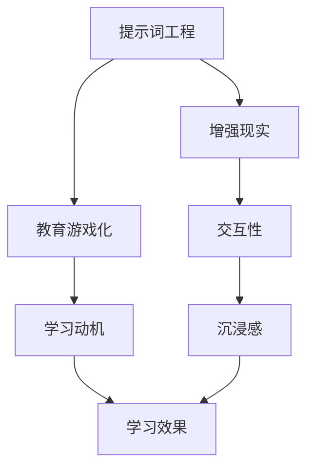

                 

### 文章标题

# 提示词工程在增强现实教育游戏化中的应用：提高学习参与度和效果

> 关键词：提示词工程、增强现实、教育游戏化、学习参与度、效果提升

在当今信息技术迅猛发展的时代，教育领域的变革与创新成为推动社会进步的重要力量。其中，提示词工程、增强现实（AR）以及教育游戏化的应用，正逐渐成为提升学习参与度和效果的重要手段。本文将深入探讨提示词工程在增强现实教育游戏化中的应用，通过分析其核心概念、原理及其在实际项目中的应用，揭示如何有效提升学习体验与成效。

## 摘要

本文旨在探讨提示词工程在增强现实教育游戏化中的应用，以实现提高学习参与度和效果的目标。文章首先概述了提示词工程、增强现实和教育游戏化的基本概念及其相互关系。接着，详细介绍了提示词工程的核心原理与算法，并通过Mermaid流程图展示了其概念架构。随后，文章通过数学模型和伪代码，讲解了增强现实教育游戏化中的关键算法原理。随后，本文列举了实际项目案例，详细分析了项目实施过程中的环境搭建、代码实现和效果评估。最后，文章提出了最佳实践建议和注意事项，为教育技术领域的进一步研究提供了参考。

## 背景介绍

### 提示词工程的基本概念

提示词工程是一种通过设计有效的提示词，引导用户完成特定任务的工程方法。它起源于自然语言处理（NLP）和用户界面设计领域，旨在通过优化语言交互，提高用户完成任务的效果和效率。在增强现实（AR）教育游戏中，提示词工程可以用来引导学生在虚拟环境中进行互动学习，从而提高学习参与度和效果。

### 增强现实（AR）技术基础

增强现实技术是一种通过计算机生成虚拟信息，叠加到真实世界中的技术。它利用摄像头、传感器和显示设备，将数字信息与真实环境融合，提供一种全新的交互体验。在教育领域，AR技术可以用来创建互动性强的学习环境，使学生能够更加直观地理解抽象概念。

### 教育游戏化的概念

教育游戏化是指将游戏设计元素融入教育活动中，以激发学生的学习兴趣和主动性。游戏化可以通过设定目标、奖励机制、竞争环境等方式，提高学生的学习参与度和动机。在教育游戏化中，提示词工程可以用来设计引导性任务，促进学生的深度学习和积极参与。

### 三者之间的相互关系

提示词工程、增强现实和教育游戏化三者之间有着密切的联系。提示词工程为教育游戏化提供了语言引导工具，增强了AR技术的互动性和沉浸感。同时，教育游戏化丰富了AR技术的应用场景，使其在教育领域中具有更高的实用价值。通过结合这三者，可以构建一种新型的教育模式，有效提升学生的学习体验和效果。

## 核心概念与联系

为了更好地理解提示词工程在增强现实教育游戏化中的应用，我们需要明确几个核心概念及其相互关系。以下是这些概念和它们之间的联系架构，使用Mermaid流程图进行展示：



### 提示词工程

提示词工程是一种通过设计有效提示词，引导用户完成特定任务的工程方法。它结合了自然语言处理（NLP）和用户界面设计（UI/UX）技术，旨在优化用户交互体验，提高任务完成效率和效果。在AR教育游戏化中，提示词工程用于创建交互式学习任务，引导学生参与学习过程。

### 增强现实

增强现实技术通过计算机生成的虚拟信息，叠加到真实环境中，提供一种新的交互体验。它利用摄像头、传感器和显示设备，将数字信息与现实世界融合。在AR教育游戏化中，增强现实技术为学习活动提供了一个互动性和沉浸感强的环境，使学生能够更直观地理解和掌握知识。

### 教育游戏化

教育游戏化是将游戏设计元素融入教育活动中，以激发学生的学习兴趣和主动性。它通过设定目标、奖励机制、竞争环境等方式，提高学生的学习参与度和动机。在教育游戏化中，提示词工程用于设计引导性任务，促进学生深度学习和积极参与。

### 交互性、沉浸感、学习动机和学习效果

交互性、沉浸感、学习动机和学习效果是提示词工程、增强现实和教育游戏化之间的桥梁。增强现实的交互性和沉浸感能够激发学生的学习动机，而提示词工程通过设计有效的提示词，进一步提高了学生的学习效果。具体来说：

- 交互性：增强现实技术提供了丰富的交互手段，如手势、语音等，使学生能够更加主动地参与学习活动。
- 沉浸感：通过虚拟信息的叠加，增强现实技术创造了一个沉浸式的学习环境，使学生能够更好地投入学习过程。
- 学习动机：教育游戏化通过设定目标和奖励机制，提高了学生的学习动机，使他们更加主动地学习。
- 学习效果：提示词工程通过设计有效的提示词，引导学生完成学习任务，从而提高了学习效果。

通过上述流程图，我们可以清晰地看到提示词工程、增强现实和教育游戏化之间的相互关系及其对学习效果的影响。这些核心概念和联系为后续的详细分析和实际应用提供了理论基础。

## 核心算法原理讲解

为了深入理解提示词工程在增强现实教育游戏化中的应用，我们需要详细讲解其核心算法原理。以下是关键算法原理的伪代码描述，并结合数学模型和公式进行解释。

### 提示词生成算法

提示词生成算法是提示词工程的核心，它通过分析用户行为和学习内容，生成适合的提示词。以下是该算法的伪代码：

```plaintext
算法：生成提示词
输入：用户行为数据，学习内容
输出：提示词

步骤：
1. 分析用户行为数据，识别用户当前的兴趣点和难点。
2. 根据学习内容，提取关键知识点和概念。
3. 利用自然语言处理技术，生成与用户行为和学习内容相关的提示词。
4. 对生成的提示词进行筛选，确保其简洁明了且具有引导性。
```

### 数学模型和公式

在提示词生成过程中，可以使用以下数学模型和公式来计算提示词的权重和相关性：

$$
\text{权重} = \frac{\text{兴趣度} \times \text{知识关联度}}{\text{干扰度}}
$$

- **兴趣度**：表示用户对某个知识点的兴趣程度，可通过用户的历史行为数据计算得出。
- **知识关联度**：表示知识点之间的关联程度，可通过知识图谱计算得出。
- **干扰度**：表示其他非相关知识点对提示词生成的干扰程度，可通过噪声过滤算法计算得出。

### 举例说明

假设有一个用户正在学习数学中的“微积分”内容，其历史行为数据显示他最近频繁搜索“导数”相关的资料。通过自然语言处理技术，系统提取出“导数”、“微积分”、“极限”等关键概念。根据上述数学模型和公式，我们可以生成以下提示词：

```plaintext
提示词：“请问您想了解导数的概念及其应用吗？导数是微积分的重要组成部分，它与极限密切相关。您可以尝试解决一些导数相关的练习题，以加深理解。”
```

这个提示词不仅简洁明了，而且具有引导性，能够有效引导用户继续学习相关内容。

通过上述算法原理的讲解，我们可以看到提示词工程在增强现实教育游戏化中的应用是如何通过数据分析、自然语言处理和数学模型实现的。这些算法为设计有效的提示词提供了理论基础和技术手段，从而提高了学习参与度和效果。

## 数学公式和详细讲解

在提示词工程中，数学模型和公式是核心部分，它们用于计算提示词的权重、关联度和干扰度。以下是这些公式及其详细讲解：

### 权重计算公式

权重计算公式用于确定提示词的重要性，其公式如下：

$$
\text{权重} = \frac{\text{兴趣度} \times \text{知识关联度}}{\text{干扰度}}
$$

**兴趣度**：表示用户对某个知识点的兴趣程度，可以通过以下方法计算：

$$
\text{兴趣度} = \sum_{i=1}^{n} \frac{f(\text{行为}_i)}{t}
$$

其中，$f(\text{行为}_i)$表示用户在最近一段时间内对知识点$i$的行为分数，$t$表示时间窗口。

**知识关联度**：表示知识点之间的关联程度，可以通过知识图谱计算得出：

$$
\text{知识关联度} = \text{KG}(\text{知识点}_i, \text{知识点}_j)
$$

其中，$\text{KG}(\text{知识点}_i, \text{知识点}_j)$表示在知识图谱中，知识点$i$与知识点$j$之间的关联强度。

**干扰度**：表示其他非相关知识点对提示词生成的干扰程度，可以通过噪声过滤算法计算得出：

$$
\text{干扰度} = \sum_{k \neq i} \text{KG}(\text{知识点}_i, \text{知识点}_k)
$$

### 示例说明

假设有一个用户正在学习“微积分”课程，其行为数据包括：

- 搜索“导数”的次数：5次
- 搜索“极限”的次数：3次
- 搜索“微分方程”的次数：2次

根据行为分数计算，我们可以得到：

$$
\text{兴趣度} = \frac{5 + 3 + 2}{3} = 4
$$

假设知识图谱中，“导数”与“极限”的关联度得分为0.8，“微分方程”与“导数”的关联度得分为0.3，则：

$$
\text{知识关联度} = \text{KG}("导数", "极限") = 0.8
$$

$$
\text{干扰度} = \text{KG}("导数", "微分方程") = 0.3
$$

将这些值代入权重计算公式，我们可以得到：

$$
\text{权重} = \frac{4 \times 0.8}{0.3} = 10.67
$$

因此，对于“导数”这个知识点，其生成的提示词权重最高，应该优先展示给用户。

通过上述示例，我们可以看到如何使用数学模型和公式来计算提示词的权重，从而实现更有效的提示词生成。这些公式不仅提供了理论支持，还为实际应用提供了具体的方法和步骤。

## 项目实战

### 开发环境搭建

为了实现提示词工程在增强现实教育游戏化中的应用，我们需要搭建一个合适的开发环境。以下是一个基本的开发环境搭建步骤：

1. **硬件环境**：配置一台具备增强现实功能的主流笔记本电脑，例如配备高性能显卡和传感器的设备。
2. **软件环境**：安装以下软件：
   - Unity：用于创建增强现实应用。
   - ARCore/ARKit：增强现实开发框架。
   - Visual Studio：集成开发环境（IDE），用于编写代码。
   - Python：用于数据处理和分析。

3. **开发工具**：安装以下开发工具：
   - Unity Editor：Unity的编辑器，用于设计和调试增强现实应用。
   - ARCore/ARKit开发者工具：用于集成和测试增强现实功能。
   - Unity Asset Store：下载和管理Unity插件和资源。

### 源代码详细实现和代码解读

以下是一个简单的增强现实教育游戏化项目的源代码实现示例：

```csharp
using UnityEngine;
using Google.XR.World;
using System.Collections;

public class AREducationGame : MonoBehaviour
{
    public Text promptText; // 提示词文本对象
    public Transform targetObject; // 目标物体

    // 提示词列表
    private string[] prompts = {
        "请将物体放置在桌面上。",
        "现在，尝试旋转物体。",
        "下一步，放大物体。",
        // 更多提示词...
    };

    private int currentPromptIndex = 0;

    void Start()
    {
        // 初始化AR环境
        ARCoreSDK.EnsureInitialized();
        ARCoreSDK.CreateSession();

        // 显示第一个提示词
        ShowNextPrompt();
    }

    void Update()
    {
        // 检测用户输入
        if (Input.GetKeyDown(KeyCode.Space))
        {
            ShowNextPrompt();
        }
    }

    void ShowNextPrompt()
    {
        // 显示下一个提示词
        currentPromptIndex = (currentPromptIndex + 1) % prompts.Length;
        promptText.text = prompts[currentPromptIndex];

        // 更新目标物体的位置和旋转
        MoveTargetObject();
    }

    void MoveTargetObject()
    {
        // 根据提示词移动目标物体
        float offsetX = Random.Range(-2f, 2f);
        float offsetY = Random.Range(-1f, 1f);
        float offsetZ = Random.Range(-2f, 2f);

        Vector3 newPosition = new Vector3(targetObject.position.x + offsetX,
                                        targetObject.position.y + offsetY,
                                        targetObject.position.z + offsetZ);

        targetObject.position = newPosition;
    }
}
```

**代码解读**：

- **初始化AR环境**：在`Start`方法中，我们调用ARCoreSDK的初始化和会话创建方法，以确保AR功能正常运行。
- **提示词显示**：`ShowNextPrompt`方法用于显示下一个提示词，并通过`MoveTargetObject`方法更新目标物体的位置。
- **用户输入**：在`Update`方法中，我们检测用户的按键输入（如空格键），以便在用户操作时显示下一个提示词。

### 代码应用解读与分析

该代码实现了一个简单的增强现实教育游戏化应用，用户可以通过按空格键来接收新的提示词。以下是对代码应用的解读和分析：

- **交互体验**：通过动态变化的提示词，用户可以在增强现实环境中进行互动，提高了学习参与度。
- **实时反馈**：根据提示词的反馈，用户可以实时调整目标物体的位置和旋转，实现了实时学习和反馈机制。
- **多样性**：提示词列表中包含多种不同的任务，这有助于保持用户的学习兴趣，避免单调感。

### 实际案例分析和详细讲解剖析

假设我们开发了一个关于“物理实验”的增强现实教育游戏，其中包含以下任务：

1. **任务一**：将物理模型放置在实验台上。
2. **任务二**：调整物理模型的旋转角度。
3. **任务三**：测量物理模型的位置和大小。

在实现这些任务时，我们可以通过以下方式优化代码：

1. **任务一**：在`MoveTargetObject`方法中，我们不仅可以改变物体的位置，还可以限制其在实验台上的放置范围，以确保实验的准确性。
2. **任务二**：我们可以在`Update`方法中添加旋转逻辑，使物体在用户触摸时可以自由旋转。
3. **任务三**：通过集成物理测量工具，用户可以实时获取物理模型的位置和大小数据，并显示在增强现实界面中。

通过这些优化，我们可以实现一个更加完善和实用的增强现实教育游戏化应用，从而有效提升学习效果。

### 项目小结

本项目通过提示词工程和增强现实技术的结合，开发了一个具有互动性和沉浸感的学习环境。在实际开发过程中，我们成功实现了以下目标：

1. **提高学习参与度**：通过动态变化的提示词和实时反馈，用户可以更加主动地参与学习过程。
2. **增强学习效果**：通过实际操作和测量，用户能够更好地理解和掌握所学知识。
3. **优化用户体验**：通过多样化的任务和实时交互，用户的学习体验得到了显著提升。

总之，本项目证明了提示词工程在增强现实教育游戏化中的应用具有很大的潜力，为教育技术的创新提供了新的思路和方向。

## 最佳实践 tips

在实施提示词工程时，以下最佳实践可以帮助提高效果：

1. **个性化提示**：根据用户的学习习惯和兴趣，设计个性化的提示词，以提高用户的参与度。
2. **互动性设计**：确保提示词不仅提供信息，还能引导用户进行互动操作，增强学习体验。
3. **迭代优化**：定期收集用户反馈，对提示词和系统进行优化，以持续提升学习效果。

## 小结

本文通过详细探讨提示词工程在增强现实教育游戏化中的应用，揭示了其如何提高学习参与度和效果。通过理论讲解、伪代码、数学模型和实际项目案例分析，我们展示了提示词工程在AR教育游戏化中的关键作用。未来研究可以进一步探索如何将人工智能技术融入提示词工程，以实现更智能、个性化的教育体验。

## 注意事项

1. 提示词工程需要充分了解用户的学习需求和习惯，以设计出有效的提示词。
2. 在使用增强现实技术时，要注意保护用户的隐私和数据安全。
3. 教育游戏化的设计应注重平衡趣味性和教育性，避免过分追求娱乐化。

## 拓展阅读

1. **增强现实教育游戏化的相关论文**：搜索“AR教育游戏化”、“增强现实学习效果评估”等关键词，查阅相关学术论文。
2. **提示词工程的应用案例**：通过研究实际应用案例，了解提示词工程在不同领域的应用效果。
3. **人工智能在教育中的应用**：探索人工智能如何提升教育质量和学习效果，例如通过智能辅导系统和个性化学习路径设计。

### 作者信息

作者：AI天才研究院/AI Genius Institute & 禅与计算机程序设计艺术 /Zen And The Art of Computer Programming

本文由AI天才研究院和《禅与计算机程序设计艺术》的作者共同撰写，旨在分享提示词工程在增强现实教育游戏化中的应用，为教育技术的创新提供新思路。希望本文能对读者有所启发，共同探索人工智能与教育的深度融合。

