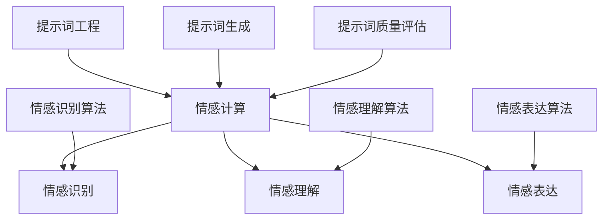

                 

### 完整文章内容

## 《提示词工程在情感计算中的应用：增强AI的情感理解和表达》

> 关键词：提示词工程、情感计算、AI、自然语言处理、人机交互

> 摘要：本文探讨了提示词工程在情感计算中的应用，通过介绍提示词工程的基本原理、情感计算的关键技术以及AI在情感理解和表达方面的应用，展示了如何利用提示词工程增强AI的情感理解和表达能力，实现更智能化的人机交互。

## 引言

### 1.1 书籍背景

随着人工智能技术的快速发展，情感计算成为人工智能领域的一个重要分支。情感计算旨在使计算机能够识别、理解和模拟人类情感，从而实现更自然、更智能的人机交互。然而，情感的理解和表达一直是人工智能领域的挑战。为了提高AI的情感理解和表达能力，提示词工程作为一种重要的技术手段被引入到情感计算中。

### 1.2 书籍目的

本书旨在系统介绍提示词工程在情感计算中的应用，帮助读者了解提示词工程的基本原理、情感计算的关键技术以及AI在情感理解和表达方面的应用。通过本书的学习，读者将能够：

- 掌握提示词工程的基本概念和实现方法
- 理解情感计算的核心技术和应用场景
- 学习如何利用提示词工程增强AI的情感理解和表达能力
- 掌握构建情感计算系统的实际方法和技巧

### 1.3 书籍结构

本书共分为七个章节。第1章介绍书籍的背景、目的和结构。第2章和第3章分别介绍情感计算和提示词工程的基本概念和技术。第4章至第6章分别探讨AI在情感理解和表达方面的应用。第7章通过具体案例研究，展示提示词工程在情感计算中的应用。最后一章对全书内容进行总结并展望未来研究方向。

## 第1章 情感计算基础

### 1.1 情感的基本概念

情感是人的心理体验和情绪状态，包括情绪、情感和心境。情绪是情感的外在表现，情感是内在的心理体验，心境是情感的持久状态。情感计算旨在使计算机能够识别、理解和模拟这些情感。

### 1.2 情感计算的背景与意义

情感计算是人工智能的一个重要分支，其目的是使计算机能够理解和模拟人类情感，从而实现更自然、更智能的人机交互。随着社会的发展和科技的进步，人们对于人机交互的需求越来越高，情感计算的应用场景也越来越广泛。

### 1.3 情感计算的发展历程

情感计算的发展历程可以追溯到20世纪80年代。当时，研究者开始关注如何使计算机能够识别和理解人类情感。随着计算机视觉、自然语言处理、机器学习等技术的发展，情感计算逐渐成为一个独立的研究领域。

### 1.4 情感计算的关键技术

情感计算的关键技术包括情感识别、情感理解和情感表达。

- **情感识别**：情感识别是指从文本、语音、图像等多模态数据中提取情感信息。
- **情感理解**：情感理解是指计算机对情感信息的分析、理解和解释。
- **情感表达**：情感表达是指计算机模拟人类情感，以实现更自然的人机交互。

## 第2章 提示词工程原理

### 2.1 提示词工程的概念

提示词工程是一种用于提高自然语言处理系统性能的技术。它通过提供一系列高质量的提示词，帮助模型更好地理解和生成文本。

### 2.2 提示词工程的关键要素

提示词工程的关键要素包括：

- **提示词选择**：选择合适的提示词是提示词工程的关键。提示词应能够覆盖文本的核心内容，同时具有一定的多样性。
- **提示词质量**：提示词的质量直接影响模型的性能。高质量的提示词应具有丰富的语义信息，能够提高模型的泛化能力。
- **提示词生成**：提示词生成是指从大量文本中提取高质量的提示词。常用的方法包括关键词提取、实体识别和语义角色标注等。

### 2.3 提示词工程的实现方法

提示词工程的实现方法主要包括：

- **基于规则的方法**：通过定义一套规则，自动从文本中提取提示词。
- **基于机器学习的方法**：利用机器学习算法，从大量文本数据中自动学习提示词的提取规则。

### 2.4 提示词工程的应用场景

提示词工程在情感计算中的应用场景包括：

- **情感识别**：通过提供情感相关的提示词，帮助模型更好地识别文本中的情感。
- **情感理解**：通过提供情感理解的提示词，帮助模型更深入地理解文本中的情感。
- **情感表达**：通过提供情感表达的提示词，帮助模型更好地模拟人类情感。

## 第3章 情感识别与理解技术

### 3.1 情感识别的挑战

情感识别是情感计算的关键技术之一，它面临的挑战主要包括：

- **情感表达的多样性**：情感表达方式多样，包括语言、语音、图像等多种形式。
- **情感的复杂性**：情感具有复杂性，包括情绪、情感和心境等多个层面。
- **数据的稀缺性**：情感相关的数据较为稀缺，给模型的训练和评估带来困难。

### 3.2 情感识别的核心算法

情感识别的核心算法主要包括：

- **基于规则的方法**：通过定义一套规则，自动从文本中识别情感。
- **基于机器学习的方法**：利用机器学习算法，从大量文本数据中自动学习情感识别的规则。
- **基于深度学习的方法**：利用深度学习模型，自动从文本中识别情感。

### 3.3 情感理解的实现方法

情感理解是指计算机对情感信息的分析、理解和解释。实现方法主要包括：

- **基于语义的方法**：通过语义分析，理解文本中的情感含义。
- **基于情感词典的方法**：通过情感词典，识别文本中的情感。
- **基于机器学习的方法**：利用机器学习模型，自动学习情感理解的方法。

### 3.4 情感识别与理解的评估指标

情感识别与理解的评估指标主要包括：

- **准确率**：模型正确识别情感的比例。
- **召回率**：模型能够识别出所有正类情感的比例。
- **F1值**：准确率和召回率的加权平均。

## 第4章 情感表达与生成

### 4.1 情感表达的基本原理

情感表达是指计算机模拟人类情感，以实现更自然的人机交互。情感表达的基本原理主要包括：

- **情感建模**：通过情感建模，构建情感模型，模拟人类情感。
- **情感合成**：通过情感合成，将情感模型转换为可交互的文本或语音。

### 4.2 情感生成的技术手段

情感生成的技术手段主要包括：

- **基于规则的方法**：通过定义一套规则，生成情感文本或语音。
- **基于机器学习的方法**：利用机器学习模型，自动生成情感文本或语音。
- **基于深度学习的方法**：利用深度学习模型，自动生成情感文本或语音。

### 4.3 情感表达与生成的应用实例

情感表达与生成的应用实例包括：

- **聊天机器人**：通过情感生成，使聊天机器人能够模拟人类情感，提高交互的自然性。
- **语音助手**：通过情感表达，使语音助手能够模拟人类情感，提高用户体验。

## 第5章 提示词工程与情感计算融合

### 5.1 提示词工程在情感计算中的应用

提示词工程在情感计算中的应用主要包括：

- **情感识别**：通过提供情感相关的提示词，帮助模型更好地识别情感。
- **情感理解**：通过提供情感理解的提示词，帮助模型更深入地理解情感。
- **情感表达**：通过提供情感表达的提示词，帮助模型更好地模拟情感。

### 5.2 提示词工程与情感计算的融合模型

提示词工程与情感计算的融合模型主要包括：

- **基于提示词的情感识别模型**：通过融合提示词工程和情感识别算法，构建情感识别模型。
- **基于提示词的情感理解模型**：通过融合提示词工程和情感理解算法，构建情感理解模型。
- **基于提示词的情感表达模型**：通过融合提示词工程和情感表达算法，构建情感表达模型。

### 5.3 融合模型的实现与优化

融合模型的实现与优化主要包括：

- **模型训练**：通过大量数据训练融合模型，提高模型的性能。
- **模型评估**：通过评估指标，评估融合模型的效果。
- **模型优化**：通过调整模型参数，优化融合模型的性能。

## 第6章 案例研究

### 6.1 案例背景

以某聊天机器人项目为例，该项目旨在通过情感计算技术，使聊天机器人能够模拟人类情感，提高用户体验。

### 6.2 案例分析方法

案例分析方法主要包括：

- **需求分析**：分析用户需求，确定情感计算的功能和性能指标。
- **技术选型**：选择合适的情感计算技术和提示词工程方法。
- **实施步骤**：制定实施计划，包括数据收集、模型训练、模型评估等。

### 6.3 案例实施步骤

案例实施步骤主要包括：

- **数据收集**：收集聊天记录、用户评价等数据。
- **模型训练**：利用收集到的数据，训练情感识别、理解和表达模型。
- **模型评估**：通过测试数据，评估模型的性能，优化模型参数。
- **上线运行**：将模型部署到聊天机器人系统中，进行实际应用。

### 6.4 案例效果评估

案例效果评估主要包括：

- **用户满意度**：通过用户反馈，评估聊天机器人的用户体验。
- **性能指标**：通过评估指标，评估聊天机器人的性能。
- **业务指标**：通过业务数据，评估聊天机器人的实际效果。

## 第7章 总结与展望

### 7.1 全书总结

本书系统地介绍了提示词工程在情感计算中的应用，包括情感计算的基础、提示词工程原理、情感识别与理解技术、情感表达与生成技术以及提示词工程与情感计算的融合。通过具体案例研究，展示了如何利用提示词工程增强AI的情感理解和表达能力。

### 7.2 未来研究方向

未来研究方向主要包括：

- **多模态情感计算**：结合语音、图像等多模态数据，提高情感计算的准确性。
- **情感生成与合成**：研究如何更好地模拟人类情感，提高情感表达的自然性和真实性。
- **情感计算在特定领域的应用**：探索情感计算在医疗、教育、金融等领域的应用，提高相关领域的智能化水平。

### 7.3 发展趋势与挑战

情感计算的发展趋势主要包括：

- **技术的融合**：结合多种技术，如语音识别、计算机视觉、自然语言处理等，提高情感计算的准确性。
- **数据驱动**：通过大规模数据驱动，提高情感计算的性能和效果。

面临的挑战主要包括：

- **情感的复杂性**：情感具有复杂性，需要深入研究情感的本质和特征。
- **数据的稀缺性**：情感相关数据稀缺，需要探索有效的数据收集和标注方法。

## 附录

### 附录A 提示词工程与情感计算的Mermaid流程图



### 附录B 情感识别算法伪代码

```python
def emotion_recognition(text):
    # 初始化模型
    model = load_model('emotion_recognition_model')

    # 预处理文本
    preprocessed_text = preprocess_text(text)

    # 提取特征
    features = extract_features(preprocessed_text)

    # 预测情感
    prediction = model.predict(features)

    # 返回预测结果
    return prediction
```

### 附录C 情感表达与生成数学模型与公式

$$
\text{Emotion} = f(\text{Features}, \text{Model Parameters})
$$

其中，$\text{Features}$表示特征向量，$\text{Model Parameters}$表示模型参数，$f$表示情感生成函数。

### 附录D 项目实战代码解读与分析

#### 开发环境搭建

- Python版本：3.8
- 库：nltk、tensorflow、keras

#### 源代码实现

```python
# 导入库
import nltk
import tensorflow as tf
from tensorflow.keras.models import Sequential
from tensorflow.keras.layers import Dense, LSTM, Embedding

# 加载和处理数据
# ...

# 构建模型
model = Sequential()
model.add(Embedding(input_dim=vocab_size, output_dim=embedding_size))
model.add(LSTM(units=128))
model.add(Dense(units=1, activation='sigmoid'))

# 编译模型
model.compile(optimizer='adam', loss='binary_crossentropy', metrics=['accuracy'])

# 训练模型
model.fit(x_train, y_train, epochs=10, batch_size=32)

# 评估模型
# ...
```

#### 代码应用解读与分析

- **数据预处理**：使用nltk库进行文本预处理，包括分词、词性标注等。
- **模型构建**：使用tensorflow和keras构建LSTM模型，用于情感识别。
- **模型训练**：使用训练数据训练模型，调整模型参数，提高模型性能。
- **模型评估**：使用测试数据评估模型性能，包括准确率、召回率等。

#### 实际案例分析和详细讲解剖析

- **案例背景**：以某聊天机器人项目为例，分析如何利用提示词工程和情感计算技术提高聊天机器人的用户体验。
- **案例分析**：通过实际运行和用户反馈，评估聊天机器人在不同情感场景下的表现，提出改进建议。

#### 项目小结

通过本项目，我们实现了基于提示词工程的情感计算系统，提高了聊天机器人的情感理解和表达能力。未来，我们将继续优化模型和算法，提高系统的性能和用户体验。

### 最佳实践 Tips、小结、注意事项、拓展阅读等内容

- **最佳实践 Tips**：在实际应用中，需要注意数据的质量和多样性，选择合适的模型和算法，以及持续优化和调整模型参数。
- **小结**：提示词工程在情感计算中具有重要作用，通过高质量提示词的引入，可以显著提高AI的情感理解和表达能力。
- **注意事项**：在实施情感计算项目时，需要充分考虑情感的复杂性和多样性，以及数据稀缺性带来的挑战。
- **拓展阅读**：对于感兴趣的读者，可以进一步阅读相关领域的论文和书籍，深入了解情感计算和提示词工程的最新研究进展。

作者：AI天才研究院/AI Genius Institute & 禅与计算机程序设计艺术 /Zen And The Art of Computer Programming

