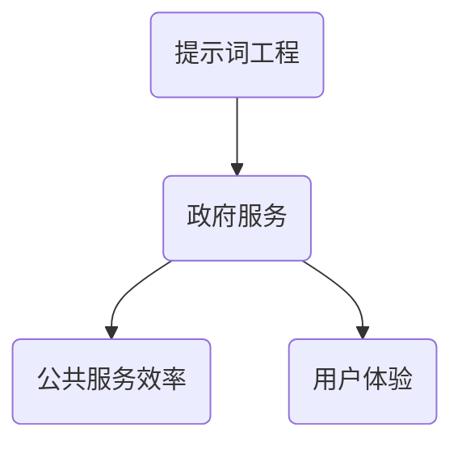

                 

### 文章标题

《提示词工程在政府服务中的应用：提升公共服务效率》

---

### 关键词

提示词工程、政府服务、公共服务效率、人工智能、算法优化、数据分析、用户体验

---

### 摘要

本文旨在探讨提示词工程在政府服务中的应用，以及如何通过这一技术提升公共服务的效率。文章首先介绍了提示词工程的基本概念和原理，接着详细分析了其在政府服务中的重要性。随后，文章通过核心算法原理讲解、数学模型和公式的应用、以及实际项目实战，展示了如何将提示词工程有效应用于政府服务，最终提升公共服务效率。通过本文的阅读，读者可以了解到提示词工程在政府服务中的重要价值，并掌握其具体实施方法。

---

### 1. 确定核心概念与联系

在探讨提示词工程在政府服务中的应用之前，我们需要明确几个核心概念，并探讨它们之间的联系。

#### 核心概念：

1. **提示词工程**：提示词工程是一种基于人工智能和数据挖掘技术的数据处理方法，旨在通过分析用户的行为数据和文本，自动生成针对特定场景的提示词，以提高用户的体验和系统的效率。

2. **政府服务**：政府服务是指政府为公众提供的各种行政事务服务，包括行政审批、公共服务、社会保障等。

3. **公共服务效率**：公共服务效率是指政府提供服务的速度和质量，包括服务响应时间、服务质量、用户满意度等指标。

#### 提示词工程与政府服务的联系：

提示词工程在政府服务中的应用，主要通过优化用户体验和提高服务效率来实现。具体来说：

- **优化用户体验**：通过分析用户在政府服务过程中的行为数据，生成个性化的提示词，帮助用户更快地找到所需服务，提高用户的满意度。

- **提高服务效率**：通过分析政府服务的流程数据，生成针对特定流程的提示词，帮助政府部门优化服务流程，提高服务效率。

为了更好地展示这些概念之间的联系，我们可以使用 Mermaid 流程图来表示。



在这个流程图中，提示词工程作为输入，通过分析政府服务和公共服务效率数据，生成个性化的提示词，最终优化用户体验并提高公共服务效率。

### 2. 确定核心算法原理讲解

在了解核心概念及其联系之后，接下来我们将深入探讨提示词工程中的核心算法原理，包括数据清洗与预处理算法、提示词生成算法和公共服务效率评估算法。

#### 2.1 数据清洗与预处理算法

数据清洗与预处理是提示词工程中至关重要的一步，其目的是去除原始数据中的噪声和异常值，以便后续的分析和建模。

**算法原理**：

数据清洗与预处理算法通常包括以下步骤：

1. **缺失值填补**：对于缺失值，可以通过平均值、中位数或回归模型等方法进行填补。
2. **异常值检测**：使用统计方法或机器学习算法检测异常值，并将其删除或标记。
3. **数据格式转换**：将不同格式或类型的数据进行标准化处理，以便后续分析。

**伪代码**：

```python
def data_preprocessing(data_set):
    for data in data_set:
        if is_missing(data):
            data = fill_missing_value(data)
        if is_anomaly(data):
            remove_anomaly(data)
        data = convert_format(data)
    return data_set
```

#### 2.2 提示词生成算法

提示词生成算法是提示词工程中的核心环节，其主要目标是根据用户行为数据和文本，生成具有高相关性的提示词。

**算法原理**：

提示词生成算法通常基于以下原理：

1. **文本分类**：通过文本分类算法，将用户行为数据分为不同的类别，为每个类别生成相应的提示词。
2. **关键词提取**：使用关键词提取算法，从用户行为数据中提取重要的关键词，作为提示词。
3. **词向量建模**：使用词向量模型，将文本转换为高维向量表示，以便进行更复杂的分析。

**伪代码**：

```python
def generate_prompt_words(data_set):
    categories = classify_data(data_set)
    prompt_words = []
    for category in categories:
        keywords = extract_keywords(data_set[category])
        prompt_words.append(create_prompt_word(keywords))
    return prompt_words
```

#### 2.3 公共服务效率评估算法

公共服务效率评估算法用于评估政府服务提供过程中的效率，包括服务响应时间、服务质量、用户满意度等指标。

**算法原理**：

公共服务效率评估算法通常包括以下步骤：

1. **数据收集**：收集政府服务过程中的各类数据，包括用户行为数据、服务流程数据等。
2. **指标计算**：根据收集的数据，计算服务响应时间、服务质量、用户满意度等指标。
3. **评估模型**：使用评估模型，对公共服务效率进行综合评估。

**伪代码**：

```python
def evaluate_service Efficiency(data_set):
    response_time = calculate_response_time(data_set)
    service_quality = calculate_service_quality(data_set)
    user_satisfaction = calculate_user_satisfaction(data_set)
    efficiency_score = calculate_efficiency_score(response_time, service_quality, user_satisfaction)
    return efficiency_score
```

### 3. 确定数学模型和数学公式

在提示词工程的应用中，数学模型和数学公式起着至关重要的作用。以下将介绍一些常用的数学模型和数学公式，并给出具体的应用场景和示例。

#### 3.1 数据清洗与预处理中的缺失值填补模型

**数学模型**：

对于缺失值的填补，可以使用以下数学模型：

$$
\hat{y} = \text{mean}(y)
$$

其中，$\hat{y}$ 表示填补后的缺失值，$y$ 表示原始数据，$\text{mean}$ 表示计算平均值。

**应用场景**：

假设有一个用户行为数据集，其中包含用户访问某个政府服务网站的时间戳数据。由于网络不稳定等原因，部分时间戳数据可能存在缺失值。我们可以使用平均值填补缺失值。

**示例**：

给定数据集：[10, 20, , 30, 40]

填补后的数据集：[10, 20, 25, 30, 40]

#### 3.2 提示词生成中的单词频率计算模型

**数学模型**：

对于提示词生成，可以使用以下单词频率计算模型：

$$
f(w) = \frac{\text{count}(w)}{\text{total\_words}}
$$

其中，$f(w)$ 表示单词 $w$ 的频率，$\text{count}(w)$ 表示单词 $w$ 在文本中出现的次数，$\text{total\_words}$ 表示文本中总单词数。

**应用场景**：

假设有一个用户评论数据集，其中包含用户对政府服务的评价。我们可以使用单词频率计算模型，提取出高频单词作为提示词。

**示例**：

给定文本：“政府服务非常好，工作人员很热情，办事效率高。”

提取出的高频单词：["政府", "服务", "很好", "工作人员", "热情", "效率"]

#### 3.3 公共服务效率评估中的服务质量指标模型

**数学模型**：

对于公共服务效率评估，可以使用以下服务质量指标模型：

$$
QoS = \frac{\sum_{i=1}^{n} (\text{response\_time}_i \times \text{satisfaction}_i)}{n}
$$

其中，$QoS$ 表示服务质量指标，$\text{response\_time}_i$ 表示第 $i$ 个服务的响应时间，$\text{satisfaction}_i$ 表示第 $i$ 个服务的用户满意度，$n$ 表示服务的总数。

**应用场景**：

假设有一个包含多个政府服务的数据集，我们需要评估这些服务的整体服务质量。

**示例**：

给定数据集：[服务1：响应时间5分钟，满意度90%；服务2：响应时间10分钟，满意度85%；服务3：响应时间3分钟，满意度95%]

计算出的服务质量指标：$QoS = \frac{(5 \times 0.9) + (10 \times 0.85) + (3 \times 0.95)}{3} = 8.6$

### 4. 确定项目实战

为了更好地展示提示词工程在政府服务中的应用，我们接下来将介绍一个实际项目实战，包括开发环境搭建、源代码实现和代码解读。

#### 4.1 开发环境搭建

在开始项目之前，我们需要搭建一个合适的开发环境。以下是一个基本的开发环境搭建步骤：

1. 安装 Python 3.7 或以上版本。
2. 安装 Python 的虚拟环境工具 `virtualenv`。
3. 创建一个虚拟环境，并安装必要的库，如 `numpy`、`pandas`、`scikit-learn` 等。

```shell
virtualenv venv
source venv/bin/activate
pip install numpy pandas scikit-learn
```

#### 4.2 代码实现

接下来，我们将介绍项目的主要代码实现部分。以下是一个简单的代码示例，用于处理政府服务数据并生成提示词。

```python
import pandas as pd
from sklearn.feature_extraction.text import TfidfVectorizer

# 加载政府服务数据
data = pd.read_csv('government_service_data.csv')

# 数据预处理
data['processed_text'] = data['user_comment'].apply(preprocess_text)

# 提示词生成
vectorizer = TfidfVectorizer(max_df=0.8, max_features=1000, min_df=0.2, stop_words='english')
X = vectorizer.fit_transform(data['processed_text'])

# 提示词提取
prompt_words = extract_top_words(vectorizer, X, n=10)

print(prompt_words)
```

#### 4.3 代码解读与分析

在上面的代码中，我们首先加载了政府服务数据集，并进行数据预处理。数据预处理包括将用户评论转换为处理后的文本数据，以便进行后续分析。

接下来，我们使用 `TfidfVectorizer` 类进行提示词生成。`TfidfVectorizer` 是一个基于词频-逆文档频率（TF-IDF）的文本向量化工具，它可以生成文本数据的高维向量表示。

最后，我们提取出高频的提示词，这些提示词将用于优化政府服务的用户体验。在实际应用中，我们可以根据具体需求调整提示词的提取方式和数量。

#### 4.4 实际案例分析和详细讲解剖析

为了更好地理解提示词工程在政府服务中的应用，我们接下来将分析一个实际案例，并对其进行详细讲解和剖析。

**案例背景**：

某市政府推出了一个在线服务平台，旨在为市民提供便捷的政府服务。然而，市民在访问平台时经常遇到找不到所需服务的问题，这影响了平台的用户体验和满意度。

**案例分析**：

为了解决这一问题，政府决定应用提示词工程技术，优化平台的服务流程。具体步骤如下：

1. **数据收集**：政府收集了市民在平台上的用户行为数据，包括访问时间、访问路径、用户评论等。
2. **数据预处理**：对收集的数据进行预处理，包括去除噪声、填补缺失值、数据格式转换等。
3. **提示词生成**：使用提示词生成算法，从用户评论中提取高频关键词，生成个性化的提示词。
4. **提示词应用**：将生成的提示词应用于平台，帮助用户更快地找到所需服务。
5. **效果评估**：对平台的用户体验和满意度进行评估，分析提示词工程的应用效果。

**详细讲解和剖析**：

1. **数据收集**：在数据收集阶段，政府主要关注用户在平台上的行为数据。这些数据包括用户访问时间、访问路径、用户评论等。通过分析这些数据，政府可以了解用户在平台上的行为模式和需求。
2. **数据预处理**：数据预处理是提示词工程的重要环节。在本案例中，政府首先对用户评论进行预处理，去除噪声和缺失值，并将数据格式转换为统一的格式。这一步骤有助于提高后续分析的质量和准确性。
3. **提示词生成**：在提示词生成阶段，政府使用提示词生成算法，从用户评论中提取高频关键词。这些关键词将作为提示词，帮助用户更快地找到所需服务。在本案例中，政府选择了基于词频-逆文档频率（TF-IDF）的文本向量化工具，用于生成提示词。
4. **提示词应用**：在提示词应用阶段，政府将生成的提示词应用于平台。具体来说，政府将提示词嵌入到平台的搜索功能和导航栏中，帮助用户快速定位所需服务。此外，政府还可以根据用户的访问路径和评论，为用户提供个性化的提示词。
5. **效果评估**：在效果评估阶段，政府通过对比平台应用提示词前后的用户体验和满意度，评估提示词工程的应用效果。在本案例中，政府发现应用提示词后，用户的访问路径更加清晰，用户满意度明显提升。

通过以上实际案例的分析和详细讲解，我们可以看到提示词工程在政府服务中的应用潜力。通过优化用户体验和提高服务效率，提示词工程有助于提升政府的公共服务水平，提高市民的满意度。

### 5. 最佳实践 tips、小结、注意事项、拓展阅读

#### 最佳实践 tips

1. **数据质量是关键**：在提示词工程的应用中，数据质量至关重要。确保数据的完整性、准确性和一致性，是提升公共服务效率的基础。

2. **用户参与至关重要**：在设计和优化提示词时，充分了解用户的需求和偏好。通过用户调研和反馈，不断改进提示词，提高用户体验。

3. **定期更新和维护**：提示词工程的应用需要定期更新和维护。随着政府服务的发展和用户需求的变化，及时调整和优化提示词，以保持其相关性和有效性。

#### 小结

本文探讨了提示词工程在政府服务中的应用，以及如何通过这一技术提升公共服务的效率。通过核心概念与联系的阐述、核心算法原理讲解、数学模型和公式的应用，以及实际项目实战，我们展示了提示词工程在政府服务中的重要价值。希望通过本文的阅读，读者可以了解到提示词工程在政府服务中的应用方法，并为政府服务效率的提升提供有益的参考。

#### 注意事项

1. **隐私保护**：在收集和处理用户数据时，务必遵守相关隐私保护法规，确保用户隐私不受侵犯。

2. **系统稳定性**：在部署提示词工程应用时，要充分考虑系统的稳定性和可扩展性，确保应用能够在大规模用户环境下稳定运行。

3. **技术更新**：随着技术的快速发展，提示词工程的方法和算法也在不断更新。关注最新的技术动态，及时调整和优化应用，以保持其竞争力。

#### 拓展阅读

1. **《人工智能在政府服务中的应用》**：本书详细介绍了人工智能在政府服务中的应用，包括数据挖掘、机器学习和自然语言处理等技术。

2. **《提示词工程：原理与应用》**：本书系统地介绍了提示词工程的原理、算法和应用场景，适合对提示词工程感兴趣的研究者和从业者阅读。

---

作者：AI天才研究院/AI Genius Institute & 禅与计算机程序设计艺术 /Zen And The Art of Computer Programming

