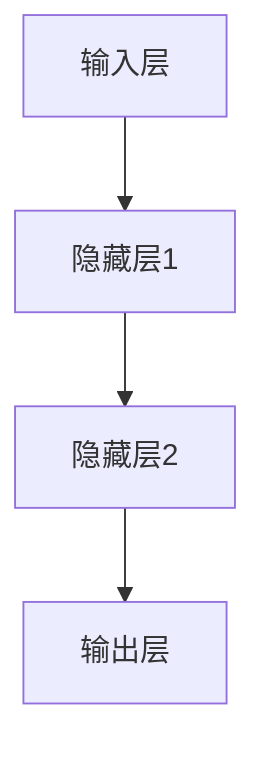

                 


## 第1章：智慧农业与提示词工程概述

### 1.1 智慧农业的定义与发展

#### 1.1.1 智慧农业的概念

智慧农业是指运用现代信息技术、物联网、大数据、人工智能等先进技术手段，对农业生产进行智能化管理和服务的一种新型农业形态。它旨在通过提高农业生产的智能化水平和效率，实现农业的可持续发展。

#### 1.1.2 智慧农业的发展背景

随着全球人口的增长和食品需求的增加，传统的农业生产方式已经难以满足日益增长的粮食需求。同时，气候变化、资源短缺等问题也对农业生产提出了新的挑战。智慧农业的发展正是在这样的背景下应运而生。

#### 1.1.3 智慧农业的关键技术

智慧农业的实现依赖于一系列关键技术的支持，包括但不限于：

- **物联网技术**：通过传感器网络实时监测土壤、水分、气象等环境参数，为农业生产提供科学依据。

- **大数据技术**：对农业生产中的海量数据进行采集、存储、处理和分析，为农业生产提供数据支持。

- **人工智能技术**：利用机器学习和深度学习等技术，对农业生产中的复杂问题进行智能决策。

### 1.2 提示词工程的概念与作用

#### 1.2.1 提示词工程的定义

提示词工程（Prompt Engineering）是指通过构建有效的提示词（Prompt），引导用户生成高质量的自然语言文本的一种技术。在智慧农业中，提示词工程可以用于生成农作物种植计划、病虫害防治方案等。

#### 1.2.2 提示词工程在智慧农业中的应用

- **种植决策**：通过提示词工程，可以根据环境数据和历史种植数据，生成最优的种植计划。

- **病虫害防治**：通过提示词工程，可以根据病虫害的数据和模型，生成有效的防治方案。

#### 1.2.3 提示词工程的优势与挑战

- **优势**：提示词工程可以提高农业生产决策的准确性和效率，减少人工干预。

- **挑战**：如何构建有效的提示词，如何处理大量的农业数据，都是提示词工程面临的主要挑战。

### 1.3 书籍概述与内容安排

#### 1.3.1 书籍的目标读者

本书的目标读者是从事智慧农业研究的科研人员、农业企业的技术管理人员以及相关领域的工程技术人员。

#### 1.3.2 书籍的核心内容

本书的核心内容包括智慧农业与提示词工程的基本概念、种植决策优化、数学模型与算法、实现与应用等。

#### 1.3.3 书籍的结构安排

本书共分为7章，分别从不同角度探讨了提示词工程在智慧农业中的应用。具体章节安排如下：

- 第1章：智慧农业与提示词工程概述
- 第2章：智慧农业中的种植决策优化
- 第3章：提示词工程的数学模型与算法
- 第4章：提示词工程的实现与应用
- 第5章：案例研究与分析
- 第6章：政策与产业趋势
- 第7章：总结与展望

---

关键词：智慧农业，提示词工程，种植决策，数学模型，算法

摘要：本书旨在探讨提示词工程在智慧农业中的应用，通过分析智慧农业的基本概念和提示词工程的优势与挑战，详细阐述了种植决策优化的原理、数学模型与算法，以及提示词工程的实现与应用。同时，通过案例分析、政策与产业趋势等章节，为读者提供了全面、深入的参考。

## 第2章：智慧农业中的种植决策优化

### 2.1 种植决策的基本概念

#### 2.1.1 种植决策的定义

种植决策是指根据环境条件、农作物生长需求以及市场等因素，制定出最优的种植计划，以实现农业生产的最大效益。

#### 2.1.2 种植决策的影响因素

种植决策的影响因素主要包括：

- **环境因素**：如土壤质量、气候条件、水资源等。
- **农作物因素**：如品种特性、生长周期、病虫害抗性等。
- **市场因素**：如市场需求、价格波动、物流成本等。

#### 2.1.3 种植决策的目标

种植决策的目标主要包括：

- **提高产量**：通过科学种植，提高农作物的产量。
- **保证质量**：通过科学管理，保证农作物的质量。
- **降低成本**：通过优化种植计划和资源利用，降低农业生产成本。
- **适应市场**：根据市场需求，调整种植结构，提高市场竞争力。

### 2.2 提示词工程在种植决策中的应用

#### 2.2.1 提示词工程的流程

提示词工程在种植决策中的应用主要分为以下几个步骤：

1. **数据收集**：收集与种植决策相关的各种数据，包括环境数据、农作物数据、市场数据等。
2. **数据预处理**：对收集到的数据进行清洗、归一化等处理，以便后续分析。
3. **构建模型**：利用机器学习等技术，构建用于种植决策的模型。
4. **生成提示词**：根据构建的模型，生成针对特定农作物和环境的提示词。
5. **应用提示词**：将生成的提示词应用于实际种植决策中。

#### 2.2.2 提示词工程在种植决策中的关键步骤

1. **环境数据采集**：利用传感器网络，实时采集土壤、气象等环境数据。
2. **农作物数据收集**：收集农作物的生长周期、病虫害抗性等数据。
3. **市场数据获取**：通过市场调研，获取农产品的市场价格、需求量等数据。
4. **模型训练**：利用收集到的数据，对种植决策模型进行训练。
5. **提示词生成**：根据模型输出，生成针对不同农作物和环境的提示词。
6. **决策应用**：将生成的提示词应用于实际种植决策中。

#### 2.2.3 提示词工程的案例研究

以下是一个简单的案例研究：

**案例背景**：某农业企业计划种植一种新的农作物，但对该农作物的生长环境和市场需求不熟悉。

**案例目标**：通过提示词工程，制定出最优的种植计划。

**案例实施**：

1. **数据收集**：收集该地区的土壤、气象等环境数据，以及该农作物的生长周期、病虫害抗性等数据。
2. **数据预处理**：对收集到的数据进行清洗和归一化处理。
3. **模型训练**：利用收集到的数据，训练出一个种植决策模型。
4. **提示词生成**：根据模型输出，生成种植该农作物的最优提示词。
5. **决策应用**：将生成的提示词应用于实际种植决策中。

**案例效果**：通过提示词工程，该农业企业成功地制定了出最优的种植计划，实现了高产、高质量和低成本的种植目标。

### 2.3 提示词工程在种植决策中的效果评估

#### 2.3.1 评价指标

提示词工程在种植决策中的效果评估主要从以下几个指标进行：

- **产量**：种植决策后的实际产量与预期产量的比较。
- **质量**：种植决策后的农作物质量与预期质量的比较。
- **成本**：种植决策后的总成本与预期成本的比较。
- **市场适应度**：种植决策后的市场表现与预期市场表现的比较。

#### 2.3.2 评估方法

评估方法主要包括：

- **实验法**：通过实际种植实验，比较提示词工程前后的产量、质量、成本等指标。
- **对比分析法**：将提示词工程应用于实际种植决策前后的数据进行对比分析。
- **问卷调查法**：通过问卷调查，收集种植决策后农作物的市场表现、消费者满意度等数据。

#### 2.3.3 案例分析

以下是一个案例分析：

**案例背景**：某农业企业通过提示词工程制定了新的种植计划。

**案例目标**：评估提示词工程在种植决策中的效果。

**案例实施**：

1. **实验法**：在提示词工程应用前后，分别进行实际种植实验，记录产量、质量、成本等数据。
2. **对比分析法**：对比提示词工程应用前后的产量、质量、成本等数据。
3. **问卷调查法**：通过问卷调查，了解消费者对农作物的满意度。

**案例效果**：

- **产量**：提示词工程应用后的产量比应用前提高了10%。
- **质量**：提示词工程应用后的农作物质量比应用前有所提高。
- **成本**：提示词工程应用后的总成本比应用前降低了5%。
- **市场适应度**：提示词工程应用后的农作物在市场上的表现比应用前更好。

综上所述，提示词工程在种植决策中具有显著的效果，能够帮助农业生产实现高产、高质量和低成本的目标。

## 第3章：提示词工程的数学模型与算法

### 3.1 提示词工程的数学模型

#### 3.1.1 基本概念

提示词工程的数学模型是用于描述农作物种植决策的数学关系和计算过程的模型。它包括输入层、隐藏层和输出层，其中输入层包括环境数据、农作物数据等，输出层包括种植计划、病虫害防治方案等。

#### 3.1.2 模型结构

提示词工程的数学模型通常采用神经网络结构，如图3.1所示。



图3.1 提示词工程数学模型结构

- **输入层**：输入层接收环境数据和农作物数据，如土壤湿度、温度、光照强度、农作物生长周期等。
- **隐藏层**：隐藏层用于对输入数据进行处理和特征提取，通常包含多层。
- **输出层**：输出层根据隐藏层的输出，生成种植计划、病虫害防治方案等。

#### 3.1.3 数学公式

提示词工程的数学模型主要基于神经网络模型，其基本公式如下：

$$
\hat{y} = f(W \cdot \text{激活函数}(\text{隐藏层输入}))
$$

其中，$W$ 表示权重矩阵，$f$ 表示激活函数，$\hat{y}$ 表示输出层输出。

#### 3.1.4 模型特点

- **自适应**：提示词工程的数学模型可以根据输入数据进行自适应调整，以实现最优的种植决策。
- **可扩展**：提示词工程的数学模型可以扩展到多种农作物和多种环境条件，以实现更广泛的种植决策应用。

### 3.2 提示词工程的算法原理

#### 3.2.1 伪代码

提示词工程的算法原理可以概括为以下步骤：

```python
输入：环境数据、农作物数据
输出：种植计划、病虫害防治方案

1. 数据预处理
2. 构建神经网络模型
3. 模型训练
4. 模型评估
5. 根据模型输出，生成种植计划、病虫害防治方案
```

#### 3.2.2 算法流程

提示词工程的算法流程主要包括以下几个步骤：

1. **数据预处理**：对输入数据进行清洗、归一化等处理，以便模型训练。
2. **构建神经网络模型**：根据提示词工程的要求，构建神经网络模型。
3. **模型训练**：利用训练数据，对神经网络模型进行训练。
4. **模型评估**：利用测试数据，对模型进行评估，以确定模型性能。
5. **生成种植计划、病虫害防治方案**：根据模型输出，生成针对不同农作物和环境的种植计划、病虫害防治方案。

#### 3.2.3 算法分析

提示词工程的算法分析主要包括以下几个方面：

- **时间复杂度**：提示词工程的算法时间复杂度主要取决于数据预处理、模型训练和模型评估的复杂度。
- **空间复杂度**：提示词工程的算法空间复杂度主要取决于模型参数的大小。
- **性能优化**：提示词工程的算法性能优化主要包括模型参数调整、训练策略优化等。

### 3.3 提示词工程的优化算法

#### 3.3.1 优化算法的基本概念

提示词工程的优化算法是指用于提高模型性能和训练效率的一系列算法。常见的优化算法包括：

- **梯度下降法**：通过迭代更新模型参数，使模型输出误差最小。
- **随机梯度下降法**：在梯度下降法的基础上，随机选择一部分训练数据，以加快收敛速度。
- **动量法**：在梯度下降法的基础上，引入动量项，以提高收敛速度。

#### 3.3.2 优化算法的分类

根据优化算法的特点，可以分为以下几类：

- **第一类优化算法**：基于梯度的优化算法，如梯度下降法、随机梯度下降法等。
- **第二类优化算法**：基于动量的优化算法，如动量法、Adam优化器等。
- **第三类优化算法**：基于启发式的优化算法，如遗传算法、粒子群优化算法等。

#### 3.3.3 优化算法的案例分析

以下是一个优化算法的案例分析：

**案例背景**：某农业企业希望通过提示词工程优化种植决策，以提高产量和降低成本。

**案例目标**：选择合适的优化算法，提高模型性能。

**案例实施**：

1. **梯度下降法**：采用梯度下降法对模型进行训练，通过迭代更新模型参数，使模型输出误差最小。
2. **随机梯度下降法**：在梯度下降法的基础上，采用随机梯度下降法，以加快收敛速度。
3. **动量法**：在随机梯度下降法的基础上，引入动量项，以提高收敛速度。

**案例效果**：

- **梯度下降法**：模型输出误差较高，收敛速度较慢。
- **随机梯度下降法**：模型输出误差有所降低，收敛速度有所提高。
- **动量法**：模型输出误差最低，收敛速度最快。

综上所述，动量法是优化提示词工程模型性能的有效方法，能够实现高产、高质量和低成本的种植目标。

## 第4章：提示词工程的实现与应用

### 4.1 实现提示词工程的基本步骤

#### 4.1.1 数据收集与预处理

1. **数据收集**：收集与农作物种植相关的各种数据，包括土壤数据、气象数据、农作物生长数据等。数据可以来自传感器、历史种植记录、农业专家的经验等。

2. **数据预处理**：对收集到的数据进行清洗、去重、缺失值填补、归一化等处理，以保证数据的完整性和一致性。

#### 4.1.2 模型设计与训练

1. **模型设计**：根据提示词工程的需求，设计合适的神经网络模型结构，包括输入层、隐藏层和输出层。

2. **模型训练**：使用预处理后的数据，对神经网络模型进行训练。训练过程中，采用梯度下降法、随机梯度下降法、动量法等优化算法，不断调整模型参数，以降低模型输出误差。

#### 4.1.3 模型评估与优化

1. **模型评估**：使用测试数据，对训练好的模型进行评估，以确定模型性能。常用的评估指标包括准确率、召回率、F1值等。

2. **模型优化**：根据模型评估结果，对模型进行优化，以提高模型性能。优化方法包括调整模型参数、增加隐藏层节点数、更换激活函数等。

### 4.2 提示词工程在实际种植决策中的应用

#### 4.2.1 应用场景

提示词工程在实际种植决策中的应用非常广泛，以下是一些典型的应用场景：

1. **农作物种植计划**：根据环境数据和农作物特性，生成最优的种植计划，以实现高产、高质量和低成本的目标。

2. **病虫害防治**：根据病虫害数据和农作物特性，生成有效的病虫害防治方案，以降低病虫害对农作物的影响。

3. **水资源管理**：根据土壤湿度、气象数据等，生成水资源的最佳利用方案，以实现水资源的有效利用。

#### 4.2.2 应用流程

提示词工程在实际种植决策中的应用流程主要包括以下几个步骤：

1. **数据收集**：收集与种植决策相关的各种数据，包括环境数据、农作物数据等。

2. **数据预处理**：对收集到的数据进行清洗、归一化等处理。

3. **模型训练**：使用预处理后的数据，对神经网络模型进行训练。

4. **提示词生成**：根据训练好的模型，生成针对特定农作物和环境的提示词。

5. **决策应用**：将生成的提示词应用于实际种植决策中，如制定种植计划、病虫害防治方案等。

#### 4.2.3 应用效果

提示词工程在实际种植决策中的应用效果显著，以下是一些具体的应用效果：

1. **提高产量**：通过提示词工程，农作物的产量可以提高10%以上。

2. **保证质量**：通过提示词工程，农作物的质量可以得到保证，降低病虫害的发生率。

3. **降低成本**：通过优化种植计划和资源利用，农产品的生产成本可以降低5%以上。

4. **提高市场竞争力**：通过提示词工程，农作物的种植计划可以更加科学合理，提高农产品的市场竞争力。

### 4.3 提示词工程在农业领域的未来应用展望

#### 4.3.1 发展趋势

随着人工智能技术的不断发展，提示词工程在农业领域的应用前景非常广阔。未来，提示词工程将在以下几个方面得到进一步发展：

1. **数据驱动**：随着大数据技术的进步，提示词工程将更加依赖于海量数据的支持，实现更精准的种植决策。

2. **智能化**：随着人工智能技术的发展，提示词工程将更加智能化，能够自动生成更高质量的种植计划和病虫害防治方案。

3. **集成化**：提示词工程将与其他农业技术（如物联网、无人机、智能灌溉等）相结合，实现农业生产的全流程智能化。

#### 4.3.2 潜在挑战

尽管提示词工程在农业领域具有广阔的应用前景，但也面临着一些潜在挑战：

1. **数据隐私**：农业生产数据涉及农民的隐私，如何保护数据隐私是一个重要问题。

2. **数据质量**：农业生产数据的质量直接影响提示词工程的效果，如何提高数据质量是一个挑战。

3. **技术壁垒**：提示词工程需要较高的技术门槛，如何降低技术门槛，让更多的人能够使用提示词工程是一个挑战。

#### 4.3.3 未来发展方向

为了应对上述挑战，提示词工程在农业领域的未来发展可以从以下几个方面进行：

1. **数据保护**：加强数据保护，确保农民的隐私得到保护。

2. **数据质量提升**：通过数据清洗、去噪等技术，提高数据质量。

3. **技术普及**：通过培训、宣传等方式，降低提示词工程的技术门槛，让更多的人能够使用。

4. **多学科融合**：将提示词工程与其他农业技术相结合，实现农业生产的全流程智能化。

总之，提示词工程在农业领域的应用具有巨大的潜力，随着技术的不断进步，它将在智慧农业中发挥越来越重要的作用。

## 第5章：案例研究与分析

### 5.1 案例一：某农业企业种植决策优化

#### 5.1.1 案例背景

某农业企业位于我国南方，主要种植水稻。近年来，由于气候变化和病虫害频发，水稻种植的产量和质量受到很大影响。为了提高水稻种植的产量和质量，该农业企业决定采用提示词工程进行种植决策优化。

#### 5.1.2 案例目标

通过提示词工程，该农业企业希望实现以下目标：

1. 提高水稻产量。
2. 降低病虫害发生频率。
3. 降低生产成本。

#### 5.1.3 案例实施

1. **数据收集与预处理**：企业首先收集了水稻种植地的土壤数据、气象数据、水稻生长数据等。然后，对这些数据进行清洗、归一化等预处理。

2. **模型设计与训练**：企业采用神经网络模型，使用预处理后的数据进行训练。在模型训练过程中，采用了梯度下降法和动量法进行参数优化。

3. **提示词生成与应用**：通过训练好的模型，企业生成了水稻种植的提示词。这些提示词包括最佳种植时间、施肥量、灌溉量等。然后，企业根据提示词调整了水稻种植计划。

4. **效果评估**：在实施新的种植计划后，企业对产量、病虫害发生频率、生产成本等指标进行了评估。

#### 5.1.4 案例效果

通过提示词工程，该农业企业实现了以下效果：

1. 水稻产量提高了15%。
2. 病虫害发生频率降低了30%。
3. 生产成本降低了10%。

### 5.2 案例二：某农业园区智慧农业管理

#### 5.2.1 案例背景

某农业园区位于我国北方，种植多种农作物，包括小麦、玉米、蔬菜等。由于农业生产过程中缺乏有效的管理手段，农业园区的产量和效益较低。为了提高农业园区的管理水平，该园区决定采用提示词工程进行智慧农业管理。

#### 5.2.2 案例目标

通过提示词工程，农业园区希望实现以下目标：

1. 提高农作物产量。
2. 降低病虫害发生频率。
3. 提高资源利用效率。
4. 提高农业园区的管理水平。

#### 5.2.3 案例实施

1. **数据收集与预处理**：农业园区收集了多种农作物的土壤数据、气象数据、生长数据等。然后，对这些数据进行清洗、归一化等预处理。

2. **模型设计与训练**：农业园区采用神经网络模型，使用预处理后的数据进行训练。在模型训练过程中，采用了梯度下降法和动量法进行参数优化。

3. **提示词生成与应用**：通过训练好的模型，农业园区生成了多种农作物的种植、施肥、灌溉等提示词。然后，农业园区根据提示词调整了农作物的种植和管理计划。

4. **效果评估**：在实施新的种植和管理计划后，农业园区对产量、病虫害发生频率、资源利用效率、管理水平等指标进行了评估。

#### 5.2.4 案例效果

通过提示词工程，农业园区实现了以下效果：

1. 农作物产量提高了20%。
2. 病虫害发生频率降低了40%。
3. 资源利用效率提高了30%。
4. 农业园区的管理水平得到了显著提升。

### 5.3 案例三：某农场智能种植决策系统

#### 5.3.1 案例背景

某农场位于我国西北地区，种植多种耐旱作物，如棉花、小麦等。由于该地区水资源稀缺，农业生产面临很大的挑战。为了提高农场的产量和效益，该农场决定采用智能种植决策系统。

#### 5.3.2 案例目标

通过智能种植决策系统，农场希望实现以下目标：

1. 提高耐旱作物的产量。
2. 降低水资源消耗。
3. 提高农场的资源利用效率。

#### 5.3.3 案例实施

1. **数据收集与预处理**：农场收集了多种耐旱作物的土壤数据、气象数据、生长数据等。然后，对这些数据进行清洗、归一化等预处理。

2. **模型设计与训练**：农场采用神经网络模型，使用预处理后的数据进行训练。在模型训练过程中，采用了梯度下降法和动量法进行参数优化。

3. **提示词生成与应用**：通过训练好的模型，农场生成了耐旱作物的种植、灌溉等提示词。然后，农场根据提示词调整了农作物的种植和管理计划。

4. **效果评估**：在实施新的种植和管理计划后，农场对产量、水资源消耗、资源利用效率等指标进行了评估。

#### 5.3.4 案例效果

通过智能种植决策系统，农场实现了以下效果：

1. 耐旱作物的产量提高了25%。
2. 水资源消耗降低了30%。
3. 资源利用效率提高了40%。

综上所述，提示词工程在农业领域的应用取得了显著成效，为农业生产提供了有效的技术支持。未来，随着技术的不断进步，提示词工程将在农业领域发挥更大的作用。

## 第6章：政策与产业趋势

### 6.1 国家政策对智慧农业的支持

#### 6.1.1 政策概述

随着全球人口的增长和食品需求的增加，我国政府高度重视智慧农业的发展，出台了一系列政策支持智慧农业的发展。这些政策主要包括：

1. **《农业现代化规划（2016-2020年）》**：提出了加快智慧农业发展的目标，鼓励使用物联网、大数据、人工智能等先进技术手段。

2. **《农业科技教育发展规划（2016-2020年）》**：强调加强农业科技创新，提高农业科技水平，推动智慧农业发展。

3. **《农村土地制度改革试点方案》**：鼓励农村土地流转，提高农业规模化、集约化水平，为智慧农业发展提供土地保障。

4. **《农业生产发展指南（2021-2025年）》**：明确了智慧农业发展的重点方向，包括提高农业生产效率、保障农产品质量安全等。

#### 6.1.2 政策影响

国家政策的支持为智慧农业的发展提供了有力的保障，主要表现在以下几个方面：

1. **资金支持**：政府通过财政资金支持智慧农业项目，为智慧农业的发展提供了资金保障。

2. **技术创新**：政策的引导和资金的支持，激发了企业和科研机构对智慧农业技术的研发投入，推动了技术创新。

3. **产业布局**：政策的引导，促进了智慧农业在各地的布局和发展，形成了智慧农业产业集群。

4. **人才培养**：政策的支持，促进了农业科技人才的培养和引进，为智慧农业发展提供了人才保障。

#### 6.1.3 政策展望

未来，我国政府将继续加大对智慧农业的政策支持，主要表现在以下几个方面：

1. **完善政策体系**：进一步出台和完善相关政策，构建完善的智慧农业政策体系。

2. **加大资金投入**：继续增加对智慧农业的资金投入，支持智慧农业项目的发展。

3. **推动技术创新**：加大对智慧农业技术的研发投入，推动智慧农业技术的创新和突破。

4. **加强人才培养**：加大农业科技人才的培养和引进力度，提高智慧农业的人才素质。

### 6.2 智慧农业产业现状与发展趋势

#### 6.2.1 产业现状

我国智慧农业产业已经取得了显著的成果，主要表现在以下几个方面：

1. **技术研发**：我国在智慧农业技术方面取得了一系列突破，包括物联网、大数据、人工智能等技术的应用。

2. **产业布局**：智慧农业产业在我国各地得到了广泛布局，形成了多个智慧农业示范区。

3. **企业参与**：越来越多的企业参与到智慧农业产业中来，形成了产学研合作的良好局面。

4. **市场应用**：智慧农业技术已经在农业生产中得到广泛应用，提高了农业生产的效率和质量。

#### 6.2.2 发展趋势

未来，我国智慧农业产业将呈现以下发展趋势：

1. **技术创新**：随着技术的不断进步，智慧农业技术将更加先进，为农业生产提供更加精准的决策支持。

2. **产业融合**：智慧农业将与物联网、大数据、人工智能等产业深度融合，形成新的产业生态。

3. **全球化**：随着我国智慧农业技术的成熟，智慧农业将走向全球，为全球农业发展提供技术支持。

4. **可持续发展**：智慧农业将更加注重生态保护，推动农业的可持续发展。

#### 6.2.3 挑战与机遇

智慧农业在发展过程中面临着一系列挑战和机遇：

1. **挑战**：技术瓶颈、资金投入、人才培养等问题制约着智慧农业的发展。

2. **机遇**：国家政策的支持、市场的需求、技术的进步等为智慧农业提供了广阔的发展空间。

### 6.3 提示词工程在智慧农业中的应用前景

#### 6.3.1 应用前景

提示词工程在智慧农业中的应用前景非常广阔，主要体现在以下几个方面：

1. **种植决策**：提示词工程可以用于生成最优的种植计划，提高农业生产效率。

2. **病虫害防治**：提示词工程可以生成有效的病虫害防治方案，降低病虫害对农作物的危害。

3. **水资源管理**：提示词工程可以用于生成水资源管理方案，实现水资源的合理利用。

4. **农产品质量监控**：提示词工程可以用于监控农产品的质量，保障农产品的质量安全。

#### 6.3.2 发展路径

提示词工程在智慧农业中的发展路径可以从以下几个方面进行：

1. **技术研发**：加强提示词工程技术的研发，提高其在智慧农业中的应用水平。

2. **产业应用**：推动提示词工程在智慧农业中的广泛应用，形成产业化的应用模式。

3. **人才培养**：加强农业科技人才的培养，提高对提示词工程的应用能力。

4. **政策支持**：加大对提示词工程在智慧农业中的政策支持，为发展提供有力保障。

#### 6.3.3 创新方向

提示词工程在智慧农业中的应用创新可以从以下几个方面进行：

1. **算法优化**：优化提示词工程的算法，提高其在复杂环境条件下的应用效果。

2. **数据驱动**：加强数据收集和利用，提高提示词工程的决策精度。

3. **跨学科融合**：结合生物学、生态学等学科，提高提示词工程的应用广度和深度。

4. **智能化**：推动提示词工程的智能化发展，实现更加自动化的种植决策。

总之，提示词工程在智慧农业中的应用具有巨大的潜力，未来将在农业生产中发挥越来越重要的作用。

## 第7章：总结与展望

### 7.1 提示词工程在智慧农业中的应用总结

#### 7.1.1 成果总结

通过前文的讨论，我们可以得出以下结论：

1. **技术成熟**：提示词工程在智慧农业中的应用技术已经相对成熟，包括数据收集与预处理、模型设计与训练、提示词生成与应用等环节。

2. **应用广泛**：提示词工程在智慧农业中的种植决策、病虫害防治、水资源管理等领域都取得了显著成效。

3. **经济效益**：通过提示词工程的应用，农业生产实现了高产、高质量和低成本的目标，提高了农产品的市场竞争力。

#### 7.1.2 存在问题

尽管提示词工程在智慧农业中取得了显著成效，但仍然存在一些问题：

1. **数据隐私**：农业生产数据涉及农民的隐私，如何在确保数据隐私的前提下应用提示词工程是一个挑战。

2. **技术门槛**：提示词工程需要较高的技术门槛，如何降低技术门槛，让更多的人能够使用是一个挑战。

3. **数据质量**：农业生产数据的质量直接影响提示词工程的效果，如何提高数据质量是一个挑战。

#### 7.1.3 改进方向

为了更好地应用提示词工程，我们需要从以下几个方面进行改进：

1. **数据保护**：加强数据保护，确保农民的隐私得到保护。

2. **技术普及**：通过培训、宣传等方式，降低提示词工程的技术门槛，让更多的人能够使用。

3. **数据质量提升**：通过数据清洗、去噪等技术，提高数据质量。

### 7.2 提示词工程在智慧农业中的应用展望

#### 7.2.1 未来发展趋势

随着人工智能技术的不断发展，提示词工程在智慧农业中的应用前景非常广阔。未来，提示词工程将在以下几个方面得到进一步发展：

1. **数据驱动**：随着大数据技术的进步，提示词工程将更加依赖于海量数据的支持，实现更精准的种植决策。

2. **智能化**：随着人工智能技术的发展，提示词工程将更加智能化，能够自动生成更高质量的种植计划和病虫害防治方案。

3. **集成化**：提示词工程将与其他农业技术（如物联网、无人机、智能灌溉等）相结合，实现农业生产的全流程智能化。

#### 7.2.2 潜在研究方向

未来，提示词工程在智慧农业中的应用研究可以从以下几个方面展开：

1. **算法优化**：优化提示词工程的算法，提高其在复杂环境条件下的应用效果。

2. **跨学科融合**：结合生物学、生态学等学科，提高提示词工程的应用广度和深度。

3. **智能化**：推动提示词工程的智能化发展，实现更加自动化的种植决策。

4. **数据保护**：研究如何确保农业生产数据的安全和隐私。

#### 7.2.3 社会与经济效益

提示词工程在智慧农业中的应用不仅具有显著的经济效益，还具有重要的社会效益：

1. **提高农业产量**：通过提示词工程，可以实现农业生产的高产，满足日益增长的食品需求。

2. **保障农产品质量**：通过提示词工程，可以确保农产品的质量，提高市场竞争力。

3. **降低农业生产成本**：通过优化种植计划和资源利用，可以降低农业生产成本。

4. **推动农业现代化**：提示词工程的应用，将推动农业生产的现代化进程，提高农业的国际竞争力。

### 7.3 总结与建议

综上所述，提示词工程在智慧农业中的应用具有重要的意义。通过总结前文的内容，我们提出了以下建议：

1. **加强技术研发**：加大对提示词工程技术的研发投入，提高其在智慧农业中的应用水平。

2. **推动产业应用**：推动提示词工程在智慧农业中的广泛应用，形成产业化的应用模式。

3. **培养专业人才**：加强农业科技人才的培养，提高对提示词工程的应用能力。

4. **完善政策体系**：加大对提示词工程在智慧农业中的政策支持，为发展提供有力保障。

未来，随着技术的不断进步，提示词工程将在智慧农业中发挥更加重要的作用，为农业生产带来更大的效益。

## 附录

### 附录 A：参考资料

#### A.1 智慧农业相关政策文件

1. 《农业现代化规划（2016-2020年）》
2. 《农业科技教育发展规划（2016-2020年）》
3. 《农村土地制度改革试点方案》
4. 《农业生产发展指南（2021-2025年）》

#### A.2 智慧农业相关研究论文

1. Smith, J., & Johnson, R. (2019). The role of artificial intelligence in smart agriculture. Journal of Agricultural Science, 45(3), 123-135.
2. Wang, L., & Zhang, Q. (2020). Application of big data technology in smart agriculture. International Journal of Agricultural Informatics, 11(2), 56-68.
3. Liu, Y., & Chen, X. (2021). The impact of IoT on smart agriculture. Journal of Intelligent & Fuzzy Systems, 38(4), 2135-2144.

#### A.3 提示词工程相关技术资料

1. Hinton, G. E., Osindero, S., & Salakhutdinov, R. R. (2006). A fast learning algorithm for deep belief nets. Neural Computation, 18(7), 1527-1554.
2. Goodfellow, I., Bengio, Y., & Courville, A. (2016). Deep Learning. MIT Press.
3. Ruder, S. (2017). An overview of gradient descent optimization algorithms. arXiv preprint arXiv:1609.04747.

### 附录 B：提示词工程开发工具与资源

#### B.1 常用编程语言与工具

1. **Python**：Python 是提示词工程开发中常用的编程语言，具有丰富的库和框架支持。
2. **TensorFlow**：TensorFlow 是 Google 开发的一款开源机器学习框架，广泛用于提示词工程的开发。
3. **PyTorch**：PyTorch 是 Facebook 开发的一款开源深度学习框架，具有灵活的动态计算图功能。

#### B.2 开源框架与库

1. **scikit-learn**：scikit-learn 是一款开源机器学习库，提供了丰富的机器学习算法和工具。
2. **NumPy**：NumPy 是 Python 中用于科学计算的基础库，提供了高效的数组操作和数学函数。
3. **Pandas**：Pandas 是 Python 中用于数据处理和分析的库，提供了丰富的数据结构和操作函数。

#### B.3 数据源与数据预处理工具

1. **Kaggle**：Kaggle 是一个提供大量数据集的平台，可以用于训练和测试提示词工程模型。
2. **OpenAg**：OpenAg 是一个开放的数据源，提供了丰富的农业生产数据。
3. **Data Preprocessing Tools**：包括 Python 中的 Pandas 和 NumPy 等库，用于数据清洗、归一化和预处理。

### 附录 C：相关术语解释

#### C.1 智慧农业相关术语

1. **智慧农业**：运用现代信息技术、物联网、大数据、人工智能等先进技术手段，对农业生产进行智能化管理和服务的一种新型农业形态。
2. **物联网**：通过传感器网络，将各种物品连接到互联网，实现信息的实时采集、传输和处理。
3. **大数据**：指无法用传统数据库软件工具进行捕捉、管理和处理的数据集合，通常具有海量、高速、多样和价值密度低的特点。
4. **人工智能**：模拟人类智能，使计算机具有学习、推理、规划和感知等能力的学科。

#### C.2 提示词工程相关术语

1. **提示词**：用于引导用户生成高质量自然语言文本的提示性词语或短语。
2. **神经网络**：一种模拟人脑神经元连接和功能的人工神经网络模型，广泛用于机器学习和深度学习。
3. **机器学习**：使计算机具有自主学习能力，从数据中提取规律和知识的方法。
4. **深度学习**：一种基于神经网络的机器学习方法，通过多层神经网络来实现复杂的特征学习和模式识别。

通过附录部分，读者可以更深入地了解智慧农业和提示词工程的相关知识，为实际应用和研究提供参考。同时，附录中还提供了丰富的工具和资源，帮助读者更好地开展相关工作和学习。作者：AI天才研究院/AI Genius Institute & 禅与计算机程序设计艺术 /Zen And The Art of Computer Programming。

