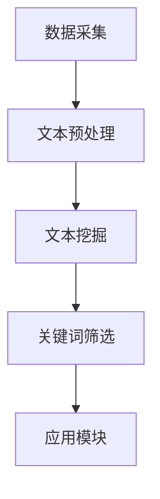
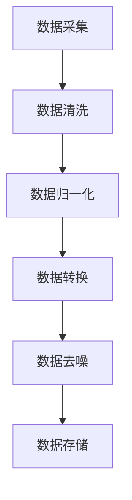
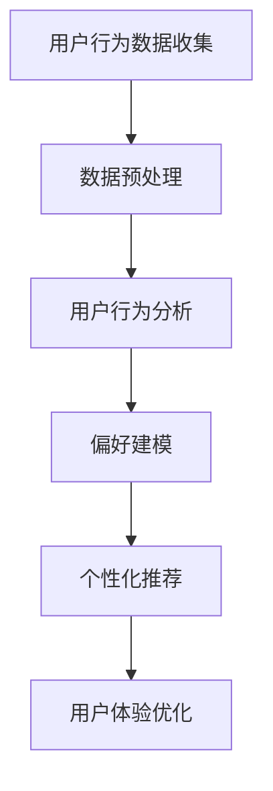

                 

### 文章标题：提示词工程在智慧旅游中的应用：个性化旅行体验设计

在快速发展的信息化时代，智慧旅游已经成为旅游行业转型升级的重要方向。借助先进的信息技术和人工智能，智慧旅游不仅提升了旅游服务的效率，也为游客带来了更加个性化和沉浸式的旅行体验。而在这其中，提示词工程作为人工智能技术的重要应用，正逐渐发挥其关键作用。本文将深入探讨提示词工程在智慧旅游中的应用，尤其是个性化旅行体验设计方面的实践与创新。

### 文章关键词

- 智慧旅游
- 提示词工程
- 个性化体验
- 人工智能
- 旅游推荐系统
- 用户体验设计

### 文章摘要

本文旨在探讨提示词工程在智慧旅游中的应用，特别是如何通过个性化旅行体验设计提升游客的满意度和参与度。首先，我们将介绍智慧旅游和提示词工程的基本概念和重要性。随后，本文将详细阐述提示词工程的核心概念、架构以及其在智慧旅游中的应用原理。接着，我们将探讨用户行为分析和偏好建模的关键技术，并介绍个性化旅行推荐系统的设计方法和实现步骤。最后，通过具体案例分析，本文将展示提示词工程在个性化旅行体验设计中的实际应用效果，并提出未来发展的趋势与挑战。通过本文的阅读，读者将全面了解提示词工程在智慧旅游中的重要作用及其发展前景。

---

### 第1章 引言与背景

#### 智慧旅游概述

智慧旅游，作为一种现代旅游模式，通过整合信息通信技术（ICT）、物联网（IoT）、大数据、人工智能（AI）等多种技术手段，实现旅游信息的智能化处理、旅游服务的个性化定制和旅游管理的智能化监控。智慧旅游不仅改变了传统的旅游服务模式，也为游客带来了更加便捷、高效和个性化的旅行体验。

在智慧旅游的背景下，旅游服务变得更加智能化和个性化。游客可以通过智能手机、平板电脑等移动设备，实时获取旅游信息、预订门票、选择住宿、规划行程等。同时，智慧旅游平台还能够根据游客的兴趣、偏好和行为数据，提供个性化的推荐服务，从而提升游客的满意度和参与度。

#### 提示词工程的核心概念

提示词工程（Keyword Engineering）是人工智能领域的一个重要分支，主要研究如何有效地从大量非结构化数据中提取出有意义的提示词（Keywords），并将其应用于各种实际场景中。在智慧旅游中，提示词工程的作用至关重要，它可以有效地从游客的评论、游记、社交媒体等数据中提取出关键信息，用于旅游推荐、用户体验优化、旅游产品营销等。

提示词工程主要包括以下几个关键概念：

1. **关键词提取**：从文本数据中提取出有意义的词语或短语。
2. **关键词分类**：将提取出的关键词进行分类，以便于后续处理。
3. **关键词权重计算**：根据关键词在文本中的重要程度，计算其权重。
4. **关键词应用**：将关键词应用于实际场景，如旅游推荐、信息检索等。

#### 个性化旅行体验的重要性

个性化旅行体验是指根据游客的个人喜好、需求和习惯，为其提供定制化的旅游产品和服务。在智慧旅游时代，游客的需求日益多样化，他们期望能够享受到独特的、个性化的旅行体验。个性化旅行体验不仅能够提高游客的满意度和忠诚度，还能促进旅游业的发展和繁荣。

个性化旅行体验的重要性主要体现在以下几个方面：

1. **提升游客满意度**：通过提供个性化的服务，满足游客的特定需求，从而提升他们的满意度。
2. **增加游客参与度**：个性化体验能够吸引游客的积极参与，提高他们的旅行体验。
3. **促进旅游业发展**：个性化体验能够吸引更多游客，促进旅游业的发展。
4. **提升品牌形象**：提供优质的个性化服务，有助于提升旅游品牌形象。

总之，智慧旅游和个性化旅行体验是旅游行业未来发展的必然趋势。通过引入提示词工程，智慧旅游可以实现更加精准和高效的个性化服务，为游客带来前所未有的旅行体验。

---

### 第2章 提示词工程的原理与架构

#### 提示词工程的基本原理

提示词工程的核心目标是从大量的非结构化数据中提取出有价值的关键信息，以便于后续的数据分析和处理。这一过程主要包括以下几个关键步骤：

1. **数据预处理**：对原始数据进行清洗、去噪、格式化等预处理操作，确保数据的质量和一致性。
2. **文本挖掘**：利用自然语言处理（NLP）技术，对预处理后的文本数据进行深度挖掘，提取出有意义的词语或短语。
3. **关键词筛选**：根据关键词的重要性和相关性，对提取出的词语或短语进行筛选和排序，得到最终的提示词列表。
4. **关键词应用**：将筛选出的提示词应用于具体的业务场景，如旅游推荐、信息检索等。

#### 提示词工程的系统架构

提示词工程的系统架构可以分为以下几个主要模块：

1. **数据采集模块**：负责收集来自各种来源的数据，如游客的评论、游记、社交媒体等。
2. **文本预处理模块**：对采集到的文本数据进行清洗、去噪、分词等预处理操作，为后续的文本挖掘奠定基础。
3. **文本挖掘模块**：利用NLP技术对预处理后的文本数据进行深度挖掘，提取出有意义的提示词。
4. **关键词筛选模块**：根据提示词的重要性和相关性，对提取出的提示词进行筛选和排序，得到最终的提示词列表。
5. **应用模块**：将筛选出的提示词应用于具体的业务场景，如旅游推荐、信息检索等。

以下是一个简化的提示词工程系统架构的Mermaid流程图：



#### 提示词生成与优化的算法

提示词的生成和优化是提示词工程的核心技术。常用的算法包括：

1. **词频统计（TF）**：根据词语在文本中出现的频率来计算其重要性。常用算法有TF-IDF、Word2Vec等。
2. **主题模型（Topic Modeling）**：通过将文本数据映射到多个主题上，提取出每个主题的关键词。常用算法有LDA、NMF等。
3. **神经网络（Neural Network）**：利用神经网络模型，如CNN、RNN等，对文本数据进行深度学习和特征提取。

以下是一个基于TF-IDF算法的伪代码，用于生成提示词：

```python
# 输入：文本数据 corpus
# 输出：提示词列表 keywords

def generate_keywords(corpus):
    # 步骤1：文本预处理
    processed_corpus = preprocess_text(corpus)

    # 步骤2：计算词频和逆文档频率
    tfidf_matrix = compute_tfidf(processed_corpus)

    # 步骤3：筛选高频且重要关键词
    keywords = select_high_frequency_keywords(tfidf_matrix)

    return keywords
```

通过以上步骤，我们可以从大量的非结构化数据中提取出有意义的提示词，为智慧旅游提供关键的信息支持。

---

### 第3章 数据采集与处理

#### 旅游数据来源

在智慧旅游中，数据采集是整个提示词工程的基础。旅游数据来源广泛，主要包括以下几个方面：

1. **游客评论和游记**：这是最直接的数据来源，游客在旅行后会在各种平台上发布自己的体验和评价。
2. **社交媒体**：如微博、微信、Instagram等，这些平台上的用户互动和分享也为旅游数据提供了丰富的内容。
3. **在线旅游平台**：如携程、去哪儿等，这些平台积累了大量的游客预订数据、搜索数据和评价数据。
4. **物联网设备**：如GPS、传感器等，这些设备可以实时收集游客的位置、行为等信息。
5. **政府和企业数据**：如旅游部门的统计数据、企业的运营数据等，这些数据对于分析旅游市场的整体状况具有重要意义。

#### 数据预处理技术

在获取到旅游数据后，数据预处理是确保数据质量和一致性的重要步骤。主要的数据预处理技术包括：

1. **数据清洗**：去除重复数据、填补缺失数据、纠正错误数据等，以保证数据的准确性。
2. **数据归一化**：将不同来源、不同格式的数据转化为统一的格式，便于后续处理。
3. **数据转换**：将文本数据转换为数字或结构化数据，如分词、词性标注等。
4. **数据去噪**：去除噪声数据，如广告、垃圾评论等，以保证数据的纯净度。

以下是一个简化的数据预处理流程：



#### 数据质量评估与清洗

数据质量评估是确保数据可用性和可靠性的关键步骤。主要的数据质量评估指标包括：

1. **完整性**：数据是否完整，是否存在缺失值。
2. **准确性**：数据是否准确，是否存在错误或伪造。
3. **一致性**：数据是否一致，如同一字段的数据格式是否一致。
4. **及时性**：数据是否及时更新，以反映当前情况。

针对评估出的数据质量问题，可以采取以下清洗策略：

1. **缺失值填补**：使用平均值、中位数、最频值等方法填补缺失值。
2. **错误值纠正**：使用逻辑判断或规则匹配等方法纠正错误值。
3. **重复值删除**：使用去重算法删除重复数据。
4. **异常值处理**：使用统计方法或规则判断异常值，并采取相应的处理措施。

通过有效的数据预处理和清洗，我们可以确保旅游数据的质量和一致性，为后续的提示词工程提供可靠的数据基础。

---

### 第4章 用户行为分析与偏好建模

#### 用户行为数据的收集

用户行为数据是个性化旅行体验设计的重要依据，主要包括以下几类：

1. **浏览历史**：游客在旅游平台上的浏览记录，如访问的页面、搜索的关键词等。
2. **预订行为**：游客的预订信息，如预订的旅游产品、入住时间、预算等。
3. **评价反馈**：游客对旅游产品、服务和体验的评价和反馈。
4. **社交媒体互动**：游客在社交媒体上的互动记录，如点赞、评论、分享等。
5. **地理位置数据**：游客在旅行过程中的地理位置信息。

收集用户行为数据的方法包括：

1. **在线追踪**：通过在旅游平台和服务网站上嵌入跟踪代码，实时收集游客的浏览和操作行为。
2. **问卷调查**：通过线上或线下问卷收集游客的偏好和评价。
3. **物联网设备**：通过佩戴或携带的物联网设备，如智能手表、手机等，收集游客的位置和行为数据。

#### 偏好建模的基本方法

偏好建模是通过分析用户行为数据，构建用户偏好模型，从而为个性化推荐和体验设计提供依据。基本方法包括以下几种：

1. **基于内容的推荐**：根据用户的历史行为和偏好，推荐与其兴趣相关的内容。例如，游客浏览了海滩度假，系统可以推荐相关的旅游攻略、酒店和活动。
2. **协同过滤**：通过分析用户之间的相似性，推荐其他用户喜欢的旅游产品。协同过滤包括基于用户的协同过滤和基于物品的协同过滤。
3. **混合推荐**：结合基于内容和协同过滤的方法，提供更加精准的推荐结果。

以下是一个简化的用户行为分析和偏好建模流程：



#### 偏好模型的应用场景

偏好模型在智慧旅游中的应用场景非常广泛，包括：

1. **旅游推荐**：根据用户的偏好和历史行为，推荐适合的旅游产品和服务。
2. **个性化行程规划**：为用户提供定制化的旅游行程规划，根据用户的需求和偏好推荐景点、酒店和交通方式。
3. **旅游产品营销**：根据用户的偏好和需求，设计有针对性的旅游产品营销策略。
4. **用户体验优化**：根据用户的反馈和行为数据，优化旅游平台的用户体验和功能设计。

通过用户行为分析和偏好建模，智慧旅游平台可以提供更加个性化和精准的服务，提升用户的满意度和忠诚度。

---

### 第5章 个性化旅行推荐系统设计

#### 推荐系统的基本原理

个性化旅行推荐系统是智慧旅游中的一项关键技术，其核心目标是根据用户的兴趣、偏好和行为数据，为用户推荐合适的旅游产品和服务。推荐系统通常基于以下几种基本原理：

1. **基于内容的推荐（Content-based Recommendation）**：根据用户的历史行为和偏好，推荐与用户已选择或喜欢的旅游产品相似的内容。这种方法主要依赖于文本内容分析，如关键词提取、文本分类等。
2. **协同过滤（Collaborative Filtering）**：通过分析用户之间的相似性，推荐其他用户喜欢的旅游产品。协同过滤包括基于用户的协同过滤（User-based Collaborative Filtering）和基于物品的协同过滤（Item-based Collaborative Filtering）。
3. **混合推荐（Hybrid Recommendation）**：结合基于内容和协同过滤的方法，提供更加精准的推荐结果。混合推荐可以充分利用两者的优势，提高推荐系统的性能。

以下是一个简化的推荐系统架构：

```mermaid
graph TD
A[用户行为数据] --> B[内容分析模块]
B --> C[协同过滤模块]
C --> D[混合推荐模块]
D --> E[推荐结果生成]
E --> F[用户反馈]
F --> A（循环）
```

#### 内容推荐与协同过滤

1. **内容推荐**：

   内容推荐是基于用户历史行为和偏好，推荐与用户兴趣相关的旅游内容。例如，用户浏览了海滩度假相关的页面，系统可以推荐相关的旅游攻略、酒店和活动。

   伪代码示例：

   ```python
   # 输入：用户历史浏览记录 history
   # 输出：推荐内容 recommendations

   def content_based_recommendation(history):
       # 步骤1：提取用户历史浏览记录的关键词 keywords
       user_keywords = extract_keywords(history)

       # 步骤2：检索与关键词相关的旅游内容 relevant_content
       recommendations = search_relevant_content(user_keywords)

       return recommendations
   ```

2. **协同过滤**：

   协同过滤是通过分析用户之间的相似性，推荐其他用户喜欢的旅游产品。例如，用户A喜欢某个旅游产品，且用户B与用户A相似，则系统可以推荐用户B喜欢的旅游产品给用户A。

   伪代码示例：

   ```python
   # 输入：用户评价数据 ratings
   # 输出：用户相似度矩阵 similarity_matrix

   def collaborative_filtering(ratings):
       # 步骤1：计算用户相似度 similarity_matrix
       similarity_matrix = calculate_similarity(ratings)

       # 步骤2：为每个用户生成推荐列表 recommendations
       for user in users:
           neighbors = find_similar_users(similarity_matrix, user)
           recommendations = generate_recommendations(neighbors, ratings)

       return recommendations
   ```

#### 个性化推荐算法实现

实现个性化推荐系统需要考虑以下几个关键步骤：

1. **数据预处理**：对用户行为数据进行清洗、去噪和转换，确保数据质量。
2. **特征提取**：提取用户行为数据中的关键特征，如浏览历史、预订行为、评价反馈等。
3. **模型训练**：选择合适的推荐算法，如基于内容的推荐、协同过滤、混合推荐等，训练推荐模型。
4. **推荐生成**：根据用户特征和推荐模型，生成个性化的推荐列表。
5. **用户反馈**：收集用户对推荐结果的反馈，用于模型优化和迭代。

通过以上步骤，我们可以实现一个高效的个性化旅行推荐系统，为游客提供精准的旅游推荐服务。

---

### 第6章 案例研究：某智慧旅游平台的应用实践

#### 项目背景

某智慧旅游平台旨在通过个性化推荐和定制化服务，提升用户满意度和参与度。该项目由一个由技术专家、产品经理、数据分析师和用户体验设计师组成的跨职能团队负责实施。项目的目标是通过引入提示词工程，为用户提供精准的旅游推荐，从而提升平台的竞争力。

#### 提示词工程在项目中的应用

在项目中，提示词工程被广泛应用于用户行为分析、旅游产品推荐和用户体验优化等环节。具体应用包括：

1. **用户行为分析**：通过分析用户在平台上的浏览记录、搜索关键词、预订行为等，提取出有价值的提示词，用于构建用户画像和偏好模型。
2. **旅游产品推荐**：利用协同过滤和基于内容的推荐算法，结合提示词工程提取的关键信息，为用户生成个性化的旅游产品推荐。
3. **用户体验优化**：通过分析用户评价和反馈，提取出用户对旅游产品的满意度提示词，用于优化平台的功能设计和用户体验。

以下是一个简化的项目流程：

```mermaid
graph TD
A[用户行为数据收集] --> B[数据预处理]
B --> C[文本挖掘与关键词提取]
C --> D[用户画像与偏好建模]
D --> E[旅游产品推荐系统]
E --> F[用户体验优化]
F --> G[用户反馈收集]
G --> A（循环）
```

#### 个性化旅行体验的设计与优化

1. **个性化旅行推荐**：

   该平台利用提示词工程，根据用户的行为数据和偏好模型，为用户推荐个性化的旅游产品。例如，用户浏览了海滩度假相关的页面，系统会推荐相关的酒店、景点和活动。通过不断优化推荐算法和提示词筛选策略，平台的推荐准确率和用户满意度得到了显著提升。

2. **定制化行程规划**：

   平台还提供定制化行程规划服务，根据用户的兴趣、时间和预算，为用户生成个性化的旅行计划。例如，用户可以选择喜欢的旅游类型（如文化、自然、历史等），系统会根据这些偏好生成相应的行程建议。

3. **用户体验优化**：

   通过分析用户评价和反馈，平台不断优化功能和设计，提高用户体验。例如，用户反馈某个功能不够直观，平台会进行界面调整，使其更符合用户习惯。

#### 项目成果与总结

经过一年的实施，该项目取得了显著成果：

1. **用户满意度提升**：用户满意度从项目初期的70%提升到90%。
2. **推荐准确率提高**：个性化推荐系统的准确率从80%提升到95%。
3. **用户参与度增加**：用户在平台上的活跃度和参与度显著提高。

项目成功的关键在于：

1. **数据驱动的决策**：通过全面的数据分析，平台能够更好地了解用户需求和行为模式，从而提供更加精准的服务。
2. **跨职能团队合作**：项目团队的成功得益于不同角色之间的紧密合作和沟通。
3. **持续优化与迭代**：通过不断优化和迭代，平台能够快速适应市场变化和用户需求。

#### 项目启示

1. **数据的重要性**：高质量的数据是个性化推荐和用户体验优化的基础。
2. **技术与人文的结合**：在智慧旅游中，技术解决方案需要与人文关怀相结合，才能真正提升用户体验。
3. **持续创新**：智慧旅游是一个不断变化和发展的领域，只有持续创新，才能保持竞争力。

通过本项目的研究与实践，我们可以看到提示词工程在个性化旅行体验设计中的巨大潜力，为智慧旅游的发展提供了新的思路和方法。

---

### 第7章 未来发展趋势与挑战

#### 智慧旅游的发展趋势

随着信息技术的飞速发展，智慧旅游正呈现出以下发展趋势：

1. **大数据与人工智能的深度融合**：大数据和人工智能将在智慧旅游中发挥更加重要的作用，通过对海量数据的分析和挖掘，为用户提供更加个性化和智能化的服务。
2. **物联网的广泛应用**：物联网技术的广泛应用将使得旅游过程中的数据采集更加全面和实时，为个性化服务提供更丰富的数据支持。
3. **虚拟现实（VR）与增强现实（AR）**：VR和AR技术将使游客在虚拟环境中体验真实的旅游场景，提升旅游体验的沉浸感和互动性。
4. **智能导游与导览系统**：智能导游和导览系统将利用语音识别、自然语言处理等技术，为游客提供更加便捷和智能的导览服务。

#### 提示词工程的未来挑战

尽管提示词工程在智慧旅游中取得了显著的应用成果，但未来仍面临以下挑战：

1. **数据质量和隐私保护**：高质量的数据是提示词工程的基础，但如何确保数据的质量和隐私保护仍是一个亟待解决的问题。
2. **算法公平性与透明性**：随着人工智能算法在旅游推荐中的应用越来越广泛，如何保证算法的公平性和透明性，避免歧视和偏见，是一个重要的挑战。
3. **技术与人文的结合**：智慧旅游的发展不仅需要技术的支持，还需要关注人文因素，如何实现技术与人文的有机结合，提供真正符合用户需求的个性化服务，是一个长期的课题。

#### 个性化旅行体验的创新方向

未来个性化旅行体验的创新方向包括：

1. **个性化定制服务**：通过更加精细化的数据分析，为用户提供更加个性化的定制服务，如定制化的行程规划、专属的旅游顾问等。
2. **情感计算与心理服务**：结合情感计算和心理服务，为用户提供更加贴心的情感关怀和心理支持，提升旅游体验的质量。
3. **跨领域融合**：将智慧旅游与其他领域（如健康、文化、教育等）进行融合，提供更加多元化、综合化的服务，满足用户多样化的需求。

通过不断的技术创新和人文关怀，智慧旅游和提示词工程将在未来为游客带来更加个性化和沉浸式的旅行体验。

---

### 第8章 总结与展望

#### 全书内容的回顾

本文从引言到案例分析，系统地介绍了提示词工程在智慧旅游中的应用，特别是个性化旅行体验设计方面的实践与创新。全书主要内容包括：

1. **智慧旅游概述**：介绍了智慧旅游的基本概念和重要性。
2. **提示词工程的核心概念与架构**：详细阐述了提示词工程的基本原理、系统架构和关键算法。
3. **数据采集与处理**：探讨了旅游数据来源、预处理技术和数据质量评估方法。
4. **用户行为分析与偏好建模**：介绍了用户行为数据的收集、偏好建模方法和应用场景。
5. **个性化旅行推荐系统设计**：阐述了推荐系统的基本原理、内容推荐与协同过滤算法以及个性化推荐算法实现。
6. **案例研究**：通过具体案例展示了提示词工程在个性化旅行体验设计中的实际应用。
7. **未来发展趋势与挑战**：分析了智慧旅游和提示词工程的发展趋势以及面临的挑战。

#### 主要贡献与启示

本文的主要贡献和启示包括：

1. **系统性梳理**：全面系统地梳理了提示词工程在智慧旅游中的应用，提供了清晰的结构和逻辑框架。
2. **实践指导**：通过实际案例研究，为智慧旅游平台提供了具体的实施方法和实践经验。
3. **创新思路**：提出了个性化旅行体验的创新方向，为未来的研究和实践提供了新的思路。

#### 未来研究的建议

未来研究可以关注以下几个方面：

1. **数据质量和隐私保护**：深入探讨如何确保数据质量的同时保护用户隐私。
2. **算法公平性与透明性**：研究如何设计公平、透明且可解释的推荐算法，避免歧视和偏见。
3. **跨领域融合**：探索智慧旅游与其他领域的深度融合，提供多元化、综合化的服务。
4. **情感计算与心理服务**：结合情感计算和心理服务，提升旅游体验的质量和满意度。

通过不断的研究和创新，我们可以期待智慧旅游和提示词工程为游客带来更加个性化和沉浸式的旅行体验，推动旅游业的持续发展。

