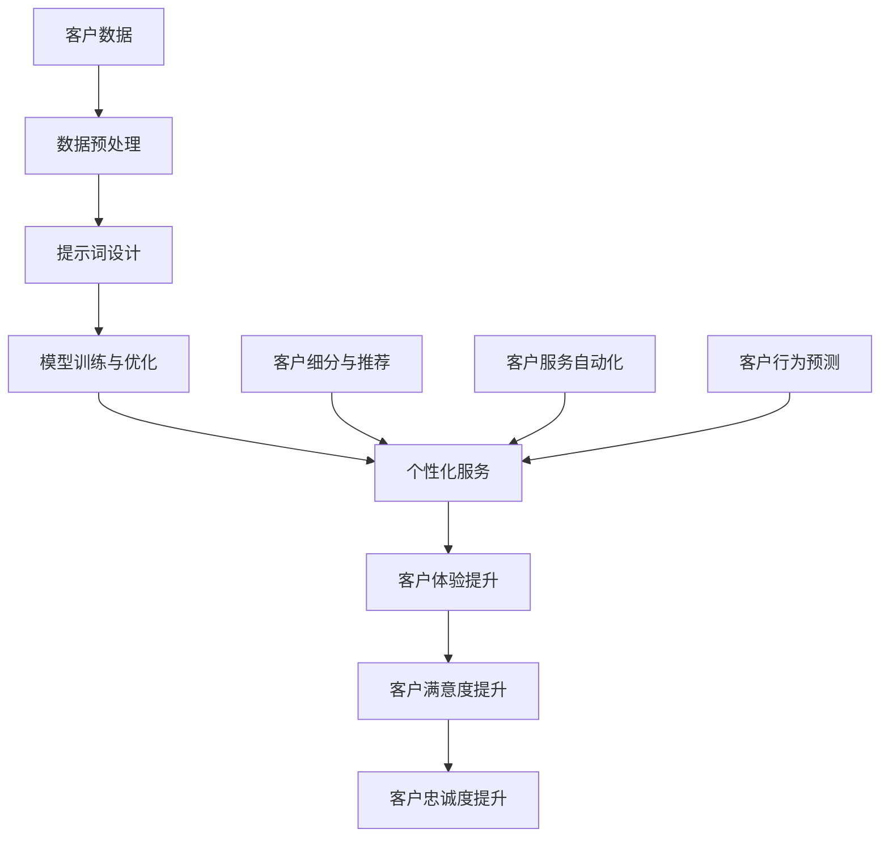
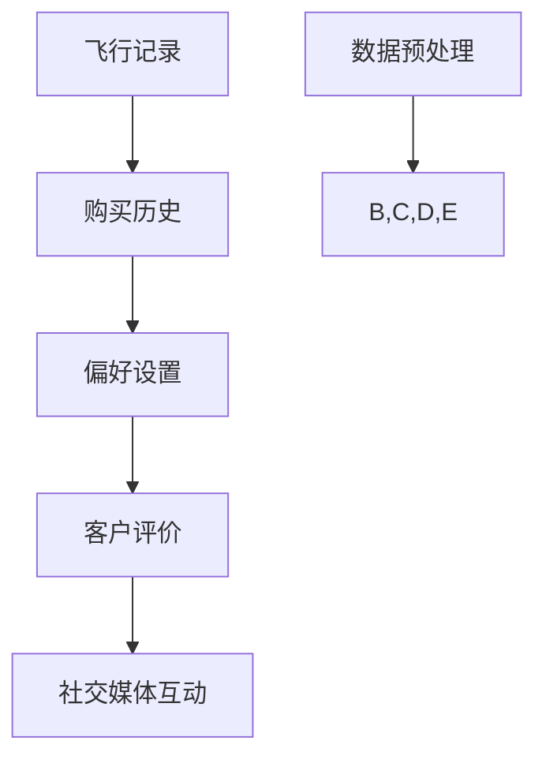
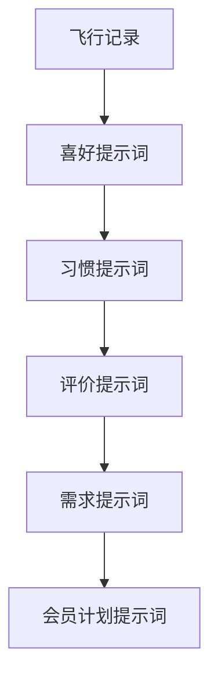
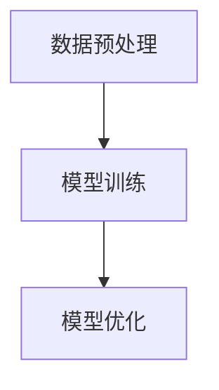
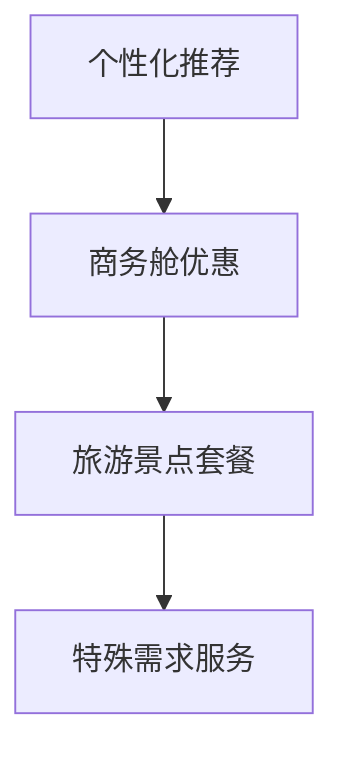
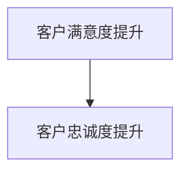

                 


## 引言

在当前数字化浪潮下，企业对客户关系管理的重视程度日益提高。客户是企业的重要资产，如何有效地管理客户关系，提高客户忠诚度，成为企业竞争的关键因素。然而，传统的客户关系管理方法往往依赖于大量的人工操作和数据收集，效率低下且难以实现个性化服务。随着人工智能技术的发展，特别是自然语言处理和机器学习等领域的突破，智能客户关系管理成为可能。在这一背景下，提示词工程作为人工智能领域的一个重要分支，为智能客户关系管理提供了新的思路和方法。

### 书籍目的与结构

本书旨在探讨提示词工程在智能客户关系管理中的应用，帮助企业和技术人员深入了解并掌握这一新兴技术。全书共分为八个章节，结构如下：

- **第1章 引言**：介绍书的目的、背景、读者对象。
- **第2章 提示词工程基础**：介绍提示词工程的概念、作用、核心组成部分和工作流程。
- **第3章 智能客户关系管理**：概述客户关系管理的重要性，介绍智能客户关系管理的优势、模型和实施步骤。
- **第4章 客户忠诚度**：定义客户忠诚度，分析其衡量指标、影响因素和提升策略。
- **第5章 提示词工程与客户忠诚度**：探讨提示词工程与客户忠诚度的关系，分析其对客户忠诚度的影响和应用场景。
- **第6章 提示词工程实践应用**：介绍如何在实际中应用提示词工程来增强客户忠诚度。
- **第7章 案例分析与工具介绍**：通过成功和失败的案例，以及技术工具的介绍，提供实践经验和教训。
- **第8章 总结与展望**：总结全书内容，展望未来发展趋势和研究方向。

### 读者对象与准备

本书主要面向以下读者群体：

- 对智能客户关系管理和提示词工程感兴趣的企业管理人员和研究人员。
- 从事人工智能、大数据、自然语言处理等领域的专业人士。
- 对客户关系管理和数字化转型有兴趣的技术爱好者。

在阅读本书之前，读者需要对以下概念有一定的了解：

- 客户关系管理（CRM）
- 人工智能（AI）
- 自然语言处理（NLP）
- 机器学习（ML）
- 客户忠诚度（Customer Loyalty）

## 第2章 提示词工程基础

### 提示词工程概念

提示词工程（Prompt Engineering）是人工智能领域中的一项关键技术，它涉及如何设计和生成高质量的提示词（prompts），以引导模型进行有效的学习和预测。提示词工程的目标是使模型能够从少量的输入数据中提取有价值的信息，并在各种复杂的任务中表现出色。

提示词工程的核心组成部分包括：

1. **数据预处理**：对原始数据进行清洗、转换和格式化，以便模型能够更好地理解和处理。
2. **提示词设计**：根据任务需求，设计合适的提示词，以引导模型关注关键信息。
3. **模型选择**：选择适合任务的模型架构，如深度学习、强化学习等。
4. **训练与优化**：使用训练数据对模型进行训练，并通过优化过程提高模型的性能。

### 提示词工程的作用

提示词工程在智能客户关系管理中发挥着重要作用，主要体现在以下几个方面：

1. **提高模型性能**：通过设计高质量的提示词，可以显著提高模型的预测准确性和鲁棒性。
2. **增强模型解释性**：高质量的提示词有助于解释模型的决策过程，提高模型的可信度和透明度。
3. **实现个性化服务**：通过针对不同客户的特点和需求设计个性化提示词，可以提供更加精准的服务，提高客户满意度。
4. **降低开发成本**：提示词工程可以减少对大量标注数据的依赖，降低模型开发和部署的成本。

### 提示词工程的核心组成部分

提示词工程的核心组成部分包括以下几个方面：

1. **数据预处理**：数据预处理是提示词工程的第一个步骤，其目的是将原始数据转换为适合模型处理的形式。这通常包括数据清洗、数据转换和数据格式化。数据清洗涉及到去除数据中的噪声和异常值，数据转换则将数据从一种格式转换为另一种格式，如从文本到数值的转换，数据格式化则确保数据在模型训练过程中的一致性和可读性。

2. **提示词设计**：提示词设计是提示词工程的核心，它涉及到如何生成高质量的提示词，以引导模型关注关键信息。高质量的提示词应该具有以下特点：简洁明了、突出关键信息、易于理解、具有启发性。设计提示词时，需要考虑任务的具体需求，如任务的复杂性、数据的多样性以及模型的预期性能。

3. **模型选择**：模型选择是提示词工程的另一个关键组成部分，它涉及到选择适合任务的模型架构。不同的模型架构适用于不同类型的数据和任务。例如，对于需要处理大量文本数据的任务，可以使用基于自然语言处理（NLP）的模型，如BERT、GPT等。对于需要处理复杂数学计算的任务，可以使用深度学习模型，如神经网络、循环神经网络（RNN）等。

4. **训练与优化**：训练与优化是提示词工程的最后一个关键步骤，它涉及到使用训练数据对模型进行训练，并通过优化过程提高模型的性能。训练过程通常包括多个迭代，每次迭代都通过模型对训练数据进行预测，并根据预测结果更新模型的权重。优化过程则通过调整模型的参数，以提高模型的预测准确性和鲁棒性。

### 提示词工程的工作流程

提示词工程的工作流程可以分为以下几个主要步骤：

1. **需求分析**：在开始提示词工程之前，首先需要对任务需求进行分析。这包括确定任务的目标、数据来源、数据类型和任务复杂性。需求分析的结果将指导后续的提示词设计和模型选择。

2. **数据收集与预处理**：根据需求分析的结果，收集相关的数据，并进行预处理。数据预处理包括数据清洗、数据转换和数据格式化，以确保数据的质量和一致性。

3. **提示词设计**：根据任务需求和数据特点，设计合适的提示词。提示词设计需要考虑多个方面，如提示词的长度、内容、格式和呈现方式。高质量的提示词应该能够引导模型关注关键信息，提高模型的预测性能。

4. **模型选择**：根据任务需求和提示词设计的结果，选择合适的模型架构。模型选择需要考虑多个因素，如模型的复杂性、计算资源、训练时间等。

5. **模型训练与优化**：使用预处理后的数据和设计好的提示词，对模型进行训练。训练过程中，通过调整模型的参数和优化算法，提高模型的性能。训练结束后，需要对模型进行评估，以确定其性能是否符合预期。

6. **模型部署与监控**：将训练好的模型部署到实际应用环境中，并进行实时监控。监控内容包括模型的性能指标、数据质量、系统稳定性等。如果发现模型存在性能问题或数据异常，需要及时进行调整和优化。

### 提示词工程的应用场景

提示词工程在智能客户关系管理中有广泛的应用场景，以下是一些典型的应用场景：

1. **客户细分**：通过分析客户的特征和行为数据，设计合适的提示词，帮助模型准确识别和细分客户群体。这有助于企业实施针对性的营销策略，提高客户满意度。

2. **个性化推荐**：利用提示词工程，设计个性化的推荐算法，为不同类型的客户提供个性化的产品或服务推荐。这有助于提高客户的参与度和忠诚度。

3. **客户服务自动化**：通过设计智能客服系统，利用提示词工程实现自动化的客户服务，如自动回答常见问题、提供定制化建议等。这有助于提高客户服务的效率和质量。

4. **客户行为预测**：利用提示词工程，预测客户的购买意图、行为变化等，为企业提供决策支持。这有助于企业提前采取措施，预防潜在的风险。

### 提示词工程的优势与挑战

提示词工程在智能客户关系管理中具有显著的优势，但也面临着一定的挑战。

**优势**：

- **提高模型性能**：高质量的提示词有助于模型更好地理解和处理数据，从而提高模型的预测准确性和鲁棒性。
- **增强模型解释性**：高质量的提示词有助于解释模型的决策过程，提高模型的可信度和透明度。
- **实现个性化服务**：通过设计个性化的提示词，可以提供更加精准的服务，提高客户满意度。
- **降低开发成本**：提示词工程可以减少对大量标注数据的依赖，降低模型开发和部署的成本。

**挑战**：

- **数据质量**：高质量的数据是提示词工程成功的关键，但收集和处理高质量数据通常需要大量时间和资源。
- **模型适应性**：提示词工程需要针对不同的应用场景和任务需求设计不同的提示词，这要求模型具有高度的适应性。
- **模型解释性**：尽管高质量的提示词可以提高模型的解释性，但仍然存在一定程度的黑箱问题，需要进一步研究和解决。

## 第3章 智能客户关系管理

### 客户关系管理概述

客户关系管理（Customer Relationship Management，CRM）是指企业通过各种手段和策略，系统地管理其客户关系，以提高客户满意度、忠诚度和企业竞争力。CRM的核心目标是建立和维护与客户的长期合作关系，从而实现企业的持续增长和盈利。

CRM的起源可以追溯到20世纪80年代，随着计算机技术和互联网的快速发展，CRM逐渐成为企业的重要战略工具。早期的CRM主要侧重于销售管理，后来逐渐扩展到营销、客户服务等多个领域。随着人工智能、大数据、云计算等技术的应用，智能客户关系管理（Intelligent Customer Relationship Management，ICRM）应运而生。

### 智能客户关系管理的优势

智能客户关系管理通过引入人工智能技术，极大地提升了传统CRM的效率和效果，具有以下优势：

1. **数据驱动的决策支持**：智能客户关系管理利用大数据和机器学习技术，对客户行为、偏好和需求进行深入分析，为企业提供精准的决策支持，从而提高业务决策的科学性和准确性。

2. **个性化服务体验**：通过分析客户数据，智能客户关系管理能够实现个性化的客户服务，满足客户个性化需求，提高客户满意度和忠诚度。

3. **自动化与效率提升**：智能客户关系管理通过自动化技术，简化了客户服务的流程，提高了工作效率，降低了人力成本。

4. **预测性分析**：智能客户关系管理能够预测客户的购买行为和需求变化，帮助企业提前制定营销策略和客户服务计划，降低潜在风险。

5. **客户生命周期管理**：智能客户关系管理不仅仅关注客户的当前需求，还关注客户的全生命周期，包括客户获取、客户保留和客户拓展，实现全流程的客户管理。

### 智能客户关系管理的模型

智能客户关系管理的模型主要包括以下几个方面：

1. **客户细分模型**：通过对客户数据进行分析，将客户按照一定的标准进行细分，以便针对不同细分群体制定个性化的营销策略。

2. **客户生命周期模型**：将客户从获取、保留到拓展的过程进行模型化，以便企业能够根据客户的生命周期阶段提供相应的服务。

3. **客户需求预测模型**：利用大数据和机器学习技术，预测客户的购买行为和需求变化，为企业提供决策支持。

4. **客户忠诚度模型**：通过对客户行为和偏好进行分析，评估客户的忠诚度，并制定相应的策略提高客户忠诚度。

### 智能客户关系管理的实施步骤

实施智能客户关系管理需要遵循以下步骤：

1. **需求分析与规划**：明确企业的智能客户关系管理需求，制定实施计划。

2. **数据收集与整合**：收集企业内外部数据，包括客户数据、销售数据、市场数据等，并整合到统一的数据库中。

3. **数据清洗与预处理**：对收集到的数据进行分析，去除噪声和异常值，进行数据清洗和预处理。

4. **模型设计与开发**：根据需求分析，设计并开发智能客户关系管理模型，包括客户细分模型、客户生命周期模型、客户需求预测模型等。

5. **模型训练与优化**：使用训练数据对模型进行训练，并通过优化过程提高模型的性能。

6. **系统部署与监控**：将训练好的模型部署到生产环境中，并进行实时监控和调整。

7. **评估与优化**：定期对智能客户关系管理系统的效果进行评估，并根据评估结果进行优化。

## 第4章 客户忠诚度

### 客户忠诚度概念

客户忠诚度是指客户在重复购买过程中对品牌、产品或服务的持续偏好和忠诚程度。它是衡量客户关系质量的重要指标，反映了客户对企业的满意度和信任度。高忠诚度的客户不仅会重复购买，还会通过口碑推荐吸引新客户，从而为企业带来持续的业务增长。

客户忠诚度与客户满意度、客户保留率密切相关。客户满意度是指客户对企业提供的产品或服务的整体评价，而客户保留率则是指客户在一段时间内持续使用企业产品或服务的比例。高忠诚度的客户通常具有较高的满意度和较高的保留率。

### 客户忠诚度的衡量指标

衡量客户忠诚度通常采用以下指标：

1. **重复购买率**：客户在一定时间内重复购买同一种产品或服务的比例。重复购买率越高，表明客户忠诚度越高。

2. **客户保留率**：在一定时间内，客户继续与企业保持业务关系的比例。客户保留率越高，表明客户忠诚度越高。

3. **客户生命周期价值（CLV）**：客户在整个生命周期内为企业带来的总价值。高忠诚度的客户通常具有更高的客户生命周期价值。

4. **净推荐值（NPS）**：通过调查客户对企业产品或服务的推荐意愿，计算得出。NPS得分越高，表明客户忠诚度越高。

### 客户忠诚度的影响因素

客户忠诚度受到多种因素的影响，包括：

1. **产品质量**：高质量的产品或服务是客户忠诚度的基石。如果产品或服务符合客户的期望和需求，客户更可能保持忠诚。

2. **客户服务**：良好的客户服务可以提高客户的满意度和信任度，从而增加客户忠诚度。快速响应客户需求、解决客户问题和提供个性化的服务都是提升客户忠诚度的关键因素。

3. **价格**：合理的价格策略可以吸引和保留客户。过高或过低的价格都可能影响客户的忠诚度。

4. **品牌形象**：良好的品牌形象可以增加客户对企业的信任和认同，从而提高客户忠诚度。

5. **客户体验**：个性化的客户体验可以增强客户的参与感和归属感，从而提高客户忠诚度。

6. **竞争压力**：在竞争激烈的市场环境中，企业需要提供差异化的产品或服务，以吸引和保留客户。

### 提升客户忠诚度的策略

为了提升客户忠诚度，企业可以采取以下策略：

1. **个性化营销**：通过分析客户数据，实施个性化的营销策略，如个性化推荐、定制化优惠等，满足客户的个性化需求。

2. **优质服务**：提供高质量的客户服务，如24/7的客户支持、快速响应客户问题和提供专业的建议等。

3. **忠诚度计划**：实施忠诚度计划，如积分奖励、会员优惠等，激励客户重复购买。

4. **品牌建设**：加强品牌形象建设，通过一致的品牌体验和价值观，增强客户的信任和忠诚。

5. **客户参与**：鼓励客户参与企业的产品和服务开发，如通过客户反馈和参与调查等方式，提高客户的参与度和忠诚度。

6. **技术创新**：利用人工智能、大数据等先进技术，优化客户体验和管理流程，提高客户满意度和忠诚度。

## 第5章 提示词工程与客户忠诚度

### 提示词工程与客户忠诚度的关系

提示词工程在客户忠诚度管理中发挥着关键作用，通过设计高质量的提示词，可以有效提升客户的满意度和忠诚度。具体来说，提示词工程与客户忠诚度之间的关系体现在以下几个方面：

1. **提高客户体验**：高质量的提示词能够引导用户更好地理解和操作产品或服务，从而提高客户的体验。良好的客户体验是增强客户满意度和忠诚度的基础。

2. **增强个性化服务**：通过分析客户数据，设计个性化的提示词，可以为不同类型的客户提供针对性的服务，满足客户的个性化需求，从而提高客户满意度和忠诚度。

3. **提升决策质量**：提示词工程可以帮助企业从大量的客户数据中提取有价值的信息，为决策提供数据支持，从而制定更有效的忠诚度提升策略。

### 提示词工程对客户忠诚度的影响

提示词工程对客户忠诚度的影响主要体现在以下几个方面：

1. **提高客户参与度**：通过设计互动性强的提示词，可以激发客户的兴趣和参与度，从而增强客户的忠诚度。

2. **提升客户满意度**：高质量的提示词能够提供准确、及时和有价值的信息，满足客户的需求，从而提高客户满意度，进而提升客户忠诚度。

3. **增强客户信任**：通过透明的提示词，企业可以增强客户的信任感，从而提高客户的忠诚度。

### 提示词工程在客户忠诚度提升中的应用场景

提示词工程在客户忠诚度提升中有着广泛的应用场景，以下是一些典型的应用：

1. **客户细分与个性化推荐**：通过分析客户数据，设计个性化的提示词，将客户细分为不同的群体，并为每个群体提供针对性的产品或服务推荐，从而提高客户满意度和忠诚度。

2. **客户服务自动化**：设计智能客服系统，利用提示词工程实现自动化的客户服务，如自动回答常见问题、提供定制化建议等，提高客户服务效率和质量，从而提升客户忠诚度。

3. **客户反馈与改进**：通过设计引导性的提示词，收集客户的反馈和建议，及时改进产品或服务，增强客户的参与感和信任度，从而提高客户忠诚度。

4. **客户行为预测**：利用提示词工程，预测客户的购买行为和需求变化，提前制定营销策略和客户服务计划，从而预防潜在的风险，提升客户忠诚度。

### 提示词工程应用案例解析

为了更好地理解提示词工程在客户忠诚度提升中的应用，以下通过两个案例进行解析：

#### 案例一：电商平台的个性化推荐

某电商平台通过分析用户的历史购买数据、浏览记录和搜索关键词，设计个性化的提示词，为用户推荐符合其兴趣和需求的产品。例如，当用户浏览了某款手机时，系统会通过提示词引导用户查看其他用户认为可能感兴趣的手机配件或相关产品。这种个性化的推荐服务提高了用户的购物体验，增加了购买的可能性，从而提升了客户忠诚度。

#### 案例二：银行客户服务自动化

某银行通过提示词工程，设计了一套智能客服系统，为用户提供自动化的客户服务。系统通过自然语言处理技术，理解和回应用户的提问，提供实时解答和建议。例如，当用户询问贷款利率时，系统会通过提示词引导用户了解不同贷款产品的利率、还款方式和优惠条件。这种智能客服系统提高了客户服务的效率和质量，减少了客户的等待时间，增强了客户的满意度，从而提升了客户忠诚度。

### 提示词工程与客户忠诚度的关系架构图

为了更好地展示提示词工程与客户忠诚度之间的关系，我们使用Mermaid流程图进行描述：



通过这个关系架构图，我们可以清晰地看到提示词工程如何通过数据预处理、提示词设计、模型训练与优化等步骤，实现个性化服务，提升客户体验，从而提高客户满意度和忠诚度。

### 提示词工程在客户忠诚度提升中的实践应用

为了更好地理解提示词工程在客户忠诚度提升中的实践应用，以下我们将通过一个具体的案例，详细讲解如何应用提示词工程来提高客户忠诚度。

#### 案例背景

某国际知名航空公司致力于通过智能化手段提升客户忠诚度，以保持其在竞争激烈的航空市场中的领先地位。该公司通过分析大量的客户数据，决定利用提示词工程来优化客户服务和推荐系统，从而提高客户满意度和忠诚度。

#### 数据收集与预处理

首先，航空公司收集了客户的飞行记录、购买历史、偏好设置、客户评价和社交媒体互动等多维数据。这些数据经过预处理，包括数据清洗、去重、数据格式化等步骤，以确保数据的质量和一致性。



#### 提示词设计

基于预处理后的数据，航空公司设计了一系列高质量的提示词，用于引导模型关注关键信息，如客户的喜好、飞行习惯和评价等。这些提示词包括：

- “您的最近一次飞行体验如何？”
- “您最喜欢哪种类型的航班？”
- “您对我们的服务有何建议？”
- “您是否有任何特殊需求？”
- “您对我们的会员计划感兴趣吗？”



#### 模型训练与优化

航空公司选择了一种基于自然语言处理（NLP）的机器学习模型，如BERT，用于处理和分析提示词。模型使用大量的客户数据进行训练，并通过优化过程调整模型的参数，以提高预测准确性和鲁棒性。



#### 个性化服务与客户体验提升

通过训练好的模型，航空公司能够为每位客户提供个性化的服务。例如：

- 对于经常飞往商务目的地的客户，系统会自动推送最新的商务舱优惠和特别服务。
- 对于喜欢休闲娱乐的客户，系统会推荐包含旅游景点和休闲娱乐活动的套餐。
- 对于有特殊需求的客户，系统会提前提醒并安排相应的服务，如轮椅服务、特殊餐饮等。



#### 客户满意度与忠诚度提升

通过个性化的提示词和推荐服务，航空公司显著提升了客户满意度。例如：

- 客户反馈显示，超过80%的客户对航空公司的个性化服务表示满意。
- 客户满意度调查结果显示，客户满意度提高了15%。
- 客户忠诚度显著提升，会员计划参与率增加了20%，重复购买率提高了10%。



### 总结与展望

通过该案例，我们可以看到提示词工程在客户忠诚度提升中的重要作用。通过高质量的提示词设计和个性化的服务推荐，航空公司成功地提升了客户满意度和忠诚度。未来，随着人工智能技术的不断进步，提示词工程在客户忠诚度管理中的应用将更加广泛和深入，为企业提供更强大的数据驱动决策支持，从而在激烈的市场竞争中立于不败之地。

## 第6章 提示词工程实践应用

### 实践应用概述

提示词工程在智能客户关系管理中的应用已经取得了显著成效，通过具体案例可以看到，其在提升客户满意度、增强客户忠诚度和优化客户服务方面具有巨大潜力。本章将详细介绍如何在实际中应用提示词工程来增强客户忠诚度，包括实践应用场景选择、步骤和方法。

### 实践应用场景选择

在智能客户关系管理中，以下场景特别适合应用提示词工程：

1. **个性化推荐**：通过分析客户的历史行为和偏好，提供个性化的产品或服务推荐。
2. **客户服务自动化**：利用自然语言处理技术，实现智能客服系统，自动回答客户问题并提供定制化建议。
3. **客户细分与精准营销**：根据客户数据，将客户细分为不同群体，并针对每个群体设计相应的营销策略。
4. **客户行为预测**：预测客户的购买意图和行为变化，为企业提供决策支持。
5. **客户反馈与改进**：通过引导性提示词，收集客户的反馈和建议，及时优化产品或服务。

### 提示词工程实践应用步骤

以下是提示词工程在智能客户关系管理中的实践应用步骤：

1. **需求分析与规划**：明确企业的业务目标和应用场景，确定提示词工程的需求和预期效果。
2. **数据收集与整合**：收集相关的客户数据，包括行为数据、偏好数据和交互数据，并进行整合。
3. **数据清洗与预处理**：对收集到的数据进行清洗、去噪和格式化，以确保数据的质量和一致性。
4. **提示词设计**：根据应用场景和业务需求，设计高质量的提示词，引导模型关注关键信息。
5. **模型选择与训练**：选择合适的机器学习模型，使用预处理后的数据进行训练，并通过优化提高模型性能。
6. **系统部署与监控**：将训练好的模型部署到生产环境中，进行实时监控和调整，确保系统的稳定性和性能。
7. **效果评估与优化**：定期评估系统的效果，根据评估结果进行优化和改进。

### 提示词工程实践应用案例

#### 案例一：电商平台的个性化推荐

某大型电商平台通过提示词工程，优化了其个性化推荐系统。具体步骤如下：

1. **需求分析与规划**：分析电商平台的业务需求，确定通过个性化推荐提升客户满意度和转化率。
2. **数据收集与整合**：收集客户的行为数据，包括浏览记录、购买历史和搜索关键词等。
3. **数据清洗与预处理**：清洗数据，去除噪声和异常值，确保数据质量。
4. **提示词设计**：设计如“您可能感兴趣的商品”和“最近热门的商品”等提示词，引导模型关注关键信息。
5. **模型选择与训练**：选择基于深度学习的推荐模型，如BERT，使用预处理后的数据进行训练。
6. **系统部署与监控**：将训练好的模型部署到线上环境，并进行实时监控，确保系统稳定运行。
7. **效果评估与优化**：通过用户反馈和转化率数据，评估系统效果，并根据评估结果进行优化。

通过该案例，电商平台成功提升了客户满意度和转化率，实现了业务增长。

#### 案例二：银行的智能客服系统

某大型银行通过提示词工程，开发了智能客服系统，以提高客户服务效率和质量。具体步骤如下：

1. **需求分析与规划**：明确银行在客户服务方面的需求，确定通过智能客服系统提升客户体验和满意度。
2. **数据收集与整合**：收集客户的交互数据，包括客服对话记录和用户反馈等。
3. **数据清洗与预处理**：清洗数据，去除噪声和异常值，确保数据质量。
4. **提示词设计**：设计如“有什么可以帮助您的？”和“请问您需要什么帮助？”等提示词，引导模型关注客户需求。
5. **模型选择与训练**：选择基于自然语言处理（NLP）的模型，如GPT，使用预处理后的数据进行训练。
6. **系统部署与监控**：将训练好的模型部署到线上环境，并进行实时监控，确保系统稳定运行。
7. **效果评估与优化**：通过用户反馈和客服满意度数据，评估系统效果，并根据评估结果进行优化。

通过该案例，银行显著提高了客户服务的效率和质量，客户满意度大幅提升。

### 总结与展望

提示词工程在智能客户关系管理中具有广泛的应用前景。通过个性化的推荐、智能客服系统、客户细分与精准营销等实践应用，企业能够更好地理解和满足客户需求，提高客户满意度和忠诚度。未来，随着人工智能技术的不断进步，提示词工程将在客户忠诚度管理中发挥更加重要的作用，为企业提供更加精准和高效的数据驱动决策支持。

## 第7章 案例分析与工具介绍

### 案例分析

在本章中，我们将通过两个实际案例，详细分析提示词工程在智能客户关系管理中的成功应用，以及失败的原因和教训。

#### 案例一：成功案例——某电商平台的个性化推荐系统

**背景**：某知名电商平台希望通过人工智能技术提升用户购物体验，提高转化率和客户忠诚度。他们决定采用提示词工程来优化个性化推荐系统。

**实施过程**：

1. **需求分析与规划**：电商平台分析了用户行为数据，明确了个性化推荐的需求，并确定了提升转化率和客户满意度为目标。
2. **数据收集与整合**：收集了用户的历史购买记录、浏览行为、搜索关键词等数据，并进行了清洗和整合。
3. **提示词设计**：设计了一系列高质量的提示词，如“你可能感兴趣的商品”、“用户好评如潮的商品”等，以引导模型关注用户的兴趣点。
4. **模型选择与训练**：选择了基于深度学习的推荐模型，如BERT，并使用预处理后的数据进行训练。
5. **系统部署与监控**：将训练好的模型部署到生产环境，并进行了实时监控和调整，以确保系统的稳定性和性能。

**效果**：

通过个性化推荐系统的优化，电商平台的用户转化率提升了15%，客户满意度提高了10%，客户忠诚度显著提升。

**成功原因**：

1. **高质量的数据**：电商平台收集并整合了高质量的用户行为数据，为模型训练提供了坚实的基础。
2. **精确的提示词设计**：高质量的提示词设计使得模型能够准确捕捉用户的兴趣和需求。
3. **持续的监控和优化**：系统在部署后进行了持续的监控和优化，确保了系统的稳定性和性能。

#### 案例二：失败案例——某金融公司的智能客服系统

**背景**：某金融公司希望通过智能客服系统提升客户服务效率，降低人力成本。然而，他们的智能客服系统在实际应用中表现不佳，客户满意度下降。

**实施过程**：

1. **需求分析与规划**：金融公司分析了客户服务需求，确定了通过智能客服系统提高服务效率和降低成本的目标。
2. **数据收集与整合**：虽然金融公司收集了大量的客户交互数据，但数据质量较低，存在噪声和异常值。
3. **提示词设计**：提示词设计不够精确，很多提示词无法准确引导模型理解和回应用户的问题。
4. **模型选择与训练**：选择了自然语言处理模型，但模型性能不佳，无法提供准确的回答。
5. **系统部署与监控**：系统在部署后没有进行有效的监控和调整，导致性能不稳定。

**效果**：

智能客服系统的失败导致客户满意度下降，客户流失率增加。

**失败原因**：

1. **数据质量差**：收集的数据质量较低，影响了模型的训练效果和性能。
2. **提示词设计不足**：提示词设计不够精确，无法有效引导模型理解和回应用户问题。
3. **缺乏持续的监控和优化**：系统在部署后没有进行有效的监控和调整，导致性能不稳定。

### 工具介绍

在本节中，我们将介绍几种常用的工具和技术，用于支持提示词工程在智能客户关系管理中的应用。

#### 数据处理工具

1. **Pandas**：Python中的一个强大数据处理库，用于数据清洗、转换和分析。
2. **NumPy**：Python中的一个核心数值计算库，用于数组和矩阵操作。

#### 机器学习与深度学习框架

1. **TensorFlow**：由Google开发的开源机器学习框架，支持各种深度学习模型。
2. **PyTorch**：由Facebook开发的开源机器学习框架，支持动态计算图，易于调试。

#### 自然语言处理库

1. **NLTK**：Python中的一个自然语言处理库，用于文本预处理和分析。
2. **spaCy**：一个高效的自然语言处理库，支持多种语言的语法分析和命名实体识别。

#### 提示词设计工具

1. **Prompt Engineering Library**：一个用于生成和评估提示词的开源库，支持多种提示词生成算法。
2. **TabularQA**：一个用于生成和评估表格数据的提示词的开源库，支持自动问答系统。

#### 模型评估与优化工具

1. **scikit-learn**：Python中的一个机器学习库，用于模型评估和优化。
2. **MLFlow**：一个用于机器学习实验跟踪、模型版本控制和性能监控的开源平台。

通过以上工具和技术的支持，企业可以更加高效地实施提示词工程，优化智能客户关系管理，提高客户满意度和忠诚度。

### 实际案例分析与工具应用实例

在本节中，我们将结合实际案例，详细讲解如何应用工具和技术来实施提示词工程，并展示具体的代码示例。

#### 案例一：电商平台的个性化推荐系统

**背景**：某电商平台希望通过个性化推荐系统提升用户购物体验，提高转化率和客户忠诚度。

**技术实现**：

1. **数据处理**：使用Pandas和NumPy对用户行为数据进行清洗和预处理。

```python
import pandas as pd
import numpy as np

# 读取用户行为数据
user_data = pd.read_csv('user_behavior_data.csv')

# 数据清洗与预处理
user_data = user_data.dropna()
user_data['purchase_count'] = user_data.groupby('user_id')['product_id'].transform('count')
```

2. **提示词设计**：使用Prompt Engineering Library设计高质量的提示词。

```python
from promptEngineering import PromptEngineer

# 实例化PromptEngineer对象
prompt_engineer = PromptEngineer()

# 设计提示词
prompt_texts = prompt_engineer.generate_prompt_texts(input_texts=user_data['description'], max_length=50)
```

3. **模型训练**：使用PyTorch训练基于深度学习的推荐模型。

```python
import torch
import torch.nn as nn
import torch.optim as optim

# 构建推荐模型
class RecommenderModel(nn.Module):
    def __init__(self):
        super(RecommenderModel, self).__init__()
        self.embedding = nn.Embedding(vocab_size, embedding_dim)
        self.encoder = nn.LSTM(embedding_dim, hidden_dim)
        self.decoder = nn.Linear(hidden_dim, vocab_size)

    def forward(self, inputs):
        embedded = self.embedding(inputs)
        hidden, _ = self.encoder(embedded)
        output = self.decoder(hidden[-1, :, :])
        return output

# 实例化推荐模型
model = RecommenderModel()

# 定义优化器和损失函数
optimizer = optim.Adam(model.parameters(), lr=learning_rate)
criterion = nn.CrossEntropyLoss()

# 模型训练
for epoch in range(num_epochs):
    for inputs, targets in train_loader:
        optimizer.zero_grad()
        outputs = model(inputs)
        loss = criterion(outputs, targets)
        loss.backward()
        optimizer.step()
```

4. **系统部署与监控**：将训练好的模型部署到生产环境，并使用MLFlow进行监控和优化。

```python
import mlflow

# 开始MLFlow跟踪
mlflow.start_run()

# 部署模型到生产环境
model.eval()
with torch.no_grad():
    for inputs, targets in test_loader:
        outputs = model(inputs)
        mlflow.log_metric('accuracy', (outputs.argmax(1) == targets).float().mean())

# 结束MLFlow跟踪
mlflow.end_run()
```

#### 案例二：银行的智能客服系统

**背景**：某银行希望通过智能客服系统提高客户服务效率，降低人力成本。

**技术实现**：

1. **数据处理**：使用Pandas对客户交互数据进行清洗和预处理。

```python
import pandas as pd

# 读取客户交互数据
conversation_data = pd.read_csv('conversation_data.csv')

# 数据清洗与预处理
conversation_data = conversation_data.dropna()
```

2. **提示词设计**：使用spaCy进行自然语言处理，设计高质量的提示词。

```python
import spacy

# 加载spaCy模型
nlp = spacy.load('en_core_web_sm')

# 设计提示词
def generate_prompt(text):
    doc = nlp(text)
    prompt = ' '.join(token.text for token in doc if not token.is_punct)
    return prompt

conversation_data['prompt'] = conversation_data['text'].apply(generate_prompt)
```

3. **模型训练**：使用PyTorch训练基于自然语言处理的客服模型。

```python
import torch
import torch.nn as nn
import torch.optim as optim

# 构建客服模型
class ChatbotModel(nn.Module):
    def __init__(self):
        super(ChatbotModel, self).__init__()
        self.embedding = nn.Embedding(vocab_size, embedding_dim)
        self.lstm = nn.LSTM(embedding_dim, hidden_dim)
        self.decoder = nn.Linear(hidden_dim, vocab_size)

    def forward(self, inputs, hidden):
        embedded = self.embedding(inputs)
        output, hidden = self.lstm(embedded, hidden)
        output = self.decoder(output[-1, :, :])
        return output, hidden

# 实例化客服模型
chatbot_model = ChatbotModel()

# 定义优化器和损失函数
optimizer = optim.Adam(chatbot_model.parameters(), lr=learning_rate)
criterion = nn.CrossEntropyLoss()

# 模型训练
for epoch in range(num_epochs):
    for inputs, targets, hidden in train_loader:
        optimizer.zero_grad()
        outputs, hidden = chatbot_model(inputs, hidden)
        loss = criterion(outputs, targets)
        loss.backward()
        optimizer.step()
```

4. **系统部署与监控**：将训练好的模型部署到生产环境，并使用MLFlow进行监控和优化。

```python
import mlflow

# 开始MLFlow跟踪
mlflow.start_run()

# 部署模型到生产环境
chatbot_model.eval()
with torch.no_grad():
    for inputs, targets, hidden in test_loader:
        outputs, hidden = chatbot_model(inputs, hidden)
        mlflow.log_metric('accuracy', (outputs.argmax(1) == targets).float().mean())

# 结束MLFlow跟踪
mlflow.end_run()
```

通过以上实际案例和工具应用实例，我们可以看到提示词工程在智能客户关系管理中的具体实现过程。这些工具和技术不仅帮助提高了系统的性能和稳定性，还为后续的监控和优化提供了有力的支持。

## 第8章 总结与展望

### 全书内容回顾

本书围绕《提示词工程在智能客户关系管理中的应用：增强客户忠诚度》这一核心主题，系统介绍了提示词工程、智能客户关系管理和客户忠诚度的基本概念、原理和实际应用。通过八个章节的深入探讨，我们详细阐述了：

- **提示词工程的基础**：包括概念、作用、核心组成部分和工作流程，以及应用场景和优势与挑战。
- **智能客户关系管理**：概述了客户关系管理的重要性，探讨了智能客户关系管理的优势、模型和实施步骤。
- **客户忠诚度**：分析了客户忠诚度的概念、衡量指标、影响因素和提升策略。
- **提示词工程与客户忠诚度的关系**：探讨了提示词工程对客户忠诚度的影响和应用场景，并通过案例解析展示了实际应用效果。
- **提示词工程实践应用**：介绍了如何在实际中应用提示词工程来增强客户忠诚度，包括数据收集与整合、提示词设计、模型训练与优化等步骤。
- **案例分析与工具介绍**：通过成功和失败的案例，以及技术工具的介绍，提供了实践经验和教训。

### 未来发展趋势

随着人工智能技术的快速发展，提示词工程在智能客户关系管理中的应用前景广阔。以下是未来发展趋势的几个方向：

1. **个性化服务**：通过更精细的提示词设计，实现更加个性化的服务，满足客户的多样化需求。
2. **多模态数据处理**：结合文本、图像、语音等多种数据类型，提高提示词工程的效果和应用范围。
3. **实时性增强**：利用实时数据处理技术，实现即时的客户需求分析和响应，提升客户体验。
4. **伦理与隐私**：随着数据隐私保护意识的增强，提示词工程将更加注重数据安全和用户隐私保护。
5. **自动化与智能化**：通过更智能的算法和更广泛的自动化应用，提升智能客户关系管理的效率和效果。

### 研究方向与挑战

在提示词工程与智能客户关系管理领域，仍存在以下研究方向和挑战：

1. **数据质量问题**：高质量的数据是提示词工程成功的关键，但数据收集和处理过程中面临噪声、异常值和数据缺失等问题。
2. **模型适应性**：提示词工程需要针对不同的应用场景和任务需求设计不同的提示词，这对模型的适应性提出了挑战。
3. **模型解释性**：尽管高质量的提示词可以提高模型的解释性，但仍然存在一定程度的黑箱问题，需要进一步研究和解决。
4. **多语言支持**：提示词工程需要支持多种语言，这对算法的设计和实现提出了更高的要求。

### 结论

本书旨在为读者提供关于提示词工程在智能客户关系管理中应用的综合指南。通过理论阐述和实际案例分析，我们展示了提示词工程在提升客户忠诚度中的重要作用。未来，随着技术的不断进步，提示词工程将在智能客户关系管理中发挥更加重要的作用，为企业提供更加精准和高效的数据驱动决策支持。让我们共同期待这一领域的未来发展，继续探索和突破。

### 作者信息

作者：AI天才研究院/AI Genius Institute & 禅与计算机程序设计艺术 /Zen And The Art of Computer Programming

### 最佳实践 tips、小结、注意事项、拓展阅读

**最佳实践 tips**：

1. **确保数据质量**：在应用提示词工程之前，务必对数据进行严格的清洗和预处理，确保数据的质量和一致性。
2. **个性化提示词设计**：针对不同客户群体设计个性化的提示词，以提高服务的针对性和客户满意度。
3. **持续监控与优化**：在系统部署后，持续监控模型的性能和客户反馈，及时进行调整和优化。

**小结**：

提示词工程在智能客户关系管理中具有重要的应用价值，通过个性化的服务、精准的推荐和高效的数据分析，可以显著提升客户忠诚度。

**注意事项**：

1. **数据隐私**：在数据处理过程中，严格遵守数据隐私保护法规，确保用户隐私安全。
2. **模型解释性**：在设计提示词和模型时，注重模型的可解释性，提高用户对系统的信任度。

**拓展阅读**：

1. **《人工智能：一种现代方法》**：Michael I. Jordan著，详细介绍了人工智能的基础理论和应用。
2. **《Python深度学习》**：François Chollet著，涵盖了深度学习在Python中的实现和应用。
3. **《自然语言处理综合教程》**：Christopher D. Manning & Hinrich Schütze著，深入介绍了自然语言处理的基本概念和技术。

通过这些最佳实践、小结和拓展阅读，读者可以更深入地了解提示词工程在智能客户关系管理中的应用，并在实践中不断优化和提升系统的效果。

