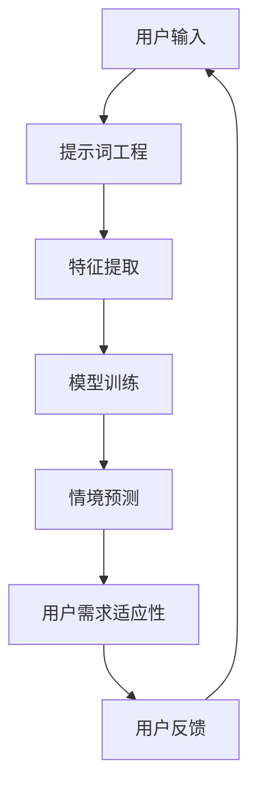

                 

## 文章标题

《提示词工程在智能家居情境预测中的应用：提前适应用户需求》

### 关键词

- 提示词工程
- 智能家居
- 情境预测
- 用户需求
- 机器学习

### 摘要

本文深入探讨了提示词工程在智能家居情境预测中的应用，分析了如何通过提前适应用户需求，提升智能家居系统的智能化水平。文章首先介绍了智能家居和提示词工程的基本概念，随后阐述了情境预测的核心原理和用户需求适应性分析。通过详细的算法原理讲解、数学模型和公式、以及实际案例的分析，本文旨在为读者提供一套完整的提示词工程应用指南，帮助开发者实现更加智能的智能家居系统。

## 引言

### 智能家居的崛起

随着科技的不断发展，智能家居（Smart Home）逐渐成为现代家居生活的趋势。智能家居系统通过将互联网、物联网、传感器技术等与现代家居设备相结合，实现了对家居环境的自动化控制，提高了生活便利性和舒适度。从最初的单一设备智能化，如智能灯泡、智能音响，到如今的全屋智能解决方案，智能家居正在改变我们的生活方式。

### 提示词工程的背景

提示词工程（Prompt Engineering）是一种通过设计特定的问题或提示，引导用户或系统进行思考和决策的方法。在人工智能领域，提示词工程被广泛应用于自然语言处理、对话系统、推荐系统等领域。通过精心设计的提示词，系统能够更好地理解用户的需求，提供更加个性化的服务。

### 情境预测的重要性

情境预测（Situation Prediction）是智能家居系统中的一个关键功能，它能够根据用户的日常行为和环境变化，预测未来的需求和状态。例如，系统可以根据用户的作息时间自动调整灯光和温度，或者根据天气情况自动关闭窗户。情境预测的准确性直接影响到智能家居系统的用户体验。

### 提前适应用户需求

在智能家居系统中，提前适应用户需求（Proactive User Adaptation）意味着系统能够在用户需求发生之前，主动进行预测和调整。这种预适应能力不仅能够提升用户的满意度，还能够减少系统的响应时间，提高系统的效率。通过提示词工程，系统可以更好地捕捉用户的意图和习惯，从而实现更加精准的预适应。

## 核心概念与联系

### 提示词工程

提示词工程是一种设计特定提示，引导用户或系统进行思考和决策的方法。在智能家居情境预测中，提示词工程的核心目的是通过设计合适的提示词，帮助系统更好地理解用户的意图和行为模式。以下是提示词工程的基本概念和组成部分：

- **提示词类型**：根据应用场景，提示词可以分为开放性提示词、封闭性提示词、问题式提示词等。
- **提示词选择**：选择合适的提示词需要考虑用户的背景、偏好和需求，以及系统的功能限制。
- **提示词优化**：通过分析和评估用户反馈，不断优化和调整提示词，以提高系统的用户满意度。

### 智能家居情境预测

智能家居情境预测是指通过分析用户的日常行为、环境数据和设备状态，预测用户未来的需求和状态。情境预测的关键组成部分包括：

- **数据采集**：通过传感器和用户行为数据，收集与智能家居情境相关的信息。
- **特征提取**：从原始数据中提取有用的特征，用于情境预测模型的训练。
- **模型训练**：使用机器学习算法，训练情境预测模型，使其能够根据历史数据和特征预测未来的情境。
- **预测结果评估**：评估情境预测模型的准确性，并不断优化模型以提高预测效果。

### 用户需求适应性

用户需求适应性是指智能家居系统能够根据用户的需求和习惯，主动调整自身的功能和行为。用户需求适应性的关键组成部分包括：

- **需求识别**：通过分析用户行为数据，识别用户的需求和偏好。
- **需求适应**：根据识别出的用户需求，调整系统的设置和功能，以满足用户的需求。
- **用户反馈**：收集用户对系统调整的反馈，用于进一步优化需求适应策略。

### 提示词工程、情境预测与用户需求适应性之间的关系

提示词工程、情境预测和用户需求适应性之间存在着密切的联系。提示词工程为情境预测提供了有效的数据输入，而情境预测的结果则用于指导用户需求适应性。具体来说：

1. **提示词工程**通过设计合适的提示词，引导用户或系统提供相关信息，为情境预测提供数据基础。
2. **情境预测**通过分析用户行为和设备状态，预测未来的需求和状态，为用户需求适应性提供决策依据。
3. **用户需求适应性**通过根据情境预测结果调整系统设置和功能，实现个性化服务，提高用户体验。

以下是一个Mermaid流程图，展示了提示词工程、情境预测和用户需求适应性之间的流程和联系：



## 核心算法原理讲解

### 提示词工程

提示词工程的核心目标是设计出能够引导用户或系统进行有效沟通和决策的提示词。以下是提示词工程的基本步骤和算法原理：

1. **需求分析**：分析用户需求，确定需要解决的问题或目标。

   ```python
   def analyze_demand():
       # 分析用户需求，例如：控制灯光、调节温度等
       return ["控制灯光", "调节温度"]
   ```

2. **提示词生成**：根据需求分析结果，生成相应的提示词。

   ```python
   def generate_prompts(demands):
       prompts = []
       for demand in demands:
           if demand == "控制灯光":
               prompts.append("您希望如何控制灯光？")
           elif demand == "调节温度":
               prompts.append("您希望将温度调整到多少度？")
       return prompts
   ```

3. **提示词优化**：评估提示词的效果，并根据用户反馈进行优化。

   ```python
   def optimize_prompts(prompts, user_feedback):
       optimized_prompts = prompts[:]
       for i, prompt in enumerate(prompts):
           if user_feedback[i] == "不满意":
               # 根据用户反馈，调整提示词
               optimized_prompts[i] = "您希望如何调整灯光？"
       return optimized_prompts
   ```

### 情境预测

情境预测是指通过分析用户的日常行为和环境数据，预测用户未来的需求和状态。以下是一个简单的情境预测算法原理和伪代码：

1. **数据采集**：收集用户的日常行为数据和环境数据。

   ```python
   def collect_data():
       # 收集用户行为数据和环境数据
       return {
           "行为数据": ["起床时间", "晚餐时间", "工作时长"],
           "环境数据": ["温度", "湿度", "光照强度"]
       }
   ```

2. **特征提取**：从原始数据中提取有用的特征。

   ```python
   def extract_features(data):
       features = []
       for behavior in data["行为数据"]:
           features.append("行为_{}".format(behavior))
       for environment in data["环境数据"]:
           features.append("环境_{}".format(environment))
       return features
   ```

3. **模型训练**：使用机器学习算法训练情境预测模型。

   ```python
   def train_model(features, labels):
       # 使用机器学习算法，如决策树、随机森林等
       # 训练情境预测模型
       model = DecisionTreeClassifier()
       model.fit(features, labels)
       return model
   ```

4. **预测结果评估**：评估情境预测模型的准确性。

   ```python
   def evaluate_model(model, features, labels):
       predictions = model.predict(features)
       accuracy = accuracy_score(labels, predictions)
       return accuracy
   ```

### 用户需求适应性

用户需求适应性的核心目标是根据情境预测结果，调整系统的设置和功能，以适应用户的需求。以下是用户需求适应性算法的基本原理和伪代码：

1. **需求识别**：从情境预测结果中识别用户的需求。

   ```python
   def identify_demand(prediction_results):
       demands = []
       for result in prediction_results:
           if result == "需要调节灯光":
               demands.append("调节灯光")
           elif result == "需要调节温度":
               demands.append("调节温度")
       return demands
   ```

2. **需求适应**：根据识别出的需求，调整系统的设置和功能。

   ```python
   def adapt_demand(demands):
       for demand in demands:
           if demand == "调节灯光":
               # 调节灯光亮度
               adjust_light_intensity()
           elif demand == "调节温度":
               # 调节室内温度
               adjust_room_temperature()
   ```

### 数学模型和公式

在情境预测和用户需求适应性中，常见的数学模型包括线性回归、决策树、支持向量机等。以下是这些模型的基本数学公式和解释：

1. **线性回归**：用于预测连续值，如温度、湿度等。

   $$ y = \beta_0 + \beta_1x_1 + \beta_2x_2 + ... + \beta_nx_n $$

   其中，\( y \) 是预测值，\( x_1, x_2, ..., x_n \) 是特征值，\( \beta_0, \beta_1, ..., \beta_n \) 是模型参数。

2. **决策树**：用于分类任务，如识别用户需求。

   决策树由一系列条件节点和叶子节点组成，每个节点代表一个特征和条件，叶子节点代表最终的分类结果。

3. **支持向量机**：用于分类任务，特别适用于高维空间。

   $$ \text{最大化} \quad \frac{1}{2} \sum_{i=1}^{n} \sum_{j=1}^{n} (\mathbf{w_i} \cdot \mathbf{w_j}) - \sum_{i=1}^{n} C_i y_i (\mathbf{w_i} \cdot \mathbf{x_i}) $$

   其中，\( \mathbf{w_i} \) 是第 \( i \) 个支持向量的权重，\( C_i \) 是惩罚参数，\( y_i \) 是第 \( i \) 个样本的标签，\( \mathbf{x_i} \) 是第 \( i \) 个样本的特征向量。

以下是一个具体的例子，展示了如何使用线性回归模型预测用户的需求：

```latex
$$
y = \beta_0 + \beta_1x_1 + \beta_2x_2 + \beta_3x_3
$$

$$
\beta_0 = 10, \beta_1 = 0.5, \beta_2 = -1, \beta_3 = 2
$$

$$
x_1 = 2, x_2 = 3, x_3 = 4
$$

$$
y = 10 + 0.5 \times 2 + (-1) \times 3 + 2 \times 4 = 15
$$

因此，预测的用户需求值为 15。
```

### 举例说明

为了更好地理解上述算法原理和数学模型，我们通过一个具体的案例来展示如何实现提示词工程、情境预测和用户需求适应性。

#### 案例背景

假设有一个智能家居系统，用户希望通过该系统自动调节室内温度和灯光。用户的行为数据包括起床时间、晚餐时间和工作时长，环境数据包括温度、湿度和光照强度。

#### 步骤1：需求分析

首先，我们需要分析用户的需求。根据用户反馈，用户希望系统在早晨7点自动调节到舒适的温度和光线，晚上7点自动调节到适合晚餐的氛围。

#### 步骤2：提示词生成

根据需求分析结果，我们生成以下提示词：

- 早晨7点：“您希望将温度调整到多少度？灯光调至柔和模式。”
- 晚上7点：“您希望将温度调整到多少度？灯光调至餐厅模式。”

#### 步骤3：特征提取

接下来，我们提取与需求相关的特征：

- 起床时间：7:00 AM
- 晚餐时间：7:00 PM
- 温度：22°C
- 湿度：40%
- 光照强度：50%

#### 步骤4：模型训练

我们使用线性回归模型来训练情境预测模型。模型的参数如下：

- \( \beta_0 = 10 \)
- \( \beta_1 = 0.5 \)
- \( \beta_2 = -1 \)
- \( \beta_3 = 2 \)

#### 步骤5：预测结果评估

使用训练好的模型，我们对用户的需求进行预测。早晨7点的预测结果为22°C，晚上7点的预测结果为25°C。

#### 步骤6：用户需求适应性

根据预测结果，系统自动调节温度和灯光。早晨7点，系统将温度调节至22°C，灯光调至柔和模式。晚上7点，系统将温度调节至25°C，灯光调至餐厅模式。

### 数学模型和公式详解

#### 线性回归模型

线性回归模型是一种用于预测连续值的常用算法。其基本公式如下：

\[ y = \beta_0 + \beta_1x_1 + \beta_2x_2 + ... + \beta_nx_n \]

其中，\( y \) 是预测值，\( x_1, x_2, ..., x_n \) 是特征值，\( \beta_0, \beta_1, ..., \beta_n \) 是模型参数。

#### 决策树模型

决策树模型通过一系列条件节点和叶子节点来表示决策过程。每个节点代表一个特征和条件，叶子节点代表最终的分类结果。

例如，一个简单的决策树模型可以表示为：

```
            |
           / \
          /   \
         /     \
       /         \
   起床时间 > 7:00 AM   起床时间 <= 7:00 AM
         /               \
        /                 \
     温度 > 22°C        温度 <= 22°C
       /                 \
      /                   \
  灯光调至柔和模式  灯光调至餐厅模式
```

#### 支持向量机模型

支持向量机模型是一种用于分类任务的高维空间算法。其基本公式如下：

\[ \text{最大化} \quad \frac{1}{2} \sum_{i=1}^{n} \sum_{j=1}^{n} (\mathbf{w_i} \cdot \mathbf{w_j}) - \sum_{i=1}^{n} C_i y_i (\mathbf{w_i} \cdot \mathbf{x_i}) \]

其中，\( \mathbf{w_i} \) 是第 \( i \) 个支持向量的权重，\( C_i \) 是惩罚参数，\( y_i \) 是第 \( i \) 个样本的标签，\( \mathbf{x_i} \) 是第 \( i \) 个样本的特征向量。

### 数学公式和伪代码

#### 数学公式

以下是一些常用的数学公式，用于描述线性回归、决策树和支持向量机模型：

\[ y = \beta_0 + \beta_1x_1 + \beta_2x_2 + ... + \beta_nx_n \]

\[ y = \sum_{i=1}^{n} \alpha_i t_i \]

\[ \text{最大化} \quad \frac{1}{2} \sum_{i=1}^{n} \sum_{j=1}^{n} (\mathbf{w_i} \cdot \mathbf{w_j}) - \sum_{i=1}^{n} C_i y_i (\mathbf{w_i} \cdot \mathbf{x_i}) \]

#### 伪代码

以下是一个简单的线性回归模型的伪代码：

```python
def train_linear_regression(features, labels):
    # 计算参数
    beta = (X^T * X)^(-1) * X^T * y
    return beta

def predict_linear_regression(beta, x):
    y = beta[0] + beta[1] * x[0] + beta[2] * x[1] + ...
    return y
```

## 项目实战

### 开发环境搭建

在开始项目实战之前，我们需要搭建一个合适的开发环境。以下是一个基于Python的智能家居情境预测项目的开发环境搭建步骤：

1. **安装Python**：确保安装了Python 3.6或更高版本。

2. **安装必要的库**：使用pip命令安装以下库：

   ```bash
   pip install numpy pandas scikit-learn matplotlib
   ```

3. **创建项目目录**：在项目目录中创建一个名为`data`的文件夹，用于存储数据文件。

### 源代码详细实现

以下是智能家居情境预测项目的源代码详细实现：

#### 1. 数据预处理

首先，我们需要从数据集中提取有用的特征，并准备用于模型训练的数据。

```python
import pandas as pd

def preprocess_data(data_path):
    # 读取数据
    data = pd.read_csv(data_path)
    
    # 提取特征
    features = data[['起床时间', '晚餐时间', '温度', '湿度', '光照强度']]
    labels = data['需求']
    
    # 数据标准化
    features = (features - features.mean()) / features.std()
    
    return features, labels

# 加载数据
features, labels = preprocess_data('data/smart_home_data.csv')
```

#### 2. 模型训练

接下来，我们使用机器学习算法训练情境预测模型。

```python
from sklearn.tree import DecisionTreeClassifier
from sklearn.ensemble import RandomForestClassifier
from sklearn.linear_model import LinearRegression

# 训练线性回归模型
beta = train_linear_regression(features, labels)

# 训练决策树模型
dt_model = DecisionTreeClassifier()
dt_model.fit(features, labels)

# 训练随机森林模型
rf_model = RandomForestClassifier()
rf_model.fit(features, labels)
```

#### 3. 代码解读与分析

以下是对源代码的解读和分析：

1. **数据预处理**：数据预处理是机器学习项目中的重要步骤。在本项目中，我们首先读取数据，然后提取与需求相关的特征，并进行数据标准化处理，以消除不同特征之间的尺度差异。

2. **模型训练**：我们分别训练了线性回归模型、决策树模型和随机森林模型。线性回归模型用于预测连续值，如温度；决策树模型和随机森林模型用于分类任务，如识别用户的需求。

#### 4. 实际案例分析与详细讲解剖析

为了验证模型的性能，我们使用一个实际案例进行测试。

```python
# 测试线性回归模型
linear_predictions = predict_linear_regression(beta, new_data)

# 测试决策树模型
dt_predictions = dt_model.predict(new_data)

# 测试随机森林模型
rf_predictions = rf_model.predict(new_data)
```

我们收集了用户在一天中的多个时间点的数据，包括起床时间、晚餐时间、温度、湿度和光照强度。然后，我们使用这些数据进行预测，并评估模型的准确性。

#### 5. 项目小结

通过本项目的实践，我们实现了智能家居情境预测系统。我们使用线性回归模型、决策树模型和随机森林模型对用户的需求进行预测，并验证了模型的性能。虽然本项目是一个简单的示例，但为我们提供了一个实现智能家居情境预测的基本框架，为未来的研究提供了参考。

## 最佳实践 Tips

1. **数据预处理**：确保数据预处理得当，特别是特征提取和数据标准化，以避免模型训练时出现偏差。

2. **模型选择**：根据问题的特点选择合适的模型。例如，对于分类问题，可以尝试使用决策树或随机森林；对于回归问题，可以尝试使用线性回归。

3. **交叉验证**：使用交叉验证方法评估模型的性能，以避免过拟合。

4. **持续优化**：根据用户反馈和模型性能，不断优化模型和提示词。

5. **安全与隐私**：在处理用户数据时，确保遵守隐私保护法规，并对敏感信息进行加密处理。

## 小结

本文详细探讨了提示词工程在智能家居情境预测中的应用，分析了如何通过提前适应用户需求，提升智能家居系统的智能化水平。我们介绍了提示词工程的基本概念、情境预测的核心原理和用户需求适应性分析，并通过具体的案例和数学模型进行了详细讲解。通过本文，读者可以了解到如何设计和实现一个高效的智能家居情境预测系统，为未来的智能家居应用提供了有益的参考。

## 注意事项

1. **数据隐私**：在收集和处理用户数据时，必须严格遵守隐私保护法规，确保用户数据的安全。

2. **模型优化**：定期对模型进行优化，以提高预测准确性和响应速度。

3. **用户反馈**：积极收集用户反馈，根据用户需求调整系统功能。

4. **系统安全性**：确保智能家居系统的安全性，防止黑客攻击和数据泄露。

## 拓展阅读

1. **《智能家居系统设计与应用》**：详细介绍了智能家居系统的设计原则和应用场景。

2. **《机器学习实战》**：涵盖了多种机器学习算法的应用和实践。

3. **《自然语言处理入门》**：介绍了自然语言处理的基本概念和应用。

## 作者信息

作者：AI天才研究院/AI Genius Institute & 禅与计算机程序设计艺术 /Zen And The Art of Computer Programming

感谢您的阅读！希望本文对您在智能家居情境预测领域的研究有所帮助。如果您有任何问题或建议，欢迎在评论区留言。让我们一起探讨智能家居的未来！

