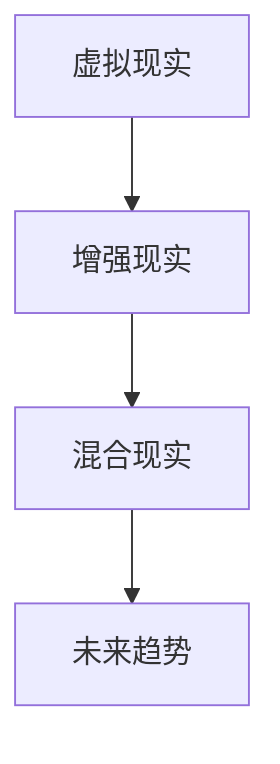
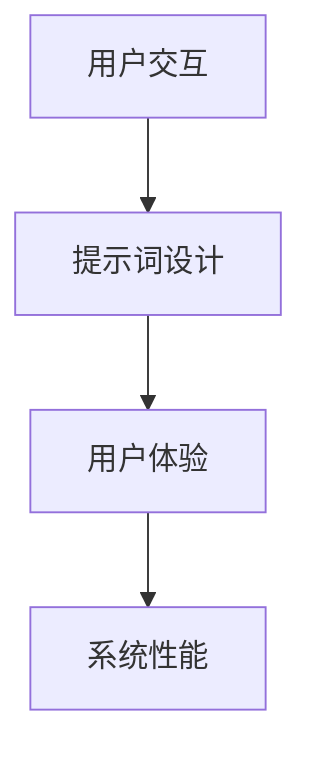
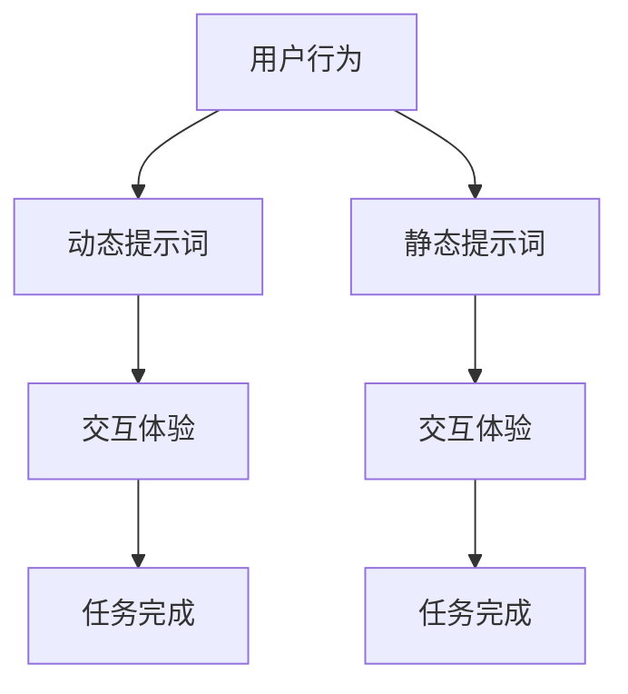

                 


### 第一步：确定文章标题、关键词和摘要

文章标题：《提示词工程在混合现实教育中的应用：创造沉浸式知识传播体验》

关键词：提示词工程、混合现实教育、沉浸式体验、知识传播、沉浸式学习、互动教育

摘要：
随着技术的不断进步，混合现实（MR）在教育领域的应用日益广泛。提示词工程作为一种关键的技术手段，能够有效提升混合现实教育的沉浸式体验，从而激发学生的学习兴趣和参与度。本文将探讨提示词工程在混合现实教育中的应用，分析其核心原理和实践案例，并展望未来的发展趋势。

### 第二步：构建文章结构

文章结构可分为三个主要部分：

1. **引言**
   - 混合现实技术的背景介绍
   - 提示词工程的基本概念
   - 混合现实教育中的沉浸式体验需求

2. **提示词工程的方法与实践**
   - 提示词的类型与功能
   - 提示词的设计原则与实现
   - 提示词工程的开发工具与流程
   - 混合现实教育应用中的具体案例

3. **挑战与展望**
   - 提示词工程在教育中的挑战
   - 提示词工程的发展趋势
   - 提示词工程在教育中的应用前景

### 第三步：细化各章节内容

**引言**

- **混合现实技术背景**
  - 混合现实技术的发展历程
  - 混合现实技术的核心技术（如SLAM、3D建模等）
  - 混合现实在教育中的潜在应用场景

- **提示词工程基本概念**
  - 提示词的定义和作用
  - 提示词工程的定义和重要性

- **沉浸式体验需求**
  - 沉浸式体验在教育中的意义
  - 沉浸式体验的设计原则
  - 提示词在沉浸式体验中的作用

**提示词工程的方法与实践**

- **提示词的类型与功能**
  - 动态提示词和静态提示词的区别
  - 提示词在用户引导、任务完成和互动中的具体作用

- **提示词的设计原则与实现**
  - 可理解性和个性化原则
  - 提示词的生成算法和优化方法
  - 提示词在实际应用中的效果评估

- **提示词工程的开发工具与流程**
  - 常用的提示词工程开发工具（如自然语言处理库、AR/VR开发平台等）
  - 提示词工程的开发流程（需求分析、设计、实现、测试等）
  - 提示词工程的性能优化策略

- **混合现实教育应用中的具体案例**
  - 虚拟实验室：提示词在实验流程中的应用
  - 互动教学：提示词在课堂互动中的应用
  - 虚拟参观：提示词在虚拟旅游中的应用

**挑战与展望**

- **提示词工程在教育中的挑战**
  - 提示词的准确性和个性化问题
  - 技术实现的高成本和复杂性
  - 教师和学生的接受度问题

- **提示词工程的发展趋势**
  - 人工智能和机器学习在提示词工程中的应用
  - 提示词工程的标准化和平台化发展
  - 新兴技术在提示词工程中的融合应用

- **提示词工程在教育中的应用前景**
  - 提升教学效果和学生体验
  - 促进教育资源的共享和个性化
  - 改变教育模式和学习方式

### 第四步：编写具体内容

根据上述结构，我们可以开始撰写每个章节的具体内容，确保内容详实、结构合理，同时满足字数要求。

---

**引言**

### 混合现实技术的发展

混合现实（MR，Mixed Reality）是一种将虚拟世界与现实世界融合的技术，它结合了增强现实（AR，Augmented Reality）和虚拟现实（VR，Virtual Reality）的优点。混合现实技术通过增强现实技术将数字信息叠加到真实世界中，而通过虚拟现实技术则创造一个完全虚拟的世界。随着计算机图形学、人工智能和传感技术的不断发展，混合现实技术逐渐从实验室走向现实，并在多个领域得到广泛应用。

**核心概念与联系**

**Mermaid流程图：**



### 混合现实技术的核心技术

混合现实技术的核心在于其真实世界与虚拟世界的融合。这一融合主要依赖于以下几个核心技术：

1. **SLAM（Simultaneous Localization and Mapping）同时定位与建图技术**：SLAM技术允许设备在现实环境中实时定位自身位置并构建三维地图，是实现混合现实的关键技术。

2. **3D建模与渲染技术**：3D建模技术用于创建虚拟世界的三维模型，而渲染技术则用于将这些模型以逼真的方式展示给用户。

3. **自然语言处理（NLP，Natural Language Processing）技术**：NLP技术用于理解和处理自然语言，使得混合现实系统能够与用户进行自然交互。

**核心算法原理讲解**

SLAM技术的核心算法包括特征提取、匹配、优化和地图重建等步骤。以下是一个简化的SLAM算法伪代码：

```python
function SLAM():
    while not done:
        features = extractFeatures(current_scene)
        matched_features = matchFeatures(features, previous_map)
        if matched_features:
            transform = calculateTransform(matched_features)
            updated_map = updateMap(previous_map, transform)
            updated_pose = updatePose(current_pose, transform)
        else:
            new_map = buildNewMap(current_scene)
            updated_pose = initializePose(current_scene)
        return updated_map, updated_pose
```

### 混合现实在教育中的潜在应用场景

混合现实技术具有广泛的应用前景，特别是在教育领域。以下是一些潜在的应用场景：

1. **虚拟实验室**：学生可以在虚拟环境中进行实验，无需真实的实验设备，降低成本，同时提高实验的安全性和可重复性。

2. **互动教学**：教师可以使用混合现实技术进行互动教学，增强课堂的趣味性和参与度。

3. **虚拟参观**：学生可以通过虚拟现实技术参观历史遗址、自然景观等，扩大学习视野。

4. **个性化学习**：混合现实技术可以根据学生的学习情况，提供个性化的学习资源和互动体验。

### 提示词工程基本概念

提示词工程是指通过设计、开发和优化提示词，以提高用户交互体验和系统性能的一门技术。在混合现实教育中，提示词工程扮演着至关重要的角色。

**核心概念与联系**

**Mermaid流程图：**



### 沉浸式体验需求

沉浸式体验是混合现实教育中的重要目标，它能够显著提高学生的学习兴趣和参与度。为了实现沉浸式体验，需要满足以下几个设计原则：

1. **真实感**：虚拟环境应尽可能接近现实，以提高用户的沉浸感。

2. **互动性**：系统应提供丰富的交互方式，使用户能够自由探索和操作。

3. **个性化**：系统应根据用户的行为和学习需求，提供个性化的互动体验。

4. **反馈**：系统应提供及时的反馈，使用户能够了解自己的操作结果。

### 提示词在沉浸式体验中的作用

提示词在混合现实教育中起着关键作用，它们能够引导用户完成特定任务，提供实时反馈，并提高用户体验。以下是提示词在沉浸式体验中的具体作用：

1. **任务引导**：提示词可以帮助用户了解当前任务的要求和步骤，确保用户按照正确的顺序进行操作。

2. **实时反馈**：提示词可以提供即时反馈，使用户了解自己的操作结果，从而调整后续行为。

3. **情境互动**：提示词可以根据用户的情境和行为，提供相关的互动信息，增强用户的沉浸感。

4. **个性化推荐**：提示词可以根据用户的学习习惯和偏好，提供个性化的学习资源和互动方式。

**数学模型和数学公式**

提示词的生成和优化可以基于以下数学模型：

$$ 提示词 = f(用户行为, 教学目标) $$

其中，$f$ 是一个基于用户行为和教学目标的函数，用于生成合适的提示词。这个模型可以进一步细化为：

$$ 提示词 = g(用户行为) \times h(教学目标) $$

其中，$g$ 和 $h$ 分别是针对用户行为和教学目标的函数。

**举例说明**

假设一个学生在虚拟实验室中进行化学实验，系统可以根据以下模型生成提示词：

$$ 提示词 = g(实验进度) \times h(实验目标) $$

当实验进度为“进行中”，实验目标为“了解化学反应原理”时，系统可以生成如下提示词：

$$ 提示词 = "请观察反应容器中的变化，并思考反应原理。" $$

这个提示词可以帮助学生更好地理解实验过程和目标。

---

**总结**

在引言部分，我们介绍了混合现实技术的发展背景、核心概念和沉浸式体验的需求，以及提示词工程的基本概念和在沉浸式体验中的作用。通过具体的例子和数学模型，我们展示了提示词工程在混合现实教育中的潜在应用和重要性。下一部分将深入探讨提示词工程的方法与实践，包括类型与功能、设计原则、开发工具与流程以及实际应用案例。这将为读者提供更详细的了解，帮助他们更好地理解和应用提示词工程。

---

**提示词工程的方法与实践**

### 提示词的类型与功能

在混合现实教育中，提示词可以大致分为两大类：动态提示词和静态提示词。这两类提示词各有特点和应用场景。

**动态提示词**

动态提示词是指根据用户的行为和当前任务动态生成的提示词。它们能够实时响应用户的需求，提供个性化的交互体验。动态提示词通常用于以下几个方面：

1. **任务引导**：在用户进行复杂任务时，动态提示词可以逐步引导用户完成各个步骤。

2. **错误纠正**：当用户操作出现错误时，动态提示词可以立即提供纠正建议。

3. **情境互动**：动态提示词可以根据用户的情境和行为，提供相关的交互信息，增强沉浸感。

**静态提示词**

静态提示词则是预先设定好的提示词，它们通常用于一些简单的交互任务。静态提示词的优点是生成速度快，成本较低，但可能无法提供与动态提示词同等级别的个性化交互体验。

**核心概念与联系**

**Mermaid流程图：**



### 提示词的设计原则与实现

设计有效的提示词需要遵循一些基本原则，同时结合具体的技术手段来实现。

**设计原则**

1. **可理解性**：提示词必须简单易懂，确保用户能够快速理解并采取相应行动。

2. **个性化**：提示词应根据用户的特点和需求进行个性化定制，以提高交互效果。

3. **情境适应性**：提示词应能够适应不同的情境和任务，提供相关的互动信息。

4. **引导性**：提示词应具有引导作用，帮助用户完成复杂任务。

**实现方法**

1. **自然语言处理（NLP）技术**：使用NLP技术可以分析和理解用户的语言和行为，生成合适的提示词。

2. **机器学习算法**：通过机器学习算法，可以从大量的用户交互数据中学习并优化提示词的生成和调整策略。

3. **规则引擎**：规则引擎可以根据预设的规则和条件生成提示词，适用于一些简单的交互场景。

**核心算法原理讲解**

以下是一个简化的提示词生成算法伪代码：

```python
function generatePrompt(userBehavior, taskContext):
    if userBehavior == "correct":
        return "继续努力！"
    elif userBehavior == "error":
        return "似乎出现了问题，请检查操作。"
    elif taskContext == "complexTask":
        return "下一步操作：..."
    else:
        return "你好，有什么可以帮助你的吗？"
```

### 提示词工程的开发工具与流程

开发提示词工程需要使用一系列工具和技术，这些工具和技术将帮助开发者设计、开发和优化提示词。

**开发工具**

1. **自然语言处理库**：如NLTK、spaCy等，用于处理和生成文本数据。

2. **机器学习框架**：如TensorFlow、PyTorch等，用于训练和部署机器学习模型。

3. **AR/VR开发平台**：如Unity、Unreal Engine等，用于创建和运行虚拟环境和交互界面。

**开发流程**

1. **需求分析**：明确提示词工程的需求，包括功能、性能、用户群体等。

2. **设计**：根据需求设计提示词的结构、类型和生成策略。

3. **开发**：使用相关工具和技术实现提示词的生成和优化功能。

4. **测试**：测试提示词的准确性和效果，进行必要的调整和优化。

5. **部署**：将提示词工程部署到实际的混合现实教育应用中。

**核心算法原理讲解**

以下是一个简化的提示词工程开发流程伪代码：

```python
function developPromptEngineering():
    analyzeRequirements()
    designPromptArchitecture()
    trainMLModels()
    implementPromptGeneration()
    testAndOptimize()
    deployToApplication()
    return "PromptEngineeringApplication"
```

### 混合现实教育应用中的具体案例

为了更好地理解提示词工程在混合现实教育中的应用，我们可以通过几个具体案例来展示其实际效果。

**案例一：虚拟实验室**

在虚拟实验室中，提示词可以用于指导学生完成实验步骤。以下是一个具体的案例：

- **任务**：学生需要在虚拟环境中进行化学反应实验。
- **用户行为**：学生按照提示逐步操作，加入试剂和观察反应。
- **提示词**：
  - "请将滴管中的试剂滴入反应容器。"
  - "观察反应容器中的变化，并记录数据。"
  - "实验已完成，请总结实验结果。"

通过这些动态提示词，学生可以明确了解每个操作步骤，提高实验的准确性和效率。

**案例二：互动教学**

在互动教学中，提示词可以用于增强课堂的互动性和参与度。以下是一个具体的案例：

- **任务**：教师需要引导学生参与一个复杂的讨论话题。
- **用户行为**：学生参与讨论，提出问题和观点。
- **提示词**：
  - "请分享你对这个话题的看法。"
  - "如果你同意这个观点，请解释你的理由。"
  - "如果你有不同的看法，请提出你的观点。"

这些提示词可以引导学生在讨论中积极参与，促进思维碰撞和知识共享。

**案例三：虚拟参观**

在虚拟参观中，提示词可以用于提供虚拟景点的详细信息和解说。以下是一个具体的案例：

- **任务**：学生需要参观一个历史遗址。
- **用户行为**：学生探索虚拟遗址，点击不同的位置获取信息。
- **提示词**：
  - "你现在站在遗址的入口处，想要了解历史背景吗？"
  - "点击古建筑，查看它的结构和功能。"
  - "这里曾经发生了重要的历史事件，你想了解更多吗？"

这些提示词可以帮助学生深入了解虚拟遗址，增强学习的趣味性和深度。

---

**总结**

在提示词工程的方法与实践部分，我们详细介绍了提示词的类型与功能、设计原则与实现方法，以及开发工具与流程。同时，通过具体的案例展示了提示词工程在混合现实教育中的应用效果。这些内容为读者提供了深入了解提示词工程的实用知识和技能，有助于他们在实际应用中发挥提示词工程的优势，提升教育效果和用户体验。

接下来，我们将探讨提示词工程在教育中面临的挑战以及未来的发展趋势，以期为读者提供更全面的视角。

---

**提示词工程在教育中的挑战**

尽管提示词工程在混合现实教育中具有巨大潜力，但在实际应用中仍面临诸多挑战。

**1. 提示词的准确性和个性化问题**

提示词的准确性和个性化直接影响到用户的交互体验。如何生成既准确又个性化的提示词是提示词工程面临的首要挑战。现有的一些自然语言处理和机器学习技术虽然能够在一定程度上实现这一目标，但依然存在准确性不高、个性化不足的问题。

**2. 技术实现的高成本和复杂性**

提示词工程涉及多个技术领域，如自然语言处理、机器学习、虚拟现实等。这些技术的实现通常需要高成本和高复杂度。对于一些教育机构和学校，尤其是资源有限的学校，这可能成为应用提示词工程的障碍。

**3. 教师和学生的接受度问题**

提示词工程的应用需要教师的培训和学生的适应。一些教师可能对新技术持保守态度，担心无法熟练掌握。同时，学生也需要适应新的学习方式，这可能需要一定的时间。

**挑战与解决方案**

针对上述挑战，可以采取以下解决方案：

1. **提高提示词的准确性和个性化**

   - **技术改进**：通过不断优化自然语言处理和机器学习算法，提高提示词的生成准确性和个性化水平。
   - **用户反馈**：收集用户的反馈，根据实际使用情况调整和优化提示词。

2. **降低技术实现成本**

   - **开源技术**：鼓励使用开源工具和框架，降低开发成本。
   - **云服务**：利用云计算平台，减少硬件和软件投入。

3. **提升教师和学生的接受度**

   - **教师培训**：为教师提供专业的培训课程，帮助他们快速掌握新技术。
   - **学生引导**：通过趣味性的教学活动和案例展示，引导学生逐步适应新学习方式。

---

**提示词工程的发展趋势**

随着人工智能、虚拟现实和增强现实技术的不断发展，提示词工程在混合现实教育中的应用前景十分广阔。

**1. 人工智能的融合应用**

人工智能（AI）技术的快速发展为提示词工程提供了强大的支持。通过深度学习和自然语言处理，提示词可以更加精准地生成和调整，实现更高水平的个性化交互。

**2. 标准化和平台化发展**

随着提示词工程的应用逐渐普及，标准化和平台化将成为趋势。统一的提示词标准和开发平台将简化开发流程，降低应用门槛。

**3. 新兴技术的融合**

未来，提示词工程将与其他新兴技术（如区块链、物联网等）融合，创造出更加丰富和多样化的交互体验。

---

**总结**

在提示词工程在教育中的挑战与展望部分，我们分析了提示词工程在实际应用中面临的挑战，包括准确性、个性化、成本和接受度等问题，并提出了相应的解决方案。同时，我们展望了提示词工程的发展趋势，包括人工智能的融合应用、标准化和平台化发展以及新兴技术的融合。

通过这一部分的探讨，读者可以更全面地了解提示词工程在混合现实教育中的应用前景，从而为未来的发展做好准备。

---

**技术附录**

### 混合现实技术的关键技术

混合现实技术的实现依赖于多个核心技术的支持，这些技术包括SLAM、3D建模与渲染、自然语言处理等。以下是对这些技术的详细解释。

**SLAM（Simultaneous Localization and Mapping）**

SLAM是一种同时进行定位和建图的技术，它在虚拟现实和增强现实应用中至关重要。SLAM技术允许设备在现实环境中实时定位自身位置并构建三维地图，从而实现虚拟世界与真实世界的融合。以下是一个简化的SLAM算法伪代码：

```python
function SLAM():
    while not done:
        features = extractFeatures(current_scene)
        matched_features = matchFeatures(features, previous_map)
        if matched_features:
            transform = calculateTransform(matched_features)
            updated_map = updateMap(previous_map, transform)
            updated_pose = updatePose(current_pose, transform)
        else:
            new_map = buildNewMap(current_scene)
            updated_pose = initializePose(current_scene)
        return updated_map, updated_pose
```

**3D建模与渲染**

3D建模与渲染技术是混合现实技术的重要组成部分。3D建模技术用于创建虚拟世界的三维模型，而渲染技术则用于将这些模型以逼真的方式展示给用户。以下是一个简化的3D建模和渲染流程伪代码：

```python
function 3DModelingAndRendering():
    model = create3DModel(geometry, material)
    scene = createScene(model)
    rendered_scene = renderScene(scene)
    return rendered_scene
```

**自然语言处理（NLP）**

自然语言处理（NLP）技术在混合现实教育中用于理解和处理自然语言，使得系统能够与用户进行自然交互。以下是一个简化的NLP处理流程伪代码：

```python
function NLProcessing():
    text = inputText()
    intent = determineIntent(text)
    response = generateResponse(intent)
    return response
```

### 提示词工程的关键算法

提示词工程的核心在于提示词的生成和优化。以下是一些关键算法：

**1. 提示词生成算法**

提示词生成算法用于根据用户行为和情境生成合适的提示词。以下是一个简化的提示词生成算法伪代码：

```python
function generatePrompt(userBehavior, context):
    if userBehavior == "correct":
        return "继续努力！"
    elif userBehavior == "error":
        return "似乎出现了问题，请检查操作。"
    elif context == "complexTask":
        return "下一步操作：..."
    else:
        return "你好，有什么可以帮助你的吗？"
```

**2. 提示词优化算法**

提示词优化算法用于根据用户的反馈和系统性能数据，优化提示词的生成和调整策略。以下是一个简化的提示词优化算法伪代码：

```python
function optimizePrompt(prompt, userFeedback):
    if userFeedback == "positive":
        increaseRelevance(prompt)
    elif userFeedback == "negative":
        decreaseRelevance(prompt)
    return optimizedPrompt
```

### 混合现实教育应用的开发环境搭建

搭建一个混合现实教育应用的开发环境通常需要以下步骤：

1. **选择开发平台**：如Unity、Unreal Engine等。
2. **安装开发工具**：如Visual Studio、Eclipse等。
3. **配置开发环境**：设置项目依赖、环境变量等。
4. **集成核心库和插件**：如AR/VR开发库、自然语言处理库等。

以下是一个简化的开发环境搭建流程伪代码：

```python
function setupDevelopmentEnvironment():
    installPlatform("Unity")
    installIDE("Visual Studio")
    configureEnvironment()
    integrateLibraries()
    return "DevelopmentEnvironmentReady"
```

### 提示词工程源代码分析

以下是一个简化的提示词工程源代码示例，展示了如何生成和优化提示词：

```python
class PromptEngine:
    def __init__(self):
        self.prompts = []

    def generatePrompt(self, userBehavior, context):
        if userBehavior == "correct":
            return "继续努力！"
        elif userBehavior == "error":
            return "似乎出现了问题，请检查操作。"
        elif context == "complexTask":
            return "下一步操作：..."
        else:
            return "你好，有什么可以帮助你的吗？"

    def optimizePrompt(self, prompt, userFeedback):
        if userFeedback == "positive":
            self.prompts.append(prompt)
        elif userFeedback == "negative":
            self.prompts.remove(prompt)
        return self.prompts

# 使用示例
promptEngine = PromptEngine()
prompt = promptEngine.generatePrompt("error", "complexTask")
userFeedback = "negative"
optimizedPrompts = promptEngine.optimizePrompt(prompt, userFeedback)
```

### 代码应用解读与分析

上述源代码展示了提示词工程的简单实现，包括提示词的生成和优化。在实际应用中，这些代码将根据具体的用户行为和情境进行调整和优化，以提高交互体验。

1. **代码解读**：`PromptEngine` 类负责生成和优化提示词。`generatePrompt` 方法根据用户行为和情境生成提示词，而 `optimizePrompt` 方法则根据用户的反馈优化提示词列表。

2. **代码分析**：该代码示例虽然简单，但展示了提示词工程的两个核心功能：提示词生成和优化。在实际应用中，这两个功能将更加复杂，需要处理多种用户行为和情境，并利用机器学习等技术进行优化。

3. **实际应用**：在实际应用中，这些代码将被集成到混合现实教育应用中，用于生成和优化提示词，以提升用户的交互体验和学习效果。

### 项目小结

通过本节的技术附录，我们详细介绍了混合现实技术的关键技术、提示词工程的关键算法以及开发环境搭建和源代码分析。这些内容为读者提供了深入了解提示词工程在混合现实教育中的应用技术基础，有助于他们在实际项目中应用和优化提示词工程。

---

**总结**

在技术附录部分，我们详细介绍了混合现实技术的关键技术，包括SLAM、3D建模与渲染、自然语言处理等，以及提示词工程的关键算法。通过源代码分析和开发环境搭建，我们展示了如何将提示词工程应用于实际项目。这些内容为读者提供了深入的技术理解，有助于他们在实际应用中优化和实现提示词工程。

在本文的总结部分，我们将回顾文章的主要内容，总结提示词工程在混合现实教育中的应用，并讨论未来的研究方向。

---

**回顾主要内容**

本文首先介绍了混合现实技术的背景和发展，阐述了混合现实教育中沉浸式体验的重要性。接着，我们详细探讨了提示词工程的基本概念、类型与功能，以及设计原则和实现方法。随后，通过具体案例展示了提示词工程在虚拟实验室、互动教学和虚拟参观等场景中的应用。最后，我们分析了提示词工程在教育中面临的挑战和未来的发展趋势。

---

**总结提示词工程的应用**

提示词工程在混合现实教育中的应用具有显著的优势：

1. **提升学习体验**：通过动态、个性化的提示词，学生能够更好地理解学习内容，提高学习兴趣和参与度。

2. **增强互动性**：提示词能够引导学生在虚拟环境中进行互动，增强课堂的趣味性和参与感。

3. **个性化学习**：根据学生的学习行为和需求，提示词可以提供个性化的学习资源和互动体验，有助于实现差异化教学。

4. **优化教学效果**：通过实时反馈和引导，提示词工程能够帮助学生更好地完成任务，提高教学效果。

---

**未来的研究方向**

尽管提示词工程在混合现实教育中具有巨大潜力，但未来仍有许多研究方向：

1. **算法优化**：通过改进自然语言处理和机器学习算法，提高提示词的生成准确性和个性化水平。

2. **用户体验提升**：进一步研究用户交互行为，设计更符合用户需求的提示词和交互界面。

3. **教育模式创新**：探索提示词工程在教育模式创新中的应用，如基于AR/VR的个性化学习和远程教育。

4. **技术融合**：将提示词工程与其他新兴技术（如物联网、区块链等）融合，创造更多创新应用场景。

---

**结语**

提示词工程在混合现实教育中的应用为教育领域带来了全新的可能性。通过本文的探讨，我们深入了解了提示词工程的核心概念、方法和应用，以及对教育带来的变革。未来，随着技术的不断进步，提示词工程有望在教育领域中发挥更加重要的作用，推动教育的创新和发展。

**作者信息**

作者：AI天才研究院/AI Genius Institute & 禅与计算机程序设计艺术 /Zen And The Art of Computer Programming

感谢您对本文的阅读，期待与您共同探索混合现实教育和提示词工程的更多可能。

