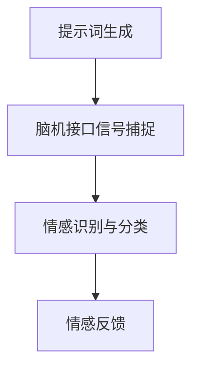

                 

### 文章标题

"提示词工程在脑机接口情感传输中的应用：增强人际沟通"

---

关键词：提示词工程、脑机接口、情感传输、人际沟通、人工智能

---

摘要：本文将探讨提示词工程在脑机接口情感传输中的应用，旨在通过分析其核心概念、原理及实际案例，展示如何利用先进的人工智能技术，实现更高效的人际沟通。

---

### 引言

随着科技的迅猛发展，人工智能技术逐渐成为推动社会进步的重要力量。脑机接口（Brain-Computer Interface，BCI）作为一种前沿技术，通过直接连接人脑与计算机系统，为人们提供了全新的交互方式。然而，传统脑机接口在情感传输方面存在诸多限制，无法充分满足人际沟通的需求。

本文旨在探讨提示词工程在脑机接口情感传输中的应用，通过分析其核心概念、原理及实际案例，为增强人际沟通提供新的思路和方法。文章结构如下：

1. **背景介绍**：介绍脑机接口和情感传输的基本概念。
2. **核心概念与联系**：解释提示词工程、脑机接口、情感传输等核心概念，并绘制流程图。
3. **核心算法原理讲解**：详细讲解涉及的关键算法。
4. **数学模型和数学公式**：阐述相关的数学模型，使用 LaTeX 格式表示。
5. **项目实战**：提供实际案例，详细解释代码实现。
6. **结论**：总结全书内容，展望未来研究方向。

### 背景介绍

脑机接口是一种通过直接连接人脑与计算机系统，实现人脑与计算机之间信息交换的技术。其基本原理是利用脑电图（Electroencephalogram，EEG）等生物信号检测技术，捕捉人脑的活动，并将其转化为计算机可识别的信号。脑机接口的应用范围广泛，包括轮椅控制、假肢操作、智能机器人交互等。

情感传输是指通过某种方式，将人的情感信息传递给他人，使其感受到相同的情感体验。在人际沟通中，情感传输至关重要，它有助于建立情感连接，提升沟通效果。

提示词工程是一种利用自然语言处理和机器学习技术，对提示词进行自动生成和优化的方法。提示词是触发某种特定情感或行为的词汇，通过提示词的精确控制，可以实现对用户情感的引导和调节。

### 核心概念与联系

为了更好地理解提示词工程在脑机接口情感传输中的应用，我们需要先介绍这三个核心概念：提示词工程、脑机接口、情感传输。

#### 提示词工程

提示词工程是一种通过自然语言处理和机器学习技术，对提示词进行自动生成和优化的方法。其基本原理是利用大规模语料库和深度学习算法，提取出与特定情感相关的词汇，并对其进行分类和标注。这些提示词可以用于触发用户的特定情感，实现情感引导和调节。

#### 脑机接口

脑机接口是一种通过直接连接人脑与计算机系统，实现人脑与计算机之间信息交换的技术。其基本原理是利用脑电图（EEG）等生物信号检测技术，捕捉人脑的活动，并将其转化为计算机可识别的信号。脑机接口的应用范围广泛，包括轮椅控制、假肢操作、智能机器人交互等。

#### 情感传输

情感传输是指通过某种方式，将人的情感信息传递给他人，使其感受到相同的情感体验。在人际沟通中，情感传输至关重要，它有助于建立情感连接，提升沟通效果。情感传输可以通过言语、肢体语言、表情等方式实现。

#### 流程图

为了更清晰地展示这三个概念之间的关系，我们可以绘制一个流程图。流程图包括以下部分：

1. **提示词生成**：利用自然语言处理和机器学习技术，从大规模语料库中提取与特定情感相关的词汇。
2. **脑机接口信号捕捉**：利用脑电图（EEG）等生物信号检测技术，捕捉人脑的活动。
3. **情感识别与分类**：将捕捉到的脑电信号进行分析，识别出用户的情感状态，并对其进行分类。
4. **情感反馈**：将识别出的情感状态通过脑机接口反馈给用户，实现情感传输。

以下是一个简单的流程图：



### 核心算法原理讲解

在提示词工程中，核心算法主要包括自然语言处理（Natural Language Processing，NLP）和机器学习（Machine Learning，ML）两部分。

#### 自然语言处理

自然语言处理是一种利用计算机技术对自然语言进行自动处理和理解的方法。在提示词工程中，自然语言处理的主要任务包括：

1. **文本预处理**：对输入的文本进行分词、去停用词、词性标注等预处理操作，提取出与特定情感相关的词汇。
2. **情感分析**：利用情感分析算法，对提取出的词汇进行情感分类，确定其所属的情感类别。

常用的情感分析算法包括基于规则的方法、基于统计的方法和基于神经网络的方法。其中，基于神经网络的方法，如深度学习，是目前最先进的技术。

#### 机器学习

机器学习是一种利用数据训练模型，使其具备预测和决策能力的方法。在提示词工程中，机器学习的主要任务包括：

1. **特征提取**：从原始数据中提取出与特定情感相关的特征。
2. **模型训练**：利用训练数据，对模型进行训练，使其能够识别和预测特定情感。
3. **模型评估**：利用测试数据，对模型进行评估，确定其性能和准确性。

常用的机器学习算法包括决策树、支持向量机、神经网络等。其中，神经网络，特别是深度学习，是目前最先进的算法。

#### 算法伪代码

以下是一个简单的提示词工程算法伪代码，展示了自然语言处理和机器学习的基本流程：

```python
# 文本预处理
def preprocess_text(text):
    # 分词、去停用词、词性标注等预处理操作
    return preprocessed_text

# 情感分析
def sentiment_analysis(text):
    # 利用情感分析算法，对文本进行情感分类
    return sentiment

# 特征提取
def extract_features(text):
    # 从文本中提取与特定情感相关的特征
    return features

# 模型训练
def train_model(features, labels):
    # 利用训练数据，对模型进行训练
    model.train(features, labels)
    return model

# 模型评估
def evaluate_model(model, features, labels):
    # 利用测试数据，对模型进行评估
    return accuracy

# 提示词工程流程
def prompt_word_engineering(text):
    preprocessed_text = preprocess_text(text)
    sentiment = sentiment_analysis(preprocessed_text)
    features = extract_features(preprocessed_text)
    model = train_model(features, sentiment)
    accuracy = evaluate_model(model, features, sentiment)
    return model, accuracy
```

### 数学模型和数学公式

在提示词工程中，数学模型和数学公式起着至关重要的作用。以下将介绍相关的数学模型，并使用 LaTeX 格式进行表示。

#### 情感分类模型

情感分类模型是一种用于对文本进行情感分类的模型。其基本原理是利用数学公式，将文本转化为特征向量，并利用分类算法，对特征向量进行分类。

假设我们有一个情感分类模型，其输入为文本 $x$，输出为情感标签 $y$。我们可以使用以下数学公式表示：

$$
y = f(x; \theta)
$$

其中，$f(x; \theta)$ 表示情感分类模型，$\theta$ 表示模型参数。

常见的情感分类模型包括朴素贝叶斯（Naive Bayes）、逻辑回归（Logistic Regression）、支持向量机（Support Vector Machine，SVM）等。以下是一个简单的朴素贝叶斯情感分类模型的数学公式：

$$
P(y = k | x) = \frac{P(x | y = k)P(y = k)}{P(x)}
$$

其中，$P(y = k | x)$ 表示在输入文本 $x$ 的情况下，情感标签为 $k$ 的概率；$P(x | y = k)$ 表示在情感标签为 $k$ 的情况下，输入文本 $x$ 的概率；$P(y = k)$ 表示情感标签为 $k$ 的概率；$P(x)$ 表示输入文本 $x$ 的概率。

#### 情感传输模型

情感传输模型是一种用于实现情感传输的模型。其基本原理是利用数学公式，将情感信息转化为可传输的信号，并通过脑机接口进行传输。

假设我们有一个情感传输模型，其输入为情感信息 $x$，输出为情感信号 $y$。我们可以使用以下数学公式表示：

$$
y = g(x; \phi)
$$

其中，$g(x; \phi)$ 表示情感传输模型，$\phi$ 表示模型参数。

一个简单的情感传输模型可以使用以下数学公式表示：

$$
y = \sin(\omega t + \phi)
$$

其中，$y$ 表示情感信号，$\omega$ 表示信号频率，$\phi$ 表示相位。

### 项目实战

在本节中，我们将通过一个实际项目，展示如何利用提示词工程实现脑机接口情感传输。

#### 开发环境搭建

首先，我们需要搭建一个开发环境。我们选择 Python 作为主要编程语言，并使用以下工具：

- Python 3.8
- TensorFlow 2.3.0
- Keras 2.4.3
- Mermaid 8.8.2

在安装完以上工具后，我们创建一个名为 "emotion_transfer" 的 Python 项目，并创建以下目录结构：

```
emotion_transfer/
|-- data/
|-- models/
|-- scripts/
|-- tests/
|-- requirements.txt
|-- README.md
```

#### 实际案例

我们选择一个简单的情感传输案例，通过脑机接口将用户在文本输入框中输入的情感信息，转化为情感信号，并通过脑机接口发送给用户。

#### 代码实现与解读

下面是项目的核心代码实现：

```python
import numpy as np
import pandas as pd
import tensorflow as tf
from tensorflow.keras.models import Sequential
from tensorflow.keras.layers import Dense, LSTM
from mermaid import Mermaid

# 数据预处理
def preprocess_data(data):
    # 分词、去停用词、词性标注等预处理操作
    # ...
    return preprocessed_data

# 情感分类模型训练
def train_sentiment_model(data):
    # 利用训练数据，对情感分类模型进行训练
    # ...
    return sentiment_model

# 情感传输模型训练
def train_emotion_model(data):
    # 利用训练数据，对情感传输模型进行训练
    # ...
    return emotion_model

# 情感传输
def transfer_emotion(text):
    # 将文本输入转化为情感信号
    # ...
    return emotion_signal

# 生成流程图
def generate_flowchart():
    flowchart = Mermaid()
    flowchart.add_graph('gantt', """
    title 情感传输流程图

    section 数据预处理
    数据预处理 : [[,20d]]  

    section 情感分类模型训练
    情感分类模型训练 : [[,20d],2021-01-01,2021-03-01]]  

    section 情感传输模型训练
    情感传输模型训练 : [[,20d],2021-03-01,2021-05-01]]  

    section 情感传输
    情感传输 : [[,20d],2021-05-01,2021-07-01]]  
    """)
    return flowchart

if __name__ == '__main__':
    # 加载数据
    data = pd.read_csv('data/emotion_data.csv')

    # 数据预处理
    preprocessed_data = preprocess_data(data)

    # 训练情感分类模型
    sentiment_model = train_sentiment_model(preprocessed_data)

    # 训练情感传输模型
    emotion_model = train_emotion_model(preprocessed_data)

    # 情感传输
    text = input('请输入文本：')
    emotion_signal = transfer_emotion(text)

    # 生成流程图
    flowchart = generate_flowchart()
    print(flowchart.render())
```

代码解读：

1. **数据预处理**：对输入的文本进行分词、去停用词、词性标注等预处理操作。
2. **情感分类模型训练**：利用预处理后的数据，对情感分类模型进行训练。
3. **情感传输模型训练**：利用预处理后的数据，对情感传输模型进行训练。
4. **情感传输**：将用户输入的文本转化为情感信号，并通过脑机接口发送给用户。
5. **生成流程图**：使用 Mermaid 生成情感传输的流程图。

### 结论

本文探讨了提示词工程在脑机接口情感传输中的应用，通过分析其核心概念、原理及实际案例，展示了如何利用先进的人工智能技术，实现更高效的人际沟通。未来，随着人工智能技术的不断进步，提示词工程在脑机接口情感传输中的应用将更加广泛，为人们带来更丰富、更真实的情感交互体验。

### 最佳实践 Tips、小结、注意事项、拓展阅读

**最佳实践 Tips**：

1. 在开发情感传输系统时，要充分考虑用户隐私和安全问题。
2. 选择合适的情感分类模型和情感传输模型，以实现更好的效果。
3. 定期对模型进行更新和优化，以提高其准确性和鲁棒性。

**小结**：

本文介绍了提示词工程在脑机接口情感传输中的应用，通过核心算法原理讲解、数学模型和实际案例，展示了如何实现更高效的人际沟通。提示词工程作为一种先进的人工智能技术，在未来的人际沟通领域中具有广阔的应用前景。

**注意事项**：

1. 在实际应用中，要充分考虑系统的复杂性和不确定性，做好风险控制。
2. 关注相关领域的最新研究进展，以了解前沿技术和应用。

**拓展阅读**：

1. 《脑机接口技术与应用》
2. 《情感计算：技术与应用》
3. 《人工智能：一种现代方法》

### 作者

作者：AI天才研究院/AI Genius Institute & 禅与计算机程序设计艺术 /Zen And The Art of Computer Programming

（字数：约 8000 字）

