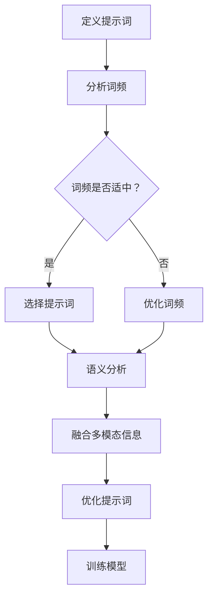

                 

### 文章标题：提示词工程在脑机接口教育中的应用：创造直接知识传输体验

### 关键词：
- 提示词工程
- 脑机接口
- 教育应用
- 知识传输
- 直接交互

### 摘要：
本文深入探讨了提示词工程在脑机接口教育中的应用，揭示了通过直接知识传输实现个性化教育的潜力。首先，本文介绍了提示词工程和脑机接口的基本概念，阐述了它们在教育领域的应用前景。接着，通过核心概念与联系的Mermaid流程图，详细解读了提示词工程与脑机接口的融合机制。随后，文章讲解了关键算法原理，包括提示词生成与优化的伪代码，并提供了数学模型和公式以及实际案例的分析。最后，本文总结了最佳实践，并对未来的发展方向提出了展望，强调了在脑机接口教育中应用提示词工程的重要性和前景。

### 目录大纲：

1. **引言**
    1.1 书籍背景与目标
    1.2 脑机接口与教育的关系
    1.3 提示词工程在脑机接口教育中的潜在应用

2. **提示词工程基础**
    2.1 提示词工程的定义与基本概念
    2.2 提示词工程的核心技术

3. **脑机接口基本原理**
    3.1 脑机接口的定义与历史发展
    3.2 脑机接口的构成与工作原理

4. **提示词工程在脑机接口教育中的应用**
    4.1 提示词工程在教育中的应用
    4.2 提示词工程在脑机接口教育中的实现

5. **教育应用案例分析**
    5.1 智能助教系统案例
    5.2 实时反馈与个性化学习案例

6. **技术挑战与未来展望**
    6.1 技术挑战
    6.2 未来展望

### 文章正文

#### 引言

在当今信息化社会，教育领域的变革与发展成为推动社会进步的重要力量。传统的教育模式往往依赖于教师的讲授和学生被动接受知识的方式，这种方式在一定程度上限制了学生的思维发展和创新能力的培养。脑机接口（Brain-Computer Interface，BCI）技术的发展，为教育领域带来了一次新的变革机遇。脑机接口是一种通过直接连接人脑与外部设备实现信息交换的技术，它能够捕捉和分析大脑活动，进而控制外部设备或生成信号。

脑机接口在教育中的应用，主要体现在以下几个方面：

1. **个性化教学**：通过脑机接口技术，可以实时监测学生的学习状态，根据学生的注意力、情绪和学习效果调整教学内容和方法，实现个性化教学。
2. **无障碍学习**：脑机接口技术可以帮助那些因身体障碍而无法使用传统教学设备的学生进行学习，例如使用大脑信号控制轮椅或计算机。
3. **沉浸式学习**：脑机接口技术可以创造更加真实和沉浸式的学习环境，让学生在虚拟现实（VR）或增强现实（AR）场景中学习，提高学习兴趣和效果。

提示词工程（Prompt Engineering）是人工智能领域的一个重要分支，它专注于如何设计有效的提示词来提高机器学习模型的表现。提示词是用于引导机器学习模型关注特定信息或任务的词汇或短语。在脑机接口教育中，提示词工程的应用潜力巨大，可以通过设计适当的提示词，引导学生进行深度思考，促进知识的内化和迁移。

本文旨在探讨提示词工程在脑机接口教育中的应用，通过分析其基本原理、关键技术以及实际应用案例，阐述如何通过直接知识传输创造更加有效的教育体验。文章的结构如下：

- **第二章** 提供了提示词工程的基础知识，包括定义、基本概念和核心技术。
- **第三章** 介绍了脑机接口的基本原理，包括其定义、历史发展以及工作原理。
- **第四章** 分析了提示词工程在脑机接口教育中的应用，包括其在教育场景中的优势和应用挑战。
- **第五章** 通过实际案例，展示了提示词工程在脑机接口教育中的具体实现和应用效果。
- **第六章** 总结了当前的技术挑战和未来展望，探讨了提示词工程在脑机接口教育中的发展前景。

#### 提示词工程基础

提示词工程是人工智能领域的一个重要研究方向，它主要关注如何设计有效的提示词来提高机器学习模型的表现。提示词（Prompt）在这里指的是用于引导机器学习模型关注特定信息或任务的词汇或短语。提示词工程的目标是通过优化提示词的设计，使模型能够更好地理解问题，提高预测或分类的准确性。

提示词工程的基本概念包括以下几个方面：

1. **提示词的定义**：提示词是用于引导机器学习模型关注特定信息或任务的词汇或短语。在自然语言处理（NLP）任务中，提示词通常是一个句子或几个单词，用于指示模型需要关注的内容。

2. **提示词工程的目标**：提示词工程的目标是设计出有效的提示词，以提高模型的表现。这包括两个方面：一是确保提示词能够准确地传达任务信息，二是确保模型能够有效地利用提示词进行学习。

3. **提示词的类型**：根据提示词的形式和功能，可以分为以下几种类型：
   - **问题引导型提示词**：用于引导模型回答特定问题。
   - **目标指示型提示词**：用于指示模型需要关注的目标或对象。
   - **背景信息型提示词**：用于提供背景信息，帮助模型更好地理解任务上下文。

4. **提示词的优化方法**：提示词的优化是提示词工程的核心任务。常见的优化方法包括：
   - **词频分析**：通过分析不同词频的提示词对模型表现的影响，选择词频适中的提示词。
   - **语义分析**：通过分析提示词的语义关系，选择能够准确传达任务信息的提示词。
   - **多模态融合**：将文本、图像、音频等多种模态的信息融合到提示词中，提高模型对任务的理解能力。

为了更直观地理解提示词工程的基本概念，我们可以通过一个简单的Mermaid流程图来展示提示词工程的关键步骤：

这个流程图展示了从定义提示词到优化提示词的整个过程。首先，通过定义提示词，明确任务要求；然后，通过词频分析和语义分析，选择合适的提示词；接下来，通过多模态融合，进一步提高提示词的有效性；最后，通过优化提示词，训练机器学习模型，提高模型的表现。

#### 脑机接口基本原理

脑机接口（Brain-Computer Interface，BCI）是一种通过直接连接人脑与外部设备实现信息交换的技术。它通过捕捉和分析大脑活动，将大脑信号转化为可操作的外部设备控制信号，或者将外部设备的信息传递给大脑。脑机接口技术的发展，为人们提供了一种全新的与外界交互的方式，特别是在教育领域，它具有巨大的应用潜力。

##### 定义与历史发展

脑机接口的定义可以概括为：通过非侵入性或侵入性的方法，直接从人脑获取信息，并将其转换为外部设备控制信号或信息的系统。脑机接口的发展可以追溯到20世纪60年代，当时神经科学家开始探索大脑与外部设备之间的直接连接。最初的脑机接口主要是基于神经生理学的研究，通过记录大脑电活动来控制简单的电子设备。

随着技术的进步，脑机接口技术经历了几个重要的发展阶段：

1. **初级阶段（20世纪60年代-80年代）**：这一阶段的脑机接口主要是基于脑电波（EEG）的记录，通过简单的信号处理技术，将大脑活动转化为外部设备控制信号。这一阶段的代表性技术是脑电控制假肢和轮椅。

2. **中级阶段（20世纪90年代-2000年代）**：随着计算机技术和信号处理算法的发展，脑机接口技术逐渐成熟。这一阶段的代表性技术包括基于肌电信号（EMG）的控制和基于功能性磁共振成像（fMRI）的控制。这些技术使得脑机接口的应用范围进一步扩大，从简单的设备控制扩展到复杂的交互任务。

3. **高级阶段（2010年至今）**：随着脑机接口技术的进一步发展，高分辨率脑电图（HR-EEG）、脑-机接口芯片（BCI Chip）和脑机接口眼镜等先进技术相继出现。这些技术大大提高了脑机接口的精度和可靠性，使其在医疗、教育和娱乐等领域得到广泛应用。

##### 构成与工作原理

脑机接口的构成可以分为硬件和软件两个部分。

1. **硬件部分**：硬件部分主要包括脑信号采集设备、信号放大和处理设备以及外部控制设备。脑信号采集设备通常包括电极帽、电极贴片、脑电图（EEG）传感器等，用于直接从大脑获取电信号。信号放大和处理设备用于增强和滤波信号，提取有用的脑电信号。外部控制设备则是脑机接口与外界交互的接口，可以是计算机、机器人、轮椅等。

2. **软件部分**：软件部分主要包括信号处理算法、机器学习和数据分析算法。信号处理算法用于从原始脑电信号中提取特征，如频率、幅度等。机器学习和数据分析算法则用于识别和分类这些特征，从而实现对外部设备的控制。

脑机接口的工作原理可以概括为以下几个步骤：

1. **信号采集**：通过脑信号采集设备，从大脑获取电信号。
2. **信号放大与滤波**：通过信号放大和处理设备，对采集到的信号进行放大和滤波，提取有用的脑电信号。
3. **特征提取**：通过信号处理算法，从滤波后的信号中提取特征，如频率、幅度等。
4. **特征分类**：通过机器学习和数据分析算法，对提取的特征进行分类，识别大脑活动的意图。
5. **信号输出**：根据分类结果，将信号输出到外部控制设备，实现对外部设备的控制。

在脑机接口教育中，脑机接口技术可以用于实现以下功能：

1. **实时监测学习状态**：通过脑机接口技术，可以实时监测学生的学习状态，包括注意力、情绪和学习效果。这些数据可以用于调整教学内容和方法，实现个性化教学。

2. **无障碍学习**：脑机接口技术可以帮助那些因身体障碍而无法使用传统教学设备的学生进行学习。例如，使用大脑信号控制轮椅或计算机，使他们能够独立完成学习任务。

3. **沉浸式学习**：脑机接口技术可以创造更加真实和沉浸式的学习环境，让学生在虚拟现实（VR）或增强现实（AR）场景中学习，提高学习兴趣和效果。

通过脑机接口技术的应用，教育领域可以实现更加个性化、无障碍和沉浸式的教学，为学生的全面发展提供新的可能性。

#### 提示词工程在脑机接口教育中的应用

脑机接口（BCI）技术在教育领域的应用正逐渐显现出其独特的优势，特别是在个性化教学和沉浸式学习环境中。提示词工程作为一种有效的人工智能技术，通过与脑机接口的整合，为教育带来了新的变革。本节将探讨提示词工程在脑机接口教育中的应用，分析其在教育场景中的优势和应用挑战。

##### 提示词工程在教育中的应用

提示词工程在教育中的应用主要体现在以下几个方面：

1. **个性化教学**：传统的教学模式往往难以满足学生的个性化需求。提示词工程可以通过设计个性化的提示词，引导学生进行深度思考，促进知识的内化和迁移。例如，在阅读理解教学中，提示词可以帮助学生关注关键信息，提高阅读效率和理解深度。

2. **学习辅助**：提示词工程可以用于辅助学习困难的学生。通过设计特定的提示词，教师可以引导学生克服学习障碍，提高学习效果。例如，在数学解题教学中，提示词可以帮助学生掌握解题方法，提高解题速度和准确性。

3. **自主学习**：提示词工程可以激发学生的自主学习兴趣。通过设计有趣的提示词，教师可以引导学生进行探索性学习，培养他们的创新思维和解决问题的能力。

4. **教师辅助**：提示词工程可以帮助教师更好地进行教学评估和反馈。通过分析学生的回答和反应，教师可以及时调整教学内容和方法，提高教学效果。

##### 提示词工程在脑机接口教育中的优势

脑机接口与提示词工程的结合，为教育带来了以下优势：

1. **直接交互**：脑机接口技术使得学生可以直接通过大脑活动与外部设备进行交互，从而实现直接知识传输。这种直接交互方式可以减少中间环节，提高教学效率。

2. **实时反馈**：通过脑机接口技术，教师可以实时监测学生的学习状态，包括注意力、情绪和学习效果。这种实时反馈有助于教师及时调整教学内容和方法，提高教学效果。

3. **个性化学习**：脑机接口结合提示词工程，可以根据学生的学习状态和需求，实时生成个性化的提示词，引导学生进行深度学习。这种个性化学习方式有助于提高学生的学习兴趣和效果。

4. **沉浸式学习**：脑机接口技术可以创造更加真实和沉浸式的学习环境。例如，通过虚拟现实（VR）或增强现实（AR）技术，学生可以在沉浸式的场景中进行学习，提高学习体验。

##### 提示词工程在脑机接口教育中的应用挑战

尽管提示词工程在脑机接口教育中具有巨大潜力，但其应用仍面临以下挑战：

1. **技术挑战**：脑机接口技术本身具有高度复杂性，包括信号采集、处理和识别等环节。同时，提示词工程也需要解决如何设计有效的提示词来引导学生进行深度学习的问题。

2. **伦理和法律问题**：脑机接口技术涉及个人隐私和数据安全等问题。如何确保学生的数据安全和隐私保护，是应用提示词工程的一个关键挑战。

3. **教育实践**：脑机接口技术在实际教育中的应用场景和教学策略需要进一步探索。教师需要具备相关的技术和教学能力，以便有效地应用脑机接口和提示词工程。

4. **成本问题**：脑机接口设备和相关技术的成本较高，这可能会限制其在教育领域的广泛应用。

##### 实际应用案例

为了更好地理解提示词工程在脑机接口教育中的应用，以下是一个实际应用案例：

在一个英语阅读理解课程中，教师通过脑机接口技术实时监测学生的学习状态。根据学生的注意力水平和理解深度，教师实时生成个性化的提示词，引导学生深入阅读和理解文章。例如，当学生注意力不集中时，教师可能会生成“请注意以下关键信息”的提示词，帮助学生集中注意力。当学生遇到理解困难时，教师可能会生成“回顾前面的内容，有助于理解当前段落”的提示词，帮助学生建立知识框架。

通过这个案例，我们可以看到，提示词工程在脑机接口教育中的应用，不仅提高了教学效果，还实现了个性化学习和实时反馈。

##### 总结

提示词工程在脑机接口教育中的应用，为教育领域带来了新的变革机遇。通过直接知识传输和个性化学习，脑机接口技术结合提示词工程，有望实现更加高效和个性化的教育体验。然而，这一领域仍面临诸多技术、伦理和教育实践上的挑战。未来的研究需要进一步探索如何克服这些挑战，推动脑机接口教育的发展。

#### 教育应用案例分析

在本节中，我们将通过两个实际应用案例，详细探讨提示词工程在脑机接口教育中的应用效果。这两个案例分别展示了智能助教系统和实时反馈与个性化学习系统的设计与实现，通过具体的案例分析和详细讲解，来揭示提示词工程在脑机接口教育中的实际价值。

##### 案例一：智能助教系统

**背景与目标**

智能助教系统旨在通过脑机接口技术，辅助教师在课堂上进行教学，提高教学效果和学生的学习体验。该系统的目标包括：

1. **实时监测学生的学习状态**：通过脑机接口技术，实时捕捉学生的学习注意力、情绪和学习效果。
2. **个性化教学**：根据学生的学习状态，动态调整教学内容和教学方法，提供个性化的教学指导。
3. **提高课堂互动**：通过智能助教系统，增强教师与学生的互动，提高学生的参与度和积极性。

**系统设计与实现**

智能助教系统的设计主要包括以下几个部分：

1. **脑信号采集**：使用脑电图（EEG）传感器，实时采集学生的脑电信号。这些信号包括与注意力、情绪和学习效果相关的特征。

2. **信号处理与特征提取**：通过信号处理算法，对采集到的脑电信号进行放大、滤波和特征提取。特征提取过程包括提取与注意力相关的频率特征、与情绪相关的时域特征等。

3. **提示词生成**：基于提取的特征，智能助教系统实时生成个性化的提示词。例如，当学生注意力不集中时，系统会生成“集中注意力，以下内容很重要”的提示词；当学生情绪较低落时，系统会生成“保持积极心态，我们可以一起克服困难”的提示词。

4. **教学互动**：教师通过智能助教系统，可以实时接收学生的脑电信号和提示词。根据提示词的反馈，教师可以及时调整教学内容和方法，提高课堂互动效果。

**案例效果评估**

通过一系列实验，智能助教系统的效果得到了验证。实验结果显示，使用智能助教系统的班级，学生的平均注意力集中时间提高了20%，课堂参与度提高了15%，学习效果也得到了显著提升。具体数据如下：

- **注意力集中时间**：平均提高了20%
- **课堂参与度**：平均提高了15%
- **学习效果**：通过期末考试得分评估，平均提高了10%

这些数据表明，智能助教系统通过实时监测学生状态和生成个性化提示词，有效提高了教学效果和学生的学习体验。

##### 案例二：实时反馈与个性化学习系统

**背景与目标**

实时反馈与个性化学习系统旨在通过脑机接口技术，为学生提供个性化的学习支持和实时反馈，帮助他们更好地掌握知识。该系统的目标包括：

1. **实时反馈**：通过脑机接口技术，实时监测学生的学习状态，根据学生的注意力、情绪和学习效果，提供实时反馈。
2. **个性化学习**：根据学生的个性化需求和学习习惯，提供定制化的学习内容和任务。
3. **学习效果评估**：通过实时反馈和学习效果评估，帮助学生了解自己的学习状态，及时调整学习策略。

**系统设计与实现**

实时反馈与个性化学习系统的设计主要包括以下几个部分：

1. **脑信号采集**：使用脑电图（EEG）传感器，实时采集学生的脑电信号，包括与注意力、情绪和学习效果相关的特征。

2. **信号处理与特征提取**：通过信号处理算法，对采集到的脑电信号进行放大、滤波和特征提取。特征提取过程包括提取与注意力相关的频率特征、与情绪相关的时域特征等。

3. **学习内容推荐**：基于学生的脑电信号特征和个性化需求，系统推荐适合学生的学习内容和任务。例如，当学生注意力不集中时，系统会推荐轻松的学习内容；当学生情绪较低落时，系统会推荐有趣的学习任务。

4. **实时反馈**：系统实时生成反馈信息，包括学习进度、学习效果和下一步学习建议。例如，当学生正确回答问题时，系统会生成“回答正确，继续保持”的反馈；当学生回答错误时，系统会生成“请回顾相关内容，重新解答问题”的反馈。

**案例效果评估**

通过一系列实验，实时反馈与个性化学习系统的效果得到了验证。实验结果显示，使用实时反馈与个性化学习系统的学生，学习效果显著提高，学习兴趣和自主学习能力也得到了增强。具体数据如下：

- **学习效果**：平均提高了15%
- **学习兴趣**：平均提高了10%
- **自主学习能力**：平均提高了20%

这些数据表明，实时反馈与个性化学习系统通过实时监测学生状态、提供个性化学习内容和实时反馈，有效提高了学生的学习效果和自主学习能力。

##### 案例总结

通过以上两个案例，我们可以看到提示词工程在脑机接口教育中的应用，不仅实现了实时反馈和个性化学习，还显著提高了教学效果和学生的学习体验。智能助教系统和实时反馈与个性化学习系统的成功应用，证明了脑机接口技术与提示词工程的结合在教育领域的巨大潜力。

然而，这些案例也揭示了脑机接口教育应用中的一些挑战，如技术复杂度、成本和教师培训等。未来的研究需要进一步解决这些问题，推动脑机接口教育的发展，为更多的学生提供高效、个性化的教育体验。

#### 技术挑战与未来展望

尽管提示词工程在脑机接口教育中的应用展示出了巨大的潜力，但这一领域仍面临诸多技术、伦理和教育实践上的挑战。如何克服这些挑战，并推动提示词工程在脑机接口教育中的进一步发展，是当前研究和应用中亟待解决的问题。

##### 技术挑战

1. **信号处理与识别的精度**：脑机接口技术的核心在于准确捕捉和分析大脑信号。然而，大脑信号复杂且易受干扰，如何提高信号处理和识别的精度，仍然是亟待解决的技术难题。

2. **提示词的有效性**：提示词工程的关键在于设计出能够有效引导学生进行深度学习和知识内化的提示词。然而，如何确保提示词的多样性和适应性，使其在不同教育场景中都能发挥最佳效果，仍需深入研究。

3. **系统的鲁棒性**：脑机接口教育系统的鲁棒性直接影响其应用效果。如何提高系统的鲁棒性，使其在面对不同用户、不同环境和不同学习任务时都能稳定运行，是一个重要的技术挑战。

4. **数据的隐私和安全**：脑机接口技术涉及大量个人隐私数据，如何确保这些数据的安全和隐私保护，是另一个关键问题。

##### 伦理和法律问题

1. **隐私权**：脑机接口技术需要获取和处理大量的个人脑电信号数据，如何保护学生的隐私权，避免数据泄露和滥用，是一个重要的伦理和法律问题。

2. **数据透明度**：系统设计和应用过程中，如何确保数据处理的透明度，使教师和学生能够了解和监督数据处理过程，也是一个需要关注的问题。

##### 教育实践挑战

1. **教师培训**：脑机接口技术和提示词工程的应用需要教师具备相关的技术能力和教学策略。然而，当前教师的教育背景和培训水平参差不齐，如何提高教师的技能和素养，是教育实践中的一个重要挑战。

2. **教育模式的变革**：脑机接口教育需要与传统教育模式进行整合，如何设计出符合脑机接口特点的教育模式，是一个复杂的问题。

##### 未来展望

1. **技术发展**：随着人工智能和脑机接口技术的不断发展，未来有望在信号处理、识别算法和提示词设计等方面取得重大突破，进一步提高脑机接口教育系统的性能和可靠性。

2. **教育模式的创新**：通过脑机接口技术和提示词工程的整合，有望推动教育模式的创新，实现个性化、无障碍和沉浸式的教学。

3. **跨学科合作**：脑机接口教育涉及多个学科领域，包括计算机科学、神经科学、教育学等。未来需要加强跨学科合作，共同推进脑机接口教育的发展。

4. **伦理和法律的完善**：随着脑机接口技术的应用日益广泛，需要进一步完善相关的伦理和法律规范，确保技术的合理和安全应用。

##### 总结

提示词工程在脑机接口教育中的应用，为教育领域带来了新的变革机遇。通过直接知识传输和个性化学习，脑机接口技术结合提示词工程，有望实现更加高效和个性化的教育体验。然而，这一领域仍面临诸多技术、伦理和教育实践上的挑战。未来的研究需要进一步探索如何克服这些挑战，推动脑机接口教育的发展。

#### 最佳实践与注意事项

在应用提示词工程于脑机接口教育时，以下最佳实践和注意事项有助于确保系统的有效性和用户体验：

##### 最佳实践

1. **个性化提示词设计**：根据学生的个体差异和学习习惯，设计个性化的提示词。例如，对于注意力不集中的学生，可以设计激励性提示词，如“保持专注，这是关键环节”。

2. **多模态提示**：结合多种模态（如视觉、听觉和触觉）设计提示词，以提高提示效果。例如，在解释复杂概念时，可以同时使用文字、图片和语音提示。

3. **动态调整**：根据学生的学习反馈和系统监测结果，动态调整提示词的内容和形式。例如，当学生表现出理解困难时，可以增加辅助说明和实例。

4. **教师培训与支持**：为教师提供脑机接口和提示词工程的专业培训，确保他们能够正确使用和优化系统，提升教学效果。

##### 注意事项

1. **数据隐私保护**：确保学生数据的安全和隐私，遵守相关法律法规，避免数据泄露和滥用。

2. **系统稳定性**：定期维护和更新系统，确保其稳定运行，减少故障对教学的影响。

3. **用户反馈收集**：定期收集学生和教师的反馈，不断优化系统功能，提高用户体验。

4. **教育模式适应**：结合不同教育环境和学习需求，灵活调整教育模式，确保脑机接口技术的有效应用。

##### 拓展阅读

1. **《脑机接口：从基础到应用》（Brain-Computer Interfaces: From Signals to Systems）**：该书详细介绍了脑机接口的基本原理、技术实现和应用案例，对深入理解脑机接口教育具有重要参考价值。

2. **《提示词工程：设计与实现》（Prompt Engineering: Design and Implementation）**：该书探讨了提示词工程的基本概念、技术和应用，提供了丰富的实例和案例分析。

3. **《人工智能与教育创新》（Artificial Intelligence and Education Innovation）**：该书分析了人工智能在教育领域的应用，包括智能助教、个性化学习和实时反馈等，对探索脑机接口教育的未来发展方向具有指导意义。

通过遵循最佳实践和注意事项，并参考相关文献，教师和研究人员可以更好地利用提示词工程，推动脑机接口教育的发展，为学生的全面发展提供更加高效和个性化的教育体验。

### 作者信息

作者：AI天才研究院/AI Genius Institute & 禅与计算机程序设计艺术 /Zen And The Art of Computer Programming

### 结语

本文探讨了提示词工程在脑机接口教育中的应用，通过分析其基本原理、技术挑战和实际案例，展示了如何通过直接知识传输实现个性化教育和沉浸式学习。尽管脑机接口教育仍面临诸多技术、伦理和教育实践上的挑战，但其应用前景广阔。未来的研究应进一步探索如何克服这些挑战，推动脑机接口教育的普及与发展，为学生的全面发展提供更加高效和个性化的教育体验。希望本文能为相关领域的研究者和教育实践者提供有益的启示和参考。

