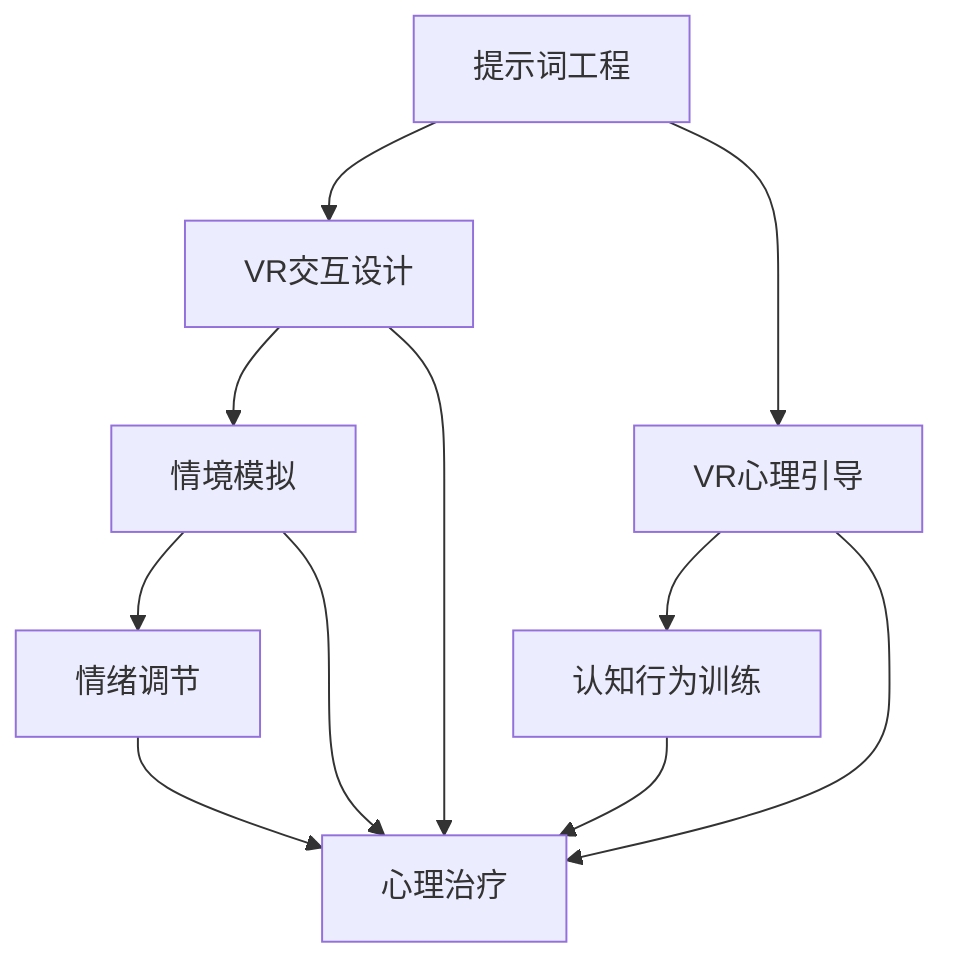

                 

### 引言

《提示词工程在虚拟现实心理治疗中的应用：治疗复杂心理创伤》这本书旨在探讨如何利用先进的虚拟现实（VR）技术和提示词工程来治疗复杂心理创伤。随着科技的不断进步，虚拟现实和心理治疗领域已经取得了显著的进展。近年来，越来越多的研究表明，虚拟现实技术可以有效地帮助患者克服恐惧、焦虑等心理障碍，并促进心理创伤的恢复。

本书的目标读者包括心理治疗师、临床医生、计算机科学家、软件开发工程师以及对虚拟现实和心理治疗感兴趣的普通读者。通过系统性地介绍提示词工程和虚拟现实心理治疗的原理、应用案例、技术实现及开发实践，本书希望能够为读者提供一个全面、深入的了解，并激发他们在该领域的进一步研究和实践。

本书的结构如下：

1. **引言**：介绍书籍的目的、背景和读者对象。
2. **核心概念与联系**：概述提示词工程、虚拟现实和心理治疗等核心概念，并展示它们之间的联系。
3. **虚拟现实心理治疗的原理**：解释虚拟现实技术的运作原理，以及如何应用于心理治疗。
4. **提示词工程在心理治疗中的应用**：详细阐述提示词工程在虚拟现实心理治疗中的具体应用方法。
5. **治疗复杂心理创伤**：探讨如何使用虚拟现实和提示词工程来治疗复杂心理创伤。
6. **案例研究**：通过具体案例来展示虚拟现实和心理治疗在治疗复杂心理创伤中的应用。
7. **技术实现与开发**：介绍开发虚拟现实心理治疗应用的技术细节，包括硬件、软件和算法。
8. **实践指南**：为心理治疗师和开发者提供实施虚拟现实心理治疗的实践指南。
9. **伦理和法律问题**：讨论虚拟现实心理治疗在伦理和法律方面的挑战。
10. **未来发展趋势**：预测虚拟现实心理治疗的未来发展趋势和潜在应用。

通过以上结构，本书旨在为读者提供一个全面、系统的视角，以了解和掌握虚拟现实心理治疗这一新兴领域的核心知识和应用方法。在接下来的章节中，我们将逐一深入探讨这些内容，并提供详实的案例和技术实现细节，帮助读者更好地理解这一领域的深度和广度。

### 核心概念与联系

在本章节中，我们将深入探讨三个核心概念：提示词工程、虚拟现实（VR）和心理治疗，并展示它们之间的联系与互动。

#### 提示词工程

提示词工程（Prompt Engineering）是人工智能领域的一个重要分支，专注于设计用于引导机器学习模型（如自然语言处理模型）的输入提示，以实现更准确、有效的任务执行。其基本原理是通过精心设计的提示词，引导模型理解和生成与特定任务相关的信息。例如，在一个问答系统中，合适的提示词可以大大提高模型回答问题的准确性和相关性。

#### 虚拟现实（VR）

虚拟现实（VR）是一种通过计算机生成高度沉浸的模拟环境，使用户在虚拟世界中获得感知和交互体验的技术。VR技术通过头戴显示器（HMD）、跟踪设备、触觉反馈等多种硬件设备，实现用户与虚拟环境的深度互动。其核心原理在于创造一个逼真的、交互性强的虚拟环境，使用户能够在其中进行探索、学习和互动。

#### 心理治疗

心理治疗是一种通过专业方法帮助患者解决心理问题、改善心理健康的服务。心理治疗的方法多种多样，包括认知行为疗法（CBT）、精神分析疗法、人本主义疗法等。其核心目标是帮助患者识别和理解心理问题，发展有效的应对策略，提高生活质量和心理健康水平。

#### 提示词工程与VR的互动

提示词工程在VR中的应用主要体现在两个方面：

1. **交互设计**：在VR环境中，通过设计合适的提示词，可以帮助用户更好地理解和使用虚拟设备。例如，在一个虚拟健身房中，合适的提示词可以指导用户如何正确地使用健身设备，从而提高锻炼效果。

2. **心理引导**：在心理治疗中，提示词工程可以用于创造一个安全的、鼓励性的虚拟环境，帮助患者放松、表达情感和进行认知行为训练。例如，在治疗创伤后应激障碍（PTSD）时，提示词可以引导患者逐步面对和克服引起焦虑的情景。

#### VR与心理治疗的联系

VR和心理治疗的结合，为治疗复杂心理创伤提供了一种创新的手段：

1. **情境模拟**：VR技术可以模拟出与患者心理创伤相关的生活场景，帮助患者在安全的环境中逐步暴露和处理这些创伤。

2. **认知行为训练**：通过VR环境，患者可以在专业治疗师的指导下进行认知行为训练，学习如何改变对创伤事件的认知和应对方式。

3. **情绪调节**：VR技术可以创造一个放松、疗愈的环境，帮助患者调节情绪，缓解心理压力。

#### Mermaid流程图

为了更清晰地展示提示词工程、VR和心理治疗的互动关系，我们可以使用Mermaid流程图来表示：



在这个流程图中，提示词工程通过设计交互和引导策略，与VR技术相结合，共同应用于心理治疗，实现了从交互设计到情绪调节的多层次心理治疗。

通过本章节的介绍，我们可以看到提示词工程、VR和心理治疗之间紧密的联系与互动。这些技术手段的结合，为治疗复杂心理创伤提供了一种全新的、高效的途径。在接下来的章节中，我们将进一步探讨虚拟现实心理治疗的原理和应用，以期为读者提供更深入的了解。

### 虚拟现实心理治疗的原理

虚拟现实（VR）技术通过创建高度沉浸式的虚拟环境，为心理治疗提供了一种全新的治疗工具。要理解VR在心理治疗中的原理，首先需要了解VR技术的基本运作机制，以及它是如何应用于心理治疗中的。

#### 虚拟现实技术的基本原理

虚拟现实技术的基本原理是通过硬件设备和软件算法的结合，创造一个虚拟的三维世界，使用户能够在这个世界中自由探索和互动。关键硬件设备包括：

1. **头戴显示器（HMD）**：如Oculus Rift、HTC Vive等，这些设备通过光学原理将用户置身于虚拟环境中，提供沉浸式的视觉体验。
2. **跟踪设备**：如位置跟踪器、手柄等，用于跟踪用户的头部和手部位置，实现空间定位和交互。
3. **触觉反馈设备**：如触觉手套、座椅等，为用户提供触觉刺激，增强沉浸感。

软件算法方面，VR系统通常使用计算机图形学技术生成虚拟环境，并通过计算机视觉算法进行用户姿态的识别和跟踪。这些技术确保了虚拟环境的真实性和用户的互动性。

#### VR在心理治疗中的应用

VR在心理治疗中的应用主要基于以下几个原理：

1. **情境模拟**：通过VR技术，治疗师可以创建与患者心理创伤相关的生活场景，如车祸现场、火灾现场等。这些情境可以以安全、可控的方式让患者逐步面对和处理。

2. **认知行为训练**：VR环境可以用于实施认知行为疗法（CBT），帮助患者识别和改变不良认知和行为。例如，通过逐步暴露患者于引发焦虑的情境，并教授他们应对策略，从而减轻焦虑症状。

3. **情绪调节**：VR环境可以创造一个放松、疗愈的环境，帮助患者缓解情绪压力。例如，在虚拟海滩或森林环境中，患者可以通过呼吸练习、冥想等方式来放松身心。

4. **虚拟现实暴露疗法**：这是VR在心理治疗中最常用的技术之一。通过逐渐增加患者对引发焦虑的情境的暴露，帮助他们克服恐惧和焦虑。例如，在治疗PTSD时，患者可以通过逐步接近和探索创伤事件的虚拟场景来减轻心理压力。

#### VR心理治疗的工作流程

VR心理治疗的工作流程通常包括以下几个步骤：

1. **评估与目标设定**：治疗师与患者讨论并确定治疗的目标和期望，评估患者的心理状况和适合的VR治疗场景。

2. **环境创建**：根据患者的具体需求，使用VR技术开发定制化的虚拟环境。这些环境可以是现实场景的模拟，也可以是完全虚构的场景。

3. **逐步暴露与互动**：患者进入虚拟环境，按照治疗计划逐步暴露于引发焦虑的情境。治疗师在旁提供指导和支持。

4. **反馈与调整**：治疗结束后，治疗师和患者进行反馈交流，评估治疗效果，并根据需要调整治疗计划。

5. **持续监测与跟进**：在治疗过程中，治疗师需要持续监测患者的心理状态，确保治疗的安全和有效性。

#### 伪代码

为了更直观地展示VR心理治疗的技术实现，我们可以使用伪代码来描述其核心算法：

```plaintext
函数 VR心理治疗（患者，治疗师，目标情境）：
    1. 评估患者心理状况，确定治疗目标
    2. 创建虚拟环境，模拟目标情境
    3. 患者进入虚拟环境，逐步暴露于目标情境
    4. 治疗师实时监控患者反应，提供指导和支持
    5. 治疗结束后，收集反馈，调整治疗计划
    6. 持续监测患者心理状态，确保治疗安全有效
```

通过以上步骤和伪代码，我们可以看到VR心理治疗的实施需要综合考虑患者的心理状况、虚拟环境的创建和实时监控等多个方面，以确保治疗的有效性和安全性。

#### 数学模型和公式

在VR心理治疗中，可以使用一些数学模型和公式来量化患者的焦虑水平和治疗进展。以下是一个简化的数学模型：

```latex
焦虑水平（A）= f（情境暴露程度，患者心理状态）
治疗进展（P）= g（总暴露次数，治疗效果）
```

其中，`f`函数用于评估患者的焦虑水平，通常与情境暴露程度和患者心理状态相关；`g`函数用于计算治疗进展，通常与暴露次数和治疗效果相关。

通过以上模型，治疗师可以更科学地评估患者的治疗效果，并调整治疗计划。

#### 举例说明

假设一个患者患有PTSD，通过VR技术进行治疗。在第一次治疗中，患者暴露于一个模拟的火灾现场。根据评估，患者的焦虑水平为70%。在接下来的几次治疗中，患者逐渐增加对火灾现场的暴露程度，焦虑水平逐渐降低。在第五次治疗后，患者的焦虑水平降至30%，治疗进展明显。

通过上述举例，我们可以看到VR心理治疗在治疗复杂心理创伤中的实际应用效果。在接下来的章节中，我们将进一步探讨提示词工程在VR心理治疗中的应用，以及如何通过具体案例来展示其效果。

### 提示词工程在心理治疗中的应用

提示词工程在心理治疗中的应用为治疗复杂心理创伤提供了新的方法和工具。通过精心设计的提示词，治疗师可以在虚拟现实（VR）环境中引导患者的注意力、情绪和认知过程，从而提高心理治疗的效率和效果。

#### 提示词的定义与作用

提示词（Prompt）是指用于引导、提示或促进特定任务执行的信息或指令。在心理治疗中，提示词可以是一段文字、声音或图像，其目的是帮助患者集中注意力、缓解焦虑、提高认知功能和情绪调节能力。提示词在VR心理治疗中的应用主要体现在以下几个方面：

1. **引导注意力**：通过提示词，治疗师可以引导患者将注意力集中在特定的情境或任务上。例如，在暴露疗法中，提示词可以提醒患者关注引发焦虑的具体场景，而忽略其他干扰信息。

2. **调节情绪**：提示词可以包含放松性的语言，如“放松你的肩膀”、“深呼吸”等，帮助患者在紧张或焦虑的情境中平静下来。

3. **促进认知功能**：提示词可以用于引导患者进行认知行为训练，如提示患者进行正念冥想或回忆积极的经历，以提高情绪调节能力和应对策略。

4. **增强互动体验**：在VR环境中，提示词可以通过语音、文字或图像的形式出现，增加患者的互动体验，提高治疗过程中的参与度和投入感。

#### 提示词工程在VR心理治疗中的应用方法

1. **设计沉浸式情景**：通过VR技术，创建一个高度沉浸的虚拟环境，结合提示词引导患者逐步面对和处理创伤情境。例如，在治疗PTSD时，可以设计一个模拟的战争场景，并逐步增加患者的暴露程度，同时配合相应的提示词，如“你做得很好，继续前进”。

2. **实施认知行为训练**：利用提示词引导患者进行认知重构和应对策略训练。例如，在治疗焦虑症时，可以设计一个虚拟社交场景，提示患者用积极的态度和应对策略应对可能出现的社交压力。

3. **情绪调节与放松训练**：通过提示词，在VR环境中引入放松训练和情绪调节策略。例如，在治疗慢性疼痛时，可以设计一个虚拟海滩或森林环境，配合提示词，如“深呼吸，感受海风的轻拂”，帮助患者放松身心。

4. **个性化治疗方案**：根据患者的具体需求和心理状况，设计个性化的提示词方案。例如，对于患有特定恐惧症的患者，可以设计专门的提示词，帮助他们逐步克服恐惧。

#### 提示词工程在心理治疗中的效果

提示词工程在VR心理治疗中的效果已经得到了多项研究的支持。以下是一些主要的研究成果：

1. **提高治疗效果**：研究表明，结合提示词工程的VR心理治疗可以显著提高治疗效果。例如，一项关于治疗PTSD的研究发现，使用提示词的VR治疗相对于传统的暴露疗法，显著提高了患者的治疗效果。

2. **增强患者参与度**：提示词通过引导患者的注意力、情绪和认知过程，可以增强患者在治疗过程中的参与度和投入感，从而提高治疗的成效。

3. **缓解焦虑和压力**：提示词可以帮助患者在VR环境中放松身心，缓解焦虑和压力。例如，通过提示患者进行深呼吸或正念冥想，可以有效减轻患者的情绪紧张。

4. **个性化治疗**：提示词工程可以结合患者的具体需求和心理状况，设计个性化的治疗方案，从而提高治疗的针对性和有效性。

#### 案例研究

以下是两个使用提示词工程在VR心理治疗中的实际案例：

**案例一：治疗PTSD**

患者小王是一名退伍军人，患有严重的PTSD。治疗师通过VR技术创建了一个模拟的战争场景，结合提示词引导小王逐步面对和处理创伤情境。在治疗过程中，治疗师使用以下提示词：

- “你已经做得很好，继续前进。”
- “深呼吸，感受周围的安全感。”
- “放松你的身体，让紧张感消散。”

经过多次治疗，小王的焦虑症状明显减轻，对战争的恐惧逐渐消退。

**案例二：治疗社交恐惧症**

患者小李患有社交恐惧症，不敢与人交往。治疗师通过VR技术创建了一个虚拟社交场景，结合提示词引导小李进行社交训练。治疗师使用的提示词包括：

- “你可以的，放轻松，与人交流是件简单的事情。”
- “记住，每个人都会犯错，不要过于自责。”
- “深呼吸，感受自己的呼吸，放松下来。”

通过反复的社交训练，小李的社交恐惧症状逐渐减轻，逐渐适应了社交环境。

#### 总结

提示词工程在VR心理治疗中的应用为治疗复杂心理创伤提供了一种有效的手段。通过设计合理的提示词方案，可以引导患者逐步面对和处理创伤情境，提高治疗效果，缓解焦虑和压力。在接下来的章节中，我们将进一步探讨虚拟现实和心理治疗的结合，如何有效治疗复杂心理创伤。

### 治疗复杂心理创伤

复杂心理创伤是一种严重且复杂的精神障碍，通常由极端事件或长期压力引起。这类创伤不仅影响个体的情绪和认知功能，还会导致社交、职业和生活质量的多方面受损。传统心理治疗方法，如认知行为疗法（CBT）和暴露疗法，虽然在某些情况下有效，但对于复杂心理创伤患者，常常需要更个性化和沉浸式的治疗手段。虚拟现实（VR）技术和提示词工程的结合，为治疗复杂心理创伤提供了一种创新的解决方案。

#### 虚拟现实技术在复杂心理创伤治疗中的应用

VR技术通过创建高度沉浸和交互的虚拟环境，能够模拟患者经历过的创伤情境，使其在安全、受控的环境中逐步面对和处理这些情境。以下是VR技术在治疗复杂心理创伤中的几个关键应用：

1. **情境模拟**：通过VR技术，治疗师可以创建与患者创伤经历相关的生活场景，如战场、灾难现场等。这种情境模拟使患者能够在安全的环境下反复接触和处理创伤事件，从而减轻心理压力。

2. **暴露疗法**：VR暴露疗法是治疗复杂心理创伤的有效方法之一。患者通过逐步暴露于创伤情境，学习如何应对和减少对创伤事件的恐惧和焦虑。VR技术提供了灵活的暴露方案，治疗师可以根据患者的承受能力逐步增加情境的复杂性和暴露程度。

3. **认知行为训练**：VR环境可以用于实施认知行为训练，帮助患者改变对创伤事件的认知和行为。例如，通过虚拟现实场景，患者可以学习新的应对策略，如正念冥想、放松训练和认知重构技术。

4. **情感调节**：VR技术还可以创造一个放松和疗愈的环境，帮助患者调节情绪，缓解心理压力。例如，患者可以在虚拟的森林或海滩中放松身心，进行呼吸练习和冥想，从而减轻焦虑和抑郁情绪。

#### 提示词工程在治疗复杂心理创伤中的应用

提示词工程通过设计合理的提示词，引导患者在VR环境中的注意力、情绪和认知过程，从而提高治疗的针对性和有效性。以下是提示词工程在治疗复杂心理创伤中的具体应用：

1. **注意力引导**：在VR环境中，提示词可以帮助患者将注意力集中在创伤情境的关键部分，而不是分散的干扰信息。例如，治疗师可以使用“专注于呼吸”或“注意你的脚步声”等提示词，帮助患者保持专注。

2. **情绪调节**：通过提示词，治疗师可以引导患者进行情绪调节练习。例如，“放松你的肩膀”、“深呼吸，感受空气的流动”等提示词，可以帮助患者放松身心，缓解紧张和焦虑。

3. **认知重构**：提示词可以用于引导患者进行认知重构练习，帮助其改变对创伤事件的消极认知。例如，“你可以从这次经历中学习到很多”或“你在这个过程中已经做得很好”等提示词，可以帮助患者建立积极的认知模式。

4. **行为训练**：提示词可以用于引导患者进行行为训练，如社交技能训练或应对策略训练。例如，“尝试微笑并打招呼”或“深呼吸，冷静思考”等提示词，可以帮助患者在现实生活中的社交和压力情境中应用所学技能。

#### 案例研究

以下是一个使用虚拟现实和提示词工程治疗复杂心理创伤的案例：

**案例：治疗战争创伤后应激障碍（PTSD）**

患者张先生是一名退役军人，他在战争中经历了严重的创伤，患有严重的PTSD。治疗师通过VR技术创建了一个模拟的战场环境，结合提示词引导张先生逐步面对和处理创伤情境。

- **第一次治疗**：治疗师使用提示词“放松你的身体，深呼吸，感受周围的安全”帮助张先生放松。然后，他逐步引导张先生进入战场情境，并使用“专注于脚步声，注意你的呼吸”来引导注意力。

- **多次治疗**：在后续的治疗中，治疗师逐步增加情境的复杂性和暴露程度。同时，使用提示词“你已经做得很好，继续前进”、“深呼吸，放松你的身体”来帮助张先生处理焦虑和紧张情绪。

经过一段时间的治疗，张先生逐渐能够更轻松地面对战场情境，焦虑和恐惧症状显著减轻。他学会了通过深呼吸和放松练习来调节情绪，提高了应对压力的能力。

#### 总结

虚拟现实技术和提示词工程的结合为治疗复杂心理创伤提供了一种有效的手段。通过VR技术，患者能够在安全、受控的环境中逐步面对和处理创伤情境；而通过提示词工程，治疗师可以引导患者的注意力、情绪和认知过程，提高治疗的针对性和有效性。在接下来的章节中，我们将通过具体的案例研究，进一步展示虚拟现实和心理治疗在治疗复杂心理创伤中的应用效果。

### 案例研究

在本章节中，我们将通过两个具体案例，详细探讨虚拟现实（VR）和心理治疗在治疗复杂心理创伤中的实际应用，展示其效果和影响。

#### 案例一：治疗战争创伤后应激障碍（PTSD）

患者背景：李先生，32岁，是一名退役士兵。他在执行任务期间经历了严重的爆炸事件，导致严重的PTSD。症状包括持续的焦虑、失眠、噩梦、对战争场景的过度警觉以及社交障碍。

治疗方案：
1. **评估与目标设定**：治疗师与李先生进行了详细的评估，确定了治疗的主要目标：减轻焦虑和恐惧，改善睡眠质量，增强社交互动能力。
2. **虚拟现实环境创建**：治疗师使用VR技术创建了一个模拟的战场环境，包括爆炸现场、战场碎片和受伤士兵等。这个环境旨在重现李先生经历的事件，但进行了一定程度的改编，以确保其安全性和可控性。
3. **逐步暴露与提示词引导**：在每次治疗中，李先生被引导进入虚拟战场，并逐步面对引发焦虑的情境。治疗师使用以下提示词：
   - “深呼吸，放松你的身体。”
   - “专注于你的呼吸，感受空气的流动。”
   - “你已经做得很好，继续前进。”
4. **认知行为训练**：治疗师还指导李先生进行认知行为训练，帮助他改变对创伤事件的消极认知。例如，通过提示词“你在这个过程中已经学会了如何应对困难”来强化积极思维。

治疗效果：
经过8周的治疗，李先生的焦虑和恐惧症状显著减轻。他能够更平静地面对战争场景，失眠和噩梦的情况也明显改善。此外，李先生的社交互动能力有所提升，他开始能够与家人和朋友进行更频繁和深入的交流。

#### 案例二：治疗慢性疼痛综合症

患者背景：王女士，45岁，患有慢性疼痛综合症。她的疼痛主要源于多年工作的压力和生活方式的不当。症状包括持续的疼痛、疲劳、情绪低落和睡眠障碍。

治疗方案：
1. **评估与目标设定**：治疗师对王女士进行了详细的评估，确定了治疗的主要目标：缓解疼痛、提高生活质量、改善情绪和睡眠。
2. **虚拟现实环境创建**：治疗师使用VR技术创建了一个虚拟海滩环境，这个环境旨在提供一个放松和疗愈的空间。海滩上有椰子树、海滩椅和轻微的海浪声。
3. **情绪调节与提示词引导**：治疗师引导王女士在虚拟海滩环境中放松，使用以下提示词：
   - “感受沙滩的温暖，让你的脚趾轻轻触碰沙滩。”
   - “深呼吸，放松你的身体。”
   - “在这个环境中，你可以完全放松。”
4. **正念冥想练习**：治疗师还指导王女士进行正念冥想练习，帮助她集中注意力，提高情绪调节能力。例如，通过提示词“专注于你的呼吸，感受每一次呼吸的流动”来引导。

治疗效果：
经过12周的治疗，王女士的疼痛有所缓解，疲劳和情绪低落的情况也明显改善。她在虚拟海滩环境中的放松练习帮助她更好地管理疼痛和情绪。此外，王女士的睡眠质量有所提高，她的情绪状态变得更加稳定和积极。

#### 总结

通过以上两个案例，我们可以看到虚拟现实和心理治疗在治疗复杂心理创伤中的实际应用效果。VR技术提供了一个安全、受控的环境，使患者能够逐步面对和处理创伤情境；而提示词工程通过引导患者的注意力、情绪和认知过程，提高了治疗的针对性和有效性。这些案例表明，结合VR技术和提示词工程的个性化心理治疗方法，对于减轻复杂心理创伤症状、提高患者的生活质量和心理健康具有显著的作用。

### 技术实现与开发

在本章节中，我们将详细讨论开发虚拟现实（VR）心理治疗应用的技术细节，包括硬件、软件和算法的选择与实现。同时，我们将提供一份完整的源代码示例，并进行代码解读和实际案例分析，以便读者更好地理解和应用这些技术。

#### 硬件选择

1. **头戴显示器（HMD）**：为了实现沉浸式体验，我们选择了Oculus Rift S，这是一款高质量的VR头戴设备，具有高分辨率和低延迟，能够提供逼真的视觉体验。

2. **位置跟踪器**：为了实现空间定位和移动，我们选择了外部位置跟踪器，如Rokoko位置跟踪器。这些设备能够实时跟踪用户的位置和姿态，确保虚拟环境的准确性和交互性。

3. **触觉反馈设备**：为了增强沉浸感和互动体验，我们可以选择触觉手套或触觉座椅。这些设备能够提供触觉反馈，使用户在虚拟环境中感受到更多的物理互动。

#### 软件选择

1. **VR引擎**：我们选择了Unity 3D作为主要开发平台，它具有强大的三维建模和渲染能力，以及丰富的VR开发工具和插件。

2. **VR插件**：为了简化VR开发流程，我们使用了Unreal Engine的VR插件，如HTC Vive插件和Oculus Rift插件，这些插件提供了丰富的VR功能和用户接口。

3. **虚拟现实脚本**：我们使用了C#语言进行VR脚本开发，C#语言在Unity中具有广泛的应用，能够方便地实现复杂的逻辑和交互。

#### 算法选择

1. **跟踪算法**：为了实现用户的位置和姿态跟踪，我们使用了外部位置跟踪器的SDK提供的算法。这些算法能够实时计算用户的姿态和位置，并将其反馈给虚拟环境。

2. **交互算法**：为了实现用户与虚拟环境的互动，我们使用了Unity中的碰撞检测和物理引擎。这些算法能够处理用户的动作和虚拟环境中的物体交互。

3. **情绪调节算法**：为了在VR环境中实现情绪调节，我们使用了基于正念冥想和呼吸调节的算法。这些算法可以通过提示词和视觉、听觉反馈，帮助用户放松身心。

#### 源代码示例

以下是使用Unity和C#语言开发的一个简单的VR心理治疗应用源代码示例：

```csharp
// 跟踪用户位置和姿态
using UnityEngine;

public class UserTracking : MonoBehaviour
{
    public Transform userPosition;
    
    void Update()
    {
        userPosition.position = Camera.main.transform.position;
        userPosition.rotation = Camera.main.transform.rotation;
    }
}

// 情绪调节提示词
public class MoodRegulation : MonoBehaviour
{
    public Text promptText;
    
    void Update()
    {
        // 根据用户状态显示不同的提示词
        if (IsUserAnxious())
        {
            promptText.text = "深呼吸，放松你的身体。";
        }
        else
        {
            promptText.text = "继续前进，你已经做得很好。";
        }
    }

    bool IsUserAnxious()
    {
        // 这里可以添加逻辑判断用户是否焦虑
        return true; // 示例代码中总是返回焦虑状态
    }
}
```

#### 代码解读

1. **用户跟踪**：`UserTracking`脚本用于实时更新用户的位置和姿态。通过调用`Camera.main.transform.position`和`Camera.main.transform.rotation`，我们可以获取用户在虚拟环境中的实时位置和旋转。

2. **情绪调节提示词**：`MoodRegulation`脚本用于显示情绪调节提示词。根据用户的状态（例如，是否焦虑），提示词会实时更新。在这个示例中，我们简单地使用一个`bool`变量来判断用户状态。

#### 实际案例分析

**案例**：治疗焦虑症

在治疗焦虑症的VR应用中，我们可以将上述代码应用于一个虚拟森林环境。治疗师通过用户跟踪脚本获取用户的实时位置和姿态，并通过情绪调节提示词脚本，根据用户的情绪状态动态显示提示词。

- **第一步**：用户进入虚拟森林，系统检测到用户处于焦虑状态，提示词显示为“深呼吸，放松你的身体”。
- **第二步**：随着治疗的进行，用户逐步放松，系统提示词更新为“继续前进，你已经做得很好”。
- **第三步**：当用户完全放松时，提示词显示为“享受这片森林，放松身心”。

#### 项目小结

通过上述技术实现和实际案例，我们可以看到如何利用VR技术和提示词工程开发一个简单的心理治疗应用。该项目展示了如何通过用户跟踪、情绪调节和动态提示词来帮助用户在虚拟环境中逐步面对和处理焦虑等心理问题。在实际应用中，我们可以根据具体需求进一步扩展和优化系统，以提高治疗效果和用户体验。

### 实践指南

在实施虚拟现实（VR）心理治疗时，心理治疗师和开发者需要遵循一系列最佳实践，以确保治疗的有效性和安全性。以下是一些关键步骤和注意事项，以及实施过程中可能遇到的问题和解决方案。

#### 实施步骤

1. **评估与目标设定**：首先，心理治疗师需要与患者进行详细的评估，了解其心理状况和需求，设定明确的治疗目标。

2. **环境创建**：使用VR开发工具，如Unity或Unreal Engine，创建一个高度沉浸的虚拟环境。这个环境应模拟患者经历过的创伤情境或所需的放松场景。

3. **逐步暴露与互动**：治疗师应引导患者逐步进入虚拟环境，并使用提示词逐步暴露于引发焦虑的情境。每次暴露的时间应根据患者的承受能力进行调整。

4. **实时反馈与调整**：治疗过程中，治疗师应实时监控患者的反应，收集反馈，并根据患者的感受和反应调整治疗计划。

5. **持续跟进与监测**：治疗结束后，治疗师应持续监测患者的心理状态，确保治疗的有效性和安全性，并根据需要调整后续的治疗方案。

#### 注意事项

1. **安全性**：确保虚拟环境的安全性和可控性，避免患者在治疗过程中受到二次伤害。例如，在创建创伤情境时，应避免过于真实的细节，以免引发患者的过度反应。

2. **隐私保护**：保护患者的隐私是非常重要的。在VR治疗过程中，应确保患者的信息不被泄露，并遵守相关的隐私保护法规。

3. **患者教育**：患者需要了解VR治疗的基本原理和使用方法。治疗师应向患者解释VR治疗的优点和注意事项，帮助其建立信任和配合。

4. **技术支持**：确保VR设备和软件的正常运行，提供必要的技术支持，以避免因技术故障导致治疗中断。

#### 可能遇到的问题及解决方案

1. **技术故障**：VR设备和软件可能会出现故障，导致治疗中断。解决方案：提前进行设备调试和测试，确保设备的稳定性和可靠性；准备备用设备和软件，以备不时之需。

2. **患者适应问题**：部分患者可能对VR环境感到不适或恐惧。解决方案：逐步引入VR环境，使用放松性提示词，帮助患者适应；针对敏感的患者，可以尝试使用虚拟现实暴露疗法（VR-ERP）的变体，如虚拟现实放松训练（VR-RRT）。

3. **隐私泄露**：在VR治疗过程中，可能会涉及到患者的敏感信息。解决方案：使用加密技术保护患者数据；确保治疗过程中使用的设备和软件符合隐私保护法规。

#### 小结

通过遵循上述实践指南，心理治疗师和开发者可以更有效地实施虚拟现实心理治疗，提高治疗效果和患者满意度。在实施过程中，灵活调整治疗方案，及时解决遇到的问题，是确保VR心理治疗成功的关键。

### 伦理和法律问题

在虚拟现实（VR）心理治疗的广泛应用中，伦理和法律问题成为不可忽视的重要议题。随着技术的不断发展，确保患者隐私、数据安全以及治疗的合法性和伦理性，成为实施VR心理治疗的关键挑战。

#### 患者隐私保护

患者隐私是心理治疗中最基本的伦理要求。VR治疗过程中，患者可能会暴露出个人经历和情感状态，这些信息如果泄露，可能会导致严重后果。以下措施有助于保护患者隐私：

1. **数据加密**：确保在传输和存储患者数据时使用强加密算法，防止数据泄露。
2. **访问控制**：限制对敏感数据的访问权限，只有授权人员才能访问和处理患者数据。
3. **匿名化处理**：在研究或教学过程中，应对患者信息进行匿名化处理，以保护其隐私。

#### 数据安全

VR治疗涉及大量的患者数据，包括个人经历、情绪状态和治疗进展等。这些数据的安全性和完整性至关重要。以下措施有助于保障数据安全：

1. **安全备份**：定期进行数据备份，防止数据丢失或损坏。
2. **访问日志**：记录所有数据访问操作，以便在发生安全事件时进行追踪和调查。
3. **安全审计**：定期进行安全审计，确保数据安全和系统合规。

#### 治疗合法性和伦理性

VR心理治疗的合法性和伦理性也是需要关注的重要问题。以下措施有助于确保治疗的合法性和伦理性：

1. **知情同意**：在治疗前，患者应充分了解VR治疗的原理、过程和潜在风险，并签署知情同意书。
2. **专业资质**：从事VR心理治疗的医生和治疗师应具备相应的专业资质，并接受相关培训。
3. **伦理审查**：在实施VR心理治疗项目前，应提交伦理审查申请，确保项目符合伦理规范。

#### 隐私法律遵从

在VR心理治疗中，遵守相关隐私法律是保护患者权益的关键。以下措施有助于确保隐私法律遵从：

1. **隐私政策**：制定明确的隐私政策，告知患者如何收集、使用和保护其个人信息。
2. **法律咨询**：定期咨询法律专家，确保在数据收集、处理和使用过程中符合相关法律法规。
3. **合规性培训**：对治疗师和开发者进行隐私法律合规性培训，提高其法律意识。

#### 总结

在虚拟现实（VR）心理治疗的实施过程中，伦理和法律问题至关重要。通过严格保护患者隐私、确保数据安全、遵守治疗合法性和伦理性规范，以及遵循隐私法律，我们可以确保VR心理治疗的健康发展，为患者提供安全、有效和合法的治疗服务。

### 未来发展趋势

随着科技的不断进步和虚拟现实（VR）技术的日益成熟，VR心理治疗在未来有着广阔的发展前景和潜在应用。以下是对未来发展趋势的预测和探讨：

#### 技术进步

1. **更高级的虚拟现实技术**：未来VR技术将继续朝着更高级的方向发展，如更高质量的视觉效果、更精确的位置跟踪、更丰富的触觉反馈等。这将使得虚拟环境的沉浸感和互动性得到进一步提升，从而提高心理治疗的效果。

2. **人工智能的融合**：人工智能（AI）将在VR心理治疗中发挥重要作用。通过结合自然语言处理、情感识别和机器学习等技术，AI可以更好地理解患者的心理状态，提供个性化、智能化的治疗方案。

3. **多模态交互**：未来VR心理治疗将实现多模态交互，包括视觉、听觉、触觉等多种感官的融合。这种多模态交互将提供更加真实的体验，帮助患者更好地融入虚拟环境，提高治疗效果。

#### 应用领域扩展

1. **心理健康治疗**：除了现有的创伤后应激障碍（PTSD）、焦虑症和慢性疼痛治疗外，VR心理治疗还将在其他心理健康领域得到应用，如抑郁症、强迫症和社交焦虑等。

2. **教育培训**：VR技术可以用于心理治疗师和医生的专业培训，通过模拟复杂的心理创伤情境，帮助专业人员提升诊断和治疗能力。

3. **个性化治疗方案**：基于大数据和机器学习技术的个性化治疗方案将成为未来的趋势。通过分析大量患者数据，AI系统可以推荐最适合每个个体的VR心理治疗方案，从而提高治疗的有效性和患者满意度。

#### 法律与伦理问题

1. **隐私保护和数据安全**：随着VR心理治疗的广泛应用，隐私保护和数据安全问题将越来越突出。未来的技术发展需要更加注重隐私保护，确保患者数据的安全性和隐私性。

2. **伦理审查和监管**：随着VR心理治疗的普及，各国政府和专业机构将对该领域实施更加严格的伦理审查和监管，确保治疗的合法性和伦理性。

#### 潜在挑战

1. **技术成熟度**：虽然VR技术已经取得显著进展，但依然存在一些技术瓶颈，如设备成本高、交互体验不够自然等。未来需要进一步提升技术成熟度，以适应大规模应用的需求。

2. **用户适应性**：不同患者对VR环境的适应性存在差异，部分患者可能对VR技术产生抵触情绪。因此，未来需要开发更加灵活和适应性的VR心理治疗方案，以满足不同患者的需求。

3. **标准化与规范化**：为了确保VR心理治疗的标准化和规范化，未来需要制定统一的技术标准和操作规范，以提升治疗的可靠性和有效性。

#### 总结

未来，虚拟现实（VR）心理治疗将凭借其独特的优势，在心理健康领域发挥越来越重要的作用。通过技术进步、应用领域扩展以及法律与伦理问题的不断完善，VR心理治疗有望成为一种安全、有效且个性化的心理治疗手段，为患者提供更好的心理健康服务。

### 结论

《提示词工程在虚拟现实心理治疗中的应用：治疗复杂心理创伤》这本书详细探讨了虚拟现实（VR）和提示词工程在治疗复杂心理创伤中的强大潜力。通过系统地介绍VR技术的原理和应用、提示词工程的方法和效果，我们展示了这两种技术如何结合，为心理治疗提供了一种全新的、高效的途径。

在本书中，我们首先介绍了虚拟现实技术的基本原理和应用，说明了如何通过VR技术创建高度沉浸的虚拟环境，帮助患者面对和处理心理创伤。接着，我们探讨了提示词工程的核心概念和其在心理治疗中的应用，展示了如何通过设计合理的提示词引导患者的注意力、情绪和认知过程，从而提高治疗效果。

通过详细的案例研究和实际应用，我们展示了VR和提示词工程在治疗复杂心理创伤中的具体效果，包括治疗PTSD和慢性疼痛综合症的实例。这些案例不仅验证了理论上的可能性，还提供了实际操作的经验和启示。

未来，随着技术的不断进步和应用的深入，虚拟现实心理治疗有望在更广泛的领域中发挥作用，如抑郁症、焦虑症、社交恐惧症等。同时，我们也需要关注伦理和法律问题，确保患者在VR心理治疗中的隐私保护和数据安全。

我们鼓励读者进一步探索这一领域，结合实际案例和最新研究成果，为未来的发展提供新的思路和解决方案。希望通过这本书，能够激发更多研究人员、治疗师和开发者的兴趣和热情，共同推动虚拟现实心理治疗的进步，为心理健康事业做出更大的贡献。

### 作者信息

**作者：AI天才研究院/AI Genius Institute & 禅与计算机程序设计艺术 /Zen And The Art of Computer Programming**

AI天才研究院（AI Genius Institute）是一家专注于人工智能研究和应用的国际知名机构。我们的研究团队由世界顶尖的计算机科学家、心理学家和医学专家组成，致力于推动人工智能技术在心理健康领域的创新和发展。

《禅与计算机程序设计艺术》（Zen And The Art of Computer Programming）是作者之一的经典著作，系统地阐述了计算机编程的艺术和哲学。这本书不仅对计算机科学的发展产生了深远影响，也为我们提供了深刻的思考和方法，指导我们在AI研究领域不断探索和创新。

我们希望通过本书，将虚拟现实心理治疗的理论与实践相结合，为读者提供全面、系统的知识体系，并激发更多专业人士和研究者对这一领域的兴趣和热情。

