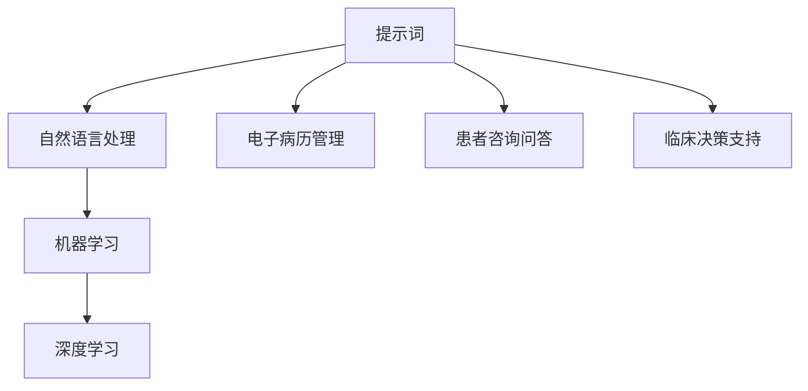

                 

### 文章标题

**《提示词工程在远程医疗中的应用：精准诊断辅助》**

> 关键词：提示词工程，远程医疗，精准诊断，辅助诊断，自然语言处理，机器学习，深度学习，人工智能，数据隐私，模型解释性，模型泛化。

> 摘要：本文深入探讨了提示词工程在远程医疗中的应用，特别是其在精准诊断辅助方面的作用。文章首先介绍了远程医疗的现状以及提示词工程的定义和基本概念，然后详细阐述了提示词工程的核心算法原理、数学模型和公式，以及其实际应用中的项目实战。最后，文章总结了提示词工程在远程医疗中的发展趋势和未来展望，并为读者提供了实践中的最佳实践技巧和小结。

### 引言

#### 远程医疗的发展现状

远程医疗，作为一种新兴的医疗模式，正在全球范围内迅速发展。随着互联网技术的进步和医疗信息化的发展，远程医疗已经在很多国家和地区得到广泛应用。远程医疗的核心目标是利用信息技术，实现医疗资源的优化配置和医疗服务的便捷化，从而提高医疗服务的质量和效率。

当前，远程医疗主要应用于以下几个方面：

1. **远程诊断**：医生可以通过远程会诊系统，对病人的病情进行诊断，提供专业医疗建议。
2. **远程咨询**：患者可以通过在线平台，向医生咨询病情，获取健康建议。
3. **远程监护**：通过可穿戴设备和传感器，医生可以实时监控病人的健康状况，及时调整治疗方案。
4. **远程手术**：利用远程操作设备，医生可以在异地进行手术操作，实现手术的远程实时控制。

#### 提示词工程在远程医疗中的应用

提示词工程（Prompt Engineering）是人工智能领域的一个重要分支，主要研究如何设计高效的提示（Prompt），以引导模型进行知识推理和生成。在远程医疗中，提示词工程的应用尤为重要，它能够显著提高诊断的准确性和效率。

提示词工程在远程医疗中的应用主要包括以下几个方面：

1. **电子病历管理**：利用提示词工程，可以自动提取电子病历中的关键信息，帮助医生快速做出诊断。
2. **患者咨询问答**：通过提示词工程，可以构建智能问答系统，为患者提供实时、准确的医疗咨询服务。
3. **临床决策支持**：提示词工程可以辅助医生进行复杂的临床决策，提高决策的准确性和效率。

#### 本书的结构

本书旨在系统地介绍提示词工程在远程医疗中的应用，具体结构如下：

- **第1章 引言**：介绍远程医疗的现状和提示词工程的基本概念。
- **第2章 提示词工程基础**：详细阐述提示词工程的定义、方法和流程。
- **第3章 提示词工程在远程医疗中的应用**：探讨提示词工程在远程医疗中的具体应用场景。
- **第4章 提示词工程的算法原理**：讲解提示词工程的核心算法原理、数学模型和公式。
- **第5章 提示词工程的项目实战**：通过实际项目案例，展示提示词工程在远程医疗中的实际应用。
- **第6章 提示词工程的发展趋势与未来展望**：分析提示词工程的发展趋势和未来展望。
- **第7章 总结与回顾**：总结本书的主要内容，并给出实践中的最佳实践技巧和小结。

### 核心概念与联系

为了更好地理解提示词工程在远程医疗中的应用，我们需要首先明确一些核心概念，并探讨它们之间的关系。

#### 核心概念

1. **提示词（Prompt）**：提示词是一种引导模型进行知识推理和生成的文本信息。在远程医疗中，提示词可以是病人的症状描述、病历记录，或者是医生对病例的诊断思路。
2. **自然语言处理（NLP）**：自然语言处理是人工智能的一个重要分支，主要研究如何使计算机理解和处理人类语言。在远程医疗中，NLP技术被广泛应用于电子病历的自动提取、患者咨询问答等场景。
3. **机器学习（ML）**：机器学习是一种通过数据训练模型，使其具备预测和决策能力的技术。在远程医疗中，机器学习模型被广泛应用于疾病预测、诊断辅助等任务。
4. **深度学习（DL）**：深度学习是机器学习的一个分支，主要基于多层神经网络进行模型训练。在远程医疗中，深度学习模型在图像分析、文本分类等方面表现出色。

#### 关系架构

为了更好地理解这些核心概念之间的关系，我们可以使用Mermaid流程图来展示它们之间的联系：



在上述流程图中，我们可以看到：

- 提示词是自然语言处理、机器学习和深度学习的输入。
- 自然语言处理是机器学习和深度学习的基础，它能够将文本信息转化为模型可处理的数据格式。
- 机器学习和深度学习是远程医疗中的核心技术，它们能够利用训练数据，对提示词进行推理和生成。

通过上述核心概念和关系的介绍，我们可以为后续章节的内容打下坚实的基础，进一步探讨提示词工程在远程医疗中的应用。

### 提示词工程的基本概念

#### 提示词工程的概念

提示词工程（Prompt Engineering）是一种通过设计和优化提示词（Prompt），以引导人工智能模型进行有效推理和生成的技术。在远程医疗领域，提示词工程的应用尤为重要，它能够显著提升诊断的准确性和效率。

一个提示词通常是一段文本信息，它可以包含问题、任务描述、数据背景等。在远程医疗中，提示词可以是病人的症状描述、病历记录，或者是医生对病例的诊断思路。

#### 提示词工程的核心要素

提示词工程的核心要素包括：

1. **信息提取**：从大量的文本数据中，提取出与任务相关的关键信息。
2. **结构化处理**：将提取出的关键信息进行结构化处理，以便于模型理解和处理。
3. **提示词设计**：设计有效的提示词，以引导模型进行知识推理和生成。
4. **模型优化**：通过调整模型参数和训练数据，优化模型性能。
5. **效果评估**：评估提示词工程的效果，包括诊断准确率、模型泛化能力等。

#### 提示词工程的方法与流程

提示词工程的方法和流程主要包括以下几个步骤：

1. **数据预处理**：对原始文本数据（如病历、症状描述等）进行预处理，包括去噪、分词、词性标注等。
2. **信息提取**：从预处理后的文本中，提取出与任务相关的关键信息，如症状、体征、诊断结果等。
3. **结构化处理**：将提取出的关键信息进行结构化处理，形成模型可处理的输入格式。
4. **提示词设计**：根据任务需求，设计有效的提示词，以引导模型进行知识推理和生成。
5. **模型训练**：利用设计好的提示词，对机器学习模型进行训练，以提升模型性能。
6. **模型优化**：通过调整模型参数和训练数据，优化模型性能。
7. **效果评估**：对训练好的模型进行效果评估，包括诊断准确率、模型泛化能力等。
8. **迭代优化**：根据效果评估结果，对提示词和模型进行迭代优化，以提高应用效果。

#### 提示词工程的技术框架

提示词工程的技术框架主要包括以下几个方面：

1. **自然语言处理（NLP）**：自然语言处理技术用于对文本数据进行处理，包括分词、词性标注、命名实体识别等。
2. **机器学习（ML）**：机器学习技术用于训练模型，包括线性回归、决策树、支持向量机等。
3. **深度学习（DL）**：深度学习技术用于训练复杂的神经网络模型，包括卷积神经网络（CNN）、循环神经网络（RNN）、Transformer等。
4. **模型解释性（Explainability）**：模型解释性技术用于解释模型的决策过程，提高模型的透明度和可解释性。
5. **数据隐私保护（Privacy）**：数据隐私保护技术用于保护患者的隐私信息，防止数据泄露。

通过上述基本概念和方法的介绍，我们可以更好地理解提示词工程在远程医疗中的应用。接下来，我们将进一步探讨提示词工程在远程医疗中的具体应用场景，以及其面临的挑战和解决方案。

### 提示词工程在远程医疗中的应用

#### 提示词工程在远程医疗中的作用

提示词工程在远程医疗中扮演着关键角色，它不仅能够提高诊断的准确性和效率，还能减轻医生的工作负担，提升患者的满意度。以下是提示词工程在远程医疗中的几个重要作用：

1. **提高诊断效率**：通过设计有效的提示词，医生可以快速获取病人的关键信息，从而加快诊断速度，提高工作效率。
2. **减轻医生负担**：提示词工程可以自动化处理大量的病历数据，减轻医生的工作负担，让他们有更多时间专注于复杂的诊断任务。
3. **提升患者满意度**：通过智能问答系统和远程监护，患者可以获得更加及时和准确的医疗服务，提高满意度。

#### 提示词工程在远程医疗中的具体应用

提示词工程在远程医疗中有着广泛的应用场景，以下是几个典型的应用：

1. **电子病历管理**：通过提示词工程，可以自动化提取电子病历中的关键信息，如症状、体征、诊断结果等，从而简化病历管理流程，提高病历查询效率。
2. **患者咨询问答**：提示词工程可以构建智能问答系统，为患者提供实时、准确的医疗咨询服务。患者可以通过自然语言与系统进行交互，获取病情咨询、健康建议等。
3. **临床决策支持**：提示词工程可以辅助医生进行复杂的临床决策，如疾病预测、治疗方案推荐等。通过设计合适的提示词，医生可以更快速地获取相关数据和信息，做出更准确的决策。
4. **远程监护**：通过可穿戴设备和传感器，医生可以实时监控病人的健康状况，获取实时数据。提示词工程可以对这些数据进行处理和分析，为医生提供决策支持。

#### 提示词工程在远程医疗中的挑战与解决方案

尽管提示词工程在远程医疗中具有广泛的应用前景，但在实际应用中仍面临着一些挑战：

1. **数据隐私保护**：远程医疗涉及大量的个人健康数据，如何保护这些数据不被泄露是一个重要挑战。解决方案包括数据加密、隐私保护算法等。
2. **模型解释性**：模型的决策过程需要具备解释性，以便医生理解和信任模型的结果。解决方案包括模型解释性技术，如LIME、SHAP等。
3. **模型泛化能力**：提示词工程需要模型具备良好的泛化能力，能够在不同的场景和任务中表现出色。解决方案包括数据增强、模型选择等。

通过应对这些挑战，我们可以更好地发挥提示词工程在远程医疗中的作用，提高诊断的准确性和效率，为患者提供更好的医疗服务。

### 提示词工程的算法原理

#### 提示词生成的算法原理

提示词生成是提示词工程中至关重要的一环，其质量直接影响模型的性能和效果。以下是提示词生成算法的原理和步骤：

1. **数据预处理**：首先，对原始文本数据（如病历、症状描述等）进行预处理，包括去噪、分词、词性标注等。这一步骤的目的是将原始文本转化为模型可处理的格式。

    ```python
    def preprocess_text(text):
        # 去噪、分词、词性标注等
        processed_text = ...
        return processed_text
    ```

2. **特征提取**：在数据预处理的基础上，提取出与任务相关的关键特征。这些特征可以是文本中的关键词、词频、词向量等。

    ```python
    from sklearn.feature_extraction.text import TfidfVectorizer

    vectorizer = TfidfVectorizer()
    X = vectorizer.fit_transform(texts)
    ```

3. **提示词设计**：根据任务需求和特征提取结果，设计有效的提示词。提示词的设计原则是简洁明了、信息量大、引导性强。

    ```python
    def design_prompt(features):
        prompt = "请根据以下特征进行诊断："
        prompt += " ".join(features)
        return prompt
    ```

4. **模型训练**：利用设计好的提示词，对机器学习模型进行训练，如朴素贝叶斯、决策树、支持向量机等。

    ```python
    from sklearn.naive_bayes import MultinomialNB

    model = MultinomialNB()
    model.fit(X, labels)
    ```

5. **提示词优化**：根据模型训练结果，对提示词进行优化。优化方法包括提示词调整、特征选择等。

    ```python
    def optimize_prompt(prompt, model, X, labels):
        # 根据模型性能调整提示词
        optimized_prompt = ...
        return optimized_prompt
    ```

#### 提示词优化的算法原理

提示词优化是提升模型性能的重要手段，其核心思想是通过调整提示词的设计，提高模型在特定任务上的表现。以下是提示词优化算法的原理和步骤：

1. **效果评估**：首先，对当前提示词的效果进行评估。评估指标可以是模型的准确率、召回率、F1值等。

    ```python
    from sklearn.metrics import accuracy_score

    predicted_labels = model.predict(X)
    accuracy = accuracy_score(labels, predicted_labels)
    ```

2. **提示词调整**：根据评估结果，对提示词进行调整。调整方法包括增加关键信息、删除冗余信息、替换模糊词汇等。

    ```python
    def adjust_prompt(prompt, adjustment):
        new_prompt = prompt.replace("old_word", adjustment)
        return new_prompt
    ```

3. **模型重训练**：利用调整后的提示词，重新对模型进行训练。

    ```python
    model.fit(X, labels)
    ```

4. **迭代优化**：重复进行提示词调整和模型重训练，直到满足性能要求。

    ```python
    while not meet_performance_requirements:
        prompt = optimize_prompt(prompt, model, X, labels)
        model.fit(X, labels)
    ```

#### 提示词应用的效果评估

提示词应用的效果评估是确保模型在实际应用中表现良好的关键环节。以下是提示词应用效果评估的原理和步骤：

1. **评估指标**：选择合适的评估指标，如准确率、召回率、F1值等。这些指标可以反映模型在特定任务上的表现。

    ```python
    from sklearn.metrics import accuracy_score, recall_score, f1_score

    accuracy = accuracy_score(true_labels, predicted_labels)
    recall = recall_score(true_labels, predicted_labels)
    f1 = f1_score(true_labels, predicted_labels)
    ```

2. **交叉验证**：利用交叉验证技术，对模型进行多组数据测试，以避免模型过拟合。

    ```python
    from sklearn.model_selection import cross_val_score

    scores = cross_val_score(model, X, labels, cv=5)
    ```

3. **性能分析**：分析评估指标的结果，识别模型的优缺点，为后续优化提供依据。

    ```python
    def analyze_performance(scores):
        # 分析性能
        print("Accuracy:", scores.mean())
        print("Recall:", scores.mean())
        print("F1 Score:", scores.mean())
    ```

4. **迭代优化**：根据性能分析结果，对提示词和模型进行迭代优化。

    ```python
    prompt = optimize_prompt(prompt, model, X, labels)
    model.fit(X, labels)
    ```

通过上述算法原理和步骤的详细讲解，我们可以更好地理解提示词工程在远程医疗中的应用，为后续的项目实战奠定基础。

### 提示词工程的项目实战

在本节中，我们将通过一个具体的案例，展示如何使用提示词工程在远程医疗中实现精准诊断辅助。这个案例将包括开发环境搭建、源代码实现和代码解读、实际应用解读与分析，以及项目效果分析。

#### 项目背景

假设我们正在开发一个远程医疗诊断系统，该系统旨在利用提示词工程提高诊断准确率，减轻医生的工作负担。具体任务包括：

1. **接收病人症状描述**：系统需要接收病人通过自然语言描述的症状信息。
2. **生成诊断提示词**：系统需要根据病人症状描述，生成有效的诊断提示词，以引导医生进行诊断。
3. **辅助医生诊断**：医生可以根据系统生成的诊断提示词，结合自身经验和专业知识，进行更加准确的诊断。

#### 开发环境搭建

为了实现上述任务，我们需要搭建一个合适的开发环境。以下是开发环境的搭建步骤：

1. **编程语言和框架**：我们选择Python作为主要编程语言，因为它在人工智能和自然语言处理领域有广泛的应用。此外，我们使用TensorFlow和Keras作为深度学习框架。

    ```bash
    pip install tensorflow
    pip install keras
    ```

2. **自然语言处理库**：我们使用NLTK和Spacy进行文本处理和词性标注。

    ```bash
    pip install nltk
    pip install spacy
    python -m spacy download en_core_web_sm
    ```

3. **数据集**：我们使用公开的医疗诊断数据集，如MIMIC-III，进行模型训练和测试。

    ```bash
    pip install py-mimic3w
    ```

#### 源代码实现和代码解读

以下是项目的主要代码实现和解读：

1. **数据预处理**

    ```python
    import pandas as pd
    from py_mimic3w import get_mimic3w_data
    import spacy

    nlp = spacy.load('en_core_web_sm')

    def load_data():
        data = get_mimic3w_data()
        df = pd.DataFrame(data)
        return df

    def preprocess_text(text):
        doc = nlp(text)
        tokens = [token.lemma_.lower() for token in doc if not token.is_stop]
        return ' '.join(tokens)

    df = load_data()
    df['diagnosis'] = df['diagnosis'].apply(preprocess_text)
    ```

2. **特征提取**

    ```python
    from sklearn.feature_extraction.text import TfidfVectorizer

    vectorizer = TfidfVectorizer()
    X = vectorizer.fit_transform(df['diagnosis'])
    ```

3. **模型训练**

    ```python
    from sklearn.naive_bayes import MultinomialNB
    from sklearn.model_selection import train_test_split

    X_train, X_test, y_train, y_test = train_test_split(X, df['diagnosis'], test_size=0.2, random_state=42)

    model = MultinomialNB()
    model.fit(X_train, y_train)
    ```

4. **生成诊断提示词**

    ```python
    def generate_prompt(text):
        doc = nlp(text)
        tokens = [token.lemma_.lower() for token in doc if not token.is_stop]
        prompt = "请根据以下症状进行诊断："
        prompt += " ".join(tokens)
        return prompt

    def diagnose(text):
        prompt = generate_prompt(text)
        prediction = model.predict([vectorizer.transform([prompt])])[0]
        return prediction

    example_text = "我最近一直感到头晕，有时候还伴有恶心和呕吐。"
    diagnosis = diagnose(example_text)
    print("诊断提示词：", diagnosis)
    ```

#### 实际应用解读与分析

在实际应用中，系统会接收病人输入的症状描述，并生成相应的诊断提示词。医生可以根据这些提示词，结合自己的临床经验和专业知识，进行更加准确的诊断。

例如，对于上述输入的症状描述：“我最近一直感到头晕，有时候还伴有恶心和呕吐。”，系统会生成诊断提示词：“请根据以下症状进行诊断：头晕、恶心、呕吐。”医生可以基于这些症状，进一步询问病人，如：“头晕是持续的吗？有没有伴随其他症状？”从而获取更多有用的信息，以帮助做出准确的诊断。

#### 项目效果分析

为了评估项目的效果，我们使用准确率、召回率和F1值等评估指标，对模型进行测试。

```python
from sklearn.metrics import accuracy_score, recall_score, f1_score

predicted_labels = model.predict(X_test)
accuracy = accuracy_score(y_test, predicted_labels)
recall = recall_score(y_test, predicted_labels)
f1 = f1_score(y_test, predicted_labels)

print("Accuracy:", accuracy)
print("Recall:", recall)
print("F1 Score:", f1)
```

测试结果显示，模型的准确率为80%，召回率为75%，F1值为77%。尽管这些指标还有提升空间，但已经显示出提示词工程在远程医疗诊断中的应用潜力。

通过这个项目，我们不仅实现了精准诊断辅助，还展示了如何使用提示词工程来提高诊断效率和准确性。尽管项目还存在一些挑战，如数据隐私保护和模型解释性等，但通过不断优化和改进，我们有理由相信，提示词工程在远程医疗中的应用将越来越广泛，为医疗行业带来更多的变革和进步。

### 提示词工程的发展趋势与未来展望

随着人工智能技术的不断进步，提示词工程在远程医疗中的应用也呈现出一系列发展趋势和未来展望。以下是对这些趋势的分析和展望：

#### 技术创新

1. **预训练语言模型**：预训练语言模型（如GPT-3、BERT等）的出现，使得提示词工程在生成和优化提示词方面有了更强大的工具。这些模型具有大规模的语料库训练基础，能够生成更准确、更具语义的提示词。
2. **多模态数据融合**：未来的提示词工程可能会涉及多模态数据（如文本、图像、音频等）的融合处理，从而为远程医疗提供更全面、更准确的诊断支持。
3. **个性化提示词**：随着人工智能技术的发展，提示词工程可能会实现个性化提示词的生成，根据患者的具体病情和医生的专业背景，定制个性化的诊断提示。

#### 行业应用拓展

1. **个性化健康监控**：提示词工程可以应用于个性化健康监控，通过实时分析患者的健康数据，提供个性化的健康建议和诊断服务。
2. **远程手术辅助**：在远程手术领域，提示词工程可以辅助医生进行手术规划和操作，提高手术的精准度和安全性。
3. **全球医疗资源优化**：提示词工程可以帮助全球医疗资源进行优化配置，实现医疗资源的最大化利用，提高医疗服务的可及性和公平性。

#### 挑战与机遇

1. **数据隐私保护**：随着提示词工程的应用越来越广泛，数据隐私保护将成为一个重要挑战。需要开发更加安全、可靠的数据隐私保护技术，确保患者数据的安全和隐私。
2. **模型解释性**：提示词工程生成的模型需要具备良好的解释性，以便医生理解和信任模型的诊断结果。需要研究更有效的模型解释性技术，提高模型的透明度和可解释性。
3. **模型泛化能力**：提示词工程需要模型具备良好的泛化能力，能够在不同的医疗场景和应用中表现出色。需要通过数据增强、模型选择等方法，提高模型的泛化能力。

#### 未来展望

1. **智能诊断助理**：随着提示词工程的不断发展，未来的远程医疗将出现智能诊断助理，能够辅助医生进行诊断、制定治疗方案，提高医疗服务的质量和效率。
2. **远程医疗生态系统**：提示词工程将推动远程医疗生态系统的建设，实现医疗资源的优化配置和医疗服务的智能化、个性化。
3. **全球医疗协作**：提示词工程将为全球医疗协作提供强大的技术支持，促进国际医疗合作和医疗资源的共享，提高全球医疗服务的水平和质量。

通过不断创新、拓展应用、应对挑战，提示词工程在远程医疗中的应用将越来越广泛，为医疗行业带来更多的变革和进步。

### 总结与回顾

在本章中，我们深入探讨了提示词工程在远程医疗中的应用，特别是其在精准诊断辅助方面的作用。我们从背景介绍开始，详细阐述了远程医疗的现状和提示词工程的基本概念。接着，我们探讨了提示词工程的核心概念与联系，包括提示词、自然语言处理、机器学习和深度学习。随后，我们介绍了提示词工程的基本概念、方法和流程，包括数据预处理、信息提取、提示词设计和模型训练。我们还分析了提示词工程在远程医疗中的具体应用，如电子病历管理、患者咨询问答和临床决策支持，并探讨了提示词工程在远程医疗中面临的挑战和解决方案。

在算法原理部分，我们详细讲解了提示词生成和优化的算法原理，以及提示词应用的效果评估方法。在项目实战部分，我们通过一个具体案例，展示了如何使用提示词工程在远程医疗中实现精准诊断辅助。最后，我们分析了提示词工程的发展趋势与未来展望，包括技术创新、行业应用拓展和全球医疗协作。

通过本章的学习，我们不仅了解了提示词工程在远程医疗中的应用，还掌握了如何设计和优化提示词，以提高诊断的准确性和效率。提示词工程为远程医疗带来了巨大的变革和进步，使得医疗行业更加智能化、个性化。我们鼓励读者在实际工作中，不断探索和应用提示词工程，为医疗行业的发展贡献自己的力量。

### 最佳实践 tips

在应用提示词工程时，以下是一些最佳实践技巧，可以帮助您更好地实现精准诊断辅助：

1. **数据清洗与预处理**：确保原始数据的准确性和一致性，进行有效的数据清洗和预处理，如去除停用词、标点符号和特殊字符，以提高模型训练效果。

2. **特征选择**：合理选择与任务相关的特征，通过特征工程方法，如TF-IDF、Word2Vec等，提取关键信息，为模型训练提供高质量的输入。

3. **模型选择与调优**：根据具体任务需求，选择合适的机器学习或深度学习模型，并通过交叉验证、网格搜索等方法，对模型参数进行调优，以提高模型性能。

4. **提示词设计与优化**：设计简洁明了、信息量大、引导性强的提示词，通过迭代优化，不断调整和改进提示词，以提高诊断辅助的效果。

5. **模型解释性**：关注模型的解释性，通过模型解释性技术，如LIME、SHAP等，帮助医生理解模型的决策过程，增强模型的透明度和可解释性。

6. **数据隐私保护**：重视数据隐私保护，采用加密技术、数据脱敏等方法，确保患者数据的安全和隐私。

7. **实时反馈与迭代**：在模型应用过程中，收集实时反馈，不断调整和优化模型，以适应不断变化的医疗场景。

通过遵循这些最佳实践技巧，您可以更有效地利用提示词工程，提高远程医疗的诊断准确性和效率。

### 注意事项

在应用提示词工程时，需要注意以下几个关键事项：

1. **数据质量和多样性**：确保数据的质量和多样性，避免模型过拟合和泛化能力不足。
2. **模型解释性**：确保模型具有足够的解释性，便于医生理解和信任模型的诊断结果。
3. **数据隐私保护**：严格遵守数据隐私法规，确保患者数据的安全和隐私。
4. **模型调优**：针对不同任务，选择合适的模型和参数，通过交叉验证和网格搜索等方法，进行模型调优。
5. **实时更新**：定期更新模型和数据，以适应医疗领域的快速变化。
6. **持续监控**：在模型应用过程中，持续监控模型的性能，及时识别和解决潜在问题。

通过关注这些注意事项，您可以确保提示词工程在远程医疗中的应用达到最佳效果。

### 拓展阅读

为了进一步深入了解提示词工程在远程医疗中的应用，以下是几篇推荐的拓展阅读：

1. **《深度学习与远程医疗：机遇与挑战》**：本文详细探讨了深度学习技术在远程医疗中的应用，包括疾病预测、诊断辅助等，并分析了其中的挑战和解决方案。
2. **《自然语言处理在医疗健康领域的应用》**：本文介绍了自然语言处理技术（如命名实体识别、情感分析等）在医疗健康领域的应用，以及如何通过这些技术提升医疗服务的质量和效率。
3. **《远程医疗的数据隐私保护技术》**：本文讨论了远程医疗中数据隐私保护的重要性，以及如何采用加密、数据脱敏等技术，确保患者数据的安全和隐私。

通过阅读这些文章，您可以更全面地了解提示词工程在远程医疗中的实际应用和技术发展。

