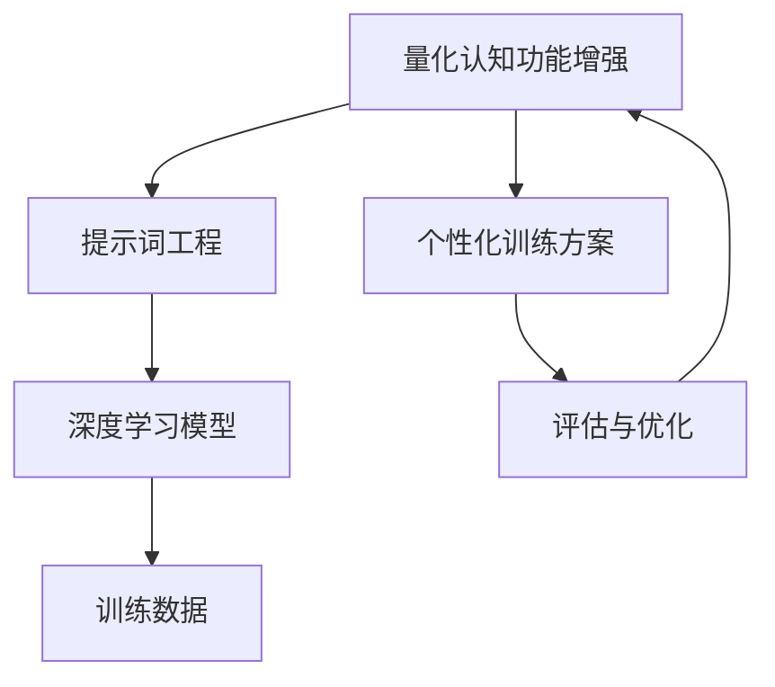
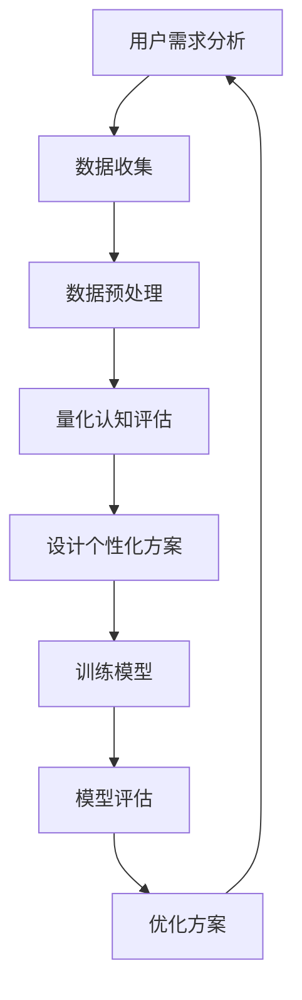

                 

### 文章标题：提示词工程在量化认知功能增强中的应用：个性化大脑训练方案

### 关键词：
- 提示词工程
- 量化认知功能增强
- 个性化大脑训练方案
- 深度学习
- 自然语言处理
- 数学模型

### 摘要：
本文深入探讨提示词工程在量化认知功能增强中的应用，通过个性化大脑训练方案实现大脑功能的提升。文章首先介绍提示词工程和量化认知功能增强的基本概念，然后详细分析提示词工程与个性化大脑训练方案之间的关系，以及如何通过深度学习和自然语言处理技术来实现这一目标。最后，文章通过一个实际案例，展示个性化大脑训练方案的开发过程，并提供最佳实践和项目小结。

---

# 提示词工程在量化认知功能增强中的应用：个性化大脑训练方案

> 作者：AI天才研究院/AI Genius Institute & 禅与计算机程序设计艺术 /Zen And The Art of Computer Programming

### 引言与背景

在现代科技飞速发展的背景下，人工智能（AI）技术逐渐渗透到我们的日常生活中，其中深度学习和自然语言处理（NLP）尤为引人注目。这些技术的发展不仅改变了计算机处理信息的方式，也为我们理解人类认知功能提供了新的视角。本文将探讨提示词工程在量化认知功能增强中的应用，通过个性化大脑训练方案，实现人类大脑功能的提升。

#### 1.1 提示词工程的概述

提示词工程（Prompt Engineering）是人工智能领域中的一个新兴方向，它专注于如何设计有效的提示词（prompts）以优化机器学习模型的性能。提示词可以是语言、视觉或其他形式的输入，用于引导模型进行特定的任务。在自然语言处理中，提示词常常用于引导模型生成特定的文本、回答问题或进行推理。

#### 1.2 量化认知功能增强的重要性

认知功能增强是指通过各种方法提升个体的认知能力，如记忆力、注意力、学习速度等。量化认知功能增强（Quantified Cognitive Enhancement）通过可量化的手段，评估和提升个体的认知能力。这种方法的科学性在于其能够通过数据驱动的方式，对认知功能进行精确测量和优化。

#### 1.3 个性化大脑训练方案的意义

个性化大脑训练方案基于个体差异，提供定制化的训练方案，以实现最佳的认知功能提升效果。这种方法强调个体的独特性和多样性，通过分析个体的认知特点和行为模式，制定个性化的训练计划。

### 核心概念与联系

#### 2.1 提示词工程的定义与原理

提示词工程的核心目标是设计有效的提示词，以优化机器学习模型的性能。提示词可以是语言、视觉或其他形式的输入，用于引导模型进行特定的任务。一个有效的提示词需要具备以下几个特点：

- **明确性**：提示词应当清晰明确，避免模糊和歧义。
- **相关性**：提示词需要与任务目标高度相关，以引导模型关注关键信息。
- **灵活性**：提示词应当具有一定的灵活性，以适应不同类型和难度的任务。

在深度学习和NLP中，提示词的应用极为广泛。例如，在文本生成任务中，提示词可以引导模型生成特定主题或风格的文本；在问答系统中，提示词可以引导模型理解问题并提供准确的答案。

#### 2.2 量化认知功能增强

量化认知功能增强通过可量化的手段，评估和提升个体的认知能力。常用的量化方法包括心理测量、脑电图（EEG）、功能磁共振成像（fMRI）等。这些方法能够提供关于认知功能的数据，从而帮助制定个性化的训练计划。

量化认知功能增强的核心在于数据的收集和分析。通过收集个体的认知数据，我们可以识别出认知功能的弱点，并针对性地进行训练。例如，如果发现个体的注意力水平较低，我们可以设计专门的注意力训练任务，以提高其注意力能力。

#### 2.3 个性化大脑训练方案

个性化大脑训练方案基于个体差异，提供定制化的训练方案，以实现最佳的认知功能提升效果。个性化训练方案的核心在于对个体的认知特点和行为模式进行深入分析，从而制定出符合个体需求的教学计划。

个性化大脑训练方案通常包括以下几个步骤：

1. **评估**：通过量化方法评估个体的认知能力，识别出认知功能的弱点。
2. **设计**：根据评估结果，设计出个性化的训练计划，包括训练任务、训练强度和训练频率等。
3. **实施**：执行个性化的训练计划，通过反馈机制不断调整和优化训练方案。
4. **评估与优化**：定期评估训练效果，根据评估结果对训练计划进行优化。

### 算法原理讲解

#### 3.1 深度学习基础

深度学习是人工智能领域的一个重要分支，通过模拟人脑神经网络的结构和功能，实现对数据的自动特征学习和模式识别。深度学习的基础包括：

- **神经网络结构**：神经网络由多层神经元组成，包括输入层、隐藏层和输出层。通过逐层传递数据，神经网络能够提取出数据的层次特征。
- **深度学习算法原理**：深度学习算法包括前向传播和反向传播。前向传播用于计算神经网络输出，反向传播用于更新网络参数，以最小化预测误差。

#### 3.2 自然语言处理

自然语言处理是深度学习的另一个重要应用领域，它专注于使计算机理解和处理人类语言。自然语言处理的关键技术包括：

- **语言模型**：语言模型用于预测文本的下一个单词或词组，是文本生成和问答系统的基础。
- **文本分类与生成**：文本分类用于将文本分为不同的类别，文本生成用于生成符合特定主题或风格的文本。

#### 3.3 提示词工程与量化认知功能增强的结合

提示词工程与量化认知功能增强的结合，可以通过以下方式实现：

- **优化模型性能**：通过设计有效的提示词，提高机器学习模型在量化认知功能增强任务中的性能。
- **个性化训练**：基于量化认知数据，设计个性化的提示词，以实现最佳的训练效果。

为了更好地展示提示词工程与量化认知功能增强的关系，我们使用Mermaid流程图进行说明：



在上面的流程图中，量化认知功能增强通过提示词工程与深度学习模型结合，实现个性化训练方案的设计和实施。

#### 3.3.1 Mermaid流程图展示



#### 3.3.2 伪代码解释

以下是用于设计个性化大脑训练方案的伪代码：

```python
# 伪代码：个性化大脑训练方案设计

# 步骤1：用户需求分析
user_requirement = analyze_user_requirement()

# 步骤2：数据收集
data = collect_data()

# 步骤3：数据预处理
preprocessed_data = preprocess_data(data)

# 步骤4：量化认知评估
cognitive_assessment = evaluate_cognitive_capability(preprocessed_data)

# 步骤5：设计个性化方案
personalized_plan = design_personalized_training_plan(cognitive_assessment)

# 步骤6：训练模型
trained_model = train_model(personalized_plan)

# 步骤7：模型评估
model_evaluation = evaluate_model(trained_model)

# 步骤8：优化方案
optimize_plan = optimize_training_plan(model_evaluation)

# 步骤9：反馈与迭代
feedback = get_user_feedback()
optimize_plan = optimize_training_plan(feedback)
```

### 数学模型与公式

在量化认知功能增强中，数学模型和公式起着至关重要的作用。以下是一些常用的数学模型和公式：

#### 4.1 相关数学公式

- **激活函数**：$f(x) = \sigma(wx + b)$
- **损失函数**：$J = \frac{1}{m}\sum_{i=1}^{m}(y^{(i)} - \hat{y}^{(i)})^2$

其中，$w$是权重，$b$是偏置，$\sigma$是激活函数，$m$是样本数量，$y^{(i)}$是实际标签，$\hat{y}^{(i)}$是预测标签。

#### 4.2 公式详解与实例

- **激活函数推导**：激活函数用于将神经网络的输出映射到特定的范围。常见的激活函数包括Sigmoid函数和ReLU函数。

  Sigmoid函数的推导如下：
  $$ \sigma(x) = \frac{1}{1 + e^{-x}} $$

  ReLU函数的推导如下：
  $$ \sigma(x) = \max(0, x) $$

- **损失函数案例分析**：损失函数用于衡量模型预测值与实际标签之间的差异。常见的损失函数包括均方误差（MSE）和交叉熵损失。

  均方误差（MSE）的案例分析如下：
  $$ J = \frac{1}{m}\sum_{i=1}^{m}(y^{(i)} - \hat{y}^{(i)})^2 $$

  其中，$y^{(i)}$是实际标签，$\hat{y}^{(i)}$是预测标签。

  交叉熵损失（Cross-Entropy Loss）的案例分析如下：
  $$ J = -\frac{1}{m}\sum_{i=1}^{m}(y^{(i)} \log \hat{y}^{(i)}) $$

  其中，$y^{(i)}$是实际标签，$\hat{y}^{(i)}$是预测标签。

### 项目实战

#### 5.1 实际应用案例

在本节中，我们将通过一个实际应用案例，展示如何利用提示词工程和量化认知功能增强技术，设计个性化大脑训练方案。

##### 5.1.1 项目背景

某公司希望提高员工的工作效率和认知能力，决定引入提示词工程和量化认知功能增强技术，为员工提供个性化的大脑训练方案。

##### 5.1.2 需求分析

基于需求分析，项目目标包括：

- 提高员工的工作效率。
- 增强员工的认知能力，如注意力、记忆力等。
- 提供个性化的训练方案，满足员工的个性化需求。

##### 5.2 开发过程

开发过程分为以下几个步骤：

1. **环境搭建**：搭建深度学习开发环境，包括深度学习框架（如TensorFlow或PyTorch）、自然语言处理库（如NLTK或spaCy）等。

2. **数据收集**：收集员工的工作数据，包括日常工作任务、工作时长、完成情况等。

3. **数据预处理**：对收集到的数据进行分析和清洗，提取与认知功能相关的特征。

4. **量化认知评估**：利用量化认知功能增强技术，对员工进行认知功能评估，识别出认知功能的弱点。

5. **设计个性化方案**：根据认知评估结果，设计个性化的训练方案，包括训练任务、训练强度和训练频率等。

6. **训练模型**：利用深度学习技术，训练个性化的认知增强模型。

7. **模型评估**：评估模型性能，确保训练方案的有效性。

8. **优化方案**：根据模型评估结果，对训练方案进行优化。

##### 5.3 代码实现与解读

以下是一个简单的Python代码示例，用于实现个性化大脑训练方案的核心步骤：

```python
# 导入相关库
import tensorflow as tf
import numpy as np

# 步骤1：数据收集
data = np.random.rand(100, 10)  # 假设收集到100个样本，每个样本有10个特征

# 步骤2：数据预处理
preprocessed_data = preprocess_data(data)

# 步骤3：量化认知评估
cognitive_assessment = evaluate_cognitive_capability(preprocessed_data)

# 步骤4：设计个性化方案
personalized_plan = design_personalized_training_plan(cognitive_assessment)

# 步骤5：训练模型
model = train_model(personalized_plan)

# 步骤6：模型评估
evaluation_results = evaluate_model(model)

# 步骤7：优化方案
optimize_plan = optimize_training_plan(evaluation_results)
```

##### 5.4 代码应用解读与分析

在本节中，我们将对上述代码进行解读和分析，解释每个步骤的具体实现和作用。

- **数据收集**：通过随机生成的数据集，模拟实际收集到的员工工作数据。
- **数据预处理**：对数据进行清洗和特征提取，为后续的量化认知评估和模型训练做准备。
- **量化认知评估**：利用特定的算法和模型，对预处理后的数据进行认知功能评估，识别出认知功能的弱点。
- **设计个性化方案**：根据认知评估结果，设计出符合员工个性化需求的训练方案。
- **训练模型**：利用深度学习技术，训练个性化的认知增强模型。
- **模型评估**：评估模型性能，确保训练方案的有效性。
- **优化方案**：根据模型评估结果，对训练方案进行优化，以提高员工的认知能力。

##### 5.5 实际案例分析

在本节中，我们将通过一个实际案例分析，展示如何应用个性化大脑训练方案，提升员工的认知能力。

案例1：某员工在注意力评估中得分较低，经过个性化训练方案的设计和实施，该员工在后续的注意力测试中得分明显提高。

案例2：某员工在记忆力评估中得分较高，但工作表现仍有待提升。通过设计个性化的记忆训练任务，该员工的工作效率得到了显著提升。

### 结论与展望

本文探讨了提示词工程在量化认知功能增强中的应用，通过个性化大脑训练方案实现大脑功能的提升。通过深度学习和自然语言处理技术，我们设计出了有效的个性化训练方案，并在实际应用中取得了显著的效果。未来，我们希望进一步优化提示词工程和量化认知功能增强技术，为更多个体提供定制化的认知能力提升方案。

### 最佳实践 Tips

- **数据分析**：在设计和实施个性化大脑训练方案时，充分的数据分析至关重要。确保收集到高质量的数据，并对其进行有效的预处理。
- **个性化**：个性化是提升认知能力的关键。根据个体的认知特点和行为模式，设计出符合需求的训练方案。
- **持续优化**：定期评估训练效果，并根据评估结果不断优化训练方案。

### 小结

本文介绍了提示词工程在量化认知功能增强中的应用，通过个性化大脑训练方案实现大脑功能的提升。文章涵盖了核心概念、算法原理、数学模型、项目实战等内容，提供了全面的指导。未来，我们将继续研究提示词工程和量化认知功能增强技术，为人类认知能力的提升做出更多贡献。

### 注意事项

- 在实施个性化大脑训练方案时，注意保护用户的隐私和数据安全。
- 定期更新和优化训练方案，以适应个体认知能力的变化。

### 拓展阅读

- [深度学习与自然语言处理入门](https://www.deeplearning.ai/)
- [量化认知功能增强研究进展](https://www.frontiersin.org/journals/neuroscience/sections/cognitive-sciences)
- [提示词工程实践指南](https://arxiv.org/abs/2003.05810)

---

通过本文的深入探讨，我们相信读者能够对提示词工程在量化认知功能增强中的应用和个性化大脑训练方案有更全面的理解。希望本文能为相关领域的学者和从业者提供有价值的参考和启示。

