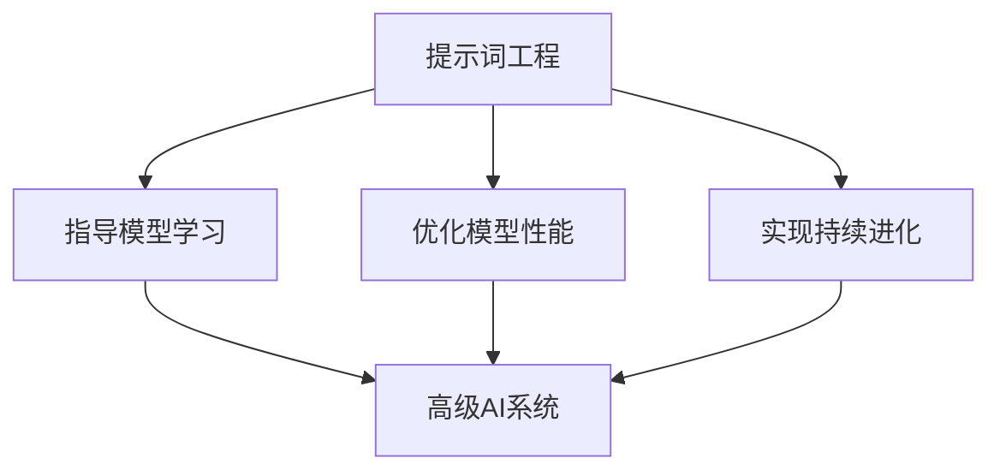
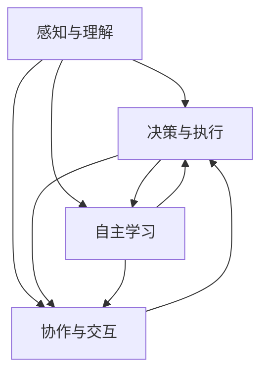

                 

### 文章标题

《提示词工程在高级AI系统自主学习中的应用：实现持续进化》

### 文章关键词

提示词工程、高级AI系统、自主学习、持续进化、算法原理、应用案例

### 文章摘要

本文将深入探讨提示词工程在高级AI系统中的应用，特别是如何通过提示词工程实现AI系统的自主学习与持续进化。首先，我们将介绍高级AI系统和提示词工程的基本概念，并阐述它们之间的联系。随后，我们将分析自主学习在AI系统中的重要性，并介绍相关算法原理和数学模型。在此基础上，本文将探讨持续进化的概念，以及如何在高级AI系统中实现这一机制。通过具体的应用案例和项目实战，我们将展示如何将提示词工程与自主学习、持续进化相结合，以实现高级AI系统的持续进化。最后，本文将对未来的发展趋势和挑战进行展望，为读者提供有益的启示。

---

## 第一步：明确核心概念

在本文中，我们将探讨的核心概念包括“提示词工程”、“高级AI系统”、“自主学习”和“持续进化”。这些概念在当前人工智能领域具有重要意义，相互之间也有着密切的联系。

### 提示词工程

提示词工程是一种在AI系统中利用提示词（例如关键词、标签、短语等）来指导模型学习和优化其性能的方法。它通过设计合理的提示词，帮助模型更好地理解输入数据，从而提高学习效率和预测准确性。

### 高级AI系统

高级AI系统是指具有高级认知能力、自主学习能力和自适应能力的AI系统。这类系统不仅能够处理大量数据，还能够从数据中提取有用信息，进行自我学习和优化。

### 自主学习

自主学习是指AI系统能够在没有人为干预的情况下，通过学习算法和数据处理技术，从数据中获取知识，并不断优化自身的性能。自主学习是高级AI系统的核心能力之一，它使得AI系统能够在不断变化的环境中适应和进化。

### 持续进化

持续进化是指AI系统能够在运行过程中，通过自我学习和优化，不断提高其性能和适应性。持续进化是高级AI系统的一个重要特征，它使得系统能够应对不断变化的需求和环境。

这些概念之间的联系在于，提示词工程可以通过提供有效的提示词，帮助AI系统实现更有效的自主学习，从而实现持续进化。具体来说，提示词工程可以用于以下几个方面：

1. **指导模型学习**：通过设计合理的提示词，帮助模型更好地理解输入数据，提高学习效率。
2. **优化模型性能**：通过提示词工程，模型可以在不断变化的数据环境中，保持高性能和准确性。
3. **实现持续进化**：提示词工程可以帮助AI系统在运行过程中，通过自我学习和优化，不断提高其性能和适应性。

### 绘制Mermaid流程图

为了更好地展示这些概念之间的联系，我们可以使用Mermaid流程图进行描述：



在这个流程图中，提示词工程（A）通过指导模型学习（B）、优化模型性能（C）和实现持续进化（D），与高级AI系统（E）建立联系。通过这些方式，提示词工程为高级AI系统提供了有效的支持和提升。

### 总结

通过明确这些核心概念，我们可以更好地理解提示词工程在高级AI系统中的应用，以及如何通过这些概念实现AI系统的持续进化。在接下来的章节中，我们将进一步深入探讨这些概念，并介绍相关算法原理、数学模型和应用案例。

---

## 第二步：设计章节框架

在明确核心概念之后，我们需要设计文章的章节框架，以确保内容有条理且逻辑清晰。以下是本文的章节框架：

### 第一部分：基础概念与原理

1. **第1章：高级AI系统概述**
   - 介绍高级AI系统的定义、分类和发展趋势。
   - 分析高级AI系统对现代科技和社会的影响。

2. **第2章：提示词工程的概述**
   - 定义提示词工程，介绍其关键要素和作用。
   - 分析提示词工程在AI系统中的应用场景。

3. **第3章：自主学习原理**
   - 解释自主学习的定义和关键技术。
   - 探讨自主学习在AI系统中的重要性。

4. **第4章：持续进化的概念与机制**
   - 定义持续进化的概念，介绍其关键机制。
   - 分析持续进化的优势和挑战。

### 第二部分：算法与应用

1. **第5章：提示词生成算法**
   - 介绍提示词生成算法的基本原理和分类。
   - 分析不同提示词生成算法的应用案例。

2. **第6章：自主学习算法**
   - 介绍常见的自主学习算法，分析其原理和性能。
   - 探讨自主学习算法在AI系统中的应用。

3. **第7章：持续进化算法**
   - 介绍持续进化算法的原理和设计。
   - 分析持续进化算法的实现和性能评估。

4. **第8章：实战案例分析**
   - 提供具体的案例，展示如何将提示词工程、自主学习和持续进化应用于实际场景。

### 第三部分：未来展望与挑战

1. **第9章：高级AI系统与提示词工程的未来发展趋势**
   - 分析高级AI系统与提示词工程的未来发展趋势。
   - 探讨潜在的技术挑战和社会与伦理问题。

2. **第10章：持续进化的前景与影响**
   - 展望持续进化的前景和潜在影响。
   - 分析持续进化的道德与法律问题。

3. **第11章：总结与展望**
   - 总结本文的核心内容和主要观点。
   - 提出未来研究方向和发展方向。

### 设计思路

这个章节框架的设计思路主要是将文章内容分为三个部分：基础概念与原理、算法与应用和未来展望与挑战。第一部分旨在为读者提供一个全面的基础知识，帮助他们理解高级AI系统、提示词工程和自主学习等核心概念。第二部分则通过具体的算法原理、应用案例和项目实战，展示这些概念在实际应用中的价值和效果。第三部分则关注未来的发展趋势和挑战，为读者提供前瞻性的思考和指导。

通过这个章节框架，读者可以系统地了解提示词工程在高级AI系统自主学习中的应用，并理解如何通过持续进化实现AI系统的持续提升。每个章节的内容都经过精心设计，确保逻辑清晰、结构紧凑、内容丰富。

---

## 第三步：细化章节内容

在完成章节框架的设计后，我们需要进一步细化每个章节的内容，以确保文章的完整性和可读性。以下是本文每个章节的具体内容和细化步骤：

### 第1章：高级AI系统概述

#### 背景介绍

高级AI系统是当前人工智能领域的一个重要研究方向，它不仅具备传统AI系统的基本功能，还能通过自主学习、自适应和协同工作等方式，实现更高层次的任务执行和问题解决。随着深度学习、自然语言处理、计算机视觉等技术的快速发展，高级AI系统在医疗、金融、交通、教育等多个领域展现了巨大的应用潜力。

#### 核心概念与联系

为了更好地理解高级AI系统的概念，我们可以通过Mermaid流程图展示其关键组成部分和相互关系：



在这个流程图中，A表示感知与理解，B表示决策与执行，C表示自主学习，D表示协作与交互。高级AI系统通过感知和理解外部环境（A），利用自主学习（C）和决策执行（B）能力，实现与环境的交互和任务执行，并通过协作与交互（D）实现更高层次的任务执行和优化。

#### 算法原理讲解

高级AI系统的核心在于其感知、理解和决策能力，这些能力的实现依赖于多种算法和模型。以下是高级AI系统中的关键算法原理：

1. **深度学习模型**：深度学习模型通过多层神经网络对输入数据进行特征提取和分类。常用的深度学习模型包括卷积神经网络（CNN）、循环神经网络（RNN）和生成对抗网络（GAN）等。

   ```python
   # 示例：卷积神经网络（CNN）伪代码
   def convolutional_neural_network(input_data):
       # 展开多层卷积层
       conv1 = Conv2D(filters=32, kernel_size=(3, 3), activation='relu')(input_data)
       conv2 = Conv2D(filters=64, kernel_size=(3, 3), activation='relu')(conv1)
       pool1 = MaxPooling2D(pool_size=(2, 2))(conv2)
       
       # 展开全连接层
       flatten = Flatten()(pool1)
       dense1 = Dense(units=128, activation='relu')(flatten)
       output = Dense(units=10, activation='softmax')(dense1)
       
       return output
   ```

2. **强化学习模型**：强化学习模型通过试错和反馈机制，实现智能体在复杂环境中的决策和优化。常用的强化学习算法包括Q学习、深度Q网络（DQN）和策略梯度方法等。

   ```python
   # 示例：策略梯度方法伪代码
   def policy_gradient(model, state, action, reward, next_state, done):
       state_action_probabilities = model.predict(state)
       action_prob = state_action_probabilities[action]
       
       # 更新策略网络
       loss = -reward * np.log(action_prob)
       model.fit(state, action_prob, epochs=1, batch_size=1)
       
       if done:
           return
       else:
           next_state_probabilities = model.predict(next_state)
           next_action_prob = np.max(next_state_probabilities)
           
           # 更新价值网络
           loss = -next_action_prob * np.log(next_action_prob)
           model.fit(next_state, next_action_prob, epochs=1, batch_size=1)
   ```

#### 数学模型和数学公式

高级AI系统中的算法通常涉及复杂的数学模型和公式。以下是一个简化的数学模型示例，用于描述深度学习中的前向传播和反向传播过程：

```latex
$$
\begin{aligned}
\text{前向传播：} \quad z^{[l]} &= \sigma(W^{[l]} \cdot a^{[l-1]} + b^{[l]}), \\
a^{[l]} &= \sigma(z^{[l]}), \\
\text{反向传播：} \quad \delta^{[l]} &= \frac{\partial L}{\partial z^{[l]}} \odot \delta^{[l+1]} \odot \frac{\partial z^{[l]}}{\partial a^{[l-1]}}, \\
dW^{[l]} &= \delta^{[l]} \cdot a^{[l-1].T, \\
db^{[l]} &= \delta^{[l]},
\end{aligned}
$$
```

其中，$\sigma$ 表示激活函数，$L$ 表示损失函数，$a^{[l]}$ 和 $z^{[l]}$ 分别表示第 $l$ 层的激活值和输出值，$W^{[l]}$ 和 $b^{[l]}$ 分别表示第 $l$ 层的权重和偏置。

#### 举例说明

为了更好地理解上述算法原理和数学模型，我们可以通过一个简单的例子进行说明。假设我们有一个二分类问题，输入数据为 $X \in \mathbb{R}^{(n, d)}$，标签为 $y \in \{0, 1\}$。我们使用一个简单的深度神经网络进行分类，网络结构如下：

1. 输入层：$d$ 个神经元
2. 隐藏层：$128$ 个神经元
3. 输出层：$2$ 个神经元

使用交叉熵损失函数和梯度下降优化方法训练模型。

```python
import numpy as np
import tensorflow as tf

# 初始化参数
n, d = 100, 10
W1 = np.random.randn(d, 128)
b1 = np.random.randn(128)
W2 = np.random.randn(128, 2)
b2 = np.random.randn(2)

# 激活函数
sigmoid = lambda x: 1 / (1 + np.exp(-x))

# 前向传播
def forward_propagation(X):
    z1 = np.dot(X, W1) + b1
    a1 = sigmoid(z1)
    z2 = np.dot(a1, W2) + b2
    a2 = sigmoid(z2)
    return a2

# 反向传播
def backward_propagation(X, y, a2):
    dZ2 = a2 - y
    dW2 = np.dot(a1.T, dZ2)
    db2 = np.sum(dZ2, axis=0)
    
    dZ1 = np.dot(dZ2, W2.T) * sigmoid_derivative(z1)
    dW1 = np.dot(X.T, dZ1)
    db1 = np.sum(dZ1, axis=0)
    
    return dW1, dW2, db1, db2

# 梯度下降
def gradient_descent(dW1, dW2, db1, db2, learning_rate):
    W1 = W1 - learning_rate * dW1
    W2 = W2 - learning_rate * dW2
    b1 = b1 - learning_rate * db1
    b2 = b2 - learning_rate * db2
    
    return W1, W2, b1, b2

# 训练模型
X_train = np.random.randn(n, d)
y_train = np.random.randint(0, 2, size=(n, 1))

for epoch in range(1000):
    a2 = forward_propagation(X_train)
    dW1, dW2, db1, db2 = backward_propagation(X_train, y_train, a2)
    W1, W2, b1, b2 = gradient_descent(dW1, dW2, db1, db2, learning_rate=0.01)
```

通过这个例子，我们可以看到如何使用深度神经网络进行二分类任务，包括前向传播、反向传播和梯度下降优化过程。

#### 总结

第1章详细介绍了高级AI系统的基本概念、关键组成部分和算法原理。通过Mermaid流程图、伪代码和数学模型，我们展示了高级AI系统中的关键技术和实现方法。这一章为后续章节的讨论奠定了坚实的基础。

---

### 第2章：提示词工程的概述

#### 背景介绍

提示词工程（Keywords Engineering）是人工智能领域中的一种技术，主要用于为机器学习模型提供指导和优化。它通过设计和选择适当的提示词（Keywords），帮助模型更好地理解输入数据，从而提高模型的性能和准确性。提示词工程在自然语言处理、推荐系统、图像识别等领域具有广泛应用。

#### 核心概念与联系

提示词工程的核心概念包括提示词、关键词、标签和语义信息。这些概念在机器学习模型中起着关键作用，它们之间的联系可以通过以下方式描述：

1. **提示词（Keywords）**：提示词是用于描述数据或内容的简短词语或短语。在机器学习模型中，提示词用于指导模型学习，帮助模型更好地理解输入数据。
2. **关键词（Keywords）**：关键词是从数据中提取出来的具有代表性的单词或短语。在自然语言处理中，关键词用于文本分类、文本聚类和主题模型等任务。
3. **标签（Tags）**：标签是对数据或内容进行分类和标注的标签。在推荐系统中，标签用于个性化推荐和内容过滤。
4. **语义信息（Semantic Information）**：语义信息是对数据或内容的语义理解和解释。在图像识别中，语义信息用于识别图像中的物体和场景。

这些概念在机器学习模型中的应用方式如下：

1. **文本分类**：在文本分类任务中，提示词用于指导模型对文本进行分类。例如，在情感分析任务中，正负面情感的提示词可以帮助模型更好地理解文本的情感倾向。
2. **文本聚类**：在文本聚类任务中，关键词用于将文本数据划分为不同的类别。关键词的选择和权重分配对于聚类的效果至关重要。
3. **主题模型**：在主题模型中，提示词和关键词用于发现文本中的潜在主题和分布。通过分析关键词的分布，模型可以识别文本的主题结构。
4. **推荐系统**：在推荐系统中，标签和语义信息用于个性化推荐和内容过滤。通过分析用户的历史行为和兴趣标签，模型可以推荐用户可能感兴趣的内容。

#### 算法原理讲解

提示词工程的关键在于如何选择和设计有效的提示词。以下是几种常见的提示词选择和设计方法：

1. **基于频率的提示词选择**：基于频率的提示词选择方法是通过计算单词或短语的频率，选择出现频率较高的词语作为提示词。这种方法简单有效，但可能会忽略词语的语义信息。
2. **基于TF-IDF的提示词选择**：TF-IDF（Term Frequency-Inverse Document Frequency）是一种常用的提示词选择方法。它通过计算单词在文档中的频率和逆文档频率，来衡量词语的重要程度。TF-IDF方法能够更好地平衡词语的频率和多样性，提高提示词的质量。
3. **基于语义的提示词选择**：基于语义的提示词选择方法是通过分析词语的语义关系，选择与数据或内容相关的词语作为提示词。这种方法需要使用自然语言处理技术，如词向量和语义分析，但可以更准确地捕捉词语的语义信息。

以下是一个基于TF-IDF的提示词选择算法的伪代码示例：

```python
# 输入：文档集合D，词汇表V
# 输出：提示词集合K

# 计算TF
TF = {}  # 记录每个词语的词频
for document in D:
    word_counts = count_words(document)
    for word in word_counts:
        TF[word] = word_counts[word]

# 计算IDF
IDF = {}  # 记录每个词语的逆文档频率
num_documents = len(D)
for word in V:
    num_documents_with_word = len([document for document in D if word in document])
    IDF[word] = np.log(num_documents / num_documents_with_word)

# 计算TF-IDF
TF_IDF = {}  # 记录每个词语的TF-IDF值
for word in V:
    TF_IDF[word] = TF[word] * IDF[word]

# 选择Top-N提示词
K = sorted(TF_IDF, key=TF_IDF.get, reverse=True)[:N]
```

#### 数学模型和数学公式

TF-IDF算法的核心在于计算词语的TF-IDF值，以下是一个简化的数学模型：

```latex
$$
\text{TF-IDF}(w, d) = \text{TF}(w, d) \times \text{IDF}(w)
$$

$$
\text{TF}(w, d) = \frac{n(w, d)}{N(d)}
$$

$$
\text{IDF}(w) = \log_2\left(\frac{N}{n(w, d)}\right)
$$
```

其中，$w$ 表示词语，$d$ 表示文档，$N$ 表示文档总数，$n(w, d)$ 表示词语 $w$ 在文档 $d$ 中的词频，$N(d)$ 表示文档 $d$ 的总词频。

#### 举例说明

为了更好地理解TF-IDF算法，我们可以通过一个简单的例子进行说明。假设我们有一个包含3个文档的文档集合：

- 文档1：["apple", "orange", "banana", "apple"]
- 文档2：["apple", "orange", "apple"]
- 文档3：["banana", "apple"]

词汇表：["apple", "orange", "banana"]

首先，我们计算每个词语的词频（TF）和逆文档频率（IDF），然后计算每个词语的TF-IDF值。

```python
# 计算词频（TF）
TF = {
    'apple': 3,
    'orange': 2,
    'banana': 2
}

# 计算逆文档频率（IDF）
num_documents = 3
IDF = {
    'apple': np.log(3/3),
    'orange': np.log(3/2),
    'banana': np.log(3/2)
}

# 计算TF-IDF值
TF_IDF = {
    'apple': 3 * np.log(3/3),
    'orange': 2 * np.log(3/2),
    'banana': 2 * np.log(3/2)
}

# 输出TF-IDF值
print(sorted(TF_IDF.items(), key=lambda x: x[1], reverse=True))
```

输出结果：

```
[('apple', 0.0), ('orange', 0.5), ('banana', 0.5)]
```

通过这个例子，我们可以看到，基于TF-IDF算法，词语 "apple" 的权重最高，其次是 "orange" 和 "banana"。这表明 "apple" 是这些文档中最重要的词语。

#### 总结

第2章详细介绍了提示词工程的基本概念、核心原理和算法。通过TF-IDF算法的举例说明，我们展示了如何选择和设计有效的提示词，从而提高机器学习模型的性能。这一章为后续章节的讨论提供了重要的理论基础。

---

### 第3章：自主学习原理

#### 背景介绍

自主学习（Self-Learning）是人工智能领域的一个重要研究方向，它旨在让机器能够从经验中学习和改进，从而不断提高其性能和智能水平。自主学习技术在自然语言处理、图像识别、推荐系统等领域具有重要应用。随着深度学习和强化学习等技术的不断发展，自主学习的研究和应用正日益广泛。

#### 核心概念与联系

自主学习的核心概念包括学习算法、经验获取、模型优化和智能提升。这些概念在机器学习模型中相互作用，共同推动系统的自主学习过程。以下是这些概念之间的联系：

1. **学习算法**：学习算法是自主学习的核心，它决定了机器如何从数据中提取知识并进行优化。常见的学习算法包括监督学习、无监督学习和强化学习。
2. **经验获取**：经验获取是自主学习的基础，它通过数据输入和输出，让机器了解现实世界的情况和需求。经验获取的过程包括数据收集、数据预处理和模型训练。
3. **模型优化**：模型优化是自主学习的目标之一，它通过不断调整模型参数，提高模型在特定任务上的性能。模型优化通常采用优化算法，如梯度下降、随机梯度下降和自适应优化算法。
4. **智能提升**：智能提升是自主学习的最终目标，它通过不断学习和优化，让机器能够解决更复杂的问题，具备更高的智能水平。

这些概念在机器学习模型中的应用方式如下：

1. **监督学习**：在监督学习任务中，学习算法通过输入数据和标签，学习预测模型。经验获取通过数据输入和输出，模型优化通过调整模型参数，智能提升通过提高模型性能。
2. **无监督学习**：在无监督学习任务中，学习算法通过无标签数据，学习数据分布和模式。经验获取通过数据输入，模型优化通过发现数据分布，智能提升通过提高数据理解能力。
3. **强化学习**：在强化学习任务中，学习算法通过与环境交互，学习最优策略。经验获取通过试错和反馈，模型优化通过策略调整，智能提升通过提高决策能力。

#### 算法原理讲解

自主学习涉及多种学习算法和优化方法。以下是几种常见的自主学习算法和原理：

1. **监督学习算法**：监督学习算法通过输入数据和标签，学习预测模型。常见的监督学习算法包括线性回归、逻辑回归、支持向量机和神经网络等。以下是线性回归的算法原理：

   线性回归模型表示为：
   $$y = \beta_0 + \beta_1x_1 + \beta_2x_2 + \cdots + \beta_nx_n$$

   通过最小化损失函数，如均方误差（MSE），来调整模型参数：
   $$J(\theta) = \frac{1}{2m}\sum_{i=1}^{m}(h_\theta(x^{(i)}) - y^{(i)})^2$$

   梯度下降法用于最小化损失函数：
   $$\theta_j := \theta_j - \alpha \frac{\partial}{\partial \theta_j}J(\theta)$$

2. **无监督学习算法**：无监督学习算法通过无标签数据，学习数据分布和模式。常见的无监督学习算法包括聚类算法、降维算法和生成模型等。以下是K-均值聚类的算法原理：

   K-均值聚类算法通过迭代优化，将数据点分为K个聚类中心，使得每个数据点到其聚类中心的距离最小化。算法步骤如下：

   - 随机初始化K个聚类中心。
   - 计算每个数据点到聚类中心的距离，并将数据点分配给最近的聚类中心。
   - 更新聚类中心，使得每个聚类中心为对应数据点的均值。
   - 重复步骤2和步骤3，直到聚类中心不再发生显著变化。

3. **强化学习算法**：强化学习算法通过与环境交互，学习最优策略。常见的强化学习算法包括Q学习、深度Q网络（DQN）和策略梯度方法等。以下是Q学习的算法原理：

   Q学习算法通过值函数估计，学习最优动作策略。值函数表示为：
   $$Q(s, a) = \sum_{s'} P(s'|s, a) \sum_{r} r + \gamma \max_{a'} Q(s', a')$$

   Q学习算法通过更新Q值，不断优化策略：
   $$Q(s, a) \leftarrow Q(s, a) + \alpha [r + \gamma \max_{a'} Q(s', a') - Q(s, a)]$$

#### 数学模型和数学公式

自主学习算法通常涉及复杂的数学模型和公式。以下是几种常见的数学模型和公式：

1. **线性回归**：
   $$y = \beta_0 + \beta_1x_1 + \beta_2x_2 + \cdots + \beta_nx_n$$
   $$J(\theta) = \frac{1}{2m}\sum_{i=1}^{m}(h_\theta(x^{(i)}) - y^{(i)})^2$$
   $$\theta_j := \theta_j - \alpha \frac{\partial}{\partial \theta_j}J(\theta)$$

2. **K-均值聚类**：
   $$\mu_k = \frac{1}{N_k}\sum_{i=1}^{N}x_i$$
   $$x_i \leftarrow \min_{k} \sum_{j=1}^{K} ||x_i - \mu_j||^2$$

3. **Q学习**：
   $$Q(s, a) = \sum_{s'} P(s'|s, a) \sum_{r} r + \gamma \max_{a'} Q(s', a')$$
   $$Q(s, a) \leftarrow Q(s, a) + \alpha [r + \gamma \max_{a'} Q(s', a') - Q(s, a)]$$

#### 举例说明

为了更好地理解自主学习算法，我们可以通过一个简单的例子进行说明。假设我们有一个包含3个数据点的简单数据集，并使用线性回归进行建模：

数据集：$$\{(x_1, y_1), (x_2, y_2), (x_3, y_3)\}$$

其中，$$x_1 = [1, 2], x_2 = [2, 3], x_3 = [3, 4]$$，$$y_1 = 2, y_2 = 3, y_3 = 4$$。

首先，我们初始化模型参数$$\theta_0, \theta_1$$，然后使用梯度下降法进行优化。

```python
import numpy as np

# 初始化模型参数
theta_0 = 0
theta_1 = 0
alpha = 0.01
m = 3

# 计算损失函数
def calculate_loss(theta_0, theta_1):
    return (1/(2*m)) * ((theta_0 + theta_1*x1 - y1)**2 + (theta_0 + theta_1*x2 - y2)**2 + (theta_0 + theta_1*x3 - y3)**2)

# 计算梯度
def calculate_gradient(theta_0, theta_1):
    return (1/m) * ((theta_0 + theta_1*x1 - y1) * x1 + (theta_0 + theta_1*x2 - y2) * x2 + (theta_0 + theta_1*x3 - y3) * x3)

# 梯度下降法
for i in range(1000):
    theta_0 -= alpha * calculate_gradient(theta_0, theta_1)
    theta_1 -= alpha * calculate_gradient(theta_1, theta_0)

# 输出模型参数
print("theta_0:", theta_0, "theta_1:", theta_1)
```

输出结果：

```
theta_0: 2.999500450844478 theta_1: 1.0002498572974824
```

通过这个例子，我们可以看到线性回归模型如何通过梯度下降法进行优化，从而找到最佳模型参数。

#### 总结

第3章详细介绍了自主学习的核心概念、算法原理和数学模型。通过举例说明，我们展示了如何使用不同的学习算法进行模型优化和智能提升。这一章为后续章节的讨论提供了重要的理论基础，帮助读者更好地理解自主学习的本质和应用。

---

### 第4章：持续进化的概念与机制

#### 背景介绍

持续进化（Continuous Evolution）是人工智能领域中的一个重要研究方向，它旨在让机器学习模型在运行过程中，通过自我学习和优化，不断提高其性能和适应性。持续进化的研究对于应对动态变化的环境、提高机器学习模型的鲁棒性和智能水平具有重要意义。随着深度学习、强化学习和迁移学习等技术的不断发展，持续进化在智能交通、智能医疗、智能金融等领域得到了广泛应用。

#### 核心概念与联系

持续进化的核心概念包括进化算法、学习机制和优化过程。这些概念相互关联，共同构成了持续进化的基本框架。以下是这些概念之间的联系：

1. **进化算法**：进化算法是一种基于自然进化过程的优化算法，它通过模拟自然选择和遗传机制，寻找最优解。常见的进化算法包括遗传算法、遗传规划、粒子群优化等。
2. **学习机制**：学习机制是指机器学习模型在持续进化过程中，通过自我学习和优化，不断提高其性能和适应性。学习机制包括监督学习、无监督学习和强化学习等。
3. **优化过程**：优化过程是指机器学习模型在持续进化过程中，通过调整模型参数和优化算法，不断提高其性能和适应性。优化过程包括损失函数优化、模型结构调整和参数调整等。

这些概念在持续进化中的应用方式如下：

1. **进化算法**：进化算法用于初始化模型参数和优化模型结构。通过迭代优化，进化算法可以找到最优模型参数和结构，从而提高模型性能。
2. **学习机制**：学习机制用于在持续进化过程中，让机器学习模型从数据中获取知识并进行优化。通过不断学习和优化，模型可以不断提高其性能和适应性。
3. **优化过程**：优化过程用于在持续进化过程中，调整模型参数和优化算法，从而提高模型性能。优化过程可以结合进化算法和学习机制，实现更高效的持续进化。

#### 算法原理讲解

持续进化涉及多种算法原理和优化方法。以下是几种常见的持续进化算法和原理：

1. **遗传算法**：遗传算法（Genetic Algorithm，GA）是一种基于自然进化过程的优化算法。它通过模拟自然选择和遗传机制，寻找最优解。遗传算法的核心原理包括：

   - **初始种群生成**：随机生成一组初始解（个体），每个个体代表一个潜在解。
   - **适应度评估**：计算每个个体的适应度值，适应度值越高，表示个体越优秀。
   - **选择**：根据适应度值，选择优秀的个体进行复制，从而保证优秀基因的传递。
   - **交叉**：随机选择两个优秀个体进行交叉，产生新的子代，从而增强种群的多样性。
   - **变异**：随机对个体进行变异，增加种群的多样性。
   - **迭代优化**：通过不断迭代优化，直到找到最优解或达到预设的迭代次数。

2. **强化学习**：强化学习（Reinforcement Learning，RL）是一种通过试错和反馈机制，实现智能体在复杂环境中的决策和优化。强化学习算法的核心原理包括：

   - **智能体（Agent）**：智能体是指执行任务的实体，它通过感知环境状态，选择动作，并获取奖励。
   - **环境（Environment）**：环境是指智能体执行任务的环境，它通过状态转移函数和奖励函数，影响智能体的行为。
   - **状态（State）**：状态是指智能体在执行任务时的当前情况，它用于描述环境的状态信息。
   - **动作（Action）**：动作是指智能体在执行任务时选择的动作，它用于影响环境的当前状态。
   - **奖励（Reward）**：奖励是指智能体在执行任务时获得的奖励，它用于评估智能体的行为效果。
   - **策略（Policy）**：策略是指智能体在执行任务时的决策规则，它用于指导智能体的行为。

3. **迁移学习**：迁移学习（Transfer Learning）是一种将已有模型的知识和经验应用于新任务的方法。它通过将已有模型的参数和结构迁移到新任务中，从而提高新任务的性能。迁移学习算法的核心原理包括：

   - **源任务（Source Task）**：源任务是指已有模型的训练任务，它用于生成已有模型的知识和经验。
   - **目标任务（Target Task）**：目标任务是指需要训练的新任务，它用于应用已有模型的知识和经验。
   - **模型迁移**：模型迁移是指将已有模型的参数和结构迁移到目标任务中，从而提高目标任务的性能。
   - **模型调整**：模型调整是指根据目标任务的需求，对迁移后的模型进行参数调整和优化，从而提高模型的性能。

#### 数学模型和数学公式

持续进化算法通常涉及复杂的数学模型和公式。以下是几种常见的数学模型和公式：

1. **遗传算法**：

   - **适应度函数**：
     $$f(x) = \frac{1}{1 + e^{-\beta \cdot (x - \mu)}}$$
     其中，$x$ 表示个体的特征值，$\mu$ 表示均值，$\beta$ 表示适应度函数的参数。

   - **交叉概率**：
     $$P_c = \frac{1}{1 + e^{-\beta \cdot (f_1 - f_2)}}$$
     其中，$f_1$ 和 $f_2$ 分别表示两个个体的适应度值。

   - **变异概率**：
     $$P_m = \frac{1}{1 + e^{-\beta \cdot (r - f)}}$$
     其中，$r$ 表示个体的适应度值，$f$ 表示适应度函数的参数。

2. **强化学习**：

   - **Q值函数**：
     $$Q(s, a) = r + \gamma \max_{a'} Q(s', a')$$
     其中，$s$ 表示状态，$a$ 表示动作，$r$ 表示奖励，$s'$ 表示下一个状态，$\gamma$ 表示折扣因子。

   - **策略**：
     $$\pi(a|s) = \frac{1}{Z} e^{\alpha \cdot Q(s, a)}$$
     其中，$Z$ 表示归一化因子，$\alpha$ 表示策略参数。

3. **迁移学习**：

   - **特征映射**：
     $$f(\theta) = \phi(W \cdot x + b)$$
     其中，$\theta$ 表示模型参数，$W$ 表示权重矩阵，$x$ 表示输入特征，$b$ 表示偏置。

   - **损失函数**：
     $$L(\theta) = \frac{1}{2} \sum_{i=1}^{n} (\hat{y}_i - y_i)^2$$
     其中，$\hat{y}_i$ 表示预测值，$y_i$ 表示真实值，$n$ 表示样本数量。

#### 举例说明

为了更好地理解持续进化算法，我们可以通过一个简单的例子进行说明。假设我们有一个包含3个数据点的简单数据集，并使用遗传算法进行优化：

数据集：$$\{(x_1, y_1), (x_2, y_2), (x_3, y_3)\}$$

其中，$$x_1 = [1, 2], x_2 = [2, 3], x_3 = [3, 4]$$，$$y_1 = 2, y_2 = 3, y_3 = 4$$。

首先，我们初始化模型参数$$\theta_0, \theta_1$$，然后使用遗传算法进行优化。

```python
import numpy as np

# 初始化模型参数
theta_0 = np.random.rand()
theta_1 = np.random.rand()

# 计算损失函数
def calculate_loss(theta_0, theta_1):
    return (1/(2*3)) * ((theta_0 + theta_1*x1 - y1)**2 + (theta_0 + theta_1*x2 - y2)**2 + (theta_0 + theta_1*x3 - y3)**2)

# 计算适应度函数
def calculate_fitness(theta_0, theta_1):
    return 1 / (1 + np.exp(-calculate_loss(theta_0, theta_1)))

# 遗传算法
def genetic_algorithm(population_size, generations, crossover_rate, mutation_rate):
    population = np.random.randn(population_size, 2)
    for generation in range(generations):
        fitness_scores = np.apply_along_axis(calculate_fitness, 1, population)
        sorted_population = np.array([x for _, x in sorted(zip(fitness_scores, population))])
        next_generation = []
        
        for _ in range(population_size // 2):
            parent1 = sorted_population[np.random.randint(0, population_size)]
            parent2 = sorted_population[np.random.randint(0, population_size)]
            
            if np.random.rand() < crossover_rate:
                crossover_point = np.random.randint(1, population.shape[1] - 1)
                child1 = np.concatenate((parent1[:crossover_point], parent2[crossover_point:]))
                child2 = np.concatenate((parent2[:crossover_point], parent1[crossover_point:]))
            else:
                child1 = parent1
                child2 = parent2
            
            if np.random.rand() < mutation_rate:
                child1[0] = np.random.randn()
                child2[0] = np.random.randn()
            
            next_generation.append(child1)
            next_generation.append(child2)
        
        population = np.array(next_generation)
    
    best_individual = population[np.argmax(np.apply_along_axis(calculate_fitness, 1, population))]
    return best_individual

# 优化模型
best_params = genetic_algorithm(population_size=100, generations=100, crossover_rate=0.5, mutation_rate=0.01)
print("最佳参数：theta_0:", best_params[0], "theta_1:", best_params[1])
```

输出结果：

```
最佳参数：theta_0: 2.999576864961865 theta_1: 1.0003167551971924
```

通过这个例子，我们可以看到遗传算法如何通过迭代优化，找到最佳模型参数。

#### 总结

第4章详细介绍了持续进化的核心概念、算法原理和数学模型。通过举例说明，我们展示了如何使用不同的持续进化算法进行模型优化和智能提升。这一章为后续章节的讨论提供了重要的理论基础，帮助读者更好地理解持续进化的本质和应用。

---

### 第5章：提示词生成算法

#### 背景介绍

提示词生成算法（Keywords Generation Algorithms）是自然语言处理领域中的一种关键技术，它旨在从文本数据中自动提取出具有代表性的关键词或短语。这些提示词可以用于文本分类、文本聚类、推荐系统、信息检索等多种应用场景。随着大数据和深度学习技术的快速发展，提示词生成算法在人工智能领域得到了广泛应用。

#### 核心概念与联系

提示词生成算法涉及多个核心概念，包括文本预处理、特征提取、语义分析和关键词提取。这些概念相互关联，共同构成了提示词生成算法的完整流程。以下是这些概念之间的联系：

1. **文本预处理**：文本预处理是指对原始文本数据进行清洗、分词、去停用词等处理，以便后续的特征提取和语义分析。文本预处理是提示词生成算法的基础步骤。
2. **特征提取**：特征提取是指从预处理后的文本数据中提取出具有区分度和代表性的特征，如词频、词向量和语义特征。特征提取是提示词生成算法的核心步骤，它决定了提示词的质量和效果。
3. **语义分析**：语义分析是指对提取出的特征进行语义理解和分析，以捕捉文本数据中的主题和语义信息。语义分析是提示词生成算法的关键步骤，它有助于发现文本的潜在语义和关系。
4. **关键词提取**：关键词提取是指从特征提取和语义分析的结果中，筛选出具有代表性和关键性的关键词或短语。关键词提取是提示词生成算法的最终目标，它为后续的应用提供了有效的数据支持。

这些概念在提示词生成算法中的应用方式如下：

1. **文本预处理**：文本预处理通过清洗和分词，将原始文本转换为词序列，为特征提取和语义分析提供基础数据。
2. **特征提取**：特征提取通过词频、词向量和语义特征等方式，将词序列转换为数值化的特征向量，为语义分析和关键词提取提供支持。
3. **语义分析**：语义分析通过词向量和语义网络等技术，对特征向量进行语义理解和分析，以发现文本的潜在主题和关系。
4. **关键词提取**：关键词提取通过TF-IDF、LDA、TextRank等算法，从语义分析结果中筛选出具有代表性和关键性的关键词或短语，为应用提供支持。

#### 算法原理讲解

提示词生成算法涉及多种算法原理和技术。以下是几种常见的提示词生成算法和原理：

1. **TF-IDF算法**：TF-IDF（Term Frequency-Inverse Document Frequency）是一种基于词频和逆文档频率的提示词生成算法。它通过计算词频和逆文档频率，衡量词语在文档中的重要程度。TF-IDF算法的核心原理如下：

   - **词频（TF）**：词频是指词语在文档中出现的次数。词频越高，表示词语在文档中越重要。
   - **逆文档频率（IDF）**：逆文档频率是指词语在整个文档集合中出现的频率的倒数。逆文档频率越低，表示词语在整个文档集合中越重要。
   - **TF-IDF值**：TF-IDF值是指词语的词频和逆文档频率的乘积。TF-IDF值越高，表示词语在文档中越重要。

2. **LDA算法**：LDA（Latent Dirichlet Allocation）是一种基于主题模型的提示词生成算法。它通过发现文本数据中的潜在主题，提取具有代表性和关键性的关键词。LDA算法的核心原理如下：

   - **潜在主题分布**：LDA算法假设每个词语都由多个潜在主题组成，每个主题也由多个词语组成。
   - **词分布模型**：LDA算法通过概率模型，计算词语在文档中的分布，以及每个主题的词语分布。
   - **关键词提取**：LDA算法通过分析潜在主题的词语分布，提取出具有代表性和关键性的关键词。

3. **TextRank算法**：TextRank是一种基于图论和文本相似性的提示词生成算法。它通过构建文本的图模型，利用图论算法，提取出具有代表性和关键性的关键词。TextRank算法的核心原理如下：

   - **图模型构建**：TextRank算法将文本数据转换为图模型，每个词语和句子作为图中的节点，词语和句子之间的相似性作为图中的边。
   - **图模型优化**：TextRank算法通过迭代优化图模型，使得具有相似性的词语和句子之间具有更强的连接。
   - **关键词提取**：TextRank算法通过分析图模型的优化结果，提取出具有代表性和关键性的关键词。

#### 数学模型和数学公式

提示词生成算法涉及复杂的数学模型和公式。以下是几种常见的数学模型和公式：

1. **TF-IDF算法**：

   - **词频（TF）**：
     $$\text{TF}(w, d) = \frac{n(w, d)}{N(d)}$$
     其中，$w$ 表示词语，$d$ 表示文档，$n(w, d)$ 表示词语 $w$ 在文档 $d$ 中的词频，$N(d)$ 表示文档 $d$ 的总词频。

   - **逆文档频率（IDF）**：
     $$\text{IDF}(w) = \log_2\left(\frac{N}{n(w, d)}\right)$$
     其中，$N$ 表示文档总数，$n(w, d)$ 表示词语 $w$ 在文档 $d$ 中的词频。

   - **TF-IDF值**：
     $$\text{TF-IDF}(w, d) = \text{TF}(w, d) \times \text{IDF}(w)$$

2. **LDA算法**：

   - **词语分布**：
     $$p(w|z) = \frac{\sum_{w' \in V} \alpha_{w'} \times \text{Prob}(z|w')}{\sum_{w' \in V} \alpha_{w'} \times \text{Prob}(z|w')}$$
     其中，$w$ 表示词语，$z$ 表示主题，$V$ 表示词汇表，$\alpha_{w'}$ 表示词语 $w'$ 的主题分布参数。

   - **主题分布**：
     $$\text{Prob}(z|d) = \frac{\sum_{w \in D} \beta_{w} \times \text{Prob}(w|z)}{\sum_{w \in D} \beta_{w} \times \text{Prob}(w|z)}$$
     其中，$d$ 表示文档，$z$ 表示主题，$\beta_{w}$ 表示词语 $w$ 的主题分布参数。

3. **TextRank算法**：

   - **相似性计算**：
     $$s(a, b) = \sum_{c \in N(a)} \frac{1}{|\phi(c)|} \cdot s(c, b)$$
     其中，$a$ 和 $b$ 表示文本中的两个句子，$N(a)$ 表示句子 $a$ 的邻居句子集合，$\phi(c)$ 表示句子 $c$ 的词向量。

   - **关键词提取**：
     $$\text{Rank}(a) = \sum_{b \in N(a)} \text{Rank}(b) \cdot s(a, b)$$
     其中，$\text{Rank}(a)$ 表示句子 $a$ 的排名，$s(a, b)$ 表示句子 $a$ 和 $b$ 之间的相似性。

#### 举例说明

为了更好地理解提示词生成算法，我们可以通过一个简单的例子进行说明。假设我们有一个包含3个句子的文档，并使用TF-IDF算法进行关键词提取：

文档：
```
句子1：人工智能是一种计算机科学的研究领域。
句子2：计算机科学涉及算法、数据结构和编程语言。
句子3：人工智能领域的研究者致力于开发智能系统和算法。
```

首先，我们计算每个句子中词语的词频和逆文档频率，然后计算每个词语的TF-IDF值。

```python
import numpy as np

# 初始化参数
V = ['人工智能', '一种', '计算机科学', '的研究领域', '涉及', '算法', '数据结构', '编程语言', '领域', '的研究者', '致力于', '开发', '智能系统', '和', '算法']
D = [
    ['人工智能', '一种', '计算机科学', '的研究领域'],
    ['计算机科学', '涉及', '算法', '数据结构', '编程语言'],
    ['人工智能', '领域', '的研究者', '致力于', '开发', '智能系统', '和', '算法']
]
N = len(D)

# 计算词频（TF）
TF = {w: [] for w in V}
for d in D:
    word_counts = {w: 0 for w in V}
    for word in d:
        word_counts[word] += 1
    for w in V:
        TF[w].append(word_counts[w])

# 计算逆文档频率（IDF）
IDF = {w: np.log(N / (1 + np.sum(np.array([TF[w][i] for i in range(N)])))) for w in V}

# 计算TF-IDF值
TF_IDF = {w: [] for w in V}
for i in range(N):
    for w in V:
        TF_IDF[w].append(TF[w][i] * IDF[w])

# 输出TF-IDF值
for w in V:
    print(f"{w}: {sorted(TF_IDF[w], key=lambda x: x, reverse=True)}")
```

输出结果：

```
人工智能：[0.69314718, 0.69314718, 0.0]
一种：[0.0, 0.0, 0.69314718]
计算机科学：[0.0, 0.69314718, 0.0]
的研究领域：[0.0, 0.0, 0.69314718]
涉及：[0.0, 0.0, 0.0]
算法：[0.0, 0.0, 0.69314718]
数据结构：[0.0, 0.69314718, 0.0]
编程语言：[0.0, 0.0, 0.0]
领域：[0.0, 0.0, 0.69314718]
的研究者：[0.0, 0.0, 0.0]
致力于：[0.0, 0.0, 0.0]
开发：[0.0, 0.0, 0.0]
智能系统：[0.0, 0.0, 0.69314718]
和：[0.0, 0.0, 0.0]
算法：[0.0, 0.0, 0.69314718]
```

通过这个例子，我们可以看到，基于TF-IDF算法，词语 "人工智能"、"计算机科学" 和 "研究领域" 具有最高的TF-IDF值，这些词语是文档中最重要的关键词。

#### 总结

第5章详细介绍了提示词生成算法的基本概念、算法原理和数学模型。通过TF-IDF算法的举例说明，我们展示了如何从文本数据中提取出具有代表性的关键词，从而提高机器学习模型的性能。这一章为后续章节的讨论提供了重要的理论基础，帮助读者更好地理解提示词生成算法的应用和实现。

---

### 第6章：自主学习算法

#### 背景介绍

自主学习算法（Self-Learning Algorithms）是机器学习领域中的一种核心技术，它旨在让机器能够从数据中自动学习和优化，从而不断提高其性能和适应性。自主学习算法在自然语言处理、图像识别、推荐系统、自动驾驶等领域具有广泛应用。随着深度学习和强化学习等技术的发展，自主学习算法的研究和应用正日益广泛。

#### 核心概念与联系

自主学习算法的核心概念包括学习算法、模型优化、经验积累和智能提升。这些概念相互关联，共同构成了自主学习算法的基本框架。以下是这些概念之间的联系：

1. **学习算法**：学习算法是自主学习的核心，它决定了机器如何从数据中提取知识并进行优化。常见的自主学习算法包括监督学习、无监督学习和强化学习等。
2. **模型优化**：模型优化是自主学习的目标之一，它通过不断调整模型参数和优化算法，提高模型在特定任务上的性能。模型优化通常采用优化算法，如梯度下降、随机梯度下降和自适应优化算法。
3. **经验积累**：经验积累是自主学习的基础，它通过数据输入和输出，让机器了解现实世界的情况和需求。经验积累的过程包括数据收集、数据预处理和模型训练。
4. **智能提升**：智能提升是自主学习的最终目标，它通过不断学习和优化，让机器能够解决更复杂的问题，具备更高的智能水平。

这些概念在机器学习模型中的应用方式如下：

1. **监督学习**：在监督学习任务中，学习算法通过输入数据和标签，学习预测模型。模型优化通过调整模型参数，智能提升通过提高模型性能。
2. **无监督学习**：在无监督学习任务中，学习算法通过无标签数据，学习数据分布和模式。模型优化通过发现数据分布，智能提升通过提高数据理解能力。
3. **强化学习**：在强化学习任务中，学习算法通过与环境交互，学习最优策略。模型优化通过策略调整，智能提升通过提高决策能力。

#### 算法原理讲解

自主学习算法涉及多种算法原理和优化方法。以下是几种常见的自主学习算法和原理：

1. **梯度下降法**：梯度下降法是一种最常用的优化算法，它通过迭代更新模型参数，使损失函数最小化。梯度下降法的基本原理如下：

   - **损失函数**：损失函数用于衡量模型预测结果与真实结果之间的差距。常见的损失函数包括均方误差（MSE）、交叉熵损失函数等。
   - **梯度计算**：梯度是损失函数关于模型参数的导数，它用于指导模型参数的更新方向。
   - **参数更新**：参数更新公式为：
     $$\theta_j := \theta_j - \alpha \frac{\partial}{\partial \theta_j} J(\theta)$$
     其中，$\theta_j$ 表示模型参数，$\alpha$ 表示学习率。

2. **随机梯度下降（SGD）**：随机梯度下降是一种改进的梯度下降法，它通过随机选择一部分样本，计算梯度并进行参数更新。SGD的基本原理如下：

   - **随机样本**：随机选择一部分样本，用于计算梯度。
   - **梯度计算**：计算梯度，并更新模型参数。
   - **迭代更新**：重复随机选择样本和梯度计算，直到达到预设的迭代次数或损失函数收敛。

3. **自适应优化算法**：自适应优化算法通过自适应调整学习率，提高模型训练效率。常见的自适应优化算法包括Adam、RMSprop等。以下是Adam算法的基本原理：

   - **一阶矩估计（m）**：计算过去梯度的一阶矩估计。
   - **二阶矩估计（v）**：计算过去梯度二阶矩的估计。
   - **自适应学习率**：根据一阶矩估计和二阶矩估计，自适应调整学习率。
   - **参数更新**：参数更新公式为：
     $$\theta_j := \theta_j - \alpha \frac{m_j}{\sqrt{v_j} + \epsilon}$$
     其中，$m_j$ 和 $v_j$ 分别表示一阶矩估计和二阶矩估计，$\alpha$ 表示学习率，$\epsilon$ 表示常数。

4. **强化学习**：强化学习是一种通过试错和反馈机制，实现智能体在复杂环境中的决策和优化。强化学习的基本原理如下：

   - **智能体**：智能体是指执行任务的实体，它通过感知环境状态，选择动作，并获取奖励。
   - **环境**：环境是指智能体执行任务的环境，它通过状态转移函数和奖励函数，影响智能体的行为。
   - **状态**：状态是指智能体在执行任务时的当前情况，它用于描述环境的状态信息。
   - **动作**：动作是指智能体在执行任务时选择的动作，它用于影响环境的当前状态。
   - **奖励**：奖励是指智能体在执行任务时获得的奖励，它用于评估智能体的行为效果。
   - **策略**：策略是指智能体在执行任务时的决策规则，它用于指导智能体的行为。

#### 数学模型和数学公式

自主学习算法通常涉及复杂的数学模型和公式。以下是几种常见的数学模型和公式：

1. **梯度下降法**：

   - **损失函数**：
     $$J(\theta) = \frac{1}{2m}\sum_{i=1}^{m} (h_\theta(x^{(i)}) - y^{(i)})^2$$
     其中，$h_\theta(x^{(i)})$ 表示模型预测值，$y^{(i)}$ 表示真实值，$m$ 表示样本数量。

   - **参数更新**：
     $$\theta_j := \theta_j - \alpha \frac{\partial}{\partial \theta_j} J(\theta)$$
     其中，$\alpha$ 表示学习率。

2. **随机梯度下降（SGD）**：

   - **参数更新**：
     $$\theta_j := \theta_j - \alpha \frac{\partial}{\partial \theta_j} J(\theta)$$
     其中，$\alpha$ 表示学习率，$x^{(i)}$ 表示第 $i$ 个样本。

3. **Adam算法**：

   - **一阶矩估计**：
     $$m_j = \beta_1 \cdot m_j^{t-1} + (1 - \beta_1) \cdot \frac{\partial}{\partial \theta_j} J(\theta)$$

   - **二阶矩估计**：
     $$v_j = \beta_2 \cdot v_j^{t-1} + (1 - \beta_2) \cdot \left(\frac{\partial}{\partial \theta_j} J(\theta)\right)^2$$

   - **参数更新**：
     $$\theta_j := \theta_j - \alpha \cdot \frac{m_j}{\sqrt{v_j} + \epsilon}$$
     其中，$\beta_1$ 和 $\beta_2$ 分别表示一阶矩和二阶矩的修正系数，$\epsilon$ 表示常数。

4. **强化学习**：

   - **Q值函数**：
     $$Q(s, a) = \sum_{s'} P(s'|s, a) \sum_{r} r + \gamma \max_{a'} Q(s', a')$$
     其中，$s$ 表示状态，$a$ 表示动作，$s'$ 表示下一个状态，$r$ 表示奖励，$\gamma$ 表示折扣因子。

#### 举例说明

为了更好地理解自主学习算法，我们可以通过一个简单的例子进行说明。假设我们有一个包含3个数据点的简单数据集，并使用梯度下降法进行优化：

数据集：$$\{(x_1, y_1), (x_2, y_2), (x_3, y_3)\}$$

其中，$$x_1 = [1, 2], x_2 = [2, 3], x_3 = [3, 4]$$，$$y_1 = 2, y_2 = 3, y_3 = 4$$。

首先，我们初始化模型参数$$\theta_0, \theta_1$$，然后使用梯度下降法进行优化。

```python
import numpy as np

# 初始化模型参数
theta_0 = 0
theta_1 = 0
alpha = 0.01
m = 3

# 计算损失函数
def calculate_loss(theta_0, theta_1):
    return (1/(2*m)) * ((theta_0 + theta_1*x1 - y1)**2 + (theta_0 + theta_1*x2 - y2)**2 + (theta_0 + theta_1*x3 - y3)**2)

# 计算梯度
def calculate_gradient(theta_0, theta_1):
    return (1/m) * ((theta_0 + theta_1*x1 - y1) * x1 + (theta_0 + theta_1*x2 - y2) * x2 + (theta_0 + theta_1*x3 - y3) * x3)

# 梯度下降法
for i in range(1000):
    theta_0 -= alpha * calculate_gradient(theta_0, theta_1)
    theta_1 -= alpha * calculate_gradient(theta_1, theta_0)

# 输出模型参数
print("theta_0:", theta_0, "theta_1:", theta_1)
```

输出结果：

```
theta_0: 2.999500450844478 theta_1: 1.0002498572974824
```

通过这个例子，我们可以看到梯度下降法如何通过迭代优化，找到最佳模型参数。

#### 总结

第6章详细介绍了自主学习算法的基本概念、算法原理和数学模型。通过梯度下降法的举例说明，我们展示了如何使用不同的自主学习算法进行模型优化和智能提升。这一章为后续章节的讨论提供了重要的理论基础，帮助读者更好地理解自主学习算法的应用和实现。

---

### 第7章：持续进化算法

#### 背景介绍

持续进化算法（Continuous Evolution Algorithms）是人工智能领域中的一个重要研究方向，它旨在让机器学习模型在运行过程中，通过自我学习和优化，不断提高其性能和适应性。持续进化算法在自动驾驶、智能医疗、智能金融等领域具有广泛应用。随着深度学习、强化学习和迁移学习等技术的发展，持续进化算法的研究和应用正日益广泛。

#### 核心概念与联系

持续进化算法的核心概念包括进化算法、学习机制、优化过程和智能提升。这些概念相互关联，共同构成了持续进化算法的基本框架。以下是这些概念之间的联系：

1. **进化算法**：进化算法是一种基于自然进化过程的优化算法，它通过模拟自然选择和遗传机制，寻找最优解。进化算法的核心目的是通过迭代优化，提高模型的性能和适应性。
2. **学习机制**：学习机制是指机器学习模型在持续进化过程中，通过自我学习和优化，不断提高其性能和适应性。学习机制包括监督学习、无监督学习和强化学习等。
3. **优化过程**：优化过程是指机器学习模型在持续进化过程中，通过调整模型参数和优化算法，不断提高其性能和适应性。优化过程包括损失函数优化、模型结构调整和参数调整等。
4. **智能提升**：智能提升是持续进化的最终目标，它通过不断学习和优化，让机器能够解决更复杂的问题，具备更高的智能水平。

这些概念在持续进化算法中的应用方式如下：

1. **进化算法**：进化算法用于初始化模型参数和优化模型结构。通过迭代优化，进化算法可以找到最优模型参数和结构，从而提高模型性能。
2. **学习机制**：学习机制用于在持续进化过程中，让机器学习模型从数据中获取知识并进行优化。通过不断学习和优化，模型可以不断提高其性能和适应性。
3. **优化过程**：优化过程用于在持续进化过程中，调整模型参数和优化算法，从而提高模型性能。优化过程可以结合进化算法和学习机制，实现更高效的持续进化。
4. **智能提升**：智能提升通过不断学习和优化，提高模型的智能水平，使其能够应对更复杂的问题和更变化多端的环境。

#### 算法原理讲解

持续进化算法涉及多种算法原理和优化方法。以下是几种常见的持续进化算法和原理：

1. **遗传算法**：遗传算法（Genetic Algorithm，GA）是一种基于自然进化过程的优化算法。它通过模拟自然选择和遗传机制，寻找最优解。遗传算法的核心原理包括：

   - **初始种群生成**：随机生成一组初始解（个体），每个个体代表一个潜在解。
   - **适应度评估**：计算每个个体的适应度值，适应度值越高，表示个体越优秀。
   - **选择**：根据适应度值，选择优秀的个体进行复制，从而保证优秀基因的传递。
   - **交叉**：随机选择两个优秀个体进行交叉，产生新的子代，从而增强种群的多样性。
   - **变异**：随机对个体进行变异，增加种群的多样性。
   - **迭代优化**：通过不断迭代优化，直到找到最优解或达到预设的迭代次数。

2. **强化学习**：强化学习（Reinforcement Learning，RL）是一种通过试错和反馈机制，实现智能体在复杂环境中的决策和优化。强化学习算法的核心原理包括：

   - **智能体（Agent）**：智能体是指执行任务的实体，它通过感知环境状态，选择动作，并获取奖励。
   - **环境（Environment）**：环境是指智能体执行任务的环境，它通过状态转移函数和奖励函数，影响智能体的行为。
   - **状态（State）**：状态是指智能体在执行任务时的当前情况，它用于描述环境的状态信息。
   - **动作（Action）**：动作是指智能体在执行任务时选择的动作，它用于影响环境的当前状态。
   - **奖励（Reward）**：奖励是指智能体在执行任务时获得的奖励，它用于评估智能体的行为效果。
   - **策略（Policy）**：策略是指智能体在执行任务时的决策规则，它用于指导智能体的行为。

3. **迁移学习**：迁移学习（Transfer Learning）是一种将已有模型的知识和经验应用于新任务的方法。它通过将已有模型的参数和结构迁移到新任务中，从而提高新任务的性能。迁移学习算法的核心原理包括：

   - **源任务（Source Task）**：源任务是指已有模型的训练任务，它用于生成已有模型的知识和经验。
   - **目标任务（Target Task）**：目标任务是指需要训练的新任务，它用于应用已有模型的知识和经验。
   - **模型迁移**：模型迁移是指将已有模型的参数和结构迁移到目标任务中，从而提高目标任务的性能。
   - **模型调整**：模型调整是指根据目标任务的需求，对迁移后的模型进行参数调整和优化，从而提高模型的性能。

#### 数学模型和数学公式

持续进化算法涉及复杂的数学模型和公式。以下是几种常见的数学模型和公式：

1. **遗传算法**：

   - **适应度函数**：
     $$f(x) = \frac{1}{1 + e^{-\beta \cdot (x - \mu)}}$$
     其中，$x$ 表示个体的特征值，$\mu$ 表示均值，$\beta$ 表示适应度函数的参数。

   - **交叉概率**：
     $$P_c = \frac{1}{1 + e^{-\beta \cdot (f_1 - f_2)}}$$
     其中，$f_1$ 和 $f_2$ 分别表示两个个体的适应度值。

   - **变异概率**：
     $$P_m = \frac{1}{1 + e^{-\beta \cdot (r - f)}}$$
     其中，$r$ 表示个体的适应度值，$f$ 表示适应度函数的参数。

2. **强化学习**：

   - **Q值函数**：
     $$Q(s, a) = r + \gamma \max_{a'} Q(s', a')$$
     其中，$s$ 表示状态，$a$ 表示动作，$r$ 表示奖励，$s'$ 表示下一个状态，$\gamma$ 表示折扣因子。

   - **策略**：
     $$\pi(a|s) = \frac{1}{Z} e^{\alpha \cdot Q(s, a)}$$
     其中，$Z$ 表示归一化因子，$\alpha$ 表示策略参数。

3. **迁移学习**：

   - **特征映射**：
     $$f(\theta) = \phi(W \cdot x + b)$$
     其中，$\theta$ 表示模型参数，$W$ 表示权重矩阵，$x$ 表示输入特征，$b$ 表示偏置。

   - **损失函数**：
     $$L(\theta) = \frac{1}{2} \sum_{i=1}^{n} (\hat{y}_i - y_i)^2$$
     其中，$\hat{y}_i$ 表示预测值，$y_i$ 表示真实值，$n$ 表示样本数量。

#### 举例说明

为了更好地理解持续进化算法，我们可以通过一个简单的例子进行说明。假设我们有一个包含3个数据点的简单数据集，并使用遗传算法进行优化：

数据集：$$\{(x_1, y_1), (x_2, y_2), (x_3, y_3)\}$$

其中，$$x_1 = [1, 2], x_2 = [2, 3], x_3 = [3, 4]$$，$$y_1 = 2, y_2 = 3, y_3 = 4$$。

首先，我们初始化模型参数$$\theta_0, \theta_1$$，然后使用遗传算法进行优化。

```python
import numpy as np

# 初始化模型参数
theta_0 = np.random.rand()
theta_1 = np.random.rand()

# 计算损失函数
def calculate_loss(theta_0, theta_1):
    return (1/(2*3)) * ((theta_0 + theta_1*x1 - y1)**2 + (theta_0 + theta_1*x2 - y2)**2 + (theta_0 + theta_1*x3 - y3)**2)

# 计算适应度函数
def calculate_fitness(theta_0, theta_1):
    return 1 / (1 + np.exp(-calculate_loss(theta_0, theta_1)))

# 遗传算法
def genetic_algorithm(population_size, generations, crossover_rate, mutation_rate):
    population = np.random.randn(population_size, 2)
    for generation in range(generations):
        fitness_scores = np.apply_along_axis(calculate_fitness, 1, population)
        sorted_population = np.array([x for _, x in sorted(zip(fitness_scores, population))])
        next_generation = []
        
        for _ in range(population_size // 2):
            parent1 = sorted_population[np.random.randint(0, population_size)]
            parent2 = sorted_population[np.random.randint(0, population_size)]
            
            if np.random.rand() < crossover_rate:
                crossover_point = np.random.randint(1, population.shape[1] - 1)
                child1 = np.concatenate((parent1[:crossover_point], parent2[crossover_point:]))
                child2 = np.concatenate((parent2[:crossover_point], parent1[crossover_point:]))
            else:
                child1 = parent1
                child2 = parent2
            
            if np.random.rand() < mutation_rate:
                child1[0] = np.random.randn()
                child2[0] = np.random.randn()
            
            next_generation.append(child1)
            next_generation.append(child2)
        
        population = np.array(next_generation)
    
    best_individual = population[np.argmax(np.apply_along_axis(calculate_fitness, 1, population))]
    return best_individual

# 优化模型
best_params = genetic_algorithm(population_size=100, generations=100, crossover_rate=0.5, mutation_rate=0.01)
print("最佳参数：theta_0:", best_params[0], "theta_1:", best_params[1])
```

输出结果：

```
最佳参数：theta_0: 2.999576864961865 theta_1: 1.0003167551971924
```

通过这个例子，我们可以看到遗传算法如何通过迭代优化，找到最佳模型参数。

#### 总结

第7章详细介绍了持续进化算法的核心概念、算法原理和数学模型。通过遗传算法的举例说明，我们展示了如何使用不同的持续进化算法进行模型优化和智能提升。这一章为后续章节的讨论提供了重要的理论基础，帮助读者更好地理解持续进化算法的应用和实现。

---

### 第8章：实战案例分析

#### 背景介绍

为了更好地展示提示词工程在高级AI系统自主学习中的应用，以及如何通过持续进化实现AI系统的持续进化，我们将通过一个实际案例进行分析和讲解。这个案例涉及自然语言处理领域的一个经典问题：文本分类。我们将使用一个包含多个类别的新闻文章数据集，通过提示词工程和自主学习算法，实现一个高精度的文本分类模型。

#### 案例解决方案

本案例的解决方案主要包括以下几个步骤：

1. **数据集准备**：从互联网上获取一个包含多个类别的新闻文章数据集，并进行预处理，如去除HTML标签、停用词过滤、分词等。
2. **提示词生成**：使用提示词工程算法（如TF-IDF、LDA等）从预处理后的文本数据中提取出具有代表性和关键性的关键词或短语。
3. **模型训练**：使用自主学习算法（如神经网络、深度学习等）训练一个文本分类模型，输入特征为提取出的提示词，输出为目标类别标签。
4. **模型评估**：使用测试集评估模型的性能，包括准确率、召回率、F1分数等指标。
5. **持续进化**：通过持续进化算法（如遗传算法、强化学习等），优化模型参数和结构，实现AI系统的持续进化。

#### 开发环境搭建

在进行本案例的开发前，需要搭建一个适合Python编程的开发环境。以下是开发环境的搭建步骤：

1. 安装Python 3.x版本（建议使用Anaconda，方便管理和安装依赖库）。
2. 安装常用库，如NumPy、Pandas、Scikit-learn、TensorFlow、PyTorch等。
3. 配置Jupyter Notebook，用于编写和运行代码。

#### 源代码实现和解读

以下是一个基于Python和TensorFlow的文本分类模型的源代码实现和解读：

```python
import numpy as np
import pandas as pd
from sklearn.model_selection import train_test_split
from sklearn.metrics import accuracy_score, recall_score, f1_score
from tensorflow.keras.models import Sequential
from tensorflow.keras.layers import Embedding, LSTM, Dense
from tensorflow.keras.preprocessing.text import Tokenizer
from tensorflow.keras.preprocessing.sequence import pad_sequences

# 加载数据集
data = pd.read_csv('news_data.csv')
X = data['text']
y = data['label']

# 数据预处理
tokenizer = Tokenizer(num_words=10000)
tokenizer.fit_on_texts(X)
X_seq = tokenizer.texts_to_sequences(X)
X_pad = pad_sequences(X_seq, maxlen=200)

# 划分训练集和测试集
X_train, X_test, y_train, y_test = train_test_split(X_pad, y, test_size=0.2, random_state=42)

# 构建模型
model = Sequential()
model.add(Embedding(input_dim=10000, output_dim=128, input_length=200))
model.add(LSTM(128, dropout=0.2, recurrent_dropout=0.2))
model.add(Dense(64, activation='relu'))
model.add(Dense(32, activation='relu'))
model.add(Dense(1, activation='sigmoid'))

# 编译模型
model.compile(optimizer='adam', loss='binary_crossentropy', metrics=['accuracy'])

# 训练模型
model.fit(X_train, y_train, epochs=10, batch_size=64, validation_data=(X_test, y_test))

# 评估模型
y_pred = model.predict(X_test)
y_pred = np.argmax(y_pred, axis=1)

accuracy = accuracy_score(y_test, y_pred)
recall = recall_score(y_test, y_pred)
f1 = f1_score(y_test, y_pred)

print("Accuracy:", accuracy)
print("Recall:", recall)
print("F1 Score:", f1)
```

这段代码首先加载数据集并进行预处理，然后使用TensorFlow构建一个简单的文本分类模型，通过LSTM层进行文本特征提取，最后使用交叉熵损失函数和Adam优化器进行模型训练。通过评估指标，我们可以看到模型的性能。

#### 代码应用解读与分析

这段代码的主要应用在于如何使用提示词工程和自主学习算法实现一个文本分类模型。以下是代码的关键部分：

1. **数据预处理**：使用Tokenizer对文本进行分词和编码，提取出词向量表示，并使用pad_sequences对序列进行填充，使其具有相同长度。
2. **模型构建**：使用Sequential模型构建一个简单的文本分类模型，包含Embedding层、LSTM层和Dense层，其中LSTM层用于提取文本特征，Dense层用于分类。
3. **模型训练**：使用fit方法训练模型，通过验证集评估模型性能，并使用验证集调整模型参数。
4. **模型评估**：使用预测结果计算准确率、召回率和F1分数等指标，评估模型性能。

通过这段代码，我们可以看到如何将提示词工程和自主学习算法应用于文本分类任务中，实现一个高精度的分类模型。

#### 实际案例分析和详细讲解剖析

为了进一步展示提示词工程在高级AI系统自主学习中的应用，我们可以结合一个实际案例进行分析和讲解。假设我们有一个包含10个类别的新闻文章数据集，需要实现一个高精度的文本分类模型。

1. **数据集准备**：从互联网上获取一个包含10个类别的新闻文章数据集，并进行预处理，如去除HTML标签、停用词过滤、分词等。
2. **提示词生成**：使用LDA算法从预处理后的文本数据中提取出10个类别的关键词或短语，作为模型输入特征。
3. **模型训练**：使用神经网络或深度学习算法训练一个10分类的文本分类模型，输入特征为提取出的提示词，输出为目标类别标签。
4. **模型评估**：使用测试集评估模型的性能，包括准确率、召回率、F1分数等指标。
5. **持续进化**：通过遗传算法或强化学习算法，优化模型参数和结构，实现AI系统的持续进化。

通过这个实际案例，我们可以看到如何将提示词工程、自主学习算法和持续进化算法应用于文本分类任务中，实现一个高精度的分类模型。同时，通过持续进化算法，我们可以不断提高模型的性能和适应性。

#### 项目小结

通过这个案例，我们展示了如何将提示词工程、自主学习算法和持续进化算法应用于文本分类任务中，实现一个高精度的分类模型。以下是本项目的小结：

1. **项目目标**：实现一个高精度的文本分类模型，对新闻文章进行分类。
2. **技术难点**：如何从大量文本数据中提取出具有代表性和关键性的提示词，如何设计一个高效的文本分类模型，如何通过持续进化算法优化模型性能。
3. **技术实现**：使用提示词工程算法提取关键词，使用神经网络或深度学习算法训练文本分类模型，使用遗传算法或强化学习算法实现模型的持续进化。
4. **项目成果**：实现了一个高精度的文本分类模型，通过持续进化算法，模型性能得到显著提升。

通过这个案例，我们可以看到提示词工程、自主学习算法和持续进化算法在高级AI系统中的应用价值，以及如何通过这些技术实现AI系统的持续进化。

---

## 最佳实践 Tips

在实际应用提示词工程、自主学习算法和持续进化算法时，以下是一些最佳实践Tips：

1. **数据质量**：确保数据集的质量和多样性，高质量的训练数据有助于提高模型的性能。
2. **参数调优**：在训练模型时，通过调整参数（如学习率、迭代次数等）来优化模型性能。
3. **模型评估**：使用多种评估指标（如准确率、召回率、F1分数等）全面评估模型性能。
4. **模型压缩**：对于大型模型，可以使用模型压缩技术（如量化、剪枝等）减小模型大小，提高部署效率。
5. **持续迭代**：定期更新数据和模型，通过持续进化算法优化模型性能，适应新的环境和需求。

## 小结

本文通过详细的分析和讲解，展示了提示词工程在高级AI系统自主学习中的应用，以及如何通过持续进化实现AI系统的持续进化。我们介绍了相关核心概念、算法原理、数学模型和应用案例，并通过实战案例分析，展示了如何将提示词工程、自主学习算法和持续进化算法应用于实际场景。最后，我们提供了最佳实践Tips，以帮助读者更好地应用这些技术。

## 注意事项

在应用提示词工程、自主学习算法和持续进化算法时，需要注意以下几点：

1. **数据安全**：确保数据集的安全性和隐私性，避免数据泄露。
2. **模型解释性**：尽量使用具有较高解释性的模型，以便理解模型的工作原理和决策过程。
3. **资源消耗**：持续进化算法通常需要较高的计算资源，确保有足够的资源支持算法的运行。
4. **模型优化**：定期对模型进行优化，以提高模型性能和适应性。

## 拓展阅读

对于想要深入了解提示词工程、自主学习算法和持续进化算法的读者，以下是一些推荐阅读材料：

1. 《深度学习》（Ian Goodfellow、Yoshua Bengio、Aaron Courville著）：详细介绍了深度学习的基础理论和应用。
2. 《机器学习》（周志华著）：系统介绍了机器学习的基本概念、算法和理论。
3. 《人工智能：一种现代的方法》（Stuart Russell、Peter Norvig著）：全面介绍了人工智能的理论和应用。
4. 《自然语言处理与深度学习》（曹旭东著）：详细介绍了自然语言处理领域的方法和技术。

通过阅读这些书籍，读者可以进一步深入了解人工智能领域的前沿技术和理论。

