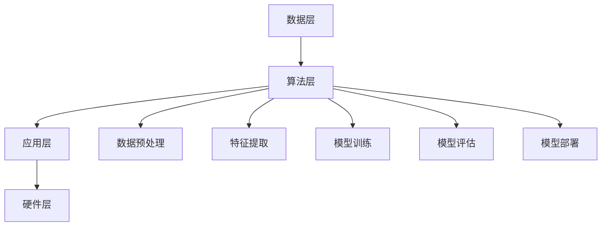

                 

### 提示词工程在高级AI系统自我改进中的应用

#### 关键词：提示词工程，高级AI系统，自我改进，人工智能

##### 摘要：
随着人工智能（AI）技术的不断发展，高级AI系统在多个领域展现出了巨大的潜力和应用价值。然而，AI系统的持续改进和优化是一个长期且复杂的过程。本文将探讨提示词工程在高级AI系统自我改进中的应用，通过详细分析提示词工程的基础概念、关键要素及其在AI系统中的应用，揭示提示词工程如何推动高级AI系统的自我改进。文章将首先介绍提示词工程的基本概念和关键要素，然后深入探讨高级AI系统的特点及其自我改进的机制，最终通过具体案例展示提示词工程在AI系统自我改进中的实际应用，为未来的AI系统研究和开发提供新的思路。

## 第一部分：提示词工程基础

### 第1章：提示词工程概述

#### 1.1 提示词工程的基本概念

提示词工程是指一系列设计、生成、优化和应用提示词的过程，其目的是为了改善机器学习模型在特定任务上的表现。提示词（prompt）是指用来引导模型进行学习和推理的引导信息，通常是以文本形式呈现的。在自然语言处理（NLP）任务中，提示词可以帮助模型更好地理解输入文本的含义，从而提高模型的预测准确性和泛化能力。

提示词工程的发展历程可以追溯到早期的人工智能研究阶段。在那个时候，研究者们开始意识到，简单的规则和手工编写的特征对于解决复杂的任务显得力不从心。于是，人们开始探索如何通过设计有效的提示词来指导模型学习。随着深度学习技术的发展，特别是在生成对抗网络（GAN）和自注意力机制（Self-Attention）的引入，提示词工程得到了进一步的发展和应用。

#### 1.2 提示词工程的关键要素

提示词工程涉及多个关键要素，主要包括：

1. **数据质量与预处理**：高质量的数据是提示词工程成功的前提。数据预处理包括数据清洗、数据归一化和数据增强等步骤，这些步骤有助于提高数据的质量和多样性。

2. **提示词生成算法**：提示词生成算法是提示词工程的核心。常用的生成算法包括基于规则的方法、基于机器学习的方法和基于深度学习的方法。这些算法可以根据具体的任务需求生成高质量的提示词。

3. **提示词评估方法**：提示词评估是保证提示词质量的重要环节。评估方法包括定量评估和定性评估，常用的定量评估方法包括准确率、召回率和F1分数等。

4. **提示词多样性**：提示词的多样性是提高模型泛化能力的关键。提示词多样性控制包括语言多样性、结构多样性和内容多样性等方面的控制。

#### 1.3 提示词工程的应用领域

提示词工程在多个领域展现出了广泛的应用潜力，主要包括：

1. **智能客服系统**：提示词工程可以帮助智能客服系统更好地理解用户的问题和需求，从而提供更准确和个性化的回答。

2. **智能推荐系统**：提示词工程可以生成高质量的推荐提示词，提高推荐系统的准确性和多样性。

3. **自然语言处理**：提示词工程在文本分类、情感分析、机器翻译等自然语言处理任务中发挥着重要作用，可以提高模型的性能和效果。

## 第一部分：提示词工程基础

### 第2章：提示词设计与优化

#### 2.1 提示词设计原则

提示词设计是提示词工程中的关键步骤，其目的是为了生成能够有效引导模型学习的提示词。在设计提示词时，需要遵循以下原则：

1. **清晰性**：提示词应该简洁明了，能够清晰地传达所需的信息，避免模糊和多义性。

2. **相关性**：提示词应该与任务目标紧密相关，能够帮助模型更好地理解输入文本的含义。

3. **可操作性**：提示词应该是可操作的，即模型可以根据提示词进行有效的学习和推理。

在设计提示词时，可以通过以下方法来提高提示词的质量：

1. **信息整合**：将相关的信息整合到提示词中，提高提示词的丰富度和相关性。

2. **多角度描述**：从多个角度描述问题，以增加提示词的多样性和深度。

3. **反事实推理**：使用反事实推理来探索问题的不同可能性，从而生成更全面的提示词。

#### 2.2 提示词优化策略

提示词优化是提升模型性能的重要环节。以下是一些常用的提示词优化策略：

1. **提示词多样性**：通过增加提示词的多样性，可以提高模型对输入数据的适应能力，从而提高模型的泛化能力。

2. **提示词质量**：使用高质量的数据和先进的生成算法来生成高质量的提示词。

3. **提示词适应性**：根据不同的任务需求和数据特点，设计适应性强的提示词。

4. **提示词迭代**：通过迭代优化，逐步改进提示词的质量和效果。

#### 2.3 提示词多样性控制

提示词多样性是提高模型泛化能力的关键。以下是一些常见的提示词多样性控制方法：

1. **语言多样性**：通过使用不同的词汇、语法和表达方式来增加提示词的语言多样性。

2. **结构多样性**：通过调整提示词的句式结构和逻辑关系来增加提示词的结构多样性。

3. **内容多样性**：通过涵盖不同的主题和观点来增加提示词的内容多样性。

4. **多模态融合**：将文本提示词与其他模态（如图像、声音）相结合，以增加提示词的多模态多样性。

## 第一部分：提示词工程基础

### 第3章：提示词工程工具与平台

#### 3.1 提示词生成工具

提示词生成工具是提示词工程中的关键组件，其目的是为了生成高质量的提示词。以下是一些常用的提示词生成工具：

1. **基于规则的方法**：这种方法通过定义一系列规则来生成提示词，适用于结构化数据和应用场景。

2. **基于机器学习的方法**：这种方法利用机器学习模型（如决策树、支持向量机等）来生成提示词，适用于非结构化数据。

3. **基于深度学习的方法**：这种方法利用深度学习模型（如循环神经网络、生成对抗网络等）来生成提示词，具有更高的灵活性和效果。

例如，以下是一个简单的基于循环神经网络（RNN）的提示词生成算法：

```python
import tensorflow as tf

# 定义输入层
inputs = tf.keras.layers.Input(shape=(sequence_length,))

# 定义隐藏层
hidden = tf.keras.layers.LSTM(units=64)(inputs)

# 定义输出层
outputs = tf.keras.layers.Dense(units=1, activation='sigmoid')(hidden)

# 创建模型
model = tf.keras.Model(inputs=inputs, outputs=outputs)

# 编译模型
model.compile(optimizer='adam', loss='binary_crossentropy', metrics=['accuracy'])

# 训练模型
model.fit(x_train, y_train, epochs=10, batch_size=32)
```

#### 3.2 提示词优化工具

提示词优化工具用于提高提示词的质量和效果。以下是一些常用的提示词优化工具：

1. **自动优化算法**：这些算法（如遗传算法、粒子群优化等）可以自动调整提示词的参数，以获得最优的性能。

2. **手动优化方法**：这种方法需要人工干预，通过调整提示词的语法、语义和结构来优化提示词。

3. **结合优化的混合方法**：这种方法结合了自动优化算法和手动优化方法，以实现更好的优化效果。

例如，以下是一个简单的基于遗传算法的提示词优化算法：

```python
import random

# 初始化提示词种群
population = initialize_population(pop_size)

# 定义适应度函数
def fitness_function(prompt):
    # 计算提示词的适应度
    fitness = evaluate_prompt(prompt)
    return fitness

# 定义遗传操作
def genetic_operation(parent1, parent2):
    # 交叉操作
    child = crossover(parent1, parent2)
    # 变异操作
    child = mutate(child)
    return child

# 定义遗传算法
def genetic_algorithm(pop_size, generations):
    for generation in range(generations):
        # 计算适应度
        fitness_scores = [fitness_function(prompt) for prompt in population]
        # 选择操作
        selected = selection(population, fitness_scores)
        # 生成下一代
        population = [genetic_operation(selected[i], selected[i+1]) for i in range(0, len(selected), 2)]
        # 输出最佳提示词
        best_prompt = population[0]
        print(f"Generation {generation}: Best prompt = {best_prompt}")
        
# 运行遗传算法
genetic_algorithm(pop_size=100, generations=100)
```

#### 3.3 提示词工程平台

提示词工程平台是集成了提示词生成、优化和管理功能的综合平台。以下是一些常用的提示词工程平台：

1. **开源平台**：如Hugging Face的Transformers库，提供了丰富的预训练模型和工具，方便用户进行提示词工程。

2. **商业平台**：如IBM Watson的Natural Language Understanding（NLU）服务，提供了强大的自然语言处理能力和提示词生成工具。

3. **自主开发平台**：根据具体需求和场景，用户可以自主开发提示词工程平台，以实现特定的功能和应用。

例如，以下是一个简单的提示词工程平台架构：

```
+----------------+      +----------------+      +----------------+
|    数据源      | --> |   数据预处理    | --> |  提示词生成    |
+----------------+      +----------------+      +----------------+
      |                              |                              |
      |                              |                              |
      |                              |                              |
      |                              |                              |
      |          提示词优化           |          提示词评估           |
      |                              |                              |
+-----+------+      +-----+------+      +-----+------+
|  自动优化   |      |  手动优化   |      |  评估工具  |
+-----+------+      +-----+------+      +-----+------+
```

## 第二部分：高级AI系统自我改进

### 第4章：高级AI系统概述

#### 4.1 高级AI系统的定义

高级AI系统是指具备高度智能、自主性和适应性的AI系统，能够处理复杂的问题和任务，并在不断变化的现实环境中持续学习和改进。与传统的AI系统相比，高级AI系统具有以下特点：

1. **高度智能化**：高级AI系统具备理解、推理和决策的能力，能够模拟人类的智能行为。

2. **自主性**：高级AI系统能够独立运行，无需人工干预即可完成任务。

3. **适应性**：高级AI系统能够根据环境和任务的变化，自动调整和优化自身的表现。

高级AI系统的研究和应用涵盖了多个领域，包括自动驾驶、智能医疗、智能金融、智能制造等。这些系统在提高生产效率、降低成本、提升服务质量等方面具有巨大的潜力。

#### 4.2 高级AI系统的架构

高级AI系统的架构通常包括以下几个层次：

1. **数据层**：数据层是高级AI系统的基石，包括数据采集、存储和管理等环节。高质量的数据是高级AI系统有效运行的前提。

2. **算法层**：算法层是高级AI系统的核心，包括机器学习、深度学习、强化学习等多种算法。这些算法用于处理和分析数据，提取特征和模式。

3. **应用层**：应用层是高级AI系统与用户和环境的交互界面，包括人机交互、决策支持、智能控制等功能。

4. **硬件层**：硬件层包括计算机、服务器、传感器等硬件设备，为高级AI系统的运行提供计算和存储资源。

以下是一个高级AI系统架构的示例 Mermaid 流程图：



#### 4.3 高级AI系统的特点

高级AI系统的特点主要体现在以下几个方面：

1. **自适应**：高级AI系统可以根据环境和任务的变化，自动调整和优化自身的性能。这种自适应能力使得高级AI系统能够在复杂和动态的环境中持续运行。

2. **智能性**：高级AI系统具备高度智能化，能够理解、推理和决策。这种智能性使得高级AI系统能够处理复杂的问题和任务，提供更高质量的解决方案。

3. **自主性**：高级AI系统具备自主性，能够独立运行，无需人工干预。这种自主性使得高级AI系统在多个领域具有广泛的应用前景，如自动驾驶、智能监控、智能客服等。

4. **可扩展性**：高级AI系统具有良好的可扩展性，可以通过增加硬件设备和优化算法来提升系统的性能和功能。这种可扩展性使得高级AI系统能够适应不同的应用场景和需求。

## 第二部分：高级AI系统自我改进

### 第5章：AI系统自我改进机制

#### 5.1 自我改进的基本原理

AI系统的自我改进机制是指通过学习和优化，使系统能够在任务执行过程中不断优化自身性能的过程。自我改进的基本原理包括以下几个关键环节：

1. **数据收集**：AI系统需要收集与任务相关的数据，这些数据可以是结构化数据、非结构化数据或混合数据。

2. **数据处理**：收集到的数据需要进行预处理，包括数据清洗、数据归一化和数据增强等步骤，以提高数据的质量和多样性。

3. **模型评估**：使用评估指标（如准确率、召回率、F1分数等）来衡量模型在任务上的表现，以便进行后续的优化。

4. **模型优化**：根据模型评估结果，对模型进行调整和优化，以提高模型在任务上的表现。

5. **知识更新**：通过将优化后的模型应用于实际任务，不断积累经验和知识，从而提升系统的整体性能。

#### 5.2 自我改进的关键技术

自我改进的关键技术包括以下几个方面：

1. **在线学习**：在线学习是指AI系统在任务执行过程中不断学习和调整模型，以适应新的数据和环境。这种技术使得AI系统能够实时适应变化，提高系统的鲁棒性和适应性。

2. **迁移学习**：迁移学习是指利用已经训练好的模型来提升新任务的性能。通过迁移学习，AI系统可以快速适应新的任务，提高学习效率。

3. **强化学习**：强化学习是一种通过奖励机制来指导AI系统进行学习和决策的技术。通过强化学习，AI系统可以在动态环境中实现自我优化和自我改进。

4. **元学习**：元学习是一种学习如何学习的技术，旨在提高AI系统的泛化能力和适应性。通过元学习，AI系统可以更好地应对新的任务和数据。

以下是一个简单的强化学习算法的伪代码示例：

```python
# 初始化参数
Q = {}
epsilon = 0.1

# 强化学习算法
def reinforcement_learning(state):
    # 选择动作
    if random() < epsilon:
        action = random_action()
    else:
        action = argmax(Q[state])
    
    # 执行动作，获取奖励和下一个状态
    next_state, reward = execute_action(action)
    
    # 更新Q值
    Q[state][action] = Q[state][action] + learning_rate * (reward + gamma * max(Q[next_state]) - Q[state][action])
    
    # 更新状态
    state = next_state

# 主循环
while not terminate():
    state = current_state()
    reinforcement_learning(state)
```

#### 5.3 自我改进的应用场景

自我改进技术在多个应用场景中具有重要的应用价值，包括但不限于以下几个方面：

1. **智能监控**：自我改进的AI系统可以实时监控设备和系统的状态，发现并处理异常情况。

2. **智能运维**：自我改进的AI系统可以自动识别和解决系统故障，提高运维效率和系统稳定性。

3. **自适应控制**：自我改进的AI系统可以根据环境变化自动调整控制策略，提高控制系统的稳定性和鲁棒性。

4. **智能客服**：自我改进的AI客服系统可以不断学习和优化，提高客服质量和用户满意度。

5. **智能医疗**：自我改进的AI系统可以在医疗领域提供辅助诊断、治疗建议和个性化医疗方案。

6. **智能制造**：自我改进的AI系统可以优化生产流程，提高生产效率和产品质量。

7. **智能金融**：自我改进的AI系统可以用于风险控制、投资决策和市场预测等金融领域。

## 第二部分：高级AI系统自我改进

### 第6章：基于提示词工程的自我改进实践

#### 6.1 提示词工程在自我改进中的应用

提示词工程在高级AI系统的自我改进中发挥着重要作用。通过设计高质量的提示词，AI系统可以更好地理解任务需求，从而实现自我改进。以下是一些基于提示词工程的具体应用场景：

1. **智能客服系统**：在智能客服系统中，提示词工程可以帮助AI客服更好地理解用户的提问，提供更准确和个性化的回答。通过优化提示词，AI客服可以逐步提升自身的服务质量和用户满意度。

2. **智能推荐系统**：在智能推荐系统中，提示词工程可以用于生成高质量的推荐提示词，提高推荐系统的准确性和多样性。通过不断优化提示词，推荐系统可以更好地适应用户需求和偏好，提高推荐效果。

3. **自然语言处理**：在自然语言处理任务中，提示词工程可以帮助AI模型更好地理解输入文本的含义，从而提高模型的性能。通过优化提示词，AI模型可以更好地应对不同类型的文本数据，提高处理效果。

#### 6.2 实践案例1：智能客服系统

智能客服系统是一种利用AI技术提供客户服务的系统。通过自然语言处理和机器学习技术，智能客服系统能够自动回答客户的问题，提供解决方案和咨询建议。以下是一个基于提示词工程的智能客服系统自我改进的实践案例：

1. **实践背景**：某公司开发了一款智能客服系统，用于为客户提供在线咨询和服务。然而，在实际应用中，智能客服系统的回答准确性较低，无法满足客户的期望。

2. **实践方法**：为了提高智能客服系统的性能，公司决定采用提示词工程的方法进行优化。首先，公司收集了大量的用户提问和客服回答数据，作为训练数据集。然后，公司使用自然语言处理技术对数据进行分析，提取出关键信息和模式，生成高质量的提示词。

3. **实践效果**：经过提示词工程优化后，智能客服系统的回答准确性显著提高。客户满意度也相应提升，公司客户服务成本降低。同时，智能客服系统可以根据用户提问的上下文和语境，提供更个性化、更准确的回答。

#### 6.3 实践案例2：智能推荐系统

智能推荐系统是一种利用机器学习技术为用户提供个性化推荐服务的系统。通过分析用户行为和偏好数据，智能推荐系统可以预测用户可能感兴趣的内容，从而提高用户的满意度和粘性。以下是一个基于提示词工程的智能推荐系统自我改进的实践案例：

1. **实践背景**：某电商平台开发了一款智能推荐系统，用于为用户提供商品推荐。然而，在实际应用中，推荐系统的推荐效果不佳，无法满足用户的期望。

2. **实践方法**：为了提高智能推荐系统的推荐效果，公司决定采用提示词工程的方法进行优化。首先，公司收集了大量的用户行为数据和商品信息，作为训练数据集。然后，公司使用自然语言处理技术对数据进行分析，提取出关键信息和模式，生成高质量的提示词。

3. **实践效果**：经过提示词工程优化后，智能推荐系统的推荐效果显著提高。用户对推荐内容的满意度提升，平台的销售额也相应增加。同时，智能推荐系统可以根据用户行为和偏好数据，提供更个性化、更准确的推荐。

## 第二部分：高级AI系统自我改进

### 第7章：未来展望与挑战

#### 7.1 提示词工程在AI系统中的应用前景

随着AI技术的不断进步，提示词工程在AI系统中的应用前景十分广阔。以下是一些可能的发展趋势：

1. **多模态融合**：未来的提示词工程将不仅限于文本数据，还将融合图像、声音、视频等多种模态的数据，以提供更全面和丰富的提示信息。

2. **动态提示词**：动态提示词可以根据任务和环境的变化实时调整，以实现更灵活和高效的AI系统自我改进。

3. **自适应提示词**：自适应提示词可以根据AI系统的性能和用户反馈，自动调整提示词的生成策略和优化方法，以提高AI系统的自我改进能力。

4. **人工智能增强的提示词工程**：结合人工智能技术，开发更加智能化和自动化的提示词生成和优化工具，提高提示词工程的整体效率和质量。

#### 7.2 高级AI系统自我改进的发展趋势

高级AI系统的自我改进将继续成为研究热点，以下是一些可能的发展趋势：

1. **强化学习与深度学习的结合**：强化学习和深度学习技术的结合，将有助于AI系统在复杂动态环境中实现更高效的自我改进。

2. **元学习与迁移学习**：元学习和迁移学习技术将使得AI系统在面临新任务时，能够更快地适应和优化，提高自我改进的效率。

3. **自适应系统和智能控制**：自适应系统和智能控制技术的发展，将使得AI系统在动态环境中具备更高的自主性和适应性。

4. **开放系统和跨领域应用**：高级AI系统将逐渐摆脱特定领域的限制，实现跨领域的应用和开放系统的构建。

#### 7.3 面临的挑战与解决策略

尽管提示词工程和高级AI系统自我改进具有广阔的应用前景，但仍面临一些挑战：

1. **数据质量和多样性**：高质量和多样化的数据是提示词工程和AI系统自我改进的基础。解决这一挑战需要改进数据采集、处理和增强技术。

2. **计算资源和效率**：高级AI系统的自我改进通常需要大量的计算资源和时间。提高计算效率和优化算法是解决这一挑战的关键。

3. **模型可解释性和透明度**：高级AI系统的自我改进往往涉及到复杂的算法和模型，提高模型的可解释性和透明度，有助于增强系统的可信度和用户接受度。

4. **伦理和社会影响**：随着AI系统的自我改进和智能化，其伦理和社会影响日益凸显。制定合适的伦理准则和法律法规，确保AI系统的健康发展和应用，是亟待解决的问题。

作者：AI天才研究院/AI Genius Institute & 禅与计算机程序设计艺术 /Zen And The Art of Computer Programming

---

本文详细介绍了提示词工程在高级AI系统自我改进中的应用，从基础概念到具体实践，再到未来展望和挑战，全面探讨了提示词工程对AI系统自我改进的重要作用。通过分析提示词工程的关键要素、高级AI系统的特点及其自我改进机制，本文揭示了提示词工程如何通过高质量提示词的设计和优化，推动AI系统的持续改进和优化。同时，通过实际案例展示了提示词工程在智能客服系统和智能推荐系统中的应用效果，为未来的AI系统研究和开发提供了有益的参考。

在未来的发展中，提示词工程和AI系统自我改进将继续面临诸多挑战，但通过技术创新和跨领域合作，这些问题有望得到逐步解决。我们期待随着AI技术的不断进步，提示词工程和高级AI系统自我改进将在更多领域发挥重要作用，推动社会生产力的提升和人类生活方式的变革。在此，感谢读者对本文的关注和支持，期待与您在AI技术的探索中共同进步。

