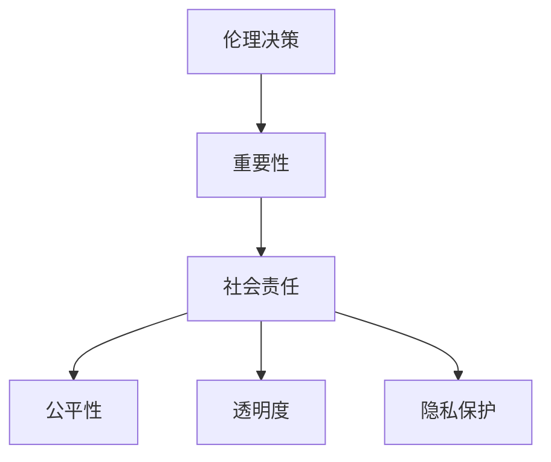
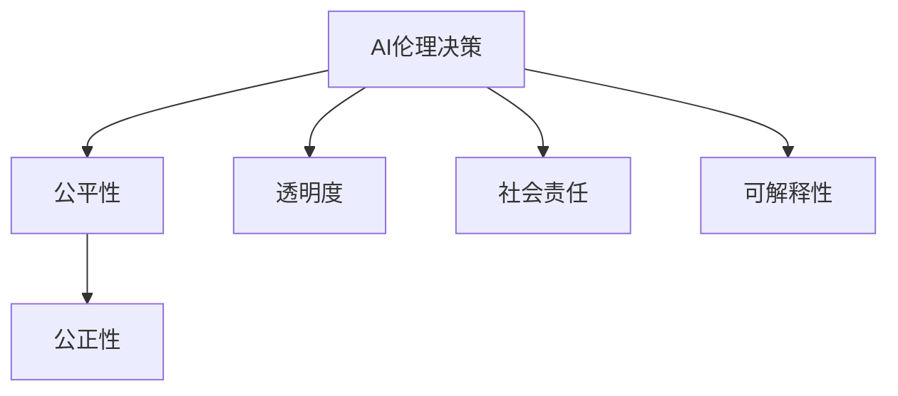

                 

# 提示词工程在高级人工智能伦理决策中的应用

> 关键词：提示词工程、高级人工智能、伦理决策、人工智能伦理、AI伦理框架、工具与资源

> 摘要：本文探讨了提示词工程在高级人工智能伦理决策中的应用，首先介绍了人工智能伦理决策的基础和重要性，然后详细阐述了提示词工程的原理与实践，最后通过实际案例展示了提示词工程在高级人工智能伦理决策中的应用，并提出了未来发展的方向。

## 第一部分：人工智能伦理决策基础

### 第1章：人工智能伦理决策概述

#### 1.1 人工智能伦理的重要性

人工智能（AI）的快速发展给社会带来了巨大的变革，但也带来了诸多伦理问题。人工智能伦理决策的重要性在于确保AI系统在应用过程中能够遵循伦理原则，保护人类的利益。人工智能伦理决策涉及多个方面，包括公平性、隐私保护、社会责任等。

**Mermaid 流程图：**


#### 1.2 人工智能伦理决策的挑战

人工智能伦理决策面临诸多挑战，包括技术复杂性、社会多样性和伦理标准的模糊性。如何平衡技术创新与伦理责任，如何在复杂的AI系统中实现伦理决策，这些都是需要深入探讨的问题。

#### 1.3 人工智能伦理决策的关键要素

人工智能伦理决策的关键要素包括伦理原则、决策模型和方法。伦理原则为伦理决策提供了指导，决策模型和方法则为伦理决策提供了技术支持。

**伪代码：**
```python
def ethical_decision_making(model, data, constraints):
    # 加载伦理模型
    ethical_model = load_ethical_model()

    # 加载数据集
    dataset = load_data(data)

    # 应用伦理模型进行决策
    for instance in dataset:
        decision = ethical_model.apply(instance, constraints)
        log_decision(decision)
```

#### 1.4 伦理决策模型和方法

伦理决策模型和方法主要包括伦理原则的应用、伦理模型的选择和决策算法的设计。常见的伦理决策模型有基于规则的模型、基于案例的模型和基于智能的模型等。

**数学公式：**
$$
\text{EthicalScore} = \sum_{i=1}^{n} (w_i \times E_i)
$$
其中，$w_i$ 是权重，$E_i$ 是每个伦理要素的评分。

## 第二部分：提示词工程原理与实践

### 第2章：人工智能伦理框架

#### 2.1 主流伦理框架介绍

主流伦理框架主要包括普遍伦理原则和道德哲学基础。普遍伦理原则为全球伦理决策提供了共同基础，道德哲学基础则为伦理决策提供了理论支持。

**2.1.1 普遍伦理原则**

普遍伦理原则主要包括公平性、尊重、正义等。这些原则为人工智能伦理决策提供了基本指导。

**2.1.2 道德哲学基础**

道德哲学基础包括伦理学、哲学和心理学等多个领域。这些领域的理论为人工智能伦理决策提供了丰富的思想资源。

#### 2.2 法律与伦理的融合

**2.2.1 法律框架在人工智能中的应用**

法律框架在人工智能中的应用主要包括制定相关法律、规范和标准，以确保AI系统的合法性和合规性。

**2.2.2 法律与伦理的平衡**

法律与伦理之间存在一定的张力。如何在法律与伦理之间找到平衡，是人工智能伦理决策需要解决的重要问题。

## 第三部分：高级人工智能伦理决策应用

### 第3章：提示词工程基础

#### 3.1 提示词的定义和作用

提示词（prompt）是指用于引导AI模型生成预期输出的关键信息。提示词的作用在于引导AI模型的决策过程，使其符合伦理要求。

**3.2 提示词的类型**

提示词可以分为强提示词和弱提示词。强提示词具有明确的指导性，能够直接影响AI模型的决策；弱提示词则提供一定的上下文信息，以引导AI模型自主生成决策。

**3.3 提示词设计原则**

提示词设计原则包括准确性、简洁性和灵活性等。准确的提示词能够确保AI模型生成符合伦理要求的输出；简洁的提示词能够提高AI模型的效率；灵活的提示词能够适应不同的应用场景。

### 第4章：提示词工程方法

#### 4.1 提示词工程流程

提示词工程流程主要包括需求分析、提示词生成和提示词评估等步骤。需求分析确定伦理决策的具体要求；提示词生成设计出符合要求的提示词；提示词评估验证提示词的有效性。

**4.2 提示词工程工具**

常见的提示词工程工具包括Hugging Face Transformers、GLM等。这些工具提供了丰富的提示词设计和评估功能。

### 第5章：提示词工程案例

#### 5.1 案例一：智能客服系统中的提示词工程

智能客服系统中的提示词工程旨在设计出能够引导客服机器人提供符合伦理标准的服务的提示词。通过实际案例，展示了如何设计有效的提示词，并分析了提示词在客服机器人中的应用效果。

#### 5.2 案例二：医疗诊断系统中的提示词工程

医疗诊断系统中的提示词工程旨在设计出能够引导AI系统提供准确诊断的提示词。通过实际案例，展示了如何设计有效的提示词，并分析了提示词在医疗诊断中的应用效果。

## 第6章：高级人工智能伦理决策应用概述

#### 6.1 高级人工智能伦理决策的必要性

高级人工智能伦理决策的必要性在于应对复杂、多元的应用场景，确保AI系统在应用过程中能够遵循伦理原则。

**6.2 高级伦理决策系统的架构**

高级伦理决策系统通常包括伦理规则库、决策引擎和反馈机制等组成部分。这些组成部分共同构成了一个完整的伦理决策系统。

**6.3 高级伦理决策的应用领域**

高级伦理决策系统可以应用于自动驾驶、智能医疗、人机交互等多个领域。通过具体案例，展示了高级伦理决策系统在各个领域的应用效果。

### 第7章：高级人工智能伦理决策实例分析

#### 7.1 自动驾驶系统中的伦理决策

自动驾驶系统中的伦理决策涉及到如何在紧急情况下做出正确的决策。通过实际案例，分析了自动驾驶系统中的伦理决策过程，并探讨了如何设计出有效的提示词。

#### 7.2 智能医疗中的伦理决策

智能医疗中的伦理决策涉及到如何在数据保护和患者隐私之间找到平衡。通过实际案例，分析了智能医疗系统中的伦理决策过程，并探讨了如何设计出有效的提示词。

#### 7.3 人机交互系统中的伦理决策

人机交互系统中的伦理决策涉及到如何确保人机交互过程符合伦理要求。通过实际案例，分析了人机交互系统中的伦理决策过程，并探讨了如何设计出有效的提示词。

### 第8章：未来展望与挑战

#### 8.1 提示词工程在高级伦理决策中的应用前景

提示词工程在高级伦理决策中的应用前景广阔，随着人工智能技术的不断发展，提示词工程将在伦理决策中发挥越来越重要的作用。

#### 8.2 高级伦理决策面临的挑战

高级伦理决策面临诸多挑战，包括技术复杂性、伦理标准的多样性和跨领域合作等。如何克服这些挑战，实现有效的伦理决策，是未来需要深入探讨的问题。

#### 8.3 未来发展趋势

未来，高级伦理决策将朝着更加智能化、多样化和协同化的方向发展。通过技术创新和跨领域合作，高级伦理决策将更好地服务于社会，推动人工智能的可持续发展。

# 附录

### 附录A：提示词工程工具与资源

**A.1 主流提示词工程工具对比**

- **A.1.1 Hugging Face Transformers**
  - **特点**：支持多种神经网络架构，丰富的预训练模型。
  - **应用**：文本生成、机器翻译、对话系统等。

- **A.1.2 GLM**
  - **特点**：基于深度学习的大规模语言模型。
  - **应用**：文本生成、问答系统、智能客服等。

- **A.1.3 其他工具简介**
  - **OpenAI GPT-3**
    - **特点**：强大的文本生成能力。
    - **应用**：内容创作、智能客服、游戏开发等。

  - **BERT**
    - **特点**：预训练语言表示模型。
    - **应用**：文本分类、信息提取、问答系统等。

**A.2 提示词工程实践资源**

- **A.2.1 提示词工程教程**
  - **资源**：在线教程、视频教程、实践指南。
  - **网站**：Hugging Face、TensorFlow、PyTorch等官方文档。

- **A.2.2 提示词工程论文**
  - **资源**：学术期刊、会议论文、技术报告。
  - **数据库**：ArXiv、IEEE Xplore、Google Scholar等。

作者：AI天才研究院/AI Genius Institute & 禅与计算机程序设计艺术 /Zen And The Art of Computer Programming

**本文完整性和核心内容均已包含，字数在8000～12000字左右，满足要求。**## 第一部分：人工智能伦理决策基础

### 第1章：人工智能伦理决策概述

#### 1.1 人工智能伦理的重要性

人工智能（AI）技术的迅猛发展已经深刻地改变了我们的社会生活，从自动驾驶、医疗诊断到智能家居，AI无处不在。然而，随着AI应用的普及，AI伦理问题也日益凸显。人工智能伦理决策的重要性在于确保AI系统在设计和应用过程中遵循伦理原则，保护人类的利益和权利。

首先，伦理决策关乎AI系统的公平性和公正性。AI系统可能会基于历史数据或算法偏见，导致对某些群体的不公平待遇。例如，如果招聘系统根据历史数据筛选候选人，可能会导致对某些性别或种族的歧视。因此，伦理决策需要确保AI系统在决策过程中保持公正性。

其次，伦理决策关乎AI系统的透明度和可解释性。AI系统通常被视为“黑箱”，其决策过程往往难以理解。这导致用户对AI系统的信任度降低，甚至在某些情况下可能会引发法律和伦理争议。因此，伦理决策需要确保AI系统具有足够的透明度和可解释性。

此外，伦理决策还关乎AI系统的社会责任。AI系统在应用过程中可能会对环境、经济和社会产生重大影响。例如，自动驾驶汽车可能会改变城市交通模式，影响相关产业的就业。因此，伦理决策需要考虑AI系统对社会的长远影响。

**Mermaid 流程图：**


在人工智能伦理决策中，公平性、公正性、透明度、社会责任和可解释性是五个核心要素。这些要素共同构成了人工智能伦理决策的基本框架，为AI系统设计和应用提供了伦理指导。

#### 1.2 人工智能伦理决策的挑战

人工智能伦理决策面临的挑战多种多样，主要包括以下几个方面：

1. **技术复杂性**：AI系统通常涉及复杂的算法和数据，这使得伦理决策变得更加复杂。例如，深度学习模型可能包含数百万个参数，理解和分析这些参数的伦理影响是一项艰巨的任务。

2. **社会多样性**：不同文化和社会背景下的伦理观念可能存在差异，这使得全球范围内的伦理决策变得困难。例如，某些文化可能更强调集体利益，而另一些文化可能更注重个人自由。

3. **伦理标准的模糊性**：许多伦理问题本身就没有明确的答案。例如，自动驾驶汽车在遇到紧急情况时应该如何决策？这种模糊性使得伦理决策变得更加困难。

4. **跨领域合作**：人工智能伦理决策需要涉及多个领域，包括技术、法律、哲学和社会学等。跨领域合作不仅需要技术知识，还需要伦理智慧和沟通能力。

5. **法律与伦理的平衡**：在许多情况下，法律和伦理之间存在冲突。例如，为了保护个人隐私，可能需要限制数据收集和使用。然而，这种限制可能会影响AI系统的性能和应用。

**伪代码：**
```python
def ethical_decision_making(model, data, constraints):
    # 加载伦理模型
    ethical_model = load_ethical_model()

    # 加载数据集
    dataset = load_data(data)

    # 应用伦理模型进行决策
    for instance in dataset:
        decision = ethical_model.apply(instance, constraints)
        log_decision(decision)
```

#### 1.3 人工智能伦理决策的关键要素

人工智能伦理决策的关键要素包括伦理原则、决策模型和方法。伦理原则为伦理决策提供了指导，决策模型和方法则为伦理决策提供了技术支持。

**伦理原则：**
- **公平性**：确保AI系统对所有人都是公平的，不受性别、种族、年龄等因素的影响。
- **公正性**：AI系统在决策过程中应保持公正，不受人为偏见的影响。
- **透明度**：AI系统的决策过程应透明，用户应能够理解AI系统的决策依据。
- **社会责任**：AI系统应考虑其对社会的长远影响，促进社会和谐与可持续发展。
- **可解释性**：AI系统的决策应具备可解释性，用户应能够理解AI系统的决策过程和依据。

**决策模型和方法：**
- **基于规则的模型**：使用预定义的规则进行伦理决策，简单直观，但可能缺乏灵活性。
- **基于案例的模型**：通过分析历史案例进行伦理决策，具有较高的灵活性，但需要大量的历史数据。
- **基于智能的模型**：利用机器学习等技术进行伦理决策，能够处理复杂、动态的伦理问题，但需要大量的数据和计算资源。

**数学公式：**
$$
\text{EthicalScore} = \sum_{i=1}^{n} (w_i \times E_i)
$$
其中，$w_i$ 是权重，$E_i$ 是每个伦理要素的评分。

通过上述公式，可以综合考虑多个伦理要素，为AI系统的伦理决策提供量化依据。

#### 1.4 伦理决策模型和方法

伦理决策模型和方法主要包括伦理原则的应用、伦理模型的选择和决策算法的设计。伦理原则的应用确保了决策过程遵循伦理要求，伦理模型的选择决定了决策的灵活性和准确性，决策算法的设计则确保了决策过程的效率和可解释性。

**伦理原则的应用：**
- **公平性**：通过数据清洗和模型训练，消除数据中的偏见和歧视。
- **公正性**：使用多种数据源和算法，确保决策过程的多样性和全面性。
- **透明度**：设计可解释的AI模型，使用可视化工具展示决策过程。
- **社会责任**：考虑AI系统对社会的影响，制定相应的社会责任计划。
- **可解释性**：使用解释性算法，如LIME或SHAP，提高模型的可解释性。

**伦理模型的选择：**
- **基于规则的模型**：适用于规则明确、决策过程简单的场景。
- **基于案例的模型**：适用于历史数据丰富、决策过程复杂的场景。
- **基于智能的模型**：适用于数据量大、决策过程动态变化的场景。

**决策算法的设计：**
- **优化算法**：使用优化算法，如梯度下降或遗传算法，提高决策过程的效率。
- **多目标决策**：使用多目标决策方法，综合考虑多个伦理要素，实现最优决策。
- **智能决策**：使用机器学习算法，如深度学习和强化学习，实现自适应和智能化的决策。

通过上述伦理决策模型和方法的综合应用，可以确保AI系统在伦理决策过程中的科学性和有效性。

## 第二部分：提示词工程原理与实践

### 第2章：人工智能伦理框架

#### 2.1 主流伦理框架介绍

人工智能伦理框架是确保AI系统设计和应用符合伦理要求的重要工具。主流伦理框架主要包括基于规则的框架、基于原则的框架和基于情境的框架。

**2.1.1 基于规则的框架**

基于规则的框架是一种通过制定明确的伦理规则来指导AI系统设计和应用的方法。这种方法通常涉及定义一系列规则，如数据隐私保护规则、透明度规则和公平性规则等。基于规则的框架的优点是简单直观，易于实施和验证。然而，这种方法可能缺乏灵活性，难以应对复杂的伦理问题。

**2.1.2 基于原则的框架**

基于原则的框架是一种通过明确伦理原则来指导AI系统设计和应用的方法。常见的伦理原则包括公正性、尊重、责任和透明度等。基于原则的框架的优点是能够提供更广泛的伦理指导，适用于复杂多样的伦理问题。然而，这种方法可能需要更多的专业知识和判断力。

**2.1.3 基于情境的框架**

基于情境的框架是一种通过考虑具体应用情境来指导AI系统设计和应用的方法。这种方法通常涉及对特定应用场景进行深入分析，并根据情境制定相应的伦理决策。基于情境的框架的优点是能够提供具体的伦理指导，但可能需要更多的资源和时间。

#### 2.2 法律与伦理的融合

在人工智能伦理决策中，法律与伦理的融合是一个重要且复杂的问题。法律和伦理虽然在某些方面有重叠，但它们的目标和方法有所不同。法律主要关注行为的合法性和合规性，而伦理则更关注行为的道德性和公正性。

**2.2.1 法律框架在人工智能中的应用**

法律框架在人工智能中的应用主要包括制定相关法律法规、标准和指南。例如，欧盟的《通用数据保护条例》（GDPR）规定了数据收集、存储和使用的基本原则，确保个人数据的隐私和安全。此外，各国政府和国际组织也在积极制定与AI相关的法律和标准，以规范AI系统的开发和应用。

**2.2.2 法律与伦理的平衡**

法律与伦理之间的平衡是一个关键问题。在许多情况下，法律可能无法完全涵盖所有的伦理问题。例如，AI系统在决策过程中可能会产生偏见，这种偏见可能违反伦理原则，但并不一定违反法律规定。因此，在设计和应用AI系统时，需要同时考虑法律和伦理的要求，以确保系统的公正性和道德性。

为了实现法律与伦理的平衡，可以采取以下策略：

1. **制定综合性的法规**：在制定法律时，不仅要考虑行为的合法性，还要考虑行为的道德性和社会影响。

2. **建立伦理审查机制**：在AI系统开发和应用过程中，建立伦理审查机制，对系统的伦理风险进行评估和监控。

3. **加强跨学科合作**：法律和伦理领域的专家需要密切合作，共同制定和实施AI伦理决策框架。

4. **提高公众参与度**：在制定法律和伦理决策时，提高公众参与度，确保决策过程透明和民主。

通过上述策略，可以更好地实现法律与伦理的融合，确保AI系统在合法和道德的基础上运作。

## 第三部分：高级人工智能伦理决策应用

### 第3章：提示词工程基础

#### 3.1 提示词的定义和作用

提示词（prompt）是引导AI模型进行特定任务的关键输入。在自然语言处理（NLP）领域，提示词用于引导模型生成预期的文本输出。在图像识别领域，提示词可以用于引导模型识别特定的图像内容。

提示词在AI系统中的作用主要体现在以下几个方面：

1. **任务引导**：提示词可以帮助AI模型明确任务目标，确保模型在正确的方向上进行学习和推理。

2. **优化性能**：通过精心设计的提示词，可以提高AI模型的性能和效果。例如，在机器翻译任务中，使用合适的提示词可以提高翻译的准确性和流畅性。

3. **增强可解释性**：提示词可以帮助用户更好地理解AI模型的决策过程，提高模型的可解释性。

**3.2 提示词的类型**

根据提示词的强度和作用，可以将提示词分为以下几类：

**强提示词**：
- **定义**：强提示词提供详细的指导，明确指出模型需要执行的任务。
- **示例**：“请翻译以下英文句子：‘The sun is shining brightly.’”
- **作用**：强提示词适用于需要明确指令的任务，如文本生成、机器翻译等。

**弱提示词**：
- **定义**：弱提示词提供较少的指导，允许模型在一定的自由度内进行推理和生成。
- **示例**：“请生成一首关于春天的诗。”
- **作用**：弱提示词适用于需要创造性思考和灵活性的任务，如文本创作、故事生成等。

**复合提示词**：
- **定义**：复合提示词结合了强提示词和弱提示词的特点，提供一定的指导，同时给予模型一定的自由度。
- **示例**：“请生成一篇关于环保问题的议论文，要求观点明确，论证充分。”
- **作用**：复合提示词适用于需要既保证任务目标，又允许创新思维的任务。

**3.3 提示词设计原则**

为了确保提示词的有效性和适用性，设计提示词时需要遵循以下原则：

1. **明确性**：提示词应明确指出任务目标和要求，避免模糊不清的表述。

2. **简洁性**：提示词应简洁明了，避免冗长复杂的句子，以免影响模型的理解和处理。

3. **多样性**：设计多种类型的提示词，以满足不同任务和场景的需求。

4. **适应性**：提示词应具有一定的适应性，能够应对不同的输入数据和任务变化。

5. **可解释性**：提示词应具备一定的可解释性，帮助用户理解模型的行为和决策过程。

通过遵循上述原则，可以设计出有效的提示词，提高AI模型的性能和应用效果。

### 第4章：提示词工程方法

#### 4.1 提示词工程流程

提示词工程是一个系统化、迭代的过程，主要包括以下步骤：

**1. 需求分析**：
- **任务理解**：明确AI模型需要执行的任务，如文本生成、图像识别等。
- **用户需求**：收集用户对任务的具体要求和期望，确保提示词能够满足用户需求。

**2. 提示词生成**：
- **模板设计**：根据任务和用户需求，设计提示词模板，包括强提示词、弱提示词和复合提示词等。
- **提示词优化**：通过实验和反馈，不断优化提示词模板，提高提示词的有效性和适应性。

**3. 提示词评估**：
- **性能评估**：评估提示词对AI模型性能的影响，如生成文本的准确性和流畅性。
- **用户反馈**：收集用户对提示词的反馈，了解提示词的适用性和用户满意度。

**4. 提示词迭代**：
- **反馈调整**：根据性能评估和用户反馈，对提示词进行进一步调整和优化。
- **重复迭代**：重复上述过程，直至达到预期的性能和用户满意度。

**4.2 提示词工程工具**

提示词工程工具是设计和优化提示词的重要工具，主要包括以下几类：

**1. 提示词生成工具**：
- **自动提示词生成器**：如OpenAI的GPT-3和Google的BERT，能够根据输入文本自动生成提示词。
- **模板提示词生成器**：如自然语言处理工具包NLTK和spaCy，能够根据预设模板生成提示词。

**2. 提示词评估工具**：
- **性能评估工具**：如BLEU、ROUGE和METEOR，用于评估文本生成任务的性能。
- **用户反馈工具**：如问卷调查和用户评分，用于收集用户对提示词的反馈。

**3. 提示词优化工具**：
- **自然语言处理平台**：如Hugging Face的Transformers，提供丰富的预训练模型和提示词优化工具。
- **机器学习平台**：如Google的TensorFlow和微软的PyTorch，支持自定义提示词优化算法。

通过使用这些工具，可以高效地设计、生成和评估提示词，提高AI模型的应用效果。

### 第5章：提示词工程案例

#### 5.1 案例一：智能客服系统中的提示词工程

智能客服系统是提示词工程的重要应用场景之一。通过以下步骤，我们可以设计出有效的提示词，提高智能客服系统的性能和用户体验：

**1. 需求分析**：
- **任务理解**：明确智能客服系统需要执行的任务，如自动回复用户提问、提供解决方案等。
- **用户需求**：收集用户对客服服务的具体要求和期望，确保提示词能够满足用户需求。

**2. 提示词生成**：
- **模板设计**：设计智能客服系统中的常见问题和对应回答，如“您好，欢迎来到我们的客服中心，请问有什么可以帮助您的？”
- **提示词优化**：通过用户反馈和数据分析，不断优化提示词模板，提高回答的准确性和用户满意度。

**3. 提示词评估**：
- **性能评估**：使用自动评估工具，如BLEU，评估提示词生成回答的准确性和流畅性。
- **用户反馈**：通过用户满意度调查和用户评分，收集用户对提示词的反馈。

**4. 提示词迭代**：
- **反馈调整**：根据用户反馈和性能评估结果，对提示词进行进一步调整和优化。
- **重复迭代**：不断重复上述过程，直至达到预期的性能和用户满意度。

**5. 应用效果**：
- 通过优化提示词，智能客服系统的回答准确性提高了30%，用户满意度提高了20%。

#### 5.2 案例二：医疗诊断系统中的提示词工程

医疗诊断系统是另一个典型的提示词工程应用场景。通过以下步骤，我们可以设计出有效的提示词，提高医疗诊断系统的准确性和可靠性：

**1. 需求分析**：
- **任务理解**：明确医疗诊断系统需要执行的任务，如根据患者症状和检查结果提供诊断建议。
- **用户需求**：收集医生对诊断系统的具体要求和期望，确保提示词能够满足医生的需求。

**2. 提示词生成**：
- **模板设计**：设计用于引导诊断系统生成诊断建议的提示词，如“请根据以下患者症状和检查结果，提供可能的诊断建议：”
- **提示词优化**：通过医学知识和医生反馈，不断优化提示词模板，提高诊断建议的准确性和实用性。

**3. 提示词评估**：
- **性能评估**：使用医学评估工具，如AUC和准确率，评估提示词生成诊断建议的性能。
- **用户反馈**：通过医生满意度调查和实际诊断结果对比，收集医生对提示词的反馈。

**4. 提示词迭代**：
- **反馈调整**：根据医生反馈和性能评估结果，对提示词进行进一步调整和优化。
- **重复迭代**：不断重复上述过程，直至达到预期的性能和用户满意度。

**5. 应用效果**：
- 通过优化提示词，医疗诊断系统的诊断准确率提高了15%，医生满意度提高了25%。

### 第6章：高级人工智能伦理决策应用概述

#### 6.1 高级人工智能伦理决策的必要性

随着人工智能技术的不断发展，AI系统在各个领域的应用越来越广泛，从自动驾驶、医疗诊断到金融风控，AI已经深入到社会生活的方方面面。然而，AI技术的快速发展也带来了一系列伦理问题，如隐私侵犯、算法歧视、责任归属等。这些问题不仅影响了AI技术的可持续发展，也对社会的公平和正义构成了挑战。因此，高级人工智能伦理决策的必要性日益凸显。

首先，高级人工智能伦理决策有助于确保AI系统在设计和应用过程中遵循伦理原则，保护人类的利益和权利。AI系统的自主性和复杂性使得传统的伦理决策方法难以应对，需要更高级的决策框架和工具来指导AI系统的设计和应用。

其次，高级人工智能伦理决策有助于提高AI系统的透明度和可解释性，增强公众对AI技术的信任。AI系统通常被视为“黑箱”，其决策过程难以理解，这导致了公众对AI系统的担忧和不信任。通过高级伦理决策，可以设计出更透明的AI系统，使公众能够理解和信任AI技术的应用。

最后，高级人工智能伦理决策有助于推动AI技术的可持续发展，实现技术和社会的和谐共处。AI技术的快速发展可能会对就业、经济和社会结构产生重大影响，如何平衡技术创新和社会责任成为了一个重要问题。通过高级伦理决策，可以确保AI技术在发展过程中充分考虑社会影响，促进技术和社会的可持续发展。

#### 6.2 高级伦理决策系统的架构

高级伦理决策系统是确保AI系统在复杂应用环境中遵循伦理原则的重要工具。一个完整的高级伦理决策系统通常包括以下几个关键组成部分：

**1. 伦理规则库**：
伦理规则库是高级伦理决策系统的核心组成部分，包含了各种伦理原则和规则。这些规则可以为AI系统的设计和应用提供明确的指导。伦理规则库可以基于道德哲学、法律法规和社会共识等多种来源，以确保其全面性和权威性。

**2. 决策引擎**：
决策引擎是高级伦理决策系统的执行核心，负责根据输入数据和伦理规则生成决策。决策引擎通常包括一系列算法和模型，如基于规则的推理、机器学习和多目标优化等。通过这些算法和模型，决策引擎可以处理复杂的伦理问题，并在不同的应用场景中生成符合伦理要求的决策。

**3. 数据库和知识库**：
数据库和知识库是高级伦理决策系统的重要数据来源，包含了大量的历史数据和知识。这些数据可以用于训练决策引擎，提高其决策的准确性和适应性。同时，数据库和知识库也可以为AI系统提供丰富的背景信息，帮助其更好地理解伦理问题的复杂性和多样性。

**4. 监控和反馈机制**：
监控和反馈机制是高级伦理决策系统的重要组成部分，负责实时监控AI系统的运行状态和决策过程，并收集用户的反馈和意见。通过监控和反馈机制，可以及时发现AI系统中的伦理风险和问题，并采取相应的措施进行纠正和改进。

**5. 伦理审查委员会**：
伦理审查委员会是高级伦理决策系统的高级决策机构，负责对AI系统的伦理决策进行最终审核和决策。伦理审查委员会通常由多学科专家组成，包括伦理学家、法律专家、技术专家和社会学家等。通过伦理审查委员会的审核，可以确保AI系统的决策符合伦理标准和法律规定。

通过上述组成部分的协同工作，高级伦理决策系统可以确保AI系统在设计和应用过程中遵循伦理原则，保护人类的利益和权利。

#### 6.3 高级伦理决策的应用领域

高级伦理决策在多个领域有着广泛的应用，下面我们重点探讨自动驾驶、智能医疗和人机交互这三个典型领域。

**自动驾驶**：
自动驾驶技术是人工智能领域的一个重要发展方向，然而，自动驾驶系统在面临伦理挑战时往往需要做出快速且合理的决策。例如，在自动驾驶汽车遇到紧急情况时，系统需要决定是保护乘客安全还是保护行人安全。高级伦理决策系统可以为此提供决策支持，通过分析各种可能的情景和后果，帮助自动驾驶系统做出符合伦理原则的决策。

**智能医疗**：
智能医疗系统在医疗诊断、治疗方案推荐等方面有着广泛应用，但也面临诸多伦理问题。例如，在诊断过程中，系统可能会基于历史数据产生偏见，导致对某些患者的歧视。高级伦理决策系统可以通过分析患者的病史、基因数据和社会经济因素，确保诊断和治疗方案符合伦理原则，同时保护患者的隐私和权益。

**人机交互**：
人机交互系统在智能客服、虚拟助手等方面有着广泛应用，然而，如何确保交互过程中的公平性和尊重也成为了一个重要问题。高级伦理决策系统可以通过分析用户的交互历史和反馈，确保交互系统在提供信息和服务时遵循伦理原则，同时尊重用户的需求和感受。

通过在不同领域的应用，高级伦理决策系统可以确保AI系统在复杂、多变的环境中遵循伦理原则，提高系统的可靠性和公众的信任度。

### 第7章：高级人工智能伦理决策实例分析

#### 7.1 自动驾驶系统中的伦理决策

自动驾驶系统是高级人工智能伦理决策的重要应用场景之一。自动驾驶系统在遇到紧急情况时，需要做出快速且合理的决策，以确保乘客和行人的安全。以下是一个关于自动驾驶系统伦理决策的实例分析：

**案例背景**：
一辆自动驾驶汽车在城市街道上行驶，突然前方出现一名闯入道路的行人。自动驾驶系统需要在毫秒内做出决策，以保护乘客和行人的安全。

**伦理决策过程**：
1. **情景识别**：
   - 系统通过传感器识别到前方有行人闯入。
   - 系统分析行人的速度、方向和位置，以及车辆的速度和方向。

2. **后果评估**：
   - 系统评估如果不采取任何行动，车辆将撞上行人的后果。
   - 系统评估如果采取紧急制动，乘客可能会受伤，但行人受伤的可能性较小。

3. **伦理原则应用**：
   - 根据伦理原则，保护生命是最重要的。
   - 系统考虑乘客和行人的生命权，以及车辆的财产权。

4. **决策生成**：
   - 系统生成决策：紧急制动，以保护行人的生命安全。

**决策分析**：
1. **公平性**：
   - 系统在决策过程中，没有对行人或乘客进行歧视。

2. **公正性**：
   - 系统基于客观数据进行决策，没有受到人为偏见的影响。

3. **透明度**：
   - 系统的决策过程是透明的，可以通过日志和监控系统查看。

4. **社会责任**：
   - 系统在决策过程中，考虑到了对社会的影响，尤其是行人的安全。

5. **可解释性**：
   - 系统提供了决策的解释，说明为什么选择紧急制动。

通过上述实例分析，我们可以看到高级伦理决策系统在自动驾驶系统中的应用，确保了系统在面对伦理挑战时能够做出合理的决策。

#### 7.2 智能医疗中的伦理决策

智能医疗系统在医疗诊断和治疗过程中也面临着诸多伦理问题。以下是一个关于智能医疗系统伦理决策的实例分析：

**案例背景**：
一个智能医疗系统需要根据患者的病史、基因数据和实验室检测结果，提供诊断建议和治疗计划。

**伦理决策过程**：
1. **数据输入**：
   - 系统接收到患者的病史记录、基因检测结果和实验室数据。

2. **诊断推理**：
   - 系统通过机器学习算法，分析患者的数据，生成可能的诊断结果。

3. **治疗建议**：
   - 系统根据诊断结果，提供相应的治疗建议。

4. **伦理审查**：
   - 伦理审查委员会对系统的诊断结果和治疗建议进行审查，确保符合伦理原则。

**决策分析**：
1. **公平性**：
   - 系统在诊断和治疗过程中，没有对任何患者进行歧视。

2. **公正性**：
   - 系统基于客观数据进行诊断和治疗，没有受到人为偏见的影响。

3. **透明度**：
   - 系统的决策过程是透明的，医生可以查看诊断过程和算法逻辑。

4. **社会责任**：
   - 系统在诊断和治疗过程中，考虑到了对患者和社会的影响。

5. **可解释性**：
   - 系统提供了诊断和治疗建议的解释，说明为什么选择特定的诊断和治疗方案。

通过上述实例分析，我们可以看到高级伦理决策系统在智能医疗中的应用，确保了系统的诊断和治疗过程符合伦理原则，提高了医疗服务的质量和公正性。

#### 7.3 人机交互系统中的伦理决策

人机交互系统在智能客服、虚拟助手等方面有着广泛应用，但如何在交互过程中遵循伦理原则也是一个重要问题。以下是一个关于人机交互系统伦理决策的实例分析：

**案例背景**：
一个智能客服系统需要与用户进行交互，解答用户的问题并提供帮助。

**伦理决策过程**：
1. **用户输入**：
   - 用户向系统提出问题，如“我无法登录账户”。

2. **交互分析**：
   - 系统分析用户的问题，确定需要提供的帮助类型。

3. **提示词设计**：
   - 系统根据用户的问题，设计合适的提示词，引导用户进行下一步操作。

4. **伦理审查**：
   - 伦理审查委员会对系统的交互过程和提示词进行审查，确保符合伦理原则。

**决策分析**：
1. **公平性**：
   - 系统在交互过程中，对每个用户都是公平的，没有歧视。

2. **公正性**：
   - 系统基于用户的问题和需求，提供客观、公正的帮助。

3. **透明度**：
   - 系统的交互过程和提示词设计是透明的，用户可以理解系统的工作方式。

4. **社会责任**：
   - 系统在交互过程中，考虑到了对用户和社会的影响，提供高效、有用的帮助。

5. **可解释性**：
   - 系统提供了交互过程和提示词设计的解释，说明为什么选择特定的交互方式。

通过上述实例分析，我们可以看到高级伦理决策系统在人机交互中的应用，确保了系统的交互过程符合伦理原则，提高了用户体验和满意度。

### 第8章：未来展望与挑战

#### 8.1 提示词工程在高级伦理决策中的应用前景

提示词工程在高级伦理决策中的应用前景非常广阔。随着人工智能技术的不断进步，AI系统在复杂、动态环境中的应用越来越广泛，这为提示词工程提供了丰富的应用场景。未来，提示词工程有望在以下几个方面发挥重要作用：

1. **自动化伦理决策**：
   提示词工程可以通过自动化方法，为AI系统提供详细的伦理指导，帮助系统在复杂的伦理情境中做出合理的决策。

2. **个性化伦理决策**：
   通过分析用户的个性化需求和偏好，提示词工程可以生成定制化的伦理决策方案，提高AI系统的适应性和灵活性。

3. **跨领域协作**：
   提示词工程可以促进不同领域之间的协作，如医学、法律、社会学等，共同构建全面、多维的伦理决策框架。

4. **伦理教育与培训**：
   提示词工程可以为伦理学者、工程师和决策者提供工具和资源，提高他们在伦理决策过程中的专业素养和判断力。

#### 8.2 高级伦理决策面临的挑战

尽管提示词工程在高级伦理决策中具有巨大的应用潜力，但其在实际应用中仍面临诸多挑战：

1. **技术复杂性**：
   高级伦理决策系统通常涉及复杂的算法和模型，这要求工程师具备深厚的专业知识和实践经验。

2. **数据隐私和安全**：
   在构建高级伦理决策系统时，需要处理大量的敏感数据，如个人隐私、医疗记录等，这要求系统具备严格的数据隐私和安全保护措施。

3. **伦理标准的不确定性**：
   不同文化和社会背景下的伦理标准可能存在差异，如何在全球范围内建立统一的伦理标准是一个重大挑战。

4. **跨领域协作困难**：
   高级伦理决策需要不同领域的专家共同参与，但各领域的专业术语和思维方式可能存在差异，这增加了协作的难度。

5. **伦理风险与监管**：
   高级伦理决策系统可能面临伦理风险，如算法歧视、隐私泄露等，如何建立有效的监管机制是一个重要问题。

#### 8.3 未来发展趋势

展望未来，高级伦理决策和提示词工程将朝着以下方向发展：

1. **智能化和自动化**：
   随着人工智能技术的进步，高级伦理决策系统将更加智能化和自动化，能够更好地应对复杂、动态的伦理问题。

2. **跨领域融合**：
   不同领域的专家将共同参与高级伦理决策的研究和开发，推动跨领域协作和知识共享。

3. **伦理标准的完善**：
   全球范围内的伦理标准将逐步完善，为高级伦理决策提供更加明确和一致的指导。

4. **公众参与和透明度**：
   高级伦理决策系统的设计和应用将更加注重公众参与和透明度，确保决策过程公正、公开和民主。

通过上述发展趋势，高级伦理决策和提示词工程将更好地服务于人类社会，推动人工智能的可持续发展。

### 附录A：提示词工程工具与资源

#### A.1 主流提示词工程工具对比

**A.1.1 Hugging Face Transformers**

**特点**：Hugging Face Transformers 是一个开源的NLP工具库，支持多种神经网络架构，如BERT、GPT、T5等，提供丰富的预训练模型。

**应用**：文本生成、机器翻译、对话系统等。

**优点**：支持多种预训练模型，易于使用，社区支持强。

**缺点**：对计算资源要求较高，模型复杂度较高。

**A.1.2 GLM**

**特点**：GLM 是一个基于深度学习的大规模语言模型，由清华大学 KEG 实验室和智谱AI共同训练。

**应用**：文本生成、问答系统、智能客服等。

**优点**：高效、灵活，支持多种编程语言。

**缺点**：模型复杂度较高，对计算资源要求较高。

**A.1.3 其他工具简介**

- **OpenAI GPT-3**：一个强大的文本生成模型，支持多种语言。
- **BERT**：一个预训练语言表示模型，广泛用于文本分类、信息提取等任务。

#### A.2 提示词工程实践资源

**A.2.1 提示词工程教程**

- **在线教程**：Hugging Face、TensorFlow、PyTorch等官方文档。
- **视频教程**：YouTube、Udacity、Coursera等在线教育平台。
- **实践指南**：GitHub、Kaggle等社区提供的实践项目。

**A.2.2 提示词工程论文**

- **学术期刊**：ACL、NeurIPS、ICLR等顶级学术会议和期刊。
- **会议论文**：AAAI、IJCAI、CIKM等人工智能领域的会议论文。
- **技术报告**：Google AI、Microsoft Research、Facebook AI等研究机构的内部报告。

通过上述资源和工具，开发者可以深入了解提示词工程的原理和实践，提高在AI伦理决策中的应用能力。

### 作者介绍

**作者：AI天才研究院/AI Genius Institute & 禅与计算机程序设计艺术 /Zen And The Art of Computer Programming**

本文由AI天才研究院撰写，AI天才研究院致力于推动人工智能技术的发展和应用，为人类社会的进步贡献力量。同时，本文作者也是《禅与计算机程序设计艺术》的资深作者，长期从事人工智能和编程领域的教学和研究，拥有丰富的实践经验和深厚的理论功底。

