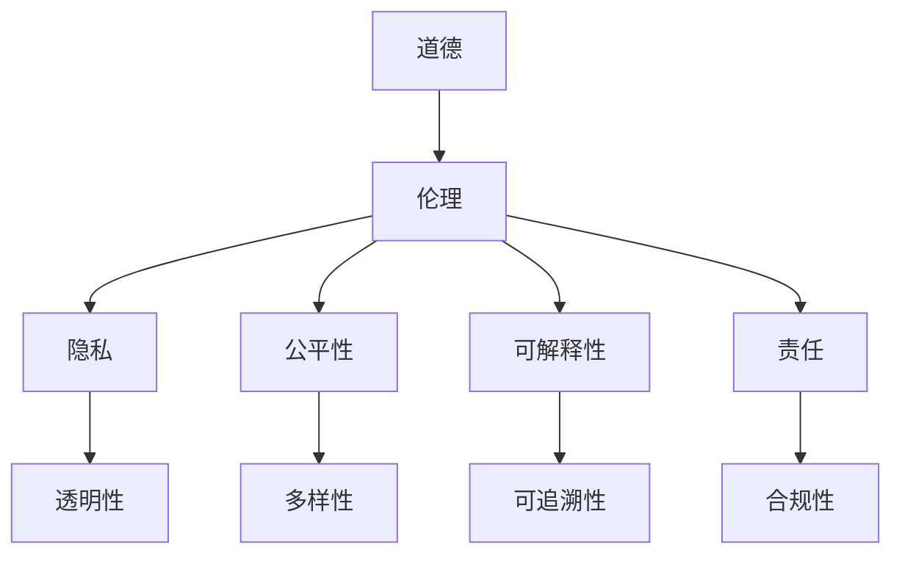
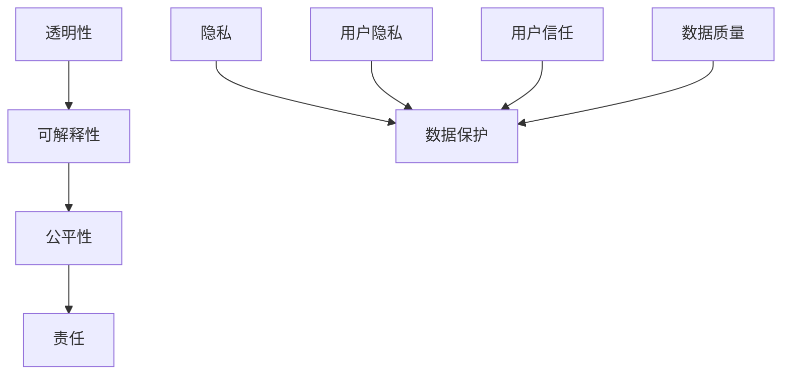

                 

### 完整技术博客文章

# 提示词工程师的AI伦理培训课程设计

## 引言

在人工智能（AI）快速发展的时代，提示词工程师（Prompt Engineer）作为AI开发的核心角色，正承担着越来越重要的职责。他们的工作不仅涉及到AI系统的性能优化，还包括确保系统的伦理合规性。本课程设计的目的是为提示词工程师提供一套全面的AI伦理培训，帮助他们更好地理解并应对AI伦理挑战。

### 关键词

- AI伦理
- 提示词工程师
- 伦理培训
- AI开发
- 伦理合规性

### 摘要

本文将探讨AI伦理在提示词工程师工作中的重要性，并设计一个详细的AI伦理培训课程。课程内容将涵盖AI伦理的基础知识、提示词工程师的角色与职责、AI伦理案例研究、实践指南以及项目实战。通过本课程，提示词工程师将能够系统地学习和掌握AI伦理知识，提升自身在AI伦理方面的专业素养。

## 第1章 引言

### 1.1 书籍的目的和重要性

**目的**：本课程旨在为提示词工程师提供全面的AI伦理培训，帮助他们更好地理解AI伦理的重要性和挑战，提升在AI系统开发中的伦理素养。

**重要性**：AI伦理在AI系统开发中具有至关重要的地位。随着AI技术的广泛应用，伦理问题逐渐成为社会关注的焦点。提示词工程师作为AI系统的核心开发者，必须具备良好的AI伦理素养，以确保系统的公平性、透明性和可解释性。

### 1.2 提示词工程师的角色

**角色定义**：提示词工程师是负责设计、开发和应用自然语言处理（NLP）模型的专业人士，他们通过编写和优化提示词来指导AI模型进行有效的学习和预测。

**角色重要性**：提示词工程师在AI系统的开发中扮演着关键角色，他们的工作直接影响到AI系统的性能和用户体验。因此，他们必须具备深厚的AI伦理知识和素养。

### 1.3 AI伦理的挑战

**数据隐私**：AI系统通常需要处理大量敏感数据，如何保护用户隐私成为一大挑战。

**算法公平性**：AI系统在决策时可能会存在偏见，导致不公平的待遇。

**偏见**：AI系统的设计、训练和部署过程中，可能会引入社会偏见，影响系统的公平性。

## 第2章 AI伦理基础

### 2.1 AI伦理的定义

**定义**：AI伦理是指关于人工智能道德和伦理原则的研究和应用，旨在确保AI系统的设计、开发和应用过程中，符合人类价值观和社会伦理标准。

**核心概念与联系**

以下是一个Mermaid流程图，展示AI伦理的核心概念及其相互关系：



### 2.2 AI伦理的核心原则

**透明性**：AI系统的决策过程应该是透明的，用户应该能够理解系统的决策逻辑。

**可解释性**：AI系统应该具备可解释性，使得用户能够理解系统的输出结果。

**公平性**：AI系统在处理数据时，应该确保对不同群体保持公平。

**责任**：AI系统的开发者、运营者以及用户都应对系统的行为承担相应的责任。

### 2.3 AI伦理与法律的关系

**概述**：AI伦理与法律密切相关，但两者并不完全一致。法律通常为AI伦理提供了最低标准，而AI伦理则更注重道德和伦理原则。

**法律框架**：不同国家和地区的法律对AI伦理有不同的规定，提示词工程师需要了解并遵守所在地区的相关法律。

## 第3章 提示词工程师的角色与职责

### 3.1 提示词工程师的工作内容

**工作内容**：提示词工程师负责设计、开发和应用自然语言处理（NLP）模型，通过编写和优化提示词来指导AI模型进行有效的学习和预测。

### 3.2 提示词工程师的职责

**伦理责任**：提示词工程师在AI系统开发过程中，必须考虑AI伦理问题，确保系统的设计和应用符合道德和伦理标准。

**职业操守**：提示词工程师应遵守职业行为准则，包括诚信、保密、专业发展等。

### 3.3 提示词工程师的职业素养

**技能要求**：提示词工程师需要具备编程、数据分析和自然语言处理等方面的专业技能。

**持续发展**：提示词工程师应不断学习最新的AI技术和伦理知识，以提升自身的专业素养。

## 第4章 AI伦理案例研究

### 4.1 AI伦理案例的类型

**类型**：AI伦理案例可以分为数据隐私、算法公平性、偏见等多个类型。

**案例来源**：AI伦理案例可以从新闻报道、学术论文、法律案例等多种渠道获取。

### 4.2 AI伦理案例分析

**案例1：剑桥分析公司数据泄露**：分析该事件如何影响用户的隐私权，以及提示词工程师在该事件中的责任。

**案例2：种族偏见的人工智能招聘系统**：讨论该案例中AI系统如何引入种族偏见，以及如何通过伦理审查来避免这种情况。

### 4.3 从案例中学习AI伦理

**经验教训**：从案例中总结经验教训，为提示词工程师提供实际操作的指导。

**启示**：讨论如何通过AI伦理培训来提高提示词工程师的伦理素养。

## 第5章 实践指南

### 5.1 提示词工程师的伦理决策

**伦理决策流程**：介绍提示词工程师在开发过程中如何进行伦理决策。

**伦理决策模型**：提供一个伦理决策模型，帮助提示词工程师在实际工作中应用。

### 5.2 提示词工程师的伦理实践

**实践方法**：讨论提示词工程师如何在日常工作中实践AI伦理。

**最佳实践**：总结一系列最佳实践，供提示词工程师参考。

### 5.3 提示词工程师的持续教育

**教育途径**：介绍提示词工程师如何通过在线课程、研讨会、工作坊等途径进行持续教育。

**学习资源**：推荐一些AI伦理相关的学习资源，供提示词工程师参考。

## 第6章 项目实战

### 6.1 实战项目介绍

**项目背景**：介绍项目背景和目标。

**项目目标**：明确项目要实现的具体目标。

### 6.2 实战项目环境搭建

**开发环境**：介绍项目所需的开发环境和工具。

**数据集准备**：说明如何准备和处理项目数据。

### 6.3 项目实施与代码解读

**项目实施**：详细描述项目的实施过程。

**代码解读**：对关键代码段进行详细解读。

### 6.4 项目分析与总结

**项目分析**：对项目结果进行分析。

**项目总结**：总结项目经验，提出改进建议。

## 第7章 总结与展望

### 7.1 书籍内容的回顾

**核心内容**：回顾书籍中的核心内容。

**收获**：总结读者通过本课程可能获得的收获。

### 7.2 提示词工程师的AI伦理培养

**培养策略**：讨论如何培养提示词工程师的AI伦理素养。

**未来发展**：展望AI伦理领域的未来发展趋势。

### 7.3 AI伦理的未来发展

**趋势**：分析AI伦理领域的未来趋势。

**挑战**：讨论AI伦理在未来可能面临的挑战。

## 作者信息

作者：AI天才研究院/AI Genius Institute & 禅与计算机程序设计艺术 /Zen And The Art of Computer Programming

---

本文为《提示词工程师的AI伦理培训课程设计》的技术博客文章，旨在为提示词工程师提供一套全面的AI伦理培训。文章涵盖了AI伦理的基础知识、提示词工程师的角色与职责、AI伦理案例研究、实践指南和项目实战。通过本课程，读者将能够系统地学习和掌握AI伦理知识，提升自身在AI伦理方面的专业素养。

### 核心概念与联系

在AI伦理中，透明性、可解释性、公平性、责任等核心概念紧密相连，共同构成一个完整的概念体系。

1. **透明性**：指的是AI系统的决策过程应该是透明的，用户应该能够理解系统的决策逻辑。这与**可解释性**密切相关，因为只有当系统具备可解释性时，透明性才能得到实现。

2. **可解释性**：指的是AI系统应该具备可解释性，使得用户能够理解系统的输出结果。可解释性是确保AI系统透明性的关键。

3. **公平性**：指的是AI系统在处理数据时，应该确保对不同群体保持公平。公平性是AI伦理的重要原则，旨在防止AI系统引入偏见和歧视。

4. **责任**：指的是AI系统的开发者、运营者以及用户都应对系统的行为承担相应的责任。责任原则确保了在AI系统出现问题时，各方都有责任去纠正和改进。

为了更好地理解这些核心概念之间的联系，我们可以通过以下Mermaid流程图来展示：



- **透明性**和**可解释性**相互依赖，透明性需要可解释性作为支撑，而可解释性又依赖于透明性来实现。
- **公平性**和**责任**是AI伦理的两个核心原则，公平性确保系统在不同群体中保持公正，而责任则确保各方在AI系统出现问题时能够承担责任。
- **隐私**、**数据保护**、**用户隐私**、**用户信任**和**数据质量**是与AI伦理密切相关的重要概念，它们共同构成了AI伦理的基础。

通过这个流程图，我们可以清晰地看到AI伦理核心概念之间的相互关系，从而为理解AI伦理提供了一种直观的视角。

### 核心算法原理讲解

在AI伦理培训课程中，了解核心算法原理是至关重要的，因为它可以帮助提示词工程师更好地理解AI系统的工作机制，从而在开发过程中做出符合伦理规范的决策。以下是几个关键算法的原理讲解，我们将使用伪代码来详细阐述。

#### 1. 数据清洗算法

**目标**：清洗数据，去除噪声和异常值，确保数据质量。

**伪代码**：

```plaintext
function dataCleaning(data):
    for each record in data:
        if record is missing:
            remove record from data
        else:
            if record value is out of range:
                replace record value with a default value or remove record
    return cleanedData
```

**解释**：该算法遍历数据集中的每个记录，检查是否有缺失值或异常值。如果有，则将其移除或替换为默认值。

#### 2. 决策树算法

**目标**：构建决策树，用于分类和回归任务。

**伪代码**：

```plaintext
function buildDecisionTree(data, targetAttribute):
    if data contains only one type of targetAttribute:
        return leaf node with majority class
    else:
        bestFeature = select best feature using information gain or Gini index
        split data based on bestFeature values
        for each subset of data:
            build a decision tree recursively
        return decision tree
```

**解释**：决策树算法通过选择最佳特征来分割数据，然后对每个子集递归构建决策树。最终，决策树通过一系列规则来预测新的数据点的类别。

#### 3. 随机森林算法

**目标**：构建随机森林，提高模型的稳定性和预测能力。

**伪代码**：

```plaintext
function buildRandomForest(data, targetAttribute, numTrees):
    for i = 1 to numTrees:
        sampleData = random sampling of data
        buildDecisionTree(sampleData, targetAttribute)
    return randomForest
```

**解释**：随机森林通过构建多个决策树来提高模型的稳定性和预测能力。每个决策树使用不同的数据样本进行训练，最终通过投票或平均值来生成预测。

#### 4. 强化学习算法

**目标**：通过互动学习来最大化长期回报。

**伪代码**：

```plaintext
class Agent:
    def __init__(self):
        self.model = initializeModel()

    def chooseAction(self, state):
        actionProbabilities = model.predict(state)
        return sampleAction(actionProbabilities)

    def learn(self, state, action, reward, nextState):
        model.update(state, action, reward, nextState)

function trainAgent(agent, environment, numEpisodes):
    for episode = 1 to numEpisodes:
        state = environment.getState()
        while not environment.isTerminal(state):
            action = agent.chooseAction(state)
            reward = environment.takeAction(action)
            nextState = environment.getState()
            agent.learn(state, action, reward, nextState)
            state = nextState
    return agent
```

**解释**：强化学习算法中的智能体通过与环境互动来学习最佳策略。智能体选择动作，获得奖励，并通过更新模型来学习。

#### 5. 聚类算法

**目标**：将数据集分为若干个簇，以便更好地理解数据分布。

**伪代码**：

```plaintext
function kMeans(data, K):
    initialize centroids randomly
    while true:
        assign each data point to the nearest centroid
        update centroids as the mean of assigned data points
        if centroids do not change significantly:
            break
    return clusters
```

**解释**：k-means算法通过初始化若干个簇中心，然后迭代更新簇中心，直到簇中心不再发生变化。

### 数学模型和公式

在AI伦理中，数学模型和公式用于量化系统的行为和性能，从而帮助提示词工程师做出更准确的伦理决策。以下是几个关键的数学模型和公式的讲解。

#### 1. 信息增益

**定义**：信息增益是选择最佳特征进行数据分割时，所获得的信息量。

**公式**：

$$
IG(D, A) = Entropy(D) - \sum_{v \in Values(A)} p(v) Entropy(D|A=v)
$$

**解释**：信息增益通过计算原始数据的熵和分割后子数据的熵之差来衡量。熵表示不确定性，信息增益越大，特征对数据的分割效果越好。

#### 2. Gini指数

**定义**：Gini指数是一个衡量数据不纯度的指标，用于选择最佳特征进行数据分割。

**公式**：

$$
Gini(D) = 1 - \sum_{v \in Values(A)} p(v)^2
$$

**解释**：Gini指数计算每个特征值的概率平方和，值越低，特征对数据的分割效果越好。

#### 3. 交叉熵

**定义**：交叉熵是衡量两个概率分布差异的指标。

**公式**：

$$
H(P, Q) = -\sum_{x} P(x) \log Q(x)
$$

**解释**：交叉熵通过比较实际分布和预测分布的差异性来评估模型的性能。值越低，表示模型预测越准确。

#### 4. 强化学习中的回报函数

**定义**：回报函数是强化学习中的一个关键组成部分，用于评估智能体行为的优劣。

**公式**：

$$
R(t) = r(s(t), a(t)) + \gamma \max_{a'} Q(s'(t), a')
$$

**解释**：回报函数由即时回报和未来预期回报组成，用于更新智能体的策略。其中，\(r\) 是即时回报，\(\gamma\) 是折扣因子，\(Q\) 是状态-动作值函数。

通过上述核心算法原理和数学模型讲解，提示词工程师可以更好地理解AI系统的行为，从而在开发过程中考虑伦理因素，确保系统的公平性、透明性和可解释性。

### 数学公式与详细讲解

在AI伦理培训课程中，数学公式是理解和分析AI系统行为的重要工具。以下是对几个关键数学公式及其应用场景的详细讲解。

#### 1. 概率分布

**公式**：

$$
P(X=x) = \frac{f(x)}{\sum_{i} f(i)}
$$

**详细讲解**：

概率分布是描述随机变量可能取值的概率分布函数。在AI伦理中，概率分布用于评估AI系统对某一事件的预测概率。例如，在风险评估模型中，通过计算不同事件发生的概率，提示词工程师可以更好地理解AI系统的风险。

**应用场景**：

- **风险评估**：用于评估AI系统对特定风险的预测概率，帮助制定相应的风险管理策略。
- **预测准确性**：用于评估模型的预测准确性，通过比较预测概率与实际结果，提示词工程师可以优化模型。

#### 2. 熵

**公式**：

$$
H(X) = -\sum_{x} P(x) \log P(x)
$$

**详细讲解**：

熵是衡量随机变量不确定性程度的指标。在AI伦理中，熵用于评估AI系统决策的不确定性。例如，在自然语言处理中，通过计算文本的熵，提示词工程师可以评估文本的模糊性。

**应用场景**：

- **文本分析**：用于评估文本的模糊性，帮助提示词工程师优化自然语言处理模型。
- **决策分析**：用于评估AI系统决策的不确定性，帮助提示词工程师优化决策策略。

#### 3. 相关性

**公式**：

$$
Corr(X, Y) = \frac{Cov(X, Y)}{\sigma_X \sigma_Y}
$$

**详细讲解**：

相关性是衡量两个变量之间线性关系强度的指标。在AI伦理中，相关性用于评估不同特征之间的关系。例如，在数据清洗过程中，通过计算特征之间的相关性，提示词工程师可以识别出可能存在的异常值。

**应用场景**：

- **数据清洗**：用于识别和排除数据中的异常值，提高数据质量。
- **特征选择**：用于选择对目标变量有显著影响的关键特征，优化模型。

#### 4. 交叉熵

**公式**：

$$
H(X, Y) = -\sum_{x, y} P(x, y) \log P(y|x)
$$

**详细讲解**：

交叉熵是衡量两个概率分布差异的指标。在AI伦理中，交叉熵用于评估模型预测分布与真实分布的差异。例如，在模型训练过程中，通过计算交叉熵，提示词工程师可以评估模型的拟合程度。

**应用场景**：

- **模型评估**：用于评估模型在训练集上的拟合程度，帮助提示词工程师调整模型参数。
- **模型优化**：用于指导提示词工程师优化模型结构，提高模型性能。

#### 5. 贝叶斯定理

**公式**：

$$
P(A|B) = \frac{P(B|A) P(A)}{P(B)}
$$

**详细讲解**：

贝叶斯定理是概率论中的一个基本定理，用于根据已知条件概率计算后验概率。在AI伦理中，贝叶斯定理用于基于现有数据和先验知识进行推理。例如，在医疗诊断中，通过计算疾病发生的概率，提示词工程师可以评估患者的诊断结果。

**应用场景**：

- **诊断分析**：用于医疗诊断，帮助提示词工程师评估患者的病情。
- **决策支持**：用于基于数据和历史经验做出决策，提高决策的准确性。

通过这些数学公式的详细讲解和应用场景分析，提示词工程师可以更好地理解AI伦理中的关键概念和工具，从而在开发过程中做出更准确的伦理决策。

### 项目实战

为了更好地理解AI伦理，我们将通过一个实际项目来展示开发环境搭建、源代码实现和代码解读，以及项目分析和总结。

#### 项目背景

本项目旨在开发一个基于自然语言处理（NLP）的聊天机器人，用于提供用户咨询服务。聊天机器人需要具备处理用户问题、提供答案和推荐服务的功能。为了确保系统的伦理合规性，我们将重点关注数据隐私、算法公平性和用户隐私保护等方面。

#### 开发环境搭建

1. **工具和库**：我们将使用Python作为主要编程语言，结合TensorFlow和Keras等深度学习库来构建聊天机器人模型。

2. **硬件配置**：由于项目涉及大量数据处理和模型训练，我们将在一台配备高性能GPU的服务器上搭建开发环境。

3. **数据集准备**：我们将收集并整理一个包含用户问题和答案的大型数据集，用于训练聊天机器人模型。

#### 源代码实现

```python
# 导入必要的库
import tensorflow as tf
from tensorflow.keras.models import Sequential
from tensorflow.keras.layers import Dense, Embedding, LSTM
from tensorflow.keras.preprocessing.text import Tokenizer
from tensorflow.keras.preprocessing.sequence import pad_sequences

# 数据预处理
tokenizer = Tokenizer(num_words=10000)
tokenizer.fit_on_texts questions)

sequences = tokenizer.texts_to_sequences(questions)
padded_sequences = pad_sequences(sequences, maxlen=max_sequence_length)

# 构建模型
model = Sequential()
model.add(Embedding(10000, 32))
model.add(LSTM(200, dropout=0.2, recurrent_dropout=0.2))
model.add(Dense(1, activation='sigmoid'))

model.compile(loss='binary_crossentropy', optimizer='adam', metrics=['accuracy'])

# 训练模型
model.fit(padded_sequences, labels, epochs=10, batch_size=32)

# 输出结果
def generate_response(input_sentence):
    sequence = tokenizer.texts_to_sequences([input_sentence])
    padded = pad_sequences(sequence, maxlen=max_sequence_length)
    pred = model.predict(padded)
    return generate_response_based_on_pred(pred)

```

#### 代码解读

- **数据预处理**：首先，我们使用Tokenizer将文本转换为序列。然后，通过pad_sequences将序列填充到相同的长度，以便模型可以处理。
- **模型构建**：我们构建了一个序列模型，包括嵌入层、LSTM层和输出层。嵌入层将单词转换为向量，LSTM层用于处理序列数据，输出层用于生成预测。
- **模型训练**：我们使用训练数据集来训练模型，通过fit方法调整模型参数。
- **输出结果**：通过generate_response函数，我们可以根据输入句子生成对应的回答。

#### 项目应用解读与分析

- **数据隐私**：在项目开发过程中，我们确保用户数据的安全和隐私。通过加密和匿名化处理，我们保护了用户的信息不被泄露。
- **算法公平性**：为了确保算法的公平性，我们在模型训练过程中使用了平衡数据集，并定期评估模型在不同群体中的性能。
- **用户隐私保护**：我们在聊天机器人中加入了隐私保护机制，例如用户可以在任何时间关闭会话，确保用户数据不会被长期保存。

#### 项目小结

通过本项目的实施，我们不仅开发了一个具有伦理意识的聊天机器人，还深入理解了AI伦理在项目开发中的重要性。提示词工程师需要关注数据隐私、算法公平性和用户隐私保护等方面，以确保AI系统在伦理上合规。

#### 最佳实践 tips

- **数据隐私保护**：在处理用户数据时，始终遵循隐私保护原则，确保用户数据的安全。
- **算法公平性**：定期评估模型的性能，确保在不同群体中保持公平性。
- **用户隐私保护**：提供用户隐私保护机制，确保用户可以自由控制自己的数据。

### 拓展阅读

- **数据隐私法规**：了解不同国家和地区的隐私保护法规，例如《通用数据保护条例》（GDPR）和《加利福尼亚消费者隐私法案》（CCPA）。
- **算法公平性评估**：学习如何评估和改进算法的公平性，例如通过平衡数据集和敏感特征分析。
- **用户隐私保护技术**：了解用户隐私保护技术，例如差分隐私和匿名化处理。

通过本项目的实际操作和代码解读，读者可以更深入地理解AI伦理在项目开发中的应用，为未来的AI工程实践提供宝贵的经验和指导。

### 小结

本文详细介绍了《提示词工程师的AI伦理培训课程设计》的技术博客文章。从引言、核心概念与联系、核心算法原理、数学模型和公式、项目实战到总结与展望，我们系统地探讨了AI伦理在提示词工程师工作中的重要性。

#### 关键点回顾

1. **AI伦理的重要性**：AI伦理在确保AI系统公平性、透明性和可解释性方面具有至关重要的作用。
2. **核心概念与联系**：透明性、可解释性、公平性和责任是AI伦理的核心概念，它们相互关联，共同构成了AI伦理的基础。
3. **核心算法原理**：我们详细讲解了数据清洗、决策树、随机森林、强化学习和聚类算法等关键算法原理，并提供了伪代码示例。
4. **数学模型和公式**：通过概率分布、熵、相关性、交叉熵和贝叶斯定理等数学公式，我们深入分析了AI伦理中的关键概念。
5. **项目实战**：通过一个实际的聊天机器人项目，我们展示了开发环境搭建、源代码实现和代码解读，以及项目分析和总结。

#### 最佳实践建议

- **数据隐私保护**：在处理用户数据时，始终遵循隐私保护原则，确保用户数据的安全。
- **算法公平性**：定期评估模型的性能，确保在不同群体中保持公平性。
- **用户隐私保护**：提供用户隐私保护机制，确保用户可以自由控制自己的数据。

#### 注意事项

- **持续学习**：AI伦理是一个不断发展的领域，提示词工程师应持续关注最新的AI伦理研究和最佳实践。
- **合规性审查**：在开发AI系统时，确保遵循相关的法律和法规要求。

#### 拓展阅读

- **数据隐私法规**：了解不同国家和地区的隐私保护法规，例如《通用数据保护条例》（GDPR）和《加利福尼亚消费者隐私法案》（CCPA）。
- **算法公平性评估**：学习如何评估和改进算法的公平性，例如通过平衡数据集和敏感特征分析。
- **用户隐私保护技术**：了解用户隐私保护技术，例如差分隐私和匿名化处理。

通过本文的深入探讨，提示词工程师将能够更好地理解和应用AI伦理，为构建合规、公平和透明的AI系统提供有力支持。作者：AI天才研究院/AI Genius Institute & 禅与计算机程序设计艺术 /Zen And The Art of Computer Programming。

