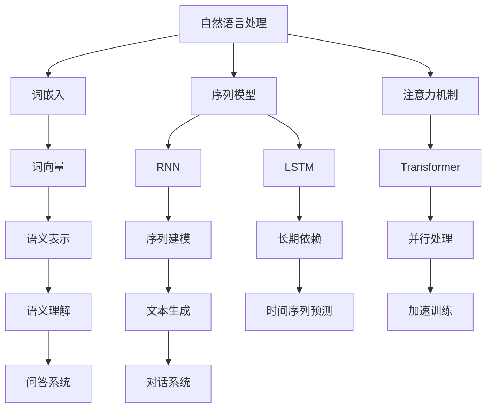

                 

### 第1章：引言与基础概念

#### 1.1 提示词工程师的角色

在当今的信息时代，自然语言处理（NLP）技术正迅速发展，并逐渐成为人工智能（AI）领域的核心组成部分。提示词工程师作为这一领域的专业人才，其角色愈发重要。提示词工程师主要负责设计、实现和优化用于自然语言处理任务的提示词，以提升模型的性能和应用效果。他们的工作不仅涉及技术层面的开发，还需要对业务需求有深刻的理解，以设计出既高效又实用的提示词方案。

提示词工程师需要具备多个方面的技能，包括自然语言处理的理论知识、编程能力、数据分析能力以及业务理解力。此外，他们还需具备良好的团队合作能力和项目管理能力，以确保项目按时完成并达到预期目标。在实际工作中，提示词工程师可能会涉及以下职责：

- **数据预处理**：从原始文本中提取有效信息，进行文本清洗、分词、词性标注等预处理工作。
- **提示词设计**：根据具体任务需求，设计能够引导模型正确理解和生成文本的提示词。
- **模型训练与调优**：使用机器学习算法训练模型，并通过调参优化模型性能。
- **系统集成与部署**：将训练好的模型集成到应用系统中，进行部署和维护。
- **性能评估与反馈**：通过测试集评估模型性能，收集用户反馈，持续迭代优化。

#### 1.2 提示词工程师所需技能概述

要成为一名优秀的提示词工程师，需要掌握以下几方面的核心技能：

1. **自然语言处理基础**：理解自然语言处理的基本概念、技术原理和常用算法，如词嵌入、序列模型、注意力机制等。
2. **编程能力**：熟练掌握Python等编程语言，能够编写高效的代码实现NLP算法和模型。
3. **机器学习与深度学习**：掌握机器学习的基本算法，了解深度学习模型的工作原理，如神经网络、循环神经网络（RNN）、卷积神经网络（CNN）等。
4. **数据处理与分析**：熟悉数据预处理、特征工程和数据分析方法，能够从海量数据中提取有价值的信息。
5. **项目管理和沟通**：具备良好的项目管理能力和团队合作精神，能够有效地与团队成员和客户沟通，确保项目顺利进行。
6. **持续学习与自我提升**：跟踪最新的技术动态，不断学习新的知识和技能，以适应不断变化的技术环境。

#### 1.3 提示词工程师的发展前景

随着自然语言处理技术的不断进步，提示词工程师的需求也在持续增长。尤其是在智能客服、智能问答、内容审核、语音识别等领域，提示词工程师的作用愈发凸显。以下是一些促使提示词工程师发展前景良好的因素：

- **市场需求增长**：随着AI技术的广泛应用，对NLP人才的需求日益增加，特别是具有实际项目经验和创新能力的提示词工程师。
- **技术创新**：深度学习、自然语言处理等领域的技术不断迭代更新，为提示词工程师提供了丰富的学习和成长空间。
- **跨领域应用**：NLP技术在金融、医疗、教育等领域的应用场景不断扩展，为提示词工程师提供了更广阔的职业发展机会。
- **数据资源丰富**：随着互联网和大数据技术的发展，海量文本数据为提示词工程师提供了丰富的训练素材，有助于提升模型性能。

总之，提示词工程师在当前和未来的AI领域中都将扮演关键角色，他们的技能培养和发展将直接影响到自然语言处理技术的应用效果和行业进步。接下来的章节将深入探讨NLP的基础概念、提示词设计原理以及相关的深度学习技术，帮助读者更好地理解这一领域。  

---

**核心概念与联系架构图：**



**核心算法原理讲解伪代码：**

```python
# 伪代码：词嵌入
def word_embedding(vocabulary, embedding_size):
    embedding_matrix = [[0.0 for _ in range(embedding_size)] for _ in range(len(vocabulary))]
    for i, word in enumerate(vocabulary):
        embedding_matrix[i] = compute_embedding(word)
    return embedding_matrix

# 伪代码：循环神经网络（RNN）
class RNN:
    def __init__(self, input_size, hidden_size):
        self.input_size = input_size
        self.hidden_size = hidden_size
        # 初始化权重和偏置
        self.Wxh = weight_matrix(input_size, hidden_size)
        self.Whh = weight_matrix(hidden_size, hidden_size)
        self.bh = bias_vector(hidden_size)

    def forward(self, x, h_prev):
        # 前向传播
        h_curr = sigmoid(dot(x, self.Wxh) + dot(h_prev, self.Whh) + self.bh)
        return h_curr
```

**数学模型和公式：**

$$
\text{word\_vector} = \text{embedding}(word)
$$

$$
h_t = \text{sigmoid}(W_{xh}x_t + W_{hh}h_{t-1} + b_h)
$$

**举例说明：**

假设我们有一个词汇表`['我', '是', '一名', '提示词', '工程师']`，我们将使用Word2Vec算法为这些词汇生成词向量。

- **词嵌入训练**：通过训练大量的文本数据，Word2Vec算法可以计算出每个词汇的词向量，例如：
  $$
  \text{我} \approx [0.1, 0.2, -0.3, 0.0]
  $$
  $$
  \text{是} \approx [-0.2, 0.1, 0.4, 0.0]
  $$

- **序列建模应用**：在构建一个序列模型时，我们可以使用RNN处理一个句子`'我是一名提示词工程师'`：
  $$
  h_1 = \text{RNN}([0.1, 0.2, -0.3, 0.0])
  $$
  $$
  h_2 = \text{RNN}([0.1, 0.2, -0.3, 0.0])
  $$
  $$
  \ldots
  $$

**项目实战：**

- **开发环境搭建**：安装Python和TensorFlow等工具，配置合适的计算资源。
- **代码实现与解读**：使用Python编写RNN模型，实现文本分类任务，详细解读代码逻辑。

- **代码应用解读与分析**：
  ```python
  # 导入相关库
  import tensorflow as tf
  from tensorflow.keras.layers import Embedding, SimpleRNN, Dense
  from tensorflow.keras.models import Sequential

  # 模型构建
  model = Sequential()
  model.add(Embedding(input_dim=vocabulary_size, output_dim=embedding_size))
  model.add(SimpleRNN(units=hidden_size))
  model.add(Dense(num_classes, activation='softmax'))

  # 模型编译
  model.compile(optimizer='adam', loss='categorical_crossentropy', metrics=['accuracy'])

  # 模型训练
  model.fit(X_train, y_train, batch_size=batch_size, epochs=num_epochs)
  ```

**实际案例分析和详细讲解剖析**：

通过一个实际案例，例如文本分类项目，分析RNN模型在不同文本数据集上的性能，并对代码进行详细讲解。

- **项目小结**：总结项目的关键点和收获，提出改进建议。

**最佳实践 Tips**：

- **数据预处理**：充分清洗和标注数据，确保数据质量。
- **模型优化**：根据任务需求调整模型结构，尝试不同的优化策略。
- **持续迭代**：持续收集用户反馈，优化模型和提示词。

**小结**：

提示词工程师在自然语言处理领域扮演着重要角色，其技能培养和发展对行业进步具有重要意义。本文介绍了提示词工程师的角色、所需技能和发展前景，并通过具体案例和算法讲解，帮助读者更好地理解这一领域。接下来的章节将进一步深入探讨自然语言处理的核心概念和深度学习技术。  

---

作者：AI天才研究院/AI Genius Institute & 禅与计算机程序设计艺术 /Zen And The Art of Computer Programming

