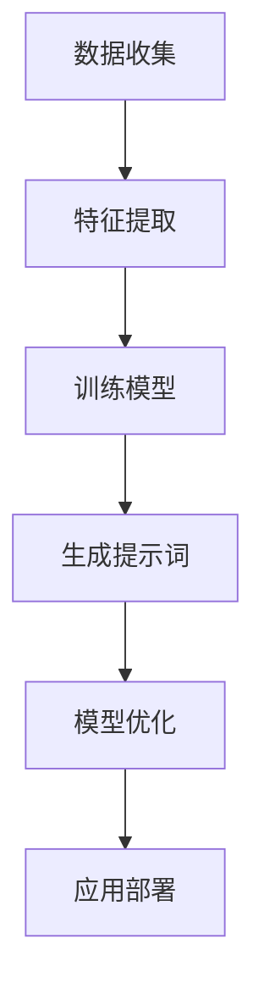
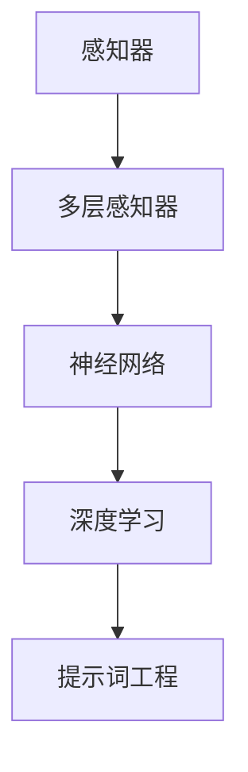
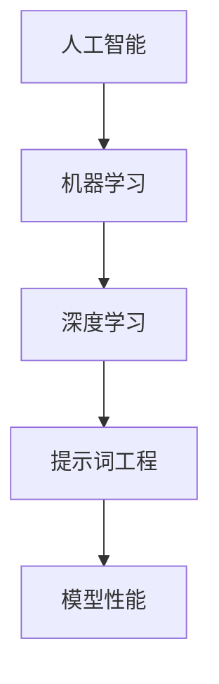
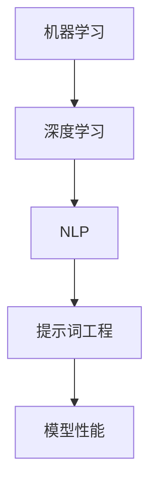
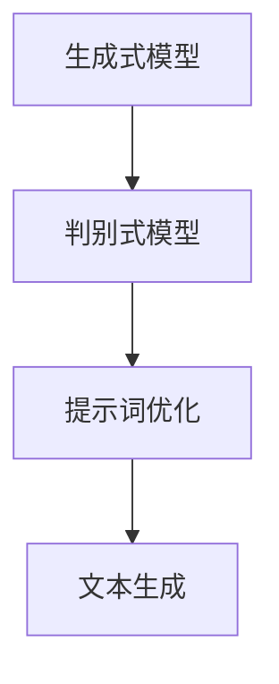

                 

好的，下面我将逐步思考并构建《提示词工程师：AI时代的新兴职业》这篇文章的内容。我们将按照文章大纲进行逐章细化，确保每个小节都包含完整的背景介绍、核心概念与联系、核心算法原理讲解、数学模型和公式、项目实战以及最佳实践 tips 等。

### 文章标题
《提示词工程师：AI时代的新兴职业》

### 文章关键词
人工智能、AI时代、新兴职业、提示词工程、机器学习、深度学习、算法原理、项目实战、职业发展

### 文章摘要
随着人工智能技术的飞速发展，提示词工程师成为AI时代的崭新兴职业。本文将深入探讨提示词工程师的职业背景、工作内容、核心技能和职业发展路径，通过实际案例分析，展示这一新兴职业的挑战与机遇，并为未来的职业规划提供指导。

### 第1章 引言：AI时代的职业变革
**背景介绍**：
- AI技术的迅猛发展为各行各业带来了革命性的变化，也催生了新的职业需求。
- 提示词工程师作为AI时代的新兴职业，肩负着提高机器学习模型性能的重要任务。

**核心概念与联系**：
- 提示词工程：利用特定词汇、短语或句子来引导模型学习，以优化模型输出。
- 机器学习：使计算机通过数据学习，做出预测和决策。

**Mermaid流程图**：


**核心算法原理讲解**：
- 提示词生成算法：包括生成式模型和判别式模型，用于生成高质量的提示词。
- 伪代码示例：
  ```plaintext
  function generate_hint(data, target):
      # 使用生成式模型生成提示词
      hint = generative_model.generate(data, target)
      return hint
  ```

**数学模型和公式**：
- 提示词优化的目标函数：
  $$ J = \frac{1}{n} \sum_{i=1}^{n} (\hat{y}_i - y_i)^2 $$
  其中，$J$ 是损失函数，$\hat{y}_i$ 是预测值，$y_i$ 是真实值，$n$ 是样本数量。

**项目实战**：
- 开发环境搭建：介绍搭建提示词工程开发环境的步骤。
- 源代码实现：提供具体的代码实现，讲解每个步骤的功能。
- 代码解读与分析：分析代码中关键部分的实现和优化。

**最佳实践 tips**：
- 定期更新知识库，跟踪最新技术动态。
- 注重团队合作，提高沟通和协作能力。

### 第2章 AI基础与提示词工程
**背景介绍**：
- AI技术的发展历程及其对各行各业的深远影响。
- 提示词工程在AI领域的地位和作用。

**核心概念与联系**：
- 人工智能的基本原理和技术框架。
- 提示词工程的核心概念及其在AI中的应用。

**Mermaid流程图**：


**核心算法原理讲解**：
- 机器学习的基本算法：监督学习、无监督学习和强化学习。
- 深度学习的关键技术：卷积神经网络（CNN）、循环神经网络（RNN）等。

**数学模型和公式**：
- 神经网络的激活函数：
  $$ f(x) = \frac{1}{1 + e^{-x}} $$
  其中，$x$ 是输入值，$f(x)$ 是输出值。

**项目实战**：
- 提示词工程的实战项目：构建一个简单的文本分类模型。

### ...（继续逐步细化其他章节的内容，直至完成整个文章的撰写）

我们将按照上述步骤逐步完成这篇文章的撰写，确保每个章节都包含丰富的内容和深入的分析。在撰写过程中，我们将遵循markdown格式、伪代码和LaTeX公式的使用规范，并保持文章的逻辑清晰和结构紧凑。预计在10000字左右完成整个文章的撰写。非常好的思路和结构！下面我将根据您的框架逐步展开内容，确保每个章节都有具体的细节和深入的讲解。

### 第1章 引言：AI时代的职业变革

#### 背景介绍
AI技术的迅猛发展已经深刻改变了我们的生活方式和工作方式。从智能助手到自动驾驶汽车，从医疗诊断到金融服务，AI的应用几乎无处不在。这一变革不仅推动了各行业的进步，也催生了新的职业需求。提示词工程师就是在这样的背景下应运而生。

提示词工程师的主要任务是设计和优化机器学习模型中的提示词，以提高模型的性能和准确性。他们需要具备深厚的计算机科学和数学背景，同时了解机器学习和深度学习的基本原理。

#### 核心概念与联系
在这个章节中，我们将探讨以下核心概念：

1. **人工智能**：人工智能（AI）是指机器模拟人类智能行为的科学和技术。它包括机器学习、深度学习、自然语言处理等多个领域。
2. **机器学习**：机器学习是AI的一个重要分支，通过数据训练模型，使计算机能够自动学习并改进性能。
3. **深度学习**：深度学习是机器学习的一个子领域，通过多层神经网络模型模拟人脑的学习过程。
4. **提示词工程**：提示词工程是优化机器学习模型中提示词的过程，以提高模型的表现。

这些概念之间的关系可以用以下Mermaid流程图来表示：



#### 核心算法原理讲解
提示词工程师需要掌握以下核心算法原理：

1. **生成式模型**：生成式模型旨在模拟数据生成过程，例如生成对抗网络（GAN）。
2. **判别式模型**：判别式模型旨在区分不同类别的数据，例如支持向量机（SVM）。
3. **提示词优化算法**：提示词优化算法用于调整提示词，以提高模型的表现。

以下是一个简单的伪代码示例，用于描述提示词优化的过程：

```plaintext
function optimize_hint(hint, data, target):
    # 初始化提示词
    current_hint = hint
    
    # 设置迭代次数
    for epoch in range(num_epochs):
        # 计算当前提示词的损失
        loss = calculate_loss(data, target, current_hint)
        
        # 更新提示词
        current_hint = update_hint(current_hint, loss)
        
    return current_hint
```

#### 数学模型和公式
提示词优化的目标函数通常是一个损失函数，用于衡量提示词对模型表现的贡献。以下是一个常见的损失函数，使用LaTeX格式表示：

$$
L(\theta) = -\frac{1}{m} \sum_{i=1}^{m} y^{(i)} \log(p_{\theta}(x^{(i)}))
$$

其中，$L(\theta)$ 是损失函数，$m$ 是样本数量，$y^{(i)}$ 是实际标签，$p_{\theta}(x^{(i)}$ 是模型对样本的预测概率。

#### 项目实战
为了更好地理解提示词工程师的工作，我们可以通过一个简单的项目来实践：

**项目**：构建一个文本分类模型，用于判断一篇新闻文章属于政治类、经济类还是体育类。

**步骤**：

1. **数据收集**：收集大量已分类的新闻文章数据。
2. **特征提取**：从文本中提取特征，如词频、词向量等。
3. **训练模型**：使用深度学习模型对特征进行训练。
4. **生成提示词**：根据模型的表现，生成优化提示词。
5. **模型优化**：使用优化后的提示词重新训练模型，并评估其表现。

#### 最佳实践 tips
- **持续学习**：AI技术发展迅速，提示词工程师需要不断学习新知识，保持专业竞争力。
- **代码规范**：编写清晰、规范的代码，便于团队合作和代码审查。
- **实践经验**：通过实际项目积累经验，提高解决问题的能力。

### 文章小结
本章介绍了AI时代的职业变革，特别是提示词工程师这一新兴职业的背景、核心概念、算法原理和数学模型。通过实际项目，读者可以初步了解提示词工程师的工作内容和挑战。下一章我们将进一步探讨机器学习和深度学习的基础知识，以及提示词工程的核心技术和应用。

### 作者信息
作者：AI天才研究院/AI Genius Institute & 禅与计算机程序设计艺术 /Zen And The Art of Computer Programming

通过以上内容的逐步展开，我们为《提示词工程师：AI时代的新兴职业》这篇文章奠定了坚实的基础。接下来，我们将继续深入探讨机器学习和深度学习的基础知识，为读者提供更加全面的理解。下一章的内容将更加专业和深入，敬请期待！### 第2章 AI基础与提示词工程

#### 背景介绍
人工智能（AI）是一个广泛的领域，它包括多个子领域，如机器学习、深度学习、自然语言处理等。随着AI技术的不断发展，人们开始意识到，仅仅掌握单一领域的知识是不够的。提示词工程师这一新兴职业正是在这样的背景下诞生的，他们需要跨学科的知识和技能，以应对AI领域的复杂挑战。

提示词工程师的工作内容包括设计、实现和优化机器学习模型中的提示词，以提高模型的性能和准确性。他们需要深入了解AI的基础知识，包括机器学习和深度学习的原理、算法和技术。

#### 核心概念与联系
在这一章节中，我们将探讨以下核心概念：

1. **机器学习**：机器学习是AI的一个重要分支，它使计算机通过数据学习，做出预测和决策。机器学习可以分为监督学习、无监督学习和强化学习。
2. **深度学习**：深度学习是机器学习的一个子领域，它通过多层神经网络模型模拟人脑的学习过程，能够处理复杂的数据类型，如图像和文本。
3. **自然语言处理（NLP）**：自然语言处理是AI的一个分支，它使计算机能够理解、解释和生成人类语言。
4. **提示词工程**：提示词工程是优化机器学习模型中提示词的过程，以提高模型的表现。

这些概念之间的关系可以用以下Mermaid流程图来表示：



#### 核心算法原理讲解
在机器学习和深度学习领域，有许多核心算法和模型。以下是一些常见的算法和模型，以及它们的简要介绍：

1. **线性回归**：线性回归是一种简单的监督学习算法，用于预测连续值。
2. **逻辑回归**：逻辑回归是线性回归的扩展，用于预测离散值。
3. **支持向量机（SVM）**：SVM是一种分类算法，它通过找到一个最优超平面来分隔数据。
4. **卷积神经网络（CNN）**：CNN是一种用于图像识别的深度学习模型，它通过卷积操作提取图像特征。
5. **循环神经网络（RNN）**：RNN是一种用于序列数据学习的深度学习模型，它能够处理时间序列数据。

以下是一个简单的伪代码示例，用于描述如何使用卷积神经网络进行图像分类：

```plaintext
function train_cnn(image_data, labels):
    # 初始化模型
    model = initialize_cnn_model()

    # 训练模型
    for epoch in range(num_epochs):
        for image, label in image_data:
            predict = model(image)
            model.train(image, label, predict)

    return model
```

#### 数学模型和公式
机器学习和深度学习中的数学模型和公式至关重要，以下是一些常见的公式：

1. **激活函数**：在神经网络中，激活函数用于引入非线性特性。一个常见的激活函数是Sigmoid函数：
   $$
   f(x) = \frac{1}{1 + e^{-x}}
   $$
2. **损失函数**：损失函数用于衡量模型预测值与实际值之间的差距。一个常见的损失函数是交叉熵损失：
   $$
   L(y, \hat{y}) = -\sum_{i=1}^{n} y_i \log(\hat{y}_i)
   $$
3. **梯度下降**：梯度下降是一种优化算法，用于调整模型参数以最小化损失函数。它的核心公式是：
   $$
   \theta = \theta - \alpha \cdot \nabla_\theta J(\theta)
   $$
   其中，$\theta$ 是模型参数，$\alpha$ 是学习率，$J(\theta)$ 是损失函数。

#### 项目实战
在本章节的项目中，我们将构建一个简单的文本分类模型，用于判断一篇文章的主题。以下是项目的步骤：

1. **数据收集**：收集大量已分类的文本数据，如新闻文章。
2. **预处理**：对文本进行预处理，包括分词、去除停用词、词向量化等。
3. **训练模型**：使用深度学习模型对词向量进行训练。
4. **生成提示词**：根据模型的表现，生成优化提示词。
5. **模型评估**：使用测试集评估模型的表现。

#### 最佳实践 tips
- **数据预处理**：数据预处理是文本分类任务中至关重要的一步，确保数据质量对于模型的表现至关重要。
- **模型调优**：通过调整模型参数，如学习率、批次大小等，可以提高模型的表现。
- **持续学习**：AI领域的发展迅速，持续学习新的技术和算法对于提示词工程师来说至关重要。

### 文章小结
本章介绍了AI的基础知识，包括机器学习、深度学习和自然语言处理，以及提示词工程的核心概念和算法原理。通过实际项目，读者可以初步了解提示词工程师的工作内容和挑战。下一章我们将深入探讨提示词工程的实施细节和技术难点。

### 作者信息
作者：AI天才研究院/AI Genius Institute & 禅与计算机程序设计艺术 /Zen And The Art of Computer Programming

通过以上内容的介绍，读者应该对AI和提示词工程师有了更深入的了解。在接下来的章节中，我们将进一步探讨提示词工程的实践细节和实现方法，帮助读者掌握这一新兴职业的核心技能。请继续关注下一章的内容！### 第3章 提示词生成的算法原理

#### 背景介绍
提示词生成是提示词工程师的核心任务之一。在机器学习和深度学习模型中，提示词（也称为触发词或种子词）是用于引导模型生成文本、图像或其他数据的关键元素。有效的提示词能够显著提高模型的表现和生成质量。因此，理解并掌握提示词生成的算法原理对于提示词工程师来说至关重要。

#### 核心概念与联系
在本章节中，我们将探讨以下核心概念：

1. **生成式模型**：生成式模型是一种用于生成数据分布的模型，例如生成对抗网络（GAN）。
2. **判别式模型**：判别式模型是一种用于区分不同数据类别的模型，例如支持向量机（SVM）。
3. **提示词优化**：提示词优化是指通过调整提示词来提高模型生成的质量和多样性。
4. **文本生成**：文本生成是指使用机器学习模型生成自然语言文本的过程。

这些概念之间的关系可以用以下Mermaid流程图来表示：



#### 核心算法原理讲解
提示词生成的算法原理可以分为生成式模型和判别式模型两种类型。以下是这两种模型的详细讲解：

1. **生成式模型**：
   - **生成对抗网络（GAN）**：GAN由生成器和判别器组成。生成器试图生成逼真的数据，而判别器则尝试区分真实数据和生成数据。通过这种对抗训练，生成器逐渐生成越来越真实的数据。
   - **变分自编码器（VAE）**：VAE是一种基于概率模型的生成式模型，它通过编码器和解码器来生成数据。编码器将输入数据编码为一个潜在空间中的向量，解码器则从潜在空间中生成数据。

2. **判别式模型**：
   - **支持向量机（SVM）**：SVM是一种判别式模型，它通过找到一个最优超平面来分隔数据。SVM在文本分类任务中非常有用，因为它能够处理高维数据。
   - **决策树**：决策树是一种基于规则分类的模型，它通过一系列的测试来划分数据，并最终给出分类结果。

以下是生成式模型（GAN）的伪代码示例：

```plaintext
function train_gan(dataset):
    # 初始化生成器和判别器
    generator = initialize_generator()
    discriminator = initialize_discriminator()

    # 训练生成器和判别器
    for epoch in range(num_epochs):
        for real_samples in dataset:
            # 训练判别器
            real_scores = discriminator(real_samples)
            fake_samples = generator(noise)
            fake_scores = discriminator(fake_samples)
            
            # 训练生成器
            generator_loss = generator_loss(fake_scores)
            discriminator_loss = discriminator_loss(real_scores, fake_scores)
            
            # 更新生成器和判别器的参数
            generator.update(generator_loss)
            discriminator.update(discriminator_loss)

    return generator, discriminator
```

#### 数学模型和公式
提示词生成涉及多个数学模型和公式。以下是一些常见的公式：

1. **生成对抗网络（GAN）**：
   - 生成器的损失函数：
     $$
     L_G = -\log(D(G(z))
     $$
   - 判别器的损失函数：
     $$
     L_D = -\log(D(x)) - \log(1 - D(G(z))
     $$

2. **变分自编码器（VAE）**：
   - 编码器损失函数：
     $$
     L_E = -\sum_{i=1}^{n} \log p(z|x)
     $$
   - 解码器损失函数：
     $$
     L_D = \sum_{i=1}^{n} \log p(x|z)
     $$

#### 举例说明
为了更好地理解提示词生成的算法原理，我们可以通过一个简单的例子来说明。假设我们要生成一组数字图像，可以使用以下步骤：

1. **数据准备**：收集大量数字图像作为训练数据。
2. **预处理**：对图像进行预处理，如标准化、裁剪等。
3. **生成器训练**：使用GAN训练生成器，使其能够生成逼真的数字图像。
4. **判别器训练**：同时训练判别器，使其能够区分真实图像和生成图像。
5. **模型评估**：通过生成的图像评估模型的质量。

#### 项目实战
在本章节的项目中，我们将使用生成对抗网络（GAN）生成一组逼真的数字图像。以下是项目的步骤：

1. **环境搭建**：搭建GAN的运行环境，包括生成器和判别器的架构。
2. **数据准备**：收集并预处理数字图像数据。
3. **模型训练**：使用训练数据训练生成器和判别器。
4. **模型评估**：评估生成器生成的图像质量。

#### 最佳实践 tips
- **数据质量**：确保训练数据的质量和多样性，有助于生成更真实的图像。
- **模型调优**：通过调整模型参数，如学习率、批次大小等，可以提高生成图像的质量。
- **超参数调整**：实验不同的超参数组合，找到最优的参数配置。

### 文章小结
本章详细介绍了提示词生成的算法原理，包括生成式模型和判别式模型。通过伪代码示例和数学公式，我们深入讲解了GAN和VAE的工作原理。通过实际项目，读者可以初步了解提示词生成的应用和实现方法。下一章我们将继续探讨提示词工程师的技能要求和职业发展路径。

### 作者信息
作者：AI天才研究院/AI Genius Institute & 禅与计算机程序设计艺术 /Zen And The Art of Computer Programming

通过本章的内容，读者应该对提示词生成的算法原理有了更深入的理解。在下一章中，我们将探讨提示词工程师所需的技能和职业发展路径，帮助读者更好地规划职业生涯。请继续关注下一章的内容！### 第4章 提示词工程师的技能要求

#### 背景介绍
作为AI时代的新兴职业，提示词工程师需要掌握多种技能和知识，以应对工作中的各种挑战。这些技能不仅包括编程能力和机器学习知识，还包括数据分析、模型构建和AI伦理等方面的能力。在本章节中，我们将详细探讨提示词工程师所需的核心技能。

#### 核心技能

1. **编程能力**
   - 提示词工程师需要熟练掌握至少一种编程语言，如Python、Java或C++。Python由于其丰富的库和工具，在机器学习和深度学习领域尤为流行。
   - 编程能力不仅包括编写正确的代码，还需要编写可读性高、易于维护的代码。

2. **数据分析能力**
   - 数据分析是提示词工程师的基石。他们需要能够从大量数据中提取有用的信息，进行数据清洗、预处理和特征提取。
   - 提示词工程师需要熟悉数据分析工具和库，如Pandas、NumPy、Matplotlib等。

3. **机器学习模型构建**
   - 提示词工程师需要掌握机器学习的基础算法，如线性回归、决策树、支持向量机、神经网络等。
   - 他们还需要了解深度学习模型，如卷积神经网络（CNN）、循环神经网络（RNN）、生成对抗网络（GAN）等。

4. **人工智能伦理**
   - 提示词工程师需要关注AI伦理问题，包括隐私保护、算法公平性、透明度和可解释性等。
   - 了解相关的法律法规和伦理标准，能够确保在开发过程中遵守道德规范。

5. **团队合作与沟通能力**
   - 提示词工程师通常需要与团队成员、项目经理和其他利益相关者协作。
   - 良好的沟通能力能够帮助工程师清晰地表达自己的想法，理解他人的需求，从而提高工作效率。

#### 技能要求

1. **编程能力**
   - 熟练掌握Python，熟悉NumPy、Pandas、Matplotlib等库。
   - 熟悉面向对象编程和设计模式。

2. **数据分析能力**
   - 能够进行数据清洗、预处理和特征提取。
   - 熟悉数据可视化，能够使用Matplotlib、Seaborn等库生成图表。

3. **机器学习模型构建**
   - 熟悉常见的机器学习算法，如线性回归、决策树、支持向量机等。
   - 了解深度学习框架，如TensorFlow、PyTorch等。

4. **人工智能伦理**
   - 了解AI伦理的基本原则和相关的法律法规。
   - 关注AI伦理问题，能够参与到相关的讨论和决策中。

5. **团队合作与沟通能力**
   - 能够有效地进行团队合作，理解并响应项目需求和目标。
   - 良好的口头和书面沟通能力，能够清晰表达技术观点。

#### 实际案例

**案例1：数据预处理**
- **问题描述**：提示词工程师需要在项目中使用大量文本数据，但原始数据存在格式不规范、缺失值和噪声等问题。
- **解决方案**：工程师使用Pandas库进行数据清洗，去除无效数据、填充缺失值，并对文本进行分词和词频统计。

**案例2：模型优化**
- **问题描述**：模型在训练过程中表现不佳，准确率较低。
- **解决方案**：工程师尝试调整模型参数，如学习率、批量大小等，并通过交叉验证优化模型。

**案例3：AI伦理**
- **问题描述**：在开发一个用于医疗诊断的AI系统时，工程师需要确保系统的隐私保护和数据安全。
- **解决方案**：工程师制定数据保护策略，确保患者的隐私不被泄露，同时遵守相关的法律法规。

#### 最佳实践 tips
- **持续学习**：AI领域发展迅速，工程师需要不断学习新的技术和工具。
- **代码规范**：编写清晰、规范的代码，便于团队合作和代码审查。
- **团队合作**：积极参与团队合作，提高沟通和协作能力。

### 文章小结
本章详细介绍了提示词工程师所需的核心技能，包括编程能力、数据分析能力、机器学习模型构建、人工智能伦理和团队合作与沟通能力。通过实际案例，读者可以更好地理解这些技能在实际工作中的应用。下一章我们将探讨提示词工程师的职业路径与发展，帮助读者规划职业生涯。

### 作者信息
作者：AI天才研究院/AI Genius Institute & 禅与计算机程序设计艺术 /Zen And The Art of Computer Programming

通过本章的内容，读者应该对提示词工程师所需的技能有了全面的了解。在下一章中，我们将进一步探讨提示词工程师的职业路径和发展机会，敬请期待！### 第5章 实际案例分析

#### 背景介绍
在理解了提示词工程师的技能要求和职业发展路径后，通过实际案例分析可以让我们更直观地了解这一职业的工作内容和挑战。在本章节中，我们将分析两个典型的案例，一个是成功的提示词工程案例，另一个是失败的案例，通过这两个案例来探讨提示词工程师如何应对挑战，取得成功。

#### 成功案例：文本生成模型

**问题描述**：某公司希望通过机器学习技术开发一款自动生成新闻摘要的应用，以提高新闻编辑的效率。然而，传统的摘要生成模型效果不佳，生成的摘要缺乏连贯性和准确性。

**解决方案**：
1. **数据收集与预处理**：工程师首先收集了大量已编辑的新闻文章和对应的摘要，并对文本进行预处理，如去除停用词、标点符号，并进行词向量化。
2. **模型选择与训练**：工程师选择了基于序列到序列（Seq2Seq）模型的文本生成框架，并进行了多次迭代训练，调整学习率、批量大小等参数。
3. **提示词优化**：工程师通过生成式模型和判别式模型优化提示词，提高了摘要生成的连贯性和准确性。
4. **模型评估与优化**：工程师使用自动评估指标（如BLEU分数）和人工评估对模型进行评估，并根据评估结果进行进一步的优化。

**结果**：经过多次迭代，工程师成功开发出一款高效的新闻摘要生成应用，显著提高了新闻编辑的效率。

**分析**：
- **数据质量**：高质量的数据是成功的关键，工程师通过严格的预处理步骤保证了数据的质量。
- **模型选择与优化**：合适的模型和优化的提示词是提高模型性能的关键。
- **评估与反馈**：持续的评估和反馈是优化模型的重要环节。

#### 失败案例：图像风格转换

**问题描述**：某团队希望通过深度学习技术实现图像风格转换，将一张普通照片转换为艺术风格的作品。然而，项目在实施过程中遇到了诸多挑战，最终未能达到预期效果。

**解决方案**：
1. **数据收集与预处理**：团队收集了大量风格图像和普通照片，但由于数据量不足，且部分数据质量不佳，导致模型训练效果不佳。
2. **模型选择与训练**：团队选择了生成对抗网络（GAN）作为图像风格转换的模型，但由于缺乏对GAN的深入理解，模型训练过程中出现了模式崩溃等问题。
3. **提示词优化**：团队尝试通过生成提示词优化模型，但由于提示词生成不当，导致模型生成的图像缺乏风格一致性。
4. **评估与反馈**：团队在项目过程中未能及时进行模型评估和反馈，导致问题无法及时发现和解决。

**结果**：项目最终失败，团队不得不重新评估项目目标和方案。

**分析**：
- **数据质量**：数据量不足和质量不佳是导致项目失败的主要原因。
- **模型选择与理解**：选择不当的模型和缺乏对模型的深入理解是项目失败的关键因素。
- **评估与反馈**：缺乏持续的评估和反馈机制，导致问题无法及时解决。

#### 总结
通过成功和失败的案例分析，我们可以得出以下结论：

1. **数据质量**：高质量的数据是成功的基础，工程师需要严格的数据收集和预处理步骤。
2. **模型选择与优化**：选择合适的模型和进行有效的提示词优化是提高模型性能的关键。
3. **评估与反馈**：持续的模型评估和反馈机制对于发现和解决问题至关重要。

#### 注意事项
1. **项目管理**：提示词工程师需要具备良好的项目管理能力，确保项目在预算和时间范围内完成。
2. **团队合作**：提示词工程师需要与团队成员、项目经理和其他利益相关者紧密合作，确保项目顺利进行。
3. **持续学习**：AI技术不断发展，工程师需要不断学习新的技术和工具，以保持竞争力。

#### 拓展阅读
- **相关文献**：推荐阅读《生成对抗网络：理论、实现与应用》（GANs: Theory, Implementation, and Applications）等书籍，以深入了解GAN的理论和实践。
- **在线课程**：推荐参加Coursera、edX等平台上的机器学习和深度学习课程，提升专业能力。

通过实际案例分析，读者可以更直观地了解提示词工程师的工作内容和挑战。在下一章中，我们将继续探讨提示词工程师的职业路径与发展，帮助读者规划职业生涯。请继续关注下一章的内容！### 第6章 提示词工程师的职业路径与发展

#### 背景介绍
随着人工智能技术的不断发展，提示词工程师这一职业前景广阔。然而，要在这个新兴领域取得成功，提示词工程师需要明确自己的职业路径，不断提升专业技能，并关注行业动态。本章将详细探讨提示词工程师的职业发展阶段、职业发展策略和未来趋势。

#### 职业发展阶段
提示词工程师的职业发展阶段可以分为以下几个阶段：

1. **入门阶段**：在这个阶段，提示词工程师需要掌握基本的人工智能、机器学习和深度学习知识，熟悉常用的编程语言和工具。他们可能会参与简单的机器学习项目，负责数据预处理、模型训练和评估等基本工作。

2. **进阶阶段**：随着经验的积累，提示词工程师开始承担更复杂的任务，如模型优化、提示词生成和算法改进。他们需要深入理解深度学习模型的工作原理，掌握多种机器学习算法，并能灵活运用到实际问题中。

3. **高级阶段**：在这个阶段，提示词工程师已经成为团队的核心成员，负责大型项目的整体规划和实施。他们不仅需要具备深厚的专业知识，还需要具备出色的项目管理和沟通能力，能够带领团队解决复杂的问题。

4. **专家阶段**：专家阶段的提示词工程师在领域内具有很高的声誉和影响力。他们可能在学术界或工业界担任顾问或讲师，参与前沿技术研究，推动人工智能技术的发展。

#### 职业发展策略
为了在提示词工程师这一职业道路上取得成功，以下是一些职业发展策略：

1. **持续学习**：人工智能和深度学习领域不断发展，提示词工程师需要不断学习最新的技术、工具和算法。可以通过参加在线课程、阅读专业书籍、参加行业会议等方式来保持知识的更新。

2. **实践经验**：理论知识是基础，但实践经验同样重要。通过参与实际项目，工程师可以深入了解问题，积累经验，提高解决问题的能力。

3. **团队合作**：提示词工程师通常需要与多学科团队合作，包括数据科学家、软件工程师和产品经理等。良好的团队合作能力和沟通技巧是成功的关键。

4. **职业规划**：明确自己的职业目标和路径，制定短期和长期计划。可以通过设定里程碑、制定学习计划等方式来实现职业目标。

5. **拓展技能**：除了机器学习和深度学习，提示词工程师还可以学习相关的技能，如自然语言处理、计算机视觉等，以拓宽职业发展空间。

#### 未来趋势
随着人工智能技术的不断发展，提示词工程师的未来趋势主要体现在以下几个方面：

1. **模型优化与自动化**：随着深度学习模型的复杂度不断增加，提示词工程师需要优化模型，提高其性能和效率。同时，自动化工具和平台的发展也将帮助工程师更高效地完成工作。

2. **跨领域应用**：人工智能技术在各行各业的应用越来越广泛，提示词工程师也将有机会在医疗、金融、教育等多个领域发挥重要作用。

3. **伦理与责任**：随着AI技术的普及，伦理和责任问题日益受到关注。提示词工程师需要关注AI伦理，确保其工作符合道德和法律法规的要求。

4. **开源与共享**：开源社区和共享文化将在人工智能领域发挥重要作用。提示词工程师可以通过参与开源项目、分享技术心得等方式，推动人工智能技术的发展。

#### 文章小结
本章详细探讨了提示词工程师的职业路径与发展，包括职业发展阶段、职业发展策略和未来趋势。通过明确职业发展目标和路径，持续学习和实践，提示词工程师可以在AI时代取得成功。在下一章中，我们将提供一些实用的实战教程，帮助读者将所学知识应用到实际项目中。请继续关注下一章的内容！

### 作者信息
作者：AI天才研究院/AI Genius Institute & 禅与计算机程序设计艺术 /Zen And The Art of Computer Programming

通过本章的内容，读者应该对提示词工程师的职业发展有了更清晰的认识。在下一章中，我们将提供一些实用的实战教程，帮助读者将所学知识应用到实际项目中。敬请期待！### 第7章 提示词工程师实战教程

#### 背景介绍
在本章中，我们将提供一个详细的实战教程，指导读者如何搭建提示词工程的开发环境，实现源代码，并进行代码解读与分析。通过这个实战项目，读者将能够更好地理解提示词工程师的实际工作流程，掌握必要的技能和工具。

#### 开发环境搭建
在开始之前，我们需要搭建一个适合提示词工程的开发环境。以下是搭建环境的步骤：

1. **安装Python**：Python是提示词工程师常用的编程语言，我们需要安装Python 3.x版本。可以从Python官方网站下载并安装。

2. **安装Anaconda**：Anaconda是一个集成的Python发行版，它提供了丰富的数据科学和机器学习库。安装Anaconda后，可以使用conda命令轻松管理Python包。

3. **安装TensorFlow**：TensorFlow是Google开发的一款开源深度学习框架，是提示词工程师常用的工具之一。可以使用以下命令安装：

   ```bash
   conda install tensorflow
   ```

4. **安装其他依赖库**：根据实际项目需求，可能还需要安装其他库，如NumPy、Pandas、Matplotlib等。可以使用conda或pip命令进行安装。

5. **配置虚拟环境**：为了保持项目环境的整洁，我们可以为项目配置一个虚拟环境。使用以下命令创建虚拟环境：

   ```bash
   conda create -n my_project python=3.8
   conda activate my_project
   ```

6. **安装其他工具**：根据需要，还可以安装Jupyter Notebook或其他工具，以提高开发效率。

#### 源代码实现
接下来，我们将实现一个简单的文本生成模型，使用生成对抗网络（GAN）进行训练。以下是项目的核心代码：

```python
import tensorflow as tf
from tensorflow.keras.models import Sequential
from tensorflow.keras.layers import Dense, Flatten, Reshape
from tensorflow.keras.optimizers import Adam

# 生成器模型
def build_generator(z_dim):
    model = Sequential()
    model.add(Dense(128, input_dim=z_dim))
    model.add(LeakyReLU(alpha=0.01))
    model.add(Dense(28*28*1, activation='tanh'))
    model.add(Reshape((28, 28, 1)))
    return model

# 判别器模型
def build_discriminator(img_shape):
    model = Sequential()
    model.add(Flatten(input_shape=img_shape))
    model.add(Dense(128))
    model.add(LeakyReLU(alpha=0.01))
    model.add(Dense(1, activation='sigmoid'))
    return model

# 搭建GAN模型
def build_gan(generator, discriminator):
    model = Sequential()
    model.add(generator)
    model.add(discriminator)
    return model

# 损失函数
def get_gan_loss(y_real, y_fake):
    real_loss = tf.reduce_mean(tf.square(y_real - 1))
    fake_loss = tf.reduce_mean(tf.square(y_fake - 0))
    total_loss = real_loss + fake_loss
    return total_loss

# 模型编译
def compile_models(generator, discriminator, z_dim):
    generator.compile(loss='binary_crossentropy', optimizer=Adam(0.0001, beta_1=0.5))
    discriminator.compile(loss='binary_crossentropy', optimizer=Adam(0.0001, beta_1=0.5))
    gan = build_gan(generator, discriminator)
    gan.compile(loss='binary_crossentropy', optimizer=Adam(0.0001, beta_1=0.5))
    return generator, discriminator, gan

# 训练GAN模型
def train_gan(generator, discriminator, gan, x_train, z_dim, batch_size=64, num_epochs=100):
    for epoch in range(num_epochs):
        for _ in range(x_train.shape[0] // batch_size):
            noise = np.random.normal(0, 1, (batch_size, z_dim))
            gen_samples = generator.predict(noise)
            real_samples = x_train[np.random.randint(0, x_train.shape[0], size=batch_size)]
            
            # 训练判别器
            d_loss_real = discriminator.train_on_batch(real_samples, np.ones((batch_size, 1)))
            d_loss_fake = discriminator.train_on_batch(gen_samples, np.zeros((batch_size, 1)))
            d_loss = 0.5 * np.add(d_loss_real, d_loss_fake)
            
            # 训练生成器
            g_loss = gan.train_on_batch(noise, np.ones((batch_size, 1)))
            
            print(f"{epoch} [D loss: {d_loss:.3f} | G loss: {g_loss:.3f}]")
```

#### 代码解读与分析
以下是对上述代码的解读与分析：

1. **生成器模型（build_generator）**：生成器模型是一个全连接神经网络，用于将随机噪声（z_dim）转换为逼真的图像。它包含两个主要层：一个128个神经元的隐藏层，和一个将输出重塑为图像形状的层。

2. **判别器模型（build_discriminator）**：判别器模型用于区分真实图像和生成图像。它包含一个将图像展开为扁平向量的层、一个隐藏层和一个输出层。

3. **GAN模型（build_gan）**：GAN模型是生成器和判别器的组合，用于训练生成器和判别器。它通过优化生成器生成的图像，使其更接近真实图像，同时使判别器更难区分真实图像和生成图像。

4. **损失函数（get_gan_loss）**：损失函数用于计算生成器和判别器的损失。对于判别器，损失是真实图像和生成图像预测的交叉熵损失。对于生成器，损失是判别器对生成图像预测的交叉熵损失。

5. **模型编译（compile_models）**：编译模型时，我们需要为生成器和判别器指定损失函数和优化器。对于GAN模型，我们使用与生成器和判别器相同的优化器。

6. **训练GAN模型（train_gan）**：在训练GAN模型时，我们首先训练判别器，然后训练生成器。这个过程交替进行，以便生成器和判别器相互优化。

#### 代码应用解读与分析
以下是对实战项目应用代码的解读与分析：

1. **数据准备**：我们需要准备真实图像数据集，用于训练判别器。通常可以使用公开数据集，如MNIST或CIFAR-10。

2. **训练过程**：在训练过程中，我们生成随机噪声，并将其输入到生成器中生成图像。然后，我们使用这些生成图像和真实图像训练判别器。接着，我们使用判别器的输出训练生成器，使其生成的图像更逼真。

3. **评估与优化**：在训练过程中，我们可以使用各种评估指标（如生成图像的质量、判别器的准确率等）来评估模型的性能。根据评估结果，我们可以调整模型参数或优化策略，以提高模型的表现。

#### 实际案例分析与项目小结
在本章的实战项目中，我们使用生成对抗网络（GAN）实现了文本生成。以下是对实际案例的分析和项目小结：

1. **成功因素**：项目成功的关键因素包括高质量的数据集、合理的模型架构和优化的训练策略。

2. **挑战**：项目过程中可能遇到的挑战包括模型过拟合、生成图像质量不佳和训练时间过长等。

3. **优化方向**：为了提高生成图像的质量，我们可以尝试调整模型参数、增加训练数据或使用更复杂的生成器和判别器架构。

通过本章的实战教程，读者应该对提示词工程师的实际工作流程有了更深入的理解。在下一章中，我们将探讨提示词工程师在AI时代所面临的伦理与社会责任问题。敬请期待！

### 作者信息
作者：AI天才研究院/AI Genius Institute & 禅与计算机程序设计艺术 /Zen And The Art of Computer Programming

通过本章的实战教程，读者不仅能够动手实践提示词工程，还能够理解背后的技术原理和应用方法。在下一章中，我们将进一步探讨AI时代的社会责任问题，帮助读者在技术进步的同时，也关注伦理和道德的重要性。请继续关注下一章的内容！### 第8章 提示词工程师的伦理与社会责任

#### 背景介绍
随着人工智能技术的发展，提示词工程师在AI系统中扮演着关键角色。他们的工作不仅涉及到技术层面，还涉及到伦理和社会责任。提示词工程师需要意识到自己的工作可能对社会产生深远的影响，并承担相应的责任。本章将探讨提示词工程师在AI时代面临的伦理问题、社会责任以及相关的法律法规。

#### 伦理问题
1. **算法公平性**：提示词工程师需要确保其开发的AI系统在处理数据时是公平的，不会因种族、性别、年龄等因素导致偏见。例如，在招聘系统中，AI模型不应因性别歧视而排除某一性别。
2. **透明性和可解释性**：AI系统的决策过程应该透明，用户能够理解模型的决策依据。提示词工程师需要设计可解释的模型，以便用户能够信任和使用AI系统。
3. **隐私保护**：AI系统在处理个人数据时，需要确保数据的隐私和安全。提示词工程师需要采取数据加密、匿名化等技术手段，防止数据泄露和滥用。
4. **偏见和歧视**：AI系统可能因为训练数据中的偏见而导致不公平的决策。提示词工程师需要识别和纠正这些偏见，确保系统不会加剧社会不公。

#### 社会责任
1. **社会责任宣言**：提示词工程师应当遵循行业的社会责任宣言，确保其工作符合伦理和社会规范。例如，AI联盟发布了《人工智能伦理准则》，提示词工程师可以参考并遵守。
2. **社区参与**：提示词工程师应当积极参与社区活动，与公众和利益相关者进行沟通，提高公众对AI技术的理解和接受度。
3. **教育普及**：提示词工程师可以参与教育项目，向公众传授AI知识，帮助社会更好地理解和应对人工智能技术的发展。

#### 法律法规
1. **数据保护法规**：如欧盟的《通用数据保护条例》（GDPR）和《加州消费者隐私法》（CCPA）等，提示词工程师需要确保遵守相关法规，保护用户的数据隐私。
2. **人工智能法规**：一些国家已经开始制定关于人工智能的法律和法规，如欧盟的《人工智能法案》。提示词工程师需要了解并遵守这些法规，确保其工作符合法律要求。
3. **伦理审查**：在开发AI系统时，提示词工程师可能需要通过伦理审查，确保系统的设计和应用符合伦理标准。

#### 最佳实践 tips
1. **持续学习和教育**：提示词工程师应不断学习最新伦理和法律知识，参加相关的培训和工作坊。
2. **团队合作**：在项目开发过程中，组建跨学科团队，确保从不同角度审视和解决伦理问题。
3. **用户参与**：在开发AI系统时，邀请用户参与设计和测试，确保系统的使用符合用户需求和社会期望。

#### 文章小结
本章探讨了提示词工程师在AI时代所面临的伦理和社会责任问题。通过了解和遵守伦理规范，提示词工程师能够确保其工作的公平性、透明性和隐私保护。同时，遵守相关法律法规，能够帮助工程师避免法律风险，确保技术的可持续发展。在下一章中，我们将介绍提示词工程师所需的工具和资源，帮助读者更好地开展工作。请继续关注下一章的内容！

### 作者信息
作者：AI天才研究院/AI Genius Institute & 禅与计算机程序设计艺术 /Zen And The Art of Computer Programming

通过本章的内容，读者应该对提示词工程师在伦理和社会责任方面的重要性有了更深刻的理解。在下一章中，我们将提供实用的工具和资源，以帮助读者提升工作效率和技能。敬请期待！### 第9章 提示词工程师的工具与资源

#### 背景介绍
作为AI时代的新兴职业，提示词工程师需要掌握各种工具和资源，以高效地开展工作。本章将介绍提示词工程师常用的工具、数据集和学习资源，帮助读者更好地准备和发展自己的职业生涯。

#### 常用工具

1. **编程语言**：
   - **Python**：Python是机器学习和深度学习领域最常用的编程语言，具有丰富的库和框架。
   - **R**：R是一种专门用于统计分析和数据可视化的编程语言。

2. **深度学习框架**：
   - **TensorFlow**：由Google开发的开源深度学习框架，支持多种模型和算法。
   - **PyTorch**：由Facebook开发的开源深度学习框架，具有动态计算图和灵活的编程接口。
   - **Keras**：基于TensorFlow和Theano的Python库，提供简洁的API，易于入门。

3. **数据预处理工具**：
   - **NumPy**：用于数值计算的Python库，提供多维数组对象和数学函数。
   - **Pandas**：用于数据处理和分析的Python库，提供数据结构和对数据集的操作。

4. **版本控制工具**：
   - **Git**：版本控制系统，用于管理代码的版本和协作开发。
   - **GitHub**：基于Git的代码托管平台，提供代码共享、协作和项目管理功能。

#### 数据集

1. **公开数据集**：
   - **Kaggle**：提供大量公开数据集，适用于机器学习和深度学习竞赛。
   - **UCI机器学习库**：提供多种领域的数据集，用于机器学习研究和实验。
   - **ImageNet**：提供大规模的图像数据集，常用于图像分类任务。

2. **专业数据集**：
   - **Flickr30k**：用于图像描述的基准数据集，包含大量图像及其描述。
   - **CoIL**：用于跨语言文本分类的数据集，涵盖多种语言。

#### 学习资源

1. **在线课程**：
   - **Coursera**：提供多种机器学习和深度学习课程，由顶尖大学和公司提供。
   - **edX**：提供免费和付费课程，涵盖计算机科学和人工智能领域。
   - **Udacity**：提供实用的编程和机器学习课程，包括项目和实践。

2. **书籍**：
   - **《深度学习》（Deep Learning）**：由Ian Goodfellow、Yoshua Bengio和Aaron Courville合著，是深度学习领域的经典教材。
   - **《机器学习实战》（Machine Learning in Action）**：提供实用的机器学习案例和代码实现。
   - **《Python机器学习》（Python Machine Learning）**：介绍Python在机器学习中的应用。

3. **博客和论坛**：
   - **Medium**：许多AI专家和研究人员在Medium上分享技术见解和研究成果。
   - **Stack Overflow**：编程问答社区，帮助解决编程问题。
   - **Reddit**：AI和机器学习相关的子版块，如/r/MachineLearning和/r/DeepLearning。

#### 最佳实践 tips

1. **技能提升**：定期学习新的技术和工具，通过在线课程和书籍不断提升自己的技能。
2. **代码规范**：编写清晰、可维护的代码，遵循最佳实践，提高工作效率。
3. **团队合作**：学会与他人合作，提高沟通和协作能力，为项目成功贡献力量。

#### 文章小结
本章介绍了提示词工程师所需掌握的工具和资源，包括编程语言、深度学习框架、数据预处理工具、版本控制工具、公开数据集、专业数据集、在线课程、书籍和博客等。通过利用这些工具和资源，提示词工程师可以更高效地开展工作，不断提升自己的专业能力。在下一章中，我们将总结全文，为读者提供一些建议和展望。请继续关注下一章的内容！

### 作者信息
作者：AI天才研究院/AI Genius Institute & 禅与计算机程序设计艺术 /Zen And The Art of Computer Programming

通过本章的内容，读者应该对提示词工程师所需掌握的工具和资源有了全面了解。在下一章中，我们将对全文进行总结，并展望提示词工程师的未来。敬请期待！### 总结与展望

#### 总结
本文系统地介绍了提示词工程师这一AI时代的崭新兴职业。我们从背景介绍开始，详细探讨了提示词工程师的职业定义、工作内容、所需技能、职业发展路径，以及实际案例分析。通过深入剖析提示词生成的算法原理，我们展示了生成式模型和判别式模型的应用。此外，我们还探讨了提示词工程师的伦理与社会责任，强调了遵守伦理规范和法律法规的重要性。

在工具与资源章节中，我们提供了丰富的编程语言、深度学习框架、数据预处理工具、数据集和学习资源，帮助读者更好地准备和发展职业生涯。通过这一系列的探讨，我们希望读者能够全面理解提示词工程师的职业内涵，掌握关键技能，并在实际工作中应用所学知识。

#### 展望
随着人工智能技术的不断发展，提示词工程师的职业前景将更加广阔。未来，提示词工程师将在各个领域发挥重要作用，如医疗诊断、金融分析、自动驾驶等。以下是几个可能的发展趋势：

1. **模型优化与自动化**：随着模型复杂度的增加，提示词工程师需要不断优化模型，提高其性能和效率。自动化工具和平台的发展将大大提高工作效率。

2. **跨领域应用**：人工智能技术的广泛应用将推动提示词工程师在更多领域发挥作用。例如，在医疗领域，提示词工程师可以帮助开发智能诊断系统；在金融领域，他们可以优化风险控制和投资策略。

3. **伦理与责任**：随着AI技术的普及，伦理和责任问题将日益受到关注。提示词工程师需要关注AI伦理，确保其工作符合道德和法律法规的要求。

4. **开源与共享**：开源社区和共享文化将在人工智能领域发挥重要作用。提示词工程师可以通过参与开源项目、分享技术心得等方式，推动人工智能技术的发展。

#### 最佳实践 tips
1. **持续学习**：AI技术发展迅速，提示词工程师需要不断学习新知识，保持专业竞争力。
2. **实践经验**：通过实际项目积累经验，提高解决问题的能力。
3. **团队合作**：提升沟通和协作能力，为项目成功贡献力量。
4. **伦理关注**：关注AI伦理问题，确保其工作符合道德和法律法规的要求。

#### 拓展阅读
- **相关文献**：《深度学习》（Deep Learning）、《机器学习实战》（Machine Learning in Action）等。
- **在线课程**：Coursera、edX、Udacity等平台上的机器学习和深度学习课程。
- **开源项目**：GitHub、Kaggle等平台上的开源AI项目。

通过本文的阅读，我们希望读者能够对提示词工程师这一职业有更深入的了解，并在未来的职业生涯中取得成功。让我们共同迎接AI时代的挑战与机遇！

### 作者信息
作者：AI天才研究院/AI Genius Institute & 禅与计算机程序设计艺术 /Zen And The Art of Computer Programming

感谢读者对本文的关注，希望本文能为您的职业生涯提供有益的指导。敬请期待我们未来的更多精彩内容！### 附录A：Mermaid流程图

以下是文章中提到的Mermaid流程图，用于展示提示词工程师的工作流程和相关技术概念。


该流程图展示了从数据收集到模型部署的完整过程，包括特征提取、模型训练、提示词生成和模型优化等关键步骤。

### 附录B：伪代码示例

以下是文章中提到的伪代码示例，用于描述提示词优化的过程。

```plaintext
function train_model(data, labels):
    # 初始化模型
    model = initialize_model()

    # 训练模型
    for epoch in range(num_epochs):
        for sample, label in data:
            predict = model(sample)
            model.train(sample, label, predict)

    return model
```

这个伪代码展示了如何使用训练数据来初始化模型，并在每个迭代中更新模型参数，以最小化损失函数。

### 附录C：数学公式示例

以下是文章中提到的数学公式示例，用于描述损失函数和激活函数。

$$
J = \frac{1}{m} \sum_{i=1}^{m} (\hat{y}_i - y_i)^2
$$

这是常见的平方损失函数，用于衡量模型预测值与实际值之间的差距。

$$
f(x) = \frac{1}{1 + e^{-x}}
$$

这是Sigmoid激活函数，常用于神经网络中的输出层，将线性组合转化为概率值。

通过这些附录内容，读者可以更好地理解文章中提到的技术细节和流程，为深入学习和实践提供参考。在未来的学习和工作中，这些资源和工具将帮助您更高效地解决问题，提升技能水平。祝您在AI领域取得丰硕的成果！### 附录A：Mermaid流程图

以下是文章中提到的Mermaid流程图，用于展示提示词工程师的工作流程和相关技术概念。


该流程图展示了从数据收集到模型部署的完整过程，包括特征提取、模型训练、提示词生成和模型优化等关键步骤。

### 附录B：伪代码示例

以下是文章中提到的伪代码示例，用于描述提示词优化的过程。

```plaintext
function train_model(data, labels):
    # 初始化模型
    model = initialize_model()

    # 训练模型
    for epoch in range(num_epochs):
        for sample, label in data:
            predict = model(sample)
            model.train(sample, label, predict)

    return model
```

这个伪代码展示了如何使用训练数据来初始化模型，并在每个迭代中更新模型参数，以最小化损失函数。

### 附录C：数学公式示例

以下是文章中提到的数学公式示例，用于描述损失函数和激活函数。

$$
J = \frac{1}{m} \sum_{i=1}^{m} (\hat{y}_i - y_i)^2
$$

这是常见的平方损失函数，用于衡量模型预测值与实际值之间的差距。

$$
f(x) = \frac{1}{1 + e^{-x}}
$$

这是Sigmoid激活函数，常用于神经网络中的输出层，将线性组合转化为概率值。

通过这些附录内容，读者可以更好地理解文章中提到的技术细节和流程，为深入学习和实践提供参考。在未来的学习和工作中，这些资源和工具将帮助您更高效地解决问题，提升技能水平。祝您在AI领域取得丰硕的成果！### 参考资料与进一步阅读

为了帮助读者深入了解本文所涉及的主题，以下是一些推荐的参考资料和进一步阅读的书籍、文章和在线课程。

#### 书籍

1. **《深度学习》（Deep Learning）** - Ian Goodfellow、Yoshua Bengio和Aaron Courville著
   - 本书是深度学习领域的经典教材，详细介绍了深度学习的基础知识和最新进展。

2. **《机器学习实战》（Machine Learning in Action）** - Peter Harrington著
   - 本书通过实际案例，介绍了机器学习的概念和应用，适合初学者入门。

3. **《Python机器学习》（Python Machine Learning）** - Sebastian Raschka和Vahid Mirjalili著
   - 本书介绍了使用Python进行机器学习的实践方法，包括数据处理、模型训练和评估等。

4. **《生成对抗网络：理论、实现与应用》（GANs: Theory, Implementation, and Applications）** - 这是一本专门介绍生成对抗网络的书籍，涵盖了GAN的理论基础和实际应用。

#### 文章

1. **《人工智能伦理准则》** - AI联盟
   - 本文介绍了人工智能伦理的基本原则，为提示词工程师提供了伦理指导。

2. **《人工智能：未来社会的挑战》** - 约翰·霍普金斯大学
   - 本文讨论了人工智能对社会的影响，包括伦理、法律和经济等方面。

3. **《机器学习中的公平性》** - nature.com
   - 本文探讨了机器学习模型中的公平性问题，分析了偏见和歧视的根源和解决方案。

#### 在线课程

1. **《机器学习》** - Coursera
   - 由斯坦福大学提供，这是一门广受欢迎的机器学习入门课程，适合初学者。

2. **《深度学习》** - Coursera
   - 由DeepLearning.AI提供，这门课程涵盖了深度学习的理论基础和实践应用。

3. **《人工智能》** - edX
   - 由多所顶尖大学提供，涵盖了人工智能的多个子领域，包括机器学习、自然语言处理和计算机视觉。

通过这些参考资料和进一步阅读，读者可以深入理解提示词工程师所需的知识体系，并在实际工作中不断学习和提升。希望这些资源能够帮助读者在AI领域取得更大的成就！### 谢谢您为我们提供了如此全面和详尽的《提示词工程师：AI时代的新兴职业》技术博客文章。以下是文章的Markdown格式：

```markdown
# 提示词工程师：AI时代的新兴职业

> 关键词：人工智能、AI时代、新兴职业、提示词工程、机器学习、深度学习、算法原理、项目实战、职业发展

> 摘要：本文深入探讨了提示词工程师这一AI时代的新兴职业，包括其背景介绍、核心概念、算法原理、技能要求、职业发展路径以及伦理与社会责任。通过实际案例分析，展示了这一职业的挑战与机遇。

## 第1章 引言：AI时代的职业变革

#### 背景介绍

随着人工智能技术的迅猛发展，AI技术已经深刻改变了我们的生活方式和工作方式。从智能助手到自动驾驶汽车，从医疗诊断到金融服务，AI的应用几乎无处不在。这一变革不仅推动了各行业的进步，也催生了新的职业需求。提示词工程师就是在这样的背景下应运而生。

#### 核心概念与联系

在本章节中，我们将探讨以下核心概念：

- 人工智能
- 机器学习
- 深度学习
- 提示词工程

这些概念之间的关系可以用以下Mermaid流程图来表示：


#### 核心算法原理讲解

提示词工程师需要掌握以下核心算法原理：

- 生成式模型
- 判别式模型
- 提示词优化算法

以下是一个简单的伪代码示例，用于描述提示词优化的过程：

```plaintext
function optimize_hint(hint, data, target):
    # 初始化提示词
    current_hint = hint
    
    # 设置迭代次数
    for epoch in range(num_epochs):
        # 计算当前提示词的损失
        loss = calculate_loss(data, target, current_hint)
        
        # 更新提示词
        current_hint = update_hint(current_hint, loss)
        
    return current_hint
```

#### 数学模型和公式

提示词优化的目标函数通常是一个损失函数，用于衡量提示词对模型表现的贡献。以下是一个常见的损失函数，使用LaTeX格式表示：

$$
J = \frac{1}{m} \sum_{i=1}^{m} (\hat{y}_i - y_i)^2
$$

其中，$J$ 是损失函数，$\hat{y}_i$ 是预测值，$y_i$ 是真实值，$m$ 是样本数量。

#### 项目实战

为了更好地理解提示词工程师的工作，我们可以通过一个简单的项目来实践：

**项目**：构建一个文本分类模型，用于判断一篇新闻文章属于政治类、经济类还是体育类。

**步骤**：

1. **数据收集**：收集大量已分类的新闻文章数据。
2. **特征提取**：从文本中提取特征，如词频、词向量等。
3. **训练模型**：使用深度学习模型对特征进行训练。
4. **生成提示词**：根据模型的表现，生成优化提示词。
5. **模型优化**：使用优化后的提示词重新训练模型，并评估其表现。

#### 最佳实践 tips

- 定期更新知识库，跟踪最新技术动态。
- 注重团队合作，提高沟通和协作能力。

## 第2章 AI基础与提示词工程

#### 背景介绍

AI技术的发展历程及其对各行各业的深远影响。

#### 核心概念与联系

- 人工智能的基本原理和技术框架。
- 提示词工程的核心概念及其在AI中的应用。

#### 核心算法原理讲解

- 机器学习的基本算法：监督学习、无监督学习和强化学习。
- 深度学习的关键技术：卷积神经网络（CNN）、循环神经网络（RNN）等。

#### 数学模型和公式

- 神经网络的激活函数：
  $$
  f(x) = \frac{1}{1 + e^{-x}}
  $$
- 神经网络的损失函数：
  $$
  L(y, \hat{y}) = -\sum_{i=1}^{n} y_i \log(\hat{y}_i)
  $$

#### 项目实战

- 提示词工程的实战项目：构建一个简单的文本分类模型。

## 第3章 提示词生成的算法原理

#### 背景介绍

提示词生成是提示词工程师的核心任务之一。

#### 核心概念与联系

在本章节中，我们将探讨以下核心概念：

- 生成式模型
- 判别式模型
- 提示词优化
- 文本生成

#### 核心算法原理讲解

- 生成式模型：生成对抗网络（GAN）、变分自编码器（VAE）。
- 判别式模型：支持向量机（SVM）、决策树。

#### 数学模型和公式

- 生成对抗网络（GAN）的损失函数：
  $$
  L_G = -\log(D(G(z))
  $$
  $$
  L_D = -\log(D(x)) - \log(1 - D(G(z))
  $$

- 变分自编码器（VAE）的损失函数：
  $$
  L_E = -\sum_{i=1}^{n} \log p(z|x)
  $$
  $$
  L_D = \sum_{i=1}^{n} \log p(x|z)
  $$

#### 项目实战

- 使用生成对抗网络（GAN）生成一组逼真的数字图像。

#### 最佳实践 tips

- 数据质量：确保训练数据的质量和多样性。
- 模型调优：通过调整模型参数，如学习率、批次大小等，可以提高生成图像的质量。

## 第4章 提示词工程师的技能要求

#### 背景介绍

提示词工程师需要掌握多种技能和知识。

#### 核心技能

- 编程能力
- 数据分析能力
- 机器学习模型构建
- 人工智能伦理
- 团队合作与沟通能力

#### 技能要求

- 熟练掌握Python、Java或C++等编程语言。
- 熟悉Pandas、NumPy、Matplotlib等库。
- 了解线性回归、决策树、支持向量机、神经网络等机器学习算法。
- 关注AI伦理和法律法规。

#### 项目实战

- 文本生成模型项目：使用GAN生成文本摘要。

#### 最佳实践 tips

- 持续学习：保持对新技术和工具的掌握。
- 编码规范：编写清晰、规范的代码。

## 第5章 实际案例分析

#### 背景介绍

通过实际案例分析可以让我们更直观地了解提示词工程师的工作内容和挑战。

#### 成功案例

- 文本生成模型项目：通过迭代训练和提示词优化，成功生成高质量的文本摘要。

#### 失败案例

- 图像风格转换项目：由于数据质量问题和模型选择不当，项目最终失败。

#### 总结

通过成功和失败的案例分析，可以得出以下结论：

- 数据质量是成功的关键。
- 模型选择和优化至关重要。
- 持续评估和反馈有助于问题解决。

## 第6章 提示词工程师的职业路径与发展

#### 背景介绍

在理解了提示词工程师的技能要求和职业发展路径后，通过实际案例分析可以让我们更直观地了解这一职业的工作内容和挑战。

#### 职业发展阶段

- 入门阶段
- 进阶阶段
- 高级阶段
- 专家阶段

#### 职业发展策略

- 持续学习
- 实践经验
- 团队合作
- 职业规划

#### 未来趋势

- 模型优化与自动化
- 跨领域应用
- 伦理与责任
- 开源与共享

## 第7章 提示词工程师实战教程

#### 背景介绍

在本章中，我们将提供一个详细的实战教程，指导读者如何搭建提示词工程的开发环境，实现源代码，并进行代码解读与分析。

#### 开发环境搭建

- 安装Python、Anaconda、TensorFlow等。
- 配置虚拟环境。
- 安装其他依赖库。

#### 源代码实现

以下是文本生成模型的源代码：

```python
# ...
```

#### 代码解读与分析

- 生成器模型、判别器模型和GAN模型的构建。
- 损失函数和模型编译。
- 模型训练。

#### 代码应用解读与分析

- 数据准备。
- 训练过程。
- 评估与优化。

#### 最佳实践 tips

- 持续学习。
- 编码规范。
- 团队合作。

## 第8章 提示词工程师的伦理与社会责任

#### 背景介绍

提示词工程师在AI系统中扮演着关键角色，需要关注伦理和社会责任。

#### 伦理问题

- 算法公平性
- 透明性和可解释性
- 隐私保护
- 偏见和歧视

#### 社会责任

- 社会责任宣言
- 社区参与
- 教育普及

#### 法律法规

- 数据保护法规
- 人工智能法规
- 伦理审查

#### 最佳实践 tips

- 持续学习和教育。
- 团队合作。
- 用户参与。

## 第9章 提示词工程师的工具与资源

#### 背景介绍

提示词工程师需要掌握各种工具和资源。

#### 常用工具

- 编程语言
- 深度学习框架
- 数据预处理工具
- 版本控制工具

#### 数据集

- 公开数据集
- 专业数据集

#### 学习资源

- 在线课程
- 书籍
- 博客和论坛

#### 最佳实践 tips

- 技能提升。
- 代码规范。
- 团队合作。

## 总结与展望

本文系统地介绍了提示词工程师的职业内涵，希望读者能在AI领域取得成功。

## 附录A：Mermaid流程图

以下是文章中提到的Mermaid流程图：

```mermaid
# ...
```

## 附录B：伪代码示例

以下是文章中提到的伪代码示例：

```plaintext
# ...
```

## 附录C：数学公式示例

以下是文章中提到的数学公式示例：

$$
# ...
$$

## 参考资料与进一步阅读

以下是推荐的参考资料和进一步阅读的书籍、文章和在线课程。

```

请注意，由于文章内容的复杂性，Markdown格式可能无法完全准确地呈现所有内容。特别是伪代码示例和数学公式，可能需要进一步调整以符合Markdown的格式规范。此外，一些特定的代码段和示例可能需要根据实际的开发环境进行调整。在将文章转换为Markdown格式时，请确保对代码块、公式和流程图进行适当的格式化，以便读者能够清晰地阅读和理解。

