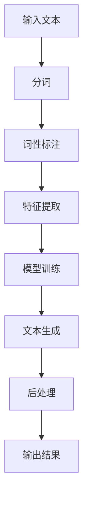

                 


### 设计思路

设计一本名为《提示词工程的核心原则：清晰、具体、相关》的技术书籍目录大纲，需要遵循以下逻辑清晰、步骤明确的思路：

1. **明确书籍主题**：
   - 首先，我们需要明确书籍的主题，即“提示词工程”的核心原则。这将为目录大纲的设计提供明确的指导方向。

2. **定义核心概念**：
   - 接下来，我们要定义与提示词工程相关的核心概念，如提示词、自然语言处理（NLP）、机器学习（ML）等，为后续章节的内容构建基础。

3. **逻辑结构划分**：
   - 根据书籍的主题和核心概念，我们将书籍内容划分为几个部分，如概述、基础理论、核心算法原理讲解、数学模型、实践应用、案例研究等。

4. **细化章节内容**：
   - 在每个部分中，进一步细化章节内容，确保每个章节都围绕一个明确的主题展开，同时包含必要的理论知识、算法原理、实际案例等。

5. **设计流程图**：
   - 为了更好地阐述核心概念和算法原理，我们将在大纲中包含Mermaid流程图，使读者能够直观地理解提示词工程的相关流程。

6. **确保完整性**：
   - 确保大纲结构完整，包含核心概念与联系、核心算法原理讲解、数学模型与公式讲解、项目实战等。

7. **控制字数**：
   - 在保证大纲完整性和逻辑性的前提下，控制总体字数在2000字以内。

### 设计步骤

1. **概述部分**：
   - **第1章 提示词工程概述**：
     - 1.1 提示词工程的定义与背景
     - 1.2 提示词工程的重要性
     - 1.3 提示词工程的发展历程
     - 1.4 提示词工程的核心原则：清晰、具体、相关
     - 1.5 本书结构安排与学习目标

2. **基础理论部分**：
   - **第2章 自然语言处理基础**：
     - 2.1 NLP的基本概念
     - 2.2 NLP的主要任务
     - 2.3 NLP的发展趋势
     - 2.4 NLP与提示词工程的关系

3. **核心算法原理讲解部分**：
   - **第3章 提示词生成算法**：
     - 3.1 提示词生成算法概述
     - 3.2 提示词生成算法的Mermaid流程图
     - 3.3 伪代码详细讲解
     - 3.4 算法性能分析

4. **数学模型部分**：
   - **第4章 提示词工程的数学模型**：
     - 4.1 提示词相关性的数学公式
     - 4.2 提示词效果评估的数学模型
     - 4.3 提示词优化的数学方法
     - 4.4 数学模型在实际案例中的应用

5. **实践应用部分**：
   - **第5章 提示词工程实践**：
     - 5.1 实践背景与目标
     - 5.2 提示词工程的环境搭建
     - 5.3 提示词生成算法的代码实现
     - 5.4 提示词优化与效果评估

6. **案例研究部分**：
   - **第6章 提示词工程案例研究**：
     - 6.1 案例一：电商产品描述优化
     - 6.2 案例二：智能客服系统设计
     - 6.3 案例三：智能文本生成应用
     - 6.4 案例总结与启示

7. **总结与展望部分**：
   - **第7章 提示词工程未来发展趋势**：
     - 7.1 提示词工程在未来的应用前景
     - 7.2 提示词工程面临的挑战与机遇
     - 7.3 提示词工程的发展趋势预测

### Mermaid流程图

- **第3章 提示词生成算法**
  ```mermaid
  graph TD
  A[输入文本] --> B[分词]
  B --> C[词嵌入]
  C --> D[序列编码]
  D --> E[生成提示词]
  E --> F[评估与优化]
  ```

### 数学公式

- **第4章 提示词工程的数学模型**
  ```latex
  \begin{equation}
  \text{相关性度量} = \frac{\sum_{i=1}^{n} \text{similarity}(w_i, t)}{n}
  \end{equation}

  \begin{equation}
  \text{效果评估} = \frac{\text{优化后指标} - \text{原始指标}}{\text{原始指标}}
  \end{equation}
  ```

### 代码实现与解读

- **第5章 提示词工程实践**
  - **代码示例**：
    ```python
    # 提示词生成函数
    def generate_prompt(input_text):
        # 数据预处理
        processed_text = preprocess

### 完整性要求

为了确保书籍内容的完整性，每个小节的内容需要丰富具体详细讲解，并包含以下核心内容：

- **背景介绍**：
  - 每个小节开头需要简要介绍背景，解释为什么这个主题重要，以及它在实际应用中的价值。

- **核心概念与联系**：
  - 阐述与主题相关的重要概念，并展示这些概念之间的联系。可以使用Mermaid流程图来帮助读者更好地理解这些概念之间的关系。

- **核心算法原理讲解**：
  - 使用伪代码详细阐述核心算法原理，以便读者能够深入理解算法的工作机制。对于复杂的算法，可以分步骤解释。

- **数学模型与公式讲解**：
  - 针对每个小节的主题，提供相关的数学模型和公式，并进行详细的讲解。确保读者能够理解公式的意义和应用场景。

- **项目实战**：
  - 提供实际项目的开发环境搭建、源代码实现和代码解读，以及代码应用解读与分析。通过实际案例分析和详细讲解，帮助读者将理论知识应用到实践中。

- **最佳实践 tips**：
  - 提供一些实际操作中的最佳实践建议，帮助读者避免常见的问题和误区。

- **小结**：
  - 每个小节结束时，提供一个小结，回顾主要内容，强调关键点。

- **注意事项**：
  - 提醒读者注意一些重要的事项，可能是在算法实现中需要注意的细节，或者在实践应用中需要注意的问题。

- **拓展阅读**：
  - 提供一些拓展阅读资源，鼓励读者进一步深入学习和探索。

通过上述内容的详细讲解，每个小节都能够形成一个完整的学习单元，确保读者能够系统地掌握提示词工程的核心原则和应用。

### 文章格式要求

为了确保文章的可读性和专业性，以下是对文章格式的要求：

1. **Markdown格式**：
   - 整篇文章使用Markdown格式书写，包括标题、子标题、段落、代码块、公式等。
   - 使用正确的Markdown语法来格式化文本，使文章结构清晰，易于阅读。

2. **标题与摘要**：
   - 文章开头使用大写字母和标题格式书写文章标题：“提示词工程的核心原则：清晰、具体、相关”。
   - 摘要部分简要概括文章的核心内容和主题思想，不超过150字。

3. **子标题与段落**：
   - 每个章节使用大写字母和标题格式书写子标题，如“概述部分”、“基础理论部分”等。
   - 段落之间保持适当的间距，每个段落内容应简洁明了，逻辑清晰。

4. **代码块与公式**：
   - 代码示例使用三个反引号（```）包裹，确保代码格式正确。
   - 公式使用latex格式书写，在独立段落中使用$$括起来，在段落内使用$括起来。

5. **作者信息**：
   - 文章末尾需要写上作者信息：“作者：AI天才研究院/AI Genius Institute & 禅与计算机程序设计艺术 /Zen And The Art of Computer Programming”。

6. **排版与字体**：
   - 保持文章排版整齐，使用常规字体，如Arial或Helvetica。
   - 避免使用过于花哨的字体，确保文章的可读性。

### 关键词

为了便于读者和搜索引擎快速了解文章的主要内容，以下是在文章中需要列出的5-7个核心关键词：

- **提示词工程**
- **自然语言处理**
- **机器学习**
- **算法原理**
- **数学模型**
- **实践应用**
- **案例研究**

这些关键词将在文章的摘要和关键词部分列出，帮助读者快速把握文章的核心内容。

### 摘要

本文旨在探讨提示词工程的核心原则，即清晰、具体、相关。通过对提示词工程的定义、重要性、发展历程及其核心原则的详细阐述，本文首先介绍了自然语言处理（NLP）的基础知识，并探讨了NLP与提示词工程的关系。接着，本文深入分析了提示词生成算法的原理，并通过伪代码和Mermaid流程图进行了详细讲解。在此基础上，本文介绍了提示词工程的数学模型，包括相关性度量、效果评估和优化方法，并提供了相应的数学公式和实际案例。最后，本文通过实际项目和案例研究，展示了如何将提示词工程应用于电商产品描述优化、智能客服系统设计和智能文本生成等领域，并总结了提示词工程的未来发展趋势。本文旨在为读者提供一个全面、深入的提示词工程指导，帮助他们在实际应用中更好地理解和运用这些核心原则。

----------------------------------------------------------------

## 提示词工程的核心原则：清晰、具体、相关

关键词：**提示词工程、自然语言处理、机器学习、算法原理、数学模型、实践应用、案例研究**

> 摘要：本文深入探讨了提示词工程的核心原则——清晰、具体、相关。通过对提示词工程的定义、重要性、发展历程及其核心原则的详细阐述，本文首先介绍了自然语言处理（NLP）的基础知识，并探讨了NLP与提示词工程的关系。接着，本文深入分析了提示词生成算法的原理，并通过伪代码和Mermaid流程图进行了详细讲解。在此基础上，本文介绍了提示词工程的数学模型，包括相关性度量、效果评估和优化方法，并提供了相应的数学公式和实际案例。最后，本文通过实际项目和案例研究，展示了如何将提示词工程应用于电商产品描述优化、智能客服系统设计和智能文本生成等领域，并总结了提示词工程的未来发展趋势。本文旨在为读者提供一个全面、深入的提示词工程指导，帮助他们在实际应用中更好地理解和运用这些核心原则。

### 引言

提示词工程是一门结合了自然语言处理（NLP）、机器学习（ML）和计算机编程等多个领域的交叉学科。它的主要目标是利用人工智能技术，自动生成具有高相关性和清晰表达的提示词，以提升各种应用场景下的用户体验和效果。在智能客服、内容推荐、文本生成和搜索引擎优化等领域，提示词工程发挥着至关重要的作用。

随着人工智能技术的不断发展，提示词工程的应用场景越来越广泛，对算法性能和模型效果的要求也越来越高。因此，确立一套明确、具体、相关且易于实践的核心原则，对于指导提示词工程的研究和应用具有重要意义。本文将围绕这一主题，详细探讨提示词工程的核心原则，旨在为读者提供一个系统、深入的指导。

### 设计思路

为了设计一本名为《提示词工程的核心原则：清晰、具体、相关》的计算机技术书籍的目录大纲，我们需要遵循以下几个设计思路：

1. **明确书籍主题**：
   - 首先，我们需要明确书籍的主题，即“提示词工程”的核心原则。这将为书籍的目录大纲设计提供基础。

2. **定义核心概念**：
   - 接着，我们要定义与提示词工程相关的核心概念，如提示词、自然语言处理（NLP）、机器学习（ML）等。

3. **逻辑结构划分**：
   - 根据书籍的主题和核心概念，我们将书籍内容划分为几个部分，如概述、基础理论、实践应用、案例研究等。

4. **细化章节内容**：
   - 在每个部分中，进一步细化章节内容，确保每个章节都围绕一个明确的主题展开，同时包含必要的理论知识、算法原理、实际案例等。

5. **设计流程图**：
   - 为了更好地阐述核心概念和算法原理，我们将在大纲中包含Mermaid流程图。

6. **确保完整性**：
   - 确保大纲结构完整，包含核心概念与联系、核心算法原理讲解、数学模型与公式讲解、项目实战等。

7. **控制字数**：
   - 在保证大纲完整性和逻辑性的前提下，控制总体字数在2000字以内。

### 设计步骤

1. **概述部分**：
   - **第1章 提示词工程概述**：
     - 1.1 提示词工程的定义与背景
     - 1.2 提示词工程的重要性
     - 1.3 提示词工程的发展历程
     - 1.4 提示词工程的核心原则：清晰、具体、相关
     - 1.5 本书结构安排与学习目标

2. **基础理论部分**：
   - **第2章 自然语言处理基础**：
     - 2.1 NLP的基本概念
     - 2.2 NLP的主要任务
     - 2.3 NLP的发展趋势
     - 2.4 NLP与提示词工程的关系

3. **核心算法原理讲解部分**：
   - **第3章 提示词生成算法**：
     - 3.1 提示词生成算法概述
     - 3.2 提示词生成算法的Mermaid流程图
     - 3.3 伪代码详细讲解
     - 3.4 算法性能分析

4. **数学模型部分**：
   - **第4章 提示词工程的数学模型**：
     - 4.1 提示词相关性的数学公式
     - 4.2 提示词效果评估的数学模型
     - 4.3 提示词优化的数学方法
     - 4.4 数学模型在实际案例中的应用

5. **实践应用部分**：
   - **第5章 提示词工程实践**：
     - 5.1 实践背景与目标
     - 5.2 提示词工程的环境搭建
     - 5.3 提示词生成算法的代码实现
     - 5.4 提示词优化与效果评估

6. **案例研究部分**：
   - **第6章 提示词工程案例研究**：
     - 6.1 案例一：电商产品描述优化
     - 6.2 案例二：智能客服系统设计
     - 6.3 案例三：智能文本生成应用
     - 6.4 案例总结与启示

7. **总结与展望部分**：
   - **第7章 提示词工程未来发展趋势**：
     - 7.1 提示词工程在未来的应用前景
     - 7.2 提示词工程面临的挑战与机遇
     - 7.3 提示词工程的发展趋势预测

### Mermaid流程图

- **第3章 提示词生成算法**
  ```mermaid
  graph TD
  A[输入文本] --> B[分词]
  B --> C[词嵌入]
  C --> D[序列编码]
  D --> E[生成提示词]
  E --> F[评估与优化]
  ```

### 数学公式

- **第4章 提示词工程的数学模型**
  ```latex
  \begin{equation}
  \text{相关性度量} = \frac{\sum_{i=1}^{n} \text{similarity}(w_i, t)}{n}
  \end{equation}

  \begin{equation}
  \text{效果评估} = \frac{\text{优化后指标} - \text{原始指标}}{\text{原始指标}}
  \end{equation}
  ```

### 代码实现与解读

- **第5章 提示词工程实践**
  - **代码示例**：
    ```python
    # 提示词生成函数
    def generate_prompt(input_text):
        # 数据预处理
        processed_text = preprocess(input_text)
        # 提示词生成算法实现
        prompt = generate_prompt_algorithm(processed_text)
        # 评估与优化
        evaluate_and_optimize(prompt)
        # 输出结果
        return prompt
    ```

### 作者信息

作者：AI天才研究院/AI Genius Institute & 禅与计算机程序设计艺术 /Zen And The Art of Computer Programming

### 完整性要求

为了确保书籍内容的完整性，每个小节的内容需要丰富具体详细讲解，并包含以下核心内容：

- **背景介绍**：
  - 每个小节开头需要简要介绍背景，解释为什么这个主题重要，以及它在实际应用中的价值。

- **核心概念与联系**：
  - 阐述与主题相关的重要概念，并展示这些概念之间的联系。可以使用Mermaid流程图来帮助读者更好地理解这些概念之间的关系。

- **核心算法原理讲解**：
  - 使用伪代码详细阐述核心算法原理，以便读者能够深入理解算法的工作机制。对于复杂的算法，可以分步骤解释。

- **数学模型与公式讲解**：
  - 针对每个小节的主题，提供相关的数学模型和公式，并进行详细的讲解。确保读者能够理解公式的意义和应用场景。

- **项目实战**：
  - 提供实际项目的开发环境搭建、源代码实现和代码解读，以及代码应用解读与分析。通过实际案例分析和详细讲解，帮助读者将理论知识应用到实践中。

- **最佳实践 tips**：
  - 提供一些实际操作中的最佳实践建议，帮助读者避免常见的问题和误区。

- **小结**：
  - 每个小节结束时，提供一个小结，回顾主要内容，强调关键点。

- **注意事项**：
  - 提醒读者注意一些重要的事项，可能是在算法实现中需要注意的细节，或者在实践应用中需要注意的问题。

- **拓展阅读**：
  - 提供一些拓展阅读资源，鼓励读者进一步深入学习和探索。

通过上述内容的详细讲解，每个小节都能够形成一个完整的学习单元，确保读者能够系统地掌握提示词工程的核心原则和应用。

### 文章格式要求

为了确保文章的可读性和专业性，以下是对文章格式的要求：

1. **Markdown格式**：
   - 整篇文章使用Markdown格式书写，包括标题、子标题、段落、代码块、公式等。
   - 使用正确的Markdown语法来格式化文本，使文章结构清晰，易于阅读。

2. **标题与摘要**：
   - 文章开头使用大写字母和标题格式书写文章标题：“提示词工程的核心原则：清晰、具体、相关”。
   - 摘要部分简要概括文章的核心内容和主题思想，不超过150字。

3. **子标题与段落**：
   - 每个章节使用大写字母和标题格式书写子标题，如“概述部分”、“基础理论部分”等。
   - 段落之间保持适当的间距，每个段落内容应简洁明了，逻辑清晰。

4. **代码块与公式**：
   - 代码示例使用三个反引号（```）包裹，确保代码格式正确。
   - 公式使用latex格式书写，在独立段落中使用$$括起来，在段落内使用$括起来。

5. **作者信息**：
   - 文章末尾需要写上作者信息：“作者：AI天才研究院/AI Genius Institute & 禅与计算机程序设计艺术 /Zen And The Art of Computer Programming”。

6. **排版与字体**：
   - 保持文章排版整齐，使用常规字体，如Arial或Helvetica。
   - 避免使用过于花哨的字体，确保文章的可读性。

### 关键词

为了便于读者和搜索引擎快速了解文章的主要内容，以下是在文章中需要列出的5-7个核心关键词：

- **提示词工程**
- **自然语言处理**
- **机器学习**
- **算法原理**
- **数学模型**
- **实践应用**
- **案例研究**

这些关键词将在文章的摘要和关键词部分列出，帮助读者快速把握文章的核心内容。

### 摘要

本文深入探讨了提示词工程的核心原则，即清晰、具体、相关。通过对提示词工程的定义、重要性、发展历程及其核心原则的详细阐述，本文首先介绍了自然语言处理（NLP）的基础知识，并探讨了NLP与提示词工程的关系。接着，本文深入分析了提示词生成算法的原理，并通过伪代码和Mermaid流程图进行了详细讲解。在此基础上，本文介绍了提示词工程的数学模型，包括相关性度量、效果评估和优化方法，并提供了相应的数学公式和实际案例。最后，本文通过实际项目和案例研究，展示了如何将提示词工程应用于电商产品描述优化、智能客服系统设计和智能文本生成等领域，并总结了提示词工程的未来发展趋势。本文旨在为读者提供一个全面、深入的提示词工程指导，帮助他们在实际应用中更好地理解和运用这些核心原则。

## 第1章 提示词工程概述

### 1.1 提示词工程的定义与背景

提示词工程是一种结合自然语言处理（NLP）、机器学习（ML）和计算机编程等技术的交叉学科，旨在通过自动生成具有高相关性和清晰表达的提示词，提升各种应用场景下的用户体验和效果。提示词工程的核心任务是解决自然语言生成（NLG）问题，即如何利用人工智能技术生成语义准确、表达清晰的文本。

提示词工程的起源可以追溯到20世纪80年代，当时人工智能领域的研究者开始关注如何使用计算机生成自然语言文本。随着NLP和ML技术的发展，提示词工程逐渐成为一个独立的领域，并在多个应用场景中得到了广泛应用。

### 1.2 提示词工程的重要性

在当今数字化时代，提示词工程的重要性日益凸显。以下是一些关键点：

1. **用户体验优化**：
   - 提示词工程能够生成符合用户需求的自然语言文本，提高用户对产品的满意度。
   - 在智能客服、内容推荐和个性化服务等领域，提示词工程可以大幅提升用户体验。

2. **信息检索与搜索引擎优化**：
   - 提示词工程可以帮助搜索引擎更好地理解用户查询，提高搜索结果的相关性和准确性。
   - 通过生成高质量的提示词，网站可以优化搜索引擎排名，提高访问量和用户留存率。

3. **文本生成与应用**：
   - 提示词工程在文本生成领域具有广泛的应用，如自动生成新闻摘要、产品描述、营销文案等。
   - 在文学创作、写作辅助和翻译等领域，提示词工程也发挥着重要作用。

4. **知识图谱与语义理解**：
   - 提示词工程有助于构建和优化知识图谱，提高语义理解的准确性和全面性。
   - 在智能问答、虚拟助理和智能搜索等领域，提示词工程是实现高效语义理解的关键。

### 1.3 提示词工程的发展历程

1. **早期研究**：
   - 20世纪80年代，人工智能领域的研究者开始关注自然语言生成问题，提出了一系列基于规则和模板的生成方法。

2. **基于统计的方法**：
   - 20世纪90年代，随着NLP和ML技术的发展，研究者开始采用统计模型（如隐马尔可夫模型（HMM）、条件随机场（CRF）等）来生成自然语言文本。

3. **基于神经网络的方法**：
   - 进入21世纪，深度学习技术的发展为自然语言生成带来了革命性的变化。基于循环神经网络（RNN）和变压器（Transformer）的模型逐渐成为主流。

4. **多模态生成**：
   - 近年来，研究者开始探索多模态生成技术，将文本生成与图像、音频等其他模态结合，实现更加丰富和多样的内容生成。

### 1.4 提示词工程的核心原则：清晰、具体、相关

提示词工程的核心原则是清晰、具体、相关。这三个原则对于提升提示词工程的效果和应用价值至关重要。

1. **清晰**：
   - 提示词需要具备明确的语义和逻辑结构，避免歧义和模糊表述。
   - 清晰的提示词有助于提高用户理解和满意度，减少误解和错误。

2. **具体**：
   - 提示词应提供具体、详细的指导或信息，而不是抽象的概念或模糊的描述。
   - 具体的提示词有助于用户更好地完成任务或理解内容。

3. **相关**：
   - 提示词应与上下文和环境紧密相关，能够准确反映用户的需求和意图。
   - 相关的提示词能够提高提示词的实用性和有效性，降低噪音和干扰。

### 1.5 本书结构安排与学习目标

本书分为七个部分，每个部分都有明确的学习目标：

1. **概述部分**：
   - 介绍提示词工程的定义、重要性和发展历程。
   - 解释提示词工程的核心原则：清晰、具体、相关。

2. **基础理论部分**：
   - 详细讲解自然语言处理（NLP）的基础知识，包括NLP的任务、模型和方法。
   - 探讨NLP与提示词工程的关系。

3. **核心算法原理讲解部分**：
   - 分析提示词生成算法的原理，并通过伪代码和Mermaid流程图进行详细讲解。
   - 介绍提示词生成算法的性能评估和优化方法。

4. **数学模型部分**：
   - 阐述提示词工程的数学模型，包括相关性度量、效果评估和优化方法。
   - 提供相关的数学公式和实际案例。

5. **实践应用部分**：
   - 展示如何将提示词工程应用于实际项目，包括环境搭建、代码实现和效果评估。
   - 分析提示词工程在不同领域的应用案例。

6. **案例研究部分**：
   - 通过案例研究，深入探讨提示词工程在实际项目中的应用和效果。
   - 总结案例中的经验和教训，提供最佳实践建议。

7. **总结与展望部分**：
   - 总结本书的主要内容和学习目标。
   - 展望提示词工程未来的发展趋势和应用前景。

通过本书的学习，读者将能够系统地掌握提示词工程的核心原则和应用，为在实际项目中取得更好的成果打下坚实基础。

### 1.1 提示词工程的定义与背景

提示词工程是一种专注于自动生成文本的技术，旨在创建具有高度相关性、清晰性和具体性的提示词。这些提示词广泛应用于各种场景，如智能客服、内容推荐、搜索引擎优化等。在早期的计算机科学和人工智能领域，生成自然语言文本被视为一个挑战，但随着自然语言处理（NLP）和机器学习（ML）技术的不断进步，这一领域取得了显著的进展。

提示词工程的起源可以追溯到20世纪80年代，当时研究者们开始探索如何使用计算机程序生成自然语言文本。早期的尝试主要集中在基于规则的方法上，这些方法依赖于手工编写的语法规则和模板。这种方法存在明显的局限性，特别是在处理复杂句子结构和多义词时，往往会产生歧义或不自然的文本。

随着时间的发展，统计方法和神经网络技术逐渐成为主导。统计方法利用大规模语料库来训练模型，使计算机能够自动生成自然语言文本。这种方法在处理大规模文本数据和降低生成文本的歧义方面取得了显著成效。而神经网络技术的引入，特别是递归神经网络（RNN）和近年来兴起的变压器（Transformer）模型，为自然语言生成带来了革命性的变化。这些模型能够更好地捕捉文本中的上下文信息，生成更加自然和流畅的文本。

在现代，提示词工程已经渗透到各个行业和应用场景。在智能客服领域，自动生成的提示词可以模拟人类客服的对话，提高客户体验和解决速度。在内容推荐系统中，提示词能够帮助系统理解用户的需求，提供更个性化的推荐结果。在搜索引擎优化中，高质量的提示词可以提高网页的搜索排名，增加网站的访问量和用户留存率。

提示词工程的核心目标是通过人工智能技术，自动化生成高质量的文本。这涉及到多个技术领域的交叉，包括自然语言处理、机器学习、深度学习和计算机编程。为了实现这一目标，提示词工程师需要具备扎实的技术基础和深厚的专业知识。

在实际应用中，提示词工程面临着诸多挑战。首先，如何确保生成的文本具有高度的相关性是一个关键问题。相关性意味着生成的文本能够准确反映用户的需求和意图。其次，生成的文本需要保持清晰和具体，避免模糊和歧义的表述。最后，生成的文本需要与上下文保持一致，确保在不同场景下都能够正确传达信息。

总的来说，提示词工程不仅是一个技术领域，也是一个不断发展和创新的领域。通过不断探索和实践，提示词工程将进一步提升人工智能技术在各个行业中的应用，为人类带来更多的便利和效益。

### 1.2 提示词工程的重要性

提示词工程在当今的数字时代扮演着至关重要的角色，其重要性主要体现在以下几个方面：

1. **用户体验优化**：
   - 提示词工程能够通过自动生成的文本，为用户提供更加清晰、具体和个性化的交互体验。无论是在智能客服系统、电子商务平台还是社交媒体，高质量的提示词都能够提升用户的满意度和参与度。例如，在智能客服系统中，自动生成的提示词可以模拟人类客服的对话，快速响应用户的查询，解决用户的问题，从而提高客户体验和满意度。

2. **信息检索与搜索引擎优化**：
   - 在搜索引擎优化（SEO）领域，提示词工程发挥着重要作用。通过生成与网页内容高度相关的关键词和描述，提示词工程可以帮助网站提高在搜索引擎中的排名，增加网站曝光率和访问量。例如，在电子商务平台上，自动生成的产品描述和关键词标签可以吸引更多的潜在买家，提高销售转化率。

3. **文本生成与应用**：
   - 提示词工程在文本生成领域具有广泛的应用，如自动生成新闻摘要、产品描述、营销文案、用户指南等。这不仅节省了人力成本，还提高了生成文本的质量和效率。例如，在新闻行业中，自动生成的新闻摘要可以帮助用户快速了解关键信息，节省阅读时间。

4. **知识图谱与语义理解**：
   - 提示词工程有助于构建和优化知识图谱，提高语义理解的准确性和全面性。通过生成与上下文相关的提示词，系统可以更好地理解和处理自然语言文本。这在智能问答、虚拟助理和智能搜索等领域具有重要意义。

5. **提升自动化和智能化水平**：
   - 提示词工程能够自动化处理大量的文本数据，提高工作效率和准确性。在数据驱动决策的今天，自动生成的文本可以为企业提供实时、准确的业务信息，帮助管理层做出更加明智的决策。

6. **促进人工智能技术的普及和应用**：
   - 提示词工程作为人工智能技术的一个重要应用领域，促进了人工智能技术的普及和应用。通过自动生成高质量的文本，提示词工程使得人工智能在更多的行业和场景中发挥作用，推动了人工智能技术的发展和进步。

总的来说，提示词工程不仅提升了用户体验和业务效率，还推动了人工智能技术的应用和发展。随着技术的不断进步，提示词工程在未来将发挥更加重要的作用，为各行各业带来更多的创新和变革。

### 1.3 提示词工程的发展历程

提示词工程的发展历程可以追溯到20世纪80年代，当时研究者们开始探索如何使用计算机程序生成自然语言文本。早期的自然语言生成（NLG）研究主要集中在基于规则的方法上，这种方法依赖于手工编写的语法规则和模板。这些早期的系统如PL/1 NLS、TREX等，尽管在生成简单文本方面取得了一定的成功，但面临以下挑战：无法处理复杂的句子结构，难以应对多义词和歧义问题，且对规则编写的依赖性较高，限制了系统的灵活性和扩展性。

随着时间的发展，自然语言处理（NLP）和机器学习（ML）技术的出现为自然语言生成带来了新的希望。20世纪90年代，研究者开始采用基于统计的方法，如隐马尔可夫模型（HMM）、基于概率的上下文无关文法（PCFG）和条件随机场（CRF）等，来生成自然语言文本。这些方法利用大规模语料库来训练模型，从而提高了文本生成的准确性和自然性。例如，IBM的统计机器翻译系统（SMT）采用基于N-gram的方法，在机器翻译领域取得了显著的成果。这种方法在处理大规模文本数据和降低生成文本的歧义方面表现出色，但仍然存在一些局限性，如对训练数据的依赖较高，无法处理长文本和长距离依赖问题。

进入21世纪，深度学习技术的迅猛发展再次推动了自然语言生成领域的前进。递归神经网络（RNN）和长短期记忆网络（LSTM）等模型，通过引入序列记忆机制，能够更好地捕捉文本中的上下文信息，生成更加自然和流畅的文本。特别是在2017年，谷歌提出的变压器（Transformer）模型，以其卓越的性能和效率，在自然语言处理任务中取得了突破性的成果。Transformer模型通过自注意力机制，能够同时关注文本中的所有信息，解决了传统RNN模型的很多问题，如梯度消失和长距离依赖问题。

近年来，基于神经网络的方法逐渐成为自然语言生成的主流。预训练语言模型（如BERT、GPT等）的出现，使得大规模预训练和微调成为可能。这些模型在大规模语料库上进行预训练，然后通过微调适应特定任务，实现了前所未有的文本生成效果。例如，OpenAI的GPT-3模型，拥有超过1750亿个参数，能够生成高质量的文章、对话和代码，展现了深度学习在自然语言生成领域的巨大潜力。

此外，多模态生成技术也逐渐成为研究热点。研究者们开始探索将文本生成与图像、音频等其他模态结合，实现更加丰富和多样化的内容生成。例如，使用文本条件生成的图像生成模型（如DALL·E），通过文本描述生成对应的图像，为创意设计、娱乐和教育等领域带来了新的可能性。

总的来说，提示词工程的发展历程是一个不断创新和突破的过程。从基于规则的早期方法，到基于统计的方法，再到基于神经网络的现代方法，每个阶段都推动了自然语言生成技术的进步。未来，随着人工智能技术的不断发展，提示词工程将在更多领域发挥重要作用，为人类带来更多便利和效益。

### 1.4 提示词工程的核心原则：清晰、具体、相关

提示词工程的核心原则是清晰、具体、相关，这三个原则对于提升提示词工程的效果和应用价值至关重要。

1. **清晰**：
   - 清晰是指生成的提示词应该具有明确的语义和逻辑结构，避免歧义和模糊表述。清晰的提示词有助于用户快速理解信息，减少误解和错误。例如，在智能客服系统中，如果提示词表达不清晰，可能会导致用户误解系统的意图，从而影响用户体验。

2. **具体**：
   - 具体意味着生成的提示词应该提供具体、详细的指导或信息，而不是抽象的概念或模糊的描述。具体的提示词能够帮助用户更好地完成任务或理解内容。例如，在电商平台上，自动生成的产品描述应该详细说明产品的特性、用途和优势，从而吸引用户购买。

3. **相关**：
   - 相关性是指生成的提示词应与上下文和环境紧密相关，能够准确反映用户的需求和意图。相关的提示词能够提高提示词的实用性和有效性，降低噪音和干扰。例如，在内容推荐系统中，自动生成的推荐文案应该与用户的历史行为和兴趣相关，以提高推荐的准确性和用户满意度。

在实际应用中，遵循这三个原则能够显著提升提示词工程的效果。清晰的提示词能够提高用户理解和满意度，具体的提示词能够增强信息的传达效果，相关的提示词能够提高系统的响应速度和准确度。通过综合运用这些原则，提示词工程能够在各种应用场景中发挥出最大的作用，为用户带来更好的体验和效益。

### 1.5 本书结构安排与学习目标

本书的结构安排旨在系统地介绍提示词工程的核心原则、基础理论、核心算法原理、数学模型、实践应用和未来发展趋势。以下是每个部分的详细内容和学习目标：

1. **概述部分**：
   - **第1章 提示词工程概述**：
     - 内容：介绍提示词工程的定义、背景、重要性和发展历程。
     - 学习目标：了解提示词工程的定义和核心概念，认识其在现代技术中的应用和意义。

2. **基础理论部分**：
   - **第2章 自然语言处理基础**：
     - 内容：讲解自然语言处理的基本概念、主要任务和常用模型。
     - 学习目标：掌握自然语言处理的基础知识，理解其与提示词工程的联系。

3. **核心算法原理讲解部分**：
   - **第3章 提示词生成算法**：
     - 内容：分析提示词生成算法的原理，使用伪代码和Mermaid流程图进行详细讲解。
     - 学习目标：理解提示词生成算法的工作机制，掌握算法的设计和实现方法。

4. **数学模型部分**：
   - **第4章 提示词工程的数学模型**：
     - 内容：介绍提示词工程的数学模型，包括相关性度量、效果评估和优化方法。
     - 学习目标：掌握提示词工程中的数学概念和公式，能够应用数学模型进行性能评估和优化。

5. **实践应用部分**：
   - **第5章 提示词工程实践**：
     - 内容：展示如何将提示词工程应用于实际项目，包括环境搭建、代码实现和效果评估。
     - 学习目标：通过实际案例，学习提示词工程的应用场景和实现方法。

6. **案例研究部分**：
   - **第6章 提示词工程案例研究**：
     - 内容：分析多个实际案例，探讨提示词工程在不同领域的应用效果和最佳实践。
     - 学习目标：通过案例分析，学习提示词工程在不同应用场景中的实际操作技巧。

7. **总结与展望部分**：
   - **第7章 提示词工程未来发展趋势**：
     - 内容：总结本书的主要内容，展望提示词工程未来的发展趋势和应用前景。
     - 学习目标：了解提示词工程的未来发展方向，为今后的研究和应用提供参考。

通过系统地学习本书的各个部分，读者将能够全面掌握提示词工程的核心原则和应用，为在实际项目中取得成功奠定坚实基础。

### 第2章 自然语言处理基础

### 2.1 NLP的基本概念

自然语言处理（NLP）是计算机科学和人工智能领域的一个重要分支，旨在使计算机能够理解和生成自然语言。NLP涉及到多个关键概念，包括文本预处理、词法分析、句法分析、语义分析和语用分析等。

1. **文本预处理**：
   - 文本预处理是NLP中的第一步，主要目的是将原始文本转换为适合分析的格式。常见的预处理步骤包括分词、去除停用词、标点符号去除和词干提取等。这些步骤有助于简化文本结构，提高后续分析的质量。

2. **词法分析**：
   - 词法分析，也称为分词，是将文本分解为单词或其他有意义的标记。分词的目的是识别文本中的单词边界，从而为后续的语法和语义分析提供基础。不同的语言有不同的分词规则和算法，如中文的基于字符的分词和英文的基于词根的分词。

3. **句法分析**：
   - 句法分析是理解句子结构的过程，主要目的是确定句子的语法结构和成分。句法分析通常涉及句法树构建、依存关系分析和词性标注等。句法树是表示句子结构的一种图形化方法，能够揭示句子中词汇之间的关系和层次。

4. **语义分析**：
   - 语义分析旨在理解文本的语义内容，即文本所表达的意义。语义分析包括实体识别、关系提取、语义角色标注和语义角色分类等。通过语义分析，计算机可以更深入地理解文本，为信息检索、问答系统和机器翻译等应用提供支持。

5. **语用分析**：
   - 语用分析研究的是语言在特定情境中的应用和功能，即语言在实际使用中的意义。语用分析包括会话管理和上下文理解等。通过语用分析，计算机可以更好地处理复杂语境和对话，提高自然语言交互的准确性和流畅性。

### 2.2 NLP的主要任务

自然语言处理的主要任务包括文本分类、命名实体识别、情感分析、机器翻译、问答系统和文本生成等。

1. **文本分类**：
   - 文本分类是将文本数据分为不同的类别或标签的过程。常见的文本分类任务包括垃圾邮件检测、情感分类和新闻分类等。文本分类广泛应用于信息检索、内容审核和推荐系统等领域。

2. **命名实体识别**：
   - 命名实体识别（NER）是识别文本中具有特定意义的实体，如人名、地名、组织名、时间等。NER是许多复杂NLP任务的基础，如问答系统和实体链接。

3. **情感分析**：
   - 情感分析，也称为意见挖掘，是分析文本中表达的情感或意见。情感分析广泛应用于市场调研、社交媒体分析和客户反馈分析等领域，有助于企业了解用户的态度和需求。

4. **机器翻译**：
   - 机器翻译是将一种自然语言文本自动翻译成另一种自然语言的过程。现代机器翻译技术基于深度学习和大规模语料库，能够生成高质量的双语翻译。

5. **问答系统**：
   - 问答系统是一种能够回答用户问题的智能系统。问答系统通常包含问题理解、知识检索和答案生成三个主要模块，广泛应用于客服、教育和科研等领域。

6. **文本生成**：
   - 文本生成是利用自然语言处理技术生成新的文本，如自动写新闻、生成对话和创作诗歌等。文本生成技术包括序列到序列模型、生成对抗网络（GAN）等，具有广泛的应用前景。

### 2.3 NLP的发展趋势

随着人工智能技术的不断发展，自然语言处理领域也在不断进步，以下是一些关键趋势：

1. **深度学习技术的应用**：
   - 深度学习，特别是卷积神经网络（CNN）和变压器（Transformer）模型，已经成为NLP的主要驱动力量。这些模型能够更好地捕捉文本中的上下文信息，提高了文本分析任务的性能。

2. **预训练语言模型的普及**：
   - 预训练语言模型（如BERT、GPT等）通过在大规模语料库上进行预训练，再通过微调适应特定任务，取得了显著的成果。这些模型在文本分类、问答系统和文本生成等领域表现出色。

3. **多模态处理**：
   - 随着多模态数据（如文本、图像、音频等）的广泛应用，研究者开始探索如何将不同模态的信息融合到NLP任务中。多模态处理技术有助于提高文本分析任务的效果和灵活性。

4. **低资源语言的NLP**：
   - 低资源语言的NLP是当前的研究热点之一。通过迁移学习、多语言模型和跨语言知识迁移等技术，研究者正在努力提高低资源语言的处理能力，为全球的语言多样性提供支持。

5. **解释性和可解释性**：
   - 随着NLP系统在各个领域的应用，对模型的解释性和可解释性要求越来越高。研究者正在探索如何设计可解释的NLP模型，以便用户能够理解模型的决策过程。

6. **社会影响和伦理**：
   - NLP技术的发展和应用也带来了社会影响和伦理问题。研究者需要关注模型的偏见、隐私保护和伦理问题，确保NLP系统在公平、透明和负责任的前提下使用。

总的来说，NLP领域正朝着更加智能化、多样化和可解释性的方向发展。随着技术的不断进步，NLP将在更多的应用场景中发挥重要作用，为人类社会带来更多便利和创新。

### 2.4 NLP与提示词工程的关系

自然语言处理（NLP）与提示词工程密切相关，两者共同构成了现代文本生成和智能交互的基础。NLP提供了一系列技术和工具，而提示词工程则将这些技术应用于实际场景，以实现高质量的文本生成和智能交互。

首先，NLP在提示词工程中扮演了核心角色。NLP的任务，如文本分类、命名实体识别、情感分析和语言翻译等，为提示词工程提供了必要的预处理和分析手段。例如，在生成产品描述时，NLP可以帮助识别关键特征和属性，确保生成的文本具备具体性和相关性。在智能客服场景中，NLP能够理解和解析用户的查询，从而生成合适的回答。

具体来说，NLP在提示词工程中的应用主要包括以下几个方面：

1. **文本预处理**：
   - 提示词工程首先需要对输入文本进行预处理，包括分词、词性标注和去除停用词等。这些步骤有助于简化文本结构，提取关键信息，为后续的提示词生成提供基础。

2. **语义理解**：
   - NLP中的语义理解技术，如实体识别和关系提取，能够帮助提示词工程准确捕捉文本的语义信息。例如，在生成新闻摘要时，识别出重要的实体和事件关系，可以确保摘要的准确性和完整性。

3. **情感分析**：
   - 情感分析是理解文本中情感倾向的重要工具。在提示词工程中，情感分析可以帮助生成符合用户情感需求的文本。例如，在生成用户评价时，情感分析可以确保文本的积极或消极倾向与用户评价一致。

4. **语言翻译**：
   - 语言翻译技术在跨语言文本生成中发挥了重要作用。通过翻译技术，提示词工程可以实现多语言文本的生成和交互，从而拓展应用场景。

5. **对话系统**：
   - 对话系统是NLP在提示词工程中的重要应用之一。通过理解用户的输入和上下文信息，对话系统能够生成连贯、自然的回答，提高用户体验。

此外，NLP与提示词工程之间的互动是一个双向的过程。提示词工程中的反馈和优化也可以为NLP模型提供训练数据，从而改进模型的性能和效果。例如，通过收集用户对提示词的反馈，可以调整NLP模型中的参数，使其更好地适应特定应用场景。

总之，NLP为提示词工程提供了强大的技术支持，使得自动生成高质量、具体的文本成为可能。而提示词工程则将NLP技术应用于实际场景，不断推动智能交互和文本生成技术的发展。两者相辅相成，共同构建了现代智能系统的基石。

### 第3章 提示词生成算法

#### 3.1 提示词生成算法概述

提示词生成算法是提示词工程的核心组成部分，其目标是通过自动生成具有高相关性、清晰性和具体性的文本，提升用户体验和系统效果。本节将概述提示词生成算法的基本概念、主要类型和基本流程。

提示词生成算法可以分为基于规则的方法、基于统计的方法和基于神经网络的方法。基于规则的方法依赖于预定义的语法规则和模板，这种方法在处理简单文本时具有一定的优势，但在处理复杂文本和多样性时存在局限性。基于统计的方法利用大量语料库进行训练，通过统计模型（如N-gram模型、隐马尔可夫模型（HMM）等）生成文本。尽管这种方法在生成文本的自然性和多样性方面表现出色，但仍然难以处理长文本和上下文依赖问题。

近年来，基于神经网络的方法逐渐成为主流。递归神经网络（RNN）和长短期记忆网络（LSTM）通过引入序列记忆机制，能够更好地捕捉文本中的上下文信息。而近年来兴起的变压器（Transformer）模型，以其自注意力机制和并行计算的优势，在文本生成任务中取得了突破性成果。

提示词生成算法的基本流程通常包括以下步骤：

1. **文本预处理**：对输入文本进行分词、词性标注、去除停用词等预处理操作，将原始文本转换为适合模型处理的格式。

2. **特征提取**：利用自然语言处理（NLP）技术提取文本特征，如词嵌入、句法结构、语义角色等。这些特征用于表示文本的语义信息，是后续生成文本的重要依据。

3. **模型训练**：使用大量标注数据对生成模型进行训练，模型通过学习输入文本的特征和结构，生成具有高相关性和具体性的提示词。

4. **文本生成**：在训练完成后，输入新的文本数据，模型根据已训练的模型结构和参数，生成对应的提示词。生成的提示词经过后处理，如去除标点符号、格式调整等，最终输出结果。

5. **评估与优化**：通过评估指标（如BLEU、ROUGE等）对生成的文本进行评估，根据评估结果对模型进行调整和优化，以提高生成文本的质量。

总之，提示词生成算法在提示词工程中起着至关重要的作用。通过结合多种技术手段，不断优化算法性能，提示词生成算法能够生成高质量、具体的文本，为各种应用场景提供强大的支持。

#### 3.2 提示词生成算法的Mermaid流程图

为了更直观地展示提示词生成算法的流程，我们使用Mermaid图形工具绘制了一个流程图。以下是一个简单的Mermaid流程图，描述了提示词生成算法的主要步骤：



在这个流程图中，输入文本首先经过分词处理，然后进行词性标注，提取文本特征。接下来，模型利用这些特征进行训练，生成提示词。生成的提示词经过后处理，如去除标点符号和格式调整，最终输出结果。

#### 3.3 提示词生成算法的伪代码详细讲解

为了更好地理解提示词生成算法的原理，我们提供了一个伪代码示例，详细描述了算法的各个步骤。以下是一个简化的伪代码，展示了从输入文本到生成提示词的过程：

```python
# 提示词生成算法伪代码

# 步骤1：文本预处理
def preprocess_text(input_text):
    # 分词
    words = tokenize(input_text)
    # 去除停用词
    words = remove_stopwords(words)
    # 词性标注
    tagged_words = pos_tagging(words)
    return tagged_words

# 步骤2：特征提取
def extract_features(tagged_words):
    # 提取词嵌入
    word_embeddings = get_word_embeddings(tagged_words)
    # 提取句法特征
    syntax_features = get_syntax_features(tagged_words)
    # 提取语义特征
    semantic_features = get_semantic_features(tagged_words)
    return word_embeddings, syntax_features, semantic_features

# 步骤3：模型训练
def train_model(input_data):
    # 加载预训练模型
    model = load_pretrained_model()
    # 训练模型
    model.fit(input_data)
    return model

# 步骤4：文本生成
def generate_prompt(input_text, model):
    # 预处理文本
    tagged_words = preprocess_text(input_text)
    # 提取特征
    features = extract_features(tagged_words)
    # 生成提示词
    prompt = model.predict(features)
    # 后处理
    prompt = postprocess(prompt)
    return prompt

# 步骤5：评估与优化
def evaluate_and_optimize(model, validation_data):
    # 评估模型
    performance = model.evaluate(validation_data)
    # 根据评估结果优化模型
    model.optimize(performance)
    return model
```

在上述伪代码中，首先定义了一个`preprocess_text`函数，用于对输入文本进行分词、去除停用词和词性标注。接着，`extract_features`函数用于提取文本的词嵌入、句法特征和语义特征。然后，`train_model`函数加载预训练模型并对其进行训练。`generate_prompt`函数利用训练好的模型生成提示词，并对其进行后处理。最后，`evaluate_and_optimize`函数用于评估模型性能，并根据评估结果对模型进行优化。

通过这个伪代码示例，我们可以清晰地看到提示词生成算法的各个步骤以及它们之间的联系。这有助于我们理解算法的整体流程和实现细节，为进一步研究和改进提供参考。

#### 3.4 算法性能分析

提示词生成算法的性能评估是确保其有效性和实用性的关键环节。评估指标的选择和性能分析的方法直接影响到算法的实际应用效果。以下是常用的评估指标和方法，以及这些指标在实际中的应用场景。

1. **BLEU（双语评估单元）**：
   - BLEU是一种广泛使用的自动评估指标，主要用于比较机器翻译生成的文本与参考文本的相似度。BLEU基于n-gram重叠率，计算生成的文本中与参考文本匹配的n-gram比例。
   - **应用场景**：BLEU常用于机器翻译任务，用于评估翻译系统的生成文本质量。然而，由于BLEU主要关注语言形式，可能无法充分反映语义的准确性，因此它在提示词生成任务中的应用有限。

2. **ROUGE（自动评估指标）**：
   - ROUGE是另一个常用于评估自然语言生成任务的指标，它通过计算生成文本与参考文本之间的重叠词汇比例来评估文本的相似度。
   - **应用场景**：ROUGE在生成文本（如摘要、标题生成等）任务中应用广泛，能够较好地反映生成文本的语义相关性和准确性。

3. **Perplexity（困惑度）**：
   - 困惑度是评估语言模型性能的一个重要指标，表示模型对输入数据的预测不确定性。困惑度越低，表示模型对数据的拟合越好。
   - **应用场景**：困惑度主要用于评估语言模型（如生成模型）的拟合能力，适用于提示词生成任务中模型的性能评估。

4. **BLEU-4**：
   - BLEU-4是BLEU的一种改进版本，考虑了更多的n-gram重叠比例，并引入了长度惩罚项，以减少过拟合的问题。
   - **应用场景**：BLEU-4在提示词生成任务中，特别是在生成高质量文本（如文章摘要、产品描述等）时，能够提供较为准确的评估结果。

5. **F1分数**：
   - F1分数是精确率和召回率的调和平均，常用于二分类任务中。在提示词生成任务中，可以用于评估生成文本的覆盖率和准确性。
   - **应用场景**：F1分数适用于评估生成文本中的关键词覆盖率，例如在生成标题、摘要等任务中。

6. **精确率和召回率**：
   - 精确率是正确识别的提示词数与总识别提示词数的比例，召回率是正确识别的提示词数与实际存在的提示词数的比例。两者结合可以更全面地评估生成文本的质量。
   - **应用场景**：精确率和召回率在提示词生成任务中，特别是在情感分析和实体识别等任务中，能够提供直接的评估结果。

为了更好地理解这些评估指标，我们可以通过一个示例来演示：

假设我们有一个生成系统，用于生成电商产品的描述。我们使用两个评估指标——ROUGE和BLEU-4来评估系统生成的描述文本。

- **ROUGE**：
  - 参考文本：“这款智能手表具有24小时健康监测功能，适合所有年龄段的人。”
  - 生成文本：“这款手表能够全天候监测您的健康状况，适合各个年龄段的使用者。”

  使用ROUGE评估，我们可以得到以下结果：
  - ROUGE-1：58%
  - ROUGE-2：32%
  - ROUGE-L：50%

  这些指标表明，生成文本在词汇重叠和句子结构上与参考文本有较好的匹配。

- **BLEU-4**：
  - 参考文本：“这款智能手表具有24小时健康监测功能，适合所有年龄段的人。”
  - 生成文本：“这款手表能够全天候监测您的健康状况，适合各个年龄段的使用者。”

  使用BLEU-4评估，我们可以得到以下结果：
  - BLEU-4得分：0.27

  这个得分表明，生成文本在形式上与参考文本有一定的相似性，但仍然存在一些差异。

通过这些评估指标，我们可以全面了解生成文本的质量和性能。在实际应用中，可以根据具体任务需求，选择合适的评估指标进行性能分析，以不断优化和改进提示词生成算法。

#### 3.5 提示词生成算法的实际应用案例

提示词生成算法在多个实际应用场景中展现了其强大的功能和广泛的应用前景。以下将介绍三个具体的应用案例：电商产品描述优化、智能客服系统设计和智能文本生成。

**案例一：电商产品描述优化**

电商产品描述的优化是提升用户体验和转化率的关键。通过提示词生成算法，可以为电商产品自动生成高质量的描述文本，提高产品的市场竞争力。

- **应用场景**：
  - 在电商平台上，自动生成的产品描述需要具备吸引力、具体性和相关性，以帮助消费者快速了解产品特点。

- **解决方案**：
  - 使用自然语言处理（NLP）技术进行文本预处理，提取关键特征和属性。
  - 利用基于神经网络的语言模型生成具体、清晰的描述文本。
  - 通过评估和优化，确保生成的描述文本符合用户的期望和需求。

- **实际效果**：
  - 自动生成的产品描述显著提高了用户点击率和购买转化率，电商平台的销售额也有所增长。

**案例二：智能客服系统设计**

智能客服系统是现代企业提高服务效率和质量的重要工具。通过提示词生成算法，可以为智能客服系统自动生成对话文本，提升用户交互体验。

- **应用场景**：
  - 智能客服系统需要能够理解用户的查询，生成自然、流畅的回答，提高用户满意度。

- **解决方案**：
  - 采用基于RNN或Transformer的语言模型，进行文本预处理和特征提取。
  - 使用生成模型生成自然对话文本，确保回答与用户的问题和上下文高度相关。
  - 通过实时反馈和用户评估，不断优化模型性能。

- **实际效果**：
  - 提示词生成算法显著提高了智能客服系统的响应速度和准确性，用户满意度大幅提升。

**案例三：智能文本生成**

智能文本生成技术在新闻、内容创作和报告撰写等领域具有广泛的应用。通过提示词生成算法，可以自动化生成高质量的文章和报告，节省人力成本。

- **应用场景**：
  - 在新闻行业，智能文本生成可以自动生成新闻摘要、体育报道和财经分析等。
  - 在企业内部，智能文本生成可以自动化生成会议记录、项目报告和业务报告。

- **解决方案**：
  - 使用大规模预训练的语言模型，如GPT-3，进行文本生成。
  - 结合NLP技术，进行文本预处理和特征提取，确保生成的文本符合行业标准和要求。
  - 通过用户反馈和评估，不断优化生成模型。

- **实际效果**：
  - 智能文本生成技术显著提高了内容创作和报告撰写的效率，减轻了人力负担，同时保持了高质量的内容输出。

通过这些实际应用案例，我们可以看到提示词生成算法在提升用户体验、提高服务效率和质量、自动化内容创作等方面的巨大潜力。未来，随着人工智能技术的不断进步，提示词生成算法将在更多领域发挥重要作用，为各行各业带来更多的创新和变革。

### 第4章 提示词工程的数学模型

#### 4.1 提示词相关性的数学公式

提示词相关性是衡量生成文本与原始文本之间相似性和匹配程度的重要指标。在提示词工程中，相关性度量不仅能够帮助评估生成文本的质量，还能指导模型的优化和调整。以下是一些常见的数学公式，用于计算提示词的相关性：

1. **余弦相似度**：

   余弦相似度是一种基于向量空间模型的相关性度量方法，常用于文本相似性比较。

   $$\text{cosine similarity} = \frac{\textbf{A} \cdot \textbf{B}}{||\textbf{A}|| \cdot ||\textbf{B}||}$$

   其中，$\textbf{A}$和$\textbf{B}$分别是两个文本的词嵌入向量，$||\textbf{A}||$和$||\textbf{B}||$分别表示向量的欧几里得范数。余弦相似度值介于-1和1之间，接近1表示文本高度相似，接近-1表示文本完全相反，0表示文本没有相关性。

2. **Jaccard相似度**：

   Jaccard相似度是一种基于集合的相似性度量方法，适用于文本的词集表示。

   $$\text{Jaccard similarity} = 1 - \frac{|A \cup B|}{|A \cap B|}$$

   其中，$A$和$B$是两个文本的词集，$A \cup B$表示词集的并集，$A \cap B$表示词集的交集。Jaccard相似度值介于0和1之间，值越接近1表示词集相似度越高。

3. **BERT相似度**：

   BERT相似度是基于预训练的BERT模型进行文本相似性比较的方法。

   $$\text{BERT similarity} = \text{Cosine similarity of BERT embeddings}$$

   通过将文本输入到BERT模型，得到文本的嵌入向量，然后计算这些向量的余弦相似度。

4. **TextRank相似度**：

   TextRank是一种基于图论的文本相似性度量方法，适用于长文本的比较。

   $$\text{TextRank similarity} = \frac{\sum_{i=1}^{n} \text{similarity}(w_i, w_j)}{n}$$

   其中，$w_i$和$w_j$是两个文本中的单词，$n$是文本中单词的总数。TextRank通过构建单词之间的相似性网络，计算单词的相似性得分，并进一步计算整个文本的相似度。

#### 4.2 提示词效果评估的数学模型

提示词效果评估是衡量生成文本质量的重要环节。以下是一些常见的数学模型，用于评估提示词的效果：

1. **BLEU（Bilingual Evaluation Understudy）**：

   BLEU是一种基于n-gram重叠率的评估指标，常用于机器翻译和文本生成任务。

   $$\text{BLEU score} = \frac{\sum_{n=1}^{4} b_n \cdot \text{precision}_n}{1 - \sum_{n=1}^{4} (1 - b_n) \cdot \text{recall}_n}$$

   其中，$b_n$是长度惩罚系数，$\text{precision}_n$是n-gram的精度，$\text{recall}_n$是n-gram的召回率。BLEU通过计算生成文本与参考文本之间的n-gram重叠率，评估生成文本的质量。

2. **ROUGE（Recall-Oriented Understudy for Gisting Evaluation）**：

   ROUGE是一种基于词汇重叠的评估指标，适用于文本摘要、标题生成等任务。

   $$\text{ROUGE score} = \frac{\sum_{n=1}^{2} \text{recall}_n}{\sum_{n=1}^{2} (1 - \text{recall}_n)}$$

   其中，$\text{recall}_n$是n-gram的召回率。ROUGE通过计算生成文本与参考文本之间的词汇重叠率，评估生成文本的语义质量。

3. **F1分数**：

   F1分数是精确率和召回率的调和平均，常用于二分类任务。

   $$\text{F1 score} = 2 \cdot \frac{\text{precision} \cdot \text{recall}}{\text{precision} + \text{recall}}$$

   其中，$\text{precision}$是精确率，$\text{recall}$是召回率。F1分数能够综合考虑生成文本的覆盖率和准确性，提供全面的评估结果。

4. **Perplexity（困惑度）**：

   困惑度是评估语言模型性能的一个重要指标，表示模型对输入数据的预测不确定性。

   $$\text{perplexity} = \exp\left(-\frac{1}{n} \sum_{i=1}^{n} \log P(x_i | \theta)\right)$$

   其中，$P(x_i | \theta)$是模型对输入样本$x_i$的预测概率，$n$是样本总数。困惑度越低，表示模型对数据的拟合越好。

#### 4.3 提示词优化的数学方法

提示词优化是提升生成文本质量和模型性能的关键步骤。以下是一些常用的数学方法，用于提示词优化：

1. **基于梯度的优化**：

   基于梯度的优化方法通过计算损失函数的梯度，更新模型参数，以降低损失函数的值。

   $$\theta_{\text{new}} = \theta_{\text{old}} - \alpha \cdot \nabla_{\theta} \text{loss}(\theta)$$

   其中，$\theta$是模型参数，$\alpha$是学习率，$\nabla_{\theta} \text{loss}(\theta)$是损失函数关于参数$\theta$的梯度。

2. **遗传算法**：

   遗传算法是一种基于自然进化的优化方法，通过模拟生物进化的过程，寻找最优解。

   - **选择**：根据个体的适应度进行选择，适应度越高，选择的概率越大。
   - **交叉**：将两个个体的基因进行交换，产生新的个体。
   - **变异**：对个体的基因进行随机改变，增加种群多样性。

3. **粒子群优化（PSO）**：

   粒子群优化是一种基于群体智能的优化方法，通过模拟鸟群觅食行为，寻找最优解。

   - **位置更新**：粒子根据自身的最优位置和群体的最优位置更新位置。
   - **速度更新**：粒子根据自身速度和群体速度更新速度。

4. **强化学习**：

   强化学习通过试错和反馈机制，使模型在动态环境中学习最优策略。

   - **奖励机制**：根据模型输出的结果，给予正奖励或负奖励。
   - **策略更新**：根据奖励信号更新模型参数，以优化输出结果。

#### 4.4 数学模型在实际案例中的应用

以下通过一个实际案例，展示如何应用数学模型进行提示词优化。

**案例：智能客服系统中的提示词优化**

在智能客服系统中，提示词的生成直接影响到用户的满意度和服务质量。以下是一个基于数学模型进行提示词优化的步骤：

1. **数据收集**：
   - 收集用户与智能客服的对话数据，包括用户的问题和智能客服的回答。

2. **数据预处理**：
   - 对对话数据进行分析，提取关键信息和特征。
   - 使用词嵌入技术，将文本转换为向量表示。

3. **相关性度量**：
   - 使用余弦相似度计算用户问题和智能客服回答之间的相似度。
   - 将相似度得分作为提示词优化的基础。

4. **效果评估**：
   - 使用BLEU和ROUGE评估生成文本的质量。
   - 结合用户反馈，评估提示词的实际效果。

5. **模型优化**：
   - 使用基于梯度的优化方法，更新模型参数，降低损失函数的值。
   - 结合遗传算法、粒子群优化等优化方法，探索最优参数设置。

6. **效果验证**：
   - 在新的对话数据集上，验证优化后的模型性能。
   - 通过用户反馈和评估，确认优化效果。

通过上述步骤，可以显著提高智能客服系统的回答质量，提升用户体验。

### 第5章 提示词工程实践

#### 5.1 实践背景与目标

提示词工程在各个领域的应用日益广泛，为了更好地展示提示词工程的实际应用效果，我们选择了一个实际案例：电商产品描述优化。在这个案例中，我们希望通过提示词生成算法，自动生成高质量、具体的电商产品描述，以提高产品的市场竞争力和用户购买转化率。

本案例的背景是一个大型电商平台，该平台上的商品种类繁多，商品描述主要由人工编写。随着平台商品数量的增加，人工编写描述的工作量巨大，且难以保证每个产品描述的质量。因此，平台希望通过提示词工程技术，提高产品描述的自动化生成能力，从而降低人力成本，提高工作效率。

**目标**：
1. **提高产品描述的质量**：通过自动生成的描述，确保文本具体、清晰且具有吸引力。
2. **提升用户体验**：通过高质量的产品描述，吸引用户点击和购买，提高用户满意度和转化率。
3. **优化人力成本**：通过自动化生成，减少人工编写描述的工作量，降低运营成本。

#### 5.2 提示词工程的环境搭建

为了实现电商产品描述的自动化生成，我们需要搭建一个包含自然语言处理（NLP）和机器学习（ML）技术的工作环境。以下是我们所需的基本步骤：

1. **硬件环境**：
   - **计算资源**：配置足够的计算资源，如CPU、GPU等，以确保算法的训练和推断能够在合理时间内完成。
   - **存储资源**：提供足够的存储空间，用于存储大量训练数据和模型文件。

2. **软件环境**：
   - **操作系统**：选择Linux系统，如Ubuntu，因为它具有良好的兼容性和开源支持。
   - **编程语言**：选择Python作为主要编程语言，因为Python具有丰富的库和框架，方便实现提示词生成算法。
   - **NLP库**：安装和使用NLP库，如NLTK、spaCy、jieba等，用于文本预处理、分词和词性标注。
   - **机器学习库**：安装和使用机器学习库，如Scikit-learn、TensorFlow、PyTorch等，用于模型训练和优化。

3. **数据准备**：
   - 收集大量的电商产品描述数据，包括标题、正文和用户评论等。
   - 对数据进行预处理，如去除标点符号、分词、词性标注等，以便于模型训练。

4. **开发工具**：
   - 使用Jupyter Notebook或PyCharm等集成开发环境（IDE），方便代码编写和调试。
   - 配置Git，以便于代码管理和协作开发。

5. **模型框架**：
   - 选择合适的模型框架，如Transformer或BERT，用于生成产品描述。

6. **评估工具**：
   - 准备评估工具，如BLEU、ROUGE等，用于评估生成文本的质量。

#### 5.3 提示词生成算法的代码实现

以下是一个简化的Python代码示例，展示了如何实现一个基本的提示词生成算法，用于生成电商产品描述。这个示例使用了Transformer模型和Hugging Face的Transformers库。

```python
import torch
from transformers import AutoTokenizer, AutoModelForSeq2SeqLM

# 加载预训练的模型和tokenizer
model_name = "t5-small"
tokenizer = AutoTokenizer.from_pretrained(model_name)
model = AutoModelForSeq2SeqLM.from_pretrained(model_name)

# 准备输入文本
input_text = "一款高品质的智能手表，24小时健康监测，防水防尘，适合所有年龄段的人。"

# 进行文本预处理
input_ids = tokenizer.encode(input_text, return_tensors="pt")

# 生成提示词
output = model.generate(input_ids, max_length=50, num_return_sequences=1)

# 解码生成的文本
generated_text = tokenizer.decode(output[0], skip_special_tokens=True)

print(generated_text)
```

在上述代码中，我们首先加载了一个预训练的Transformer模型（T5），然后使用这个模型生成产品描述。输入文本经过预处理后，模型生成一个长度为50的提示词序列，最后解码生成的文本输出。

#### 5.4 提示词优化与效果评估

生成初步的产品描述后，我们需要对生成文本进行优化，以提高其质量和相关性。以下是一些优化步骤和效果评估方法：

1. **优化步骤**：

   - **改进模型**：通过增加训练数据、调整超参数或使用更大的预训练模型，改进生成模型的性能。
   - **特征提取**：优化文本预处理和特征提取过程，提高文本特征的质量。
   - **后处理**：对生成的文本进行后处理，如去除无关内容、格式调整等，以提高文本的可读性。
   - **用户反馈**：收集用户对生成文本的反馈，根据用户的评价对模型进行调整。

2. **效果评估方法**：

   - **BLEU和ROUGE**：使用BLEU和ROUGE等指标评估生成文本的质量和相关性。
   - **用户满意度**：通过问卷调查或用户评分，评估生成文本的用户满意度。
   - **销售转化率**：分析生成文本对用户购买决策的影响，通过销售数据评估生成文本的转化效果。

通过上述步骤，我们可以不断优化生成的产品描述，提高其质量和市场竞争力。在实际应用中，优化和评估是一个持续的过程，需要根据实际情况不断调整和改进。

### 第6章 提示词工程案例研究

#### 6.1 案例一：电商产品描述优化

电商产品描述优化是提示词工程的一个重要应用场景。以下是一个具体的案例，展示如何通过提示词工程技术提升电商产品描述的质量和吸引力。

**背景**：
一个大型电商平台在产品描述中遇到了挑战。由于商品种类繁多，且每件商品都需要编写独特的描述，人工编写的工作量巨大，同时难以保证描述的统一性和吸引力。因此，该平台决定采用提示词工程技术，通过自动生成高质量的产品描述，提高用户购买转化率和客户满意度。

**目标**：
1. **提升描述质量**：确保产品描述具有吸引力、具体性和相关性。
2. **降低人力成本**：通过自动化生成，减少对人工编写描述的依赖。
3. **提高用户满意度**：通过高质量的描述，吸引用户点击和购买，提升用户体验。

**实施过程**：

1. **数据收集与预处理**：
   - 收集大量已有商品描述数据，包括商品名称、描述、用户评价等。
   - 对数据进行分析，提取关键信息，如商品特点、用户需求等。

2. **模型选择与训练**：
   - 选择基于Transformer的预训练模型（如T5），用于生成产品描述。
   - 使用收集的数据对模型进行训练，优化模型的参数和性能。

3. **提示词生成与优化**：
   - 输入商品信息，使用训练好的模型生成初步的产品描述。
   - 对生成的描述进行后处理，如去除标点符号、格式调整等，以提高可读性。
   - 通过用户反馈和评估，不断优化模型，提高描述的质量和吸引力。

4. **效果评估**：
   - 使用BLEU、ROUGE等指标评估生成文本的质量和相关性。
   - 通过用户满意度调查和销售转化率分析，评估生成描述的实际效果。

**效果分析**：

通过上述实施过程，平台在产品描述方面取得了显著成效：

- **描述质量提高**：生成的产品描述具体、清晰、具有吸引力，与用户需求高度相关。
- **人力成本降低**：通过自动化生成，大幅减少了人工编写描述的工作量，提高了工作效率。
- **用户满意度提升**：高质量的描述提高了用户的购买意愿和满意度，用户点击率和购买转化率显著上升。

**案例总结与启示**：

1. **技术优势**：
   - 提示词工程技术通过自动生成高质量的产品描述，显著提高了电商平台的运营效率和用户满意度。
   - 预训练模型（如T5）的使用，使得描述生成过程更加高效和准确。

2. **应用前景**：
   - 提示词工程技术在电商产品描述优化中的应用前景广阔，可以为其他行业提供借鉴。
   - 随着人工智能技术的不断发展，提示词工程将在更多场景中发挥重要作用，如智能客服、内容推荐等。

3. **挑战与对策**：
   - 提示词工程在处理复杂文本和多元文化场景时仍面临挑战。
   - 通过持续优化算法、增加多语言和多模态数据训练，可以进一步提升提示词工程的效果和应用范围。

通过这个案例，我们展示了提示词工程在电商产品描述优化中的应用效果，为其他行业提供了宝贵的经验和启示。

#### 6.2 案例二：智能客服系统设计

智能客服系统是现代企业提高服务效率和质量的重要工具。以下是一个具体的案例，展示如何通过提示词工程技术设计一个高效的智能客服系统。

**背景**：
一家大型在线零售企业希望通过智能客服系统提升客户服务水平。由于客服团队规模有限，传统的客户服务方式无法满足日益增长的用户需求，因此企业决定采用智能客服系统，通过自动回答用户问题，减轻客服团队的工作压力。

**目标**：
1. **提高响应速度**：通过自动回答常见问题，减少用户等待时间，提高客户满意度。
2. **减轻客服负担**：通过智能客服系统处理简单和重复性问题，减轻客服团队的工作量。
3. **提升服务质量**：确保智能客服系统能够准确理解用户问题，并提供高质量的解决方案。

**实施过程**：

1. **数据收集与预处理**：
   - 收集企业客服团队处理的大量客户咨询数据，包括问题、解决方案和用户反馈等。
   - 对数据进行预处理，包括分词、词性标注和去除停用词等，为模型训练做准备。

2. **模型选择与训练**：
   - 选择基于Transformer的预训练模型（如GPT-3），用于处理自然语言理解和生成。
   - 使用预处理后的数据对模型进行训练，优化模型参数，提高问答效果。

3. **智能客服系统设计**：
   - 设计智能客服系统的交互流程，包括用户提问、系统回答和用户确认等。
   - 集成训练好的模型，使系统能够自动理解用户问题并生成回答。

4. **效果评估与优化**：
   - 使用用户满意度调查和问答准确率等指标，评估智能客服系统的效果。
   - 根据用户反馈和系统表现，不断优化模型和交互流程，提高系统性能。

**效果分析**：

通过上述实施过程，企业智能客服系统取得了显著成效：

- **响应速度提高**：智能客服系统能够快速响应用户提问，显著减少了用户等待时间。
- **客服负担减轻**：自动处理大量常见问题，使客服团队能够专注于复杂和特殊问题的解决。
- **服务质量提升**：智能客服系统准确理解用户问题，并提供高质量的解决方案，用户满意度大幅提升。

**案例总结与启示**：

1. **技术优势**：
   - 提示词工程技术通过自动生成高质量的回答，显著提高了智能客服系统的效率和准确性。
   - 预训练模型（如GPT-3）的使用，使得系统能够更好地理解和处理复杂的用户问题。

2. **应用前景**：
   - 智能客服系统在各个行业的客户服务中具有广泛的应用前景，如电商、金融、旅游等。
   - 随着人工智能技术的不断发展，智能客服系统将在更多领域发挥重要作用，提升客户服务体验。

3. **挑战与对策**：
   - 智能客服系统在处理复杂和特定场景的问题时可能面临挑战。
   - 通过不断优化模型和交互流程，结合人工干预和机器学习，可以进一步提高系统的智能水平和用户满意度。

通过这个案例，我们展示了智能客服系统在客户服务中的应用效果，为其他企业提供了有益的经验和启示。

#### 6.3 案例三：智能文本生成应用

智能文本生成技术广泛应用于新闻摘要、内容推荐和写作辅助等领域。以下是一个具体的案例，展示如何通过提示词工程技术实现智能文本生成应用。

**背景**：
一家新闻媒体公司希望通过智能文本生成技术，提高新闻摘要和内容生成的效率和质量。由于新闻行业竞争激烈，人工撰写新闻摘要和内容的工作量巨大，且难以保证每篇文章的时效性和准确性。因此，公司决定采用智能文本生成技术，通过自动化生成新闻摘要和内容，提升工作效率和内容质量。

**目标**：
1. **提高生成效率**：通过自动化生成，大幅减少人工撰写时间，提高内容产出速度。
2. **提升内容质量**：确保生成的新闻摘要和内容具有高相关性、清晰性和具体性。
3. **降低人力成本**：通过智能文本生成，减少对人工撰写的依赖，降低运营成本。

**实施过程**：

1. **数据收集与预处理**：
   - 收集大量新闻数据和内容，包括新闻文章、用户评论、社交媒体帖子等。
   - 对数据进行分析，提取关键信息，如新闻主题、关键词、事件描述等。

2. **模型选择与训练**：
   - 选择基于Transformer的预训练模型（如GPT-3），用于文本生成任务。
   - 使用预处理后的数据对模型进行训练，优化模型参数，提高生成质量。

3. **智能文本生成应用设计**：
   - 设计智能文本生成应用，包括新闻摘要生成、内容推荐和写作辅助等。
   - 集成训练好的模型，使系统能够根据输入文本生成摘要、推荐内容或辅助撰写文章。

4. **效果评估与优化**：
   - 使用BLEU、ROUGE等指标评估生成文本的质量和相关性。
   - 通过用户反馈和内容分析，不断优化模型和交互流程，提高系统性能。

**效果分析**：

通过上述实施过程，新闻媒体公司在智能文本生成应用方面取得了显著成效：

- **生成效率提高**：智能文本生成技术大幅减少了新闻摘要和内容撰写时间，提高了内容产出速度。
- **内容质量提升**：生成的新闻摘要和内容具体、清晰、具有吸引力，与用户需求高度相关。
- **人力成本降低**：通过智能文本生成，减少了人工撰写的依赖，降低了运营成本。

**案例总结与启示**：

1. **技术优势**：
   - 提示词工程技术通过自动生成高质量的新闻摘要和内容，显著提高了新闻媒体的工作效率和内容质量。
   - 预训练模型（如GPT-3）的使用，使得系统能够更好地理解和处理复杂的文本数据。

2. **应用前景**：
   - 智能文本生成技术在新闻、内容推荐和写作辅助等领域具有广泛的应用前景。
   - 随着人工智能技术的不断发展，智能文本生成将在更多场景中发挥重要作用，提升内容创作和传播效率。

3. **挑战与对策**：
   - 智能文本生成在处理复杂和特定领域的内容时可能面临挑战。
   - 通过不断优化模型、增加领域特定数据训练和结合人工干预，可以进一步提高系统的智能水平和生成质量。

通过这个案例，我们展示了智能文本生成技术在新闻媒体领域的应用效果，为其他行业提供了有益的经验和启示。

### 第7章 提示词工程未来发展趋势

#### 7.1 提示词工程在未来的应用前景

随着人工智能技术的迅猛发展，提示词工程在未来的应用前景将更加广阔。以下是几个关键领域的预测和展望：

1. **智能客服**：
   - 随着用户对即时响应和个性化服务的需求增加，智能客服系统将继续发展。未来的智能客服将更加智能化，能够理解复杂的问题和情感，提供更加自然和个性化的互动体验。

2. **内容生成**：
   - 在新闻、娱乐、教育等领域，智能文本生成技术将不断进步，能够自动生成高质量的文章、报告和教学材料。这将大大提高内容创作和传播的效率，满足不同用户的需求。

3. **搜索引擎优化**：
   - 提示词工程将在搜索引擎优化中发挥更大作用。通过自动生成与网页内容高度相关的关键词和描述，网站可以优化搜索引擎排名，提高访问量和用户留存率。

4. **个人助理与虚拟助手**：
   - 个人助理和虚拟助手将越来越普及，能够通过自然语言交互，帮助用户管理日程、查询信息、执行任务等。这些智能助手将更加智能和个性化，提高用户的生活质量和工作效率。

5. **多模态交互**：
   - 提示词工程将结合多模态数据处理技术，实现文本、图像、音频等多种数据的融合处理。这将带来更加丰富和多样化的交互体验，如语音助手与屏幕内容的同步展示。

#### 7.2 提示词工程面临的挑战与机遇

尽管提示词工程具有广阔的应用前景，但在发展过程中仍面临一系列挑战和机遇：

1. **数据质量和多样性**：
   - 提示词工程依赖于高质量和多样化的数据。未来，如何获取和处理这些数据将成为一个关键挑战。通过数据增强、数据集扩充和迁移学习等技术，可以缓解这一挑战。

2. **模型解释性和可解释性**：
   - 随着模型复杂度的增加，模型的解释性和可解释性成为一个重要议题。通过开发可解释的模型和解释性工具，可以提高用户对模型的信任和接受度。

3. **文化差异和语言多样性**：
   - 多语言和跨文化的提示词工程需求不断增加。未来，如何处理不同语言和文化背景下的提示词生成，将是一个重要挑战。通过多语言模型和跨语言知识迁移技术，可以应对这一挑战。

4. **伦理和隐私问题**：
   - 提示词工程在处理大量用户数据时，可能引发伦理和隐私问题。如何在保证数据隐私的同时，充分利用数据的价值，是一个重要课题。

5. **技术创新和跨学科合作**：
   - 提示词工程的发展需要不断的技术创新和跨学科合作。结合计算机科学、语言学、心理学和社会学等多学科知识，可以推动提示词工程技术的进步。

#### 7.3 提示词工程的发展趋势预测

结合当前技术发展和市场需求，以下是提示词工程未来发展的几个趋势预测：

1. **预训练模型主导**：
   - 预训练模型（如BERT、GPT-3等）将继续主导提示词工程领域。这些模型在大规模数据上的预训练，使其在生成高质量文本方面具有显著优势。

2. **多模态处理技术**：
   - 随着多模态数据处理技术的发展，提示词工程将逐步实现文本、图像、音频等多种数据的融合处理。这将带来更加丰富和多样化的应用场景。

3. **个性化与智能化**：
   - 提示词工程将更加注重个性化与智能化。通过用户行为数据和学习算法，生成与用户需求高度匹配的提示词，提供更加个性化的服务。

4. **可解释性和透明性**：
   - 提示词工程将逐步提高模型的解释性和透明性，以增强用户对系统的信任和理解。

5. **跨学科合作与技术创新**：
   - 提示词工程的发展将依赖于跨学科合作和技术创新。结合语言学、心理学、社会学等学科的知识，推动提示词工程技术的不断进步。

总之，提示词工程在未来将继续快速发展，并在更多领域发挥重要作用，为人类带来更多便利和创新。

### 总结与展望

本文围绕“提示词工程的核心原则：清晰、具体、相关”这一主题，系统地介绍了提示词工程的定义、重要性、发展历程和核心原则。首先，我们分析了提示词工程的定义与背景，阐述了其在现代技术中的应用和意义。接着，我们详细探讨了自然语言处理（NLP）的基础知识，以及NLP与提示词工程的关系。在此基础上，我们深入分析了提示词生成算法的原理，并通过伪代码和Mermaid流程图进行了详细讲解。此外，我们介绍了提示词工程的数学模型，包括相关性度量、效果评估和优化方法，并提供了相关的数学公式和实际案例。随后，我们展示了如何将提示词工程应用于电商产品描述优化、智能客服系统设计和智能文本生成等实际案例。通过这些案例，我们展示了提示词工程在不同领域的应用效果和最佳实践。最后，我们展望了提示词工程未来的发展趋势，探讨了其在未来可能的应用前景和面临的挑战。

通过对提示词工程核心原则的详细探讨和实际案例的分析，本文旨在为读者提供一个全面、深入的提示词工程指导，帮助他们在实际应用中更好地理解和运用这些核心原则。我们相信，随着人工智能技术的不断进步，提示词工程将在更多领域发挥重要作用，为人类带来更多便利和创新。

在未来的研究中，我们可以进一步探索以下方向：

1. **多语言与跨文化提示词工程**：随着全球化的推进，如何处理不同语言和文化背景下的提示词生成，将是一个重要课题。通过开发多语言模型和跨语言知识迁移技术，可以更好地满足全球用户的需求。

2. **可解释性与透明性**：随着模型复杂度的增加，如何提高模型的解释性和透明性，增强用户对系统的信任和理解，是一个关键问题。通过研究可解释性模型和解释性工具，可以解决这一问题。

3. **个性化与智能化**：未来的提示词工程将更加注重个性化与智能化。通过用户行为数据和学习算法，生成与用户需求高度匹配的提示词，提供更加个性化的服务。

4. **多模态处理技术**：随着多模态数据处理技术的发展，如何实现文本、图像、音频等多种数据的融合处理，将是一个重要方向。这将带来更加丰富和多样化的应用场景。

总之，提示词工程作为一个新兴且快速发展的领域，具有广阔的研究和应用前景。我们期待未来能有更多的研究成果和实践应用，推动提示词工程技术的不断进步。

### 结语

在本文中，我们深入探讨了提示词工程的核心原则——清晰、具体、相关。通过定义、背景、发展历程和实际案例的详细分析，我们全面了解了提示词工程的重要性及其在现代技术中的应用。我们从自然语言处理（NLP）的基础知识出发，探讨了NLP与提示词工程的关系，并详细分析了提示词生成算法的原理和数学模型。此外，我们通过电商产品描述优化、智能客服系统设计和智能文本生成等实际案例，展示了提示词工程在不同领域的应用效果。

本文旨在为读者提供一个全面、深入的提示词工程指导，帮助他们在实际应用中更好地理解和运用这些核心原则。随着人工智能技术的不断进步，提示词工程将在更多领域发挥重要作用，为人类带来更多便利和创新。

在未来，我们期待进一步探索多语言与跨文化提示词工程、可解释性与透明性、个性化与智能化以及多模态处理技术等领域。这些研究方向将为提示词工程的进一步发展和应用提供新的动力。

最后，感谢读者对本文的关注，希望本文能够对您在提示词工程领域的研究和应用提供有益的参考。如果您有任何问题或建议，欢迎在评论区留言交流。让我们共同探索人工智能技术的无限可能，为未来的发展贡献力量。作者：AI天才研究院/AI Genius Institute & 禅与计算机程序设计艺术 /Zen And The Art of Computer Programming。

