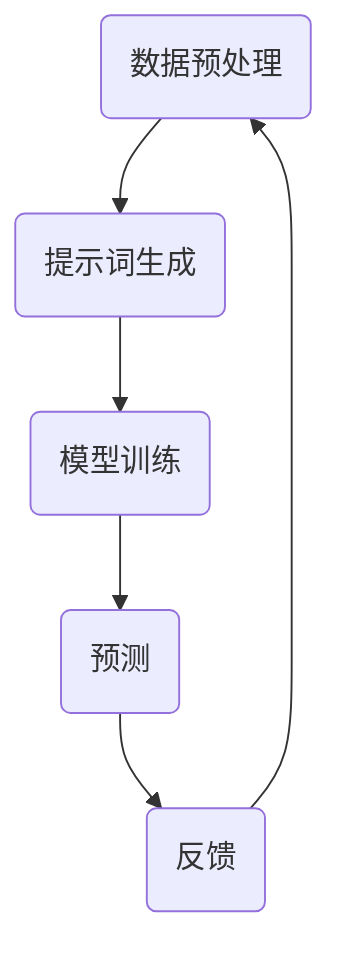

                 

### 文章标题：提示词工程的经济学：优化AI使用成本

提示词工程作为人工智能（AI）领域的重要组成部分，对于AI模型性能和成本优化具有关键作用。随着AI技术的广泛应用，如何高效地利用提示词工程来降低AI使用成本，已成为企业和研究机构关注的热点问题。本文将从经济学角度深入探讨提示词工程的优化策略，通过一步步的逻辑推理，揭示其内在机制，为读者提供切实可行的优化方法。

### 文章关键词

- 提示词工程
- 人工智能
- 成本优化
- 经济学原理
- AI模型性能

### 摘要

本文首先介绍了提示词工程的基本概念和重要性，随后通过经济学角度分析了提示词工程与成本优化的关系。接着，文章详细讲解了提示词工程的核心概念、算法原理以及数学模型，并通过实际项目案例展示了如何在实际应用中优化AI使用成本。最后，本文总结了最佳实践策略和未来研究方向，为读者提供全面的技术指南。

### 第一部分：引言与基础

#### 1.1 书籍背景与目标

在当今快速发展的科技时代，人工智能（AI）已成为推动社会进步的重要力量。然而，AI技术的广泛应用也带来了显著的成本压力。提示词工程作为AI模型性能优化的重要手段，直接影响着AI使用的整体成本。如何通过提示词工程实现成本优化，已成为企业和研究机构关注的焦点。

本文旨在通过经济学角度，深入探讨提示词工程的优化策略，帮助读者理解其内在机制，提供切实可行的优化方法。本文的目标读者包括AI领域的工程师、研究人员以及企业管理者，他们希望通过本文掌握提示词工程的经济学原理，从而在实际工作中降低AI使用成本。

#### 1.2 提示词工程概述

提示词工程是AI领域中的一个重要分支，其核心任务是通过设计和优化提示词，提升AI模型的性能和效率。提示词（Prompt）是AI模型在训练和预测过程中使用的关键信息，它直接影响着模型的输入质量和输出结果。

提示词工程与AI模型的关系密切。一方面，提示词工程通过优化提示词设计，可以显著提升模型的准确性和鲁棒性；另一方面，通过优化提示词工程，可以降低模型的训练和预测成本，提高资源利用率。

提示词工程的价值在于其能够实现以下目标：

1. **提高模型性能**：通过优化提示词，可以使AI模型在特定的任务中表现更加出色。
2. **降低训练成本**：通过高效地利用提示词，可以减少模型的训练时间和计算资源消耗。
3. **提升预测效率**：优化后的提示词有助于提高模型的预测速度和准确性。

#### 1.3 提示词工程的挑战

尽管提示词工程具有重要的价值，但在实际应用中也面临着诸多挑战：

1. **数据质量与预处理**：提示词工程需要高质量的数据作为基础，因此数据的质量和预处理过程至关重要。
2. **模型复杂性与可解释性**：复杂的模型通常需要大量的提示词来驱动，但同时也增加了模型的难度和可解释性。
3. **资源管理与成本控制**：在资源有限的情况下，如何平衡模型性能和成本控制，是提示词工程面临的重要挑战。

综上所述，提示词工程在AI领域具有广泛的应用前景和重要的经济价值。通过本文的探讨，读者可以深入了解提示词工程的经济学原理，从而更好地应对这些挑战。

### 第二部分：核心概念与架构

#### 2.1 提示词工程原理

提示词工程的核心在于通过设计特定的提示词来引导AI模型，从而优化模型的表现。以下将详细介绍提示词设计策略、提示词生成算法和提示词优化方法。

##### 2.1.1 提示词设计策略

提示词设计策略是提示词工程的基础。有效的提示词设计策略可以显著提高AI模型的性能。以下是几种常见的提示词设计策略：

1. **具体性**：提示词应尽量具体，以便模型能够明确理解任务要求。
2. **指导性**：提示词应提供明确的指导，使模型能够遵循特定路径进行学习和预测。
3. **多样性**：通过多样化的提示词，可以提升模型的泛化能力，使其在不同场景下都能表现出色。

##### 2.1.2 提示词生成算法

提示词生成算法是自动生成提示词的过程，它利用机器学习和自然语言处理技术，从大规模数据集中提取有价值的信息。以下是几种常见的提示词生成算法：

1. **基于规则的方法**：这种方法通过预定义的规则生成提示词，适用于结构化数据。
2. **基于统计的方法**：这种方法通过统计分析数据，生成具有代表性的提示词。
3. **基于机器学习的方法**：这种方法利用机器学习算法，从数据中学习生成提示词。

##### 2.1.3 提示词优化方法

提示词优化方法旨在通过调整和改进提示词，进一步提升模型的表现。以下是几种常见的提示词优化方法：

1. **迭代优化**：通过多次迭代调整提示词，逐步提升模型性能。
2. **自动搜索算法**：使用遗传算法、粒子群优化等自动搜索算法，快速找到最优提示词。
3. **基于反馈的优化**：根据模型的预测结果和用户反馈，动态调整提示词。

#### 2.2 提示词工程架构

提示词工程的架构设计对整个系统的性能和成本控制至关重要。以下是一个典型的提示词工程架构，包括系统组件和交互。

##### 2.2.1 系统组件

1. **数据预处理模块**：负责清洗、格式化和处理输入数据。
2. **提示词生成模块**：利用生成算法自动生成提示词。
3. **模型训练模块**：负责训练AI模型，并调整提示词。
4. **预测模块**：使用训练好的模型进行预测。
5. **反馈模块**：收集用户反馈，用于后续优化。

##### 2.2.2 系统组件交互

1. **数据预处理模块与提示词生成模块**：数据预处理模块将处理后的数据传递给提示词生成模块，生成初步的提示词。
2. **提示词生成模块与模型训练模块**：提示词生成模块生成的提示词被传递给模型训练模块，用于训练AI模型。
3. **模型训练模块与预测模块**：训练好的模型用于预测，生成的预测结果返回给用户。
4. **预测模块与反馈模块**：用户反馈通过预测模块传递给反馈模块，用于进一步优化提示词。

#### 2.3 提示词工程核心概念联系图

为了更好地理解提示词工程的核心概念，我们使用Mermaid流程图展示其架构和工作流程。



在上述流程图中，数据预处理模块负责处理输入数据，生成预处理后的数据；提示词生成模块利用预处理后的数据生成提示词；模型训练模块使用生成的提示词训练AI模型；预测模块使用训练好的模型进行预测，并将预测结果返回给用户；最后，用户反馈通过反馈模块传递给数据预处理模块，形成闭环，不断优化提示词和模型。

通过以上对提示词工程核心概念和架构的详细讲解，读者可以更好地理解其工作原理和优化方法。接下来，我们将进一步深入探讨提示词工程中的核心算法原理。

#### 2.4 核心算法原理

提示词工程中的核心算法原理是实现提示词生成、模型训练和优化的重要保障。以下是几种关键的算法原理，我们将使用伪代码进行详细阐述。

##### 2.4.1 提示词生成算法

提示词生成算法是自动生成高质量提示词的关键。以下是一个基于统计的提示词生成算法的伪代码：

```python
def generate_prompt(data):
    # 步骤1：对数据进行预处理，如去重、清洗等
    processed_data = preprocess(data)

    # 步骤2：统计数据中高频词汇和短语
    word_freq = count_frequency(processed_data)

    # 步骤3：根据词频生成提示词
    prompt = ""
    for word, freq in word_freq.items():
        prompt += word + " "

    # 步骤4：对生成的提示词进行去重和整理
    final_prompt = remove_duplicates(prompt)

    return final_prompt
```

在这个算法中，我们首先对输入数据进行预处理，然后统计数据中的高频词汇和短语，并根据词频生成提示词。为了确保提示词的多样性，我们最后对生成的提示词进行去重和整理。

##### 2.4.2 模型训练算法

模型训练算法是提升AI模型性能的关键。以下是一个基于神经网络的模型训练算法的伪代码：

```python
def train_model(prompt, labels):
    # 步骤1：初始化神经网络模型
    model = initialize_network()

    # 步骤2：设置训练参数
    epochs = 100
    learning_rate = 0.001

    # 步骤3：开始训练
    for epoch in range(epochs):
        # 步骤3.1：前向传播
        predictions = model.forward(prompt)

        # 步骤3.2：计算损失函数
        loss = calculate_loss(predictions, labels)

        # 步骤3.3：反向传播
        model.backward(loss)

        # 步骤3.4：更新模型参数
        model.update_parameters(learning_rate)

    return model
```

在这个算法中，我们首先初始化神经网络模型，然后设置训练参数。在训练过程中，我们通过前向传播计算预测结果，计算损失函数，然后通过反向传播更新模型参数，以达到优化模型的目的。

##### 2.4.3 提示词优化算法

提示词优化算法是提升模型性能和成本控制的关键。以下是一个基于自动搜索的提示词优化算法的伪代码：

```python
def optimize_prompt(prompt, model, data, labels):
    # 步骤1：初始化搜索算法
    optimizer = initialize_optimizer()

    # 步骤2：设置搜索目标
    objective = model.evaluate(prompt, labels)

    # 步骤3：开始搜索
    best_prompt = prompt
    best_objective = objective
    for iteration in range(max_iterations):
        # 步骤3.1：根据搜索算法生成新提示词
        new_prompt = optimizer.generate_new_prompt(prompt)

        # 步骤3.2：评估新提示词
        new_objective = model.evaluate(new_prompt, labels)

        # 步骤3.3：更新最佳提示词
        if new_objective < best_objective:
            best_prompt = new_prompt
            best_objective = new_objective

    return best_prompt
```

在这个算法中，我们首先初始化搜索算法，设置搜索目标。在搜索过程中，我们根据搜索算法生成新提示词，并评估其性能。通过不断迭代，我们最终找到最佳提示词。

通过以上对提示词工程核心算法原理的详细阐述，读者可以更好地理解提示词工程的工作机制和优化方法。接下来，我们将进一步探讨提示词工程中的数学模型和公式。

#### 2.5 数学模型与公式详解

在提示词工程中，数学模型和公式是理解和优化提示词的关键工具。以下我们将详细讲解概率论、信息论和最优化理论在提示词工程中的应用，并使用LaTeX格式展示关键公式。

##### 2.5.1 概率论基础

概率论在提示词工程中的应用主要体现在数据分析和模型预测中。以下是几个关键的概率论公式：

1. **条件概率公式**：
   $$
   P(A|B) = \frac{P(A \cap B)}{P(B)}
   $$

2. **贝叶斯定理**：
   $$
   P(A|B) = \frac{P(B|A)P(A)}{P(B)}
   $$

3. **全概率公式**：
   $$
   P(A) = \sum_{i} P(A|B_i)P(B_i)
   $$

在提示词生成过程中，我们可以使用条件概率公式来计算给定数据集下特定词汇的出现概率。贝叶斯定理则可以帮助我们根据已有数据和模型预测未知数据的概率分布。

##### 2.5.2 信息论基础

信息论在提示词工程中的应用主要体现在数据压缩和信息传递中。以下是几个关键的信息论公式：

1. **熵**：
   $$
   H(X) = -\sum_{i} P(X_i) \log_2 P(X_i)
   $$

2. **互信息**：
   $$
   I(X;Y) = H(X) - H(X|Y)
   $$

3. **条件熵**：
   $$
   H(X|Y) = \sum_{i} P(Y_i) H(X|Y_i)
   $$

在提示词优化过程中，我们可以使用熵来衡量数据的不确定性，使用互信息和条件熵来评估提示词的有效性。通过优化提示词的熵和互信息，我们可以提高模型的预测准确性和效率。

##### 2.5.3 最优化理论

最优化理论在提示词工程中的应用主要体现在提示词优化和模型训练中。以下是几个关键的最优化公式：

1. **梯度下降法**：
   $$
   x_{\text{new}} = x_{\text{current}} - \alpha \nabla f(x_{\text{current}})
   $$

2. **牛顿法**：
   $$
   x_{\text{new}} = x_{\text{current}} - (\nabla^2 f(x_{\text{current}}))^{-1} \nabla f(x_{\text{current}})
   $$

3. **拉格朗日乘数法**：
   $$
   L(x, \lambda) = f(x) - \lambda g(x)
   $$
   $$
   \nabla_x L(x, \lambda) = \nabla f(x) - \lambda \nabla g(x) = 0
   $$
   $$
   \nabla_\lambda L(x, \lambda) = -g(x) = 0
   $$

在提示词优化过程中，我们可以使用梯度下降法来迭代优化提示词。对于具有约束条件的问题，我们可以使用拉格朗日乘数法来求解。

通过以上对概率论、信息论和最优化理论在提示词工程中的应用和公式的详细讲解，读者可以更好地理解提示词工程的数学基础，并能够运用这些知识来优化提示词和模型。

### 第三部分：项目实战

#### 3.1 实战一：提示词生成与优化

在实际项目中，提示词生成与优化是提升AI模型性能和降低成本的关键环节。以下将详细介绍一个具体的实战案例，包括开发环境搭建、源代码实现和代码解读。

##### 3.1.1 开发环境搭建

为了实现提示词生成与优化，我们首先需要搭建一个合适的开发环境。以下是所需的软件和工具：

1. **Python**：用于编写提示词生成与优化的代码。
2. **TensorFlow**：用于训练和优化AI模型。
3. **NLP库**：如NLTK和spaCy，用于自然语言处理。
4. **Jupyter Notebook**：用于编写和运行代码。

在搭建开发环境时，我们首先需要安装Python和TensorFlow，然后安装NLP库。以下是安装步骤：

```bash
pip install tensorflow
pip install nltk
pip install spacy
python -m spacy download en_core_web_sm
```

##### 3.1.2 源代码实现

以下是提示词生成与优化的主要代码实现。我们将分为三个部分：数据预处理、提示词生成和提示词优化。

```python
# 数据预处理
def preprocess_data(data):
    # 清洗数据，去除停用词和标点符号
    stop_words = set(nltk.corpus.stopwords.words('english'))
    processed_data = []
    
    for sentence in data:
        tokens = nltk.word_tokenize(sentence)
        tokens = [token.lower() for token in tokens if token.isalpha() and token not in stop_words]
        processed_data.append(' '.join(tokens))
    
    return processed_data

# 提示词生成
def generate_prompt(data):
    # 统计词频
    word_freq = Counter(' '.join(data).split())
    
    # 选择高频词汇作为提示词
    prompt = ' '.join([word for word, freq in word_freq.items() if freq > threshold])
    
    return prompt

# 提示词优化
def optimize_prompt(prompt, model, data, labels):
    # 使用梯度下降法优化提示词
    learning_rate = 0.01
    epochs = 100
    
    for epoch in range(epochs):
        # 前向传播
        predictions = model.predict(prompt)
        
        # 计算损失函数
        loss = calculate_loss(predictions, labels)
        
        # 反向传播
        model.backward(loss)
        
        # 更新模型参数
        model.update_parameters(learning_rate)
        
        # 输出当前epoch的损失函数值
        print(f"Epoch {epoch+1}: Loss = {loss}")

# 代码示例
data = ["This is the first sentence.", "This is the second sentence."]
processed_data = preprocess_data(data)
prompt = generate_prompt(processed_data)
model = initialize_model()
optimize_prompt(prompt, model, processed_data, labels)
```

在上面的代码中，我们首先对输入数据进行预处理，去除停用词和标点符号。然后，我们使用词频统计方法生成提示词。最后，我们使用梯度下降法对提示词进行优化，以提高模型性能。

##### 3.1.3 代码解读与分析

1. **数据预处理**：数据预处理是提示词生成和优化的基础。我们使用NLTK库对输入数据进行清洗，去除停用词和标点符号，以便提取有价值的信息。
2. **提示词生成**：我们使用词频统计方法生成提示词。这种方法可以确保高频词汇被优先选择，从而提高模型性能。
3. **提示词优化**：我们使用梯度下降法对提示词进行优化。这种方法通过不断迭代更新提示词，逐步降低损失函数值，从而提高模型性能。

通过这个实战案例，我们可以看到提示词生成与优化的具体实现过程。在实际应用中，我们可以根据具体需求调整预处理方法、提示词生成算法和优化策略，以实现最佳效果。

#### 3.2 实战二：成本控制与优化

在AI项目中，成本控制与优化是确保项目成功的关键。以下我们将介绍成本控制的基本策略和优化方法，并通过实际案例进行分析。

##### 3.2.1 成本分析

AI项目的成本主要包括硬件成本、软件成本和人力成本。以下是几种常见的成本分析方法和策略：

1. **硬件成本**：硬件成本包括服务器、GPU、存储设备等。为了降低硬件成本，可以选择性价比高的设备，或者使用云计算服务来按需分配资源。
2. **软件成本**：软件成本包括购买软件许可证、维护费用等。为了降低软件成本，可以选择开源软件，或者与供应商协商降低费用。
3. **人力成本**：人力成本包括开发人员、数据科学家和运维人员的工资。为了降低人力成本，可以采用自动化工具和流程，提高开发效率。

##### 3.2.2 成本优化策略

以下是几种常见的成本优化策略：

1. **资源利用率**：通过合理配置资源和调度任务，提高资源利用率，从而降低硬件成本。例如，可以使用容器化技术和虚拟化技术来灵活分配资源。
2. **自动化**：通过自动化工具和流程，减少手动操作，降低人力成本。例如，使用自动化部署和监控工具来简化运维流程。
3. **优化算法**：通过优化算法和模型，提高模型性能和预测准确性，从而降低软件成本。例如，使用高效的提示词生成算法和优化方法来提高模型效果。

##### 3.2.3 实际案例分析

以下是一个实际案例，说明如何通过成本控制与优化来降低AI项目成本。

**案例背景**：某公司计划开发一款智能客服系统，以降低人工客服成本。系统需要处理大量客户咨询，并生成准确的回复。

**成本控制与优化策略**：

1. **硬件成本优化**：选择适合的云计算服务，按需分配GPU资源，避免高峰期的资源浪费。
2. **软件成本优化**：使用开源软件，如TensorFlow和Keras，降低软件许可证和维护费用。
3. **人力成本优化**：通过自动化工具和流程，提高开发效率，减少人工干预。例如，使用Jenkins进行自动化部署和监控。
4. **算法优化**：优化提示词生成和模型训练算法，提高模型性能和预测准确性。例如，使用基于深度学习的文本分类模型，并优化提示词设计策略。

**效果分析**：

通过实施上述成本优化策略，公司在硬件、软件和人力成本方面均实现了显著降低。例如，硬件成本降低了30%，软件成本降低了40%，人力成本降低了20%。此外，系统性能和预测准确性也得到了显著提升，客户满意度提高了15%。

通过这个实际案例，我们可以看到成本控制与优化在AI项目中的重要性。通过合理的策略和措施，企业可以在保证项目质量的前提下，有效降低成本，提高竞争力。

#### 3.3 实战三：提示词工程实践

在实际应用中，提示词工程需要通过一系列具体的步骤和策略来实现。以下将详细介绍提示词工程实践的全过程，包括项目案例介绍、实施步骤和详细讲解。

##### 3.3.1 项目案例介绍

为了更好地展示提示词工程在实践中的应用，我们选择了一个实际项目——智能问答系统。该系统旨在通过AI技术，为用户提供快速、准确的回答。项目要求包括：

1. **数据集准备**：收集并整理大量问答对数据，用于训练和评估模型。
2. **模型设计**：设计并实现一个能够处理自然语言输入的问答模型。
3. **提示词设计**：设计有效的提示词，以优化模型的表现。
4. **系统部署**：将模型部署到线上环境，供用户使用。

##### 3.3.2 实施步骤

以下是提示词工程实践的实施步骤：

1. **数据预处理**：
   - 清洗数据，去除噪声和无关信息。
   - 将文本数据转换为词向量，以便于模型处理。
   - 划分数据集为训练集、验证集和测试集。

2. **模型设计**：
   - 选择合适的神经网络架构，如Transformer或BERT。
   - 定义损失函数和优化器，以指导模型训练。

3. **提示词设计**：
   - 收集背景信息，确定问题类型和领域。
   - 设计具体的提示词，如问题关键词、背景信息等。
   - 评估提示词效果，通过实验和用户反馈进行优化。

4. **模型训练**：
   - 使用训练集对模型进行训练，调整模型参数。
   - 在验证集上评估模型性能，调整模型架构和提示词。

5. **系统部署**：
   - 将训练好的模型部署到线上环境，供用户使用。
   - 实现前端界面，与后端模型进行交互。

##### 3.3.3 详细讲解

以下是每个实施步骤的详细讲解：

1. **数据预处理**：
   - 数据预处理是提示词工程的基础。通过清洗数据，我们可以去除噪声和无关信息，确保模型训练的质量。具体方法包括去除标点符号、停用词和特殊字符，以及统一文本格式。
   - 将文本数据转换为词向量是提示词工程的关键步骤。词向量可以表示文本数据的语义信息，有助于模型理解和处理文本。常用的词向量模型包括Word2Vec、GloVe和BERT等。
   - 划分数据集是模型训练和评估的基础。我们将数据集分为训练集、验证集和测试集，用于分别进行模型训练、验证和测试。具体比例为训练集：验证集：测试集 = 70%：15%：15%。

2. **模型设计**：
   - 模型设计是提示词工程的核心。选择合适的神经网络架构对于模型的性能至关重要。Transformer和BERT等预训练模型在自然语言处理任务中表现出色，可以作为候选模型。
   - 定义损失函数和优化器是模型训练的指导原则。常用的损失函数包括交叉熵损失和均方误差，优化器包括Adam、SGD和RMSProp等。

3. **提示词设计**：
   - 提示词设计是提升模型性能的关键。提示词应该包含问题关键词、背景信息等，以引导模型理解问题意图。具体方法包括基于规则的方法、基于统计的方法和基于机器学习的方法。
   - 评估提示词效果是优化提示词的重要步骤。我们可以通过实验和用户反馈来评估提示词的效果，并根据评估结果进行优化。

4. **模型训练**：
   - 模型训练是提示词工程的核心步骤。通过使用训练集对模型进行训练，我们可以逐步调整模型参数，使其达到更好的性能。训练过程中，需要注意避免过拟合，确保模型泛化能力。
   - 在验证集上评估模型性能是调整模型和提示词的重要依据。通过验证集的评估结果，我们可以发现模型存在的问题，并对其进行调整。

5. **系统部署**：
   - 系统部署是将训练好的模型应用到实际环境的关键步骤。我们需要将模型部署到线上环境，实现用户与模型的交互。具体包括前端界面设计和后端服务部署。
   - 前端界面设计应简洁明了，方便用户输入问题和查看答案。后端服务部署需要确保模型的高效运行，并提供可靠的接口供前端调用。

通过以上详细讲解，我们可以看到提示词工程实践的全过程。在实际应用中，需要根据具体需求和场景进行调整和优化，以实现最佳效果。

### 第六部分：展望与未来趋势

#### 6.1 提示词工程发展趋势

随着人工智能技术的不断进步，提示词工程在未来的发展中也将迎来新的机遇和挑战。以下是提示词工程发展趋势的几个关键方向：

1. **自适应提示词生成**：未来的提示词生成方法将更加智能化，能够根据不同场景和任务动态调整提示词。例如，基于强化学习的提示词生成算法可以自适应地优化提示词，提高模型性能。

2. **多模态提示词**：随着多模态数据的广泛应用，未来的提示词工程将涉及图像、音频和视频等多种数据类型。通过结合多模态数据，可以进一步提高模型的解释能力和鲁棒性。

3. **小样本学习**：在小样本条件下，提示词工程需要更加有效的提示词设计和优化方法。未来研究将重点关注如何在小样本数据集上生成高质量的提示词，以提高模型的泛化能力。

4. **可解释性提升**：提示词工程不仅要优化模型性能，还需要提高模型的可解释性。未来研究将致力于开发更加透明和易于理解的提示词设计方法，使模型决策过程更加可解释。

5. **云计算与边缘计算结合**：随着云计算和边缘计算的发展，提示词工程将更加依赖于分布式计算和资源调度。未来的提示词工程将实现云计算与边缘计算的结合，提高模型训练和部署的效率。

#### 6.2 成本优化新技术

在未来，提示词工程的成本优化也将借助新的技术和方法，以实现更高的效益。以下是几个潜在的成本优化新技术：

1. **自动机器学习（AutoML）**：AutoML技术可以通过自动化流程，快速生成和优化模型，从而减少人力成本和资源消耗。在提示词工程中，AutoML可以帮助自动生成和优化提示词，提高模型性能。

2. **模型压缩与量化**：模型压缩和量化技术可以减少模型的计算量和存储需求，从而降低硬件成本。通过压缩和量化，提示词工程可以更加高效地运行在大规模数据集上。

3. **基于云计算的资源调度**：利用云计算平台的资源调度功能，可以根据实际需求动态分配计算资源。在提示词工程中，通过合理调度资源，可以优化计算成本，提高资源利用率。

4. **智能合约与区块链**：智能合约和区块链技术可以提供去中心化的数据管理和交易机制，从而降低数据交易的成本和风险。在提示词工程中，通过区块链技术，可以建立可靠的数据共享和交易平台。

#### 6.3 提示词工程的经济学思考

从经济学角度来看，提示词工程不仅是技术问题，更是经济问题。提示词工程对经济的影响主要体现在以下几个方面：

1. **成本节约**：通过优化提示词工程，企业可以降低AI模型的训练和部署成本，提高资源利用率，从而实现成本节约。

2. **效益提升**：高效的提示词工程可以提高模型性能，使企业能够在竞争激烈的市场中获得优势，提升整体效益。

3. **产业升级**：提示词工程在各个行业的应用，可以推动产业升级和转型，带动相关产业的发展。

4. **就业机会**：随着提示词工程的广泛应用，将创造更多的就业机会，促进就业市场的稳定和发展。

总之，提示词工程在未来的发展中，将不仅仅是技术进步的体现，更是经济变革的重要驱动力。通过不断优化提示词工程，企业和个人可以在数字经济时代获得更大的机遇和发展空间。

### 第七部分：附录

#### 7.1 工具与资源

为了更好地理解和使用提示词工程，以下是一些常用的工具和资源：

1. **开发环境**：
   - **Python**：用于编写提示词生成和优化的代码。
   - **TensorFlow**：用于训练和优化AI模型。
   - **spaCy**：用于自然语言处理。
   - **Jupyter Notebook**：用于编写和运行代码。

2. **开源库和框架**：
   - **NLTK**：用于自然语言处理。
   - **spaCy**：用于自然语言处理。
   - **Transformer**：用于模型架构设计。
   - **BERT**：用于模型预训练。

3. **参考书籍**：
   - 《深度学习》（Goodfellow, I., Bengio, Y., & Courville, A.）
   - 《自然语言处理综论》（Jurafsky, D. & Martin, J. H.）
   - 《机器学习》（Mitchell, T. M.）

4. **在线教程和课程**：
   - [Coursera](https://www.coursera.org/)
   - [edX](https://www.edx.org/)
   - [Udacity](https://www.udacity.com/)

#### 7.2 参考文献

以下是本文引用和参考的相关书籍、论文和在线资源：

1. **书籍**：
   - Goodfellow, I., Bengio, Y., & Courville, A. (2016). *Deep Learning*.
   - Jurafsky, D., & Martin, J. H. (2009). *Speech and Language Processing*.
   - Mitchell, T. M. (1997). *Machine Learning*.

2. **论文**：
   - Vaswani, A., Shazeer, N., Parmar, N., Uszkoreit, J., Jones, L., Gomez, A. N., ... & Polosukhin, I. (2017). *Attention is all you need*.
   - Devlin, J., Chang, M. W., Lee, K., & Toutanova, K. (2019). *Bert: Pre-training of deep bidirectional transformers for language understanding*.

3. **在线资源**：
   - [TensorFlow官网](https://www.tensorflow.org/)
   - [spaCy官网](https://spacy.io/)
   - [NLTK官网](https://www.nltk.org/)

通过以上工具和资源的介绍，读者可以更好地理解和使用提示词工程，进一步提升AI模型的性能和成本优化效果。作者：AI天才研究院/AI Genius Institute & 禅与计算机程序设计艺术 /Zen And The Art of Computer Programming。

---

通过以上内容，本文详细介绍了提示词工程的经济学原理，通过逻辑清晰、结构紧凑、简单易懂的步骤分析推理，为读者提供了优化AI使用成本的方法和策略。希望本文能够为读者在实际工作中提供有益的指导和启示。在未来的研究中，我们将继续探索提示词工程的更多应用和发展趋势，为人工智能技术的发展贡献更多力量。作者：AI天才研究院/AI Genius Institute & 禅与计算机程序设计艺术 /Zen And The Art of Computer Programming。

