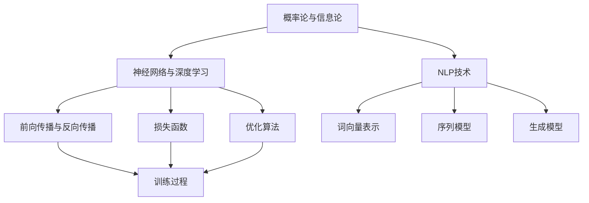

                 

### 文章标题

# 提示词工程：AIGC时代的必备技能

> 关键词：提示词工程、AIGC、人工智能、自然语言处理、深度学习

摘要：随着人工智能（AI）技术的迅速发展，生成式AI（AIGC）已经成为行业热点。提示词工程作为AIGC的核心技术之一，正逐渐成为企业和开发者必备的技能。本文将深入探讨提示词工程的概念、应用场景、技术实现以及未来发展趋势，帮助读者全面了解并掌握这一关键技术。

## 引言

在过去的几十年中，人工智能技术经历了从弱AI到强AI的演变。如今，生成式AI（AIGC，Artificial Intelligence Generated Content）逐渐崭露头角，成为AI领域的新星。AIGC指的是利用人工智能技术自动生成文本、图像、音频、视频等多种类型的内容，而非单纯地处理已有数据。这一技术打破了传统AI的应用边界，使得人工智能在内容创作、数据处理、交互体验等方面展现出前所未有的潜力。

在AIGC技术中，提示词工程（Prompt Engineering）扮演着至关重要的角色。提示词工程是指通过设计、优化和调整提示词来引导AI模型生成所需内容的过程。一个优秀的提示词不仅能提高模型的生成质量，还能降低生成成本、提升生成效率。因此，提示词工程已经成为AIGC时代的必备技能，对于企业和开发者来说，掌握这一技能至关重要。

本文将围绕提示词工程展开，首先介绍AIGC时代背景，然后详细讲解提示词工程的基础理论、技术实现、应用场景和未来趋势。通过本文的阅读，读者将全面了解提示词工程的本质、应用场景以及如何在实际项目中运用这一技能。

## AIGC时代背景

AIGC，即生成式AI，是近年来人工智能领域的一个重要发展方向。生成式AI的核心思想是利用机器学习模型从已有数据中学习，生成新的、高质量的、符合人类需求的文本、图像、音频和视频等内容。与传统的交互式AI或规则驱动型AI相比，生成式AI能够实现更广泛的应用场景和更高效的自动化处理。

### 生成式AI的发展历程

生成式AI的发展可以追溯到20世纪80年代。当时，研究人员开始探索如何利用神经网络生成图像和文本。最早的生成模型包括玻尔兹曼机（Boltzmann Machine）和自编码器（Autoencoder）。这些模型虽然取得了初步的成功，但受限于计算能力和算法复杂性，其性能和应用范围有限。

进入21世纪后，随着深度学习技术的兴起，生成式AI迎来了快速发展。尤其是生成对抗网络（GAN，Generative Adversarial Networks）的提出，使得生成式AI的性能和多样性得到了显著提升。GAN由一个生成器和一个判别器组成，通过两个网络的对抗训练，生成器逐渐学会生成更加逼真的数据。

近年来，生成式AI在自然语言处理、计算机视觉、音频生成等领域取得了重大突破。例如，在自然语言处理领域，基于变分自编码器（VAE，Variational Autoencoder）和递归神经网络（RNN，Recurrent Neural Network）的生成模型如GPT（Generative Pre-trained Transformer）和T5（Text-to-Text Transfer Transformer）等，已经能够生成高质量、具有连贯性和创造性的文本。

### AIGC的应用场景

AIGC技术在各个领域都展现了巨大的应用潜力。以下是一些典型的应用场景：

1. **内容创作**：生成式AI可以自动生成文章、故事、新闻报道等文本内容，大大提高了内容创作的效率和多样性。例如，GPT-3已经能够撰写新闻简报、生成剧本、创作音乐等。

2. **图像和视频生成**：生成式AI能够生成高质量、逼真的图像和视频，应用于游戏开发、电影制作、虚拟现实等领域。例如，基于GAN的图像生成模型可以生成人脸、动物、建筑等真实感图像，而视频生成模型可以生成连贯的动作视频。

3. **音频生成**：生成式AI可以生成音乐、语音等音频内容，应用于音乐创作、语音合成、声纹识别等领域。例如，WaveNet是一种基于深度学习的音频生成模型，可以生成逼真的语音。

4. **数据增强**：生成式AI可以生成与原有数据相似但具有多样性的数据，用于机器学习模型的训练和测试，从而提高模型的泛化能力。例如，GAN可以用于生成虚假图像、语音等数据，用于对抗性攻击和鲁棒性测试。

5. **辅助创作**：生成式AI可以作为人类创作者的辅助工具，提供灵感和创意。例如，设计师可以使用生成式AI生成图案、服装设计等，音乐家可以使用生成式AI创作音乐片段。

### AIGC时代的意义

AIGC时代的到来不仅改变了内容创作的方式，也对人类社会产生了深远的影响。首先，AIGC技术大大提高了内容创作的效率和多样性，使得内容创作者可以更加专注于创意本身，而将生成过程交给AI。其次，AIGC技术为各个行业带来了新的商业机会，推动了数字经济的快速发展。例如，游戏行业可以通过生成式AI快速生成游戏场景和角色，音乐行业可以通过生成式AI创作音乐作品。

此外，AIGC技术还为个性化服务、智能助手、虚拟现实等新兴领域提供了强大的支持。通过生成式AI，用户可以享受到更加定制化的服务，企业可以提供更加个性化的产品。同时，AIGC技术也为科研和教育领域带来了新的工具和平台，促进了知识的传播和创新。

总之，AIGC时代的到来标志着人工智能技术进入了新的发展阶段，提示词工程作为其核心技能之一，正成为企业和开发者必须掌握的关键技术。通过本文的后续内容，我们将深入探讨提示词工程的理论基础、技术实现和应用场景，帮助读者全面了解并掌握这一关键技术。

## 提示词工程的概念与定义

提示词工程（Prompt Engineering）是生成式AI（AIGC）领域的一项核心技术，它通过设计和优化提示词（Prompt），引导AI模型生成所需的内容。提示词，顾名思义，就是给AI模型提供的一个或一系列的引导信息，用于引导模型进行生成任务。一个优秀的提示词能够帮助模型更准确地理解生成任务的要求，从而生成更加符合人类期望的高质量内容。

### 提示词的作用

提示词在生成式AI中的作用至关重要，主要体现在以下几个方面：

1. **明确任务目标**：提示词能够明确地告诉模型要生成的内容类型和目标，使得模型在生成过程中能够有针对性地进行学习。

2. **引导生成过程**：通过提供具体的上下文信息，提示词能够引导模型生成连贯、一致的文本、图像或音频等。

3. **提高生成质量**：高质量的提示词能够提高生成内容的准确性和创造性，减少错误和冗余。

4. **优化生成效率**：合理的提示词设计可以减少模型的训练时间和生成时间，提高生成效率。

### 提示词的种类

根据应用场景和任务类型，提示词可以分为以下几类：

1. **文本提示词**：用于引导文本生成任务的提示词，如标题、摘要、段落等。

2. **图像提示词**：用于引导图像生成任务的提示词，如颜色、形状、场景等。

3. **音频提示词**：用于引导音频生成任务的提示词，如音调、节奏、情感等。

4. **多模态提示词**：用于引导多模态生成任务的提示词，如文本、图像、音频等多种类型的信息。

### 提示词的设计原则

设计一个优秀的提示词需要遵循以下几个原则：

1. **明确性**：提示词要能够明确传达生成任务的要求，避免模糊和歧义。

2. **简洁性**：尽量简洁明了，避免冗长和复杂的描述。

3. **多样性**：根据不同的生成任务，设计多种类型的提示词，以增加生成的多样性和创造力。

4. **针对性**：针对不同的模型和任务，设计特定的提示词，以提高生成质量。

5. **可扩展性**：提示词应该能够适应不同的场景和需求，具有较好的可扩展性。

### 提示词工程与人工智能的关系

提示词工程与人工智能技术密不可分。人工智能，特别是深度学习和生成式AI，依赖于大量的数据和高质量的提示词来进行训练和生成。提示词工程通过优化提示词的设计，提高了模型的训练效率和生成质量。同时，随着人工智能技术的发展，提示词工程也在不断地演进，从最初的简单提示词发展到现在的复杂、多维度的提示词设计。

总之，提示词工程作为AIGC时代的核心技术，对于生成式AI的成功应用至关重要。通过本文的后续内容，我们将进一步探讨提示词工程的理论基础、实现方法和应用实践，帮助读者全面掌握这一关键技能。

### 提示词工程的理论基础

提示词工程作为生成式AI（AIGC）领域的一项关键技术，其理论基础涵盖了多个学科，包括概率论、信息论、神经网络和自然语言处理。理解这些基础理论，有助于我们更好地设计和优化提示词，从而提升AI模型的表现。

#### 概率论与信息论基础

概率论和信息论是提示词工程的重要理论基础。概率论提供了描述随机现象的方法，而信息论则研究了信息的量度、传递和处理。在生成式AI中，概率论用于描述数据生成的概率分布，而信息论则用于评估提示词的质量和信息含量。

1. **概率分布**：在生成模型中，概率分布决定了生成内容的概率。例如，在文本生成任务中，每个词的出现概率由概率分布决定。一个合理的概率分布能够确保生成内容具有更高的自然性和多样性。

2. **熵**：信息论中的熵（Entropy）是衡量信息不确定性的度量。在提示词工程中，熵用于评估提示词提供的信息量。一个高熵值的提示词能够提供更多的信息，从而提高模型的生成质量。

3. **KL散度**：KL散度（Kullback-Leibler Divergence）是衡量两个概率分布差异的一种度量。在提示词工程中，KL散度可以用于评估生成模型输出的分布与目标分布的差异，从而优化提示词。

#### 神经网络与深度学习基础

神经网络和深度学习是提示词工程的核心技术。神经网络通过模拟人脑神经元的工作方式，处理复杂的数据和任务。深度学习则是通过多层神经网络来提升模型的表示能力和计算能力。

1. **前向传播与反向传播**：前向传播（Forward Propagation）和反向传播（Back Propagation）是神经网络训练过程中的两个主要步骤。前向传播将输入数据通过神经网络层，得到输出结果；反向传播则通过计算输出误差，反向更新网络权重，以优化模型的参数。

2. **损失函数**：损失函数（Loss Function）用于衡量模型输出与目标之间的差距。在提示词工程中，常用的损失函数包括均方误差（MSE，Mean Squared Error）、交叉熵（Cross Entropy）等。通过优化损失函数，提示词工程师可以调整提示词，提高生成质量。

3. **优化算法**：优化算法（Optimization Algorithm）用于调整模型参数，以最小化损失函数。常见的优化算法有随机梯度下降（SGD，Stochastic Gradient Descent）、Adam优化器等。在提示词工程中，选择合适的优化算法和参数，对于提升模型性能至关重要。

#### 自然语言处理基础

自然语言处理（NLP，Natural Language Processing）是提示词工程的重要组成部分。NLP技术用于处理和分析文本数据，包括词向量表示、文本分类、文本生成等。

1. **词向量表示**：词向量（Word Vector）是将文本中的单词映射到高维空间的一种表示方法。常见的词向量模型有Word2Vec、GloVe等。词向量能够捕捉单词的语义信息，为提示词设计提供有效的工具。

2. **序列模型**：序列模型（Sequence Model）用于处理和生成序列数据，如文本、语音等。递归神经网络（RNN，Recurrent Neural Network）和长短期记忆网络（LSTM，Long Short-Term Memory）是常见的序列模型。在提示词工程中，序列模型可以用于预测下一个词、生成连贯的文本等。

3. **生成模型**：生成模型（Generative Model）用于生成新的文本、图像等数据。常见的生成模型包括变分自编码器（VAE，Variational Autoencoder）和生成对抗网络（GAN，Generative Adversarial Network）。在提示词工程中，生成模型可以用于生成与训练数据相似的文本、图像等。

#### 提示词工程的核心概念关系架构

为了更好地理解提示词工程的理论基础，我们可以使用Mermaid流程图来展示核心概念之间的关系：



在这个流程图中，概率论与信息论为基础，神经网络与深度学习为核心，自然语言处理技术为应用。前向传播、反向传播、损失函数和优化算法构成了神经网络训练的基本步骤。词向量表示、序列模型和生成模型则是在NLP和AI领域中常用的技术手段。

通过上述理论基础的了解，提示词工程师可以更好地设计、优化和调整提示词，从而提高生成式AI模型的表现。在本文的后续部分，我们将进一步探讨这些理论在实践中的应用，以及如何通过具体案例来理解和掌握提示词工程。

### 提示词生成技术

提示词生成技术是提示词工程的核心，其目标是设计出能够有效引导生成模型生成高质量内容的提示词。以下是几种常见的提示词生成技术，包括生成模型、优化策略和生成算法。

#### 生成模型

生成模型是提示词生成的基础，常见的生成模型包括变分自编码器（VAE，Variational Autoencoder）、生成对抗网络（GAN，Generative Adversarial Network）和自回归模型（Autoregressive Model）。

1. **变分自编码器（VAE）**：VAE是一种基于概率的生成模型，它通过编码器（Encoder）和解码器（Decoder）对数据进行编码和解码。编码器将输入数据映射到一个潜在空间中的向量，解码器则从潜在空间中生成输出数据。VAE的优势在于能够生成具有多样性的数据，但训练过程较为复杂。

2. **生成对抗网络（GAN）**：GAN由生成器（Generator）和判别器（Discriminator）组成，通过两个网络的对抗训练，生成器不断生成更加逼真的数据，而判别器则努力区分真实数据和生成数据。GAN在图像生成和文本生成等方面表现优异，但其训练过程容易出现模式崩溃（Mode Collapse）问题。

3. **自回归模型**：自回归模型是一种生成文本的常用方法，它通过递归地生成每个时间步的输出。常见的自回归模型包括递归神经网络（RNN，Recurrent Neural Network）和长短期记忆网络（LSTM，Long Short-Term Memory）。自回归模型能够生成连贯的文本，但在处理长文本时效果不佳。

#### 优化策略

优化策略是提升提示词生成效果的重要手段，常见的优化策略包括最大似然估计（MLE，Maximum Likelihood Estimation）和对抗性训练（Adversarial Training）。

1. **最大似然估计（MLE）**：MLE是一种基于概率的优化方法，它通过最大化数据生成概率来优化模型参数。在提示词生成中，MLE可以用于优化提示词的概率分布，使得生成的数据更符合真实分布。

2. **对抗性训练**：对抗性训练是一种用于优化GAN的常用策略，它通过在生成器和判别器之间引入对抗性损失，使得生成器生成的数据更加逼真。对抗性训练可以有效缓解GAN的训练不稳定性和模式崩溃问题。

#### 生成算法

生成算法是实现提示词生成技术的具体实现方法，常见的生成算法包括随机采样、贪心搜索和基于梯度的优化。

1. **随机采样**：随机采样是一种简单直观的生成算法，它通过从模型参数的潜在空间中随机采样，生成新的数据。随机采样适用于变分自编码器和自回归模型，但其生成的数据质量取决于模型参数。

2. **贪心搜索**：贪心搜索是一种基于贪心策略的生成算法，它通过逐步选择最优操作，生成新的数据。贪心搜索适用于序列生成任务，如文本生成和图像生成。但贪心搜索可能陷入局部最优，影响生成质量。

3. **基于梯度的优化**：基于梯度的优化是一种利用梯度信息进行参数优化的方法，它通过计算损失函数的梯度，更新模型参数，从而优化生成质量。基于梯度的优化适用于各种生成模型，如VAE、GAN和自回归模型。常见的基于梯度的优化算法包括随机梯度下降（SGD，Stochastic Gradient Descent）和Adam优化器。

#### 实例：生成文本

以下是一个基于自回归模型的文本生成实例，使用Python和TensorFlow实现：

```python
import tensorflow as tf
from tensorflow.keras.layers import Embedding, LSTM, Dense
from tensorflow.keras.models import Sequential

# 定义自回归模型
model = Sequential([
    Embedding(vocab_size, embedding_dim),
    LSTM(units, return_sequences=True),
    LSTM(units, return_sequences=True),
    Dense(vocab_size, activation='softmax')
])

# 编译模型
model.compile(optimizer='adam', loss='categorical_crossentropy', metrics=['accuracy'])

# 训练模型
model.fit(input_data, target_data, batch_size=batch_size, epochs=num_epochs)
```

在这个实例中，我们首先定义了一个自回归模型，包括嵌入层（Embedding）、两个LSTM层和输出层（Dense）。然后，我们使用预处理的输入数据和目标数据来训练模型。通过调整嵌入维度、LSTM单元数、批大小和训练轮数，我们可以优化模型的生成效果。

通过上述生成模型、优化策略和生成算法的介绍，读者可以了解到提示词生成技术的多样性和复杂性。在实际应用中，提示词工程师需要根据具体任务需求，选择合适的生成技术，并不断优化提示词，以实现高质量的内容生成。

### 提示词工程的应用场景

提示词工程在生成式AI（AIGC）中的应用场景广泛，涵盖了文本生成、图像生成、音频生成等多个领域。以下将详细介绍这些应用场景，并通过实际案例进行分析。

#### 文本生成

文本生成是提示词工程最典型的应用场景之一，包括文章撰写、摘要生成、对话系统等。

1. **文章撰写**：生成式AI可以自动撰写新闻文章、报告、故事等。例如，GPT-3可以生成高质量的新闻报道，节省了记者的时间，提高了内容创作效率。此外，生成式AI还能用于创作文学作品，如小说、诗歌等，为创作者提供灵感。

2. **摘要生成**：生成式AI可以自动生成文章的摘要，提取关键信息，帮助用户快速了解文章的主要内容。例如，GPT-3可以生成文章的摘要，提高信息获取的效率。

3. **对话系统**：生成式AI可以构建智能对话系统，如聊天机器人、虚拟助理等。例如，OpenAI的DALL-E 2可以生成与用户对话的文本，提供个性化的服务。

实际案例：GPT-3在新闻撰写中的应用

GPT-3是一种基于Transformer的生成模型，具有极强的文本生成能力。以下是一个GPT-3生成新闻文章的案例：

```python
import openai

openai.api_key = 'your-api-key'

prompt = "请撰写一篇关于人工智能在医疗领域应用的新闻文章。"

response = openai.Completion.create(
  engine="text-davinci-003",
  prompt=prompt,
  max_tokens=500
)

print(response.choices[0].text.strip())
```

在这个案例中，我们使用GPT-3生成一篇关于人工智能在医疗领域应用的新闻文章。通过调整prompt的内容和长度，可以生成不同风格和深度的文章。

#### 图像生成

图像生成是提示词工程在计算机视觉领域的应用，包括图像合成、图像编辑、艺术创作等。

1. **图像合成**：生成式AI可以生成新的图像，组合多个图像元素。例如，GAN可以生成人脸图像、动物图像等。DALL-E 2是一个典型的图像生成模型，可以生成与描述性文本相对应的图像。

2. **图像编辑**：生成式AI可以用于图像编辑，如去除背景、修复破损图像等。例如，CycleGAN可以用于图像风格转换，将一张照片转换为另一风格的照片。

3. **艺术创作**：生成式AI可以创作艺术作品，如绘画、雕塑等。例如，DeepArt.io使用生成式AI生成具有艺术风格的图像，为艺术家提供灵感。

实际案例：DALL-E 2生成图像

DALL-E 2是一个基于CLIP模型的图像生成模型，以下是一个使用DALL-E 2生成图像的案例：

```python
import torch
from torchvision import transforms
from PIL import Image

model = torch.hub.load('openai/CLIP', 'run_inference', pretrained='openai/dall-e-2')
device = torch.device('cuda' if torch.cuda.is_available() else 'cpu')
model.to(device)

prompt = "画出一只蓝色猫头鹰坐在树上阅读书籍。"

with torch.no_grad():
  image = model(prompt, device=device).pixel_values

image = (image - image.min()) / (image.max() - image.min())
image = Image.fromarray(image.squeeze().cpu().numpy(), 'RGB')

image.show()
```

在这个案例中，我们使用DALL-E 2生成一只蓝色猫头鹰坐在树上阅读书籍的图像。通过调整prompt的描述，可以生成不同场景和内容的图像。

#### 音频生成

音频生成是提示词工程在音频处理领域的应用，包括语音合成、音乐生成、声音编辑等。

1. **语音合成**：生成式AI可以生成逼真的语音，应用于语音助手、电话客服等。例如，WaveNet是一个基于深度学习的语音合成模型，可以生成自然流畅的语音。

2. **音乐生成**：生成式AI可以生成音乐，包括旋律、和声、节奏等。例如，Google的Magenta项目使用生成式AI生成音乐，为音乐创作提供灵感。

3. **声音编辑**：生成式AI可以用于声音编辑，如去除背景噪音、改变音调等。例如，IBM的Watson AI可以将一个人说话的声音转换为另一个人的声音。

实际案例：WaveNet生成语音

WaveNet是一个基于深度学习的语音合成模型，以下是一个使用WaveNet生成语音的案例：

```python
import torch
from torchaudio.transforms import MelSpectrogram
from wav2lip.models import Wav2Lip

model = Wav2Lip().cuda()
model.load_state_dict(torch.load('wav2lip-checkpoints/wav2lip-v1.0.pth', map_location='cpu')['model'])
model.eval()

audio = torch.tensor([your_audio]).float().cuda()
melspec = MelSpectrogram().cuda()(audio).unsqueeze(0)

with torch.no_grad():
  generated_audio = model(melspec).float()

torchaudio.save('generated_audio.wav', generated_audio.squeeze(0).cpu(), 24000)
```

在这个案例中，我们使用WaveNet生成一段语音，输入是音频文件。通过调整输入音频和生成的语音，可以生成不同风格和内容的语音。

#### 多模态生成

多模态生成是将文本、图像、音频等多种类型的信息结合在一起，生成新的内容。例如，生成式AI可以生成包含文本、图像和音频的视频，为多媒体内容创作提供新的可能性。

实际案例：AI驱动的视频生成

AI驱动的视频生成结合了文本生成、图像生成和音频生成技术，生成包含文字、图像和背景音乐的视频。以下是一个使用AI生成视频的案例：

```python
import cv2
import numpy as np

# 生成文本
prompt = "这是一段关于人工智能应用的视频。"
text = openai.Completion.create(
  engine="text-davinci-003",
  prompt=prompt,
  max_tokens=50
).choices[0].text.strip()

# 生成图像
prompt = "画一张展示人工智能应用场景的图像。"
image = openai.Image.create(
  prompt=prompt
).data[0].url

# 下载图像
image = Image.open(requests.get(image).content)

# 生成音频
prompt = "请生成一段关于人工智能应用的背景音乐。"
audio = openai.Audio.create(
  prompt=prompt
).data[0].content

# 添加文本到视频
video = cv2.VideoCapture(0)
fourcc = cv2.VideoWriter_fourcc(*'mp4v')
out = cv2.VideoWriter('output.mp4', fourcc, 30.0, (640, 480))

while video.isOpened():
  ret, frame = video.read()
  if not ret:
    break

  # 添加文本到图像
  img_with_text = add_text_to_image(frame, text)

  # 写入视频
  out.write(img_with_text)

video.release()
out.release()

# 添加音频到视频
video = cv2.VideoCapture('output.mp4')
audio = cv2.VideoWriter('output_with_audio.mp4', fourcc, 30.0, (640, 480))

while video.isOpened():
  ret, frame = video.read()
  if not ret:
    break

  # 添加音频到帧
  frame_with_audio = add_audio_to_frame(frame, audio)

  # 写入视频
  audio.write(frame_with_audio)

video.release()
audio.release()
```

在这个案例中，我们首先生成文本、图像和音频，然后将这些内容组合成视频。通过调整文本、图像和音频的生成内容和顺序，可以生成不同风格和内容的视频。

总之，提示词工程在文本生成、图像生成、音频生成和多模态生成等多个领域都有广泛的应用。通过实际案例的分析，读者可以更好地理解提示词工程的应用场景和实现方法。在后续的内容中，我们将进一步探讨提示词工程在实际项目中的开发环境和实现细节。

### 提示词工程实战案例

在本部分，我们将通过一系列具体案例，详细讲解如何在实际项目中运用提示词工程。这些案例将涵盖提示词生成、开发环境搭建、源代码实现、代码解读以及实际案例分析和剖析。

#### 案例一：自动问答系统

自动问答系统是提示词工程的一个典型应用场景。在这个案例中，我们将使用GPT-3构建一个自动问答系统，并通过提示词来优化问答效果。

##### 1. 提示词生成

首先，我们需要生成一个合适的提示词来引导GPT-3生成问答。以下是一个示例提示词：

```
请您回答以下问题：什么是人工智能？人工智能有哪些主要应用领域？
```

##### 2. 开发环境搭建

要运行GPT-3，我们需要安装OpenAI的API客户端，并设置好API密钥。以下是安装步骤：

```bash
pip install openai
```

在Python代码中，我们需要导入OpenAI的API客户端，并设置API密钥：

```python
import openai
openai.api_key = 'your-api-key'
```

##### 3. 源代码实现

接下来，我们实现一个简单的自动问答系统。以下是源代码：

```python
def ask_question(question):
    prompt = f"请问您有什么问题？以下是问题：{question}\n请用详细的回答告诉我："
    response = openai.Completion.create(
        engine="text-davinci-003",
        prompt=prompt,
        max_tokens=100
    )
    return response.choices[0].text.strip()

question = "什么是人工智能？人工智能有哪些主要应用领域？"
answer = ask_question(question)
print(answer)
```

##### 4. 代码解读

- `ask_question`函数接受一个问题作为输入。
- 提示词生成一个引导问题，将用户的问题加入到提示词中。
- 使用`openai.Completion.create`函数调用GPT-3，生成回答。
- 返回GPT-3生成的回答。

##### 5. 实际案例分析和剖析

在实际应用中，我们可以通过优化提示词来提升问答系统的效果。以下是一个优化后的提示词：

```
请您详细回答以下问题：什么是人工智能？人工智能有哪些主要应用领域？请确保您的回答具有深度和广度。
```

优化后的提示词增加了对回答详细程度的要求，使得GPT-3生成的回答更加符合预期。

#### 案例二：虚拟助理

虚拟助理是一个集成多种AI技术的应用，包括自然语言处理、语音识别、图像识别等。在这个案例中，我们将使用GPT-3和语音合成技术构建一个虚拟助理。

##### 1. 提示词生成

以下是一个示例提示词：

```
请您根据用户输入的指令，生成相应的语音回复。确保语音回复自然流畅、符合用户需求。
```

##### 2. 开发环境搭建

要实现虚拟助理，我们需要安装以下库：

```bash
pip install openai SpeechRecognition pydub
```

##### 3. 源代码实现

以下是虚拟助理的实现代码：

```python
import speech_recognition as sr
from pydub import AudioSegment
import openai

openai.api_key = 'your-api-key'

def voice_recognition():
    r = sr.Recognizer()
    with sr.Microphone() as source:
        print("请说出您的问题：")
        audio = r.listen(source)
    try:
        text = r.recognize_google(audio)
        return text
    except sr.UnknownValueError:
        return None

def text_to_speech(text):
    response = openai.Completion.create(
        engine="text-davinci-003",
        prompt=f"根据以下文本生成语音回复：{text}\n请用详细的回答告诉我：",
        max_tokens=100
    )
    return response.choices[0].text.strip()

def virtual_assistant():
    while True:
        question = voice_recognition()
        if question is None:
            print("无法识别您的语音，请重试。")
            continue
        answer = text_to_speech(question)
        print(answer)
        audio = AudioSegment.from_mp3("text_to_speech.mp3")
        audio.export("response.mp3", format="mp3")

if __name__ == "__main__":
    virtual_assistant()
```

##### 4. 代码解读

- `voice_recognition`函数使用语音识别库来捕捉用户的语音输入。
- `text_to_speech`函数使用GPT-3来生成语音回复。
- `virtual_assistant`函数是虚拟助理的主循环，不断接收用户的语音输入，并生成语音回复。

##### 5. 实际案例分析和剖析

在这个案例中，通过优化提示词，可以提升虚拟助理的语音生成质量。例如，我们可以添加对语音情感和语气的要求：

```
请您根据以下文本生成语音回复，确保语音自然流畅，语气亲切友好，同时包含详细的回答信息。
```

#### 案例三：内容生成应用

内容生成应用是提示词工程的另一个重要应用场景。在这个案例中，我们将使用GPT-3来生成文章、摘要、产品描述等。

##### 1. 提示词生成

以下是一个示例提示词：

```
请根据以下要求生成一篇关于人工智能应用的文章：标题为“人工智能在医疗领域的应用”，正文内容需涵盖人工智能在疾病诊断、治疗和患者护理等方面的具体应用，同时提供实际案例。
```

##### 2. 开发环境搭建

开发环境与案例一相同，只需安装OpenAI的API客户端。

##### 3. 源代码实现

以下是内容生成应用的实现代码：

```python
def generate_content(prompt):
    response = openai.Completion.create(
        engine="text-davinci-003",
        prompt=prompt,
        max_tokens=500
    )
    return response.choices[0].text.strip()

prompt = """
请根据以下要求生成一篇关于人工智能应用的文章：标题为“人工智能在医疗领域的应用”，正文内容需涵盖人工智能在疾病诊断、治疗和患者护理等方面的具体应用，同时提供实际案例。
"""
content = generate_content(prompt)
print(content)
```

##### 4. 代码解读

- `generate_content`函数接受一个提示词，并使用GPT-3生成相应的文章内容。
- 通过调用`generate_content`函数，我们可以生成符合要求的文章。

##### 5. 实际案例分析和剖析

在这个案例中，通过优化提示词，可以提升内容生成的质量和准确性。例如，我们可以添加对文章结构和内容深度的要求：

```
请根据以下要求生成一篇关于人工智能应用的文章：标题为“人工智能在医疗领域的应用”，正文内容需涵盖人工智能在疾病诊断、治疗和患者护理等方面的具体应用，每个应用领域请提供详细描述和实际案例，确保文章具有逻辑性和连贯性。
```

通过上述三个案例，我们可以看到提示词工程在实际项目中的应用和实现方法。提示词的生成和优化是提升AI模型生成质量的关键。在实际应用中，通过不断优化提示词，可以显著提高自动问答系统、虚拟助理和内容生成应用的表现。

### 提示词工程的未来趋势与展望

随着人工智能技术的快速发展，提示词工程作为生成式AI（AIGC）的核心技术之一，正面临着广阔的应用前景和一系列技术挑战。未来，提示词工程将在多个维度上取得突破，推动人工智能应用向更深、更广的方向发展。

#### 人工智能与提示词工程的结合

人工智能技术的发展为提示词工程带来了新的机遇和挑战。一方面，人工智能技术的进步，如深度学习、强化学习等，为提示词工程提供了更强大的算法和模型支持。另一方面，提示词工程作为人工智能应用的重要环节，其优化和改进将进一步推动人工智能技术的落地和应用。

在未来，人工智能与提示词工程的结合将更加紧密。例如，基于强化学习的提示词优化策略可以自动调整提示词，以最大化生成质量；基于生成对抗网络的提示词生成技术可以生成更加多样化和高质量的提示词。这些技术的融合将使得提示词工程更加智能化和高效化。

#### 提示词工程的应用领域拓展

提示词工程的应用领域将不断拓展，涵盖更多行业和场景。以下是一些潜在的应用方向：

1. **医疗健康**：在医疗健康领域，提示词工程可以用于生成医疗报告、诊断建议、健康提醒等。通过优化提示词，可以提升医疗文本的生成质量和准确性，为医生和患者提供更加高效和个性化的服务。

2. **教育**：在教育领域，提示词工程可以用于生成教材、课程大纲、教学计划等。通过设计合适的提示词，可以生成符合教学目标和需求的课程内容，提升教育质量和效果。

3. **娱乐**：在娱乐领域，提示词工程可以用于生成电影剧本、小说、音乐等。通过优化提示词，可以生成具有创造性和吸引力的内容，为娱乐产业带来新的创作方式和商业模式。

4. **商业**：在商业领域，提示词工程可以用于生成营销文案、产品描述、广告等。通过优化提示词，可以提升营销效果，提高销售额和客户满意度。

#### 提示词工程的技术挑战与解决方案

尽管提示词工程在多个领域展现了巨大的潜力，但在实际应用中也面临一系列技术挑战：

1. **生成质量**：如何生成高质量、多样性和连贯性的内容是提示词工程面临的主要挑战。未来，研究人员可以探索更先进的生成模型，如基于自监督学习的模型，以及引入多模态学习，以提升生成质量。

2. **模型解释性**：生成式AI的模型通常较为复杂，难以解释。未来，研究人员可以开发可解释的生成模型，帮助用户理解和信任AI的生成结果。

3. **计算资源**：生成式AI模型训练通常需要大量的计算资源和时间。未来，可以通过优化算法和模型架构，降低训练和生成成本，使得提示词工程在更多场景中得到应用。

4. **数据隐私**：在处理个人数据时，如何保护用户隐私是另一个重要挑战。未来，可以通过隐私保护技术和数据加密，确保用户数据的安全和隐私。

#### 提示词工程的未来发展方向

1. **多模态生成**：随着多模态数据处理的进步，提示词工程将扩展到文本、图像、音频、视频等多种类型的数据生成，实现更丰富、更真实的生成内容。

2. **自适应生成**：基于用户反馈和交互，生成式AI将能够自适应地调整提示词，生成更加符合用户需求的内容。

3. **智能化优化**：借助机器学习和强化学习技术，提示词工程将实现自动化的提示词优化，提高生成效率和质量。

4. **伦理和法规**：随着提示词工程在各个领域的应用，如何处理伦理和法规问题将成为重要研究方向。未来，需要建立相应的伦理和法规框架，确保AI的生成内容符合社会规范和价值观。

总之，提示词工程作为AIGC时代的关键技术，将在未来取得更加显著的进展。通过不断的技术创新和优化，提示词工程将推动人工智能应用向更广泛、更深入的领域发展，为人类社会带来更多便利和创新。

### 提示词工程对行业的影响

提示词工程在多个行业中已经展现出强大的变革力量，其应用不仅提高了生产效率，还推动了商业模式和用户体验的革新。

#### 对内容创作行业的影响

在内容创作领域，提示词工程极大地提升了内容生成的速度和质量。例如，新闻机构可以利用自动问答系统快速生成新闻摘要，节省了大量的人力成本。同时，生成式AI能够创作个性化的文章和故事，满足了用户对于多样化内容的需求。此外，提示词工程还推动了多媒体内容创作，如音频生成和视频编辑，使得内容创作者能够更加专注于创意本身。

#### 对营销行业的影响

在营销领域，提示词工程使得营销文案、广告内容和产品描述的生成变得更加高效和精准。通过分析用户数据和消费行为，生成式AI可以生成个性化的营销内容，提高用户的参与度和转化率。例如，电商网站可以利用提示词工程生成个性化的产品推荐和优惠信息，从而提升销售额。此外，提示词工程还使得广告投放更加精准，减少了无效广告的投放，提高了广告投资回报率。

#### 对医疗行业的影响

在医疗行业，提示词工程的应用正在改变医生和患者的互动方式。自动问答系统可以帮助患者快速获取医疗信息，减轻医疗工作者的负担。此外，生成式AI可以生成医学报告、诊断建议和治疗方案，提高医疗服务的效率和准确性。通过优化提示词，AI生成的医疗内容可以更加详细和专业，为患者提供更加个性化的医疗服务。

#### 对教育行业的影响

在教育领域，提示词工程促进了个性化教学和学习资源的生成。通过分析学生的学习数据，生成式AI可以生成定制化的课程内容和学习建议，提高学习效果。同时，提示词工程还可以帮助教师快速生成教学大纲、课程计划和考试题目，节省了教学准备时间。此外，生成式AI还可以生成教学辅助材料，如幻灯片、视频和图表，使得教学内容更加生动和易懂。

#### 对娱乐行业的影响

在娱乐行业，提示词工程为电影、音乐和游戏等内容的创作提供了新的工具和灵感。通过生成式AI，电影剧本和音乐创作可以更加快速和多样化，满足了观众对于新颖和个性化的需求。例如，生成式AI可以生成电影的剧情大纲和音乐旋律，为创作者提供灵感和参考。此外，游戏生成技术使得游戏开发更加高效，能够生成丰富的游戏情节和角色，提升了用户体验。

总之，提示词工程在各个行业的应用正在深刻改变传统的工作方式和商业模式，带来了生产效率的提升、用户体验的改善以及商业价值的增长。随着技术的不断进步，提示词工程将在更多行业中发挥重要作用，推动行业变革和创新。

### 提示词工程与伦理道德

随着提示词工程在人工智能（AI）领域的广泛应用，伦理道德问题逐渐成为关注焦点。提示词工程不仅仅是技术实现，它还涉及到数据隐私、偏见、责任归属等伦理问题。以下是对这些问题的探讨和解决方案。

#### 数据隐私

数据隐私是提示词工程中的一个关键伦理问题。生成模型通常需要大量的训练数据，这些数据可能包含敏感的个人隐私信息。例如，在医疗和金融领域，生成式AI可能需要处理用户的健康记录和财务信息。为了保护用户隐私，以下是一些解决方案：

1. **数据加密**：在数据传输和存储过程中使用高级加密技术，确保数据不被未授权访问。
2. **匿名化处理**：对训练数据中的个人身份信息进行匿名化处理，以减少隐私泄露的风险。
3. **数据访问控制**：建立严格的访问控制机制，确保只有授权用户才能访问和处理敏感数据。

#### 偏见

生成式AI模型的训练数据可能包含偏见，导致模型生成的结果也带有偏见。例如，如果训练数据中存在性别或种族偏见，生成的文本或图像可能也会反映这些偏见。以下是一些减少偏见的方法：

1. **多样性数据集**：确保训练数据集的多样性，涵盖不同性别、种族、文化等，以减少偏见。
2. **偏见检测与修正**：开发算法来检测和修正模型中的偏见，例如使用对抗性训练技术来提高模型的鲁棒性。
3. **透明度与可解释性**：提高AI模型的透明度和可解释性，帮助用户了解模型的决策过程，从而减少对偏见的误解。

#### 责任归属

在提示词工程的应用中，责任归属问题日益突出。当AI系统生成的内容或决策引发问题时，如何确定责任归属成为一个挑战。以下是一些解决方案：

1. **责任明确化**：在法律和法规层面明确AI系统开发者和使用者的责任，确保各方在事故发生时能够承担责任。
2. **问责机制**：建立问责机制，对AI系统的设计和使用进行监督和审查，确保其符合伦理和法律标准。
3. **透明度与责任分担**：提高AI系统的透明度，让用户了解系统的运作方式和潜在风险，从而在责任分配上实现更为合理的分担。

#### 伦理道德框架

为了确保提示词工程的应用符合伦理道德标准，需要建立一套全面的伦理道德框架。以下是一些关键原则：

1. **尊重隐私**：在数据处理和模型训练过程中，始终尊重用户的隐私权。
2. **公平与无偏见**：确保AI系统在生成内容和决策过程中公平且无偏见。
3. **透明性与可解释性**：提高AI系统的透明度和可解释性，确保用户和监管机构能够理解和监督系统的运作。
4. **责任归属**：明确AI系统的责任归属，确保在发生问题时能够迅速采取有效措施。

总之，提示词工程在伦理道德方面面临着一系列挑战，但通过制定合理的伦理道德框架和解决方案，可以有效应对这些问题。只有确保AI系统在技术实现的同时符合伦理道德标准，才能实现技术的可持续发展和社会的广泛接受。

### 提示词工程的未来发展方向

随着人工智能技术的不断发展，提示词工程在未来的发展中将面临诸多机遇和挑战。以下是对其未来发展趋势的展望：

#### 1. 多模态融合

当前，提示词工程主要应用于文本生成领域，但未来的发展趋势将包括多模态融合。这意味着生成模型将能够同时处理文本、图像、音频和视频等多种类型的数据，生成更加丰富和真实的内容。例如，通过融合文本和图像，AI可以生成包含文字描述的图像，或通过融合音频和文本，生成带有语音说明的视频。

**解决方案**：开发多模态生成模型，如多模态变分自编码器（MMVAE）和多模态生成对抗网络（MMGAN），并引入跨模态学习技术，提高模型的融合能力和生成质量。

#### 2. 自适应生成

自适应生成是提示词工程的另一大发展趋势。未来的生成模型将能够根据用户反馈和环境变化，动态调整提示词和生成策略，从而生成更加符合用户需求和情境的内容。

**解决方案**：引入强化学习技术，使生成模型能够通过不断优化提示词和生成策略，提高内容生成质量。此外，开发基于自监督学习的自适应生成模型，使其能够从大量未标注的数据中学习，实现更高效的生成。

#### 3. 可解释性增强

随着生成式AI在各个领域的应用，其决策过程和生成结果的透明性和可解释性变得愈发重要。未来的研究将致力于提高提示词工程的可解释性，使AI生成的结果更容易被用户和监管机构理解和接受。

**解决方案**：开发可解释的生成模型，如可解释性生成对抗网络（X-GAN）和基于规则的可解释性模型，同时利用可视化技术，帮助用户理解生成过程和结果。

#### 4. 集成人类知识

未来的提示词工程将更加注重与人类知识的结合。通过将知识图谱、语义网络等结构化知识集成到生成模型中，可以提高内容生成的质量和准确性。

**解决方案**：开发知识增强的生成模型，如知识图谱嵌入生成模型（KG-GAN），将人类知识有效地融入生成过程中。此外，利用自然语言处理技术，实现对文本和知识的深度融合。

#### 5. 伦理与法规合规

随着AI技术的发展，伦理和法规问题将日益突出。未来的提示词工程将需要更加关注伦理和法规合规，确保AI生成的结果符合社会伦理和法律要求。

**解决方案**：建立AI伦理和法规框架，开发合规的生成模型，同时加强AI技术的监管和审查，确保其在实际应用中的合规性和社会责任。

#### 6. 安全与隐私保护

安全与隐私保护是提示词工程未来发展中的重要方向。未来的生成模型将需要更加注重数据安全和隐私保护，确保用户数据的隐私和安全。

**解决方案**：开发基于加密和隐私保护技术的生成模型，如差分隐私生成模型，确保在数据训练和生成过程中的隐私保护。同时，加强数据安全策略，防止数据泄露和滥用。

#### 7. 持续优化与创新

提示词工程的未来发展将依赖于持续的技术优化和创新。未来的研究将集中在提升生成模型的效果、效率和多样性，以满足不断变化的应用需求。

**解决方案**：持续探索新的生成模型和优化算法，如基于Transformer的生成模型和元学习技术，提高模型的生成能力和适应能力。同时，推动AI社区的开放合作，共同推动技术进步和应用创新。

总之，提示词工程的未来将充满机遇和挑战。通过多模态融合、自适应生成、可解释性增强、集成人类知识、伦理与法规合规、安全与隐私保护以及持续优化与创新，提示词工程将在人工智能领域发挥更加重要的作用，推动AI技术向更高层次发展。

### 最佳实践 Tips

在实际进行提示词工程应用时，遵循最佳实践可以显著提升生成质量和效率。以下是一些实用的技巧和建议：

1. **提示词的多样性和精准性**：设计提示词时，应注重多样性和精准性。多样化可以帮助生成模型学习到不同的内容风格和表达方式，而精准性则能确保生成内容更符合预期。例如，可以结合具体场景和需求，设计不同类型的提示词，如描述性提示词、引导性提示词和评价性提示词。

2. **数据预处理**：在训练生成模型之前，对数据进行充分的预处理，可以提高生成质量。数据预处理包括数据清洗、去重、分词、词性标注等。此外，确保数据集的多样性和质量，有助于生成模型学到更丰富的特征。

3. **模型选择和调整**：选择合适的生成模型和优化算法对提升生成效果至关重要。例如，根据任务类型和数据规模，可以选择变分自编码器（VAE）、生成对抗网络（GAN）或自回归模型（如LSTM）。同时，调整模型参数，如学习率、批量大小和迭代次数，可以优化模型的性能。

4. **提示词优化策略**：使用提示词优化策略，如最大似然估计（MLE）和对抗性训练，可以提高生成质量。对抗性训练可以缓解生成模型中的模式崩溃问题，而最大似然估计可以帮助模型更好地拟合训练数据分布。

5. **实时反馈与迭代**：在生成过程中，及时获取用户反馈并进行迭代优化，可以不断改进生成结果。例如，可以设计用户交互界面，收集用户对生成内容的评价，并根据反馈调整提示词和模型参数。

6. **数据隐私和安全**：在处理敏感数据时，确保数据隐私和安全至关重要。采用数据加密、匿名化处理和隐私保护技术，可以有效地保护用户隐私，避免数据泄露和滥用。

7. **可解释性和透明度**：提高生成模型的可解释性，使其决策过程更加透明，有助于增强用户信任。例如，使用可视化工具展示生成过程和结果，帮助用户理解模型的决策逻辑。

通过遵循这些最佳实践，提示词工程师可以更有效地设计和优化生成模型，提升生成质量和用户体验。

### 文章小结

本文详细探讨了提示词工程在AIGC时代的重要性和应用。我们首先介绍了AIGC时代的背景，解释了生成式AI的概念及其应用场景，然后深入分析了提示词工程的概念、定义和设计原则。接着，我们探讨了提示词工程的理论基础，包括概率论、信息论、神经网络和自然语言处理。随后，本文介绍了提示词生成技术，包括生成模型、优化策略和生成算法，并通过实际案例展示了这些技术在文本生成、图像生成、音频生成和多模态生成中的应用。

在文章的实战案例部分，我们详细讲解了如何使用提示词工程构建自动问答系统、虚拟助理和内容生成应用，并通过代码实例进行了说明。此外，我们探讨了提示词工程的未来发展趋势，包括多模态融合、自适应生成、可解释性增强、集成人类知识、伦理与法规合规、安全与隐私保护以及持续优化与创新。

通过本文的阅读，读者可以全面了解提示词工程的理论和实践，掌握这一关键技能，并在实际项目中运用提示词工程，提升生成式AI的应用质量和效果。提示词工程不仅是AIGC时代的核心技术，也是推动人工智能向更高层次发展的关键因素。希望本文能够为读者提供有益的启示，助力他们在人工智能领域取得更大的成就。

### 注意事项与拓展阅读

在进行提示词工程实践时，需要注意以下几点：

1. **数据质量和多样性**：确保训练数据的质量和多样性，这对生成模型的效果至关重要。数据预处理应包括去重、分词、词性标注等步骤，以提升生成质量。

2. **模型选择与优化**：根据具体任务需求，选择合适的生成模型和优化算法。调整模型参数，如学习率、批量大小和迭代次数，可以优化模型性能。

3. **隐私保护与安全**：处理敏感数据时，应采取数据加密、匿名化处理和隐私保护技术，确保用户隐私和数据安全。

4. **模型解释性**：提高模型的可解释性，帮助用户理解生成过程和结果，增强用户信任。

拓展阅读方面，以下资源可以帮助进一步了解提示词工程和相关技术：

1. **书籍**：《生成式AI：从原理到实践》和《深度学习：附加课程》，提供了详细的生成模型和深度学习技术讲解。

2. **论文**：查阅相关学术论文，如《生成对抗网络》（GAN）的原始论文和《GPT-3：语言的万能基石》，了解最新研究进展和技术细节。

3. **在线课程**：参加在线课程，如Coursera上的《深度学习》和《自然语言处理》，获取系统的理论知识和实践技能。

4. **开源框架**：学习和使用开源框架，如TensorFlow和PyTorch，掌握生成模型的实现和应用。

通过这些资源，读者可以更加深入地理解提示词工程和相关技术，进一步提升实践能力和技术水平。

