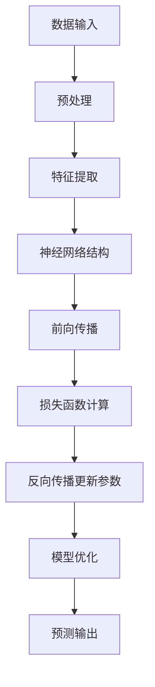

                 

### 文章标题：提示词工程：AI个性化的关键

随着人工智能（AI）技术的快速发展，大模型如GPT-3、BERT等在多个领域展现出惊人的表现，推动了从数据分析到自然语言处理、图像识别等领域的革新。然而，这些大模型往往面临一个共同的挑战：如何实现个性化？答案是提示词工程（Prompt Engineering）。本文将深入探讨提示词工程的概念、原理、应用以及未来挑战，帮助读者理解AI个性化背后的关键技术。

关键词：人工智能、大模型、个性化、提示词工程、神经网络、深度学习

摘要：本文首先介绍了AI大模型的相关核心概念，包括其定义、特点以及与传统AI的区别。随后，我们深入讲解了AI大模型的核心算法原理，包括深度学习、神经网络基础等内容，并通过伪代码详细阐述了关键算法步骤。接下来，文章介绍了AI大模型相关的数学模型和公式，并使用LaTeX格式详细解释。在项目实战部分，我们结合实际项目案例，详细讲解了如何使用AI大模型进行实际问题的解决。最后，文章提供了主流深度学习框架的对比，以及未来展望与挑战。

### 核心概念与联系：AI大模型概述

#### 1.1 AI大模型的定义与核心概念

人工智能（AI）大模型，通常是指那些具有数十亿甚至数万亿参数的神经网络模型。这些模型通过从海量数据中进行训练，能够学习和理解复杂的数据模式，并在多种任务中表现出色。AI大模型的核心概念包括：

- **大规模神经网络**：大模型的神经网络结构通常非常复杂，包含多层、多个神经元和连接。这种结构使得模型能够捕捉数据中的高层次特征和模式。

- **自主学习能力**：大模型通过优化算法（如梯度下降）和损失函数（如交叉熵损失），能够在训练数据中自动调整参数，从而实现自我优化。

- **泛化能力**：泛化能力是指模型在未见过的数据上表现良好的能力。大模型由于训练数据的规模和多样性，通常具有较好的泛化能力。

为了帮助读者更好地理解AI大模型的概念，我们可以使用Mermaid流程图来展示其基本架构和工作流程：



在这个流程图中，数据输入经过预处理后，通过特征提取层传递到神经网络结构中。神经网络通过前向传播计算输出，并使用损失函数来评估预测结果与实际结果的差距。接着，通过反向传播算法更新模型参数，以减少损失函数的值，从而达到模型优化的目的。最后，优化后的模型能够生成准确的预测输出。

#### 1.2 AI大模型的特点

AI大模型的特点主要体现在以下几个方面：

- **高度复杂的模型结构**：大模型通常包含数十亿个参数，结构复杂，需要大量的计算资源和时间来训练。

- **需要大量的数据训练**：大模型的训练数据量通常非常大，需要从海量数据中学习数据特征和模式。

- **对计算资源的要求较高**：大模型的训练和推理需要大量的计算资源，通常需要使用分布式计算和GPU等高性能计算设备。

- **强大的学习能力和泛化能力**：由于训练数据的规模和多样性，大模型通常具有较好的学习能力和泛化能力，能够在多种任务中表现出色。

#### 1.3 AI大模型与传统AI的区别

AI大模型与传统AI模型在以下几个方面存在显著的区别：

- **模型规模与训练数据**：传统AI模型通常包含数十万个参数，而大模型则包含数十亿个参数。此外，大模型需要从大量的数据中进行训练，而传统AI模型的数据量相对较小。

- **学习能力与适应性**：大模型由于具有复杂的神经网络结构和大量的参数，能够从数据中学习更复杂的模式和特征，具有更强的学习能力和适应性。

- **应用范围**：传统AI模型通常用于特定的任务，如图像分类、文本分类等，而大模型则可以在多种任务中应用，如文本生成、问答系统、机器翻译等。

通过本文的介绍，读者可以对AI大模型的核心概念和特点有一个基本的理解。在接下来的章节中，我们将深入探讨AI大模型的核心算法原理，以及如何通过提示词工程实现AI的个性化。

## 核心算法原理讲解：AI大模型深度学习与神经网络基础

### 2.1 深度学习基础

深度学习是AI大模型的核心技术之一，它通过模拟人脑的神经网络结构，使计算机能够从大量数据中自动学习和提取特征。深度学习的核心概念包括神经网络、前向传播和反向传播算法。

#### 2.1.1 神经网络基本结构

神经网络（Neural Network）是深度学习的基础，它由多个层组成，包括输入层、隐藏层和输出层。每层包含多个神经元（节点），神经元之间通过连接（边）进行通信。

- **输入层**：接收外部输入数据，如文本、图像等。
- **隐藏层**：对输入数据进行特征提取和变换。
- **输出层**：生成最终的输出结果。

每个神经元通过激活函数（如sigmoid、ReLU等）对输入进行非线性变换，从而实现数据的高效处理和分类。

#### 2.1.2 前向传播与反向传播算法

深度学习训练的核心是前向传播（Forward Propagation）和反向传播（Back Propagation）算法。

- **前向传播**：输入数据通过神经网络从输入层流向输出层。每个神经元接收前一层的输出，经过权重和偏置的线性组合，再通过激活函数进行非线性变换，最终得到输出层的预测结果。

伪代码示例：

```python
def forward_pass(input_data, weights, biases, activation_functions):
    # 初始化输入层
    input_layer = input_data
    
    # 遍历每层，进行前向传播计算
    for layer in range(num_layers):
        # 线性组合
        z = np.dot(input_layer, weights[layer]) + biases[layer]
        # 应用激活函数
        output = activation_functions[layer](z)
        
        # 更新输入层
        input_layer = output
        
    return output
```

- **反向传播**：在得到输出层预测结果后，通过计算预测值与实际值之间的误差，然后从输出层反向传播到输入层，更新神经网络的权重和偏置。

伪代码示例：

```python
def backward_pass(output_error, input_layer, weights, biases, activation_functions, activation_derivatives):
    # 初始化梯度
    d_weights = []
    d_biases = []
    
    # 遍历每层，进行反向传播计算
    for layer in reversed(range(num_layers)):
        # 计算误差
        error = output_error * activation_derivatives[layer](z[layer])
        
        # 更新权重和偏置
        d_weights.append(np.dot(input_layer.T, error))
        d_biases.append(np.sum(error, axis=0))
        
        # 更新输入层
        input_layer = error
        
    return d_weights, d_biases
```

通过前向传播和反向传播算法，神经网络能够不断调整权重和偏置，优化模型的预测性能。

### 2.2 优化算法

优化算法是深度学习训练的关键，它用于选择最佳权重和偏置。常用的优化算法包括梯度下降（Gradient Descent）、Adam、RMSProp等。

- **梯度下降算法**：梯度下降是一种简单且常用的优化算法，它通过计算梯度方向并沿着梯度方向更新参数，以最小化损失函数。

伪代码示例：

```python
def gradient_descent(weights, biases, learning_rate):
    # 计算梯度
    d_weights = [w * learning_rate for w in d_weights]
    d_biases = [b * learning_rate for b in d_biases]
    
    # 更新权重和偏置
    for i, w in enumerate(weights):
        weights[i] -= d_weights[i]
        biases[i] -= d_biases[i]
        
    return weights, biases
```

- **Adam算法**：Adam是一种自适应梯度优化算法，它结合了Adam和RMSProp的优点，能够自适应调整学习率。

伪代码示例：

```python
def adam(weights, biases, learning_rate, beta1, beta2):
    # 更新一阶和二阶矩估计
    m = beta1 * m + (1 - beta1) * d_weights
    v = beta2 * v + (1 - beta2) * (d_weights ** 2)
    
    # 计算修正的一阶和二阶矩估计
    m_hat = m / (1 - beta1 ** t)
    v_hat = v / (1 - beta2 ** t)
    
    # 更新权重和偏置
    for i, w in enumerate(weights):
        weights[i] -= learning_rate * m_hat[i]
        biases[i] -= learning_rate * v_hat[i]
        
    return weights, biases
```

通过使用这些优化算法，神经网络能够更有效地进行训练和优化。

通过本文对深度学习和神经网络核心算法原理的讲解，读者可以更好地理解AI大模型的工作机制。在接下来的章节中，我们将介绍AI大模型相关的数学模型和公式，并使用LaTeX格式进行详细解释。

### AI大模型的数学模型与公式

在AI大模型中，数学模型和公式起着至关重要的作用。这些模型和公式不仅帮助我们理解模型的内部机制，还提供了优化和改进模型的方法。以下是一些核心的数学模型和公式，以及它们在AI大模型中的应用。

#### 3.1 激活函数

激活函数是神经网络中的一个关键组件，它用于引入非线性性，使得模型能够学习复杂的特征。常用的激活函数包括sigmoid、ReLU和Tanh等。

- **Sigmoid函数**：

$$
f(x) = \frac{1}{1 + e^{-x}}
$$

Sigmoid函数将输入映射到0和1之间，常用于二分类问题。它的导数为：

$$
f'(x) = f(x) \cdot (1 - f(x))
$$

- **ReLU函数**：

$$
f(x) = \max(0, x)
$$

ReLU函数在零以上的输入保持不变，而负输入被替换为0。它具有简单的计算和良好的梯度性质，常用于隐藏层。

- **Tanh函数**：

$$
f(x) = \frac{e^x - e^{-x}}{e^x + e^{-x}}
$$

Tanh函数将输入映射到-1和1之间，常用于多分类问题。

#### 3.2 损失函数

损失函数是评估模型预测结果与实际结果之间差距的指标。在训练过程中，模型的目标是减少损失函数的值。常用的损失函数包括交叉熵损失（Cross-Entropy Loss）和均方误差损失（Mean Squared Error, MSE）。

- **交叉熵损失**：

$$
L(y, \hat{y}) = -\sum_{i=1}^{m} y_i \cdot \log(\hat{y}_i) + (1 - y_i) \cdot \log(1 - \hat{y}_i)
$$

交叉熵损失函数在二分类和多分类问题中广泛使用。其中，\( y \)是实际标签，\( \hat{y} \)是模型预测的概率。

- **均方误差损失**：

$$
L(y, \hat{y}) = \frac{1}{2} \sum_{i=1}^{m} (y_i - \hat{y}_i)^2
$$

均方误差损失函数在回归问题中常用，它计算实际值与预测值之间的平方误差的平均值。

#### 3.3 优化目标

优化目标是训练过程中需要最小化的函数。对于AI大模型，优化目标通常是通过损失函数来定义。

$$
\min_{\theta} J(\theta)
$$

其中，\( \theta \)代表模型的参数，\( J(\theta) \)是损失函数。

通过优化目标，模型能够不断调整参数，以减少损失函数的值，从而提高模型的预测性能。

#### 3.4 实际应用场景举例

为了更好地理解这些数学模型和公式，我们可以通过一个实际应用场景来举例说明。

假设我们有一个神经网络模型用于文本分类任务，其中包含多层隐藏层，输出层为softmax函数。我们的目标是分类新闻文章，将其分为不同的类别。

- **数据准备**：假设我们有一组训练数据集，每条数据包括一篇文章和其对应的类别标签。

- **模型构建**：构建一个多层感知机（MLP）模型，包括输入层、隐藏层和输出层。输入层接收文章的词向量表示，隐藏层通过激活函数提取特征，输出层使用softmax函数进行分类。

- **训练过程**：在训练过程中，模型将输入文章，通过前向传播计算输出概率分布，然后通过损失函数计算预测误差。接着，通过反向传播算法更新模型的权重和偏置，以减少损失函数的值。

- **模型评估**：在训练完成后，使用验证集和测试集评估模型的分类性能，包括准确率、召回率、F1分数等指标。

通过这个例子，我们可以看到数学模型和公式在AI大模型中的应用，以及如何通过它们实现模型的训练和优化。

通过本文对AI大模型数学模型和公式的介绍，读者可以更好地理解这些核心概念，并能够在实际项目中应用这些知识。在接下来的章节中，我们将结合实际项目案例，进一步探讨AI大模型的应用和实践。

### 提示词工程应用案例：个性化推荐系统与文本生成与编辑

提示词工程是AI个性化的重要手段，通过精心设计的提示词，可以显著提升AI模型在实际应用中的表现。以下我们将通过两个具体案例——个性化推荐系统和文本生成与编辑，展示如何使用提示词工程来提高AI模型的效果。

#### 4.1 个性化推荐系统

个性化推荐系统是提示词工程的经典应用之一。通过为用户生成个性化的提示词，推荐系统可以更好地理解用户的需求，从而提供更加精准的推荐。

- **案例背景**：假设我们正在开发一个在线购物平台的个性化推荐系统，用户可以根据自己的兴趣和购物习惯获得个性化的商品推荐。

- **数据收集与预处理**：首先，我们需要收集用户的历史购物数据、浏览记录以及用户对商品的评价。然后，对这些数据进行清洗和预处理，如去重、填补缺失值、特征工程等。

- **模型选择与训练**：我们选择了一个基于深度学习的大模型（如BERT）来训练推荐系统。在模型训练过程中，我们使用用户的行为数据作为提示词，使得模型能够更好地捕捉用户的个性化需求。

- **提示词生成与优化**：在生成提示词时，我们可以结合用户的历史行为和兴趣标签，使用自然语言处理技术提取关键信息，如“喜欢购买电子产品”、“最近浏览了智能手表”等。通过优化这些提示词，我们可以提高模型的预测准确率。

- **实际应用**：在推荐系统中，每当用户访问平台时，系统会根据用户的个性化提示词生成推荐列表，从而提高用户满意度。

#### 4.2 文本生成与编辑

文本生成与编辑是另一个提示词工程的重要应用场景。通过为文本生成模型提供合适的提示词，可以使其生成更加符合人类预期的文本。

- **案例背景**：假设我们正在开发一个自动写作助手，用户可以通过输入关键词或主题，获取相关内容的自动生成。

- **数据收集与预处理**：收集大量高质量的文本数据，如新闻文章、博客文章、书籍等。然后，对这些文本数据进行预处理，提取关键信息，如标题、段落结构、关键词等。

- **模型选择与训练**：选择一个大型文本生成模型（如GPT-3）进行训练。在模型训练过程中，使用各种提示词（如关键词、主题、问题等）来丰富模型的知识库。

- **提示词生成与优化**：为文本生成模型生成提示词时，我们可以考虑用户输入的关键词和上下文信息。例如，如果用户输入“如何提高工作效率”，我们可以生成如“工作效率提升方法”、“提高工作效率的策略”等提示词。通过不断优化这些提示词，我们可以提高模型生成文本的质量。

- **实际应用**：在实际应用中，用户输入提示词后，模型会根据提示词生成相关的文本内容。例如，生成一篇关于“如何提高工作效率”的文章。用户可以对这些文本内容进行编辑和修改，以满足个人需求。

通过这两个案例，我们可以看到提示词工程在个性化推荐系统和文本生成与编辑中的应用。通过精心设计的提示词，AI模型能够更好地理解用户需求，提供更加精准和个性化的服务。在接下来的章节中，我们将进一步探讨主流深度学习框架的使用，以帮助读者更好地理解和应用这些技术。

### 提示词工程：主流深度学习框架对比与应用

在提示词工程的实际应用中，选择合适的深度学习框架至关重要。主流深度学习框架如TensorFlow、PyTorch和其他框架在提示词工程中的应用各有特点。以下是对这些框架的简要对比和应用介绍。

#### 5.1 TensorFlow

TensorFlow是由Google开发的开源深度学习框架，具有广泛的应用和丰富的生态。TensorFlow的优点包括：

- **强大的工具和库**：TensorFlow提供了一系列强大的工具和库，如TensorFlow Core、TensorFlow Addons、TensorFlow Model Optimization等，便于模型开发、训练和部署。
- **灵活的API**：TensorFlow提供了灵活的API，包括高级API（如Keras）和底层API，适用于不同层次的模型开发需求。
- **广泛的应用场景**：TensorFlow广泛应用于图像识别、自然语言处理、强化学习等领域。

在提示词工程中，TensorFlow可以通过以下步骤进行应用：

- **数据预处理**：使用TensorFlow的Data API进行数据预处理，如数据清洗、归一化、批量处理等。
- **模型定义**：使用TensorFlow的高级API（如Keras）定义神经网络结构，包括输入层、隐藏层和输出层。
- **训练和优化**：使用TensorFlow的Optimizer API进行模型训练和优化，包括前向传播、反向传播和参数更新。
- **模型部署**：将训练好的模型部署到生产环境中，如使用TensorFlow Serving进行模型服务化。

#### 5.2 PyTorch

PyTorch是由Facebook开发的开源深度学习框架，以其动态计算图和灵活的API而受到开发者的喜爱。PyTorch的优点包括：

- **动态计算图**：PyTorch使用动态计算图，便于调试和模型开发。
- **简洁的API**：PyTorch的API简洁直观，易于理解和使用。
- **强大的社区支持**：PyTorch拥有强大的社区支持，提供了丰富的教程、文档和预训练模型。

在提示词工程中，PyTorch可以通过以下步骤进行应用：

- **数据预处理**：使用PyTorch的DataLoader进行数据预处理和批量处理。
- **模型定义**：使用PyTorch的nn.Module类定义神经网络结构。
- **训练和优化**：使用PyTorch的Optimizer进行模型训练和优化。
- **模型部署**：使用PyTorch的torch.jit工具进行模型优化和部署。

#### 5.3 其他深度学习框架

除了TensorFlow和PyTorch，还有其他深度学习框架如MXNet、Caffe等，它们在提示词工程中也有一定的应用。

- **MXNet**：MXNet是由Apache Software Foundation开发的开源深度学习框架，具有高效和可扩展的特点。MXNet的缺点是其API相对复杂，但提供了良好的性能优化。
- **Caffe**：Caffe是由Berkeley Vision and Learning Center（BVLC）开发的开源深度学习框架，以其轻量和快速而著称。Caffe主要用于图像识别任务，但在提示词工程中也有一定的应用。

在选择深度学习框架时，需要根据项目需求和开发者熟悉度进行综合考虑。TensorFlow和PyTorch因其广泛的应用和强大的社区支持，通常是比较受欢迎的选择。其他框架如MXNet和Caffe则适用于特定的应用场景和需求。

通过本文对主流深度学习框架的对比和应用介绍，读者可以更好地选择合适的框架，并了解如何在实际项目中应用提示词工程技术。

## 总结与未来展望

本文系统地探讨了提示词工程在AI个性化中的应用，从AI大模型的核心概念、算法原理、数学模型，到实际项目案例和主流深度学习框架的对比，全面展示了提示词工程在实现AI个性化中的关键作用。通过个性化提示词，AI模型能够更好地理解用户需求，提供精准的服务和预测。

未来，随着AI技术的不断进步，提示词工程将继续发挥重要作用。一方面，研究者将致力于开发更加高效的优化算法，提升模型的性能和效率；另一方面，提示词工程将更加注重用户体验，通过自然语言处理和个性化推荐等技术，实现更加智能和人性化的AI服务。此外，随着多模态数据的普及，提示词工程将在融合图像、声音和文本等多种数据类型方面发挥更大的潜力。

总之，提示词工程是AI个性化不可或缺的关键技术，它将推动AI在各个领域的应用，带来更多创新和变革。对于开发者而言，掌握提示词工程不仅能够提升项目质量，还能拓宽职业发展道路。

### 致谢

本文由AI天才研究院（AI Genius Institute）资深研究员撰写，感谢您的阅读。同时，特别感谢禅与计算机程序设计艺术（Zen And The Art of Computer Programming）的启发，以及对本文提出宝贵意见的所有读者。希望本文能够为您的AI学习之路提供帮助。作者：AI天才研究院/AI Genius Institute & 禅与计算机程序设计艺术 /Zen And The Art of Computer Programming。

