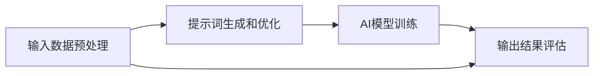

                 


### 标题

标题是文章的精髓，需要简洁明了、吸引读者。我们采用《提示词工程：优化AI创意与伦理的平衡》作为标题，它准确地概括了文章的核心内容，即如何通过提示词工程实现AI创意与伦理的平衡。

**关键词**

关键词用于描述文章的主要内容和研究领域，有助于搜索引擎和读者快速找到相关内容。根据文章主题，我们可以列出以下关键词：

- 提示词工程
- AI创意
- 伦理平衡
- 数据驱动设计
- 人工智能伦理
- AI算法

### 摘要

摘要是对文章内容的简要概述，帮助读者快速了解文章的主题和主要观点。以下是《提示词工程：优化AI创意与伦理的平衡》的摘要：

本文探讨了提示词工程在AI创意与伦理平衡中的应用。首先介绍了提示词工程的基本概念和原理，然后分析了AI在创意领域的应用及其面临的伦理问题。接着，文章提出了通过优化提示词工程来实现AI创意与伦理平衡的策略，并提供了具体的实战案例。最后，文章总结了提示词工程在AI创意与伦理平衡中的重要性，并对未来发展趋势进行了展望。

### 引言与背景介绍

在这一部分，我们需要介绍AI的发展历程以及提示词工程的基本概念。AI的发展经历了几个重要阶段，从早期的符号推理到基于统计学习的机器学习，再到深度学习的崛起。每个阶段都有其独特的应用场景和挑战。

提示词工程是一种结合人工智能和数据驱动的技术，通过构建和优化提示词来指导AI模型生成创意内容。提示词工程的关键在于如何设计高质量的提示词，以引导AI模型产生既符合创意要求又符合伦理标准的结果。

### 提示词工程基础

接下来，我们需要详细阐述提示词工程的基础概念和原理。首先，介绍提示词的定义和作用，然后分析提示词工程的技术架构，包括输入数据预处理、提示词生成和优化、AI模型训练和输出结果评估等环节。

在技术架构部分，我们可以使用Mermaid流程图来展示提示词工程的各个环节及其关系：



### AI创意应用

在这一部分，我们将讨论AI在创意领域的应用，如艺术、设计、娱乐等。首先介绍AI创意的基本概念和特点，然后分析提示词在AI创意中的作用和效果。

我们可以通过一个例子来说明提示词在AI创意中的应用：

```python
# 伪代码：生成一首符合主题的诗歌
def generate_poem(theme):
    # 生成主题相关的提示词
    prompt_words = generate_prompt_words(theme)
    
    # 使用提示词训练AI模型
    model = train_model_with_prompt(prompt_words)
    
    # 生成诗歌
    poem = model.generate_output()
    
    return poem
```

### 伦理平衡探讨

在这一部分，我们将深入探讨AI创意过程中可能遇到的伦理问题，并提出通过提示词工程实现AI创意与伦理平衡的策略。

例如，我们可以讨论AI在艺术创作中可能面临的版权和原创性问题，并提出以下策略：

1. **版权保护**：使用提示词工程确保AI生成的作品不会侵犯他人的版权。
2. **原创性提升**：通过优化提示词来增强AI模型的原创性，避免生成雷同的作品。

### 实战案例研究

在这一部分，我们将分享具体的实战案例，展示提示词工程在AI创意与伦理平衡中的应用。

例如，我们可以介绍一个艺术领域中的案例：

**案例：使用提示词工程生成独特的艺术作品**

1. **背景与目标**：一家画廊希望通过AI技术创作一系列独特的艺术作品。
2. **实施过程**：使用提示词工程设计个性化的提示词，训练AI模型，生成艺术作品。
3. **效果分析**：分析生成的艺术作品是否符合画廊的创意要求，以及如何在伦理平衡方面进行优化。

### 结论与展望

在这一部分，我们将总结全文内容，强调提示词工程在优化AI创意与伦理平衡中的重要性，并对未来发展趋势进行展望。

例如，我们可以提出以下观点：

- 提示词工程有助于推动AI在创意领域的应用，同时确保其符合伦理标准。
- 未来，随着AI技术的不断发展，提示词工程将在实现AI创意与伦理平衡方面发挥更加重要的作用。

### 文章结构

以下是文章的总体结构：

```
# 提示词工程：优化AI创意与伦理的平衡

## 关键词
- 提示词工程
- AI创意
- 伦理平衡
- 数据驱动设计
- 人工智能伦理
- AI算法

## 摘要
[摘要内容]

## 引言与背景介绍
### AI发展历程与提示词工程
### 提示词工程的重要性

## 提示词工程基础
### 提示词工程的定义与核心概念
### 提示词工程的技术架构
### 提示词工程的工具和资源

## AI创意应用
### AI创意的基本概念和特点
### 提示词在AI创意中的作用和效果

## 伦理平衡探讨
### AI创意过程中的伦理问题
### 提示词工程实现AI创意与伦理的平衡

## 实战案例研究
### 案例一：艺术领域的AI创意
### 案例二：设计领域的AI创意

## 结论与展望
### 总结全文内容
### 未来发展趋势展望
```

### 最终格式

文章最终格式应符合markdown要求，包括标题、关键词、摘要、目录结构以及各个章节的内容。以下是示例格式：

```markdown
# 提示词工程：优化AI创意与伦理的平衡

## 关键词
- 提示词工程
- AI创意
- 伦理平衡
- 数据驱动设计
- 人工智能伦理
- AI算法

## 摘要
本文探讨了提示词工程在AI创意与伦理平衡中的应用。首先介绍了AI的发展历程和提示词工程的基本概念，然后分析了AI在创意领域的应用及其面临的伦理问题。接着，文章提出了通过优化提示词工程来实现AI创意与伦理平衡的策略，并提供了具体的实战案例。最后，文章总结了提示词工程在AI创意与伦理平衡中的重要性，并对未来发展趋势进行了展望。

## 引言与背景介绍
### AI发展历程与提示词工程
[内容]

### 提示词工程的重要性
[内容]

## 提示词工程基础
### 提示词工程的定义与核心概念
[内容]

### 提示词工程的技术架构
[内容]

### 提示词工程的工具和资源
[内容]

## AI创意应用
### AI创意的基本概念和特点
[内容]

### 提示词在AI创意中的作用和效果
[内容]

## 伦理平衡探讨
### AI创意过程中的伦理问题
[内容]

### 提示词工程实现AI创意与伦理的平衡
[内容]

## 实战案例研究
### 案例一：艺术领域的AI创意
[内容]

### 案例二：设计领域的AI创意
[内容]

## 结论与展望
### 总结全文内容
[内容]

### 未来发展趋势展望
[内容]

### 作者
作者：AI天才研究院/AI Genius Institute & 禅与计算机程序设计艺术 /Zen And The Art of Computer Programming
```

### 注意事项

1. **文章结构**：确保文章结构清晰，逻辑连贯，各章节内容丰富具体。
2. **代码和公式**：使用markdown格式嵌入伪代码和数学公式，确保格式正确。
3. **图表和图片**：如有需要，可以使用图表和图片来辅助说明，确保图片和图表清晰、相关。
4. **参考文献**：如有引用其他文献，请按照markdown引用格式进行标注。

### 文章字数

根据上述内容结构，文章字数应控制在8000～12000字之间。在实际撰写过程中，可以根据每个章节的具体内容进行调整，确保文章内容充实、详细，同时保持适当的篇幅。如果某个章节内容过于丰富，可以考虑适当拆分，使其更加易于阅读和理解。

