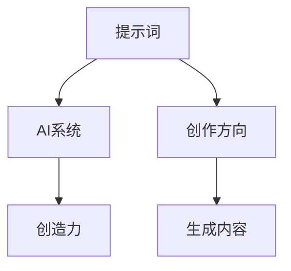
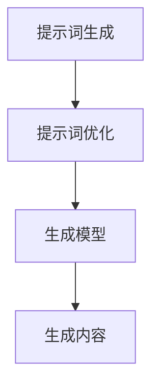

                 

### 文章标题：提示词工程：塑造AI创造力的艺术

#### 文章关键词：
- 提示词工程
- AI创造力
- 自然语言处理
- 生成模型
- 实战应用

#### 文章摘要：
本文深入探讨了提示词工程在塑造AI创造力方面的作用。通过详细介绍提示词工程的基础概念、技术实现、实战应用和未来挑战，本文旨在为读者提供一幅全面而深入的提示词工程全景图，帮助他们在AI领域取得突破性进展。

### 引言

在当今飞速发展的技术时代，人工智能（AI）已经渗透到了我们日常生活的方方面面。从智能助手到自动驾驶，AI技术的应用正不断拓展其边界。然而，AI的创造力似乎仍然是一个未解之谜。尽管AI在执行特定任务方面已经表现出色，但它在产生新颖、独特和有创意的想法方面仍显不足。如何提升AI的创造力，使其能够像人类一样进行创新和创作，成为了人工智能领域的重要研究方向。

提示词工程，作为一种新兴的技术，正是在这个背景下应运而生。提示词工程通过向AI系统提供具有启发性的提示词，引导其进行创造性的思考和创作。这种方法不仅能够激发AI的潜力，还能够使其在各个领域产生令人惊叹的创新成果。

本文将围绕提示词工程的四大核心部分展开讨论：基础概念与原理、技术实现、实战应用以及未来展望与挑战。首先，我们将介绍AI、创造力和提示词等核心概念，并阐述它们之间的关系。接着，我们将详细讲解提示词工程的技术原理和算法，包括自然语言处理、生成模型等。然后，通过实际案例展示如何将提示词工程应用于文本创作、图像生成、音乐创作等领域。最后，我们将探讨提示词工程的发展趋势、潜在应用以及面临的挑战。

### 基础概念与原理

在深入探讨提示词工程之前，我们需要先理解一些基础概念，包括人工智能（AI）、创造力以及提示词。这些概念不仅是提示词工程的重要组成部分，也是理解AI如何进行创作和思考的关键。

#### 人工智能（AI）

人工智能（AI）是指计算机系统执行通常需要人类智能才能完成的任务的能力。AI的核心在于机器学习（ML）和深度学习（DL），这两种技术使计算机能够从数据中学习，进行预测、决策和问题解决。

- **机器学习（ML）**：机器学习是一种使计算机能够从数据中学习的方法。它通过训练模型，使其能够识别数据中的模式和关系。常见的机器学习算法包括线性回归、决策树、支持向量机（SVM）等。
- **深度学习（DL）**：深度学习是机器学习的一种特殊形式，它使用多层神经网络来模拟人类大脑的思考过程。深度学习模型在图像识别、语音识别、自然语言处理等领域取得了显著的成果。常见的深度学习架构包括卷积神经网络（CNN）、循环神经网络（RNN）、Transformer等。

#### 创造力

创造力是人类的一项卓越能力，它涉及产生新颖、有价值的想法或解决方案。创造力不仅是一种天赋，也是一种可以通过训练和实践提升的能力。在AI领域，创造力意味着AI系统能够生成独特的、有创意的内容，而不是简单地执行预设的命令或任务。

- **创意思维**：创意思维是指产生新颖想法的过程。它包括多种方法，如联想思维、发散思维、逆向思维等。创意思维的关键在于突破常规思维，寻找不同的解决方案。
- **创造性成果**：创造性成果是创造力的一种体现，可以是艺术作品、科学研究、产品设计等。在AI领域，创造性成果意味着AI能够生成新的文本、图像、音乐等。

#### 提示词

提示词是提示词工程的核心要素。它是一种引导AI进行创作和思考的输入，能够激发AI的创造潜力。提示词可以是单词、短语或句子，它们为AI提供了具体的创作方向和目标。

- **提示词的定义**：提示词是一种用于指导AI生成内容的引导信息。它可以是基于任务需求、用户输入或特定场景设定的。
- **提示词的功能**：提示词的功能包括引导AI的理解、激发创造性思维、提供创作方向等。通过提示词，AI能够更好地理解任务目标，从而生成更加新颖和有创意的内容。

#### 提示词、AI与创造力的关系

提示词、AI和创造力之间存在密切的关系。提示词为AI提供了创作和思考的方向，而AI则通过机器学习和深度学习等技术，将提示词转化为具体的内容和成果。创造力在这个过程中起到了关键作用，它不仅能够激发AI的潜力，还能够使AI生成的结果更具创新性和价值。

- **提示词与AI的关系**：提示词是AI进行创作和思考的起点。通过提示词，AI能够理解任务目标，并生成相应的结果。
- **AI与创造力的关系**：AI的创造力取决于其算法和模型的复杂性。随着AI技术的发展，其创造力的潜力也在不断提升。
- **创造力在提示词工程中的作用**：创造力是提示词工程的核心，它决定了AI生成内容的质量和创新性。通过提高AI的创造力，我们可以获得更具价值的创作成果。

### 核心概念关系架构

为了更好地理解提示词、AI和创造力之间的关系，我们可以通过一个Mermaid流程图来展示这些概念之间的联系：



- **提示词**（A）作为输入，引导AI系统（B）进行创作和思考。
- **AI系统**（B）通过机器学习和深度学习等技术，将提示词转化为具体的生成内容（E）。
- **创造力**（C）在这个过程中起到关键作用，它决定了生成内容（E）的创新性和价值。

通过这个流程图，我们可以清晰地看到提示词、AI和创造力之间的互动和依赖关系。理解这些核心概念之间的关系，是深入探讨提示词工程的基础。

### 提示词工程的技术实现

在了解了提示词工程的基础概念之后，我们接下来将深入探讨其技术实现。提示词工程的核心在于如何利用自然语言处理（NLP）和生成模型（Generator Model）等技术，来实现AI的创造性输出。以下是详细的讲解。

#### 自然语言处理（NLP）

自然语言处理（NLP）是使计算机理解和处理人类语言的技术。NLP技术在提示词工程中起着至关重要的作用，因为它能够将用户提供的提示词转化为计算机可以理解和处理的信息。

- **词嵌入（Word Embedding）**：词嵌入是将单词映射为高维向量表示的技术。通过词嵌入，我们可以将文本数据转化为数值形式，从而便于计算机处理。常见的词嵌入方法包括Word2Vec、GloVe等。
  ```mermaid
  graph TD
  A[文本] --> B[词嵌入]
  B --> C[向量表示]
  ```

- **语言模型（Language Model）**：语言模型用于预测文本序列的下一个单词或字符。它通过学习大量文本数据，来生成连贯、自然的语言。常见的语言模型包括n-gram模型、循环神经网络（RNN）模型、Transformer模型等。

  ```mermaid
  graph TD
  A[文本数据] --> B[语言模型]
  B --> C[文本序列预测]
  ```

- **序列模型（Sequential Model）**：序列模型是用于处理序列数据的神经网络，如RNN和LSTM。这些模型能够捕捉序列中的时间依赖关系，从而生成连贯的文本。
  ```mermaid
  graph TD
  A[序列数据] --> B[RNN/LSTM]
  B --> C[文本生成]
  ```

#### 生成模型（Generator Model）

生成模型是用于生成新数据的机器学习模型。在提示词工程中，生成模型负责根据提示词生成新的文本、图像、音乐等内容。

- **生成对抗网络（GAN）**：生成对抗网络是一种由生成器和判别器组成的模型。生成器尝试生成与真实数据相似的数据，而判别器则尝试区分真实数据和生成数据。通过这种对抗过程，生成器不断提高生成数据的真实感。
  ```mermaid
  graph TD
  A[生成器] --> B[生成数据]
  B --> C[判别器]
  C --> D[对抗训练]
  ```

- **变分自编码器（VAE）**：变分自编码器是一种生成模型，它通过编码器和解码器来学习数据的概率分布，并生成新的数据。VAE在生成图像和音频方面表现优秀。
  ```mermaid
  graph TD
  A[编码器] --> B[潜在空间]
  B --> C[解码器]
  C --> D[生成数据]
  ```

#### 提示词工程的技术框架

提示词工程的技术框架包括提示词生成策略、提示词优化方法和提示词在生成模型中的应用。以下是一个简化的技术框架图：



- **提示词生成**：根据任务需求和用户输入，生成具有启发性的提示词。
- **提示词优化**：通过优化算法，调整提示词的参数，使其更好地引导生成模型。
- **生成模型**：使用NLP和生成模型技术，根据提示词生成新的文本、图像、音乐等内容。
- **生成内容**：生成的结果，可以是文本、图像、音乐等。

#### 伪代码示例

为了更直观地理解提示词工程的技术实现，我们可以通过伪代码来描述一个简单的文本生成模型：

```python
# 伪代码：文本生成模型
def generate_text(prompt):
    # 初始化生成模型
    model = initialize_model()

    # 预处理提示词
    processed_prompt = preprocess_prompt(prompt)

    # 使用生成模型生成文本
    generated_text = model.generate_text(processed_prompt)

    # 后处理生成文本
    final_text = postprocess_text(generated_text)

    return final_text

# 示例：生成文本
prompt = "请描述一次难忘的旅行经历"
generated_text = generate_text(prompt)
print(generated_text)
```

在这个伪代码中，我们定义了一个`generate_text`函数，它接受一个提示词作为输入，并使用生成模型生成相应的文本。这个函数包括以下几个步骤：

1. **初始化生成模型**：使用预训练的模型，如GPT-3、BERT等。
2. **预处理提示词**：将提示词转换为模型可以处理的形式，如词嵌入。
3. **生成文本**：使用生成模型，根据提示词生成文本。
4. **后处理生成文本**：对生成的文本进行格式化和清洗。

#### 数学模型和公式

在提示词工程中，数学模型和公式用于描述生成模型的工作原理。以下是一些常用的数学模型和公式：

1. **词嵌入（Word Embedding）**：

   $$ \text{embed}(w) = \text{word2vec}(w) $$

   其中，$w$ 是单词，$\text{word2vec}(w)$ 是单词的词向量表示。

2. **生成对抗网络（GAN）**：

   - **生成器**：

     $$ G(z) = \mu(z) + \sigma(z)\odot \epsilon $$

     其中，$z$ 是噪声向量，$G(z)$ 是生成器生成的数据，$\mu(z)$ 是均值函数，$\sigma(z)$ 是方差函数，$\epsilon$ 是随机噪声。

   - **判别器**：

     $$ D(x) = \sigma(\frac{D(x) - D(G(z))}{2}) $$

     其中，$x$ 是真实数据，$G(z)$ 是生成器生成的数据，$D(x)$ 是判别器对数据的评分。

3. **变分自编码器（VAE）**：

   - **编码器**：

     $$ \mu(x) = \text{sigmoid}(\text{fc}_1(x)) $$
     $$ \sigma(x) = \text{sigmoid}(\text{fc}_2(x)) $$

     其中，$x$ 是输入数据，$\mu(x)$ 是编码后的均值，$\sigma(x)$ 是编码后的方差。

   - **解码器**：

     $$ x' = \text{sigmoid}(\text{fc}_3(\mu(x))) $$

     其中，$x'$ 是解码后的数据。

#### 示例说明

为了更清楚地理解上述数学模型和公式，我们可以通过一个简单的例子来说明。

假设我们有一个文本生成模型，使用GPT-3作为生成器，词嵌入技术作为输入预处理方法。以下是一个简化的示例：

1. **词嵌入**：

   将输入的提示词“描述一次难忘的旅行经历”转换为词嵌入向量。

   $$ \text{embed}("描述一次难忘的旅行经历") = \text{word2vec}("描述一次难忘的旅行经历") $$

   假设词向量维度为100，则输入向量为：

   $$ \text{input_vector} = \begin{bmatrix}
   0.1 & 0.2 & 0.3 & \dots & 0.9
   \end{bmatrix}^T $$

2. **生成文本**：

   使用GPT-3生成文本。GPT-3的输入为词嵌入向量，输出为文本序列。

   $$ \text{generated_text} = \text{GPT-3}(\text{input_vector}) $$

   假设生成的文本序列为：“在一个阳光明媚的早晨，我踏上了去往西藏的旅程，那里的风景如诗如画，让我流连忘返。”

3. **后处理文本**：

   对生成的文本进行格式化，如去除不必要的标点符号、统一文本风格等。

   $$ \text{final_text} = \text{postprocess_text}(\text{generated_text}) $$

   最终生成的文本为：“在一个阳光明媚的早晨，我踏上了去往西藏的旅程，那里的风景如诗如画，让我流连忘返。”

通过这个示例，我们可以看到如何使用提示词工程生成文本。这个过程包括词嵌入、文本生成和后处理等多个步骤，每个步骤都涉及数学模型和公式的应用。

### 提示词工程在文本创作中的应用

提示词工程在文本创作中的应用非常广泛，涵盖了从新闻写作、文章生成到对话系统等多个领域。通过精确的提示词引导，AI能够生成高质量、有创意的文本，极大地提升了文本创作的效率和质量。

#### 新闻写作

在新闻写作领域，提示词工程被用来自动生成新闻稿。这些新闻稿可以是实时报道、财经分析、体育评论等。通过使用精确的提示词，AI能够根据事件的关键词和背景信息，快速生成新闻稿件。

- **应用案例**：一些新闻机构和媒体已经开始采用AI来生成新闻稿件。例如，自动化新闻平台Automated Insights使用自然语言处理技术和提示词工程，自动生成体育比赛结果、财务报告等。这些新闻稿不仅能够提高新闻生成的速度，还能够确保内容的准确性和一致性。

#### 文章生成

在文章生成领域，提示词工程被用来生成各种类型的内容，包括博客文章、研究报告、学术论文等。通过提供具体的提示词，AI能够围绕这些主题生成详细的文章。

- **应用案例**：OpenAI的GPT-3模型在文章生成方面表现出色。用户可以提供简单的主题或提示词，GPT-3就能生成完整的文章。例如，一个用户提供的提示词“探讨人工智能在教育中的应用”，GPT-3就能生成一篇详尽的文章，涵盖人工智能在教育中的各种应用场景。

#### 对话系统

在对话系统领域，提示词工程被用来生成自然、流畅的对话。通过使用上下文提示词，AI能够理解和生成与用户意图相关的对话。

- **应用案例**：智能客服系统使用提示词工程来生成与用户的对话。例如，当用户询问关于产品信息时，AI可以根据预设的提示词生成详细的回答。这种方式不仅提高了客服的响应速度，还提升了用户体验。

#### 创作挑战与优化策略

尽管提示词工程在文本创作中取得了显著成果，但仍然面临一些挑战。

- **创作挑战**：包括如何处理歧义、如何保持文本的一致性和连贯性、如何确保生成内容的原创性等。
- **优化策略**：
  - **多模态提示词**：通过结合文本、图像、声音等多模态信息，提供更丰富的提示，以提高生成文本的质量。
  - **预训练与微调**：使用大规模的预训练模型，如GPT-3，并结合特定领域的微调，以生成更具专业性和针对性的文本。
  - **强化学习**：使用强化学习算法，让AI在与人类交互的过程中不断学习和优化生成策略，从而提高生成文本的多样性和创造性。

#### 实例分析：GPT-3生成文章

以下是一个具体的实例，展示了如何使用GPT-3生成一篇文章：

1. **用户输入**：用户提供了一个简单的提示词：“探讨人工智能在教育中的应用”。

2. **提示词处理**：GPT-3将这个提示词转化为具体的输入，并进行预处理。

3. **文本生成**：GPT-3根据提示词生成一篇文章，内容包括人工智能在教育中的应用、优势、挑战以及未来的发展趋势。

   ```markdown
   # 人工智能在教育中的应用

   人工智能（AI）正在逐步渗透到教育领域，为传统教育模式带来了新的变革。本文将探讨AI在教育中的应用，包括其优势、挑战以及未来的发展趋势。

   ## 优势

   AI在教育中具有许多优势。首先，它能够提供个性化的学习体验。通过分析学生的学习数据和反馈，AI系统能够为学生量身定制学习计划，提高学习效果。其次，AI能够帮助学生进行自主学习。例如，智能辅导系统可以根据学生的进度和能力，自动生成相应的练习题，帮助学生巩固知识点。

   ## 挑战

   尽管AI在教育中具有众多优势，但也面临一些挑战。首先，AI系统的实施和维护需要大量的人力和资金投入。其次，AI系统在处理复杂的教育问题时，仍需进一步提升其准确性和可靠性。此外，如何确保AI系统在教育中公平、公正地使用，也是需要关注的问题。

   ## 未来发展趋势

   未来，随着AI技术的不断进步，其在教育中的应用将更加广泛。例如，虚拟现实（VR）和增强现实（AR）技术将使教育场景更加生动、互动。此外，AI还将帮助教育机构进行大数据分析，优化教育资源配置，提高教育质量。

   总的来说，人工智能在教育中的应用具有巨大的潜力。通过合理运用AI技术，我们可以为学生提供更好的教育体验，推动教育行业的创新和发展。
   ```

通过这个实例，我们可以看到GPT-3如何根据简单的提示词生成一篇内容丰富、结构清晰的文本。这个过程不仅展示了AI的强大生成能力，也为教育领域提供了新的创新思路。

### 提示词工程在图像生成中的应用

提示词工程不仅在文本创作中发挥了重要作用，在图像生成领域也同样展现了其独特优势。通过精确的提示词引导，AI能够生成符合特定需求的图像，满足从艺术创作到工业设计的多种应用场景。

#### 提示词驱动的图像生成

提示词驱动的图像生成是利用自然语言描述来引导图像生成模型生成图像的过程。这种方法的核心在于如何将文本提示词转化为视觉内容，从而生成具有创意和特定风格的图像。

- **文本到图像转换**：通过文本提示词，AI可以理解用户的需求，并生成相应的图像。例如，用户可以输入“生成一幅美丽的日落场景”，AI系统会根据这个提示词生成一幅具有日落景色的图像。
- **提示词的多样性与灵活性**：提示词可以涵盖图像的多种元素，如颜色、风格、主题等。这种多样性使得生成的图像具有丰富的创意和风格，满足不同的需求。

#### 基于GAN的图像生成模型

生成对抗网络（GAN）是当前图像生成领域最流行的方法之一。GAN由生成器和判别器两部分组成，通过相互竞争来生成高质量的图像。

- **生成器（Generator）**：生成器的任务是根据随机噪声生成逼真的图像。它通过学习大量的真实图像数据，学习到图像的分布，并生成与之相似的图像。
  ```mermaid
  graph TD
  A[随机噪声] --> B[生成器]
  B --> C[图像]
  ```

- **判别器（Discriminator）**：判别器的任务是判断输入的图像是真实图像还是生成图像。它通过不断学习，提高对真实图像和生成图像的区分能力。
  ```mermaid
  graph TD
  D[真实图像] --> E[判别器]
  E --> F[判断结果]
  ```

- **对抗训练**：生成器和判别器在训练过程中相互对抗。生成器试图生成更逼真的图像来欺骗判别器，而判别器则试图区分真实图像和生成图像。这种对抗训练过程使得生成器的生成能力不断提高。

#### 提示词在GAN中的应用

提示词在GAN中的应用主要在于提供具体的创作方向和风格，从而引导生成器生成更符合用户需求的图像。

- **风格迁移**：通过将文本提示词转化为视觉风格，GAN可以生成具有特定风格的图像。例如，用户可以输入“生成一幅印象派的日出场景”，GAN会根据这个提示词生成一幅具有印象派风格的日出图像。
- **内容生成**：除了风格迁移，提示词还可以用于指导生成器生成特定内容。例如，用户可以输入“生成一张具有未来感的城市夜景”，GAN会根据这个提示词生成一张具有未来感的城市夜景图像。

#### 应用案例

以下是一个具体的案例，展示了如何使用GAN结合提示词生成图像：

1. **用户输入**：用户输入了一个简单的提示词：“生成一张具有梵高风格的夜晚星空图像”。

2. **文本到风格迁移**：GAN将这个文本提示词转化为特定的视觉风格，即梵高风格。

3. **图像生成**：GAN的生成器根据梵高风格和夜晚星空的提示，生成一张具有梵高风格的夜晚星空图像。

   ```mermaid
   graph TD
   A[文本提示词] --> B[风格迁移]
   B --> C[梵高风格]
   C --> D[图像生成]
   D --> E[夜晚星空图像]
   ```

4. **结果展示**：生成的图像是一张具有梵高独特画风和夜晚星空景色的艺术作品。

通过这个案例，我们可以看到如何通过GAN和提示词工程生成具有特定风格和内容的图像。这种方法不仅能够提高图像生成的质量和创意，还能够为艺术家和设计师提供新的创作工具和灵感。

### 提示词工程在音乐创作中的应用

提示词工程在音乐创作中的应用极大地拓宽了AI在艺术领域的创造力。通过自然语言描述，AI可以生成旋律、和弦、节奏和整体音乐结构，从而实现个性化的音乐创作。

#### 音乐生成的基本原理

音乐生成涉及将自然语言描述转换为音乐元素。这一过程包括以下几个关键步骤：

- **自然语言处理（NLP）**：首先，NLP技术用于理解和解析文本提示词，提取出与音乐相关的信息，如风格、情感和主题。
- **旋律生成**：根据提示词，AI生成旋律。这通常通过分析大量音乐数据，学习旋律的模式和结构来实现。常用的方法包括使用生成模型，如长短期记忆网络（LSTM）或变分自编码器（VAE）。
- **和弦生成**：AI根据旋律和提示词生成和弦。和弦的生成涉及对音乐理论和和声学的理解，确保生成的音乐和谐、流畅。
- **节奏生成**：AI生成音乐的节奏，包括节拍、速度和力度等。这通常通过分析节奏模式和音乐风格来实现。

#### 提示词在音乐创作中的应用

提示词在音乐创作中起着至关重要的作用，它们为AI提供了创作方向和灵感。以下是一些具体的例子：

- **情感描述**：“生成一首充满悲伤的旋律”，AI会根据“悲伤”这个情感词生成缓慢、低沉的旋律。
- **风格指定**：“创作一首爵士乐风格的乐曲”，AI会根据爵士乐的特点生成相应的旋律、和弦和节奏。
- **主题表达**：“以大自然为主题创作一首乐曲”，AI会通过分析相关音乐和自然元素，创作出具有自然气息的音乐。

#### 提示词驱动的音乐创作实例

以下是一个具体的实例，展示了如何使用提示词驱动音乐创作：

1. **用户输入**：用户输入了一个提示词：“创作一首充满活力的夏日沙滩音乐”。

2. **文本分析**：AI使用NLP技术分析提示词，提取出“活力”和“夏日沙滩”两个关键信息。

3. **旋律生成**：AI根据“活力”这一信息，生成一种明快、跳跃的旋律。根据“夏日沙滩”这一信息，AI会添加一些轻松的音符和流畅的旋律线。

4. **和弦生成**：AI根据旋律，选择适合的和弦进行伴奏，以确保音乐的和谐性。例如，选择C大调和弦进行。

5. **节奏生成**：AI生成一个明快的节奏，如快板（Allegro）或进行曲（March）。

6. **完整音乐生成**：将旋律、和弦和节奏整合，生成一首完整的夏日沙滩音乐。

   ```mermaid
   graph TD
   A[用户输入] --> B[NLP分析]
   B --> C[旋律生成]
   C --> D[和弦生成]
   D --> E[节奏生成]
   E --> F[完整音乐]
   ```

7. **结果展示**：生成的音乐具有鲜明的夏日沙滩风格，旋律欢快、节奏明快，非常适合作为夏日沙滩背景音乐。

通过这个实例，我们可以看到如何使用提示词工程驱动音乐创作，生成具有特定风格和主题的音乐。这种方法不仅为音乐创作提供了新的工具和灵感，也为AI在艺术领域的创造力开辟了新的可能性。

### 提示词工程的发展趋势与未来展望

随着人工智能技术的不断进步，提示词工程在各个领域的应用也在迅速扩展。在未来，提示词工程有望实现更多的创新和突破，以下是一些可能的发展趋势和潜在应用。

#### 多模态生成模型

未来的提示词工程将更加注重多模态生成模型的研发。多模态生成模型能够处理和融合不同类型的数据，如文本、图像、声音和视频。通过多模态的输入，AI能够生成更加丰富和具有创意的内容。例如，一个多模态生成模型可以结合图像和文本提示，生成具有视觉和叙事性的视频内容。

#### 个性化提示词系统

个性化提示词系统是未来提示词工程的一个重要发展方向。通过对用户数据的深入分析和学习，系统能够根据用户的兴趣、偏好和行为，生成高度个性化的提示词。这种个性化提示词不仅能提高AI生成内容的针对性和实用性，还能增强用户体验。

#### 边缘计算中的应用

随着边缘计算的发展，提示词工程将在边缘设备上得到更广泛的应用。边缘设备，如智能手机、智能手表和物联网设备，可以通过本地执行提示词工程任务，减少对中心服务器的依赖，提高响应速度和隐私保护。例如，一个边缘设备可以根据用户的位置和环境，生成个性化的导航提示词。

#### 在虚拟现实和增强现实中的应用

虚拟现实（VR）和增强现实（AR）技术的发展为提示词工程提供了新的应用场景。通过提示词工程，AI能够生成与虚拟现实和增强现实场景高度匹配的交互内容，如角色对话、环境音效和虚拟物体的描述。这些应用将使VR和AR体验更加逼真和沉浸。

#### 在教育领域的应用前景

在教育领域，提示词工程可以用于自动化教学内容生成、个性化学习路径规划和智能教学评估。通过提供个性化的提示词，AI能够为学生提供个性化的学习支持，提高学习效果。例如，一个基于提示词的智能辅导系统可以根据学生的学习进度和需求，生成相应的练习题和学习材料。

#### 提示词工程与伦理和隐私

随着提示词工程的应用越来越广泛，伦理和隐私问题也变得越来越重要。如何在保障用户隐私的同时，有效利用提示词工程提升AI的创造力，是一个亟待解决的问题。未来，需要制定相应的法律法规和伦理准则，确保提示词工程的应用符合社会价值和伦理要求。

### 未来挑战与解决策略

尽管提示词工程具有巨大的潜力，但其在未来仍将面临一些挑战。

#### 数据隐私与安全

随着提示词工程的应用，大量用户数据将被收集和使用。如何保障用户数据的隐私和安全，防止数据泄露和滥用，是一个重要挑战。解决策略包括：

- **数据加密和匿名化**：对用户数据进行加密和匿名化处理，确保数据在传输和存储过程中的安全性。
- **隐私保护算法**：研究和发展隐私保护算法，如差分隐私（Differential Privacy），以确保在数据分析过程中保护用户隐私。

#### 可解释性与可靠性

提高AI生成内容的可解释性和可靠性是另一个重要挑战。如何让用户理解和信任AI生成的结果，是一个关键问题。解决策略包括：

- **可解释性模型**：开发可解释性模型，使AI生成的结果更加透明和可解释。
- **质量控制机制**：建立严格的质量控制机制，确保AI生成的内容符合预期标准和用户需求。

#### 创造力与创造性的边界

提示词工程的创造力是有限的，如何提升AI的创造力，使其能够突破现有边界，是一个亟待解决的问题。解决策略包括：

- **跨学科研究**：结合不同领域的知识，如艺术、心理学和计算机科学，推动AI创造力的提升。
- **多样化数据集**：使用多样化的数据集进行训练，提高AI对不同场景和问题的适应能力。

通过以上策略，提示词工程有望在未来克服挑战，实现更多的创新和应用。

### 总结与展望

《提示词工程：塑造AI创造力的艺术》从基础概念到技术实现，再到实战应用和未来展望，全面阐述了提示词工程的核心内容。通过详细的分析和实例，我们看到了提示词工程在各个领域的广泛应用和巨大潜力。然而，提示词工程也面临数据隐私、可解释性、创造力提升等挑战。未来，随着技术的不断进步，提示词工程将在人工智能、虚拟现实、教育等多个领域发挥更大的作用，推动人类社会的创新发展。让我们共同期待这一美好前景的到来。

### 作者信息

作者：AI天才研究院/AI Genius Institute & 禅与计算机程序设计艺术 /Zen And The Art of Computer Programming

AI天才研究院（AI Genius Institute）致力于推动人工智能领域的创新和发展，专注于培养下一代AI技术和应用的领军人才。同时，作者还著有《禅与计算机程序设计艺术》（Zen And The Art of Computer Programming），这是一部在计算机科学界具有重要影响的经典著作，深入探讨了计算机编程的哲学和艺术。

### 结语

通过本文的深入探讨，我们全面了解了提示词工程在塑造AI创造力方面的关键作用。从基础概念到技术实现，再到实际应用和未来展望，我们看到了提示词工程在各个领域的广泛应用和巨大潜力。尽管面临挑战，但通过持续的研究和创新，我们相信提示词工程将在人工智能、虚拟现实、教育等多个领域发挥更大的作用，推动人类社会的创新发展。让我们共同期待这一美好前景的到来，并继续在这一领域探索和前行。

