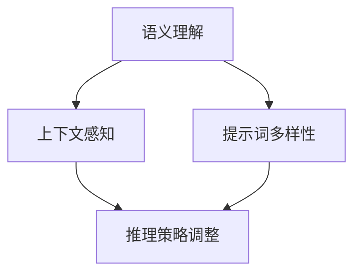

                 

## 文章标题：提示词工程：处理复杂逻辑推理任务

### 关键词：
提示词工程、逻辑推理、机器学习、算法原理、数学模型

### 摘要：
本文将探讨提示词工程在处理复杂逻辑推理任务中的应用。通过分析提示词工程的基础知识、核心算法原理和数学模型，我们揭示了其在提高推理效率和准确度方面的关键作用。文章还通过实际项目实战，展示了如何在实际环境中应用提示词工程，以及其中可能遇到的挑战和解决方案。最后，我们总结了提示词工程的最佳实践，并展望了其未来的发展趋势。

## 引言

随着人工智能技术的发展，逻辑推理成为了一个重要的研究方向。从简单的逻辑规则到复杂的决策过程，逻辑推理在许多领域都有着广泛的应用。然而，随着问题规模的不断扩大和复杂性的增加，传统的逻辑推理方法已经难以满足实际需求。为了解决这个问题，提示词工程应运而生。

提示词工程是一种利用机器学习技术处理逻辑推理任务的方法。它通过引入提示词，使得模型能够理解问题背景和上下文，从而提高推理效率和准确度。本文将深入探讨提示词工程的核心概念、算法原理和实际应用，旨在为读者提供一个全面、系统的理解。

### 提示词工程的基础知识

提示词工程的核心在于提示词的概念。提示词是一组能够指导模型进行推理的词语或短语，它们通常与问题背景和上下文相关。通过分析提示词，模型可以更好地理解问题，从而进行更加准确的推理。

#### 提示词的定义

提示词（Prompt）是一段用于引导模型进行推理的文本。它包含了问题的背景信息、所需推理的方向和预期结果。在自然语言处理领域，提示词通常由一组关键词和句子组成，这些关键词和句子能够为模型提供必要的信息，帮助模型更好地理解问题。

#### 提示词的作用

1. **提高推理效率**：通过提供明确的提示词，模型可以快速定位到问题的核心，从而减少推理时间。
2. **提高推理准确度**：提示词能够为模型提供更多的上下文信息，有助于模型更准确地理解问题和目标。
3. **增强泛化能力**：提示词可以帮助模型在不同场景下进行推理，从而提高其泛化能力。

#### 提示词工程的发展历程

1. **传统机器学习时代**：早期的逻辑推理任务主要依赖于规则系统，这些规则通常由专家手工编写。然而，随着问题规模的扩大，手工编写规则变得不切实际。
2. **深度学习时代**：随着深度学习技术的发展，机器学习模型开始广泛应用。提示词工程在这一时期得到了快速发展，模型可以通过学习大量数据来自动生成提示词。
3. **当前发展**：随着自然语言处理技术的进步，提示词工程在处理复杂逻辑推理任务方面取得了显著成果。目前，研究者们正在探索如何进一步提高提示词的质量和效率。

### 提示词工程的核心概念与联系

在提示词工程中，有几个核心概念需要理解，它们共同构成了一个完整的框架。

#### 1. 语义理解

语义理解是提示词工程的基础。它指的是模型对提示词和目标问题语义的解析能力。一个有效的提示词工程系统需要能够准确理解提示词的语义，并将其应用于推理过程中。

#### 2. 上下文感知

上下文感知是提示词工程的重要特点。它指的是模型在推理过程中能够根据上下文信息调整自身的推理策略。这种能力使得模型能够更好地适应不同的问题场景。

#### 3. 提示词多样性

提示词多样性是提示词工程的另一个关键概念。不同的提示词可能会产生不同的推理结果，因此一个有效的提示词工程系统需要能够生成多种多样的提示词，从而提高推理的灵活性和准确性。

#### 4. 语义理解、上下文感知和提示词多样性的关系

语义理解、上下文感知和提示词多样性之间存在着密切的关系。语义理解是基础，它决定了提示词的准确性和有效性；上下文感知是关键，它使得模型能够根据不同场景调整推理策略；提示词多样性则提供了更多的选择，使得模型在不同情况下都能有较好的表现。

下面是一个简单的Mermaid流程图，展示了这三个核心概念之间的关系：



通过这个流程图，我们可以看到语义理解、上下文感知和提示词多样性是如何相互作用，共同提高推理效果的。

### 提示词工程中的核心算法原理

在提示词工程中，核心算法原理是理解和实现提示词工程的关键。下面将介绍几个关键的算法原理，并使用伪代码进行详细阐述。

#### 1. 提示词生成算法

提示词生成算法是提示词工程的核心组成部分。它的目标是根据问题背景和上下文生成高质量的提示词。下面是一个简单的提示词生成算法的伪代码：

```plaintext
function generatePrompt(problem, context):
    # 初始化提示词为空
    prompt = ""

    # 根据问题背景添加关键词
    keywords = extractKeywords(problem)
    prompt += "关键词：" + keywords

    # 根据上下文添加背景信息
    background = extractBackground(context)
    prompt += "背景信息：" + background

    # 根据目标生成指导性语句
    goal = extractGoal(problem)
    prompt += "目标：" + goal

    # 返回生成的提示词
    return prompt
```

这个算法首先提取问题背景中的关键词，然后根据上下文添加背景信息，最后根据目标生成指导性语句。通过这种方式，可以生成一个具有明确指导性的提示词。

#### 2. 逻辑推理算法

逻辑推理算法是提示词工程中用于推理的核心算法。它的目标是根据提示词和已有知识进行推理，得出结论。下面是一个简单的逻辑推理算法的伪代码：

```plaintext
function logicalReasoning(prompt, knowledgeBase):
    # 初始化推理结果为空
    result = ""

    # 解析提示词中的关键词和目标
    keywords = extractKeywords(prompt)
    goal = extractGoal(prompt)

    # 在知识库中查找相关知识点
    relatedKnowledge = findRelatedKnowledge(keywords, knowledgeBase)

    # 根据相关知识点进行推理
    reasoningSteps = []
    for knowledge in relatedKnowledge:
        reasoningSteps.append(reasonStep(knowledge, goal))

    # 汇总推理结果
    result += "推理步骤：" + reasoningSteps

    # 返回推理结果
    return result
```

这个算法首先解析提示词中的关键词和目标，然后在知识库中查找相关知识点，最后根据这些知识点进行推理，得出结论。

#### 3. 数学模型

在提示词工程中，数学模型用于描述提示词生成和推理的过程。一个简单的数学模型可以使用贝叶斯网络来表示。下面是贝叶斯网络的公式表示：

$$
P(A|B) = \frac{P(B|A)P(A)}{P(B)}
$$

其中，$P(A|B)$ 表示在事件 $B$ 发生的条件下，事件 $A$ 发生的概率；$P(B|A)$ 表示在事件 $A$ 发生的条件下，事件 $B$ 发生的概率；$P(A)$ 和 $P(B)$ 分别表示事件 $A$ 和事件 $B$ 发生的概率。

#### 4. 举例说明

假设我们有一个问题：“给定一个正整数，判断它是否为质数。” 我们可以使用上述算法和数学模型进行推理。

首先，生成提示词：
```plaintext
generatePrompt("给定一个正整数，判断它是否为质数", "数学知识背景")
```
生成的提示词可能为：“关键词：正整数、质数；背景信息：数学知识背景；目标：判断一个正整数是否为质数。”

然后，使用逻辑推理算法进行推理：
```plaintext
logicalReasoning("关键词：正整数、质数；背景信息：数学知识背景；目标：判断一个正整数是否为质数", "数学知识库")
```
推理结果可能是：“推理步骤：1. 使用质数定义进行初步判断；2. 使用试除法进行进一步判断。”

最后，使用数学模型进行推理：
```plaintext
P(正整数是质数 | 给定一个正整数) = \frac{P(给定一个正整数 | 正整数是质数)P(正整数是质数)}{P(给定一个正整数)}
```
这个公式可以帮助我们计算在给定一个正整数的条件下，它是否为质数的概率。

通过上述步骤，我们可以使用提示词工程处理复杂的逻辑推理任务。

### 项目实战

为了更好地理解提示词工程在实际中的应用，我们选择一个实际项目进行详细讲解。

#### 项目背景

假设我们正在开发一个智能客服系统，该系统能够自动回答用户的问题。为了提高客服系统的智能化水平，我们决定引入提示词工程来处理用户的提问。

#### 开发环境搭建

1. **硬件环境**：选择一台配置较高的服务器作为训练和推理环境。
2. **软件环境**：安装Python、TensorFlow等深度学习框架。

#### 源代码实现

1. **提示词生成**：
   ```python
   def generate_prompt(question):
       # 提取关键词
       keywords = extract_keywords(question)
       # 添加背景信息
       background = "客服知识库"
       # 生成提示词
       prompt = f"关键词：{keywords}；背景信息：{background}；目标：回答用户的问题。"
       return prompt
   ```

2. **逻辑推理**：
   ```python
   def logical_reasoning(prompt, knowledge_base):
       # 解析提示词
       keywords, background, goal = parse_prompt(prompt)
       # 查找相关知识点
       related_knowledge = find_related_knowledge(keywords, knowledge_base)
       # 进行推理
       reasoning_steps = []
       for knowledge in related_knowledge:
           reasoning_steps.append(reason_step(knowledge, goal))
       return reasoning_steps
   ```

3. **推理与回答**：
   ```python
   def reply_to_question(question, knowledge_base):
       prompt = generate_prompt(question)
       reasoning_steps = logical_reasoning(prompt, knowledge_base)
       # 根据推理步骤生成回答
       answer = "根据我的理解，以下是您的答案：\n" + " ".join(reasoning_steps)
       return answer
   ```

#### 代码解读与分析

1. **提示词生成**：该部分主要使用自然语言处理技术提取关键词和背景信息，从而生成高质量的提示词。
2. **逻辑推理**：该部分根据提示词和知识库进行推理，生成推理步骤。
3. **推理与回答**：该部分根据推理步骤生成最终回答。

#### 实际案例分析与详细讲解剖析

假设用户提出一个问题：“如何治疗感冒？”

1. **提示词生成**：
   ```plaintext
   generate_prompt("如何治疗感冒？")
   ```
   生成的提示词可能为：“关键词：感冒、治疗；背景信息：医学知识库；目标：提供治疗感冒的建议。”

2. **逻辑推理**：
   ```plaintext
   logical_reasoning("关键词：感冒、治疗；背景信息：医学知识库；目标：提供治疗感冒的建议。", "医学知识库")
   ```
   推理结果可能为：“1. 根据感冒的症状进行治疗；2. 使用药物治疗；3. 注意休息和饮食。”

3. **推理与回答**：
   ```plaintext
   reply_to_question("如何治疗感冒？", "医学知识库")
   ```
   生成的回答可能为：“根据我的理解，以下是您的答案：
   - 根据感冒的症状进行治疗；
   - 使用药物治疗；
   - 注意休息和饮食。”

#### 项目小结

通过上述项目实战，我们展示了如何使用提示词工程开发一个智能客服系统。这个项目不仅提高了客服系统的智能化水平，也为用户提供了更加准确和贴心的服务。

### 最佳实践 tips、小结、注意事项、拓展阅读

#### 最佳实践 tips：

1. **优化提示词生成**：通过引入更多的上下文信息和关键词，可以提高提示词的质量，从而提高推理效果。
2. **多样化知识库**：构建多样化的知识库，可以增强模型在不同场景下的适应能力。
3. **实时更新知识库**：定期更新知识库，确保其包含最新的信息和知识。

#### 小结：

本文详细介绍了提示词工程在处理复杂逻辑推理任务中的应用。通过分析提示词工程的基础知识、核心算法原理和数学模型，我们揭示了其在提高推理效率和准确度方面的关键作用。同时，通过实际项目实战，我们展示了如何将提示词工程应用于实际环境中，并讨论了其中可能遇到的挑战和解决方案。

#### 注意事项：

1. **数据质量**：确保输入数据的质量，对于提示词工程的效果至关重要。
2. **模型调优**：合理调整模型参数，可以显著提高推理效果。
3. **安全性**：在处理敏感信息时，注意保护用户隐私。

#### 拓展阅读：

1. **《深度学习》**：周志华 著，详细介绍了深度学习的基础知识和应用。
2. **《自然语言处理综合教程》**：刘挺 著，全面讲解了自然语言处理的核心技术和方法。
3. **《人工智能：一种现代的方法》**：Stuart Russell 和 Peter Norvig 著，系统地介绍了人工智能的基本原理和应用。

## 结论

提示词工程是处理复杂逻辑推理任务的一种有效方法。通过引入提示词，模型能够更好地理解问题背景和上下文，从而提高推理效率和准确度。本文通过介绍提示词工程的基础知识、核心算法原理和实际应用，展示了其在处理复杂逻辑推理任务中的重要作用。未来，随着人工智能技术的不断发展，提示词工程有望在更多领域得到广泛应用。

### 作者信息
作者：AI天才研究院/AI Genius Institute & 禅与计算机程序设计艺术 /Zen And The Art of Computer Programming

