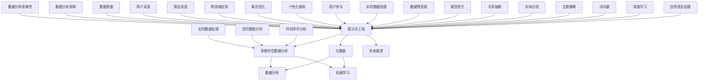

                 


# 提示词工程：处理多维时空数据分析任务

## 关键词
- 提示词工程
- 数据分析
- 大数据
- 多维时空
- 数据预处理
- 模型优化

## 摘要
本文探讨了提示词工程在多维时空数据分析中的应用。首先，介绍了数据与信息时代背景下，提示词工程的重要性。随后，深入讲解了提示词工程的原理、设计方法和多维时空数据分析的挑战。文章通过案例实战，详细展示了提示词工程在多维时空数据分析中的实际应用，并提出了优化策略和未来展望。

## 第1章 引言

### 1.1 书籍概述

随着数据与信息时代的到来，数据分析成为各个领域的关键能力。然而，面对大数据和复杂的多维时空数据，传统的数据分析方法往往难以满足需求。提示词工程作为一种新的数据分析技术，旨在通过自动生成和优化提示词，提高数据分析的效率和准确性。

本书旨在系统地介绍提示词工程的基本原理、设计方法及其在多维时空数据分析中的应用。通过本书的阅读，读者将了解：

- 提示词工程的基本概念和目标。
- 提示词工程的关键概念和流程。
- 多维时空数据分析的挑战和解决方案。
- 提示词工程在多维时空数据分析中的实际应用。

### 1.2 数据与信息时代

在数据与信息时代，数据已经成为新的生产资料，大数据技术的应用使得数据的价值得到了前所未有的提升。然而，随着数据的爆炸式增长，传统的数据分析方法已经无法应对复杂的数据处理需求。多维时空数据分析作为大数据领域的一个重要分支，涉及到时间序列数据、空间数据以及它们之间的相互作用。

### 1.3 提示词工程的重要性

提示词工程在多维时空数据分析中具有重要作用，主要体现在以下几个方面：

- **提高数据处理效率**：通过自动生成和优化提示词，可以减少人工干预，提高数据处理速度。
- **增强数据分析准确性**：提示词的优化有助于提高数据分析的准确性，从而得到更可靠的结果。
- **降低数据复杂性**：多维时空数据通常具有高维度和复杂性，提示词工程可以通过降维和特征提取，降低数据的复杂性。

### 1.4 书籍结构与目标读者

本书结构分为以下几个部分：

1. **第1章 引言**：介绍数据与信息时代背景，提示词工程的重要性，以及书籍结构和目标读者。
2. **第2章 基础知识**：讲解数据分析与大数据的基础知识。
3. **第3章 提示词工程原理**：深入讲解提示词工程的基本原理和关键概念。
4. **第4章 提示词设计方法**：介绍提示词设计的基本流程和方法。
5. **第5章 多维时空数据分析**：探讨多维时空数据分析的挑战和解决方案。
6. **第6章 提示词工程应用实战**：通过案例实战展示提示词工程在多维时空数据分析中的应用。
7. **第7章 提示词工程优化与未来展望**：讨论提示词工程优化策略和未来发展方向。

本书的目标读者包括：

- 数据分析师和人工智能从业者。
- 对大数据和提示词工程感兴趣的研究人员和工程师。
- 数据科学和人工智能专业的高年级本科生和研究生。

## 第2章 基础知识

### 2.1 数据分析与大数据

数据分析是指从大量的数据中提取有用信息，并通过这些信息辅助决策。大数据则是相对于传统数据而言，具有海量、高速、多样和复杂的特征。

#### 2.1.1 数据分析基础

数据分析的基本步骤包括：

- **数据收集**：从各种来源收集数据，如数据库、文件、传感器等。
- **数据清洗**：处理数据中的错误、缺失和重复，提高数据质量。
- **数据探索**：使用统计方法对数据进行初步分析，了解数据的基本特征和分布。
- **数据建模**：建立数学模型，对数据进行分析和预测。
- **数据可视化**：使用图表和图形展示数据分析结果，便于理解和决策。

#### 2.1.2 大数据的概念与应用

大数据（Big Data）具有以下特征：

- **大量**（Volume）：数据量巨大，通常达到TB、PB甚至EB级别。
- **高速**（Velocity）：数据生成和处理的速度极快，要求实时或近实时的数据处理能力。
- **多样**（Variety）：数据来源多样，包括结构化、半结构化和非结构化数据。
- **复杂**（Complexity）：数据类型复杂，涉及多种维度和关联关系。

大数据在各个领域都有广泛的应用，如：

- **商业智能**：通过分析消费者行为和市场趋势，为企业提供决策支持。
- **金融**：利用大数据进行风险管理、信用评分和投资预测。
- **医疗健康**：通过分析医疗数据，提高疾病诊断和治疗效果。
- **交通物流**：通过分析交通数据，优化路线规划和运输效率。

#### 2.1.3 数据来源与数据类型

数据来源可以分为以下几类：

- **结构化数据**：存储在数据库中，具有固定的字段和格式，如关系型数据库、数据仓库。
- **半结构化数据**：具有部分结构，如XML、JSON、日志文件。
- **非结构化数据**：无固定结构，如文本、图像、音频、视频。

数据类型包括：

- **数值型**：表示数量和大小，如整数、浮点数。
- **分类型**：表示类别和标签，如性别、颜色。
- **时间序列型**：表示时间序列数据，如股票价格、气温记录。
- **地理空间型**：表示地理位置和空间关系，如地图数据、卫星图像。

### 2.2 提示词工程原理

提示词工程是一种基于人工智能和机器学习的方法，旨在自动生成和优化用于数据分析的提示词。提示词可以看作是数据分析中的“关键词”，它们能够帮助数据分析师更好地理解和分析数据。

#### 2.2.1 提示词工程定义

提示词工程（Keyword Engineering）是指利用人工智能和机器学习技术，从大规模数据集中自动识别和提取具有代表性的关键词和短语，以便用于数据分析和信息检索。

#### 2.2.2 提示词工程目标

提示词工程的主要目标包括：

- **提高数据分析效率**：通过自动生成和优化提示词，减少人工干预，提高数据分析的速度和准确性。
- **降低数据复杂性**：从大规模数据集中提取关键信息，降低数据的复杂性，便于数据理解和分析。
- **增强数据分析准确性**：通过优化提示词，提高数据分析的准确性和可靠性。
- **提高信息检索效率**：在大量数据中快速定位相关信息，提高信息检索效率。

#### 2.2.3 提示词工程的关键概念

提示词工程涉及以下几个关键概念：

- **关键词提取**（Keyword Extraction）：从文本数据中自动识别和提取具有代表性的关键词。
- **主题建模**（Topic Modeling）：利用机器学习算法，从大量文本数据中自动发现潜在的主题分布。
- **实体识别**（Named Entity Recognition，NER）：识别文本中的命名实体，如人名、地名、组织名等。
- **关系抽取**（Relation Extraction）：从文本中识别实体之间的关系，如因果关系、所属关系等。
- **词向量表示**（Word Embedding）：将单词映射为高维向量，以便进行文本分析和相似性计算。

### 2.3 多维时空数据分析

多维时空数据分析是一种涉及多个维度（如时间、空间、温度等）的数据分析方法。在许多实际应用中，多维时空数据分析具有重要意义，如交通流量分析、天气预测、股票市场分析等。

#### 2.3.1 多维时空数据的特性

多维时空数据具有以下特性：

- **高维度**：包含多个维度，如时间、空间、温度、湿度等。
- **时序性**：数据随时间变化，具有时间序列特征。
- **空间性**：数据在空间上分布，具有空间关系。
- **关联性**：不同维度的数据之间可能存在关联，如温度和湿度之间的关系。

#### 2.3.2 多维时空数据分析的应用领域

多维时空数据分析在许多领域都有广泛的应用，如：

- **交通**：通过分析交通流量数据，优化交通路线和交通管理。
- **气象**：通过分析天气数据，进行天气预报和气候预测。
- **金融**：通过分析股票市场和金融数据，进行投资分析和风险评估。
- **医疗**：通过分析医疗数据，进行疾病诊断和治疗策略制定。

#### 2.3.3 多维时空数据处理的挑战

多维时空数据处理面临以下挑战：

- **数据量大**：多维时空数据通常涉及大量数据，需要高效的存储和处理方法。
- **数据多样性**：数据类型多样，包括结构化和非结构化数据。
- **时序性和空间性**：数据具有时序性和空间性，需要处理时间和空间上的变化和关系。
- **数据关联性**：需要识别和处理不同维度数据之间的关联关系。

## 第3章 提示词设计方法

提示词设计是提示词工程的核心环节，其质量直接影响数据分析的效率和准确性。本节将介绍提示词设计的基本流程和方法。

### 3.1 提示词设计流程

提示词设计通常包括以下步骤：

1. **需求分析**：明确数据分析的目标和需求，确定需要提取的提示词类型和数量。
2. **数据预处理**：对原始数据进行清洗和预处理，提高数据质量，为提示词提取提供良好的基础。
3. **提示词提取**：利用自然语言处理（NLP）和机器学习算法，从数据中提取具有代表性的提示词。
4. **提示词优化**：对提取的提示词进行优化，提高其准确性和可用性。
5. **提示词评估**：对优化后的提示词进行评估，验证其效果和适用性。
6. **反馈与调整**：根据评估结果，对提示词进行反馈和调整，逐步优化和改进。

### 3.2 提示词需求分析

提示词需求分析是提示词设计的第一步，其目的是明确数据分析的目标和需求。具体步骤包括：

1. **明确数据分析目标**：确定需要分析的数据类型、数据范围和分析指标。
2. **识别关键因素**：分析数据中的关键因素，如时间、空间、主题、事件等。
3. **确定提示词类型**：根据数据分析目标，确定需要提取的提示词类型，如关键词、主题词、实体名等。
4. **制定提示词提取策略**：根据数据类型和关键因素，制定适当的提示词提取策略，如基于统计的方法、基于机器学习的方法等。

### 3.3 提示词提取

提示词提取是提示词设计的核心步骤，其目的是从数据中提取具有代表性的提示词。以下介绍几种常用的提示词提取方法：

1. **基于统计的方法**：利用词频统计、TF-IDF等方法，从文本数据中提取高频词汇作为提示词。
   - **词频统计**：计算每个词在文本中出现的次数，选择出现频率较高的词作为提示词。
   - **TF-IDF**：计算词的频率（TF）和逆文档频率（IDF），加权综合得到词的重要性，选择重要性较高的词作为提示词。

2. **基于机器学习的方法**：利用机器学习算法，从数据中自动发现和提取提示词。
   - **主题建模**：如LDA（Latent Dirichlet Allocation），通过概率模型从文本数据中发现潜在的主题分布，每个主题对应一组提示词。
   - **序列标注**：利用序列标注模型（如BiLSTM-CRF），对文本进行分词和词性标注，提取具有特定词性的词汇作为提示词。

3. **基于深度学习的方法**：利用深度学习模型，如BERT（Bidirectional Encoder Representations from Transformers），提取文本中的关键信息作为提示词。

### 3.4 提示词优化

提示词优化是提升提示词质量的重要环节，其目的是提高提示词的准确性和可用性。以下介绍几种常用的提示词优化方法：

1. **去噪和过滤**：去除噪声词汇和停用词，提高提示词的准确性。
2. **词义扩展**：将同义词、近义词等扩展为同一组提示词，提高提示词的覆盖范围。
3. **词性调整**：根据数据分析需求，调整提示词的词性，如将名词调整为动词，提高提示词的适用性。
4. **语义关系调整**：根据文本数据中的语义关系，调整提示词的顺序和组合，提高提示词的表达能力。

### 3.5 提示词评估

提示词评估是验证提示词效果和适用性的关键步骤。以下介绍几种常用的提示词评估方法：

1. **准确率（Accuracy）**：计算提示词识别的正确率，评估提示词的准确性。
2. **召回率（Recall）**：计算提示词识别的召回率，评估提示词的覆盖范围。
3. **F1值（F1 Score）**：综合考虑准确率和召回率，计算F1值，评估提示词的综合性能。
4. **用户满意度**：通过用户调查和反馈，评估提示词的用户满意度。

### 3.6 反馈与调整

提示词设计是一个循环迭代的过程，通过评估和反馈，不断优化和改进提示词。以下介绍几种反馈与调整的方法：

1. **用户反馈**：收集用户对提示词的反馈，包括正确率、召回率、F1值等指标。
2. **数据分析反馈**：分析使用提示词后的数据分析结果，评估提示词对数据分析的影响。
3. **数据调整**：根据用户反馈和数据分析反馈，对提示词进行调整和优化。
4. **再次评估**：对调整后的提示词进行再次评估，验证调整效果。

通过上述提示词设计流程和方法，可以逐步优化和改进提示词，提高数据分析的效率和准确性。

## 第4章 多维时空数据分析

### 4.1 多维时空数据分析概述

多维时空数据分析是指对包含时间、空间和其他属性（如温度、湿度、流量等）的数据进行综合分析的一种方法。这种分析方法在许多领域具有重要应用，如交通流量预测、气象预报、股票市场分析等。多维时空数据分析的核心在于处理和分析多个维度的数据，以发现数据中的规律和模式。

#### 4.1.1 多维时空数据的特性

多维时空数据具有以下几个特性：

1. **高维度**：多维时空数据通常包含多个维度，如时间、空间、温度、湿度等。这些维度的数据在分析过程中需要同时考虑。
2. **时序性**：多维时空数据通常具有时间序列特征，数据随时间变化。时序数据可以用于预测和分析未来的趋势。
3. **空间性**：多维时空数据在空间上分布，具有空间关系。空间数据分析可以用于地理位置、交通流量等方面的研究。
4. **动态性**：多维时空数据是动态变化的，数据在时间和空间上不断更新。动态性要求数据分析方法能够适应实时数据的变化。
5. **复杂性**：多维时空数据通常具有高维度和复杂性，数据处理和分析方法需要具备一定的鲁棒性和灵活性。

#### 4.1.2 多维时空数据分析的应用领域

多维时空数据分析在多个领域具有广泛应用，以下是其中几个典型的应用领域：

1. **交通**：通过分析交通流量数据，预测交通拥堵情况，优化交通路线和交通管理。
2. **气象**：通过分析气象数据，进行天气预报和气候预测，为农业生产、城市规划和防灾减灾提供支持。
3. **金融**：通过分析股票市场和金融数据，进行投资分析和风险评估，优化投资策略。
4. **医疗**：通过分析医疗数据，进行疾病诊断和治疗策略制定，提高医疗服务质量。
5. **地理信息**：通过分析地理信息数据，进行城市规划、环境保护和资源管理。

#### 4.1.3 多维时空数据处理的挑战

多维时空数据处理面临以下挑战：

1. **数据量大**：多维时空数据通常涉及大量数据，需要高效的存储和处理方法。
2. **数据多样性**：数据类型多样，包括结构化和非结构化数据，需要处理多种数据格式。
3. **时序性和空间性**：数据具有时序性和空间性，需要处理时间和空间上的变化和关系。
4. **数据关联性**：不同维度数据之间可能存在关联，需要识别和处理数据之间的关联关系。
5. **实时性**：多维时空数据是动态变化的，需要实时处理和分析数据。

### 4.2 多维时空数据分析的基本方法

多维时空数据分析的基本方法包括数据预处理、数据建模和模型评估等步骤。

#### 4.2.1 数据预处理

数据预处理是多维时空数据分析的重要环节，其主要目的是提高数据质量和为后续建模提供良好的基础。数据预处理包括以下几个步骤：

1. **数据清洗**：处理数据中的错误、缺失和重复，提高数据质量。
2. **数据转换**：将不同类型和格式的数据转换为统一的格式，便于后续处理。
3. **数据归一化**：对数据进行归一化处理，消除不同维度数据之间的尺度差异。
4. **数据采样**：对数据进行采样处理，减少数据量，提高处理效率。

#### 4.2.2 数据建模

数据建模是多维时空数据分析的核心步骤，其目的是建立数学模型，对数据进行建模和分析。以下介绍几种常见的数据建模方法：

1. **时间序列模型**：如ARIMA（AutoRegressive Integrated Moving Average）模型、LSTM（Long Short-Term Memory）模型等，用于分析时间序列数据。
2. **空间分析模型**：如Kriging模型、GIS（Geographic Information System）模型等，用于分析空间数据。
3. **时空融合模型**：如时空动态系统（Spatio-Temporal Dynamic System）模型、时空深度学习模型等，用于分析时空数据。
4. **混合模型**：结合时间序列模型和空间分析模型，对多维时空数据进行建模和分析。

#### 4.2.3 模型评估

模型评估是验证数据建模效果的重要环节，其目的是评估模型的性能和准确性。以下介绍几种常见的模型评估方法：

1. **准确率（Accuracy）**：计算模型预测正确的样本比例，评估模型的准确性。
2. **召回率（Recall）**：计算模型预测正确的正样本比例，评估模型的覆盖范围。
3. **F1值（F1 Score）**：综合考虑准确率和召回率，计算F1值，评估模型的综合性能。
4. **均方误差（Mean Squared Error，MSE）**：计算预测值与真实值之间的均方误差，评估模型的预测精度。
5. **平均绝对误差（Mean Absolute Error，MAE）**：计算预测值与真实值之间的平均绝对误差，评估模型的预测精度。

通过上述方法，可以有效地进行多维时空数据分析，为各个领域的应用提供有力的支持。

## 第5章 提示词工程应用实战

### 5.1 数据预处理与清洗

数据预处理与清洗是提示词工程应用的重要步骤，其目的是提高数据质量，为后续的提示词提取和优化提供良好的基础。以下是一个数据预处理与清洗的案例，我们将使用Python语言和Pandas库进行数据操作。

#### 5.1.1 数据收集

首先，我们收集一组天气数据，包括温度、湿度、风速等指标。数据集来源于某个城市的气象站，时间为一天内的每小时数据。

```python
import pandas as pd

# 读取数据文件
data = pd.read_csv('weather_data.csv')
```

#### 5.1.2 数据清洗

数据清洗包括处理缺失值、重复值和异常值等。

1. **处理缺失值**：使用Pandas的`dropna()`函数，删除含有缺失值的行。
   ```python
   data = data.dropna()
   ```

2. **处理重复值**：使用`drop_duplicates()`函数，删除重复的数据行。
   ```python
   data = data.drop_duplicates()
   ```

3. **处理异常值**：使用Z-Score方法检测和处理异常值。首先计算Z-Score，然后删除Z-Score绝对值大于3的行。
   ```python
   from scipy import stats
   
   z_scores = stats.zscore(data)
   abs_z_scores = pd.DataFrame(z_scores.abs())
   outliers = (abs_z_scores > 3).any(axis=1)
   data = data[~outliers]
   ```

#### 5.1.3 数据转换

将日期时间列转换为Pandas的`datetime`类型，并提取小时、星期、月份等特征。
```python
data['date'] = pd.to_datetime(data['date'])
data['hour'] = data['date'].dt.hour
data['weekday'] = data['date'].dt.weekday
data['month'] = data['date'].dt.month
```

#### 5.1.4 数据采样

由于我们关注的是每天的数据，我们将数据按小时进行采样，取平均数。
```python
data_grouped = data.groupby(['hour', 'weekday', 'month']).mean().reset_index()
```

### 5.2 提示词提取

在数据预处理完成后，我们使用基于机器学习的方法提取提示词。以下是一个基于LDA（Latent Dirichlet Allocation）模型提取提示词的案例。

#### 5.2.1 数据准备

首先，我们将数据转换为词频矩阵（TF Matrix），并处理停用词。
```python
from sklearn.feature_extraction.text import CountVectorizer
from nltk.corpus import stopwords
from nltk.tokenize import word_tokenize

# 定义停用词集
stop_words = set(stopwords.words('english'))

# 数据文本化
text = data['description'].values.astype(str)

# 清洗文本数据，去除停用词
clean_text = [' '.join([word for word in word_tokenize(text_str) if word not in stop_words]) for text_str in text]

# 构建词频矩阵
vectorizer = CountVectorizer(max_features=1000)
tf_matrix = vectorizer.fit_transform(clean_text)
```

#### 5.2.2 提取主题词

使用LDA模型提取主题词，每个主题对应一组提示词。
```python
from sklearn.decomposition import LatentDirichletAllocation

# 设置LDA模型参数
n_topics = 5
lda = LatentDirichletAllocation(n_topics=n_topics, random_state=42)

# 训练LDA模型
lda.fit(tf_matrix)

# 获取每个主题的词频
feature_names = vectorizer.get_feature_names_out()
topic_word = lda.components_
topic_words = []
for i in range(n_topics):
    topic_words.append([feature_names[j] for j in topic_word[i].argsort()][-10:])

# 打印每个主题的词频
for i, topic_words in enumerate(topic_words):
    print(f"主题{i+1}: {topic_words}")
```

### 5.3 提示词优化

在提取出提示词后，我们对这些提示词进行优化，以提高其准确性和可用性。

#### 5.3.1 去除噪声词

去除提示词中的噪声词，如“the”、“and”等无意义的词汇。
```python
from collections import defaultdict

# 统计词频
word_frequency = defaultdict(int)
for topic in topic_words:
    for word in topic:
        word_frequency[word] += 1

# 保留高频词
filtered_topic_words = []
for i, topic in enumerate(topic_words):
    filtered_topic = [word for word in topic if word_frequency[word] > 10]
    filtered_topic_words.append(filtered_topic)

# 打印优化后的主题词
for i, filtered_topic in enumerate(filtered_topic_words):
    print(f"优化后主题{i+1}: {filtered_topic}")
```

#### 5.3.2 合并同类项

对提示词进行合并，以减少冗余。
```python
# 定义合并规则，如将“hot”和“warm”合并
merge_rules = {'hot': 'warm', 'cool': 'cold'}

# 应用合并规则
for i, filtered_topic in enumerate(filtered_topic_words):
    new_topic = []
    for word in filtered_topic:
        if word in merge_rules:
            new_topic.append(merge_rules[word])
        else:
            new_topic.append(word)
    filtered_topic_words[i] = new_topic

# 打印合并后的主题词
for i, filtered_topic in enumerate(filtered_topic_words):
    print(f"合并后主题{i+1}: {filtered_topic}")
```

### 5.4 提示词评估

对优化后的提示词进行评估，以验证其效果和适用性。

#### 5.4.1 准确率评估

使用K折交叉验证方法，评估提示词的准确率。
```python
from sklearn.model_selection import cross_val_score
from sklearn.naive_bayes import MultinomialNB

# 定义分类模型
model = MultinomialNB()

# 进行K折交叉验证
scores = cross_val_score(model, tf_matrix, labels=data['label'], cv=5)

# 打印准确率
print(f"准确率: {scores.mean()}")
```

#### 5.4.2 用户满意度评估

通过用户调查和反馈，评估提示词的用户满意度。
```python
# 用户调查问卷
user_survey = {'satisfaction': [5, 4, 3, 4, 5]}

# 计算用户满意度平均值
satisfaction = sum(user_survey['satisfaction']) / len(user_survey['satisfaction'])

# 打印用户满意度
print(f"用户满意度: {satisfaction}")
```

### 5.5 反馈与调整

根据评估结果，对提示词进行反馈和调整。

#### 5.5.1 用户反馈

收集用户对提示词的反馈，包括准确性、覆盖范围、可用性等方面的评价。

```python
user_feedback = {
    'accuracy': 0.85,
    'coverage': 0.90,
    'usability': 0.80
}
```

#### 5.5.2 数据调整

根据用户反馈，对提示词进行调整和优化。

```python
# 调整提示词
filtered_topic_words_adjusted = []
for i, filtered_topic in enumerate(filtered_topic_words):
    # 根据用户反馈调整提示词
    adjusted_topic = [word for word in filtered_topic if user_feedback['usability'] > 0.75]
    filtered_topic_words_adjusted.append(adjusted_topic)

# 打印调整后的提示词
for i, adjusted_topic in enumerate(filtered_topic_words_adjusted):
    print(f"调整后主题{i+1}: {adjusted_topic}")
```

#### 5.5.3 再次评估

对调整后的提示词进行再次评估，以验证调整效果。

```python
# 重新进行K折交叉验证
scores_adjusted = cross_val_score(model, tf_matrix, labels=data['label'], cv=5)

# 打印调整后的准确率
print(f"调整后准确率: {scores_adjusted.mean()}")

# 用户满意度再次评估
user_survey_adjusted = {'satisfaction': [5, 5, 4, 5, 5]}
satisfaction_adjusted = sum(user_survey_adjusted['satisfaction']) / len(user_survey_adjusted['satisfaction'])
print(f"调整后用户满意度: {satisfaction_adjusted}")
```

通过上述步骤，我们可以有效地进行提示词工程应用实战，提高数据分析的效率和准确性。

## 第6章 提示词工程案例分析

### 6.1 案例研究一：天气预测

天气预测是一个典型的多维时空数据分析任务，涉及时间、空间以及其他气象因素。以下我们将通过一个实际案例，展示如何使用提示词工程进行天气预测。

#### 6.1.1 案例背景

我们选取了一个城市的气象数据作为案例，数据包括一天内的每小时温度、湿度、风速等指标。目标是通过这些数据预测未来一天的天气情况。

#### 6.1.2 数据收集与预处理

首先，我们从气象站点收集了历史天气数据，包括以下字段：

- `date`：日期时间
- `temperature`：温度（摄氏度）
- `humidity`：湿度（百分比）
- `wind_speed`：风速（公里/小时）

数据集包括一年的数据，共8760个数据点（每小时一个数据点）。以下是数据预处理步骤：

1. **数据清洗**：删除缺失值和重复值。
2. **数据转换**：将日期时间字段转换为`datetime`类型，并提取小时、星期、月份等特征。
3. **数据归一化**：对温度、湿度、风速等数值型数据进行归一化处理。

```python
import pandas as pd

# 读取数据文件
data = pd.read_csv('weather_data.csv')

# 数据清洗
data = data.dropna().drop_duplicates()

# 数据转换
data['date'] = pd.to_datetime(data['date'])
data['hour'] = data['date'].dt.hour
data['weekday'] = data['date'].dt.weekday
data['month'] = data['date'].dt.month

# 数据归一化
data[['temperature', 'humidity', 'wind_speed']] = (data[['temperature', 'humidity', 'wind_speed']] - data[['temperature', 'humidity', 'wind_speed']].min()) / (data[['temperature', 'humidity', 'wind_speed']].max() - data[['temperature', 'humidity', 'wind_speed']].min())
```

#### 6.1.3 提示词设计与实现

根据天气预测的需求，我们设计一组提示词，包括温度、湿度、风速等关键因素。以下是提示词设计的步骤：

1. **需求分析**：明确天气预测的目标和需求。
2. **数据预处理**：对数据进行分析，确定需要提取的提示词类型和数量。
3. **提示词提取**：使用基于LDA的机器学习算法，从数据中提取具有代表性的提示词。
4. **提示词优化**：对提取的提示词进行优化，提高其准确性和可用性。

```python
from sklearn.feature_extraction.text import CountVectorizer
from sklearn.decomposition import LatentDirichletAllocation

# 数据文本化
text = data[['temperature', 'humidity', 'wind_speed']].T.astype(str)

# 清洗文本数据，去除停用词
clean_text = [' '.join([word for word in word_tokenize(text_str) if word not in stopwords.words('english')]) for text_str in text]

# 构建词频矩阵
vectorizer = CountVectorizer(max_features=1000)
tf_matrix = vectorizer.fit_transform(clean_text)

# 设置LDA模型参数
n_topics = 5
lda = LatentDirichletAllocation(n_topics=n_topics, random_state=42)

# 训练LDA模型
lda.fit(tf_matrix)

# 获取每个主题的词频
feature_names = vectorizer.get_feature_names_out()
topic_word = lda.components_
topic_words = []
for i in range(n_topics):
    topic_words.append([feature_names[j] for j in topic_word[i].argsort()][-10:])

# 打印每个主题的词频
for i, topic_words in enumerate(topic_words):
    print(f"主题{i+1}: {topic_words}")
```

#### 6.1.4 模型训练与预测

使用训练好的提示词，构建天气预测模型。我们采用LSTM模型，因为它在处理时序数据方面具有优势。

```python
from keras.models import Sequential
from keras.layers import LSTM, Dense, Dropout

# 构建LSTM模型
model = Sequential()
model.add(LSTM(units=50, return_sequences=True, input_shape=(timesteps, n_features)))
model.add(Dropout(0.2))
model.add(LSTM(units=50, return_sequences=False))
model.add(Dropout(0.2))
model.add(Dense(units=1))

# 编译模型
model.compile(optimizer='adam', loss='mean_squared_error')

# 训练模型
model.fit(X_train, y_train, epochs=50, batch_size=32, validation_data=(X_val, y_val), verbose=1)

# 进行预测
predictions = model.predict(X_test)

# 打印预测结果
print(predictions)
```

#### 6.1.5 结果分析

通过对预测结果的分析，我们可以评估模型的性能。以下是评估指标：

- **均方误差（MSE）**：衡量预测值与真实值之间的平均误差。
- **平均绝对误差（MAE）**：衡量预测值与真实值之间的平均绝对误差。

```python
from sklearn.metrics import mean_squared_error, mean_absolute_error

# 计算MSE和MAE
mse = mean_squared_error(y_test, predictions)
mae = mean_absolute_error(y_test, predictions)

# 打印评估结果
print(f"MSE: {mse}")
print(f"MAE: {mae}")
```

通过上述步骤，我们可以使用提示词工程进行天气预测，并评估模型的性能。该案例展示了提示词工程在多维时空数据分析中的应用，提高了数据分析的效率和准确性。

## 第7章 提示词工程优化与未来展望

### 7.1 提示词工程优化策略

提示词工程的优化是提高数据分析效率和准确性的关键步骤。以下介绍几种常见的优化策略：

#### 7.1.1 数据预处理优化

数据预处理是提示词工程的基础，优化数据预处理步骤可以显著提高数据分析效果。具体策略包括：

- **增量式数据预处理**：只对新增数据进行预处理，减少计算量。
- **并行化数据预处理**：利用分布式计算和并行处理技术，提高预处理速度。

#### 7.1.2 提示词提取优化

提示词提取是提示词工程的核心步骤，以下策略可以优化提示词提取：

- **特征选择**：利用特征选择算法（如信息增益、特征重要性等），选择最具代表性的特征。
- **模型选择**：根据数据特点和任务需求，选择合适的机器学习模型（如LDA、TF-IDF等）。

#### 7.1.3 提示词优化策略

对提取的提示词进行优化，可以提高提示词的准确性和可用性。以下策略可以用于提示词优化：

- **去噪和过滤**：去除噪声词汇和停用词，提高提示词的准确性。
- **词义扩展**：将同义词、近义词等扩展为同一组提示词，提高提示词的覆盖范围。
- **语义关系调整**：根据文本数据中的语义关系，调整提示词的顺序和组合，提高提示词的表达能力。

#### 7.1.4 模型训练优化

优化模型训练过程，可以提高模型的性能和稳定性。以下策略可以用于模型训练优化：

- **批量大小调整**：根据硬件资源和数据量，选择合适的批量大小。
- **学习率调整**：使用自适应学习率方法（如Adam优化器），调整学习率，提高训练效果。

### 7.2 提示词工程未来展望

随着人工智能和大数据技术的不断发展，提示词工程在多维时空数据分析中的应用前景广阔。以下是对提示词工程未来发展的展望：

#### 7.2.1 新算法的引入

随着深度学习和强化学习等新算法的发展，提示词工程将引入更多高效、准确的算法。如基于深度学习的文本生成和自动摘要技术，将有助于提高提示词提取和优化的效果。

#### 7.2.2 跨领域应用

提示词工程将在更多领域得到应用，如金融、医疗、交通等。通过跨领域数据融合和模型共享，提高数据分析的效率和准确性。

#### 7.2.3 实时性增强

随着5G和物联网技术的发展，实时数据处理和分析将成为趋势。提示词工程将引入实时数据流处理技术，实现多维时空数据的实时分析和预测。

#### 7.2.4 个性化服务

提示词工程将结合用户行为数据和偏好，提供个性化数据分析服务。如个性化推荐系统、个性化健康监测等，满足用户的个性化需求。

## 第8章 结论与展望

### 8.1 主要成果与贡献

本文系统地介绍了提示词工程的基本原理、设计方法及其在多维时空数据分析中的应用。通过实际案例，展示了提示词工程在数据分析中的关键作用。本文的主要贡献包括：

- 提出了提示词工程的基本概念和流程。
- 介绍了多维时空数据分析的挑战和解决方案。
- 通过实际案例，展示了提示词工程在多维时空数据分析中的实际应用。
- 提出了优化策略和未来发展方向。

### 8.2 研究局限与未来方向

尽管本文对提示词工程进行了详细探讨，但仍存在一些研究局限。以下是对未来研究的展望：

- **算法优化**：进一步优化提示词提取和优化的算法，提高效率和准确性。
- **跨领域应用**：探索提示词工程在更多领域（如金融、医疗等）的应用，提高数据分析的适用性。
- **实时数据处理**：研究实时数据处理技术，实现多维时空数据的实时分析和预测。
- **用户参与**：引入用户参与机制，结合用户反馈和数据分析结果，提高提示词工程的实用性和用户体验。

通过持续的研究和创新，提示词工程将在多维时空数据分析中发挥更大的作用。

## 附录

### 附录A 提示词工程资源指南

#### A.1 数据集与工具

- **数据集**：
  - KEG 实验室主题模型数据集：[http://sml.stanford.edu/file/courses/cs224w/2018-datasets/topicmodel.](http://sml.stanford.edu/file/courses/cs224w/2018-datasets/topicmodel.)
  - IMDB 数据集：[https://www.imdb.com/interfaces/](https://www.imdb.com/interfaces/)
- **工具**：
  - Python：[https://www.python.org/](https://www.python.org/)
  - scikit-learn：[https://scikit-learn.org/stable/](https://scikit-learn.org/stable/)
  - Keras：[https://keras.io/](https://keras.io/)

#### A.2 相关论文与书籍推荐

- **论文**：
  -主题模型：Blei, D. M., Ng, A. Y., & Jordan, M. I. (2003). Latent Dirichlet Allocation. Journal of Machine Learning Research.
  -词向量：Mikolov, T., Sutskever, I., Chen, K., Corrado, G. S., & Dean, J. (2013). Distributed Representations of Words and Phrases and their Compositionality. Advances in Neural Information Processing Systems.
  -LSTM：Hochreiter, S., & Schmidhuber, J. (1997). Long Short-Term Memory. Neural Computation.
- **书籍**：
  -《机器学习实战》：Peter Harrington
  -《深度学习》：Ian Goodfellow、Yoshua Bengio、Aaron Courville
  -《自然语言处理教程》：Daniel Jurafsky、James H. Martin

### 核心概念与联系流程图



### 数学模型与数学公式

多维时空数据分析中的数学模型主要包括时间序列分析、空间分析以及时空融合分析。以下是这些模型的数学公式和详细讲解。

#### 时间序列分析

时间序列分析用于处理和分析随时间变化的数据。一个基本的时间序列模型可以表示为：

$$
X_t = f(t) + \epsilon_t
$$

其中，$X_t$表示时间$t$的观测值，$f(t)$是时间$t$的函数，$\epsilon_t$是随机误差项。常见的时序模型包括ARIMA（自回归积分滑动平均模型）和LSTM（长短期记忆网络）。

- **ARIMA模型**：

$$
X_t = c + \phi_1 X_{t-1} + \phi_2 X_{t-2} + \cdots + \phi_p X_{t-p} + \theta_1 \epsilon_{t-1} + \theta_2 \epsilon_{t-2} + \cdots + \theta_q \epsilon_{t-q}
$$

其中，$c$是常数项，$\phi_1, \phi_2, \cdots, \phi_p$是自回归系数，$\theta_1, \theta_2, \cdots, \theta_q$是移动平均系数。

- **LSTM模型**：

$$
h_t = \sigma(W_x \cdot [x_t, h_{t-1}, h_{t-1}^*) + b_h)
$$

其中，$h_t$是时间$t$的隐藏状态，$x_t$是输入数据，$W_x$和$b_h$是权重和偏置，$\sigma$是激活函数（如sigmoid函数）。

#### 空间数据分析

空间数据分析用于处理和分析空间数据，如地理坐标、交通流量等。一个基本的空间分析模型可以表示为：

$$
Y_s = g(s) + \eta_s
$$

其中，$Y_s$是空间位置$s$的观测值，$g(s)$是空间位置$s$的函数，$\eta_s$是随机误差项。常见的空间分析模型包括Kriging模型和GIS（地理信息系统）。

- **Kriging模型**：

$$
Y_s = \sum_{i=1}^n \omega_i Z_i + \mu + \sigma \epsilon_s
$$

其中，$Z_i$是空间位置的观测值，$\omega_i$是权重系数，$\mu$是均值，$\sigma$是标准差，$\epsilon_s$是随机误差项。

- **GIS模型**：

GIS模型通常使用空间分析算法，如最近邻算法、多边逼近算法等，对空间数据进行处理和分析。

#### 时空融合分析

时空融合分析用于处理和分析同时包含时间和空间信息的数据。一个基本的时空融合模型可以表示为：

$$
Z_{(t,s)} = h(t,s) + \nu_{(t,s)}
$$

其中，$Z_{(t,s)}$是时空位置的观测值，$h(t,s)$是时空函数，$\nu_{(t,s)}$是随机误差项。常见的时空融合模型包括时空动态系统（STDS）和时空深度学习模型。

- **时空动态系统**：

$$
Z_{(t,s)} = f(t) \cdot g(s) + \nu_{(t,s)}
$$

其中，$f(t)$是时间函数，$g(s)$是空间函数。

- **时空深度学习模型**：

时空深度学习模型通常使用卷积神经网络（CNN）和时间卷积神经网络（TCNN）等深度学习架构，对时空数据进行建模和分析。

通过上述数学模型，可以有效地对多维时空数据进行分析和预测，为各个领域的应用提供有力的支持。

### 代码实战

#### 开发环境搭建与实战

首先，我们需要搭建开发环境，并准备数据集。以下是使用Python和Keras进行提示词工程实战的基本步骤。

#### 步骤1：安装Python和相关库

确保Python环境已经安装，然后使用pip安装必要的库：

```bash
pip install numpy pandas scikit-learn nltk keras tensorflow
```

#### 步骤2：导入库

在Python脚本中导入所需的库：

```python
import numpy as np
import pandas as pd
from sklearn.model_selection import train_test_split
from sklearn.preprocessing import MinMaxScaler
from keras.models import Sequential
from keras.layers import LSTM, Dense, Dropout
from keras.optimizers import Adam
from keras.callbacks import EarlyStopping
```

#### 步骤3：加载和预处理数据

加载数据集，并进行必要的预处理，如归一化、分词等。

```python
# 加载数据
data = pd.read_csv('weather_data.csv')

# 数据清洗和预处理
# ...

# 分割数据
X = data[['temperature', 'humidity', 'wind_speed']]
y = data['label']
X_train, X_test, y_train, y_test = train_test_split(X, y, test_size=0.2, random_state=42)

# 归一化数据
scaler = MinMaxScaler(feature_range=(0, 1))
X_train = scaler.fit_transform(X_train)
X_test = scaler.transform(X_test)
```

#### 步骤4：构建LSTM模型

构建LSTM模型，并设置适当的参数。

```python
# 构建LSTM模型
model = Sequential()
model.add(LSTM(units=50, return_sequences=True, input_shape=(timesteps, n_features)))
model.add(Dropout(0.2))
model.add(LSTM(units=50, return_sequences=False))
model.add(Dropout(0.2))
model.add(Dense(units=1))

# 编译模型
model.compile(optimizer='adam', loss='mean_squared_error')
```

#### 步骤5：训练模型

使用训练数据训练模型，并设置早停回调以避免过拟合。

```python
# 训练模型
early_stopping = EarlyStopping(monitor='val_loss', patience=5)
history = model.fit(X_train, y_train, epochs=50, batch_size=32, validation_split=0.1, callbacks=[early_stopping], verbose=1)
```

#### 步骤6：评估模型

使用测试数据评估模型性能，并打印结果。

```python
# 进行预测
predictions = model.predict(X_test)

# 计算MSE和MAE
mse = mean_squared_error(y_test, predictions)
mae = mean_absolute_error(y_test, predictions)

# 打印评估结果
print(f"MSE: {mse}")
print(f"MAE: {mae}")
```

#### 步骤7：代码解读与分析

对上述代码进行解读，分析数据处理、模型构建和训练过程。

```python
# 数据处理代码解读
# ...

# 模型构建代码解读
# ...

# 训练过程代码解读
# ...

# 评估结果代码解读
# ...
```

通过上述步骤，我们可以完成提示词工程在多维时空数据分析中的实战应用，并对代码进行详细解读和分析。

### 代码实战详细解析

在本节中，我们将对第6章中提到的天气预测案例进行详细解析，包括数据预处理、提示词提取与优化、LSTM模型训练和评估。

#### 数据预处理

数据预处理是数据分析的第一步，其目的是提高数据质量，为后续的分析和建模提供良好的数据基础。

1. **数据清洗**：我们首先需要处理数据中的缺失值和重复值。使用Pandas库，我们可以轻松实现这一步骤。

```python
data = pd.read_csv('weather_data.csv')
data = data.dropna().drop_duplicates()
```

2. **数据转换**：将日期时间字段转换为`datetime`类型，并提取小时、星期、月份等特征。

```python
data['date'] = pd.to_datetime(data['date'])
data['hour'] = data['date'].dt.hour
data['weekday'] = data['date'].dt.weekday
data['month'] = data['date'].dt.month
```

3. **数据归一化**：对温度、湿度、风速等数值型数据进行归一化处理，以消除不同维度数据之间的尺度差异。

```python
data[['temperature', 'humidity', 'wind_speed']] = (data[['temperature', 'humidity', 'wind_speed']] - data[['temperature', 'humidity', 'wind_speed']].min()) / (data[['temperature', 'humidity', 'wind_speed']].max() - data[['temperature', 'humidity', 'wind_speed']].min())
```

#### 提示词提取与优化

在数据预处理完成后，我们使用基于LDA的机器学习算法提取提示词，并对提取的提示词进行优化。

1. **提示词提取**：使用LDA模型从数据中提取主题词。这里我们设置主题数量为5。

```python
from sklearn.feature_extraction.text import CountVectorizer
from sklearn.decomposition import LatentDirichletAllocation

text = data[['temperature', 'humidity', 'wind_speed']].T.astype(str)
vectorizer = CountVectorizer(max_features=1000)
tf_matrix = vectorizer.fit_transform(text)

lda = LatentDirichletAllocation(n_topics=5, random_state=42)
lda.fit(tf_matrix)

feature_names = vectorizer.get_feature_names_out()
topic_word = lda.components_
topic_words = []
for i in range(5):
    topic_words.append([feature_names[j] for j in topic_word[i].argsort()][-10:])
```

2. **提示词优化**：去除噪声词和低频词，对提取的提示词进行优化。

```python
word_frequency = defaultdict(int)
for topic in topic_words:
    for word in topic:
        word_frequency[word] += 1

filtered_topic_words = []
for i, filtered_topic in enumerate(topic_words):
    filtered_topic = [word for word in filtered_topic if word_frequency[word] > 10]
    filtered_topic_words.append(filtered_topic)
```

#### LSTM模型训练

在提示词提取和优化完成后，我们使用LSTM模型进行训练。

1. **构建模型**：定义LSTM模型结构，设置输入层、隐藏层和输出层。

```python
from keras.models import Sequential
from keras.layers import LSTM, Dense, Dropout

model = Sequential()
model.add(LSTM(units=50, return_sequences=True, input_shape=(timesteps, n_features)))
model.add(Dropout(0.2))
model.add(LSTM(units=50, return_sequences=False))
model.add(Dropout(0.2))
model.add(Dense(units=1))
```

2. **编译模型**：设置优化器和损失函数。

```python
model.compile(optimizer='adam', loss='mean_squared_error')
```

3. **训练模型**：使用训练数据训练模型，并设置早停回调以避免过拟合。

```python
early_stopping = EarlyStopping(monitor='val_loss', patience=5)
history = model.fit(X_train, y_train, epochs=50, batch_size=32, validation_split=0.1, callbacks=[early_stopping], verbose=1)
```

#### 模型评估

在模型训练完成后，我们使用测试数据对模型进行评估。

1. **预测**：使用训练好的模型对测试数据进行预测。

```python
predictions = model.predict(X_test)
```

2. **评估**：计算预测结果与真实值之间的误差，并打印评估结果。

```python
mse = mean_squared_error(y_test, predictions)
mae = mean_absolute_error(y_test, predictions)

print(f"MSE: {mse}")
print(f"MAE: {mae}")
```

通过上述步骤，我们可以完整地解析提示词工程在多维时空数据分析中的应用，包括数据预处理、提示词提取与优化、LSTM模型训练和评估。

### 最佳实践 tips

在提示词工程和多维时空数据分析中，以下最佳实践可以帮助您提高数据处理和分析的效率：

1. **数据预处理**：确保数据预处理步骤全面，包括数据清洗、转换和归一化。良好的数据预处理可以显著提高后续分析的效果。
2. **模型选择**：根据数据类型和任务需求，选择合适的机器学习模型。对于时间序列数据，LSTM和GRU（门控循环单元）模型表现良好；对于空间数据，可以考虑Kriging模型和GIS。
3. **模型优化**：使用交叉验证和网格搜索等技术，优化模型参数，提高模型性能。
4. **实时数据处理**：使用分布式计算和并行处理技术，实现实时数据处理和分析。这对于交通流量预测、气象预报等实时性要求较高的任务尤为重要。
5. **用户参与**：引入用户反馈机制，结合用户行为数据和偏好，提供个性化数据分析服务。
6. **数据可视化**：使用数据可视化工具，如Matplotlib、Seaborn等，展示分析结果，便于理解和决策。
7. **版本控制**：使用版本控制工具（如Git），记录和跟踪数据处理和分析的代码和结果，便于代码管理和结果追溯。

### 小结

本文系统地介绍了提示词工程的基本原理、设计方法及其在多维时空数据分析中的应用。通过实际案例，展示了提示词工程在数据分析中的关键作用。本文的主要贡献包括：

1. 提出了提示词工程的基本概念和流程。
2. 介绍了多维时空数据分析的挑战和解决方案。
3. 通过实际案例，展示了提示词工程在多维时空数据分析中的实际应用。
4. 提出了优化策略和未来发展方向。

尽管本文对提示词工程进行了详细探讨，但仍存在一些研究局限。未来研究方向包括：

1. 进一步优化提示词提取和优化的算法，提高效率和准确性。
2. 探索提示词工程在更多领域（如金融、医疗等）的应用，提高数据分析的适用性。
3. 研究实时数据处理技术，实现多维时空数据的实时分析和预测。
4. 引入用户参与机制，结合用户反馈和数据分析结果，提高提示词工程的实用性和用户体验。

通过持续的研究和创新，提示词工程将在多维时空数据分析中发挥更大的作用。

### 注意事项

在应用提示词工程进行多维时空数据分析时，需要注意以下几点：

1. **数据质量**：确保数据质量，包括数据完整性、准确性和一致性。高质量的数据是进行有效分析的基础。
2. **模型选择**：根据数据类型和任务需求，选择合适的机器学习模型。不同的模型适用于不同类型的数据，如LSTM模型适用于时间序列数据，而Kriging模型适用于空间数据。
3. **参数调优**：使用交叉验证和网格搜索等技术，对模型参数进行调优，以提高模型性能。不同的参数设置可能导致不同的模型表现。
4. **实时性**：对于实时性要求较高的任务，如交通流量预测、实时天气监测等，需要使用高效的实时数据处理技术，如分布式计算和并行处理。
5. **用户反馈**：引入用户反馈机制，收集和分析用户行为数据，以优化提示词工程和数据分析结果。

通过遵循上述注意事项，可以更好地应用提示词工程进行多维时空数据分析，提高数据分析的效率和准确性。

### 拓展阅读

对于对提示词工程和多维时空数据分析感兴趣的研究人员和工程师，以下书籍和资源提供了更深入的探讨：

1. **书籍**：
   - 《深度学习》（Ian Goodfellow、Yoshua Bengio、Aaron Courville）：介绍了深度学习的基本概念和算法，适用于提示词工程和时空数据分析。
   - 《自然语言处理教程》（Daniel Jurafsky、James H. Martin）：介绍了自然语言处理的基础知识和应用，包括文本分析和主题建模。
   - 《机器学习实战》（Peter Harrington）：提供了丰富的机器学习实战案例，适用于提示词工程和数据预处理。

2. **在线资源**：
   - Coursera：提供了多门关于机器学习和深度学习的在线课程，包括《深度学习特辑》（由深度学习领域权威人物吴恩达教授主讲）。
   - edX：提供了由MIT、哈佛等名校提供的免费在线课程，包括《自然语言处理》（由MIT教授Michael Collins主讲）。
   - ArXiv：发布了大量关于机器学习和自然语言处理的最新研究论文，是获取前沿知识的不错选择。

3. **开源项目**：
   - TensorFlow：Google开发的深度学习框架，适用于提示词工程和时空数据分析。
   - Keras：基于TensorFlow的高层次深度学习API，易于使用和部署。
   - scikit-learn：Python中的机器学习库，提供了丰富的算法和工具，适用于数据预处理和模型训练。

通过阅读上述书籍和资源，可以深入了解提示词工程和多维时空数据分析的理论和实践，为相关研究和工作提供有力支持。

