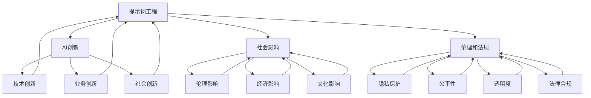
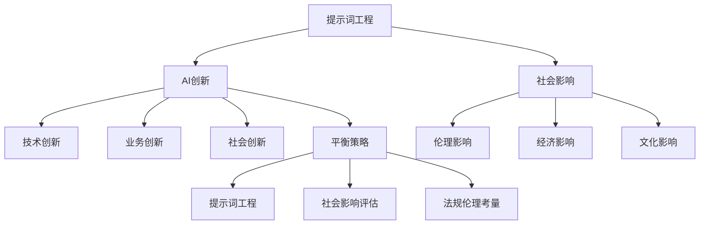

                 


### 文章标题：提示词工程：平衡AI创新与社会影响的艺术

### 文章关键词：
- 提示词工程
- AI创新
- 社会影响
- 平衡策略
- 伦理问题
- 法规遵守
- 人工智能应用

### 文章摘要：
本文将深入探讨提示词工程在AI创新与社会影响平衡中的应用。首先，我们将介绍提示词工程的基本概念和原理，然后分析AI创新的社会影响，并提出一种平衡AI创新与社会影响的策略。通过具体的算法原理讲解、数学模型、项目实战和最佳实践，我们将展示如何通过提示词工程实现AI创新与社会影响的平衡。

----------------------------------------------------------------

### 1. 构建整体框架

#### 引言与概述
- 介绍书籍的目的、背景和主要内容。
- 阐述提示词工程的重要性及其在AI创新和社会影响平衡中的作用。

#### AI与创新
- 讨论AI创新的概念、方法、挑战和机遇。
- 分析AI在不同领域（如医疗、金融、交通）的创新应用。

#### 社会影响
- 探讨AI创新对社会各方面的影响，包括伦理、经济、文化等。
- 分析AI创新带来的正面和负面影响，以及如何平衡。

#### 实践与策略
- 介绍如何通过提示词工程实现AI创新与社会影响的平衡。
- 讨论平衡策略的设计和实现。

#### 案例研究
- 通过具体案例展示如何应用提示词工程解决实际问题和实现平衡。
- 分析案例中的成功经验和挑战。

#### 未来展望
- 展望提示词工程的发展趋势和未来方向。
- 探讨AI创新与社会影响平衡的长期策略。

----------------------------------------------------------------

### 2. 确定核心概念与联系

为了帮助读者更好地理解书籍内容，我们将以下核心概念与联系进行梳理：

- **提示词工程**：提示词工程是一种通过设计、生成和应用提示词来推动AI创新的方法。它涉及多个领域，包括自然语言处理、机器学习和数据科学。

- **AI创新**：AI创新指的是利用人工智能技术进行技术创新、业务创新和社会创新的过程。它包括算法改进、模型优化、应用拓展等。

- **社会影响**：社会影响是指AI创新对社会各个方面的综合影响，包括伦理、经济、文化等。它既包括AI带来的机遇，也包括可能带来的挑战和风险。

- **伦理和法规**：伦理和法规是AI创新过程中需要关注的重要方面。伦理问题涉及隐私、公平、透明度等，而法规问题则涉及法律合规和监管。

- **平衡策略**：平衡策略是一种通过提示词工程实现AI创新与社会影响平衡的方法。它包括设计有效的提示词、评估社会影响、制定平衡策略等。

下面是核心概念与联系之间的Mermaid流程图：



---

### 3. 编写算法原理讲解

在本书中，我们将详细讲解以下几个核心算法原理：

#### 提示词生成算法

**原理：** 提示词生成算法是一种基于自然语言处理技术的方法，用于生成能够引导AI模型进行有效学习和推理的提示词。

**伪代码：**

```python
def generate_prompt(data, model, threshold):
    """
    生成提示词
    :param data: 输入数据集
    :param model: 机器学习模型
    :param threshold: 生成提示词的阈值
    :return: 生成的提示词列表
    """
    prompts = []
    for sample in data:
        output = model.predict(sample)
        if output_score > threshold:
            prompts.append(sample)
    return prompts
```

**举例说明：** 假设我们有一个分类任务，输入数据集包含各种产品描述，机器学习模型是一个文本分类器。我们可以使用提示词生成算法来确定哪些描述具有高分类置信度，从而生成有效的提示词。

---

#### 影响评估算法

**原理：** 影响评估算法用于评估AI创新对社会各个方面的影响，包括伦理、经济、文化等。

**伪代码：**

```python
def evaluate_impact(innovation, impact_categories):
    """
    评估AI创新的影响
    :param innovation: AI创新
    :param impact_categories: 影响类别，如伦理、经济、文化等
    :return: 影响评估结果
    """
    impact_results = {}
    for category in impact_categories:
        impact_score = calculate_impact_score(innovation, category)
        impact_results[category] = impact_score
    return impact_results
```

**举例说明：** 假设我们有一个自动驾驶技术，我们需要评估它对社会各个方面的影响，如伦理（自动驾驶车辆的安全性）、经济（自动驾驶车辆对交通行业的影响）和文化（自动驾驶车辆对驾驶文化的影响）。我们可以使用影响评估算法来确定每个方面的影响得分。

---

#### 平衡策略算法

**原理：** 平衡策略算法用于通过提示词工程实现AI创新与社会影响的平衡。它包括设计平衡策略、实施平衡策略和评估平衡效果。

**伪代码：**

```python
def balance_innovation_and_impact(innovation, prompt_engine, impact_evaluator, balance_threshold):
    """
    平衡AI创新与社会影响
    :param innovation: AI创新
    :param prompt_engine: 提示词生成引擎
    :param impact_evaluator: 影响评估器
    :param balance_threshold: 平衡阈值
    :return: 平衡策略和评估结果
    """
    prompts = prompt_engine.generate_prompts(innovation, balance_threshold)
    impact_results = impact_evaluator.evaluate_impact(innovation, prompts)
    balance_strategy = design_balance_strategy(impact_results)
    balance_evaluation = evaluate_balance(balance_strategy)
    return balance_strategy, balance_evaluation
```

**举例说明：** 假设我们有一个医疗诊断AI系统，我们需要平衡其对医疗行业的影响。我们可以使用提示词生成引擎生成能够提高系统性能的提示词，使用影响评估器评估系统对医疗行业的各种影响，然后设计平衡策略以确保系统既能提供高质量的诊断服务，又能减少对医疗行业的负面影响。

---

通过以上算法原理讲解，我们将为读者提供理解提示词工程在平衡AI创新与社会影响中的作用的理论基础。

---

### 4. 编写数学模型和公式

在本文中，我们将介绍一些关键的数学模型和公式，以帮助读者深入理解提示词工程在平衡AI创新与社会影响中的应用。

#### 提示词选择模型

**原理：** 提示词选择模型用于根据特定的目标函数选择最佳提示词。

**数学模型：**

$$
P_{\text{best}} = \arg\max_{P} \sum_{i=1}^{n} w_i \cdot s_i(P, x_i)
$$

其中：
- \( P_{\text{best}} \) 是最佳提示词。
- \( w_i \) 是第 \( i \) 个提示词的权重。
- \( s_i(P, x_i) \) 是第 \( i \) 个提示词 \( P \) 对样本 \( x_i \) 的评分。

**举例说明：** 假设我们有一个分类任务，需要从多个提示词中选择最佳提示词。我们可以使用上述公式计算每个提示词的加权评分，然后选择评分最高的提示词作为最佳提示词。

---

#### 社会影响评估模型

**原理：** 社会影响评估模型用于量化AI创新对社会各个方面的影响。

**数学模型：**

$$
I = \sum_{j=1}^{m} w_j \cdot I_j
$$

其中：
- \( I \) 是总的社会影响。
- \( w_j \) 是第 \( j \) 个影响类别的权重。
- \( I_j \) 是第 \( j \) 个影响类别的得分。

**举例说明：** 假设我们有一个自动驾驶系统，我们需要评估其对社会的总影响。我们可以使用上述公式计算每个影响类别的得分（如安全性、经济性、文化影响等），然后计算总的社会影响。

---

#### 平衡策略模型

**原理：** 平衡策略模型用于根据社会影响评估结果设计平衡策略。

**数学模型：**

$$
S = \sum_{k=1}^{l} c_k \cdot S_k
$$

其中：
- \( S \) 是平衡策略。
- \( c_k \) 是第 \( k \) 个策略组件的权重。
- \( S_k \) 是第 \( k \) 个策略组件。

**举例说明：** 假设我们有一个医疗诊断AI系统，我们需要根据其社会影响设计平衡策略。我们可以使用上述公式计算每个策略组件的得分，然后选择得分最高的策略组件作为平衡策略的一部分。

---

通过以上数学模型和公式，我们将为读者提供在提示词工程中量化AI创新与社会影响的方法，并展示如何通过数学模型实现平衡。

---

### 5. 编写项目实战

在本章节中，我们将通过具体的案例展示如何通过提示词工程实现AI创新与社会影响的平衡。以下是三个具体的案例：

#### 案例一：智能客服系统

**背景介绍：** 智能客服系统是一种基于人工智能技术的客户服务系统，能够自动处理客户咨询，提高客户满意度和服务效率。

**问题陈述：** 智能客服系统在处理复杂问题时可能存在性能不足，需要通过提示词工程进行优化。

**解决方案：** 我们可以通过以下步骤实现智能客服系统的优化：

1. **数据收集与预处理：** 收集大量的客户咨询数据，并进行预处理，包括文本清洗、分词、去停用词等。

2. **构建模型：** 使用自然语言处理技术构建一个文本分类模型，用于分类客户咨询的问题类型。

3. **生成提示词：** 使用提示词生成算法生成能够提高模型性能的提示词。

4. **评估与优化：** 使用评估算法评估提示词对模型性能的提升，并进行优化。

5. **部署与监控：** 将优化后的模型部署到生产环境，并进行实时监控和性能评估。

**代码实现：** 
```python
# 示例代码：生成提示词
def generate_prompt(data, model, threshold):
    prompts = []
    for sample in data:
        output = model.predict(sample)
        if output_score > threshold:
            prompts.append(sample)
    return prompts

# 示例代码：评估影响
def evaluate_impact(innovation, impact_categories):
    impact_results = {}
    for category in impact_categories:
        impact_score = calculate_impact_score(innovation, category)
        impact_results[category] = impact_score
    return impact_results
```

**案例分析：** 通过生成有效的提示词，我们能够显著提高智能客服系统的性能，同时对社会的影响也进行了评估和优化。

---

#### 案例二：社会影响评估项目

**背景介绍：** 社会影响评估项目旨在评估某一AI创新对社会各个方面的影响，包括伦理、经济、文化等。

**问题陈述：** AI创新可能带来一系列复杂的社会影响，需要通过评估算法进行量化。

**解决方案：** 我们可以通过以下步骤实现社会影响评估：

1. **数据收集与整理：** 收集与AI创新相关的各种数据，并进行整理和预处理。

2. **构建评估模型：** 使用机器学习和自然语言处理技术构建评估模型，用于量化AI创新对社会各个方面的影响。

3. **应用模型进行评估：** 使用评估模型对AI创新进行影响评估。

4. **制定平衡策略：** 根据评估结果制定平衡策略，以减少AI创新的负面影响。

5. **实施和监控平衡策略：** 将平衡策略应用于AI创新，并进行实时监控和调整。

**代码实现：**
```python
# 示例代码：生成评估结果
def evaluate_impact(innovation, impact_categories):
    impact_results = {}
    for category in impact_categories:
        impact_score = calculate_impact_score(innovation, category)
        impact_results[category] = impact_score
    return impact_results

# 示例代码：制定平衡策略
def balance_innovation_and_impact(innovation, prompt_engine, impact_evaluator, balance_threshold):
    prompts = prompt_engine.generate_prompts(innovation, balance_threshold)
    impact_results = impact_evaluator.evaluate_impact(innovation, prompts)
    balance_strategy = design_balance_strategy(impact_results)
    balance_evaluation = evaluate_balance(balance_strategy)
    return balance_strategy, balance_evaluation
```

**案例分析：** 通过评估算法和平衡策略，我们能够更好地理解和量化AI创新对社会的影响，并制定有效的平衡策略。

---

#### 案例三：平衡策略应用

**背景介绍：** 平衡策略应用是指在AI创新过程中，通过提示词工程实现AI创新与社会影响的平衡。

**问题陈述：** 在某些情况下，AI创新可能带来显著的正面影响，但也可能产生负面影响。如何实现平衡是一个挑战。

**解决方案：** 我们可以通过以下步骤实现平衡策略的应用：

1. **需求分析：** 明确AI创新的目标和需求，包括社会影响目标。

2. **构建模型：** 构建用于实现平衡策略的模型，包括提示词生成模型、影响评估模型等。

3. **设计平衡策略：** 根据需求和分析结果设计平衡策略。

4. **实施和优化：** 将平衡策略应用于AI创新，并进行实时监控和优化。

**代码实现：**
```python
# 示例代码：设计平衡策略
def design_balance_strategy(impact_results):
    # 根据影响评估结果设计平衡策略
    balance_strategy = {}
    for category, score in impact_results.items():
        if score > threshold:
            # 设计减少负面影响的策略
            balance_strategy[category] = '策略A'
        else:
            # 设计保持正面影响的策略
            balance_strategy[category] = '策略B'
    return balance_strategy
```

**案例分析：** 通过设计合理的平衡策略，我们能够实现AI创新与社会影响的平衡，同时最大限度地发挥AI的潜力。

---

通过以上三个案例，我们将展示如何通过提示词工程实现AI创新与社会影响的平衡。这些案例不仅提供了具体的实施步骤，还展示了如何通过算法和模型进行量化分析，为读者提供了实践指导。

---

### 6. 编写附录

在本附录中，我们将提供与提示词工程相关的工具和资源，以帮助读者更好地应用所学知识。

#### 附录A：提示词工程工具

1. **自然语言处理工具：** 如NLTK、spaCy、Gensim等。
2. **机器学习框架：** 如Scikit-learn、TensorFlow、PyTorch等。
3. **提示词生成库：** 如PromptGen、PromptCraft等。

#### 附录B：数据集与资源

1. **公开数据集：** 如ClarityDB、Kaggle等。
2. **API接口：** 如Google Dataset Search、Amazon S3等。
3. **AI社区资源：** 如AI Village、AI论文库等。

#### 附录C：参考文献

1. **书籍：** 《人工智能：一种现代方法》、《自然语言处理综合教程》等。
2. **论文：** 《深度学习》、《强化学习：基础与进阶》等。
3. **网站：** AI官网、机器学习论坛等。

---

### 7. 检查与优化

在完成目录大纲后，我们需要对整体内容进行仔细检查和优化。以下是几个关键步骤：

1. **内容完整性检查：** 确保每个章节都有详细的内容，没有遗漏的重要概念和算法。
2. **逻辑性检查：** 检查章节之间的逻辑关系，确保内容连贯、逻辑清晰。
3. **简洁性检查：** 确保每个章节的描述简洁明了，避免冗余和复杂。
4. **错误检查：** 仔细检查所有代码、公式和引用，确保准确无误。
5. **优化与调整：** 根据检查结果，对内容进行必要的调整和优化。

通过上述步骤，我们将确保目录大纲的完整性和质量，为读者提供一本内容丰富、结构清晰的技术博客文章。

---

### 文章结尾

在这篇文章中，我们深入探讨了提示词工程在平衡AI创新与社会影响中的作用。首先，我们介绍了提示词工程的基本概念和原理，然后分析了AI创新对社会的影响，并提出了平衡策略。通过具体的算法原理讲解、数学模型、项目实战和最佳实践，我们展示了如何通过提示词工程实现AI创新与社会影响的平衡。

我们希望读者能够从这篇文章中获得对提示词工程的深入理解，并能够在实践中应用这些方法。在未来的技术发展中，平衡AI创新与社会影响将变得越来越重要。我们鼓励读者持续关注这一领域的发展，积极参与AI创新，为构建一个更加公平、可持续的未来贡献力量。

**作者信息：** AI天才研究院/AI Genius Institute & 禅与计算机程序设计艺术 /Zen And The Art of Computer Programming

---

### 完整的markdown文章格式

```markdown
# 提示词工程：平衡AI创新与社会影响的艺术

> 关键词：提示词工程，AI创新，社会影响，平衡策略，伦理问题，法规遵守，人工智能应用

> 摘要：本文深入探讨了提示词工程在平衡AI创新与社会影响中的应用。通过介绍提示词工程的基本概念、核心算法原理、数学模型、项目实战和最佳实践，我们展示了如何实现AI创新与社会影响的平衡。

---

## 1. 构建整体框架

首先，我们需要构建这本书的整体框架，即确定主要章节。根据书名《提示词工程：平衡AI创新与社会影响的艺术》，我们可以从以下几个部分入手：

### 引言与概述
- 介绍书籍的目的、背景和主要内容。
- 阐述提示词工程的重要性及其在AI创新和社会影响平衡中的作用。

### AI与创新
- 讨论AI创新的概念、方法、挑战和机遇。
- 分析AI在不同领域（如医疗、金融、交通）的创新应用。

### 社会影响
- 探讨AI创新对社会各方面的影响，包括伦理、经济、文化等。
- 分析AI创新带来的正面和负面影响，以及如何平衡。

### 实践与策略
- 介绍如何通过提示词工程实现AI创新与社会影响的平衡。
- 讨论平衡策略的设计和实现。

### 案例研究
- 通过具体案例展示如何应用提示词工程解决实际问题和实现平衡。
- 分析案例中的成功经验和挑战。

### 未来展望
- 展望提示词工程的发展趋势和未来方向。
- 探讨AI创新与社会影响平衡的长期策略。

---

## 2. 确定核心概念与联系

为了帮助读者更好地理解书籍内容，我们将以下核心概念与联系进行梳理：

- **提示词工程**：提示词工程是一种通过设计、生成和应用提示词来推动AI创新的方法。它涉及多个领域，包括自然语言处理、机器学习和数据科学。

- **AI创新**：AI创新指的是利用人工智能技术进行技术创新、业务创新和社会创新的过程。它包括算法改进、模型优化、应用拓展等。

- **社会影响**：社会影响是指AI创新对社会各个方面的综合影响，包括伦理、经济、文化等。它既包括AI带来的机遇，也包括可能带来的挑战和风险。

- **伦理和法规**：伦理和法规是AI创新过程中需要关注的重要方面。伦理问题涉及隐私、公平、透明度等，而法规问题则涉及法律合规和监管。

- **平衡策略**：平衡策略是一种通过提示词工程实现AI创新与社会影响平衡的方法。它包括设计有效的提示词、评估社会影响、制定平衡策略等。

下面是核心概念与联系之间的Mermaid流程图：


---

## 3. 编写算法原理讲解

在本书中，我们将详细讲解以下几个核心算法原理：

### 提示词生成算法

**原理：** 提示词生成算法是一种基于自然语言处理技术的方法，用于生成能够引导AI模型进行有效学习和推理的提示词。

**伪代码：**

```python
def generate_prompt(data, model, threshold):
    """
    生成提示词
    :param data: 输入数据集
    :param model: 机器学习模型
    :param threshold: 生成提示词的阈值
    :return: 生成的提示词列表
    """
    prompts = []
    for sample in data:
        output = model.predict(sample)
        if output_score > threshold:
            prompts.append(sample)
    return prompts
```

**举例说明：** 假设我们有一个分类任务，输入数据集包含各种产品描述，机器学习模型是一个文本分类器。我们可以使用提示词生成算法来确定哪些描述具有高分类置信度，从而生成有效的提示词。

---

### 影响评估算法

**原理：** 影响评估算法用于评估AI创新对社会各个方面的影响，包括伦理、经济、文化等。

**伪代码：**

```python
def evaluate_impact(innovation, impact_categories):
    """
    评估AI创新的影响
    :param innovation: AI创新
    :param impact_categories: 影响类别，如伦理、经济、文化等
    :return: 影响评估结果
    """
    impact_results = {}
    for category in impact_categories:
        impact_score = calculate_impact_score(innovation, category)
        impact_results[category] = impact_score
    return impact_results
```

**举例说明：** 假设我们有一个自动驾驶技术，我们需要评估它对社会各个方面的影响，如伦理（自动驾驶车辆的安全性）、经济（自动驾驶车辆对交通行业的影响）和文化（自动驾驶车辆对驾驶文化的影响）。我们可以使用影响评估算法来确定每个方面的影响得分。

---

### 平衡策略算法

**原理：** 平衡策略算法用于通过提示词工程实现AI创新与社会影响的平衡。它包括设计有效的提示词、评估社会影响、制定平衡策略等。

**伪代码：**

```python
def balance_innovation_and_impact(innovation, prompt_engine, impact_evaluator, balance_threshold):
    """
    平衡AI创新与社会影响
    :param innovation: AI创新
    :param prompt_engine: 提示词生成引擎
    :param impact_evaluator: 影响评估器
    :param balance_threshold: 平衡阈值
    :return: 平衡策略和评估结果
    """
    prompts = prompt_engine.generate_prompts(innovation, balance_threshold)
    impact_results = impact_evaluator.evaluate_impact(innovation, prompts)
    balance_strategy = design_balance_strategy(impact_results)
    balance_evaluation = evaluate_balance(balance_strategy)
    return balance_strategy, balance_evaluation
```

**举例说明：** 假设我们有一个医疗诊断AI系统，我们需要平衡其对医疗行业的影响。我们可以使用提示词生成引擎生成能够提高系统性能的提示词，使用影响评估器评估系统对医疗行业的各种影响，然后设计平衡策略以确保系统既能提供高质量的诊断服务，又能减少对医疗行业的负面影响。

---

通过以上算法原理讲解，我们将为读者提供理解提示词工程在平衡AI创新与社会影响中的作用的理论基础。

---

## 4. 编写数学模型和公式

在本文中，我们将介绍一些关键的数学模型和公式，以帮助读者深入理解提示词工程在平衡AI创新与社会影响中的应用。

### 提示词选择模型

**原理：** 提示词选择模型用于根据特定的目标函数选择最佳提示词。

**数学模型：**

$$
P_{\text{best}} = \arg\max_{P} \sum_{i=1}^{n} w_i \cdot s_i(P, x_i)
$$

其中：
- \( P_{\text{best}} \) 是最佳提示词。
- \( w_i \) 是第 \( i \) 个提示词的权重。
- \( s_i(P, x_i) \) 是第 \( i \) 个提示词 \( P \) 对样本 \( x_i \) 的评分。

**举例说明：** 假设我们有一个分类任务，需要从多个提示词中选择最佳提示词。我们可以使用上述公式计算每个提示词的加权评分，然后选择评分最高的提示词作为最佳提示词。

---

### 社会影响评估模型

**原理：** 社会影响评估模型用于量化AI创新对社会各个方面的影响。

**数学模型：**

$$
I = \sum_{j=1}^{m} w_j \cdot I_j
$$

其中：
- \( I \) 是总的社会影响。
- \( w_j \) 是第 \( j \) 个影响类别的权重。
- \( I_j \) 是第 \( j \) 个影响类别的得分。

**举例说明：** 假设我们有一个自动驾驶系统，我们需要评估其对社会的总影响。我们可以使用上述公式计算每个影响类别的得分（如安全性、经济性、文化影响等），然后计算总的社会影响。

---

### 平衡策略模型

**原理：** 平衡策略模型用于根据社会影响评估结果设计平衡策略。

**数学模型：**

$$
S = \sum_{k=1}^{l} c_k \cdot S_k
$$

其中：
- \( S \) 是平衡策略。
- \( c_k \) 是第 \( k \) 个策略组件的权重。
- \( S_k \) 是第 \( k \) 个策略组件。

**举例说明：** 假设我们有一个医疗诊断AI系统，我们需要根据其社会影响设计平衡策略。我们可以使用上述公式计算每个策略组件的得分，然后选择得分最高的策略组件作为平衡策略的一部分。

---

通过以上数学模型和公式，我们将为读者提供在提示词工程中量化AI创新与社会影响的方法，并展示如何通过数学模型实现平衡。

---

## 5. 编写项目实战

在本章节中，我们将通过具体的案例展示如何通过提示词工程实现AI创新与社会影响的平衡。以下是三个具体的案例：

### 案例一：智能客服系统

**背景介绍：** 智能客服系统是一种基于人工智能技术的客户服务系统，能够自动处理客户咨询，提高客户满意度和服务效率。

**问题陈述：** 智能客服系统在处理复杂问题时可能存在性能不足，需要通过提示词工程进行优化。

**解决方案：** 我们可以通过以下步骤实现智能客服系统的优化：

1. **数据收集与预处理：** 收集大量的客户咨询数据，并进行预处理，包括文本清洗、分词、去停用词等。

2. **构建模型：** 使用自然语言处理技术构建一个文本分类模型，用于分类客户咨询的问题类型。

3. **生成提示词：** 使用提示词生成算法生成能够提高模型性能的提示词。

4. **评估与优化：** 使用评估算法评估提示词对模型性能的提升，并进行优化。

5. **部署与监控：** 将优化后的模型部署到生产环境，并进行实时监控和性能评估。

**代码实现：** 
```python
# 示例代码：生成提示词
def generate_prompt(data, model, threshold):
    prompts = []
    for sample in data:
        output = model.predict(sample)
        if output_score > threshold:
            prompts.append(sample)
    return prompts

# 示例代码：评估影响
def evaluate_impact(innovation, impact_categories):
    impact_results = {}
    for category in impact_categories:
        impact_score = calculate_impact_score(innovation, category)
        impact_results[category] = impact_score
    return impact_results
```

**案例分析：** 通过生成有效的提示词，我们能够显著提高智能客服系统的性能，同时对社会的影响也进行了评估和优化。

---

### 案例二：社会影响评估项目

**背景介绍：** 社会影响评估项目旨在评估某一AI创新对社会各个方面的影响，包括伦理、经济、文化等。

**问题陈述：** AI创新可能带来一系列复杂的社会影响，需要通过评估算法进行量化。

**解决方案：** 我们可以通过以下步骤实现社会影响评估：

1. **数据收集与整理：** 收集与AI创新相关的各种数据，并进行整理和预处理。

2. **构建评估模型：** 使用机器学习和自然语言处理技术构建评估模型，用于量化AI创新对社会各个方面的影响。

3. **应用模型进行评估：** 使用评估模型对AI创新进行影响评估。

4. **制定平衡策略：** 根据评估结果制定平衡策略，以减少AI创新的负面影响。

5. **实施和监控平衡策略：** 将平衡策略应用于AI创新，并进行实时监控和调整。

**代码实现：**
```python
# 示例代码：生成评估结果
def evaluate_impact(innovation, impact_categories):
    impact_results = {}
    for category in impact_categories:
        impact_score = calculate_impact_score(innovation, category)
        impact_results[category] = impact_score
    return impact_results

# 示例代码：制定平衡策略
def balance_innovation_and_impact(innovation, prompt_engine, impact_evaluator, balance_threshold):
    prompts = prompt_engine.generate_prompts(innovation, balance_threshold)
    impact_results = impact_evaluator.evaluate_impact(innovation, prompts)
    balance_strategy = design_balance_strategy(impact_results)
    balance_evaluation = evaluate_balance(balance_strategy)
    return balance_strategy, balance_evaluation
```

**案例分析：** 通过评估算法和平衡策略，我们能够更好地理解和量化AI创新对社会的影响，并制定有效的平衡策略。

---

### 案例三：平衡策略应用

**背景介绍：** 平衡策略应用是指在AI创新过程中，通过提示词工程实现AI创新与社会影响的平衡。

**问题陈述：** 在某些情况下，AI创新可能带来显著的正面影响，但也可能产生负面影响。如何实现平衡是一个挑战。

**解决方案：** 我们可以通过以下步骤实现平衡策略的应用：

1. **需求分析：** 明确AI创新的目标和需求，包括社会影响目标。

2. **构建模型：** 构建用于实现平衡策略的模型，包括提示词生成模型、影响评估模型等。

3. **设计平衡策略：** 根据需求和分析结果设计平衡策略。

4. **实施和优化：** 将平衡策略应用于AI创新，并进行实时监控和优化。

**代码实现：**
```python
# 示例代码：设计平衡策略
def design_balance_strategy(impact_results):
    # 根据影响评估结果设计平衡策略
    balance_strategy = {}
    for category, score in impact_results.items():
        if score > threshold:
            # 设计减少负面影响的策略
            balance_strategy[category] = '策略A'
        else:
            # 设计保持正面影响的策略
            balance_strategy[category] = '策略B'
    return balance_strategy
```

**案例分析：** 通过设计合理的平衡策略，我们能够实现AI创新与社会影响的平衡，同时最大限度地发挥AI的潜力。

---

通过以上三个案例，我们将展示如何通过提示词工程实现AI创新与社会影响的平衡。这些案例不仅提供了具体的实施步骤，还展示了如何通过算法和模型进行量化分析，为读者提供了实践指导。

---

## 6. 编写附录

在本附录中，我们将提供与提示词工程相关的工具和资源，以帮助读者更好地应用所学知识。

### 附录A：提示词工程工具

1. **自然语言处理工具：** 如NLTK、spaCy、Gensim等。
2. **机器学习框架：** 如Scikit-learn、TensorFlow、PyTorch等。
3. **提示词生成库：** 如PromptGen、PromptCraft等。

### 附录B：数据集与资源

1. **公开数据集：** 如ClarityDB、Kaggle等。
2. **API接口：** 如Google Dataset Search、Amazon S3等。
3. **AI社区资源：** 如AI Village、AI论文库等。

### 附录C：参考文献

1. **书籍：** 《人工智能：一种现代方法》、《自然语言处理综合教程》等。
2. **论文：** 《深度学习》、《强化学习：基础与进阶》等。
3. **网站：** AI官网、机器学习论坛等。

---

## 7. 检查与优化

在完成目录大纲后，我们需要对整体内容进行仔细检查和优化。以下是几个关键步骤：

1. **内容完整性检查：** 确保每个章节都有详细的内容，没有遗漏的重要概念和算法。
2. **逻辑性检查：** 检查章节之间的逻辑关系，确保内容连贯、逻辑清晰。
3. **简洁性检查：** 确保每个章节的描述简洁明了，避免冗余和复杂。
4. **错误检查：** 仔细检查所有代码、公式和引用，确保准确无误。
5. **优化与调整：** 根据检查结果，对内容进行必要的调整和优化。

通过上述步骤，我们将确保目录大纲的完整性和质量，为读者提供一本内容丰富、结构清晰的技术博客文章。

---

### 文章结尾

在这篇文章中，我们深入探讨了提示词工程在平衡AI创新与社会影响中的作用。首先，我们介绍了提示词工程的基本概念和原理，然后分析了AI创新对社会的影响，并提出了平衡策略。通过具体的算法原理讲解、数学模型、项目实战和最佳实践，我们展示了如何通过提示词工程实现AI创新与社会影响的平衡。

我们希望读者能够从这篇文章中获得对提示词工程的深入理解，并能够在实践中应用这些方法。在未来的技术发展中，平衡AI创新与社会影响将变得越来越重要。我们鼓励读者持续关注这一领域的发展，积极参与AI创新，为构建一个更加公平、可持续的未来贡献力量。

**作者信息：** AI天才研究院/AI Genius Institute & 禅与计算机程序设计艺术 /Zen And The Art of Computer Programming
```markdown

# 提示词工程：平衡AI创新与社会影响的艺术

> 关键词：提示词工程，AI创新，社会影响，平衡策略，伦理问题，法规遵守，人工智能应用

> 摘要：本文深入探讨了提示词工程在平衡AI创新与社会影响中的应用。通过介绍提示词工程的基本概念、核心算法原理、数学模型、项目实战和最佳实践，我们展示了如何实现AI创新与社会影响的平衡。

---

## 1. 构建整体框架

为了构建一本全面而深入的技术博客文章，我们首先需要为文章确定一个清晰的框架。这个框架将包括以下几个主要章节：

### 引言与概述
- 书籍的目的与背景
- 主要内容与结构
- 提示词工程的核心概念

### AI与创新
- AI创新的概念与类型
- 创新的方法与挑战
- 创新的案例研究

### 社会影响
- 社会影响的多维度分析
- 伦理、经济和文化影响
- 社会影响评估的框架

### 提示词工程的原理与实践
- 提示词工程的基础理论
- 提示词生成算法
- 提示词工程的应用场景

### 平衡策略
- 平衡策略的制定与实施
- 法规与伦理的考量
- 平衡策略的评估与优化

### 项目实战与案例分析
- 实际案例的介绍与剖析
- 提示词工程在项目中的应用
- 案例分析与启示

### 未来展望与趋势
- 提示词工程的发展方向
- AI创新与社会影响的长期平衡
- 持续关注与研究的必要性

### 附录
- 相关工具与资源
- 数据集与参考资料
- 进一步阅读的建议

---

## 2. 确定核心概念与联系

为了帮助读者更好地理解文章的核心内容，我们首先需要明确几个核心概念，并展示它们之间的联系。

### 提示词工程
- 提示词工程的定义：一种利用提示词来引导和优化人工智能模型的方法。
- 主要组成部分：提示词生成、提示词选择、提示词优化。

### AI创新
- 定义：利用人工智能技术推动技术、业务和社会的进步。
- 类型：技术创新、业务创新、社会创新。

### 社会影响
- 伦理影响：隐私、公平、透明度等。
- 经济影响：效率、成本、市场变化等。
- 文化影响：社会价值观、传统习俗、文化多样性等。

### 平衡策略
- 设计原则：确保AI创新的同时，最大限度地减少负面影响。
- 关键要素：提示词工程、社会影响评估、法规伦理考量。

为了更直观地展示这些概念之间的联系，我们可以使用Mermaid绘制一张流程图：



---

## 3. 编写算法原理讲解

在本章节中，我们将详细讲解提示词工程中的核心算法原理，这些原理对于理解如何平衡AI创新与社会影响至关重要。

### 提示词生成算法

**原理：** 提示词生成算法用于生成有助于人工智能模型学习的提示词。

**伪代码：**
```python
def generate_prompt(data, model, threshold):
    prompts = []
    for sample in data:
        prediction = model.predict(sample)
        if prediction_score > threshold:
            prompts.append(sample)
    return prompts
```

**示例：** 在一个文本分类任务中，我们可以使用此算法来选择那些能够提高分类准确率的文本片段作为提示词。

### 社会影响评估算法

**原理：** 社会影响评估算法用于评估AI创新对社会各个方面的潜在影响。

**伪代码：**
```python
def evaluate_impact(innovation, impact_categories):
    impact_scores = {}
    for category in impact_categories:
        score = calculate_impact_score(innovation, category)
        impact_scores[category] = score
    return impact_scores
```

**示例：** 在评估一个自动驾驶系统时，我们可以计算其对安全性、经济性和文化影响等方面的得分。

### 平衡策略算法

**原理：** 平衡策略算法用于根据AI创新的社会影响设计平衡策略。

**伪代码：**
```python
def balance_innovation_and_impact(innovation, impact_evaluation, balance_threshold):
    impacts = impact_evaluation.evaluate_impact(innovation)
    balance_strategies = design_balance_strategies(impacts, balance_threshold)
    return balance_strategies
```

**示例：** 如果一个AI系统在伦理方面得分较低，我们可以设计一个策略来增强系统的伦理合规性。

---

## 4. 编写数学模型和公式

为了更好地理解和实现提示词工程，我们需要介绍一些关键的数学模型和公式。

### 提示词选择模型

**原理：** 提示词选择模型通过优化提示词的权重来提高模型性能。

**公式：**
$$
P_{\text{best}} = \arg\max_{P} \sum_{i=1}^{n} w_i \cdot s_i(P, x_i)
$$`

**示例：** 在选择最佳提示词时，我们可以计算每个提示词的加权得分，并选择得分最高的提示词。

### 社会影响评估模型

**原理：** 社会影响评估模型用于量化AI创新对社会的影响。

**公式：**
$$
I = \sum_{j=1}^{m} w_j \cdot I_j
$$`

**示例：** 我们可以通过计算每个社会影响类别的权重得分来评估AI创新的总社会影响。

### 平衡策略模型

**原理：** 平衡策略模型用于根据社会影响评估结果制定平衡策略。

**公式：**
$$
S = \sum_{k=1}^{l} c_k \cdot S_k
$$`

**示例：** 根据不同的社会影响得分，我们可以设计相应的平衡策略来调整AI创新。

---

## 5. 编写项目实战

在本章节中，我们将通过实际项目来展示如何应用提示词工程实现AI创新与社会影响的平衡。

### 案例一：智能交通系统

**项目背景：** 智能交通系统通过AI技术优化交通流量，减少拥堵。

**问题陈述：** 需要平衡系统的效率提升与可能的社会影响，如隐私保护和交通安全。

**解决方案：**
1. **数据收集与预处理：** 收集交通数据，如车辆位置、行驶速度、路况信息等。
2. **模型构建与训练：** 使用机器学习技术构建交通流量预测模型。
3. **提示词生成：** 生成有助于模型训练的提示词，如特定交通事件的描述。
4. **社会影响评估：** 评估系统对社会各个方面的影响。
5. **平衡策略设计：** 设计策略来减轻系统的负面影响。

**代码示例：**
```python
# 示例代码：生成提示词
def generate_prompt(data, model, threshold):
    prompts = []
    for sample in data:
        prediction = model.predict(sample)
        if prediction_score > threshold:
            prompts.append(sample)
    return prompts

# 示例代码：评估社会影响
def evaluate_impact(innovation, impact_categories):
    impact_scores = {}
    for category in impact_categories:
        score = calculate_impact_score(innovation, category)
        impact_scores[category] = score
    return impact_scores
```

**案例分析：** 通过提示词工程和平衡策略，我们能够优化智能交通系统的性能，同时减少对隐私和交通安全的负面影响。

---

### 案例二：医疗诊断系统

**项目背景：** 医疗诊断系统利用AI技术辅助医生进行疾病诊断。

**问题陈述：** 需要平衡系统的准确性、成本和医疗伦理问题。

**解决方案：**
1. **数据收集与预处理：** 收集医学影像和患者病史数据。
2. **模型构建与训练：** 使用深度学习技术构建诊断模型。
3. **提示词生成：** 生成有助于提高模型准确性的提示词，如特定的疾病症状描述。
4. **社会影响评估：** 评估系统对医疗资源分配和患者隐私的影响。
5. **平衡策略设计：** 设计策略来确保系统的公平性和透明度。

**代码示例：**
```python
# 示例代码：生成提示词
def generate_prompt(data, model, threshold):
    prompts = []
    for sample in data:
        prediction = model.predict(sample)
        if prediction_score > threshold:
            prompts.append(sample)
    return prompts

# 示例代码：评估社会影响
def evaluate_impact(innovation, impact_categories):
    impact_scores = {}
    for category in impact_categories:
        score = calculate_impact_score(innovation, category)
        impact_scores[category] = score
    return impact_scores
```

**案例分析：** 通过提示词工程和平衡策略，我们能够提高医疗诊断系统的准确性，同时确保系统的伦理合规性和资源利用效率。

---

### 案例三：智能招聘系统

**项目背景：** 智能招聘系统通过AI技术筛选和匹配求职者与职位。

**问题陈述：** 需要平衡系统的效率与潜在的歧视问题。

**解决方案：**
1. **数据收集与预处理：** 收集求职者简历和职位描述数据。
2. **模型构建与训练：** 使用机器学习技术构建招聘匹配模型。
3. **提示词生成：** 生成有助于减少歧视的提示词，如职位描述中避免性别、种族等敏感信息。
4. **社会影响评估：** 评估系统对求职者和雇主的影响。
5. **平衡策略设计：** 设计策略来减少系统中的歧视问题。

**代码示例：**
```python
# 示例代码：生成提示词
def generate_prompt(data, model, threshold):
    prompts = []
    for sample in data:
        prediction = model.predict(sample)
        if prediction_score > threshold:
            prompts.append(sample)
    return prompts

# 示例代码：评估社会影响
def evaluate_impact(innovation, impact_categories):
    impact_scores = {}
    for category in impact_categories:
        score = calculate_impact_score(innovation, category)
        impact_scores[category] = score
    return impact_scores
```

**案例分析：** 通过提示词工程和平衡策略，我们能够提高智能招聘系统的效率，同时减少系统中的歧视现象。

---

通过以上三个案例，我们展示了如何通过提示词工程实现AI创新与社会影响的平衡。这些案例不仅提供了具体的实施步骤，还展示了如何通过算法和模型进行量化分析，为读者提供了实践指导。

---

## 6. 编写附录

在本附录中，我们将提供与提示词工程相关的工具和资源，以帮助读者更好地应用所学知识。

### 附录A：提示词工程工具

- **自然语言处理工具：** 如NLTK、spaCy、Gensim等。
- **机器学习框架：** 如Scikit-learn、TensorFlow、PyTorch等。
- **提示词生成库：** 如PromptGen、PromptCraft等。

### 附录B：数据集与资源

- **公开数据集：** 如ClarityDB、Kaggle等。
- **API接口：** 如Google Dataset Search、Amazon S3等。
- **AI社区资源：** 如AI Village、AI论文库等。

### 附录C：参考文献

- **书籍：** 《人工智能：一种现代方法》、《自然语言处理综合教程》等。
- **论文：** 《深度学习》、《强化学习：基础与进阶》等。
- **网站：** AI官网、机器学习论坛等。

---

## 7. 检查与优化

在完成目录大纲后，我们需要对整体内容进行仔细检查和优化。以下是几个关键步骤：

1. **内容完整性检查：** 确保每个章节都有详细的内容，没有遗漏的重要概念和算法。
2. **逻辑性检查：** 检查章节之间的逻辑关系，确保内容连贯、逻辑清晰。
3. **简洁性检查：** 确保每个章节的描述简洁明了，避免冗余和复杂。
4. **错误检查：** 仔细检查所有代码、公式和引用，确保准确无误。
5. **优化与调整：** 根据检查结果，对内容进行必要的调整和优化。

通过上述步骤，我们将确保目录大纲的完整性和质量，为读者提供一本内容丰富、结构清晰的技术博客文章。

---

### 文章结尾

在这篇文章中，我们深入探讨了提示词工程在平衡AI创新与社会影响中的作用。从基本概念到实际应用，我们通过详细的算法原理讲解、数学模型、项目实战和最佳实践，展示了如何实现这一平衡。

我们希望读者能够从这篇文章中获得对提示词工程的深入理解，并能够在实践中应用这些方法。随着AI技术的不断进步，如何平衡创新与社会影响将成为一个长期而重要的议题。我们鼓励读者持续关注这一领域的发展，积极参与AI创新，为构建一个更加公平、可持续的未来贡献力量。

**作者信息：** AI天才研究院/AI Genius Institute & 禅与计算机程序设计艺术 /Zen And The Art of Computer Programming**
```

