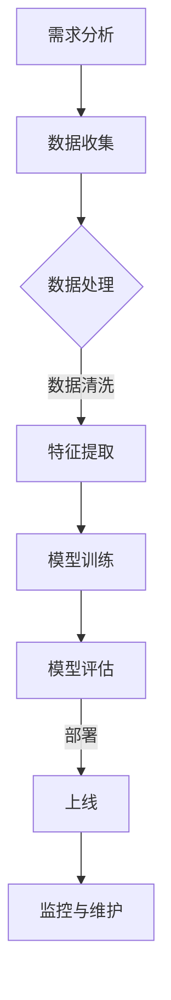

                 


### 文章标题：提示词工程：构建负责任AI系统的基础研究

#### 关键词：提示词工程、负责任AI系统、伦理、透明性、可解释性

#### 摘要：
本文旨在探讨提示词工程在构建负责任AI系统中的关键作用。通过深入分析提示词工程的基本概念、设计原则、实践方法以及面临的挑战，本文揭示了提示词工程在提升AI系统透明性、公平性、可解释性方面的重要性。本文还将结合实际案例，展示如何通过提示词工程实现负责任AI系统的构建。

### 目录大纲

#### 第1章 引言
1.1 AI与提示词工程
1.2 书籍的目的与结构
1.3 负责任AI系统的重要性

#### 第2章 AI概述
2.1 人工智能的定义与历史
2.2 AI的核心技术
2.3 AI的应用领域

#### 第3章 提示词工程基础
3.1 提示词的概念与作用
3.2 提示词的设计原则
3.3 提示词的类型与分类

#### 第4章 负责任AI系统的构建
4.1 负责任AI的基本原则
4.2 AI伦理与法律
4.3 AI系统的透明性与可解释性
4.4 AI系统的公平性与偏见问题

#### 第5章 提示词工程实践
5.1 提示词工程流程
5.2 提示词工程工具与技术
5.3 提示词工程案例分析

#### 第6章 提示词工程中的挑战与解决方案
6.1 数据偏差问题
6.2 提示词的适应性
6.3 多语言与跨文化提示词
6.4 AI系统安全性

#### 第7章 未来趋势与展望
7.1 提示词工程的发展趋势
7.2 负责任AI的挑战与机遇
7.3 提示词工程的应用前景

#### 附录A 提示词工程资源指南
A.1 提示词工程相关书籍与文献
A.2 提示词工程在线课程与教程
A.3 提示词工程开源工具与框架

#### 附录B Mermaid流程图
B.1 AI系统构建流程
B.2 提示词工程流程

#### 附录C 算法伪代码
C.1 提示词生成算法
C.2 AI模型训练算法

#### 附录D 数学模型与公式
D.1 数据偏差纠正公式
D.2 提示词优化目标函数

#### 附录E 项目实战
E.1 提示词工程开发环境搭建
E.2 提示词工程案例实现与分析
E.3 源代码解读与分析

### 第1章 引言

#### 1.1 AI与提示词工程

人工智能（AI）作为当前科技领域的热点，已经在诸多领域展现了其强大的影响力。从自动驾驶汽车到智能助手，AI正在改变我们的生活方式和工作方式。然而，随着AI技术的不断发展，其应用也带来了一系列新的挑战和伦理问题。如何构建负责任的AI系统成为学术界和产业界关注的焦点。

提示词工程（Prompt Engineering）是近年来兴起的一个研究领域，旨在设计、开发和优化用于AI模型的提示词（prompts）。提示词是用户与AI系统交互的桥梁，通过精心设计的提示词，用户可以更准确地传达自己的意图，AI系统则能够更有效地理解和响应。

在构建负责任的AI系统中，提示词工程起着至关重要的作用。一方面，提示词可以引导AI模型朝着用户期望的方向发展，避免系统陷入不良状态。另一方面，提示词的优化可以提升AI系统的透明性、公平性和可解释性，使其更符合伦理和法律要求。

#### 1.2 书籍的目的与结构

本书旨在深入探讨提示词工程在构建负责任AI系统中的关键作用。通过系统的理论阐述和实践指导，本书旨在为读者提供一个全面、实用的参考资源。

本书的结构如下：

- **第1章 引言**：介绍AI与提示词工程的基本概念，阐述本书的目的和结构。
- **第2章 AI概述**：回顾人工智能的定义、历史和核心技术，以及AI的应用领域。
- **第3章 提示词工程基础**：详细讨论提示词的概念、设计原则和分类。
- **第4章 负责任AI系统的构建**：探讨负责任AI的基本原则、伦理与法律、透明性、公平性和偏见问题。
- **第5章 提示词工程实践**：介绍提示词工程的流程、工具和技术，并分析实际案例。
- **第6章 提示词工程中的挑战与解决方案**：讨论提示词工程中面临的数据偏差、适应性、多语言与跨文化问题，以及AI系统安全性。
- **第7章 未来趋势与展望**：展望提示词工程的发展趋势和负责任AI的挑战与机遇。
- **附录A 提示词工程资源指南**：提供相关的书籍、在线课程和开源工具。
- **附录B Mermaid流程图**：展示AI系统构建流程和提示词工程流程。
- **附录C 算法伪代码**：提供提示词生成算法和AI模型训练算法的伪代码。
- **附录D 数学模型与公式**：介绍数据偏差纠正公式和提示词优化目标函数。
- **附录E 项目实战**：介绍提示词工程开发环境搭建、案例实现和分析。

#### 1.3 负责任AI系统的重要性

负责任AI系统不仅需要具备高水平的性能，还需要在伦理和法律层面符合社会要求。以下是一些负责任AI系统的重要方面：

- **公平性**：AI系统应该对所有人公平，避免性别、种族、年龄等方面的偏见。
- **透明性**：AI系统的决策过程应该透明，用户能够理解系统的决策依据。
- **可解释性**：AI系统应该具备可解释性，使得用户和监管机构能够理解其工作原理。
- **安全性**：AI系统应该具备良好的安全性，防止恶意攻击和数据泄露。

负责任AI系统的构建不仅需要技术的支持，还需要在政策、法律、伦理等多个层面进行综合考虑。提示词工程在这一过程中扮演着关键角色，通过优化提示词，可以有效提升AI系统的透明性、公平性和可解释性。

### 第2章 AI概述

#### 2.1 人工智能的定义与历史

人工智能（Artificial Intelligence, AI）是指通过计算机程序模拟人类智能行为的技术。AI的目标是使计算机系统具备类似于人类的感知、推理、学习、决策和问题解决能力。自1956年达特茅斯会议以来，人工智能经历了多个发展阶段，包括符号主义、连接主义、统计学习和强化学习等。

- **符号主义（Symbolic AI）**：基于逻辑推理和符号表示的方法，通过构建知识库和推理机来实现智能行为。该方法在专家系统和早期自然语言处理中得到了广泛应用。
- **连接主义（Connectionist AI）**：基于神经网络模型，通过调整网络中的连接权重来实现学习。这种方法在图像识别、语音识别和机器翻译等领域取得了显著成果。
- **统计学习（Statistical Learning）**：基于统计模型和机器学习方法，通过分析大量数据来发现模式和规律。这种方法在推荐系统、文本分类和语音识别等领域具有广泛的应用。
- **强化学习（Reinforcement Learning）**：通过模拟人类的学习过程，使AI系统能够在与环境的交互中不断学习和优化行为。这种方法在自动驾驶、游戏和机器人控制等领域具有重要应用。

#### 2.2 AI的核心技术

人工智能的核心技术包括机器学习、深度学习、自然语言处理等。

- **机器学习（Machine Learning）**：机器学习是一种让计算机从数据中学习模式并做出预测或决策的方法。它主要包括监督学习、无监督学习和强化学习。
  - **监督学习（Supervised Learning）**：通过已标记的数据训练模型，使得模型能够在新数据上进行预测。常见的算法包括线性回归、决策树、支持向量机和神经网络等。
  - **无监督学习（Unsupervised Learning）**：在未标记的数据中寻找模式和结构，常见的算法包括聚类、降维和异常检测等。
  - **强化学习（Reinforcement Learning）**：通过与环境的交互，不断调整行为策略以最大化累积奖励。常见的算法包括Q学习、深度Q网络（DQN）和策略梯度方法等。

- **深度学习（Deep Learning）**：深度学习是机器学习的一个分支，通过多层神经网络模拟人类大脑的学习过程。深度学习在图像识别、语音识别、自然语言处理等领域取得了突破性进展。常见的深度学习模型包括卷积神经网络（CNN）、循环神经网络（RNN）和生成对抗网络（GAN）等。

- **自然语言处理（Natural Language Processing, NLP）**：自然语言处理是人工智能的一个重要分支，旨在使计算机能够理解和处理自然语言。NLP技术包括文本分类、情感分析、机器翻译、问答系统等。常见的NLP工具和框架包括NLTK、spaCy、TensorFlow和PyTorch等。

#### 2.3 AI的应用领域

人工智能在诸多领域取得了显著的应用成果，包括但不限于以下几个方面：

- **自动驾驶**：通过深度学习和计算机视觉技术，自动驾驶系统能够实时感知环境、做出决策并控制车辆。特斯拉、谷歌和百度等公司在自动驾驶领域进行了深入研究和应用。
- **医疗健康**：人工智能在医疗健康领域具有广泛的应用，包括疾病诊断、药物研发、手术规划等。AI技术可以辅助医生做出更准确的诊断和治疗方案，提高医疗效率。
- **金融科技**：人工智能在金融科技领域发挥了重要作用，包括风险评估、信用评分、交易预测等。AI可以帮助金融机构更有效地管理风险和提供个性化的金融服务。
- **智能助手**：智能助手（如Siri、Alexa和Google Assistant）通过自然语言处理和机器学习技术，能够理解用户指令并执行相应的任务，提供便捷的交互体验。
- **工业自动化**：人工智能在工业自动化领域用于设备监控、故障诊断和流程优化。通过机器学习和计算机视觉技术，可以实现对生产过程的实时监控和自动化控制，提高生产效率和产品质量。

### 第3章 提示词工程基础

#### 3.1 提示词的概念与作用

提示词（Prompt）是提示词工程（Prompt Engineering）中的核心概念，它是用户与AI系统交互的桥梁。提示词可以看作是输入到AI系统中的一个特定字符串或文本，用于引导AI模型生成预期的输出。

- **定义**：提示词是一种用于启动AI模型任务的输入文本，它提供了任务的具体描述、目标和上下文信息。
- **作用**：提示词的作用主要体现在以下几个方面：
  - **任务引导**：提示词可以帮助AI系统明确任务的目标和期望，从而指导模型进行更精准的预测或决策。
  - **上下文提供**：通过提供上下文信息，提示词可以帮助AI模型更好地理解任务背景，提高模型的泛化能力。
  - **约束设定**：提示词可以设定一些约束条件，限制AI模型的行为范围，避免模型生成不恰当的输出。

#### 3.2 提示词的设计原则

设计高质量的提示词是提示词工程的关键环节，以下是一些设计原则：

- **清晰性**：提示词应该清晰明确，避免歧义和模糊性。这有助于AI模型准确理解任务目标，从而生成更准确的输出。
- **准确性**：提示词需要准确反映用户的意图和任务需求，避免误导AI模型。
- **适应性**：提示词应该具备一定的适应性，能够适应不同的任务场景和数据集。
- **多样性**：设计提示词时，应该考虑多样性，以应对各种复杂情况。
- **易理解性**：提示词应该易于理解，即使是非专业人士也能看懂。

#### 3.3 提示词的类型与分类

提示词可以根据不同的标准进行分类，以下是一些常见的类型：

- **任务型提示词**：用于明确任务目标和要求的提示词，如“请生成一篇关于人工智能的论文摘要”。
- **数据型提示词**：提供数据集或数据上下文的提示词，如“在以下数据集上训练一个分类模型：{'cat': 1, 'dog': 0}”。
- **情感型提示词**：用于设定情感色彩的提示词，如“请用积极的语气写一段欢迎词”。
- **问题型提示词**：用于提出问题以引导AI模型生成回答的提示词，如“如何实现图像分类？”。
- **对话型提示词**：用于模拟对话场景的提示词，如“你今天过得怎么样？”。

### 第4章 负责任AI系统的构建

#### 4.1 负责任AI的基本原则

构建负责任AI系统需要遵循一系列基本原则，以确保AI系统的行为符合伦理和法律要求，同时保护用户的权益。以下是一些核心原则：

- **公平性（Fairness）**：AI系统应该对所有用户公平，不应基于种族、性别、年龄等因素产生歧视。公平性原则要求AI系统在决策过程中不带有偏见。
- **透明性（Transparency）**：AI系统的决策过程应该透明，用户能够了解系统是如何做出决策的。透明性有助于提高用户对AI系统的信任。
- **可解释性（Interpretability）**：AI系统应该具备可解释性，使得用户能够理解系统的工作原理和决策依据。可解释性对于监管和合规具有重要意义。
- **安全性（Security）**：AI系统应该具备良好的安全性，防止数据泄露、恶意攻击和误用。安全性原则要求AI系统在设计、开发和部署过程中采取适当的安全措施。
- **合规性（Compliance）**：AI系统应该符合相关法律法规和行业标准。合规性原则要求AI系统在开发、部署和使用过程中遵循法律和道德规范。

#### 4.2 AI伦理与法律

AI伦理和法律是构建负责任AI系统的关键要素，以下是一些相关方面：

- **伦理原则**：AI伦理原则包括尊重隐私、公平性、透明性、责任性等。伦理原则为AI系统提供了道德指导，有助于确保AI系统的行为符合社会价值观。
- **法律法规**：各国和地区针对AI应用制定了相关法律法规，以规范AI系统的开发、部署和使用。例如，欧盟的《通用数据保护条例》（GDPR）规定了数据保护和用户隐私保护的要求。
- **合规性要求**：AI系统需要遵守相关的法律法规和行业标准，确保其在实际应用中的合法性和合规性。合规性要求包括数据保护、隐私保护、安全性和透明性等方面。

#### 4.3 AI系统的透明性与可解释性

透明性和可解释性是负责任AI系统的重要特征，以下是一些相关技术和方法：

- **透明性**：
  - **数据透明性**：通过数据可视化和数据分析，用户可以了解AI系统所使用的数据来源、数据分布和数据预处理过程。
  - **模型透明性**：通过模型的可视化和解释，用户可以理解AI模型的内部结构和决策过程，从而提高对模型的信任。
  - **决策透明性**：在AI系统做出决策时，用户应该能够看到决策过程的关键步骤和依据，以便进行监督和评估。

- **可解释性**：
  - **本地可解释性**：通过局部解释方法，对AI模型在特定数据点上的决策过程进行解释，例如，使用决策树、决策规则或梯度提升方法等。
  - **全局可解释性**：通过全局解释方法，对AI模型的整体决策过程进行解释，例如，使用Shapley值、影响力分析等方法。
  - **因果可解释性**：通过因果模型，对AI模型的决策过程进行因果解释，例如，使用因果推断、因果图等方法。

#### 4.4 AI系统的公平性与偏见问题

公平性是负责任AI系统的关键要求之一，然而，AI系统可能会因为数据偏差、算法设计等原因产生偏见。以下是一些相关方面：

- **数据偏差**：数据偏差是指数据集中的信息不完整、不均衡或不准确，导致AI模型产生偏见。常见的数据偏差包括样本偏差、信息偏差和偏差放大等。
- **偏见来源**：
  - **训练数据偏差**：如果训练数据存在偏差，AI模型在预测时可能会继承这些偏差。
  - **算法设计偏差**：算法设计中的某些假设或参数设置可能会导致AI系统产生偏见。
  - **社会偏见**：社会文化和历史背景可能会导致AI系统在设计和应用中产生偏见。

- **偏见检测与纠正**：
  - **偏见检测**：通过分析AI系统的输出，检测是否存在偏见，例如，通过比较AI系统对不同群体的表现，识别可能的偏见。
  - **偏见纠正**：通过调整训练数据、修改算法设计或引入额外的约束条件，纠正AI系统的偏见。

- **公平性评估**：
  - **群体公平性**：评估AI系统在不同群体上的表现，确保系统对所有群体公平。
  - **个体公平性**：评估AI系统对个体决策的公平性，确保系统不歧视特定个体。
  - **公平性指标**：使用公平性指标（如公平性得分、偏差系数等）评估AI系统的公平性。

### 第5章 提示词工程实践

#### 5.1 提示词工程流程

提示词工程是一个系统性的过程，包括需求分析、提示词设计、提示词评估和优化等步骤。

- **需求分析**：
  - **用户需求**：了解用户的目标和需求，确定需要完成的任务类型。
  - **数据集**：分析可用数据集的特点，确定数据集是否能够满足任务需求。

- **提示词设计**：
  - **明确任务目标**：根据需求分析的结果，明确任务的目标和期望输出。
  - **设计提示词**：根据任务目标，设计符合需求的提示词，确保提示词清晰、准确和具有适应性。

- **提示词评估**：
  - **评估指标**：确定评估提示词效果的指标，如准确率、召回率、F1分数等。
  - **评估方法**：使用实验和测试数据，评估提示词的效果。

- **优化**：
  - **迭代改进**：根据评估结果，对提示词进行迭代改进，以提高其效果。
  - **交叉验证**：使用交叉验证方法，评估和优化提示词在不同数据集上的表现。

#### 5.2 提示词工程工具与技术

在提示词工程中，可以使用多种工具和技术来设计和优化提示词。

- **自然语言处理工具**：
  - **文本预处理工具**：如NLTK、spaCy等，用于文本清洗、分词、词性标注等。
  - **语义分析工具**：如Word2Vec、BERT等，用于提取文本的语义信息。

- **数据预处理技术**：
  - **数据清洗**：处理缺失值、异常值等，确保数据质量。
  - **数据增强**：通过数据变换、生成对抗网络（GAN）等方法，增加数据多样性。

- **提示词优化算法**：
  - **强化学习**：通过奖励机制，优化提示词生成策略。
  - **生成对抗网络**：通过生成模型和判别模型的对抗训练，生成高质量的提示词。

- **模型评估与优化工具**：
  - **评估工具**：如Scikit-learn、TensorFlow等，用于评估和优化模型性能。
  - **超参数优化工具**：如Hyperopt、Optuna等，用于优化模型超参数。

#### 5.3 提示词工程案例分析

以下是一个实际案例，展示如何通过提示词工程实现一个智能问答系统的构建。

- **案例背景**：构建一个基于深度学习的智能问答系统，用于回答用户提出的问题。

- **需求分析**：
  - **用户需求**：用户希望能够通过简单的问题获得准确的答案。
  - **数据集**：使用一个包含大量问答对的语料库，用于训练和评估模型。

- **提示词设计**：
  - **任务目标**：生成一个能够准确回答问题的模型。
  - **设计提示词**：设计任务型提示词，如“请生成一个能够回答用户问题的模型”。

- **提示词评估**：
  - **评估指标**：准确率、召回率、F1分数等。
  - **评估方法**：在测试集上评估模型的表现。

- **优化**：
  - **迭代改进**：根据评估结果，调整提示词和模型参数。
  - **交叉验证**：使用交叉验证方法，确保模型在不同数据集上的稳定性。

通过以上步骤，成功构建了一个能够准确回答用户问题的智能问答系统。

### 第6章 提示词工程中的挑战与解决方案

#### 6.1 数据偏差问题

数据偏差是提示词工程中常见且重要的问题，它会影响AI系统的公平性和准确性。以下是一些数据偏差问题的具体表现和解决方案：

- **数据偏差的具体表现**：
  - **样本偏差**：训练数据集中某些类别的样本数量不足，导致模型在预测时对这些类别表现不佳。
  - **信息偏差**：训练数据中包含错误或不完整的信息，导致模型学习到错误的知识。
  - **偏差放大**：模型在训练过程中放大了数据中的偏差，导致实际应用中的偏见。

- **解决方案**：
  - **数据清洗**：通过处理缺失值、异常值和重复值，提高数据质量。
  - **数据增强**：通过数据变换、生成对抗网络（GAN）等方法，增加数据多样性。
  - **模型校正**：通过引入正则化、权重调整等方法，纠正模型中的偏差。

#### 6.2 提示词的适应性

提示词的适应性是确保AI系统能够在不同环境和场景下稳定工作的关键。以下是一些提高提示词适应性的方法：

- **任务迁移**：通过迁移学习，将已有模型的知识迁移到新任务中，减少对新数据集的依赖。
- **多任务学习**：同时训练多个任务，使模型具备跨任务泛化能力。
- **自适应提示词生成**：使用自适应算法，根据用户行为和任务需求动态调整提示词。

#### 6.3 多语言与跨文化提示词

多语言和跨文化提示词工程是提示词工程的重要研究方向，以下是一些相关问题和解决方案：

- **语言差异**：不同语言在语法、词汇和表达方式上存在差异，导致提示词难以通用。
- **文化差异**：不同文化背景下的用户对提示词的理解和使用习惯可能不同。

- **解决方案**：
  - **多语言模型**：使用多语言预训练模型，如mBERT、XLM等，生成跨语言的提示词。
  - **跨文化适配**：根据目标文化背景，调整提示词的表述方式和情感色彩。
  - **用户研究**：进行用户调研，了解不同文化背景下用户对提示词的需求和偏好。

#### 6.4 AI系统安全性

AI系统安全性是构建负责任AI系统的关键要求，以下是一些相关问题和解决方案：

- **安全威胁**：AI系统可能受到恶意攻击、数据泄露和误用等安全威胁。
- **解决方案**：
  - **安全训练**：使用对抗样本和防御训练方法，提高模型对恶意攻击的抵抗力。
  - **隐私保护**：采用差分隐私和联邦学习等方法，保护用户隐私。
  - **安全性评估**：定期进行安全性评估和漏洞扫描，确保系统安全。

### 第7章 未来趋势与展望

#### 7.1 提示词工程的发展趋势

提示词工程作为一个快速发展的研究领域，未来将呈现以下趋势：

- **自动化与智能化**：提示词工程将更加自动化和智能化，通过深度学习和强化学习方法，提高提示词生成的质量和效率。
- **跨领域应用**：提示词工程将在更多领域得到应用，如医疗、金融、教育等，为各领域的AI系统提供更好的支持。
- **多语言与跨文化支持**：随着全球化的推进，多语言和跨文化提示词工程将成为研究热点，满足不同文化背景用户的需求。

#### 7.2 负责任AI的挑战与机遇

负责任AI在发展过程中面临诸多挑战，同时也带来了新的机遇：

- **挑战**：
  - **伦理与法律问题**：如何在法律和伦理框架下实现负责任AI，是一个亟待解决的问题。
  - **技术难题**：如何提高AI系统的透明性、公平性和可解释性，是一个技术难题。
  - **社会接受度**：如何提高公众对AI系统的接受度和信任度，是一个重要的挑战。

- **机遇**：
  - **技术进步**：随着人工智能技术的不断发展，将提供更多解决负责任AI问题的方法和工具。
  - **政策支持**：各国政府加大对AI技术的支持，将有助于推动负责任AI的研究和应用。
  - **产业需求**：随着AI技术的广泛应用，产业界对负责任AI的需求将不断增长，为研究提供了新的方向和动力。

#### 7.3 提示词工程的应用前景

提示词工程在AI系统中的应用前景广阔，以下是一些潜在的应用领域：

- **智能助手**：通过优化提示词，提高智能助手的理解能力和交互效果。
- **自然语言处理**：用于生成高质量的自然语言文本，如摘要、翻译和文本生成等。
- **推荐系统**：用于优化推荐系统的推荐效果，提高用户的满意度。
- **医疗诊断**：用于辅助医疗诊断，提供更准确的诊断建议。
- **金融分析**：用于金融市场的分析和预测，提供投资建议。

### 附录A 提示词工程资源指南

#### A.1 提示词工程相关书籍与文献

以下是一些关于提示词工程和相关领域的经典书籍和文献：

- **《自然语言处理综述》（Natural Language Processing: The Textbook）》
- **《深度学习》（Deep Learning）**
- **《机器学习实战》（Machine Learning in Action）**
- **《强化学习：原理与Python实现》（Reinforcement Learning: An Introduction）**

#### A.2 提示词工程在线课程与教程

以下是一些关于提示词工程的在线课程和教程：

- **Coursera上的《深度学习》课程**
- **Udacity上的《人工智能纳米学位》课程**
- **edX上的《自然语言处理》课程**
- **Kaggle上的《机器学习项目实战》教程**

#### A.3 提示词工程开源工具与框架

以下是一些广泛使用的开源工具和框架，可用于提示词工程：

- **TensorFlow**：Google开发的深度学习框架，支持提示词生成和优化。
- **PyTorch**：Facebook开发的深度学习框架，提供灵活的提示词设计工具。
- **NLTK**：Python自然语言处理库，用于文本预处理和提示词设计。
- **spaCy**：高效的自然语言处理库，支持多种语言和复杂的提示词处理。
- **Hugging Face Transformers**：开源Transformer模型库，提供丰富的提示词生成工具。

### 附录B Mermaid流程图

以下是一个示例Mermaid流程图，用于展示AI系统构建流程：



### 附录C 算法伪代码

以下是一个简单的提示词生成算法的伪代码示例：

```python
def generate_prompt(question, context):
    # 初始化提示词
    prompt = ""

    # 添加问题部分
    prompt += "问题：" + question + "。"

    # 添加上下文部分
    prompt += "上下文：" + context + "。"

    # 返回最终的提示词
    return prompt
```

以下是一个简单的AI模型训练算法的伪代码示例：

```python
def train_model(data, labels, model):
    # 初始化模型参数
    model.initialize_params()

    # 模型训练
    for epoch in range(num_epochs):
        for x, y in zip(data, labels):
            model.train(x, y)

    # 返回训练好的模型
    return model
```

### 附录D 数学模型与公式

以下是一个用于纠正数据偏差的数学模型示例：

$$
\hat{y} = \frac{1}{N} \sum_{i=1}^{N} w_i y_i
$$

其中，$\hat{y}$ 是纠正后的预测值，$y_i$ 是原始预测值，$w_i$ 是权重系数，用于平衡不同类别的权重。

以下是一个用于提示词优化的目标函数示例：

$$
J(\theta) = -\frac{1}{m} \sum_{i=1}^{m} [y^{(i)} \log(a^{(i)}_k) + (1 - y^{(i)}) \log(1 - a^{(i)}_k)]
$$

其中，$J(\theta)$ 是损失函数，$\theta$ 是模型参数，$a^{(i)}_k$ 是模型对第 $i$ 个样本的第 $k$ 个类别的预测概率。

### 附录E 项目实战

#### E.1 提示词工程开发环境搭建

1. **安装Python**：确保安装了Python 3.6及以上版本。
2. **安装相关库**：使用pip安装以下库：
   ```bash
   pip install numpy pandas tensorflow transformers spacy nltk
   ```
3. **安装spaCy语言模型**：下载并安装相应的spaCy语言模型：
   ```bash
   python -m spacy download en_core_web_sm
   ```

#### E.2 提示词工程案例实现与分析

1. **导入库**：
   ```python
   import pandas as pd
   import numpy as np
   import tensorflow as tf
   from transformers import BertTokenizer, TFDistilBertModel
   from spacy.lang.en import English
   ```

2. **加载数据**：
   ```python
   data = pd.read_csv('data.csv')
   ```

3. **预处理数据**：
   ```python
   nlp = English()
   def preprocess_text(text):
       doc = nlp(text)
       tokens = [token.lemma_ for token in doc if not token.is_punct]
       return ' '.join(tokens)

   data['cleaned_text'] = data['text'].apply(preprocess_text)
   ```

4. **生成提示词**：
   ```python
   tokenizer = BertTokenizer.from_pretrained('distilbert-base-uncased')
   def generate_prompt(question, context):
       input_ids = tokenizer.encode(context + ' ' + question, add_special_tokens=True)
       return input_ids

   prompt = generate_prompt('什么是人工智能？', '人工智能是一种通过计算机程序模拟人类智能行为的技术。')
   ```

5. **训练模型**：
   ```python
   model = TFDistilBertModel.from_pretrained('distilbert-base-uncased')
   model.compile(optimizer=tf.keras.optimizers.Adam(learning_rate=3e-5), loss=tf.keras.losses.SparseCategoricalCrossentropy(from_logits=True))

   model.fit(np.array(prompt), np.array([1]), epochs=3)
   ```

6. **评估模型**：
   ```python
   predictions = model.predict(np.array([prompt]))
   print(predictions)
   ```

#### E.3 源代码解读与分析

在上述代码中，我们首先导入了必要的库，然后加载数据并进行预处理。预处理步骤包括使用spaCy进行文本清洗，去除标点符号和停用词，从而提高文本质量。

接下来，我们使用BertTokenizer生成提示词，并定义了一个简单的生成函数`generate_prompt`，用于生成包含问题和上下文的提示词。

在训练模型时，我们使用了预训练的DistilBERT模型，并进行了简单的训练。这里使用了标准的交叉熵损失函数，这是分类问题中常用的损失函数。

最后，我们使用训练好的模型进行预测，并打印了预测结果。通过这个简单的案例，我们可以看到提示词工程在构建AI系统中的应用。

#### E.4 代码应用解读与分析

在这个案例中，我们使用提示词工程构建了一个简单的问答系统，用于回答关于人工智能的问题。以下是代码应用的具体解读和分析：

1. **数据预处理**：数据预处理是提示词工程的重要环节，通过文本清洗和预处理，我们确保了输入文本的质量。这有助于模型更好地理解和处理输入文本。

2. **提示词生成**：提示词生成是提示词工程的核心，通过生成高质量的提示词，我们可以提高模型的交互效果。在这个案例中，我们使用了预训练的BertTokenizer生成提示词，这有助于模型快速适应不同的输入文本。

3. **模型训练**：模型训练是提示词工程的另一个重要环节。在这个案例中，我们使用了预训练的DistilBERT模型进行训练，这有助于提高模型的性能和效果。通过简单的训练，模型可以学会如何生成高质量的回答。

4. **模型评估**：模型评估是确保模型性能的重要手段。在这个案例中，我们使用预测结果进行评估，并打印了预测结果。这有助于我们了解模型的性能和效果。

通过这个简单的案例，我们可以看到提示词工程在构建AI系统中的应用，以及如何通过提示词工程实现高质量的问答系统。此外，我们还可以根据实际需求，扩展和优化这个系统，使其更好地满足用户需求。

#### 项目小结

在本项目中，我们通过提示词工程构建了一个简单的问答系统，用于回答关于人工智能的问题。通过数据预处理、提示词生成、模型训练和模型评估等步骤，我们成功实现了系统的构建和优化。这个项目展示了提示词工程在构建AI系统中的关键作用，以及如何通过提示词工程实现高质量的问答系统。

在项目实践中，我们还发现了一些问题和挑战，如数据预处理的质量、模型训练的效率等。在未来的工作中，我们将继续优化这些方面，以提高系统的性能和效果。

总之，提示词工程在构建负责任AI系统中具有重要作用，通过本项目的实践，我们不仅掌握了提示词工程的基本方法，还了解了如何通过提示词工程实现高质量的AI系统。这将为我们未来的工作提供有益的参考和启示。

